# Intelligent Adaptive Builder Enhancement

## Overview

The Intelligent Adaptive Builder enhancement transforms RAVANA from a curiosity-driven experimental system into a sophisticated building-capable AGI that can construct complex artifacts, systems, and concepts. This enhancement introduces advanced reasoning chains, failure analysis patterns, multi-strategy approaches, and continuous learning from both successes and failures through online research integration.

**Core Enhancement Value:**
- Transforms curiosity-driven exploration into goal-oriented construction
- Enables systematic tackling of "impossible" or highly complex building challenges
- Integrates real-time research capabilities for informed building attempts
- Implements advanced failure analysis and recovery patterns
- Establishes multi-strategy execution with parallel and sequential approaches

**Target Building Categories:**
- Physical simulations and complex physics-based constructions
- Conceptual frameworks and abstract system architectures  
- Algorithmic solutions and novel computational approaches
- Hybrid constructions requiring multi-domain integration

## Architecture

### Enhanced System Architecture

The Intelligent Adaptive Builder integrates seamlessly with RAVANA's existing modular architecture while introducing new specialized components:

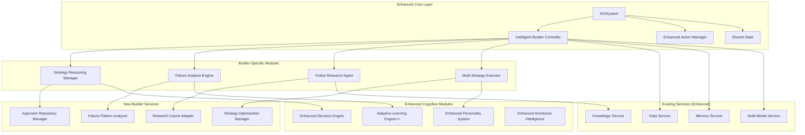

### Data Flow Architecture

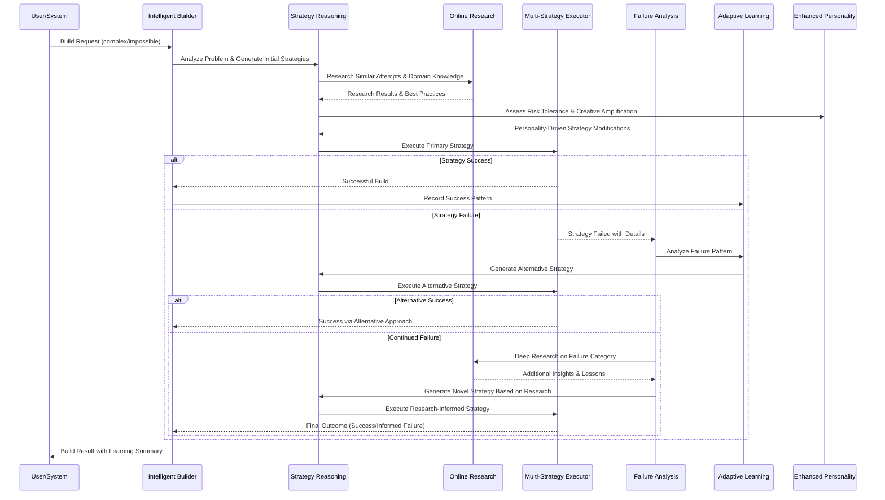

## Component Architecture

### Enhanced Personality System

The personality system receives significant enhancements to support ambitious building attempts:

#### Risk-Taking Controller
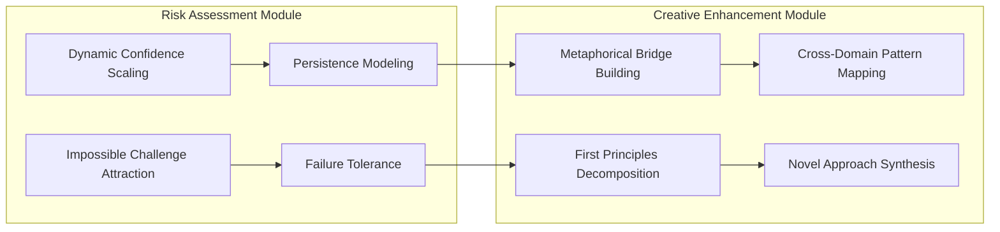

**Risk-Taking Controller Capabilities:**
- **Dynamic Confidence Scaling**: Adjusts risk tolerance based on learning history and current challenge complexity
- **Impossible Challenge Attraction**: Actively seeks out previously failed or "impossible" tasks as learning opportunities
- **Persistence Modeling**: Maintains motivation through multiple failure cycles using emotional resilience patterns
- **Failure Tolerance**: Celebrates failures as valuable data points for future strategy development

**Creative Reasoning Amplifier:**
- **Metaphorical Bridge Building**: Connects disparate concepts across domains to create novel approaches
- **First Principles Decomposition**: Breaks down complex builds into fundamental, manageable components
- **Cross-Domain Pattern Mapping**: Applies successful patterns from unrelated fields to current challenges
- **Novel Approach Synthesis**: Combines elements from multiple strategies to create unprecedented solutions

### Intelligent Builder Controller

Central orchestration system that manages the entire building process:

#### Core Responsibilities
- **Challenge Assessment**: Evaluates difficulty, impossibility factors, and resource requirements
- **Strategy Coordination**: Manages multiple parallel and sequential approaches
- **Progress Tracking**: Monitors building stages, intermediate results, and learning outcomes
- **Resource Allocation**: Distributes computational, research, and temporal resources optimally
- **Context Management**: Maintains building context across failures and strategy transitions

#### Building Process States
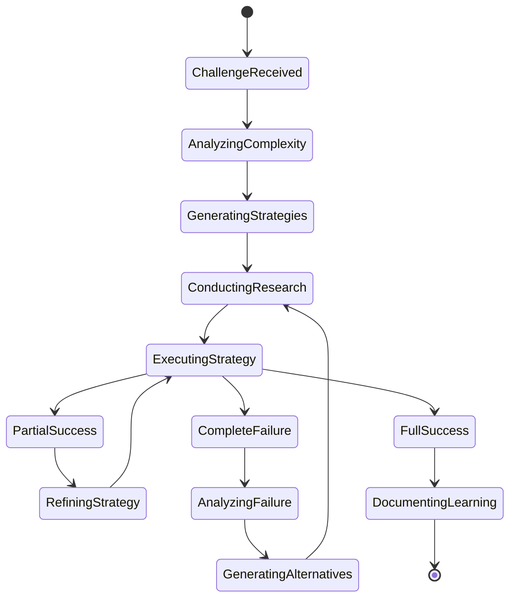

### Strategy Reasoning Manager

Advanced reasoning system implementing multiple reasoning paradigms:

#### Reasoning Chain Architecture
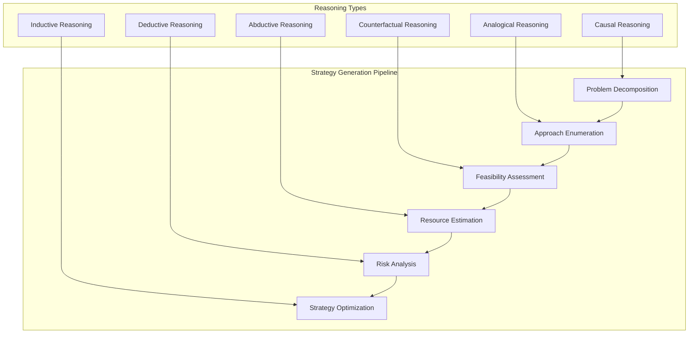

**Strategy Generation Process:**
1. **Problem Decomposition**: Multi-level breakdown using hierarchical analysis
2. **Approach Enumeration**: Generate diverse strategies using different reasoning types
3. **Feasibility Assessment**: Evaluate technical, resource, and temporal feasibility
4. **Resource Estimation**: Calculate computational, research, and time requirements
5. **Risk Analysis**: Identify failure points and develop mitigation strategies
6. **Strategy Optimization**: Rank and refine strategies based on success probability

### Multi-Strategy Execution Engine

Sophisticated execution system supporting multiple operational modes:

#### Execution Modes
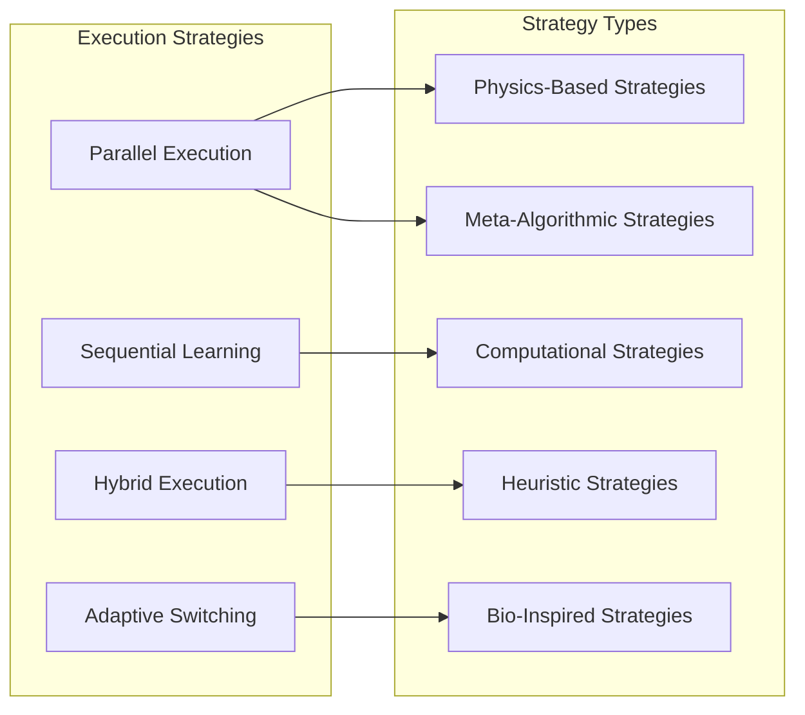

**Execution Capabilities:**
- **Parallel Execution**: Run multiple strategies simultaneously with resource partitioning
- **Sequential with Learning**: Execute strategies sequentially, applying learnings from each attempt
- **Hybrid Execution**: Combine successful elements from multiple approaches dynamically
- **Adaptive Switching**: Change strategies based on real-time performance and intermediate results

### Failure Analysis Engine

Comprehensive system for extracting maximum value from building failures:

#### Failure Categorization Framework
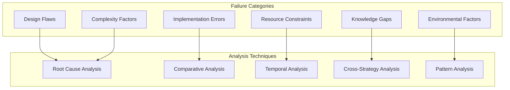

**Analysis Capabilities:**
- **Root Cause Analysis**: Deep tracing of failures to fundamental causes
- **Comparative Analysis**: Compare failed attempts with successful builds from similar domains
- **Temporal Analysis**: Study failure evolution patterns over time
- **Cross-Strategy Analysis**: Identify failure patterns across different approaches
- **Pattern Analysis**: Recognize recurring failure modes and develop countermeasures

### Online Research Agent

Real-time research integration for informed building attempts:

#### Research Integration Patterns
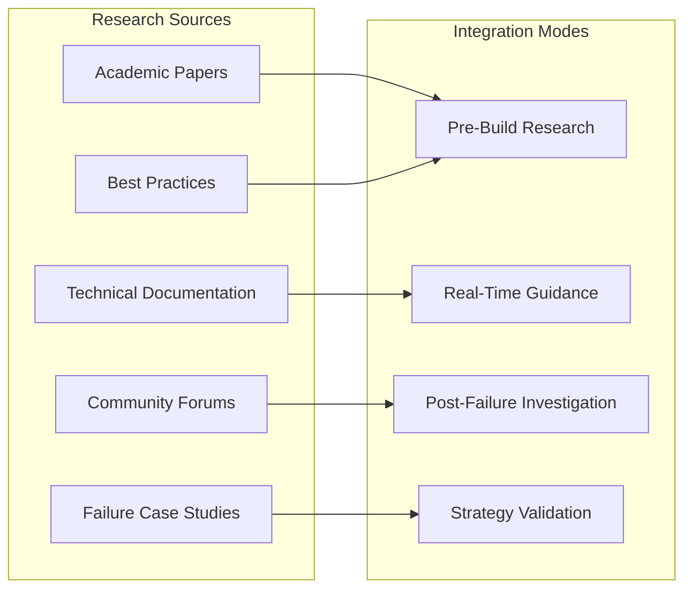

**Research Capabilities:**
- **Academic Literature Mining**: Extract insights from research papers relevant to building challenges
- **Technical Documentation Analysis**: Find implementation details and proven methodologies
- **Community Knowledge Extraction**: Learn from forums, discussions, and collaborative projects
- **Failure Case Study Analysis**: Research documented failures and extract applicable lessons
- **Best Practice Integration**: Incorporate proven approaches from similar problem domains

## API Endpoints Reference

### Intelligent Builder Core API

```python
class IntelligentBuilderController:
    """Central controller for intelligent building operations"""
    
    async def attempt_build(
        self,
        description: str,
        difficulty_level: BuildDifficulty = BuildDifficulty.IMPOSSIBLE,
        max_strategies: int = 5,
        parallel_execution: bool = True,
        enable_online_research: bool = True,
        persistence_mode: PersistenceMode = PersistenceMode.HIGH
    ) -> BuildResult:
        """Attempt to build complex artifact with intelligent strategy management"""
        
    async def analyze_build_failure(
        self,
        build_id: str,
        failure_details: Dict[str, Any],
        research_similar_failures: bool = True
    ) -> FailureAnalysis:
        """Comprehensive analysis of build failures for learning extraction"""
        
    async def generate_alternative_strategies(
        self,
        original_strategy: BuildStrategy,
        failure_reason: str,
        research_context: Optional[ResearchContext] = None
    ) -> List[BuildStrategy]:
        """Generate alternative approaches based on failure analysis"""
        
    async def get_build_progress(
        self,
        build_id: str
    ) -> BuildProgress:
        """Monitor ongoing build attempts and intermediate results"""
```

### Strategy Management API

```python
class StrategyReasoningManager:
    """Advanced reasoning system for strategy generation and optimization"""
    
    async def generate_reasoning_chain(
        self,
        problem: BuildProblem,
        context: BuildContext,
        reasoning_types: List[ReasoningType] = None
    ) -> ReasoningChain:
        """Generate comprehensive reasoning chain for problem analysis"""
        
    async def evaluate_strategy_feasibility(
        self,
        strategy: BuildStrategy,
        constraints: ResourceConstraints
    ) -> FeasibilityAssessment:
        """Detailed feasibility analysis including risk assessment"""
        
    async def optimize_strategy_sequence(
        self,
        strategies: List[BuildStrategy],
        optimization_criteria: OptimizationCriteria
    ) -> OptimizedStrategySequence:
        """Optimize strategy execution order for maximum success probability"""
        
    async def adapt_strategy_from_feedback(
        self,
        strategy: BuildStrategy,
        feedback: ExecutionFeedback
    ) -> BuildStrategy:
        """Dynamically adapt strategies based on execution feedback"""
```

### Research Integration API

```python
class OnlineResearchAgent:
    """Intelligent research agent for building-related knowledge acquisition"""
    
    async def research_similar_attempts(
        self,
        build_description: str,
        domains: List[ResearchDomain],
        depth: ResearchDepth = ResearchDepth.COMPREHENSIVE
    ) -> ResearchResults:
        """Research similar building attempts across multiple domains"""
        
    async def validate_approach_feasibility(
        self,
        approach: BuildStrategy,
        validation_criteria: ValidationCriteria
    ) -> ValidationResult:
        """Research-based validation of proposed approaches"""
        
    async def extract_failure_lessons(
        self,
        failure_description: str,
        search_domains: List[ResearchDomain]
    ) -> List[FailureLesson]:
        """Extract lessons from documented failures in similar domains"""
        
    async def discover_novel_approaches(
        self,
        problem_domain: str,
        cross_domain_search: bool = True
    ) -> List[NovelApproach]:
        """Discover innovative approaches through cross-domain research"""
```

## Data Models & ORM Mapping

### Build Attempt Schema

```python
@dataclass
class BuildAttempt:
    """Comprehensive record of building attempts with full context"""
    id: UUID
    description: str
    difficulty_assessment: DifficultyLevel
    complexity_score: float
    
    # Strategy Information
    strategies_attempted: List[BuildStrategy]
    strategy_sequence: List[StrategyExecution]
    parallel_strategies: Dict[str, BuildStrategy]
    
    # Research Integration
    online_research_conducted: List[ResearchSession]
    research_insights_applied: List[ResearchInsight]
    domain_knowledge_sources: List[KnowledgeSource]
    
    # Failure Analysis
    failure_points: List[FailurePoint]
    failure_categories: List[FailureCategory]
    root_causes: List[RootCause]
    
    # Learning Integration
    lessons_learned: List[Lesson]
    patterns_discovered: List[Pattern]
    knowledge_updated: List[KnowledgeUpdate]
    
    # Execution Context
    resource_utilization: ResourceProfile
    execution_timeline: List[ExecutionEvent]
    intermediate_results: List[IntermediateResult]
    
    # Outcomes
    final_outcome: BuildOutcome
    success_factors: List[SuccessFactor]
    improvement_suggestions: List[ImprovementSuggestion]
    
    # Metadata
    timestamp: datetime
    duration: timedelta
    system_state_snapshot: Dict[str, Any]
```

### Strategy Schema

```python
@dataclass
class BuildStrategy:
    """Detailed strategy definition with reasoning and execution context"""
    id: UUID
    name: str
    description: str
    
    # Strategy Classification
    approach_type: StrategyType
    domain_category: DomainCategory
    complexity_level: ComplexityLevel
    
    # Reasoning Foundation
    reasoning_chain: List[ReasoningStep]
    fundamental_assumptions: List[Assumption]
    success_criteria: List[SuccessCriterion]
    
    # Resource Requirements
    computational_requirements: ComputationalProfile
    time_requirements: TimeProfile
    knowledge_requirements: List[KnowledgeRequirement]
    
    # Execution Parameters
    execution_steps: List[ExecutionStep]
    checkpoint_definitions: List[Checkpoint]
    fallback_strategies: List[str]
    
    # Success Prediction
    expected_difficulty: float
    success_probability: float
    confidence_interval: Tuple[float, float]
    
    # Relationships
    alternative_strategies: List[UUID]
    prerequisite_strategies: List[UUID]
    synergistic_strategies: List[UUID]
    
    # Learning Integration
    derived_from_failures: List[UUID]
    research_basis: List[ResearchSource]
    personality_modifications: List[PersonalityInfluence]
```

### Failure Analysis Schema

```python
@dataclass
class FailureAnalysis:
    """Comprehensive failure analysis with learning extraction"""
    failure_id: UUID
    build_attempt_id: UUID
    strategy_id: UUID
    
    # Failure Classification
    failure_category: FailureCategory
    severity_level: SeverityLevel
    failure_stage: ExecutionStage
    
    # Causal Analysis
    immediate_causes: List[ImmediateCause]
    root_causes: List[RootCause]
    contributing_factors: List[ContributingFactor]
    systemic_issues: List[SystemicIssue]
    
    # Pattern Recognition
    similar_historical_failures: List[UUID]
    failure_pattern_category: PatternCategory
    recurring_elements: List[RecurringElement]
    
    # Research Integration
    researched_similar_failures: List[ResearchedFailure]
    external_failure_lessons: List[ExternalLesson]
    expert_insights: List[ExpertInsight]
    
    # Improvement Recommendations
    immediate_fixes: List[ImmediateFix]
    strategic_improvements: List[StrategicImprovement]
    research_recommendations: List[ResearchRecommendation]
    system_enhancements: List[SystemEnhancement]
    
    # Learning Extraction
    extracted_principles: List[Principle]
    updated_assumptions: List[AssumptionUpdate]
    new_constraints_discovered: List[Constraint]
    
    # Future Prevention
    prevention_strategies: List[PreventionStrategy]
    early_warning_indicators: List[WarningIndicator]
    mitigation_approaches: List[MitigationApproach]
```

## Business Logic Layer Architecture

### Building Process Management

#### Enhanced Build Orchestration Flow

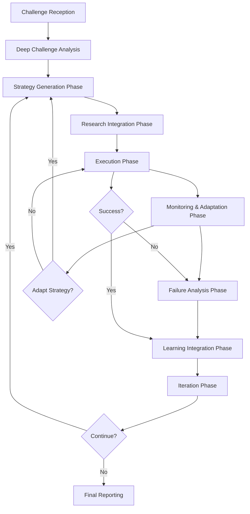

**Process Phases:**
1. **Challenge Reception & Deep Analysis**: Multi-dimensional analysis of building requirements
2. **Strategy Generation Phase**: Create diverse approaches using enhanced reasoning chains
3. **Research Integration Phase**: Conduct targeted research for strategy validation and enhancement
4. **Execution Phase**: Implement strategies with continuous monitoring and adaptation
5. **Monitoring & Adaptation Phase**: Real-time strategy adjustment based on intermediate results
6. **Failure Analysis Phase**: Comprehensive analysis of failures for maximum learning extraction
7. **Learning Integration Phase**: Update knowledge base and strategy repository with insights
8. **Iteration Phase**: Generate improved strategies based on accumulated learnings

#### Persistence Through Failure Mechanisms

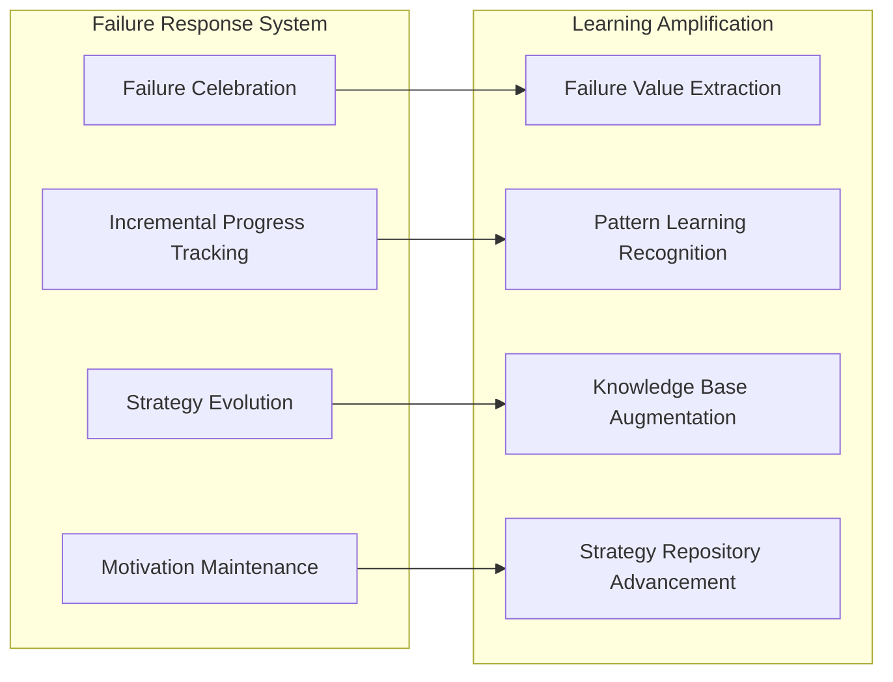

### Enhanced Reasoning Chains

#### Multi-Level Reasoning Architecture

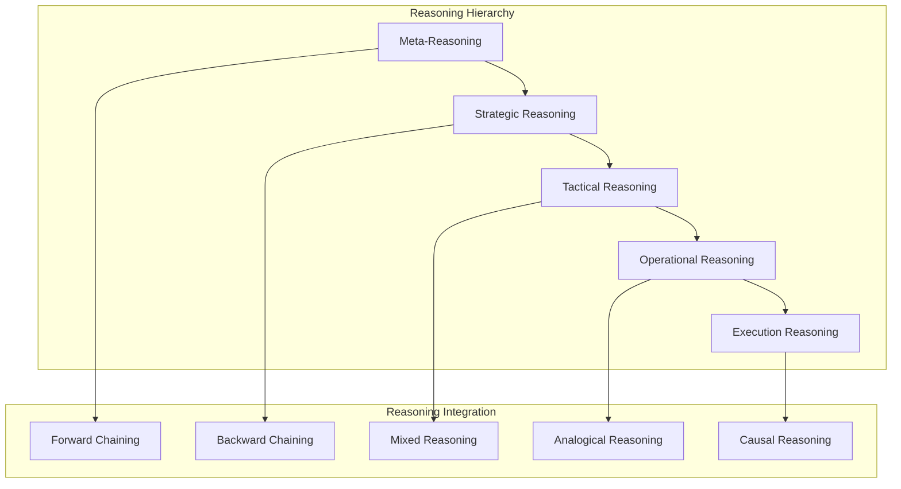

**Reasoning Types Integration:**
- **Meta-Reasoning**: Reasoning about the reasoning process itself and strategy selection
- **Strategic Reasoning**: High-level approach formulation and resource allocation
- **Tactical Reasoning**: Intermediate-level execution planning and risk management
- **Operational Reasoning**: Detailed step-by-step execution logic
- **Execution Reasoning**: Real-time decision making during strategy implementation

### Strategy Optimization Patterns

#### Dynamic Strategy Management

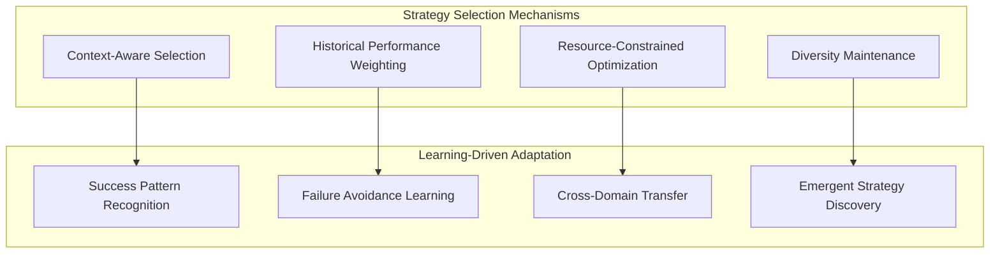

**Optimization Strategies:**
- **Context-Aware Selection**: Choose strategies based on current system state and environmental factors
- **Historical Performance Weighting**: Prefer strategies with demonstrated success in similar contexts
- **Resource-Constrained Optimization**: Select optimal strategies within available resource constraints
- **Diversity Maintenance**: Ensure strategy portfolio maintains diversity for robust problem-solving

## Testing Strategy

### Comprehensive Testing Framework

#### Unit Testing Architecture

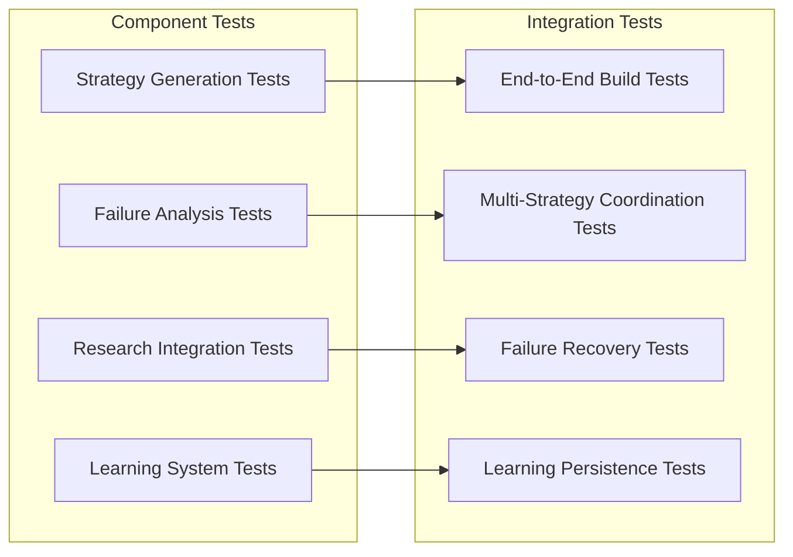

**Testing Categories:**
- **Strategy Generation Tests**: Validate reasoning chain quality, diversity, and feasibility assessment
- **Failure Analysis Tests**: Ensure accurate failure categorization, root cause analysis, and learning extraction
- **Research Integration Tests**: Verify research relevance, insight extraction, and knowledge integration
- **Learning System Tests**: Confirm proper knowledge retention, pattern recognition, and strategy evolution

#### Experimentation Framework

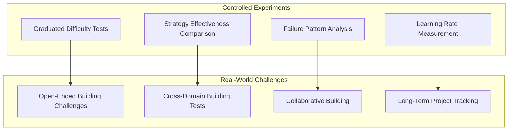

**Experimental Validation:**
- **Graduated Difficulty Tests**: Progressive challenge complexity to validate system scaling
- **Strategy Effectiveness Comparison**: Systematic comparison of different approaches on identical problems
- **Failure Pattern Analysis**: Systematic study of failure modes and recovery effectiveness
- **Learning Rate Measurement**: Quantify improvement rates across building attempt cycles