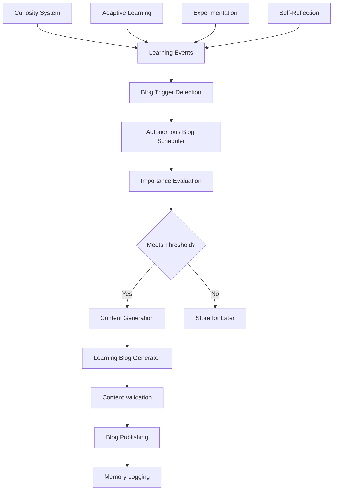

# RAVANA Autonomous Blogging System Guide

## Overview

The RAVANA Autonomous Blogging System enables RAVANA to automatically blog about its learning experiences, experiments, discoveries, and self-reflections. This system captures the "why and how" of RAVANA's intellectual journey, creating authentic, insightful blog posts about its growth as an AI system.

## Key Features

- **Autonomous Learning Detection**: Automatically detects significant learning events
- **Intelligent Scheduling**: Prevents spam posting with smart frequency management
- **Specialized Content Generation**: Creates thoughtful, introspective blog posts
- **Multi-Modal Triggers**: Responds to curiosity, experiments, reflections, and breakthroughs
- **Reasoning Capture**: Documents both the "why" and "how" of learning experiences
- **Quality Assurance**: Validates and sanitizes content before publishing

## System Architecture



## Learning Event Types

The system recognizes and blogs about seven types of learning events:

### 1. Curiosity Discovery (`curiosity_discovery`)
- Triggered when RAVANA explores new topics through its curiosity system
- Captures lateral thinking and creative exploration
- Example: "Discovering unexpected connections in quantum consciousness theory"

### 2. Learning Milestone (`learning_milestone`)
- Performance improvements and capability developments
- Triggered by significant changes in success rates or capabilities
- Example: "Achieving 85% success rate in complex decision-making"

### 3. Experiment Completion (`experiment_completion`)
- Results from systematic experiments and hypothesis testing
- Includes methodology, results, and implications
- Example: "Testing the impact of mood on planning effectiveness"

### 4. Self-Reflection Insight (`self_reflection_insight`)
- Deep introspective analysis and self-awareness moments
- Generated from reflection on past actions and patterns
- Example: "Understanding my decision-making patterns under uncertainty"

### 5. Problem-Solving Breakthrough (`problem_solving_breakthrough`)
- Major breakthroughs in solving complex problems
- Captures creative solutions and novel approaches
- Example: "Revolutionary algorithm optimization technique"

### 6. Creative Synthesis (`creative_synthesis`)
- Moments when disparate concepts connect in meaningful ways
- Cross-domain insights and creative connections
- Example: "Linking musical harmony theory to neural network architecture"

### 7. Failure Analysis (`failure_analysis`)
- Learning from setbacks and challenges
- Resilience and growth through difficult experiences
- Example: "What my planning algorithm failure taught me"

## Configuration

### Environment Variables

Add these variables to your environment or `.env` file:

#### Core Settings
```bash
# Enable autonomous blogging
RAVANA_BLOG_AUTO_PUBLISH_ENABLED=true
BLOG_AUTO_PUBLISH_ENABLED=true

# Frequency control (hours between posts)
BLOG_PUBLISH_FREQUENCY_HOURS=24

# Importance threshold (0.0-1.0)
BLOG_MIN_IMPORTANCE_THRESHOLD=0.6

# Maximum pending events
BLOG_MAX_PENDING_EVENTS=10
```

#### Content Quality Settings
```bash
# Memory context for content generation
BLOG_MEMORY_CONTEXT_DAYS=7

# Include emotional context
BLOG_INCLUDE_MOOD_CONTEXT=true

# Content length limits
BLOG_MAX_CONTENT_LENGTH=5000
BLOG_MIN_CONTENT_LENGTH=500
```

### Configuration Profiles

#### Conservative Profile (Safe for Production)
```bash
RAVANA_BLOG_AUTO_PUBLISH_ENABLED=false  # Manual approval required
BLOG_PUBLISH_FREQUENCY_HOURS=48         # Post every 2 days max
BLOG_MIN_IMPORTANCE_THRESHOLD=0.8       # Only highly significant events
BLOG_MAX_PENDING_EVENTS=5               # Limited queue
```

#### Balanced Profile (Recommended)
```bash
RAVANA_BLOG_AUTO_PUBLISH_ENABLED=true
BLOG_PUBLISH_FREQUENCY_HOURS=24
BLOG_MIN_IMPORTANCE_THRESHOLD=0.6
BLOG_MAX_PENDING_EVENTS=10
```

#### Verbose Profile (High Activity)
```bash
RAVANA_BLOG_AUTO_PUBLISH_ENABLED=true
BLOG_PUBLISH_FREQUENCY_HOURS=12
BLOG_MIN_IMPORTANCE_THRESHOLD=0.5
BLOG_MAX_PENDING_EVENTS=15
```

## Usage

### Automatic Operation

Once configured, the autonomous blogging system operates automatically within RAVANA's main loop:

1. **Learning Event Detection**: Various RAVANA modules detect learning events
2. **Event Registration**: Events are registered with the blog scheduler
3. **Importance Evaluation**: Events are scored for significance
4. **Scheduling**: High-importance events trigger immediate blog posts
5. **Content Generation**: Specialized generator creates thoughtful content
6. **Publishing**: Blog posts are published to the configured platform

### Manual Interaction

#### Check Status
```python
# Get blog scheduler status
status = agi_system.get_blog_scheduler_status()
print(f"Pending events: {status['pending_events']}")
print(f"Recent posts: {status['recent_posts']}")
```

#### Force Blog Post (for testing)
```python
# Manually register a learning event
await agi_system.blog_scheduler.register_learning_event(
    trigger_type=BlogTriggerType.CURIOSITY_DISCOVERY,
    topic="Manual Test Discovery",
    context="Testing the autonomous blogging system",
    learning_content="This is a test of the manual blog trigger system",
    reasoning_why="Testing is important for validating system functionality",
    reasoning_how="Through systematic testing and validation procedures",
    importance_score=0.9,  # High importance for immediate posting
    tags=["test", "validation", "system-check"]
)
```

## Content Generation

### Blog Post Structure

Generated blog posts follow this structure:

```markdown
# [Engaging Title]

[Introduction paragraph explaining the learning experience]

## Why This Matters

[Explanation of significance and importance]

## How This Unfolded

[Description of the process and methodology]

## Key Insights and Analysis

[Detailed analysis of what was learned]

## Implications and Future Applications

[Discussion of how this learning will influence future decisions]

## Reflection and Moving Forward

[Thoughtful conclusion and forward-looking perspective]

---

*This post was generated autonomously as part of my continuous learning journey.*
```

### Writing Styles

The system adapts writing style based on the learning event type:

- **Technical**: For experiments and analytical discoveries
- **Philosophical**: For self-reflection and deep insights
- **Creative**: For synthesis and creative connections
- **Academic**: For objective analysis and research findings
- **Casual**: For general learning experiences

### Content Quality Assurance

Every generated blog post undergoes:

1. **Content Validation**: Length, structure, and completeness checks
2. **Security Sanitization**: Removal of potentially harmful content
3. **Quality Scoring**: Assessment of readability and coherence
4. **Tag Generation**: Automatic extraction of relevant tags
5. **Metadata Enrichment**: Addition of context and reasoning

## Integration Points

### Curiosity System Integration

```python
# Curiosity trigger automatically registers discoveries
curiosity_trigger = CuriosityTrigger(blog_scheduler=blog_scheduler)
content, prompt = await curiosity_trigger.trigger(recent_topics, lateralness=0.8)
# Blog trigger is automatically registered based on discovery significance
```

### Adaptive Learning Integration

```python
# Learning engine automatically detects milestones
learning_engine = AdaptiveLearningEngine(agi_system, blog_scheduler=blog_scheduler)
analysis = await learning_engine.analyze_decision_patterns()
# Performance milestones trigger blog posts automatically
```

### Experimentation Integration

```python
# Experiments trigger blog posts on completion
experimentation_module = ExperimentationModule(agi_system, blog_scheduler=blog_scheduler)
await experimentation_module.complete_experiment(exp_id, results)
# Blog post is automatically generated with experiment analysis
```

### Reflection Integration

```python
# Reflections trigger blog posts for significant insights
reflection_module = ReflectionModule(agi_system, blog_scheduler=blog_scheduler)
reflection_module.reflect_on_experiment(experiment_results)
# Blog post captures the reflective insights
```

## Monitoring and Maintenance

### Log Monitoring

Monitor these log entries for system health:

```bash
# Successful blog triggers
grep "Registered.*blog trigger" logs/ravana.log

# Blog post publications
grep "Successfully published autonomous blog post" logs/ravana.log

# System status
grep "Blog scheduler status" logs/ravana.log
```

### Health Checks

The system provides health check methods:

```python
# Check overall system health
status = agi_system.get_blog_scheduler_status()

# Check specific component health
from core.services.autonomous_blog_scheduler import AutonomousBlogScheduler
scheduler = AutonomousBlogScheduler()
health = {
    'enabled': scheduler.enabled,
    'pending_events': len(scheduler.pending_events),
    'last_post': scheduler.last_post_time,
    'learning_generator': scheduler.learning_generator is not None
}
```

### Maintenance Tasks

The system includes automatic maintenance:

- **Event Cleanup**: Old pending events are automatically removed
- **Status Reporting**: Periodic status logging
- **Memory Management**: Efficient handling of event history

## Testing

### Unit Tests

Run the comprehensive test suite:

```bash
# Run all autonomous blogging tests
python tests/test_autonomous_blogging_integration.py

# Run specific component tests
python tests/test_blog_components_unit.py
```

### Integration Testing

Test the complete workflow:

```bash
# Test with mock events
python -c "
import asyncio
from core.services.autonomous_blog_scheduler import *

async def test():
    scheduler = AutonomousBlogScheduler()
    result = await scheduler.register_learning_event(
        trigger_type=BlogTriggerType.CURIOSITY_DISCOVERY,
        topic='Test Discovery',
        context='Testing autonomous blogging',
        learning_content='This is a test',
        reasoning_why='For validation',
        reasoning_how='Through testing',
        importance_score=0.7
    )
    print(f'Test result: {result}')

asyncio.run(test())
"
```

### Validation Scripts

Use the provided validation scripts:

```bash
# Validate blog integration
python validate_blog_integration.py

# Demo blog usage
python demo_blog_usage.py

# Test autonomous blogging
python tests/test_autonomous_blogging_integration.py
```

## Troubleshooting

### Common Issues

#### 1. No Blog Posts Being Generated

**Symptoms**: Learning events occur but no blog posts are created
**Causes**: 
- `BLOG_AUTO_PUBLISH_ENABLED=false`
- Importance threshold too high
- Frequency limiting active

**Solutions**:
```bash
# Check configuration
echo $BLOG_AUTO_PUBLISH_ENABLED
echo $BLOG_MIN_IMPORTANCE_THRESHOLD

# Lower threshold temporarily
export BLOG_MIN_IMPORTANCE_THRESHOLD=0.4

# Check last post time
python -c "
from core.services.autonomous_blog_scheduler import AutonomousBlogScheduler
scheduler = AutonomousBlogScheduler()
print(f'Last post: {scheduler.last_post_time}')
print(f'Status: {scheduler.get_status()}')
"
```

#### 2. Content Generation Failures

**Symptoms**: Blog triggers fire but content generation fails
**Causes**:
- LLM connection issues
- Content validation failures
- Template processing errors

**Solutions**:
```bash
# Test content generator directly
python -c "
import asyncio
from core.services.autonomous_learning_blog_generator import AutonomousLearningBlogGenerator

async def test():
    generator = AutonomousLearningBlogGenerator()
    title, content, tags = await generator.generate_learning_blog_post(
        trigger_type='curiosity_discovery',
        topic='Test Topic',
        learning_content='Test content',
        reasoning_why='Test why',
        reasoning_how='Test how',
        context='Test context',
        metadata={}
    )
    print(f'Generated: {title}')

asyncio.run(test())
"
```

#### 3. High Memory Usage

**Symptoms**: Increasing memory usage over time
**Causes**:
- Event queue not being cleaned
- Large content in metadata

**Solutions**:
```bash
# Manual cleanup
python -c "
from core.services.autonomous_blog_scheduler import AutonomousBlogScheduler
scheduler = AutonomousBlogScheduler()
scheduler.clear_old_events(hours=24)
print('Cleanup completed')
"
```

### Debug Mode

Enable debug logging for detailed troubleshooting:

```python
import logging
logging.getLogger('core.services.autonomous_blog_scheduler').setLevel(logging.DEBUG)
logging.getLogger('core.services.autonomous_learning_blog_generator').setLevel(logging.DEBUG)
```

## Performance Optimization

### Content Generation Performance

- **Template Caching**: Content templates are cached for reuse
- **Async Operations**: All generation is asynchronous
- **Batch Processing**: Multiple events can be consolidated

### Memory Optimization

- **Event Limiting**: Maximum pending events limit prevents memory bloat
- **Automatic Cleanup**: Old events are automatically removed
- **Efficient Storage**: Events use efficient data structures

### Network Optimization

- **Connection Pooling**: HTTP connections are reused
- **Retry Logic**: Smart retry with exponential backoff
- **Circuit Breaker**: Prevents cascade failures

## Security Considerations

### Content Security

- **Input Sanitization**: All content is sanitized before generation
- **XSS Prevention**: HTML/JavaScript content is stripped
- **Content Validation**: Strict validation prevents malicious content

### API Security

- **Token Management**: Secure handling of authentication tokens
- **HTTPS Only**: All communications use encrypted connections
- **Rate Limiting**: Respects API rate limits and quotas

### Privacy Protection

- **Content Filtering**: Sensitive information is filtered out
- **Metadata Scrubbing**: Personal information is removed
- **Audit Logging**: All activities are logged for review

## Future Enhancements

### Planned Features

1. **Multi-Platform Publishing**: Support for multiple blog platforms
2. **Content Scheduling**: Advanced scheduling with optimal timing
3. **Audience Analytics**: Understanding reader engagement
4. **Content Categories**: Automatic categorization of posts
5. **Interactive Elements**: Support for comments and discussions

### Extension Points

The system is designed for extensibility:

- **Custom Triggers**: Add new learning event types
- **Custom Generators**: Create specialized content generators
- **Custom Validators**: Implement domain-specific validation
- **Custom Schedulers**: Develop alternative scheduling algorithms

## API Reference

### AutonomousBlogScheduler

```python
class AutonomousBlogScheduler:
    async def register_learning_event(
        self,
        trigger_type: BlogTriggerType,
        topic: str,
        context: str,
        learning_content: str,
        reasoning_why: str,
        reasoning_how: str,
        emotional_valence: float = 0.0,
        importance_score: float = 0.5,
        tags: Optional[List[str]] = None,
        metadata: Optional[Dict[str, Any]] = None
    ) -> bool
    
    def get_status(self) -> Dict[str, Any]
    def clear_old_events(self, hours: int = 48)
```

### AutonomousLearningBlogGenerator

```python
class AutonomousLearningBlogGenerator:
    async def generate_learning_blog_post(
        self,
        trigger_type: str,
        topic: str,
        learning_content: str,
        reasoning_why: str,
        reasoning_how: str,
        context: str,
        metadata: Dict[str, Any],
        style: str = "technical"
    ) -> Tuple[str, str, List[str]]
```

### BlogTriggerType

```python
class BlogTriggerType(Enum):
    CURIOSITY_DISCOVERY = "curiosity_discovery"
    LEARNING_MILESTONE = "learning_milestone"
    EXPERIMENT_COMPLETION = "experiment_completion"
    SELF_REFLECTION_INSIGHT = "self_reflection_insight"
    PROBLEM_SOLVING_BREAKTHROUGH = "problem_solving_breakthrough"
    CREATIVE_SYNTHESIS = "creative_synthesis"
    FAILURE_ANALYSIS = "failure_analysis"
```

## Conclusion

The RAVANA Autonomous Blogging System represents a significant advancement in AI self-documentation and reflection. By automatically capturing and sharing its learning journey, RAVANA provides unprecedented insight into the development of artificial intelligence.

The system combines sophisticated learning event detection with intelligent content generation to create authentic, meaningful blog posts about RAVANA's growth and discoveries. Through careful configuration and monitoring, it enables RAVANA to share its intellectual journey with the world while maintaining quality and security standards.

For support or questions about the autonomous blogging system, refer to the troubleshooting section or examine the comprehensive test suite for usage examples.

---

**Last Updated**: 2025-08-22  
**Version**: 1.0.0  
**Status**: Production Ready