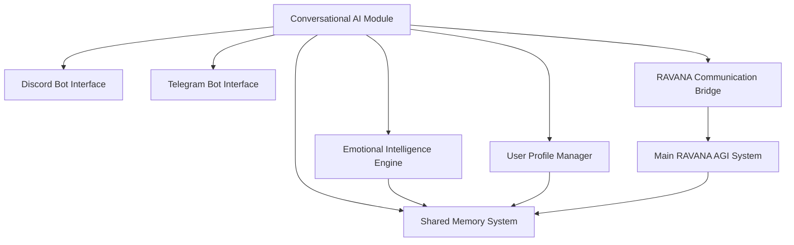

# Conversational AI Module

This module enables RAVANA to interact with users through Discord and Telegram platforms while sharing memory with the main RAVANA AGI system.

## Features

- Discord and Telegram bot integration
- Shared memory system with main RAVANA AGI
- Personalized user interactions based on emotional intelligence
- User-specific personality and memory storage
- Proactive messaging from RAVANA to users
- Task delegation from users to RAVANA

## Architecture



## Installation

1. Install the required dependencies:
   ```bash
   pip install -r requirements.txt
   ```

2. Configure the module by editing `config.json` with your Discord and Telegram bot tokens.

## Usage

Run the module with:
```bash
python -m conversational_ai.main
```

## Configuration

The module can be configured through `config.json`:
- `discord_token`: Discord bot token
- `telegram_token`: Telegram bot token
- `memory_path`: Path to shared memory storage
- `user_data_path`: Path to user profile storage

## Components

### Bot Interfaces
- `DiscordBot`: Handles Discord-specific message processing
- `TelegramBot`: Handles Telegram-specific message processing

### User Profile Management
- `UserProfileManager`: Manages individual user personalities and memories

### Emotional Intelligence
- `ConversationalEmotionalIntelligence`: Adapts existing emotional intelligence for conversation

### Memory Integration
- `SharedMemoryInterface`: Connects to existing RAVANA memory systems

### RAVANA Communication
- `RAVANACommunicator`: Facilitates communication between the conversational module and main AGI system

## Data Models

### User Profile
```json
{
  "user_id": "unique_identifier",
  "platform": "discord|telegram",
  "personality": {
    "traits": ["curious", "technical", "patient"],
    "preferences": {
      "topics": ["AI", "technology", "philosophy"],
      "communication_style": "formal|casual"
    },
    "persona": "Balanced|Optimistic|Pessimistic|Analytical|Creative|Empathetic"
  },
  "memory_context": {
    "recent_conversations": [],
    "interests": [],
    "interaction_history": [],
    "emotional_history": []
  },
  "emotional_state": {
    "mood_vector": {
      "Confident": 0.7,
      "Curious": 0.8,
      "Inspired": 0.6,
      "Frustrated": 0.2
    },
    "dominant_mood": "Curious",
    "mood_intensity": "high",
    "momentum_factors": {
      "Confident": 0.1,
      "Curious": 0.2
    }
  }
}
```