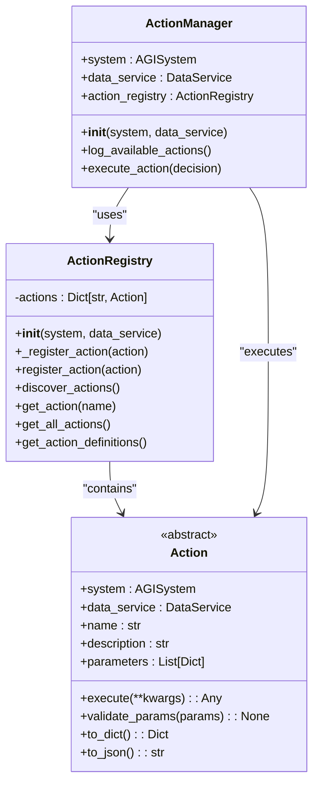
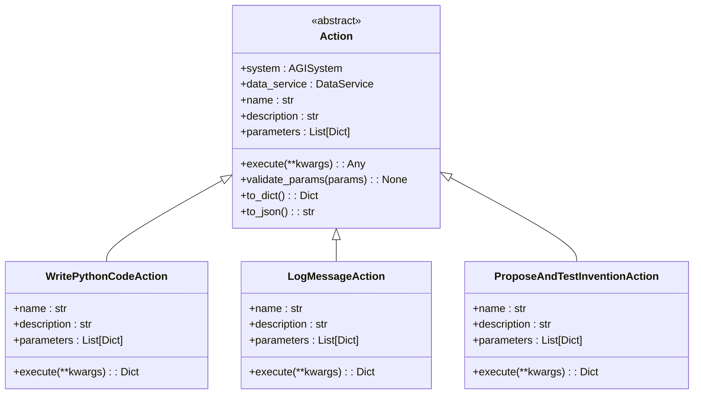
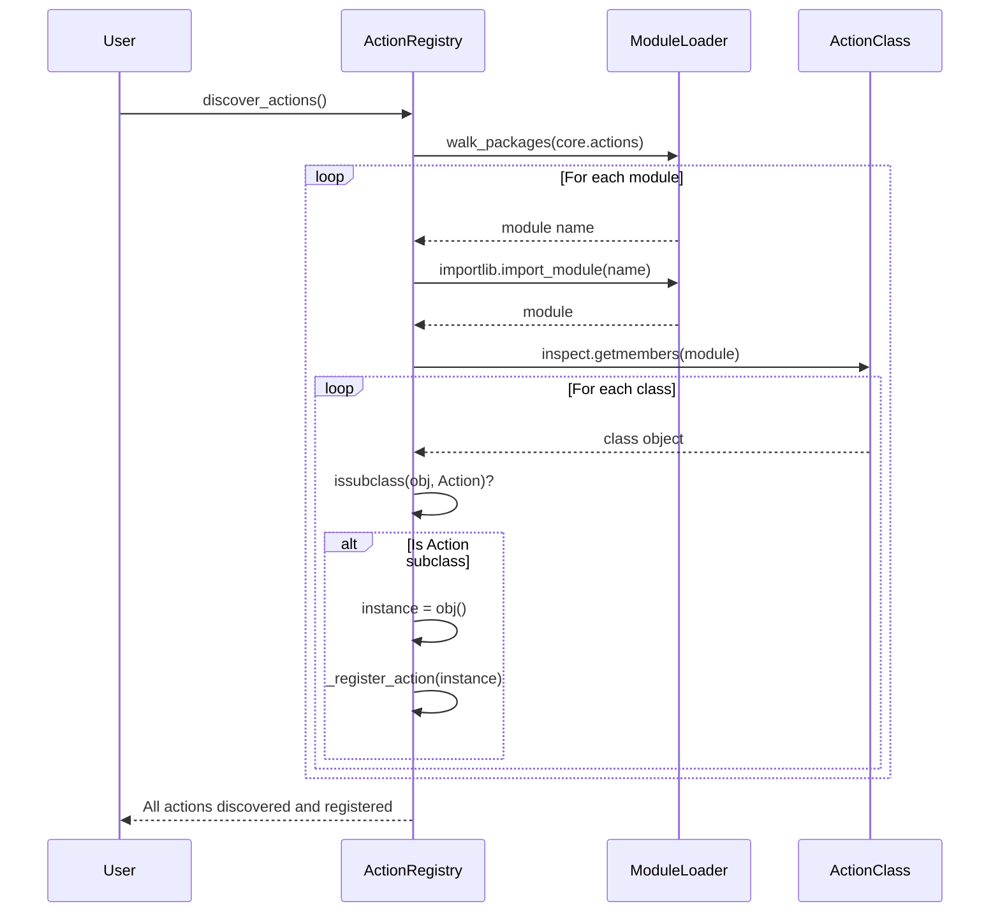
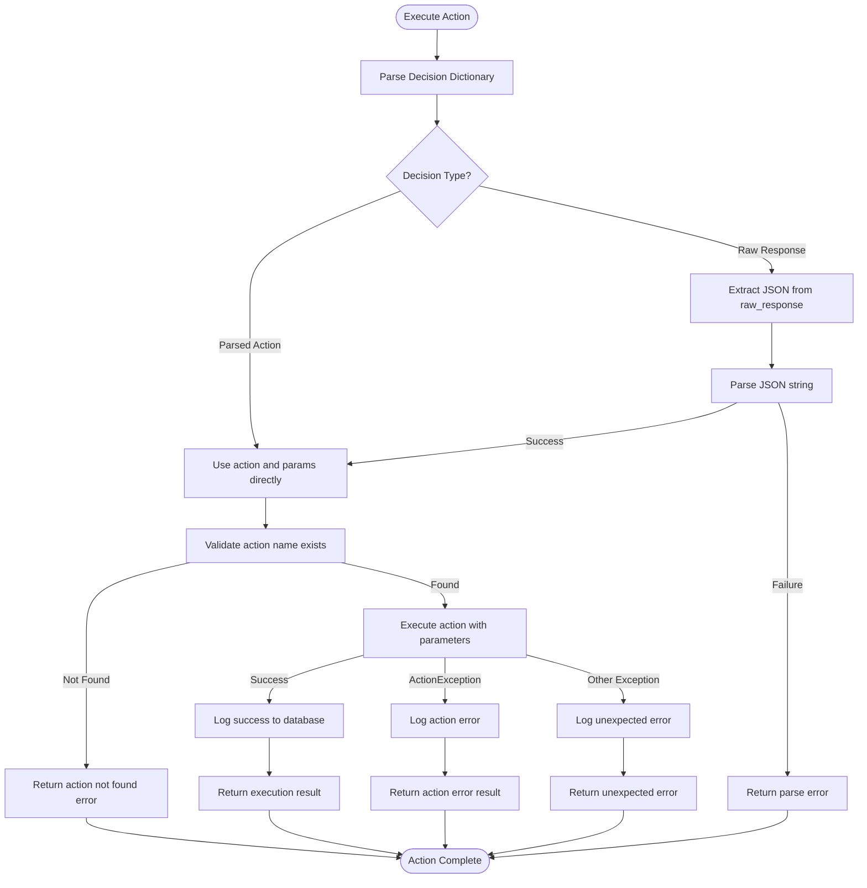
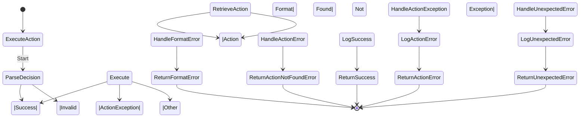
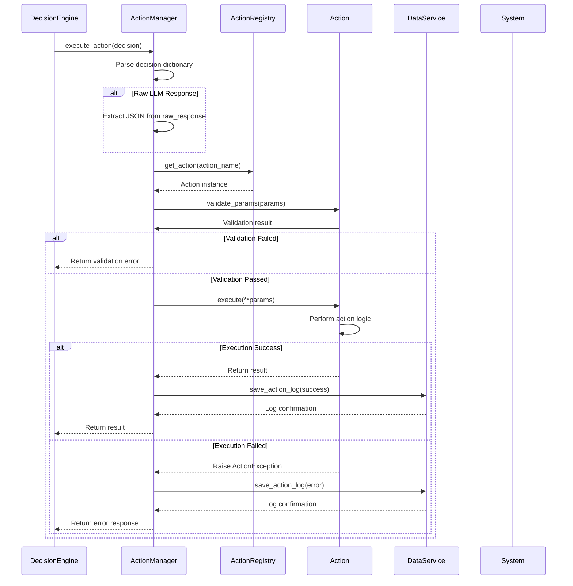

# Action System API


## Table of Contents
1. [Introduction](#introduction)
2. [Core Components](#core-components)
3. [Action Base Class](#action-base-class)
4. [Action Registry](#action-registry)
5. [Action Manager](#action-manager)
6. [Exception Handling](#exception-handling)
7. [Implementing Custom Actions](#implementing-custom-actions)
8. [Action Execution Lifecycle](#action-execution-lifecycle)
9. [Testing Custom Actions](#testing-custom-actions)
10. [Best Practices](#best-practices)

## Introduction
The Action System API provides a structured framework for defining, registering, and executing actions within the AGI system. It enables extensible behavior through a plugin-like architecture where new capabilities can be added by implementing the `Action` abstract base class. This document details the core components, implementation patterns, and operational workflows of the action system.

**Section sources**
- [action.py](file://core/actions/action.py#L1-L62)
- [registry.py](file://core/actions/registry.py#L1-L74)

## Core Components
The action system consists of three primary components:
- **Action**: Abstract base class defining the interface for all actions
- **ActionRegistry**: Central registry for managing action instances and discovery
- **ActionManager**: Orchestrator responsible for parsing decisions and executing actions

These components work together to provide a flexible and extensible mechanism for the AGI to perform tasks, with built-in support for dynamic action discovery, parameter validation, error handling, and execution logging.



**Diagram sources**
- [action.py](file://core/actions/action.py#L1-L62)
- [registry.py](file://core/actions/registry.py#L1-L74)
- [action_manager.py](file://core/action_manager.py#L1-L126)

**Section sources**
- [action.py](file://core/actions/action.py#L1-L62)
- [registry.py](file://core/actions/registry.py#L1-L74)
- [action_manager.py](file://core/action_manager.py#L1-L126)

## Action Base Class
The `Action` abstract base class defines the contract that all actions must implement. It provides a standardized interface for action metadata, parameter validation, and execution.

### Method Signatures
```python
@property
@abstractmethod
def name(self) -> str:
    """The name of the action."""
    pass

@property
@abstractmethod
def description(self) -> str:
    """A description of what the action does."""
    pass

@property
@abstractmethod
def parameters(self) -> List[Dict[str, Any]]:
    """A list of parameters that the action accepts."""
    pass

@abstractmethod
async def execute(self, **kwargs: Any) -> Any:
    """Executes the action with the given parameters."""
    pass
```

### Metadata Properties
The action class requires three metadata properties:
- **name**: Unique identifier for the action (e.g., "write_python_code")
- **description**: Human-readable description of the action's purpose
- **parameters**: List of parameter definitions with name, type, description, and required status

### Built-in Methods
The base class provides several utility methods:
- **validate_params(params)**: Validates input parameters against the action's parameter schema
- **to_dict()**: Returns a dictionary representation of the action
- **to_json()**: Returns a JSON string of the action schema



**Diagram sources**
- [action.py](file://core/actions/action.py#L1-L62)
- [coding.py](file://core/actions/coding.py#L1-L114)
- [io.py](file://core/actions/io.py#L1-L39)
- [experimental.py](file://core/actions/experimental.py#L1-L129)

**Section sources**
- [action.py](file://core/actions/action.py#L1-L62)

## Action Registry
The `ActionRegistry` class manages the collection of available actions, providing registration, discovery, and retrieval capabilities.

### Registration Process
Actions are registered through two mechanisms:
1. **Explicit Registration**: Built-in actions are registered during initialization
2. **Dynamic Discovery**: Actions are automatically discovered and registered from the `core.actions` package

```python
def __init__(self, system: 'AGISystem', data_service: 'DataService') -> None:
    self.actions: Dict[str, Action] = {}
    # Explicit registration of core actions
    self._register_action(ProposeAndTestInventionAction(system, data_service))
    self._register_action(LogMessageAction(system, data_service))
    self._register_action(WritePythonCodeAction(system, data_service))
    self._register_action(ExecutePythonFileAction(system, data_service))
```

### Dynamic Discovery
The `discover_actions()` method automatically finds and registers action classes:

```python
def discover_actions(self):
    """Discovers and registers all actions in the 'core.actions' package."""
    actions_package = core.actions
    for _, name, is_pkg in pkgutil.walk_packages(actions_package.__path__, actions_package.__name__ + '.'):
        if not is_pkg:
            module = importlib.import_module(name)
            for _, obj in inspect.getmembers(module):
                if inspect.isclass(obj) and issubclass(obj, Action) and obj is not Action:
                    try:
                        instance = obj()
                        if instance.name in self.actions:
                            logger.warning(f"Action '{instance.name}' is already registered. Overwriting.")
                        self.actions[instance.name] = instance
                    except Exception as e:
                        logger.error(f"Failed to instantiate action {obj.__name__}: {e}", exc_info=True)
```

### Key Methods
- **register_action(action)**: Public method to register a new action instance
- **get_action(name)**: Retrieves an action by name, raising ValueError if not found
- **get_all_actions()**: Returns a list of all registered action instances
- **get_action_definitions()**: Returns a formatted string of all action definitions for LLM prompts



**Diagram sources**
- [registry.py](file://core/actions/registry.py#L1-L74)

**Section sources**
- [registry.py](file://core/actions/registry.py#L1-L74)

## Action Manager
The `ActionManager` orchestrates the execution of actions, handling the complete lifecycle from decision parsing to result propagation.

### Initialization
The ActionManager initializes with a system reference and data service, creating an ActionRegistry instance:

```python
def __init__(self, system: 'AGISystem', data_service: 'DataService'):
    self.system = system
    self.data_service = data_service
    self.action_registry = ActionRegistry(system, data_service)
    logger.info(f"ActionManager initialized with {len(self.action_registry.actions)} actions.")
    self.log_available_actions()
```

### Execution Lifecycle
The `execute_action()` method follows a structured process:

1. **Decision Parsing**: Extracts action name and parameters from the decision dictionary
2. **JSON Extraction**: Parses JSON from raw LLM responses when needed
3. **Action Retrieval**: Gets the action instance from the registry
4. **Execution**: Calls the action's execute method
5. **Logging**: Records the action result to the database
6. **Error Handling**: Manages exceptions and returns appropriate error responses



**Diagram sources**
- [action_manager.py](file://core/action_manager.py#L1-L126)

**Section sources**
- [action_manager.py](file://core/action_manager.py#L1-L126)

## Exception Handling
The action system implements a comprehensive exception handling framework to manage errors during action execution.

### Exception Hierarchy
```python
class ActionError(Exception):
    """Base exception for action-related errors."""
    pass

class InvalidActionError(ActionError):
    """Raised when an action is not found in the registry."""
    pass

class InvalidActionParams(ActionError):
    """Raised when the parameters for an action are invalid."""
    pass

class ActionException(Exception):
    """Custom exception for action execution errors."""
    pass
```

### Error Handling in ActionManager
The `execute_action()` method handles three types of errors:

1. **Decision Format Errors**: Invalid decision structure
2. **ActionException**: Expected action execution errors
3. **Unexpected Exceptions**: Unhandled errors during execution

Each error type is logged to the database and returns a structured error response to the caller.



**Diagram sources**
- [exceptions.py](file://core/actions/exceptions.py#L1-L14)
- [action_manager.py](file://core/action_manager.py#L1-L126)

**Section sources**
- [exceptions.py](file://core/actions/exceptions.py#L1-L14)
- [action_manager.py](file://core/action_manager.py#L1-L126)

## Implementing Custom Actions
Creating custom actions involves extending the `Action` base class and implementing the required methods.

### Required Overrides
All custom actions must implement these abstract properties and methods:

```python
class CustomAction(Action):
    @property
    def name(self) -> str:
        return "custom_action_name"
    
    @property
    def description(self) -> str:
        return "Description of what the action does"
    
    @property
    def parameters(self) -> List[Dict[str, Any]]:
        return [
            {
                "name": "param_name",
                "type": "string",
                "description": "Parameter description",
                "required": True
            }
        ]
    
    async def execute(self, **kwargs: Any) -> Any:
        # Implementation logic here
        pass
```

### Example Implementation
Based on the developer guide, here's a complete example:

```python
from core.actions.action import Action
from typing import Any, Dict, List

class HelloWorldAction(Action):
    @property
    def name(self) -> str:
        return "hello_world"

    @property
    def description(self) -> str:
        return "A simple action that prints a greeting."

    @property
    def parameters(self) -> List[Dict[str, Any]]:
        return [
            {
                "name": "name",
                "type": "string",
                "description": "The name to include in the greeting.",
                "required": True,
            }
        ]

    async def execute(self, **kwargs: Any) -> Any:
        name = kwargs.get("name")
        return f"Hello, {name}!"
```

### Best Practices
1. **Place actions in appropriate modules** within `core/actions/`
2. **Use descriptive names** that clearly indicate the action's purpose
3. **Provide comprehensive parameter descriptions**
4. **Implement proper error handling** using ActionException
5. **Include logging** for debugging and monitoring
6. **Validate parameters** using the built-in validate_params method

```mermaid
classDiagram
class Action {
<<abstract>>
+name : str
+description : str
+parameters : List[Dict]
+execute(**kwargs) : Any
}
class CustomAction {
+name : str
+description : str
+parameters : List[Dict]
+execute(**kwargs) : Any
}
Action <|-- CustomAction
note right of CustomAction
Must implement :
• name property
• description property
• parameters property
• execute method
end note
```

**Diagram sources**
- [action.py](file://core/actions/action.py#L1-L62)
- [DEVELOPER_GUIDE.md](file://DEVELOPER_GUIDE.md#L175-L216)

**Section sources**
- [action.py](file://core/actions/action.py#L1-L62)
- [DEVELOPER_GUIDE.md](file://DEVELOPER_GUIDE.md#L175-L216)

## Action Execution Lifecycle
The complete action execution lifecycle involves multiple components working together:

### Sequence of Events
1. **Decision Received**: ActionManager receives a decision dictionary
2. **Parsing**: Extracts action name and parameters from the decision
3. **Validation**: Validates parameters against the action's schema
4. **Execution**: Calls the action's execute method
5. **Result Processing**: Handles success or error responses
6. **Logging**: Records the outcome to the database
7. **Return**: Propagates the result back to the calling system



**Diagram sources**
- [action_manager.py](file://core/action_manager.py#L1-L126)
- [action.py](file://core/actions/action.py#L1-L62)
- [registry.py](file://core/actions/registry.py#L1-L74)

**Section sources**
- [action_manager.py](file://core/action_manager.py#L1-L126)

## Testing Custom Actions
The testing framework provides patterns for validating custom action implementations.

### Test Structure
Based on the existing test files, tests should:
1. **Use mocking** for system dependencies
2. **Test initialization** and setup
3. **Verify execution** with valid and invalid parameters
4. **Validate error handling** scenarios
5. **Check logging** and database interactions

### Example Test Pattern
```python
def test_custom_action_execution():
    # Create mock objects
    mock_system = Mock()
    mock_data_service = Mock()
    
    # Create action instance
    action = CustomAction(mock_system, mock_data_service)
    
    # Test execution with valid parameters
    result = await action.execute(param_name="test")
    assert result == "expected_result"
    
    # Test error handling
    with pytest.raises(ActionException):
        await action.execute(invalid_param="test")
```

### Key Testing Considerations
- **Isolation**: Test actions in isolation from other components
- **Async Support**: Use appropriate async test frameworks
- **Edge Cases**: Test with missing, invalid, and edge-case parameters
- **Integration Points**: Verify interactions with system and data_service
- **Performance**: Consider timeout and resource usage

**Section sources**
- [test_enhanced_action_manager_fix.py](file://tests/test_enhanced_action_manager_fix.py#L1-L119)

## Best Practices
Follow these guidelines when implementing and working with the action system:

### Implementation Guidelines
- **Follow naming conventions**: Use lowercase with underscores (e.g., "write_python_code")
- **Provide clear descriptions**: Help the LLM understand when to use each action
- **Define comprehensive parameters**: Include type, description, and required status
- **Implement proper error handling**: Use ActionException for expected errors
- **Include logging**: Use logger.info() for key execution points
- **Validate inputs**: Rely on the built-in validate_params method

### Performance Considerations
- **Use asyncio appropriately**: Avoid blocking operations in async methods
- **Implement timeouts**: Prevent actions from running indefinitely
- **Cache results**: For expensive operations that may be repeated
- **Manage resources**: Clean up files, connections, and memory

### Security Practices
- **Validate all inputs**: Never trust LLM-generated parameters
- **Sandbox execution**: Run code in isolated environments when possible
- **Limit permissions**: Actions should have only the permissions they need
- **Log sensitive operations**: Ensure all actions are properly audited

### Development Workflow
1. Create a new Python file in `core/actions/`
2. Implement the action class extending Action
3. Define name, description, and parameters
4. Implement the execute method with proper error handling
5. Test thoroughly with valid and invalid inputs
6. Verify logging and database interactions
7. Document the action's purpose and usage

**Section sources**
- [DEVELOPER_GUIDE.md](file://DEVELOPER_GUIDE.md#L175-L216)
- [coding.py](file://core/actions/coding.py#L1-L114)
- [io.py](file://core/actions/io.py#L1-L39)
- [experimental.py](file://core/actions/experimental.py#L1-L129)

**Referenced Files in This Document**   
- [action.py](file://core/actions/action.py#L1-L62)
- [registry.py](file://core/actions/registry.py#L1-L74)
- [action_manager.py](file://core/action_manager.py#L1-L126)
- [exceptions.py](file://core/actions/exceptions.py#L1-L14)
- [coding.py](file://core/actions/coding.py#L1-L114)
- [io.py](file://core/actions/io.py#L1-L39)
- [experimental.py](file://core/actions/experimental.py#L1-L129)
- [test_enhanced_action_manager_fix.py](file://tests/test_enhanced_action_manager_fix.py#L1-L119)
- [DEVELOPER_GUIDE.md](file://DEVELOPER_GUIDE.md#L175-L216)