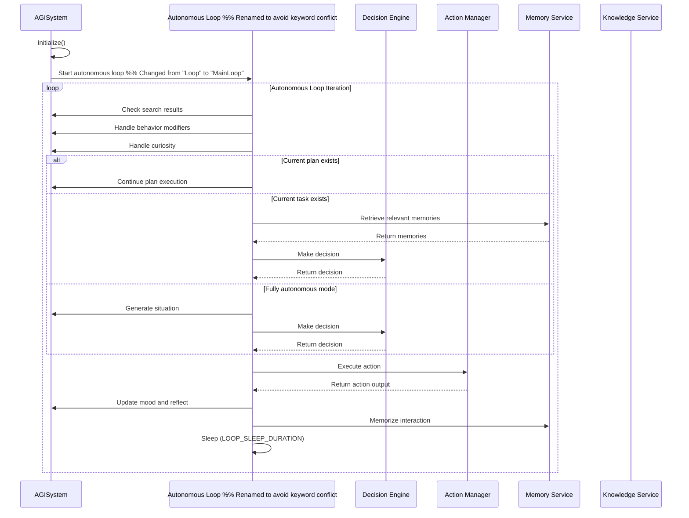
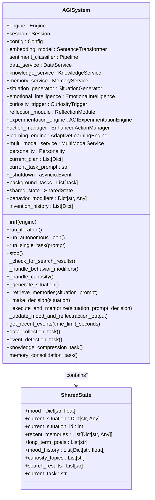
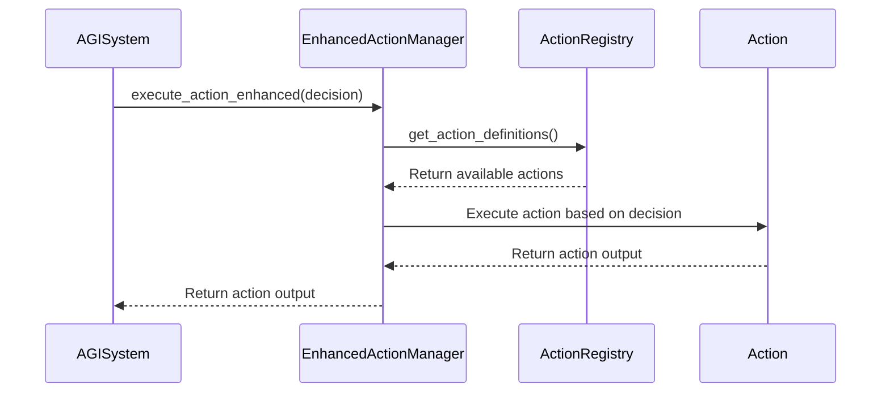
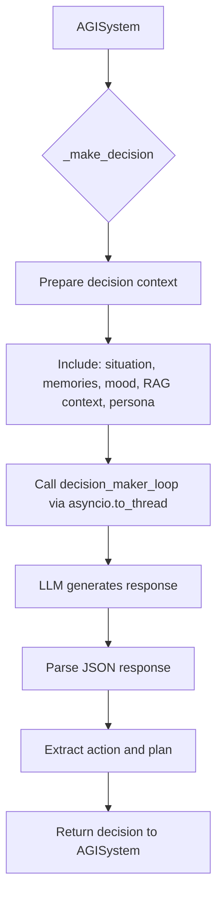
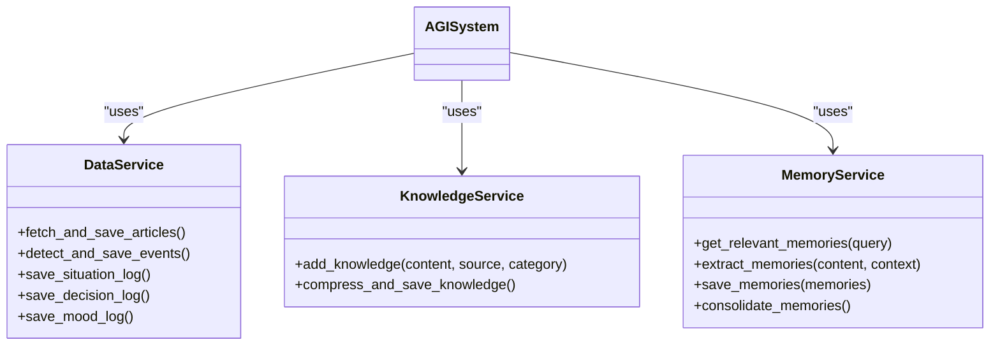
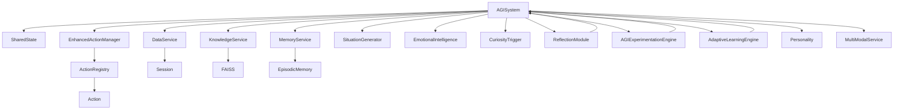

# Core System API


## Table of Contents
1. [Introduction](#introduction)
2. [Project Structure](#project-structure)
3. [Core Components](#core-components)
4. [Architecture Overview](#architecture-overview)
5. [Detailed Component Analysis](#detailed-component-analysis)
6. [Dependency Analysis](#dependency-analysis)
7. [Performance Considerations](#performance-considerations)
8. [Troubleshooting Guide](#troubleshooting-guide)
9. [Conclusion](#conclusion)

## Introduction
This document provides comprehensive API documentation for the AGISystem class, the central orchestrator of the RAVANA framework. It details the system's lifecycle, asynchronous operation, shared state management, and integration with core modules. The AGISystem class serves as the main controller that coordinates autonomous behavior, decision-making, memory, learning, and external interactions.

## Project Structure
The RAVANA project follows a modular architecture with clear separation of concerns. The core system components are organized under the `core/` directory, while specialized cognitive modules reside in the `modules/` directory. Services for data, knowledge, and memory management are encapsulated in the `services/` directory.

```mermaid
graph TB
subgraph "Core System"
AGISystem[AGISystem]
State[SharedState]
ActionManager[EnhancedActionManager]
Config[Config]
end
subgraph "Services"
DataService[DataService]
KnowledgeService[KnowledgeService]
MemoryService[MemoryService]
MultiModalService[MultiModalService]
end
subgraph "Cognitive Modules"
SituationGenerator[SituationGenerator]
EmotionalIntelligence[EmotionalIntelligence]
CuriosityTrigger[CuriosityTrigger]
ReflectionModule[ReflectionModule]
ExperimentationEngine[AGIExperimentationEngine]
AdaptiveLearningEngine[AdaptiveLearningEngine]
Personality[Personality]
end
AGISystem --> State
AGISystem --> ActionManager
AGISystem --> DataService
AGISystem --> KnowledgeService
AGISystem --> MemoryService
AGISystem --> MultiModalService
AGISystem --> SituationGenerator
AGISystem --> EmotionalIntelligence
AGISystem --> CuriosityTrigger
AGISystem --> ReflectionModule
AGISystem --> ExperimentationEngine
AGISystem --> AdaptiveLearningEngine
AGISystem --> Personality
```



**Diagram sources**
- [core/system.py](file://core/system.py#L34-L624)
- [core/state.py](file://core/state.py#L6-L15)

**Section sources**
- [core/system.py](file://core/system.py#L34-L624)

## Core Components
The AGISystem class integrates multiple components to create an autonomous cognitive agent. Key components include the action manager for executing tasks, services for data and knowledge management, and cognitive modules for decision-making, emotion, and learning.

**Section sources**
- [core/system.py](file://core/system.py#L34-L624)
- [core/action_manager.py](file://core/action_manager.py#L15-L20)
- [services/data_service.py](file://services/data_service.py#L10-L14)

## Architecture Overview
The RAVANA framework employs an event-driven, asynchronous architecture centered around the AGISystem orchestrator. The system operates through a main autonomous loop that processes situations, makes decisions, executes actions, and updates internal state. Background tasks handle data collection, event detection, and knowledge compression.



**Diagram sources**
- [core/system.py](file://core/system.py#L34-L624)

## Detailed Component Analysis

### AGISystem Class Analysis
The AGISystem class serves as the central orchestrator of the RAVANA framework, managing the complete lifecycle of the AGI from initialization to shutdown.

#### Initialization Process
The `__init__` method initializes all core components and services required for the AGI system to function.



**Diagram sources**
- [core/system.py](file://core/system.py#L34-L624)
- [core/state.py](file://core/state.py#L6-L15)

**Section sources**
- [core/system.py](file://core/system.py#L34-L624)

#### System Lifecycle Methods
The AGISystem class provides three primary methods for controlling the system's operation: `start()`, `step()`, and `shutdown()`.

**start() Method**
The `run_autonomous_loop()` method serves as the main entry point for continuous autonomous operation.

```python
async def run_autonomous_loop(self):
    """The main autonomous loop of the AGI."""
    logger.info("Starting autonomous loop...")
    
    # Start background tasks
    self.background_tasks.append(asyncio.create_task(self.data_collection_task()))
    self.background_tasks.append(asyncio.create_task(self.event_detection_task()))
    self.background_tasks.append(asyncio.create_task(self.knowledge_compression_task()))
    self.background_tasks.append(asyncio.create_task(self.memory_consolidation_task()))

    while not self._shutdown.is_set():
        try:
            if self.experimentation_engine.active_experiment:
                await self.experimentation_engine.run_experiment_step()
            else:
                await self.run_iteration()
            
            logger.info(f"End of loop iteration. Sleeping for {Config.LOOP_SLEEP_DURATION} seconds.")
            await asyncio.sleep(Config.LOOP_SLEEP_DURATION)
        except Exception as e:
            logger.critical(f"Critical error in autonomous loop: {e}", exc_info=True)
            await asyncio.sleep(Config.LOOP_SLEEP_DURATION * 5) # Longer sleep after critical error
    
    logger.info("Autonomous loop has been stopped.")
```

**Parameter**: None  
**Return**: None (async coroutine)  
**Exceptions**: Catches and logs exceptions to prevent loop termination  
**Behavior**: Starts background tasks and enters an infinite loop that executes iterations until shutdown is requested.

**step() Method**
The `run_iteration()` method executes a single step of the AGI's thought process.

```python
async def run_iteration(self):
    """Runs a single iteration of the AGI's thought process."""
    # 1. Check for external data and completed tasks
    await self._check_for_search_results()

    # 2. Handle any mood-based behavior modifiers from the previous loop
    await self._handle_behavior_modifiers()
    
    # 3. Handle Curiosity
    await self._handle_curiosity()

    # 4. Decide on the next action
    if self.current_plan:
        # Continue with the existing plan
        decision = self.current_plan.pop(0)
        logger.info(f"Continuing with task: '{self.current_task_prompt}'. {len(self.current_plan)} steps remaining.")
        situation_prompt = self.current_task_prompt
    elif self.shared_state.current_task:
        situation_prompt = self.shared_state.current_task
        await self._retrieve_memories(situation_prompt)
        situation = {
            'prompt': situation_prompt,
            'context': self.shared_state.recent_memories
        }
        decision = await self._make_decision(situation)
        self.current_task_prompt = situation_prompt
    else:
        # Autonomous mode: no specific task, generate a situation
        situation = await self._generate_situation()
        situation_prompt = situation['prompt']
        await self._retrieve_memories(situation_prompt)
        decision = await self._make_decision(situation)

    # Execute action and update state
    action_output = await self._execute_and_memorize(situation_prompt, decision)

    # Check if the decision included a plan
    raw_response = decision.get("raw_response", "{}")
    try:
        # Find the JSON block in the raw response
        json_start = raw_response.find("```json")
        json_end = raw_response.rfind("```")
        if json_start != -1 and json_end != -1 and json_start < json_end:
            json_str = raw_response[json_start + 7:json_end].strip()
            decision_data = json.loads(json_str)
        else:
            # Try parsing the whole string if no block is found
            decision_data = json.loads(raw_response)
            
        plan = decision_data.get("plan")
        if plan and isinstance(plan, list) and len(plan) > 1:
            # The first step was already chosen as the main action, so store the rest
            self.current_plan = plan[1:]
            self.current_task_prompt = situation_prompt
            logger.info(f"Found and stored a multi-step plan with {len(self.current_plan)} steps remaining.")
        else:
            # If the plan is done or was a single step, clear it.
            self.current_plan = []
            self.current_task_prompt = None
            if plan:
                logger.info("Plan found, but only had one step which was already executed.")

    except json.JSONDecodeError:
        logger.warning("Could not parse plan from decision response.")
        self.current_plan = []
        self.current_task_prompt = None


    # Update mood and reflect
    await self._update_mood_and_reflect(action_output)
```

**Parameter**: None  
**Return**: None (async coroutine)  
**Exceptions**: May raise exceptions from component calls, but does not handle them internally  
**Behavior**: Executes one complete cycle of the AGI's cognitive process, including situation assessment, decision making, action execution, and state updates.

**shutdown() Method**
The `stop()` method handles graceful shutdown of the system.

```python
async def stop(self):
    """Gracefully stops the AGI system and its background tasks."""
    if self._shutdown.is_set():
        return
        
    logger.info("Initiating graceful shutdown...")
    self._shutdown.set()

    logger.info(f"Cancelling {len(self.background_tasks)} background tasks...")
    for task in self.background_tasks:
        task.cancel()
    
    await asyncio.gather(*self.background_tasks, return_exceptions=True)
    
    logger.info("All background tasks stopped.")
    self.session.close()
```

**Parameter**: None  
**Return**: None (async coroutine)  
**Exceptions**: None (safe to call multiple times)  
**Behavior**: Sets shutdown flag, cancels all background tasks, waits for their completion, and closes the database session.

### Integration Points
The AGISystem class integrates with various components through well-defined interfaces.

#### Action Manager Integration
The AGISystem initializes and interacts with the EnhancedActionManager for executing actions.



**Diagram sources**
- [core/system.py](file://core/system.py#L34-L624)
- [core/enhanced_action_manager.py](file://core/enhanced_action_manager.py#L23-L28)
- [core/actions/registry.py](file://core/actions/registry.py#L15-L23)

**Section sources**
- [core/system.py](file://core/system.py#L34-L624)
- [core/enhanced_action_manager.py](file://core/enhanced_action_manager.py#L23-L28)

#### LLM Integration
The system integrates with language models through the decision-making process.



**Diagram sources**
- [core/system.py](file://core/system.py#L34-L624)

**Section sources**
- [core/system.py](file://core/system.py#L34-L624)

#### Services Integration
The AGISystem integrates with various services for data management.



**Diagram sources**
- [core/system.py](file://core/system.py#L34-L624)
- [services/data_service.py](file://services/data_service.py#L10-L14)
- [services/knowledge_service.py](file://services/knowledge_service.py#L15-L26)

**Section sources**
- [core/system.py](file://core/system.py#L34-L624)
- [services/data_service.py](file://services/data_service.py#L10-L14)
- [services/knowledge_service.py](file://services/knowledge_service.py#L15-L26)

## Dependency Analysis
The AGISystem class has dependencies on multiple components, creating a rich ecosystem of interconnected modules.



**Diagram sources**
- [core/system.py](file://core/system.py#L34-L624)

**Section sources**
- [core/system.py](file://core/system.py#L34-L624)

## Performance Considerations
The AGISystem is designed with performance and scalability in mind, employing several optimization strategies:

1. **Async Operations**: Uses asyncio for non-blocking operations, allowing concurrent execution of I/O-bound tasks.
2. **Thread Pool Execution**: Offloads synchronous operations (like database calls) to thread pools using `asyncio.to_thread`.
3. **Caching**: The EnhancedActionManager implements caching to avoid redundant computations.
4. **Rate Limiting**: Background tasks use configurable intervals to prevent resource exhaustion.
5. **Memory Management**: Implements limits on search results and other transient data to prevent memory bloat.

The system's performance is primarily constrained by the LLM inference time in the decision-making process, which is executed in a thread pool to prevent blocking the event loop.

## Troubleshooting Guide
Common issues and their solutions when working with the AGISystem:

1. **System fails to start**: Ensure the database engine is properly initialized and accessible.
2. **Background tasks not running**: Verify that the event loop is running and not blocked by synchronous operations.
3. **Memory leaks**: Monitor the `shared_state.search_results` list, which is limited to 10 items to prevent growth.
4. **Decision-making failures**: Check the LLM connection and ensure the `decision_maker_loop` function is available.
5. **Action execution errors**: Verify that required dependencies for specific actions (e.g., Python interpreter for code execution) are installed.

Error handling is implemented through comprehensive logging and exception catching in critical paths, particularly in background tasks and external service interactions.

## Conclusion
The AGISystem class provides a robust foundation for an autonomous AGI framework, orchestrating complex interactions between cognitive modules, services, and external systems. Its asynchronous design enables responsive behavior while maintaining system stability through graceful error handling and resource management. The modular architecture allows for easy extension and customization, making it suitable for a wide range of AI applications.

**Referenced Files in This Document**   
- [core/system.py](file://core/system.py#L34-L624)
- [core/state.py](file://core/state.py#L6-L15)
- [core/action_manager.py](file://core/action_manager.py#L15-L20)
- [core/actions/registry.py](file://core/actions/registry.py#L15-L23)
- [services/data_service.py](file://services/data_service.py#L10-L14)
- [modules/personality/personality.py](file://modules/personality/personality.py#L16-L34)
- [services/knowledge_service.py](file://services/knowledge_service.py#L15-L26)
- [core/enhanced_action_manager.py](file://core/enhanced_action_manager.py#L23-L28)
- [modules/adaptive_learning/learning_engine.py](file://modules/adaptive_learning/learning_engine.py)
- [modules/reflection_module.py](file://modules/reflection_module.py#L11-L12)
- [modules/experimentation_module.py](file://modules/experimentation_module.py#L9-L10)
