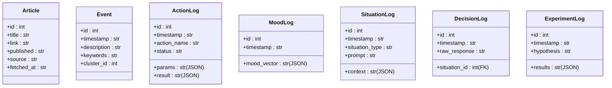

# Data Service API


## Table of Contents
1. [Introduction](#introduction)
2. [Project Structure](#project-structure)
3. [Core Components](#core-components)
4. [Architecture Overview](#architecture-overview)
5. [Detailed Component Analysis](#detailed-component-analysis)
6. [Dependency Analysis](#dependency-analysis)
7. [Performance Considerations](#performance-considerations)
8. [Troubleshooting Guide](#troubleshooting-guide)
9. [Conclusion](#conclusion)

## Introduction
The DataService API is a central component of the RAVANA system responsible for data ingestion, retrieval, and persistence. It orchestrates the flow of information from external sources such as RSS feeds into structured database records, enabling downstream processing for event detection, sentiment analysis, and knowledge generation. This document provides a comprehensive overview of the DataService class, its public methods, integration with SQLModel and external modules, and operational workflows. The service leverages hybrid storage mechanisms via SQLite (through SQLModel) and integrates with machine learning models for embedding and sentiment classification to enable intelligent data processing.

## Project Structure
The project follows a modular architecture with clear separation of concerns. The DataService resides in the `services` directory, which houses high-level application logic. It depends on domain models defined in `database/models.py`, uses a database engine from `database/engine.py`, and integrates with specialized modules in the `modules` directory for advanced processing such as trend analysis and event detection.


**Diagram sources**
- [services/data_service.py](file://services/data_service.py#L9-L155)
- [database/models.py](file://database/models.py#L1-L56)
- [database/engine.py](file://database/engine.py#L1-L7)
- [modules/information_processing/trend_analysis/trend_engine.py](file://modules/information_processing/trend_analysis/trend_engine.py#L0-L90)
- [modules/event_detection/event_detector.py](file://modules/event_detection/event_detector.py#L0-L188)

**Section sources**
- [services/data_service.py](file://services/data_service.py#L9-L155)
- [database/models.py](file://database/models.py#L1-L56)

## Core Components
The core functionality of the DataService API revolves around ingesting data from RSS feeds, detecting meaningful events from article content, and persisting various types of logs for auditing and state tracking. The primary components include:
- **Article Ingestion**: Fetches and stores articles from configured RSS feeds.
- **Event Detection**: Processes recent articles to identify emerging events using clustering and NLP techniques.
- **Log Persistence**: Provides methods to record actions, moods, decisions, and experiments.

These components work together to build a continuously updated knowledge base that supports the AGI system's autonomous behavior.

**Section sources**
- [services/data_service.py](file://services/data_service.py#L9-L155)
- [modules/information_processing/trend_analysis/trend_engine.py](file://modules/information_processing/trend_analysis/trend_engine.py#L0-L90)
- [modules/event_detection/event_detector.py](file://modules/event_detection/event_detector.py#L0-L188)

## Architecture Overview
The DataService operates within a layered architecture that separates data access, business logic, and external integrations. It uses SQLModel as an ORM to interact with a SQLite database (configurable via environment variables), ensuring type-safe database operations. External data is ingested through the `trend_engine.py` module, which parses RSS feeds and stores raw entries. Event detection is handled by `event_detector.py`, which applies embedding models and clustering algorithms to identify thematic groupings in article titles and links.


**Diagram sources**
- [services/data_service.py](file://services/data_service.py#L9-L155)
- [modules/information_processing/trend_analysis/trend_engine.py](file://modules/information_processing/trend_analysis/trend_engine.py#L0-L90)
- [modules/event_detection/event_detector.py](file://modules/event_detection/event_detector.py#L0-L188)
- [database/models.py](file://database/models.py#L1-L56)

## Detailed Component Analysis

### DataService Class Analysis
The `DataService` class encapsulates all data persistence and processing logic. It is initialized with a database engine, a list of feed URLs, and optional ML models for embeddings and sentiment analysis.

#### Public Methods

**fetch_and_save_articles()**
- **Purpose**: Ingests articles from configured RSS feeds and persists them if not already present.
- **Parameters**: None (uses `self.feed_urls`)
- **Return Type**: `int` (number of new articles saved)
- **Error Conditions**: Returns 0 if no new articles are found or if feed parsing fails silently.
- **Internal Flow**:
  1. Calls `fetch_feeds()` with configured URLs
  2. For each article, checks for duplicates using the `link` field
  3. Creates new `Article` instances and commits to the database
- **Example Usage**:
```python
data_service.fetch_and_save_articles()  # Returns number of new articles
```

**detect_and_save_events()**
- **Purpose**: Analyzes recent articles to detect and store significant events using clustering.
- **Parameters**: None (uses internal `embedding_model` and `sentiment_classifier`)
- **Return Type**: `int` (number of events detected and saved)
- **Error Conditions**: Returns 0 if no recent articles exist or if processing fails.
- **Internal Flow**:
  1. Queries the 10 most recently fetched articles
  2. Extracts title and link for each article
  3. Passes text data to `process_data_for_events()`
  4. Converts detected events into `Event` model instances and saves them
- **Example Usage**:
```python
count = data_service.detect_and_save_events()  # Detects and saves events
```

**save_action_log(action_name: str, params: dict, status: str, result: any)**
- **Purpose**: Records execution details of system actions.
- **Parameters**:
  - `action_name`: Name of the action
  - `params`: Input parameters (stored as JSON)
  - `status`: Execution status ("success" or "failure")
  - `result`: Output or error details (stored as JSON)
- **Return Type**: None
- **Persistence**: Stored in `ActionLog` table with timestamp.

**save_mood_log(mood_vector: dict)**
- **Purpose**: Logs the current emotional state vector of the AGI.
- **Parameters**: `mood_vector` - dictionary of mood dimensions and scores
- **Return Type**: None
- **Storage**: Serialized as JSON in `MoodLog` table.

**save_situation_log(situation: dict) -> int**
- **Purpose**: Persists a generated situation and returns its database ID.
- **Parameters**: `situation` - dictionary containing type, prompt, and context
- **Return Type**: `int` (primary key of the saved record)
- **Use Case**: Enables linking decisions to specific situations via `situation_id`.

**save_decision_log(situation_id: int, raw_response: str)**
- **Purpose**: Records the AGI's raw decision output for a given situation.
- **Parameters**:
  - `situation_id`: Foreign key to `SituationLog`
  - `raw_response`: Full LLM output
- **Return Type**: None

**save_experiment_log(hypothesis: str, *args: Any) -> None**
- **Purpose**: Logs experimental results with flexible calling conventions.
- **Overloads**:
  1. `save_experiment_log("hypothesis", {"results": ...})`
  2. `save_experiment_log("hypothesis", "test_plan", "verdict", result)`
- **Parameters**: Variable arguments handled via `*args`
- **Error Handling**: Raises `TypeError` for invalid argument patterns.
- **Data Safety**: Falls back to string conversion if JSON serialization fails.

#### Data Models
The following models are defined in `database/models.py` and used by DataService:



**Diagram sources**
- [database/models.py](file://database/models.py#L1-L56)

**Section sources**
- [services/data_service.py](file://services/data_service.py#L9-L155)
- [database/models.py](file://database/models.py#L1-L56)

## Dependency Analysis
The DataService has well-defined dependencies on both internal and external components. It relies on SQLModel for ORM functionality, which in turn uses SQLAlchemy and a database engine configured with a connection URL from environment variables. The service integrates with two key modules: `trend_engine.py` for data ingestion and `event_detector.py` for event detection.


**Diagram sources**
- [services/data_service.py](file://services/data_service.py#L9-L155)
- [database/engine.py](file://database/engine.py#L1-L7)
- [core/config.py](file://core/config.py#L1-L60)

**Section sources**
- [services/data_service.py](file://services/data_service.py#L9-L155)
- [database/engine.py](file://database/engine.py#L1-L7)
- [core/config.py](file://core/config.py#L1-L60)

## Performance Considerations
The DataService implements several performance-aware patterns:
- **Batch Operations**: Articles are processed in batches within a single database transaction to minimize commit overhead.
- **Indexing Latency**: No explicit database indexes are defined, but the `Article.link` field is queried frequently and would benefit from an index.
- **Memory Usage**: Article and event processing is done in memory; for large feeds, this could lead to high memory consumption.
- **Model Loading**: The `event_detector.py` implements global model caching to avoid reloading heavy ML models on each call.
- **Error Resilience**: JSON serialization includes fallbacks to string conversion to prevent data loss during logging.

Potential optimizations include:
- Adding database indexes on `Article.link` and `Article.fetched_at`
- Implementing pagination for large article queries
- Using connection pooling for database access
- Caching feed responses to reduce network calls

**Section sources**
- [services/data_service.py](file://services/data_service.py#L9-L155)
- [modules/event_detection/event_detector.py](file://modules/event_detection/event_detector.py#L0-L188)

## Troubleshooting Guide
Common issues and their solutions:

**Database Connectivity Issues**
- **Symptom**: `sqlalchemy.exc.OperationalError` during session operations
- **Cause**: Incorrect `DATABASE_URL` or missing database file
- **Solution**: Verify `DATABASE_URL` in environment or `core/config.py`. Ensure directory for SQLite file exists.

**Duplicate Articles**
- **Symptom**: Same article appears multiple times
- **Cause**: `fetch_feeds()` does not deduplicate; DataService handles this via `link` check
- **Solution**: Ensure `link` field is unique and consistently formatted.

**No Events Detected**
- **Symptom**: `detect_and_save_events()` returns 0
- **Cause**: Insufficient recent articles or all filtered out by sentiment analysis
- **Solution**: Check that articles exist in DB and verify sentiment classifier behavior.

**JSON Serialization Failures**
- **Symptom**: `TypeError` in `save_experiment_log`
- **Cause**: Non-serializable objects in results dictionary
- **Solution**: The method already includes fallback string conversion; ensure complex objects have proper `__str__` methods.

**Section sources**
- [services/data_service.py](file://services/data_service.py#L9-L155)
- [database/models.py](file://database/models.py#L1-L56)
- [modules/event_detection/event_detector.py](file://modules/event_detection/event_detector.py#L0-L188)

## Conclusion
The DataService API provides a robust foundation for data ingestion and persistence in the RAVANA system. By integrating structured database storage with intelligent event detection and comprehensive logging, it enables the AGI to maintain awareness of its environment and internal state. The modular design allows for easy extension and maintenance. Future improvements could include support for vector databases like ChromaDB for semantic search, enhanced error handling with retry mechanisms, and more sophisticated data validation.

**Referenced Files in This Document**   
- [services/data_service.py](file://services/data_service.py#L9-L155)
- [database/models.py](file://database/models.py#L1-L56)
- [database/engine.py](file://database/engine.py#L1-L7)
- [core/config.py](file://core/config.py#L1-L60)
- [modules/information_processing/trend_analysis/trend_engine.py](file://modules/information_processing/trend_analysis/trend_engine.py#L0-L90)
- [modules/event_detection/event_detector.py](file://modules/event_detection/event_detector.py#L0-L188)