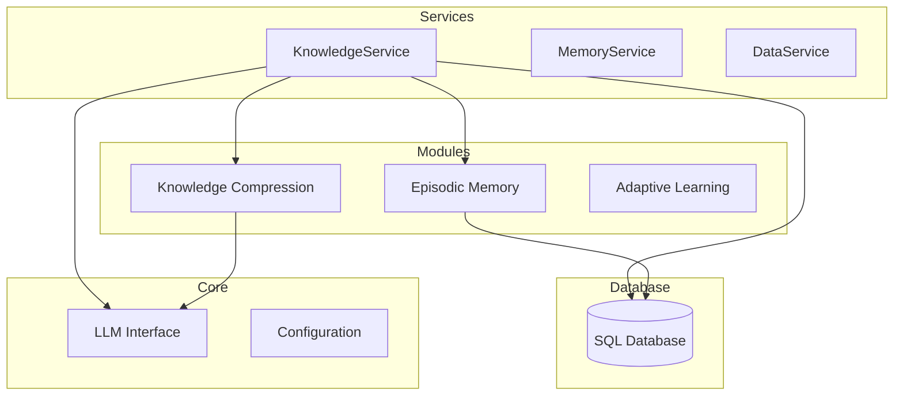
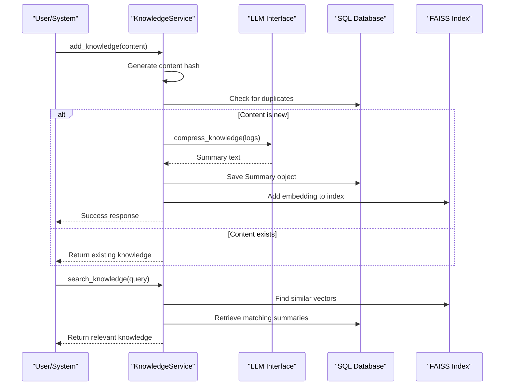
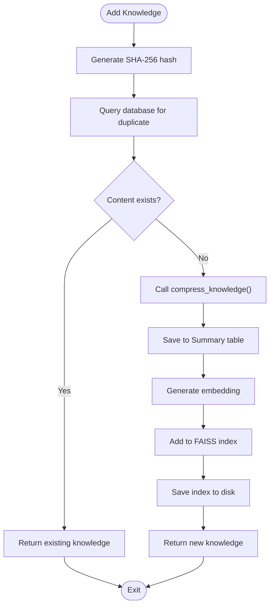

# Knowledge Service API


## Table of Contents
1. [Introduction](#introduction)
2. [Project Structure](#project-structure)
3. [Core Components](#core-components)
4. [Architecture Overview](#architecture-overview)
5. [Detailed Component Analysis](#detailed-component-analysis)
6. [Knowledge Compression Process](#knowledge-compression-process)
7. [Vectorization and Semantic Search](#vectorization-and-semantic-search)
8. [Usage Examples](#usage-examples)
9. [Performance Considerations](#performance-considerations)
10. [Failure Modes and Error Handling](#failure-modes-and-error-handling)
11. [Integration with External Systems](#integration-with-external-systems)

## Introduction
The Knowledge Service API is a core component of the RAVANA system responsible for managing semantic memory and knowledge compression. It enables the storage, retrieval, and distillation of long-term knowledge from episodic memories through LLM-driven summarization. The service integrates vector embeddings for semantic search using SentenceTransformers and FAISS, while persisting structured knowledge in a SQL database. This documentation provides comprehensive details on its functionality, architecture, usage patterns, and integration points.

## Project Structure
The Knowledge Service is organized within a modular repository structure that separates concerns across functional domains. The service layer coordinates business logic, while modules handle specialized cognitive functions like knowledge compression and episodic memory.



**Diagram sources**
- [services/knowledge_service.py](file://services/knowledge_service.py)
- [modules/knowledge_compression/main.py](file://modules/knowledge_compression/main.py)
- [database/models.py](file://database/models.py)

**Section sources**
- [services/knowledge_service.py](file://services/knowledge_service.py)
- [modules/knowledge_compression](file://modules/knowledge_compression)

## Core Components
The Knowledge Service API consists of several interconnected components that manage the lifecycle of knowledge within the system. The primary class `KnowledgeService` handles knowledge storage, retrieval, and semantic search, while delegating summarization tasks to the knowledge compression module.

Key responsibilities include:
- **Knowledge Ingestion**: Processing raw content into structured summaries
- **Deduplication**: Using SHA-256 hashing to prevent redundant storage
- **Semantic Indexing**: Maintaining a FAISS vector index for similarity search
- **Persistence**: Storing knowledge entries in a SQL database via SQLModel
- **Retrieval**: Providing multiple access patterns (by category, recency, search)

The service follows a layered architecture with clear separation between data access, business logic, and external integrations.

**Section sources**
- [services/knowledge_service.py](file://services/knowledge_service.py#L1-L255)
- [database/models.py](file://database/models.py#L20-L30)

## Architecture Overview
The Knowledge Service operates as a middleware component that bridges raw episodic memories with actionable long-term knowledge. It follows a producer-consumer pattern where episodic memories are compressed into semantic knowledge units that can be efficiently queried.



**Diagram sources**
- [services/knowledge_service.py](file://services/knowledge_service.py#L1-L255)
- [modules/knowledge_compression/main.py](file://modules/knowledge_compression/main.py#L1-L42)

## Detailed Component Analysis

### KnowledgeService Class
The `KnowledgeService` class is the primary interface for knowledge management operations. It encapsulates database interactions, vector indexing, and compression workflows.

#### Initialization and Setup
The service initializes with a database engine and an optional embedding model. By default, it uses the `all-MiniLM-L6-v2` SentenceTransformer model for generating 384-dimensional embeddings.

```python
def __init__(self, engine, embedding_model=None):
    self.engine = engine
    self.embedding_model = embedding_model or SentenceTransformer('all-MiniLM-L6-v2')
    self.embedding_dim = self.embedding_model.get_sentence_embedding_dimension()
    self.faiss_index = None
    self.id_map = []
    self._initialize_semantic_search()
```

During initialization, the service attempts to load an existing FAISS index from disk or creates a new one. It also preloads all existing summaries into the index for comprehensive search coverage.

**Section sources**
- [services/knowledge_service.py](file://services/knowledge_service.py#L15-L80)

#### Knowledge Storage Process
The `add_knowledge()` method implements a robust workflow for ingesting new knowledge:



**Diagram sources**
- [services/knowledge_service.py](file://services/knowledge_service.py#L85-L150)

**Section sources**
- [services/knowledge_service.py](file://services/knowledge_service.py#L85-L150)
- [test_enhanced_knowledge_service.py](file://tests/test_enhanced_knowledge_service.py#L20-L45)

#### Retrieval Methods
The service provides multiple retrieval interfaces:

- **`get_knowledge_by_category()`**: Retrieves entries filtered by category
- **`get_recent_knowledge()`**: Returns entries from a specified time window
- **`search_knowledge()`**: Performs text-based search with relevance scoring

The relevance score is calculated based on keyword overlap between the query and summary text:

```python
def _calculate_relevance(self, query: str, text: str) -> float:
    query_words = set(query.lower().split())
    text_words = set(text.lower().split())
    if not query_words:
        return 0.0
    matches = len(query_words.intersection(text_words))
    return matches / len(query_words)
```

**Section sources**
- [services/knowledge_service.py](file://services/knowledge_service.py#L152-L195)

## Knowledge Compression Process
The knowledge compression system distills episodic memories into concise, actionable insights using LLM-driven summarization. This process transforms raw experience data into structured long-term knowledge.

### Compression Workflow
The compression process follows these steps:

1. **Input Aggregation**: Collect recent interactions and summaries
2. **Prompt Construction**: Format logs using the compression prompt template
3. **LLM Processing**: Generate a summary via the LLM interface
4. **Persistence**: Save the summary to both JSON file and database
5. **Return**: Provide structured summary data to the caller


**Diagram sources**
- [modules/knowledge_compression/main.py](file://modules/knowledge_compression/main.py#L1-L42)
- [modules/knowledge_compression/compression_prompts.py](file://modules/knowledge_compression/compression_prompts.py)

### Prompt Engineering
The compression prompt is designed to elicit structured, actionable summaries from the LLM:

```
"You are an AI tasked with summarizing accumulated knowledge and logs. 
Given the following logs, produce a concise summary report of new facts learned, key outcomes, and next goals.
Logs: {logs}
Respond in a clear, structured format."
```

This prompt guides the LLM to focus on three key aspects:
- **New facts learned**: Extracting novel information
- **Key outcomes**: Identifying significant results or conclusions
- **Next goals**: Suggesting future directions or objectives

**Section sources**
- [modules/knowledge_compression/compression_prompts.py](file://modules/knowledge_compression/compression_prompts.py)

### Persistence Mechanism
Compressed knowledge is persisted in two locations for redundancy and accessibility:

1. **JSON File Storage**: Immediate persistence to `compressed_memory.json`
2. **Database Storage**: Structured storage in the SQL database's Summary table

The `save_summary()` function appends entries to the JSON file:

```python
def save_summary(entry):
    data = load_summaries()
    data.append(entry)
    with open(COMPRESSED_FILE, 'w', encoding='utf-8') as f:
        json.dump(data, f, indent=2)
```

This dual-storage approach ensures knowledge is both human-readable and queryable through standard database operations.

**Section sources**
- [modules/knowledge_compression/compressed_memory.py](file://modules/knowledge_compression/compressed_memory.py)
- [services/knowledge_service.py](file://services/knowledge_service.py#L110-L120)

## Vectorization and Semantic Search
The Knowledge Service implements semantic search capabilities through vector embeddings and FAISS indexing, enabling similarity-based retrieval beyond simple keyword matching.

### Embedding Configuration
The service uses SentenceTransformers with the `all-MiniLM-L6-v2` model by default, which provides 384-dimensional embeddings suitable for semantic similarity tasks. The model is loaded lazily during initialization and cached for subsequent use.

### FAISS Index Management
The service maintains a persistent FAISS index for efficient similarity search:

- **Index Type**: `IndexFlatL2` (Euclidean distance)
- **Persistence**: Saved to `knowledge_index.faiss` and `knowledge_id_map.pkl`
- **Initialization**: Loads existing index or creates new one
- **Updates**: Incrementally adds new embeddings and persists changes

When the service starts, it automatically loads all existing summaries into the index:

```python
if len(self.id_map) == 0:
    with Session(self.engine) as session:
        all_summaries = session.exec(select(Summary)).all()
    if all_summaries:
        texts = [s.summary_text for s in all_summaries]
        embeddings = self.embedding_model.encode(texts, convert_to_numpy=True)
        embeddings = np.array(embeddings, dtype=np.float32)
        self.faiss_index.add(embeddings)
        self.id_map = [s.id for s in all_summaries]
```

### Semantic Search Limitations
If FAISS is not available, the service gracefully degrades to text-based search only. The semantic search feature is optional and does not affect core functionality.

**Section sources**
- [services/knowledge_service.py](file://services/knowledge_service.py#L33-L80)
- [modules/episodic_memory/embedding_service.py](file://modules/episodic_memory/embedding_service.py#L71-L104)

## Usage Examples

### Storing Knowledge
To store new knowledge, use the `add_knowledge()` method:

```python
# Basic knowledge storage
result = knowledge_service.add_knowledge(
    content="Neural networks require large datasets for effective training.",
    source="research_paper",
    category="machine_learning"
)

print(result)
# Output: {
#   'timestamp': '2023-12-05T10:30:00',
#   'summary': 'Neural networks require large datasets...',
#   'source': 'research_paper',
#   'category': 'machine_learning',
#   'duplicate': False,
#   'id': 123
# }
```

The service automatically handles deduplication:

```python
# Attempting to store duplicate content
result1 = knowledge_service.add_knowledge(content="Identical text", source="test")
result2 = knowledge_service.add_knowledge(content="Identical text", source="test")

assert result1['duplicate'] == False
assert result2['duplicate'] == True
```

### Querying Compressed Memories
Retrieve knowledge using various access patterns:

```python
# Get knowledge by category
ml_knowledge = knowledge_service.get_knowledge_by_category("machine_learning", limit=5)

# Search for relevant knowledge
results = knowledge_service.search_knowledge("neural network training")

# Get recent knowledge
recent = knowledge_service.get_recent_knowledge(hours=24)
```

### Managing Knowledge Retention
The system automatically manages knowledge retention through structured storage and indexing. To trigger manual compression:

```python
# Compress recent knowledge into long-term memory
summary = knowledge_service.compress_and_save_knowledge()
print(f"Compressed knowledge: {summary['summary']}")
```

**Section sources**
- [test_enhanced_knowledge_service.py](file://tests/test_enhanced_knowledge_service.py#L20-L75)
- [services/knowledge_service.py](file://services/knowledge_service.py#L197-L255)

## Performance Considerations

### Chunking Strategies
For optimal performance, consider these chunking guidelines:

- **Input Size**: Keep individual knowledge entries under 2000 tokens
- **Batch Processing**: Use `compress_and_save_knowledge()` for batch compression
- **Index Updates**: The FAISS index is updated incrementally, minimizing overhead

### Recall vs Precision Trade-offs
The current implementation prioritizes precision over recall:

- **Text Search**: Uses exact substring matching (`LIKE` queries)
- **Relevance Scoring**: Based on keyword overlap ratio
- **Semantic Search**: Available but not integrated with primary search

To improve recall, consider:
- Implementing full-text search (e.g., PostgreSQL tsvector)
- Using cosine similarity instead of Euclidean distance
- Adding synonym expansion to queries

### Cache Utilization
The system employs several caching mechanisms:

- **Embedding Model**: Loaded once and reused
- **FAISS Index**: Persisted to disk between sessions
- **Database Connections**: Managed by SQLModel session

For high-throughput scenarios, consider:
- Adding an in-memory cache for frequent queries
- Pre-computing embeddings for known content
- Batch processing knowledge additions

**Section sources**
- [services/knowledge_service.py](file://services/knowledge_service.py#L33-L80)
- [modules/episodic_memory/embedding_service.py](file://modules/episodic_memory/embedding_service.py#L102-L137)

## Failure Modes and Error Handling

### LLM Timeout During Compression
The `compress_knowledge()` function may fail due to LLM timeouts or connectivity issues:

```python
try:
    summary = call_llm(prompt)
except Exception as e:
    logger.error(f"LLM call failed: {e}")
    raise
```

**Mitigation Strategies**:
- Implement retry logic with exponential backoff
- Set appropriate timeout values in `call_llm()`
- Provide fallback summarization methods
- Monitor LLM service health

### FAISS Initialization Failures
If FAISS is not installed or index files are corrupted:

```python
try:
    import faiss
except ModuleNotFoundError:
    logger.warning("Faiss library not found. Semantic search disabled.")
    self.faiss_index = None
```

The service gracefully degrades to text-based search only, ensuring core functionality remains available.

### Database Connection Issues
All database operations are wrapped in try-except blocks with proper session management. Connection failures will raise exceptions that should be handled by the calling context.

### Error Handling Best Practices
The service follows these error handling principles:
- **Comprehensive Logging**: All errors are logged with `exc_info=True`
- **Graceful Degradation**: Critical features remain available when optional components fail
- **Clear Error Propagation**: Exceptions are raised after logging
- **Resource Cleanup**: Database sessions are properly closed using context managers

**Section sources**
- [services/knowledge_service.py](file://services/knowledge_service.py#L50-L60)
- [services/knowledge_service.py](file://services/knowledge_service.py#L130-L150)

## Integration with External Systems

### SentenceTransformers for Embeddings
The service integrates with SentenceTransformers to generate semantic embeddings:

- **Model**: `all-MiniLM-L6-v2` (384-dimensional)
- **Usage**: Semantic similarity, vector search
- **Configuration**: Default model with CPU/GPU auto-detection

The embedding process is tightly integrated with FAISS for efficient similarity search.

### ChromaDB Migration Path
While the current Knowledge Service uses FAISS, the system has a migration path from ChromaDB:

- **Historical Context**: Episodic memory module previously used ChromaDB
- **Migration Tool**: `setup_database.py` provides migration utilities
- **Current State**: Knowledge Service uses direct FAISS integration

The episodic memory system still references ChromaDB in its codebase, indicating a transitional state in the architecture.

### SQL Database Schema
The service uses SQLModel to define the `Summary` table structure:

```python
class Summary(SQLModel, table=True):
    id: int | None = Field(default=None, primary_key=True)
    timestamp: str
    summary_text: str
    source: str | None = Field(default="unknown")
    category: str | None = Field(default="misc")
    content_hash: str | None = Field(default=None)
```

This schema supports efficient querying by category, timestamp, and content hash for deduplication.

**Section sources**
- [database/models.py](file://database/models.py#L20-L30)
- [services/knowledge_service.py](file://services/knowledge_service.py#L10-L15)
- [modules/episodic_memory/setup_database.py](file://modules/episodic_memory/setup_database.py#L0-L31)

**Referenced Files in This Document**   
- [knowledge_service.py](file://services/knowledge_service.py)
- [main.py](file://modules/knowledge_compression/main.py)
- [compression_prompts.py](file://modules/knowledge_compression/compression_prompts.py)
- [compressed_memory.py](file://modules/knowledge_compression/compressed_memory.py)
- [models.py](file://database/models.py)
- [test_enhanced_knowledge_service.py](file://tests/test_enhanced_knowledge_service.py)
