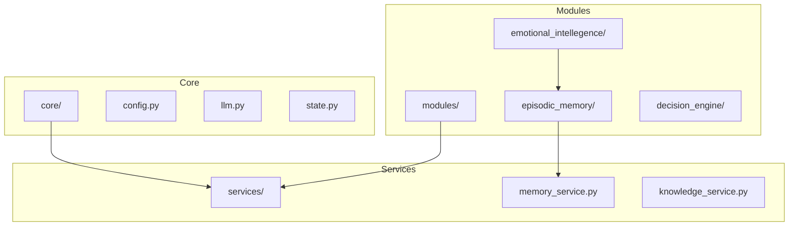
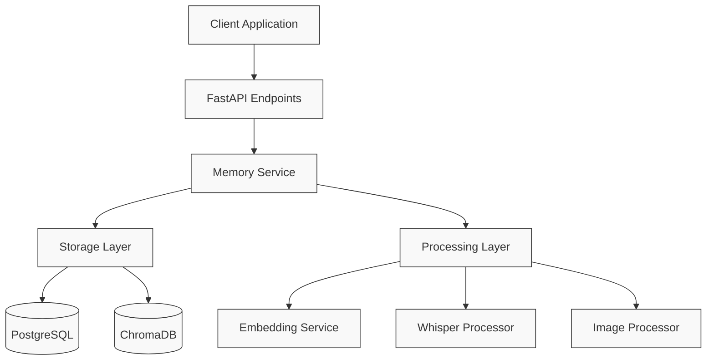
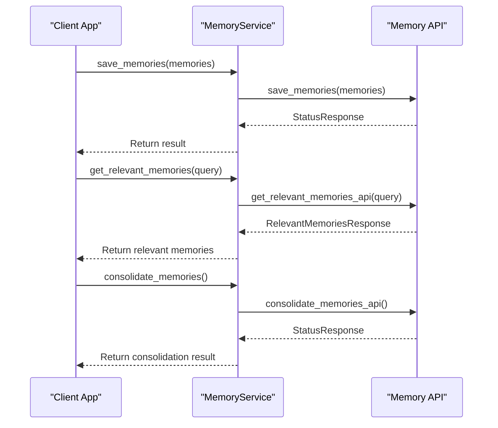
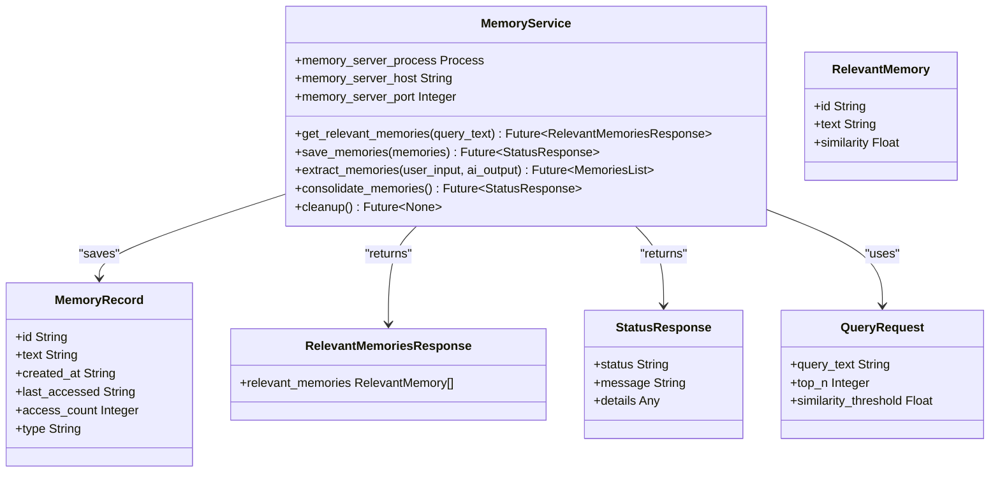
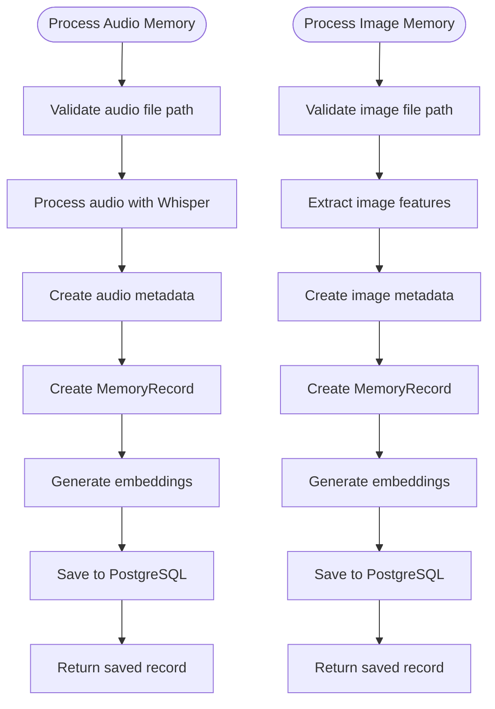
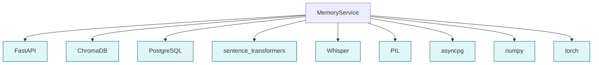

# Memory Service API

## Table of Contents
1. [Introduction](#introduction)
2. [Project Structure](#project-structure)
3. [Core Components](#core-components)
4. [Architecture Overview](#architecture-overview)
5. [Detailed Component Analysis](#detailed-component-analysis)
6. [Dependency Analysis](#dependency-analysis)
7. [Performance Considerations](#performance-considerations)
8. [Troubleshooting Guide](#troubleshooting-guide)
9. [Conclusion](#conclusion)

## Introduction
The Memory Service API is a comprehensive system designed for managing episodic memory operations within an AGI framework. It provides robust functionality for saving, retrieving, and consolidating memories, with support for multi-modal data including text, audio, and images. The system leverages advanced technologies such as FastAPI for the backend, ChromaDB for vector storage, and PostgreSQL with pgvector for persistent multi-modal memory storage. The API supports context-aware retrieval through similarity search and integrates with an emotional intelligence system for mood-tagged memories. This documentation provides a detailed analysis of the API's methods, underlying architecture, and integration points, offering guidance for developers and users.

## Project Structure
The project structure is organized into several key directories that reflect the modular design of the system. The core functionality is distributed across the `core`, `modules`, and `services` directories, with each serving a distinct purpose in the overall architecture.

**Diagram sources**
- [services\memory_service.py](file://services\memory_service.py#L1-L86)
- [modules\episodic_memory\memory.py](file://modules\episodic_memory\memory.py#L1-L721)

**Section sources**
- [services\memory_service.py](file://services\memory_service.py#L1-L86)
- [modules\episodic_memory\memory.py](file://modules\episodic_memory\memory.py#L1-L721)

## Core Components
The Memory Service API is built around several core components that work together to provide a comprehensive memory management system. The primary components include the MemoryService class, which serves as the main interface for memory operations, and the underlying memory module that implements the actual functionality. The system uses ChromaDB for in-memory vector storage and PostgreSQL with pgvector for persistent multi-modal storage. The API supports both text and multi-modal memories, with specialized processing for audio and image content. The emotional intelligence system is integrated to allow for mood-tagged memories, enhancing the context-awareness of the retrieval system.

**Section sources**
- [services\memory_service.py](file://services\memory_service.py#L1-L86)
- [modules\episodic_memory\memory.py](file://modules\episodic_memory\memory.py#L1-L721)

## Architecture Overview
The Memory Service API follows a microservices-inspired architecture with clear separation of concerns. The system is designed to be extensible, supporting both standalone operation and integration within a larger AGI framework. The architecture consists of several layers: the API layer, which exposes endpoints via FastAPI; the service layer, which orchestrates operations; the storage layer, which handles data persistence; and the processing layer, which manages embeddings and multi-modal content.

**Diagram sources**
- [modules\episodic_memory\memory.py](file://modules\episodic_memory\memory.py#L1-L721)
- [modules\episodic_memory\multi_modal_service.py](file://modules\episodic_memory\multi_modal_service.py#L1-L656)

## Detailed Component Analysis

### Memory Service Analysis
The MemoryService class provides the primary interface for memory operations within the AGI system. It acts as a bridge between the main application and the underlying memory storage system, handling both direct API calls and process management.

#### For API/Service Components:

**Diagram sources**
- [services\memory_service.py](file://services\memory_service.py#L1-L86)
- [modules\episodic_memory\memory.py](file://modules\episodic_memory\memory.py#L1-L721)

**Section sources**
- [services\memory_service.py](file://services\memory_service.py#L1-L86)

### Memory Module Analysis
The memory module implements the core functionality of the Memory Service API, providing methods for saving, retrieving, and consolidating memories. It uses ChromaDB for vector storage and similarity search, with support for multi-modal data through integration with PostgreSQL and pgvector.

#### For Object-Oriented Components:

**Diagram sources**
- [modules\episodic_memory\memory.py](file://modules\episodic_memory\memory.py#L1-L721)

**Section sources**
- [modules\episodic_memory\memory.py](file://modules\episodic_memory\memory.py#L1-L721)

### Multi-Modal Service Analysis
The MultiModalMemoryService class provides advanced functionality for processing and storing multi-modal memories, including audio and image content. It orchestrates the various components of the system, including the PostgreSQL store, embedding service, and Whisper processor.

#### For Complex Logic Components:

**Diagram sources**
- [modules\episodic_memory\multi_modal_service.py](file://modules\episodic_memory\multi_modal_service.py#L1-L656)

**Section sources**
- [modules\episodic_memory\multi_modal_service.py](file://modules\episodic_memory\multi_modal_service.py#L1-L656)

## Dependency Analysis
The Memory Service API has a well-defined dependency structure that enables both standalone operation and integration within a larger system. The core dependencies include FastAPI for the web framework, ChromaDB for vector storage, and PostgreSQL with pgvector for persistent multi-modal storage. The system also depends on machine learning libraries such as sentence-transformers for generating embeddings and Whisper for audio processing.

**Diagram sources**
- [modules\episodic_memory\memory.py](file://modules\episodic_memory\memory.py#L1-L721)
- [modules\episodic_memory\multi_modal_service.py](file://modules\episodic_memory\multi_modal_service.py#L1-L656)

**Section sources**
- [modules\episodic_memory\memory.py](file://modules\episodic_memory\memory.py#L1-L721)
- [modules\episodic_memory\multi_modal_service.py](file://modules\episodic_memory\multi_modal_service.py#L1-L656)

## Performance Considerations
The Memory Service API is designed with performance in mind, incorporating several optimization strategies to handle large memory stores efficiently. The system uses in-memory caching for frequently accessed embeddings, reducing the need for repeated computation. For large-scale operations, the API supports batch processing with configurable parallelism, allowing multiple files to be processed simultaneously. The garbage collection policy is implemented through periodic consolidation cycles that merge related memories and remove duplicates, reducing storage overhead and improving retrieval performance. Backup procedures are automated through the persistent storage in PostgreSQL, with regular snapshots recommended for disaster recovery. The system also includes comprehensive monitoring and statistics collection to identify performance bottlenecks and optimize resource usage.

**Section sources**
- [modules\episodic_memory\memory.py](file://modules\episodic_memory\memory.py#L1-L721)
- [modules\episodic_memory\multi_modal_service.py](file://modules\episodic_memory\multi_modal_service.py#L1-L656)

## Troubleshooting Guide
Common issues with the Memory Service API typically relate to configuration, dependencies, or resource limitations. When the service fails to start, verify that all required dependencies are installed and that the PostgreSQL database is accessible. For memory retrieval issues, check that the embedding model is properly loaded and that the similarity threshold is set appropriately. If consolidation operations fail, ensure that the LLM service is available and responsive. For multi-modal processing issues, verify that the Whisper model is downloaded and that audio/image processing dependencies are installed. The system includes comprehensive logging that can help diagnose issues, with error messages providing specific guidance for resolution.

**Section sources**
- [services\memory_service.py](file://services\memory_service.py#L1-L86)
- [modules\episodic_memory\memory.py](file://modules\episodic_memory\memory.py#L1-L721)

## Conclusion
The Memory Service API provides a robust and extensible framework for managing episodic memory operations in an AGI system. Its modular design supports both simple text-based memories and complex multi-modal content, with advanced features for context-aware retrieval and memory consolidation. The integration with emotional intelligence allows for mood-tagged memories, enhancing the system's ability to provide contextually relevant responses. The API's design prioritizes scalability and performance, with support for large memory stores and efficient retrieval through vector search. By following the patterns and practices outlined in this documentation, developers can effectively utilize the Memory Service API to build intelligent systems with persistent, context-aware memory capabilities.

**Referenced Files in This Document**   
- [services\memory_service.py](file://services\memory_service.py)
- [modules\episodic_memory\memory.py](file://modules\episodic_memory\memory.py)
- [modules\episodic_memory\models.py](file://modules\episodic_memory\models.py)
- [modules\episodic_memory\client.py](file://modules\episodic_memory\client.py)
- [modules\episodic_memory\multi_modal_service.py](file://modules\episodic_memory\multi_modal_service.py)
- [modules\episodic_memory\embedding_service.py](file://modules\episodic_memory\embedding_service.py)
- [modules\episodic_memory\postgresql_store.py](file://modules\episodic_memory\postgresql_store.py)