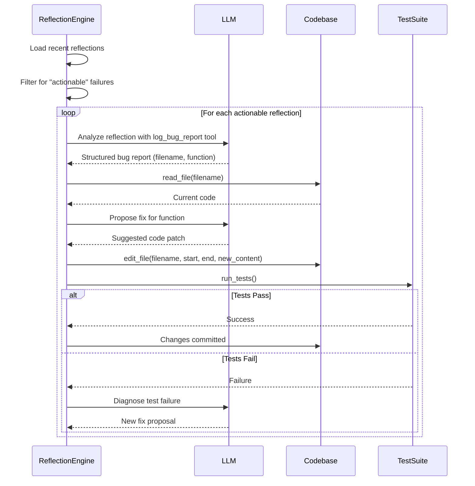
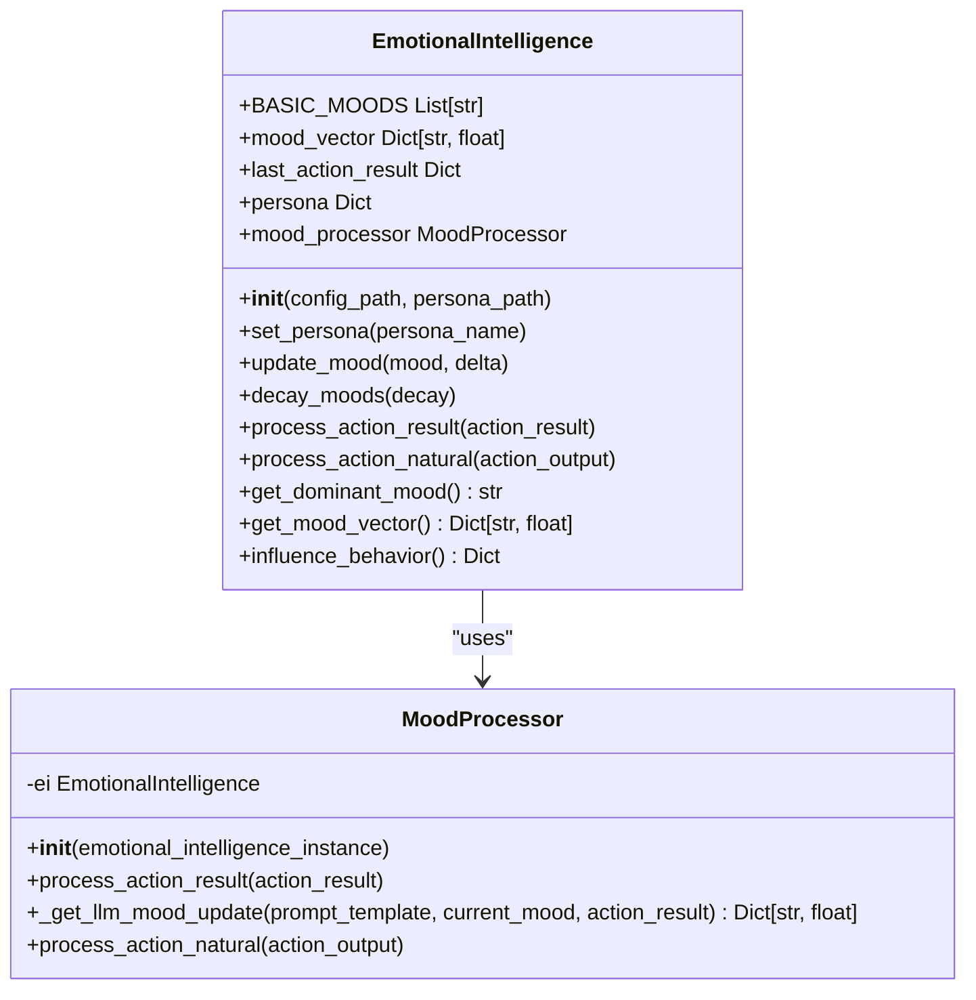
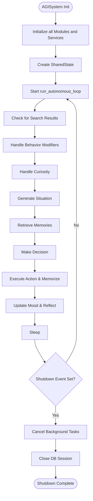

# Module-Specific APIs


## Table of Contents
1. [EpisodicMemoryClient: Direct Memory Access](#episodicmemoryclient-direct-memory-access)
2. [ReflectionEngine: Self-Modification Workflows](#reflectionengine-self-modification-workflows)
3. [GoalPlanner: Task Scheduling and Goal Submission](#goalplanner-task-scheduling-and-goal-submission)
4. [EmotionalIntelligence: Mood State Queries](#emotionalintelligence-mood-state-queries)
5. [Initialization and Lifecycle Coordination](#initialization-and-lifecycle-coordination)
6. [Concurrency and Asynchronous Operations](#concurrency-and-asynchronous-operations)
7. [Exception Handling and Propagation](#exception-handling-and-propagation)

## EpisodicMemoryClient: Direct Memory Access

The `EpisodicMemoryClient` provides a programmatic interface for external systems to interact with the AGI's memory subsystem. It operates as a REST client that communicates with a memory server running on `http://localhost:8001`. The client supports both text and multi-modal memory operations, enabling the storage, retrieval, and analysis of episodic memories.

### Method Signatures and Data Contracts

The API is exposed through a set of top-level functions in `client.py`. These functions handle HTTP communication, retries, and error handling internally.

**Core Memory Operations:**
- `extract_memories(user_input: str, ai_output: str) -> Optional[Dict[str, Any]]`: Extracts structured memories from a user-AI interaction.
- `save_memories(memories_list: List[str], memory_type: str = 'long-term') -> Optional[Dict[str, Any]]`: Persists a list of memory strings with an optional type label.
- `get_relevant_memories(query_text: str, top_n: int = 5, similarity_threshold: float = 0.7) -> Optional[Dict[str, Any]]`: Retrieves the most relevant memories based on semantic similarity to a query.

**Multi-Modal Memory Operations:**
- `upload_audio_memory(audio_file_path: str, context: Optional[str] = None, tags: Optional[List[str]] = None) -> Optional[Dict[str, Any]]`: Uploads an audio file (e.g., WAV) for transcription and memory storage.
- `upload_image_memory(image_file_path: str, description: Optional[str] = None, tags: Optional[List[str]] = None) -> Optional[Dict[str, Any]]`: Uploads an image file (e.g., JPEG, PNG) for visual analysis and memory storage.
- `cross_modal_search(query_content: str, query_type: str, target_types: List[str], limit: int = 10, similarity_threshold: float = 0.7) -> Optional[Dict[str, Any]]`: Performs a search where the query and target modalities differ (e.g., text query for similar images).

**Advanced Search and Analytics:**
- `advanced_search(query: str, search_mode: str = "hybrid", content_types: Optional[List[str]] = None, memory_types: Optional[List[str]] = None, limit: int = 10, similarity_threshold: float = 0.7, tags: Optional[List[str]] = None) -> Optional[Dict[str, Any]]`: Executes a search with multiple filters and modes.
- `find_similar_memories(memory_id: str, limit: int = 10, similarity_threshold: float = 0.7) -> Optional[Dict[str, Any]]`: Finds memories semantically similar to a given memory ID.
- `get_memory_statistics() -> Optional[Dict[str, Any]]`: Returns system-wide statistics about memory usage and types.

### Invocation Patterns and Examples

The client functions are synchronous and return `None` on failure or a dictionary on success. A helper function `make_request` manages retries for connection errors and timeouts.

```python
# Example: Querying relevant memories
result = get_relevant_memories("Discuss the impact of quantum computing on cryptography")
if result:
    for memory in result.get("relevant_memories", []):
        print(f"Memory: {memory['content']}, Score: {memory['score']:.3f}")
else:
    print("Failed to retrieve memories.")
```

```python
# Example: Uploading an image as a memory
result = upload_image_memory(
    "path/to/sunset.jpg", 
    description="A beautiful sunset over the ocean, symbolizing the end of a productive day.",
    tags=["nature", "reflection", "end-of-day"]
)
if result and result.get("success"):
    print(f"Image uploaded successfully with memory ID: {result['memory_id']}")
```

**Section sources**
- [client.py](file://modules/episodic_memory/client.py#L0-L199)

## ReflectionEngine: Self-Modification Workflows

The `ReflectionEngine`, implemented in the `agent_self_reflection` module, enables the AGI to analyze its past actions and autonomously modify its own code. The engine consists of two primary components: reflection generation and self-modification.

### Self-Reflection Cycles

The `main.py` file defines the `reflect_on_task` function, which generates a self-reflection by sending a task summary and outcome to an LLM. The prompt is defined in `reflection_prompts.py`. The resulting reflection is timestamped and stored in a local database via `reflection_db.save_reflection`.

```python
def reflect_on_task(task_summary, outcome):
    prompt = REFLECTION_PROMPT.format(task_summary=task_summary, outcome=outcome)
    reflection = call_llm(prompt) # Calls the LLM
    entry = {
        "timestamp": datetime.now(timezone.utc).isoformat(),
        "task_summary": task_summary,
        "outcome": outcome,
        "reflection": reflection
    }
    save_reflection(entry) # Persists to disk
    return entry
```

A CLI is provided to trigger reflections:
```bash
python main.py reflect --task "Analyze the latest physics paper" --outcome "Generated a summary but missed a key equation"
```

### Self-Modification Workflows

The `self_modification.py` module implements a sophisticated self-modification system. It uses a tool-calling pattern where an LLM is given access to a restricted set of functions to read, edit, and test code.

#### Key Tools:
- `read_file(filename)`: Reads a file from the module's directory.
- `edit_file(filename, start, end, new_content)`: Replaces a range of lines in a file.
- `run_tests(test_command)`: Executes the test suite in a sandboxed temporary directory.

The workflow is:
1. **Identify Actionable Failures:** The `find_actionable_reflections` function scans stored reflections for keywords like "fail" or "error".
2. **Extract Bug Information:** The `extract_bug_info` function uses an LLM with a `log_bug_report` tool to parse a reflection and extract structured bug data (filename, function, summary).
3. **Propose and Apply Fix:** The system can use the LLM to generate a code patch, which is then applied using `edit_file`.
4. **Validate with Tests:** The `run_tests` tool is used to verify that the modification does not break existing functionality before the changes are committed.

This creates a closed-loop system where the AGI can diagnose a problem in its own code, propose a fix, and validate the fix—all without human intervention.



**Diagram sources**
- [main.py](file://modules/agent_self_reflection/main.py#L0-L51)
- [self_modification.py](file://modules/agent_self_reflection/self_modification.py#L0-L199)

**Section sources**
- [main.py](file://modules/agent_self_reflection/main.py#L0-L51)
- [self_modification.py](file://modules/agent_self_reflection/self_modification.py#L0-L199)

## GoalPlanner: Task Scheduling and Goal Submission

The `GoalPlanner` class in `modules/decision_engine/planner.py` provides a simple in-memory system for managing goals and tasks. It is designed for direct programmatic interaction to schedule new tasks or query the status of ongoing work.

### Method Signatures and Data Contracts

The `GoalPlanner` class uses a shared in-memory dictionary `_goals` for persistence across instances.

- `__init__(self)`: Initializes the planner and connects to the shared `_goals` store.
- `get_goal(self, goal_id: str) -> Optional[Dict[str, Any]]`: Retrieves a goal by its UUID.
- `get_all_goals(self, status: Optional[str] = None) -> List[Dict[str, Any]]`: Retrieves all goals, optionally filtered by status (e.g., "pending", "in_progress").
- `update_goal_status(self, goal_id: str, status: str) -> bool`: Updates the status of a goal. Returns `True` on success, `False` if the goal is not found.
- `add_sub_goal(self, parent_goal_id: str, sub_goal_description: str) -> Optional[str]`: Adds a sub-goal to a parent goal. Returns the new sub-goal's ID or `None` if the parent is not found.

The `plan_from_context` function is a stateless utility that creates a new goal from a text context and stores it in the shared `_goals` dictionary, returning the new goal's ID.

### Invocation Patterns and Examples

Goals are created using `plan_from_context` and then managed via the `GoalPlanner` instance.

```python
# Example: Submitting a new goal programmatically
from modules.decision_engine.planner import plan_from_context, GoalPlanner

# Submit a new goal
goal_id = plan_from_context("Write a comprehensive report on renewable energy trends", timeframe="week", priority=8)
print(f"New goal created with ID: {goal_id}")

# Query and manage goals
planner = GoalPlanner()
all_goals = planner.get_all_goals()
pending_goals = planner.get_all_goals(status="pending")

# Update a goal's status
success = planner.update_goal_status(goal_id, "in_progress")
if success:
    print("Goal status updated.")
else:
    print("Failed to update goal status (ID not found).")

# Add a sub-goal
sub_goal_id = planner.add_sub_goal(goal_id, "Research solar panel efficiency advancements")
if sub_goal_id:
    print(f"Sub-goal added with ID: {sub_goal_id}")
```

**Section sources**
- [planner.py](file://modules/decision_engine/planner.py#L0-L199)

## EmotionalIntelligence: Mood State Queries

The `EmotionalIntelligence` interface, located in `modules/emotional_intellegence/emotional_intellegence.py`, models the AGI's emotional state as a vector of mood values. This state influences decision-making and behavior.

### Method Signatures and Data Contracts

The class maintains a `mood_vector` dictionary where keys are mood names (e.g., "Happy", "Curious", "Frustrated") and values are floating-point intensities.

- `__init__(self, config_path, persona_path)`: Loads configuration and persona data from JSON files.
- `set_persona(self, persona_name: str)`: Switches the AGI's emotional persona (e.g., "Optimistic", "Pessimistic"), which applies multipliers to mood updates.
- `update_mood(self, mood: str, delta: float)`: Increases or decreases the intensity of a specific mood, applying the current persona's multiplier.
- `decay_moods(self, decay: float = 0.05)`: Gradually reduces all mood intensities over time.
- `process_action_result(self, action_result: dict)`: Processes a structured result from an action to update moods based on predefined triggers.
- `process_action_natural(self, action_output: str)`: Processes a natural language description of an action output by using an LLM to classify it into emotional triggers.
- `get_dominant_mood(self) -> str`: Returns the name of the mood with the highest intensity.
- `get_mood_vector(self) -> Dict[str, float]`: Returns a copy of the entire mood vector.
- `influence_behavior(self) -> dict`: Returns a dictionary of behavior modifiers (e.g., `{"suggest_break": True}`) based on the dominant mood.

### Invocation Patterns and Examples

The mood state is primarily updated automatically by the system, but it can be queried at any time.

```python
# Example: Querying the current mood state
from modules.emotional_intellegence.emotional_intellegence import EmotionalIntelligence

ei = EmotionalIntelligence()
current_mood_vector = ei.get_mood_vector()
dominant_mood = ei.get_dominant_mood()
behavior_modifiers = ei.influence_behavior()

print(f"Dominant Mood: {dominant_mood}")
print("Mood Vector:")
for mood, intensity in current_mood_vector.items():
    print(f"  {mood}: {intensity:.3f}")
print(f"Behavior Modifiers: {behavior_modifiers}")

# Example: Manually processing an action
ei.process_action_natural("The agent successfully debugged a complex issue.")
updated_mood_vector = ei.get_mood_vector()
print(f"Mood after success: {ei.get_dominant_mood()}")
```

The `MoodProcessor` class, used internally by `EmotionalIntelligence`, handles the complex logic of converting action outputs into mood updates, often by calling an LLM to interpret the emotional significance of an event.



**Diagram sources**
- [emotional_intellegence.py](file://modules/emotional_intellegence/emotional_intellegence.py#L0-L94)
- [mood_processor.py](file://modules/emotional_intellegence/mood_processor.py#L0-L103)

**Section sources**
- [emotional_intellegence.py](file://modules/emotional_intellegence/emotional_intellegence.py#L0-L94)
- [mood_processor.py](file://modules/emotional_intellegence/mood_processor.py#L0-L103)

## Initialization and Lifecycle Coordination

The lifecycle of the AGI system is orchestrated by the `AGISystem` class in `core/system.py`. This central component is responsible for initializing all modules, managing the main autonomous loop, and ensuring graceful shutdown.

### Initialization Requirements

The `AGISystem` requires a database engine to be passed to its constructor. During initialization (`__init__`), it performs the following steps:
1. **Load Configuration:** Reads settings from `core/config.py`.
2. **Initialize Shared Models:** Loads the `SentenceTransformer` for embeddings and a sentiment analysis pipeline.
3. **Initialize Services:** Creates instances of `DataService`, `KnowledgeService`, and `MemoryService`.
4. **Initialize Modules:** Instantiates `SituationGenerator`, `EmotionalIntelligence`, `CuriosityTrigger`, `ReflectionModule`, and `ExperimentationModule`.
5. **Initialize Managers:** Creates the `EnhancedActionManager` and `AdaptiveLearningEngine`.
6. **Initialize State:** Creates a `SharedState` object to hold the current mood, memories, and other transient data.

### Lifecycle Coordination

The `AGISystem` manages the system's lifecycle through several key methods:
- `run_autonomous_loop(self)`: The main event loop that runs continuously, executing `run_iteration` and sleeping between cycles. It starts background tasks for data collection, event detection, knowledge compression, and memory consolidation.
- `run_iteration(self)`: Executes a single step of the AGI's thought process, following the sequence: check for search results, handle behavior modifiers, handle curiosity, generate a situation, retrieve memories, make a decision, execute the action, and update mood/reflect.
- `run_single_task(self, prompt: str)`: Runs the system for a single, user-specified task, useful for direct API-like interaction.
- `stop(self)`: Triggers a graceful shutdown by setting an `asyncio.Event`, cancelling all background tasks, and closing the database session.



**Diagram sources**
- [system.py](file://core/system.py#L0-L199)

**Section sources**
- [system.py](file://core/system.py#L0-L624)

## Concurrency and Asynchronous Operations

The RAVANA system is built on an asynchronous architecture using Python's `asyncio` framework. This allows it to handle I/O-bound operations efficiently without blocking the main execution thread.

### Async/Await Usage

The primary entry point is the `run_autonomous_loop` method, which is an `async` function. The entire core loop, including `run_iteration`, is designed to be non-blocking. Key operations like LLM calls, database queries, and network requests are executed asynchronously.

- **LLM Calls:** The `call_llm` function in `core/llm.py` is blocking. To use it in an async context, `async_safe_call_llm` wraps it with `loop.run_in_executor(None, ...)`, which runs the blocking call in a thread pool, preventing it from blocking the event loop.
- **Database Operations:** Database queries in `AGISystem.get_recent_events` use `loop.run_in_executor` to execute the synchronous SQLModel calls in a thread pool.
- **Background Tasks:** Long-running processes like `data_collection_task` and `event_detection_task` are started as `asyncio.Task` objects and run concurrently with the main loop.

### Concurrency Models

The system employs several concurrency patterns:
- **Parallel Action Execution:** The `EnhancedActionManager.execute_parallel_actions` method uses an `asyncio.Semaphore` to limit the number of actions that can run in parallel, preventing resource exhaustion.
- **Background Task Management:** The `AGISystem` maintains a list of `background_tasks`. On shutdown, it cancels all tasks and uses `asyncio.gather` to wait for them to finish, ensuring a clean exit.

```python
# Example: Parallel action execution with a semaphore
semaphore = asyncio.Semaphore(self.parallel_limit)
async def execute_with_semaphore(decision):
    async with semaphore:
        return await self.execute_action_enhanced(decision)
tasks = [execute_with_semaphore(decision) for decision in decisions]
results = await asyncio.gather(*tasks, return_exceptions=True)
```

**Section sources**
- [system.py](file://core/system.py#L0-L624)
- [enhanced_action_manager.py](file://core/enhanced_action_manager.py#L34-L89)
- [llm.py](file://core/llm.py#L48-L84)

## Exception Handling and Propagation

The system employs a layered approach to exception handling, with specific patterns for different types of failures.

### Custom Exception Hierarchy

The `core/actions/exceptions.py` module defines a base `ActionError` exception and specific subclasses:
- `InvalidActionError`: Raised when an action name is not found in the registry.
- `InvalidActionParams`: Raised when the parameters for an action are invalid.
- `ActionException`: A general-purpose exception for action execution failures.

### Error Handling Patterns

- **Retry Logic:** The `make_request` function in `client.py` implements a retry mechanism with exponential backoff for HTTP connection errors and timeouts.
- **Graceful Degradation:** In `AGISystem._check_for_search_results`, if saving a search result to memory fails, the system logs a warning but continues processing.
- **Task Cancellation:** Background tasks in `AGISystem` are wrapped in try-except blocks that catch `asyncio.CancelledError` to handle graceful shutdown.
- **Critical Error Handling:** The main loop in `run_autonomous_loop` catches all exceptions, logs them as critical, and implements a longer sleep period before retrying, preventing a crash loop.

Exceptions are generally propagated up to the `AGISystem` level, where they are logged and the system attempts to continue. For critical components, failures are handled locally to prevent cascading errors.

**Section sources**
- [exceptions.py](file://core/actions/exceptions.py#L0-L14)
- [system.py](file://core/system.py#L0-L624)
- [client.py](file://modules/episodic_memory/client.py#L0-L199)

**Referenced Files in This Document**   
- [client.py](file://modules/episodic_memory/client.py)
- [main.py](file://modules/agent_self_reflection/main.py)
- [self_modification.py](file://modules/agent_self_reflection/self_modification.py)
- [planner.py](file://modules/decision_engine/planner.py)
- [emotional_intellegence.py](file://modules/emotional_intellegence/emotional_intellegence.py)
- [mood_processor.py](file://modules/emotional_intellegence/mood_processor.py)
- [system.py](file://core/system.py)