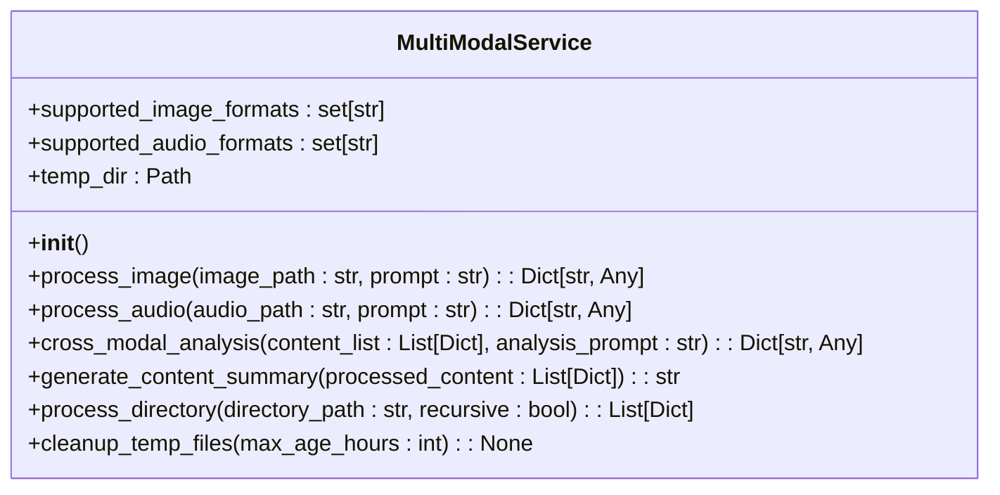
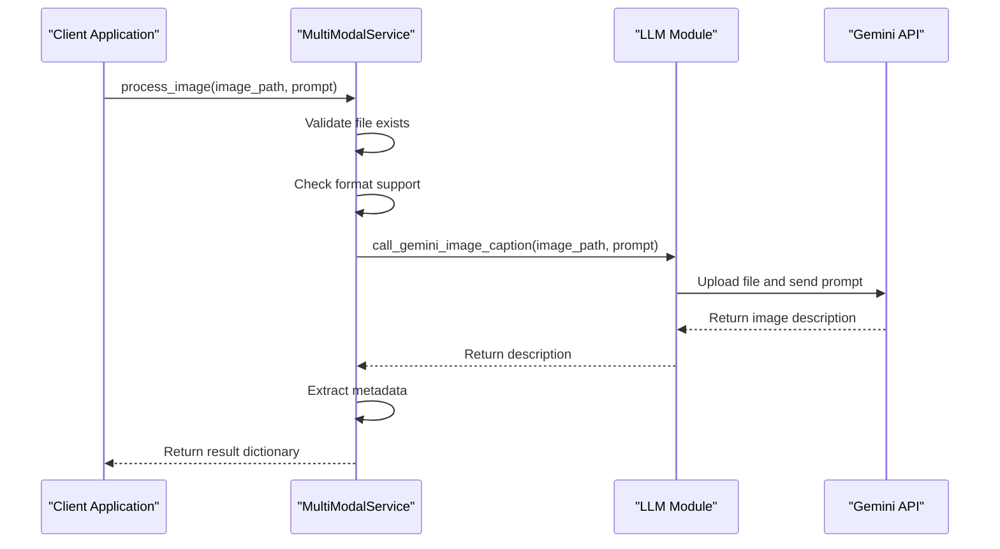
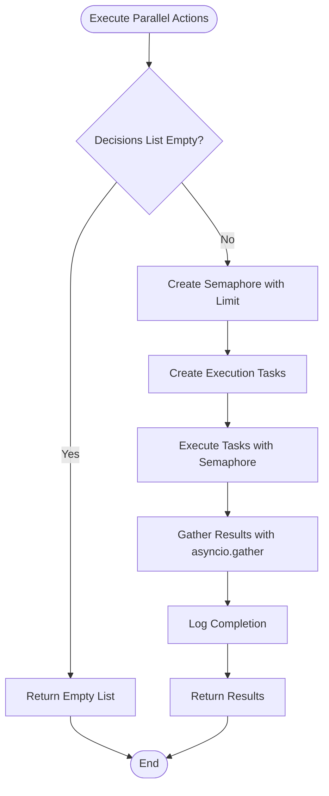

# Multi-modal Service API


## Table of Contents
1. [Introduction](#introduction)
2. [Core Components](#core-components)
3. [Architecture Overview](#architecture-overview)
4. [Detailed Component Analysis](#detailed-component-analysis)
5. [Error Handling](#error-handling)
6. [Performance Considerations](#performance-considerations)
7. [Extensibility and Action System](#extensibility-and-action-system)
8. [Usage Examples](#usage-examples)

## Introduction
The Multi-modal Service API is a core component of the RAVANA AGI system, designed to process and analyze content across multiple modalities including images, audio, and cross-modal data. This service enables the system to extract meaningful insights from diverse input types, perform detailed analysis, and generate comprehensive summaries. The API integrates with external LLM providers, particularly Google's Gemini, to leverage advanced multimodal reasoning capabilities. This documentation provides a comprehensive overview of the API's functionality, architecture, error handling, performance characteristics, and extensibility patterns.

## Core Components
The Multi-modal Service API consists of several key components that work together to provide multimodal processing capabilities. The primary component is the `MultiModalService` class, which handles the core processing logic for images and audio files. This service integrates with the LLM system to leverage external AI models for content analysis. The action system provides a framework for executing multimodal operations as discrete actions within the broader AGI system. The service supports various file formats and provides robust error handling for common issues such as unsupported formats and file access problems.

**Section sources**
- [multi_modal_service.py](file://services/multi_modal_service.py#L0-L350)
- [multi_modal.py](file://core/actions/multi_modal.py#L0-L79)

## Architecture Overview
The Multi-modal Service API follows a layered architecture that separates concerns between service logic, action execution, and LLM integration. The service acts as the primary interface for multimodal processing, delegating specific operations to specialized functions. It integrates with the enhanced action manager, which provides additional capabilities such as caching, parallel execution, and knowledge base integration. The architecture leverages asynchronous programming patterns to handle I/O operations efficiently, particularly when communicating with external LLM APIs. The system uses a registry pattern to manage available actions and their execution.

```mermaid
graph TB
subgraph "Multi-modal Service"
MultiModalService[MultiModalService]
ProcessImage[process_image()]
ProcessAudio[process_audio()]
CrossModal[cross_modal_analysis()]
GenerateSummary[generate_content_summary()]
ProcessDirectory[process_directory()]
end
subgraph "Action System"
ActionManager[EnhancedActionManager]
ActionRegistry[ActionRegistry]
end
subgraph "LLM Integration"
LLM[LLM Module]
Gemini[Gemini API]
end
subgraph "Knowledge System"
KnowledgeService[KnowledgeService]
end
MultiModalService --> LLM
ActionManager --> MultiModalService
ActionManager --> KnowledgeService
LLM --> Gemini
ActionRegistry --> ActionManager
```

**Diagram sources**
- [multi_modal_service.py](file://services/multi_modal_service.py#L0-L350)
- [enhanced_action_manager.py](file://core/enhanced_action_manager.py#L0-L269)
- [llm.py](file://core/llm.py#L177-L376)

## Detailed Component Analysis

### MultiModalService Class Analysis
The `MultiModalService` class is the central component of the multimodal processing system, providing methods for handling various types of media content. It manages supported file formats, temporary file storage, and coordinates with external LLM services for content analysis.

#### Class Diagram


**Diagram sources**
- [multi_modal_service.py](file://services/multi_modal_service.py#L0-L350)

#### Method Analysis

**process_image() Method**
The `process_image()` method handles the processing of image files, supporting formats including JPG, JPEG, PNG, GIF, BMP, and WebP. It validates the input file, checks format support, and uses the Gemini API to generate a detailed description of the image content.

```python
async def process_image(self, image_path: str, prompt: str = "Analyze this image in detail") -> Dict[str, Any]:
    try:
        if not os.path.exists(image_path):
            raise FileNotFoundError(f"Image file not found: {image_path}")
        
        file_ext = Path(image_path).suffix.lower()
        if file_ext not in self.supported_image_formats:
            raise ValueError(f"Unsupported image format: {file_ext}")
        
        # Use Gemini for image captioning
        loop = asyncio.get_event_loop()
        description = await loop.run_in_executor(
            None, 
            call_gemini_image_caption, 
            image_path, 
            prompt
        )
        
        # Extract metadata
        file_size = os.path.getsize(image_path)
        
        result = {
            "type": "image",
            "path": image_path,
            "format": file_ext,
            "size_bytes": file_size,
            "description": description,
            "analysis_prompt": prompt,
            "success": True,
            "error": None
        }
        
        logger.info(f"Successfully processed image: {image_path}")
        return result
```

**Section sources**
- [multi_modal_service.py](file://services/multi_modal_service.py#L30-L73)

**transcribe_audio() Method**
The `process_audio()` method (functionally equivalent to transcribe_audio) handles audio file processing, supporting formats including MP3, WAV, M4A, OGG, and FLAC. It performs similar validation steps as the image processor and uses the Gemini API to analyze and describe audio content.

```python
async def process_audio(self, audio_path: str, prompt: str = "Describe and analyze this audio") -> Dict[str, Any]:
    try:
        if not os.path.exists(audio_path):
            raise FileNotFoundError(f"Audio file not found: {audio_path}")
        
        file_ext = Path(audio_path).suffix.lower()
        if file_ext not in self.supported_audio_formats:
            raise ValueError(f"Unsupported audio format: {file_ext}")
        
        # Use Gemini for audio description
        loop = asyncio.get_event_loop()
        description = await loop.run_in_executor(
            None,
            call_gemini_audio_description,
            audio_path,
            prompt
        )
        
        # Extract metadata
        file_size = os.path.getsize(audio_path)
        
        result = {
            "type": "audio",
            "path": audio_path,
            "format": file_ext,
            "size_bytes": file_size,
            "description": description,
            "analysis_prompt": prompt,
            "success": True,
            "error": None
        }
        
        logger.info(f"Successfully processed audio: {audio_path}")
        return result
```

**Section sources**
- [multi_modal_service.py](file://services/multi_modal_service.py#L71-L109)

**generate_multimodal_response() Method**
The `cross_modal_analysis()` method enables cross-modal reasoning by analyzing multiple content items of different types. It extracts descriptions from successfully processed content and creates a comprehensive analysis prompt for the LLM, which identifies themes, relationships, and insights across modalities.

```python
async def cross_modal_analysis(self, content_list: List[Dict[str, Any]], analysis_prompt: str = None) -> Dict[str, Any]:
    try:
        if not content_list:
            raise ValueError("No content provided for cross-modal analysis")
        
        # Prepare content descriptions
        descriptions = []
        content_types = []
        
        for content in content_list:
            if content.get('success', False):
                descriptions.append(content.get('description', ''))
                content_types.append(content.get('type', 'unknown'))
        
        if not descriptions:
            raise ValueError("No successfully processed content for analysis")
        
        # Create analysis prompt
        if not analysis_prompt:
            analysis_prompt = f"""
            Perform a comprehensive cross-modal analysis of the following content:
            
            Content types: {', '.join(set(content_types))}
            
            Content descriptions:
            {chr(10).join([f"{i+1}. {desc}" for i, desc in enumerate(descriptions)])}
            
            Please provide:
            1. Common themes and patterns across all content
            2. Relationships and connections between different modalities
            3. Insights that emerge from combining these different types of information
            4. Potential applications or implications
            5. Any contradictions or interesting contrasts
            """
        
        # Use LLM for cross-modal analysis
        loop = asyncio.get_event_loop()
        from core.llm import safe_call_llm
        analysis = await loop.run_in_executor(
            None,
            safe_call_llm,
            analysis_prompt
        )
        
        result = {
            "type": "cross_modal_analysis",
            "content_types": content_types,
            "num_items": len(content_list),
            "analysis": analysis,
            "success": True,
            "error": None
        }
        
        logger.info(f"Successfully performed cross-modal analysis on {len(content_list)} items")
        return result
```

**Section sources**
- [multi_modal_service.py](file://services/multi_modal_service.py#L141-L173)

### LLM Integration Analysis
The multimodal service integrates with LLM providers through the core LLM module, primarily leveraging Google's Gemini API for image and audio analysis. The integration uses the `genai` client library to upload files and generate content based on prompts.

#### Sequence Diagram for Image Processing


**Diagram sources**
- [multi_modal_service.py](file://services/multi_modal_service.py#L30-L73)
- [llm.py](file://core/llm.py#L177-L376)

#### LLM Function Integration
The system uses specific functions in the LLM module to handle different modalities:

- `call_gemini_image_caption()`: Processes image files by uploading them to Gemini and requesting a caption based on the provided prompt
- `call_gemini_audio_description()`: Processes audio files similarly, requesting a description of the audio content
- `safe_call_llm()`: Provides a fallback mechanism that tries multiple LLM providers before defaulting to Gemini

The integration with Gemini uses the `files.upload()` method to send media files to the API, which are then processed by the multimodal model (gemini-2.0-flash). This approach allows the system to leverage state-of-the-art multimodal understanding capabilities without requiring local model hosting.

**Section sources**
- [llm.py](file://core/llm.py#L177-L376)
- [multi_modal_service.py](file://services/multi_modal_service.py#L0-L350)

### Embedding Alignment Across Modalities
The system aligns embeddings across modalities through the cross-modal analysis process. When multiple content items are analyzed together, their textual descriptions (generated by the LLM) serve as aligned representations that can be compared and analyzed. The `cross_modal_analysis()` method creates a unified context by combining descriptions from different modalities into a single prompt, allowing the LLM to identify relationships and patterns across the different types of content.

The alignment process works as follows:
1. Each modality (image, audio) is processed independently to generate a textual description
2. These descriptions are treated as embeddings in a shared semantic space
3. The LLM performs cross-modal reasoning by analyzing these textual representations together
4. The resulting analysis identifies connections and insights that emerge from the combination of different modalities

This approach effectively creates a common representation space where different modalities can be compared and analyzed together, enabling true multimodal reasoning.

**Section sources**
- [multi_modal_service.py](file://services/multi_modal_service.py#L141-L173)
- [enhanced_action_manager.py](file://core/enhanced_action_manager.py#L207-L240)

## Error Handling
The Multi-modal Service API implements comprehensive error handling to manage various failure scenarios gracefully. The system uses try-except blocks to catch exceptions and return structured error responses that maintain API consistency.

### Unsupported Formats
When encountering unsupported file formats, the service raises a `ValueError` with a descriptive message:

```python
file_ext = Path(image_path).suffix.lower()
if file_ext not in self.supported_image_formats:
    raise ValueError(f"Unsupported image format: {file_ext}")
```

The supported image formats are: `.jpg`, `.jpeg`, `.png`, `.gif`, `.bmp`, `.webp`
The supported audio formats are: `.mp3`, `.wav`, `.m4a`, `.ogg`, `.flac`

### File Access Errors
The service checks for file existence before processing and raises a `FileNotFoundError` if the file cannot be found:

```python
if not os.path.exists(image_path):
    raise FileNotFoundError(f"Image file not found: {image_path}")
```

### Model Loading and API Failures
The LLM integration functions include error handling for API failures:

```python
def call_gemini_image_caption(image_path, prompt="Caption this image."):
    try:
        client = genai.Client(api_key=GEMINI_API_KEY)
        my_file = client.files.upload(file=image_path)
        response = client.models.generate_content(
            model="gemini-2.0-flash",
            contents=[my_file, prompt],
        )
        return response.text
    except Exception as e:
        return f"[Gemini image captioning failed: {e}]"
```

### Synchronization Issues
The service uses asyncio and thread pooling to handle synchronization between the asynchronous service layer and the synchronous LLM API calls:

```python
loop = asyncio.get_event_loop()
description = await loop.run_in_executor(
    None, 
    call_gemini_image_caption, 
    image_path, 
    prompt
)
```

This pattern prevents blocking the event loop while waiting for external API responses, maintaining system responsiveness.

**Section sources**
- [multi_modal_service.py](file://services/multi_modal_service.py#L36-L73)
- [llm.py](file://core/llm.py#L177-L376)
- [enhanced_action_manager.py](file://core/enhanced_action_manager.py#L181-L210)

## Performance Considerations
The Multi-modal Service API includes several performance optimizations to handle processing efficiently, particularly for batch operations and resource utilization.

### Batch Processing
The `process_directory()` method enables batch processing of multiple files in a directory:

```python
async def process_directory(self, directory_path: str, recursive: bool = False) -> List[Dict[str, Any]]:
    # Get all files
    if recursive:
        files = list(directory.rglob("*"))
    else:
        files = list(directory.iterdir())
    
    # Filter for supported files
    supported_files = []
    for file_path in files:
        if file_path.is_file():
            ext = file_path.suffix.lower()
            if ext in self.supported_image_formats or ext in self.supported_audio_formats:
                supported_files.append(file_path)
    
    # Process each file
    for file_path in supported_files:
        try:
            ext = file_path.suffix.lower()
            if ext in self.supported_image_formats:
                result = await self.process_image(str(file_path))
            elif ext in self.supported_audio_formats:
                result = await self.process_audio(str(file_path))
            else:
                continue
            
            results.append(result)
        except Exception as e:
            logger.warning(f"Failed to process file {file_path}: {e}")
            results.append({
                "type": "unknown",
                "path": str(file_path),
                "success": False,
                "error": str(e)
            })
```

### Parallel Execution
The EnhancedActionManager provides parallel execution capabilities with a concurrency limit:



The system uses a semaphore with a default parallel limit of 3 to prevent overwhelming external APIs or system resources.

### GPU Utilization
While the current implementation relies on external LLM APIs (Gemini) rather than local model inference, the architecture is designed to accommodate local GPU utilization if needed. The use of `loop.run_in_executor()` allows computationally intensive operations to be offloaded to separate threads, which could be extended to manage GPU-accelerated processing in the future.

### Caching
The EnhancedActionManager implements result caching to avoid redundant processing:

```python
async def execute_action_enhanced(self, decision: dict) -> Any:
    # Check cache for repeated actions
    non_cacheable = {'log_message', 'get_current_time', 'generate_random'}
    cache_key = f"{action_name}_{hash(str(params))}"
    
    if action_name not in non_cacheable and cache_key in self.action_cache:
        logger.info(f"Using cached result for action: {action_name}")
        return self.action_cache[cache_key]
    
    # Execute action with timeout
    result = await asyncio.wait_for(
        self.execute_action(decision),
        timeout=300  # 5 minute timeout
    )
    
    # Cache successful results
    if (action_name not in non_cacheable and 
        result and not isinstance(result, Exception) and 
        not str(result).startswith("Error")):
        self.action_cache[cache_key] = result
```

The cache is automatically managed and cleared when it exceeds a configurable size limit.

**Section sources**
- [multi_modal_service.py](file://services/multi_modal_service.py#L259-L324)
- [enhanced_action_manager.py](file://core/enhanced_action_manager.py#L59-L89)

## Extensibility and Action System
The Multi-modal Service API is designed to be extensible through the action system, which follows a consistent pattern for adding new capabilities.

### MultiModalAction Base Class Pattern
The system uses the `Action` base class (from `core.actions.action`) as the foundation for all action types:

```python
class Action(ABC):
    def __init__(self, system: 'AGISystem', data_service: 'DataService'):
        self.system = system
        self.data_service = data_service
    
    @property
    @abstractmethod
    def name(self) -> str:
        pass

    @property
    @abstractmethod
    def description(self) -> str:
        pass

    @property
    @abstractmethod
    def parameters(self) -> List[Dict[str, Any]]:
        pass

    @abstractmethod
    async def execute(self, **kwargs: Any) -> Any:
        pass
```

### Example Action Implementation
The `ProcessImageAction` demonstrates the pattern for extending capabilities:

```python
class ProcessImageAction(Action):
    @property
    def name(self) -> str:
        return "process_image"

    @property
    def description(self) -> str:
        return "Process and analyze an image file."

    @property
    def parameters(self) -> List[Dict[str, Any]]:
        return [
            {"name": "image_path", "type": "str", "description": "Path to the image file.", "required": True},
            {"name": "analysis_prompt", "type": "str", "description": "Analysis prompt (optional).", "required": False}
        ]

    async def execute(self, image_path: str, analysis_prompt: str = None) -> Any:
        return await self.system.action_manager.process_image_action(image_path, analysis_prompt)
```

To extend the system with new capabilities:
1. Create a new class that inherits from `Action`
2. Implement the required properties (`name`, `description`, `parameters`)
3. Implement the `execute()` method to perform the desired operation
4. Register the action with the action registry

The EnhancedActionManager automatically registers multimodal actions during initialization:

```python
def register_enhanced_actions(self):
    """Register new multi-modal actions as Action instances."""
    self.action_registry.register_action(ProcessImageAction(self.system, self.data_service))
    self.action_registry.register_action(ProcessAudioAction(self.system, self.data_service))
    self.action_registry.register_action(AnalyzeDirectoryAction(self.system, self.data_service))
    self.action_registry.register_action(CrossModalAnalysisAction(self.system, self.data_service))
```

**Section sources**
- [action.py](file://core/actions/action.py#L0-L63)
- [multi_modal.py](file://core/actions/multi_modal.py#L0-L79)
- [enhanced_action_manager.py](file://core/enhanced_action_manager.py#L45-L55)

## Usage Examples

### Analyzing Screenshots
To analyze a screenshot and generate a detailed description:

```python
# Initialize the service
service = MultiModalService()

# Process a screenshot
result = await service.process_image(
    image_path="screenshots/dashboard.png",
    prompt="Analyze this dashboard interface, describing all visible elements, data visualizations, and potential usability issues"
)

print(result["description"])
```

This would return a detailed analysis of the dashboard, including descriptions of charts, tables, navigation elements, and any potential issues identified.

### Processing Voice Notes
To process a voice note from a meeting:

```python
# Process an audio recording
result = await service.process_audio(
    audio_path="recordings/meeting_2023-12-01.mp3",
    prompt="Transcribe and summarize this meeting, identifying key decisions, action items, and important discussions"
)

print(result["description"])
```

The system would return a transcription and summary of the meeting content, highlighting important information.

### Generating Image Descriptions
To generate descriptions for multiple images in a directory:

```python
# Process all images in a directory
results = await service.process_directory(
    directory_path="project_images",
    recursive=True
)

# Generate a comprehensive summary
summary = await service.generate_content_summary(results)
print(summary)
```

This would process all supported image and audio files in the directory and its subdirectories, then generate a summary that includes individual descriptions and cross-modal insights if multiple content types are present.

### Cross-Modal Analysis
To perform analysis across different types of content:

```python
# Process multiple files
content_paths = [
    "reports/quarterly_financials.pdf",
    "presentations/product_launch.pptx",
    "recordings/executive_interview.mp3"
]

# Perform cross-modal analysis
analysis_result = await service.cross_modal_analysis_action(
    content_paths=content_paths,
    analysis_prompt="Analyze these documents together to identify strategic implications for the company's product direction"
)

print(analysis_result["cross_modal_analysis"]["analysis"])
```

This would process each file and perform a comprehensive analysis that identifies connections and insights across the different modalities.

**Section sources**
- [multi_modal_service.py](file://services/multi_modal_service.py#L0-L350)
- [enhanced_action_manager.py](file://core/enhanced_action_manager.py#L207-L240)

**Referenced Files in This Document**   
- [multi_modal_service.py](file://services/multi_modal_service.py#L0-L350)
- [multi_modal.py](file://core/actions/multi_modal.py#L0-L79)
- [action.py](file://core/actions/action.py#L0-L63)
- [llm.py](file://core/llm.py#L177-L376)
- [enhanced_action_manager.py](file://core/enhanced_action_manager.py#L0-L269)