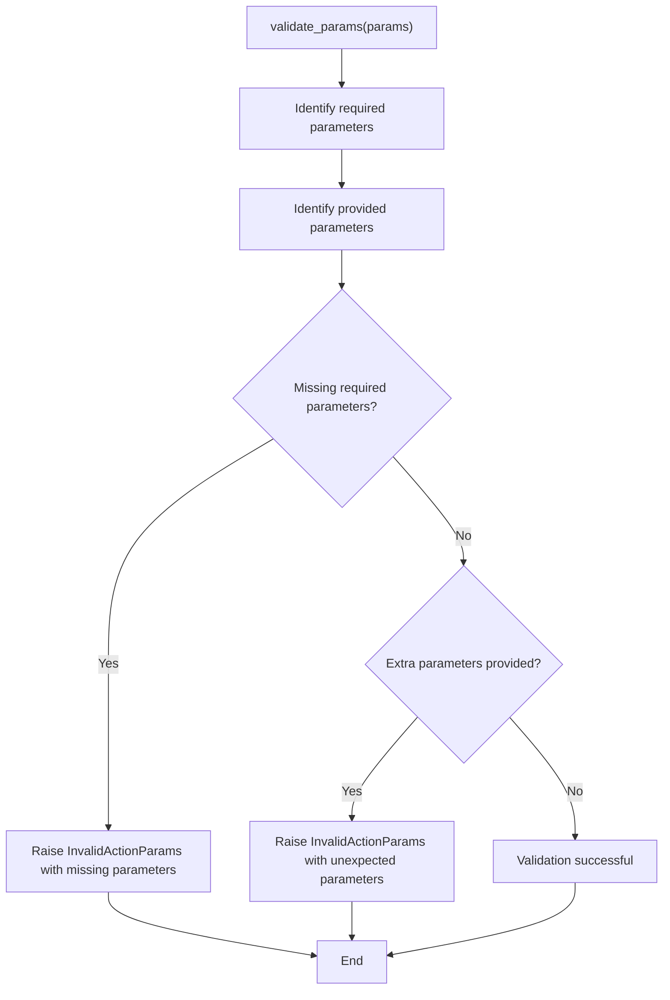
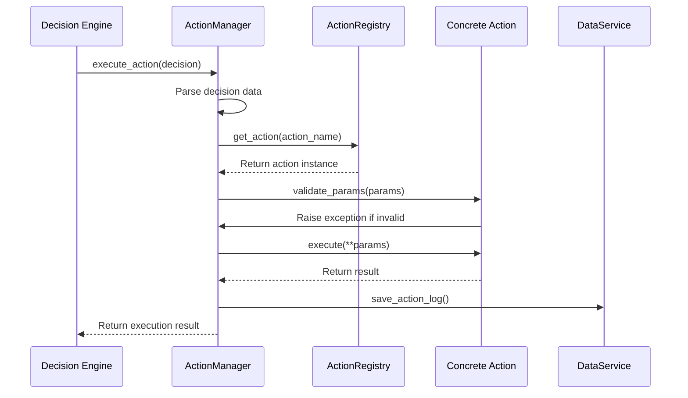
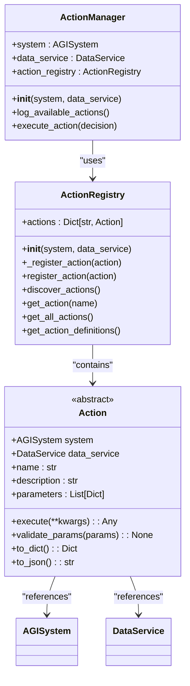

# Action Base Class


## Table of Contents
1. [Action Base Class Overview](#action-base-class-overview)
2. [Abstract Method Contract](#abstract-method-contract)
3. [Metadata Attributes](#metadata-attributes)
4. [Parameter Validation](#parameter-validation)
5. [Action Lifecycle and Execution Flow](#action-lifecycle-and-execution-flow)
6. [Integration with ActionManager and Registry](#integration-with-actionmanager-and-registry)
7. [Code Example: Custom Action Implementation](#code-example-custom-action-implementation)
8. [Common Implementation Pitfalls](#common-implementation-pitfalls)

## Action Base Class Overview

The Action base class serves as the foundation for all executable operations within the Ravana AGI system. Defined in `core/actions/action.py`, this abstract base class (ABC) establishes a consistent interface and behavior contract that all concrete actions must follow. The class inherits from Python's `ABC` (Abstract Base Class) module, ensuring that subclasses implement required methods and properties before instantiation.

The Action class is designed to be lightweight yet comprehensive, providing essential functionality for action definition, parameter validation, and system integration. Each action instance is initialized with references to the core AGISystem and DataService, enabling access to shared state, memory, knowledge, and persistence mechanisms. This design promotes loose coupling between actions and the broader system while maintaining necessary integration points.

The base class implements several utility methods for serialization (`to_dict` and `to_json`) and parameter validation (`validate_params`), reducing boilerplate code in concrete implementations. The class structure emphasizes clarity and consistency, making it easier for developers to create new actions that integrate seamlessly with the existing system.

**Section sources**
- [action.py](file://core/actions/action.py#L1-L62)

## Abstract Method Contract

The Action base class defines a strict contract through its abstract methods and properties that all concrete actions must implement. This contract ensures uniformity across all actions and enables the ActionManager to interact with them predictably.

### execute Method
The `execute` method is the core of the action contract, defined as an abstract async method that all subclasses must implement:

```python
@abstractmethod
async def execute(self, **kwargs: Any) -> Any:
    """Executes the action with the given parameters."""
    pass
```

This method must be implemented as an asynchronous function, allowing for non-blocking operations such as API calls, file I/O, or database operations. It accepts parameters as keyword arguments (`**kwargs`), providing flexibility in the number and names of parameters each action can accept. The return value can be any type, depending on the action's purpose, but should be meaningful and serializable for logging and debugging purposes.

### Required Properties
The Action class requires three essential properties to be implemented by all subclasses:

- **name**: A unique string identifier for the action. This name is used by the ActionRegistry for lookup and must be unique across all registered actions.
- **description**: A human-readable string that describes what the action does. This description is used in prompts for the LLM (Large Language Model) to help it understand the action's purpose and appropriate usage.
- **parameters**: A list of dictionaries defining the parameters the action accepts. Each parameter dictionary should include:
  - `name`: The parameter name
  - `type`: The expected data type
  - `description`: A description of the parameter's purpose
  - `required`: A boolean indicating whether the parameter is mandatory

These properties form the action's metadata, which is used by the system for validation, documentation, and LLM interaction.

**Section sources**
- [action.py](file://core/actions/action.py#L15-L43)

## Metadata Attributes

The Action base class defines several metadata attributes that provide essential information about each action. These attributes are implemented as abstract properties, requiring concrete implementations to provide specific values.

### name Property
The `name` property serves as the unique identifier for an action within the system. It must be a string that is unique across all registered actions. This name is used by the ActionRegistry to store and retrieve actions, and by the DecisionEngine when selecting actions to execute. The name should be descriptive and follow a consistent naming convention (typically lowercase with underscores) to ensure readability and predictability.

### description Property
The `description` property provides a clear, concise explanation of what the action does. This description is critical for the LLM's decision-making process, as it helps the model understand the action's purpose and appropriate context for use. The description should be written in plain language that accurately reflects the action's functionality without technical jargon.

### parameters Property
The `parameters` property defines the interface for the action's inputs. It returns a list of dictionaries, each describing a parameter the action accepts. This structure enables dynamic parameter validation and provides metadata for the LLM to generate appropriate parameter values. The parameter definition includes:
- **name**: The parameter identifier used in the execute method
- **type**: The expected data type (e.g., "string", "integer", "boolean")
- **description**: A clear explanation of the parameter's purpose
- **required**: A boolean flag indicating whether the parameter is mandatory

This metadata-driven approach allows the system to validate inputs before execution and provides comprehensive documentation of each action's interface.

**Section sources**
- [action.py](file://core/actions/action.py#L15-L43)

## Parameter Validation

The Action base class includes a built-in parameter validation mechanism through the `validate_params` method. This method ensures that actions receive the correct parameters before execution, preventing runtime errors and improving system reliability.



**Diagram sources**
- [action.py](file://core/actions/action.py#L44-L62)

The validation process performs two key checks:
1. **Required Parameters Check**: Compares the set of required parameters (those with `required=True` in the parameters definition) against the provided parameters. If any required parameters are missing, it raises an `InvalidActionParams` exception with a descriptive message.
2. **Extra Parameters Check**: Verifies that no unexpected parameters are provided. If parameters are included that are not defined in the action's parameters list, it raises an `InvalidActionParams` exception.

This validation occurs automatically when the ActionManager executes an action, ensuring that all actions receive properly formatted inputs. The validation method leverages the metadata defined in the `parameters` property, making it dynamic and automatically updated when the action's interface changes.

**Section sources**
- [action.py](file://core/actions/action.py#L44-L62)
- [exceptions.py](file://core/actions/exceptions.py#L1-L14)

## Action Lifecycle and Execution Flow

The Action base class operates within a well-defined lifecycle managed by the ActionManager. Unlike some frameworks, this implementation does not include explicit `pre_execute` or `post_execute` hooks in the base class. Instead, the lifecycle is managed externally by the ActionManager, which handles setup, execution, and cleanup tasks.



**Diagram sources**
- [action_manager.py](file://core/action_manager.py#L1-L126)
- [action.py](file://core/actions/action.py#L1-L62)

The execution flow follows these steps:
1. The DecisionEngine generates a decision containing an action name and parameters
2. The ActionManager receives the decision and parses the action data
3. The ActionManager retrieves the appropriate action instance from the ActionRegistry
4. The ActionManager calls the action's `validate_params` method to ensure parameter correctness
5. If validation passes, the ActionManager calls the action's `execute` method with the provided parameters
6. After execution, the ActionManager logs the action result to the database via the DataService
7. The result is returned to the calling component

This externalized lifecycle management keeps the Action base class focused on core functionality while allowing the ActionManager to handle cross-cutting concerns like logging, error handling, and monitoring.

**Section sources**
- [action_manager.py](file://core/action_manager.py#L1-L126)

## Integration with ActionManager and Registry

The Action base class is designed to work seamlessly with the ActionManager and ActionRegistry components, forming a cohesive system for action management and execution.



**Diagram sources**
- [action.py](file://core/actions/action.py#L1-L62)
- [action_manager.py](file://core/action_manager.py#L1-L126)
- [registry.py](file://core/actions/registry.py#L1-L74)

### ActionRegistry
The ActionRegistry is responsible for storing and managing all available action instances. During initialization, it automatically discovers and registers actions from the `core/actions` package using Python's introspection capabilities. The registry maintains a dictionary of actions keyed by their name, enabling O(1) lookup performance. It also provides methods for manual registration of actions and retrieving action definitions for LLM prompts.

### ActionManager
The ActionManager serves as the primary interface for action execution. It wraps the ActionRegistry and adds additional functionality such as decision parsing, error handling, and execution logging. The ActionManager is responsible for the complete execution workflow, from receiving a decision to returning a result, while delegating the actual action execution to the appropriate action instance.

This three-tier architecture (Action → ActionRegistry → ActionManager) promotes separation of concerns, with each component having a single responsibility:
- Action: Define what an action does
- ActionRegistry: Manage action instances and discovery
- ActionManager: Handle action execution workflow and integration

**Section sources**
- [action_manager.py](file://core/action_manager.py#L1-L126)
- [registry.py](file://core/actions/registry.py#L1-L74)

## Code Example: Custom Action Implementation

Here is a complete example of a custom action implementation that inherits from the Action base class:

```python
# in core/actions/misc.py

from core.actions.action import Action
from typing import Any, Dict, List

class HelloWorldAction(Action):
    @property
    def name(self) -> str:
        return "hello_world"

    @property
    def description(self) -> str:
        return "A simple action that prints a greeting."

    @property
    def parameters(self) -> List[Dict[str, Any]]:
        return [
            {
                "name": "name",
                "type": "string",
                "description": "The name to include in the greeting.",
                "required": True,
            }
        ]

    async def execute(self, **kwargs: Any) -> Any:
        name = kwargs.get("name")
        return f"Hello, {name}!"
```

This example demonstrates the minimal requirements for a custom action:
1. Inherit from the Action base class
2. Implement the required properties (`name`, `description`, `parameters`)
3. Implement the `execute` method with the appropriate logic

When the system starts, the ActionRegistry will automatically discover this action through its `discover_actions` method, which scans the `core/actions` package for classes that inherit from Action. The action will then be available for use by the DecisionEngine and can be executed through the ActionManager.

The example shows how parameters are defined in a structured format that enables automatic validation. When executed, the action receives parameters as keyword arguments and can access the AGISystem and DataService through the inherited `self.system` and `self.data_service` attributes.

**Section sources**
- [DEVELOPER_GUIDE.md](file://DEVELOPER_GUIDE.md#L175-L216)

## Common Implementation Pitfalls

Developers implementing custom actions should be aware of several common pitfalls that can lead to system errors or unexpected behavior.

### Missing Required Properties
The most common error is failing to implement one of the required abstract properties (`name`, `description`, `parameters`). Since these are abstract properties, Python will prevent instantiation of the class if any are missing, but the error message may not be immediately clear.

### Incorrect Parameter Definitions
Errors in parameter definitions can cause validation failures or LLM confusion:
- Using inconsistent or unclear parameter names
- Providing inaccurate type information
- Writing ambiguous parameter descriptions
- Marking optional parameters as required or vice versa

### Asynchronous Method Implementation
Forgetting to implement the `execute` method as asynchronous (using `async def`) will cause runtime errors when the ActionManager attempts to await the method call.

### Exception Handling
While the ActionManager handles most exceptions, actions should still handle domain-specific errors appropriately. However, actions should not catch and suppress exceptions that indicate fundamental problems, as this prevents the system from properly logging and responding to errors.

### Type Compatibility Issues
Since the ActionManager passes parameters as keyword arguments, type compatibility between the expected parameter types (as defined in the `parameters` property) and the actual values provided by the LLM is crucial. Actions should include appropriate type conversion or validation within the `execute` method for parameters that may arrive in unexpected formats.

By following the established patterns and paying attention to these potential issues, developers can create robust, reliable actions that integrate seamlessly with the Ravana AGI system.

**Section sources**
- [action.py](file://core/actions/action.py#L1-L62)
- [exceptions.py](file://core/actions/exceptions.py#L1-L14)

**Referenced Files in This Document**   
- [action.py](file://core/actions/action.py#L1-L62)
- [action_manager.py](file://core/action_manager.py#L1-L126)
- [registry.py](file://core/actions/registry.py#L1-L74)
- [exceptions.py](file://core/actions/exceptions.py#L1-L14)
- [DEVELOPER_GUIDE.md](file://DEVELOPER_GUIDE.md#L175-L216)