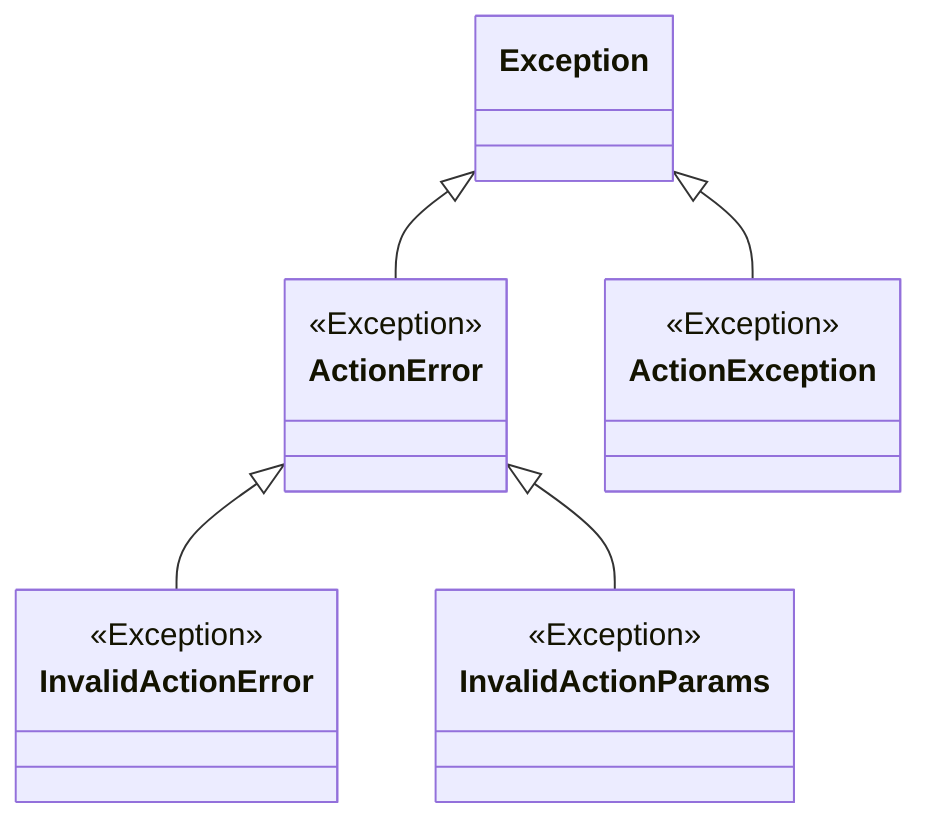
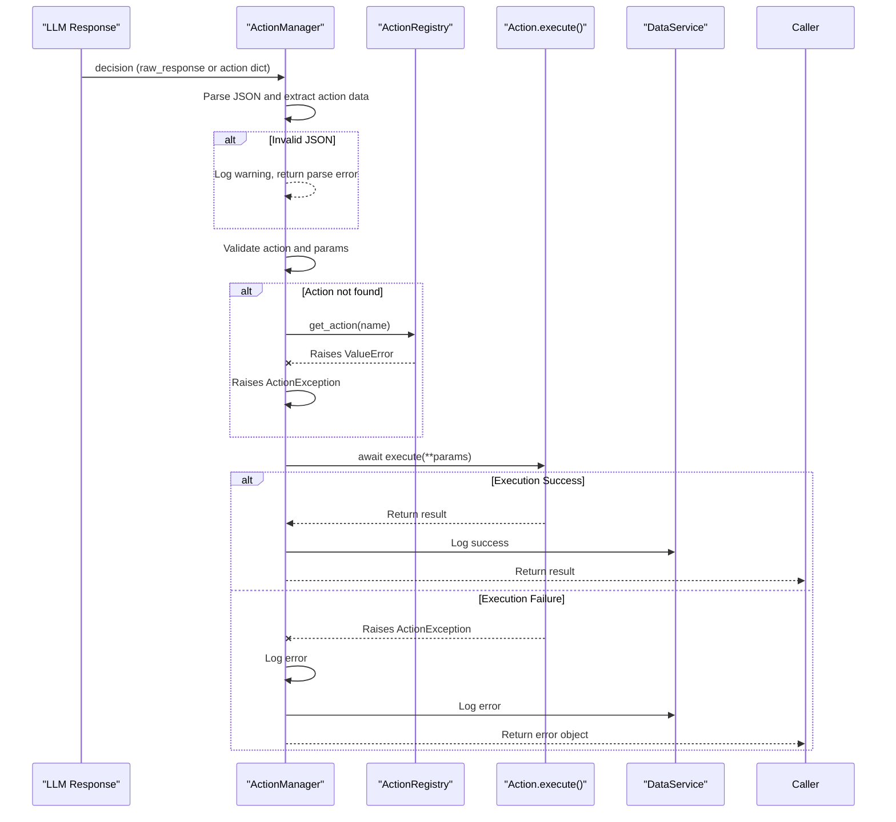

# Action Exceptions


## Table of Contents
1. [Exception Hierarchy](#exception-hierarchy)
2. [Exception Types and Usage](#exception-types-and-usage)
3. [Exception Handling in ActionManager](#exception-handling-in-actionmanager)
4. [Examples of Handling Action Failures](#examples-of-handling-action-failures)
5. [Logging and Error Reporting Practices](#logging-and-error-reporting-practices)
6. [Creating Custom Exception Types](#creating-custom-exception-types)

## Exception Hierarchy

The exception hierarchy for action-related errors is structured to provide clear categorization and inheritance for different types of failures. The base class `ActionError` serves as the root for all action-specific exceptions, while `ActionException` is used for execution-level failures.



**Diagram sources**
- [core/actions/exceptions.py](file://core/actions/exceptions.py#L0-L14)

**Section sources**
- [core/actions/exceptions.py](file://core/actions/exceptions.py#L0-L14)

## Exception Types and Usage

### ActionError
: Base class for all action-related exceptions. It provides a common inheritance point for domain-specific errors.

### InvalidActionError
: Raised when an action is requested that does not exist in the registry. This occurs when `get_action()` is called with a name not present in the registry.

### InvalidActionParams
: Thrown when parameters passed to an action are invalid—either missing required parameters or containing unexpected ones. This is raised by the `validate_params()` method in the base `Action` class.

### ActionException
: A standalone exception class (not inheriting from `ActionError`) used to signal execution failures during action processing. It is raised in cases such as missing required inputs in coding actions or when an action cannot be found during execution.

These exceptions are raised in various contexts:
- `InvalidActionParams` is raised in `Action.validate_params()` when parameter validation fails.
- `ActionException` is raised in multiple action implementations (e.g., `WritePythonCodeAction`) when required parameters are missing or execution fails.

**Section sources**
- [core/actions/exceptions.py](file://core/actions/exceptions.py#L0-L14)
- [core/actions/action.py](file://core/actions/action.py#L46-L50)
- [core/actions/coding.py](file://core/actions/coding.py#L46-L114)

## Exception Handling in ActionManager

The `ActionManager` class handles exceptions during action execution through a structured try-except block in the `execute_action()` method. It distinguishes between expected `ActionException` cases and unexpected general exceptions.

When an `ActionException` is caught:
- The error is logged at the error level.
- An action log is saved to the database with status 'error'.
- A response dictionary with an "error" key is returned.

For unexpected exceptions:
- Full traceback is logged using `exc_info=True`.
- The error is wrapped in a generic message and logged.
- A fallback error response is returned.

The `get_action()` method in `ActionRegistry` raises a `ValueError` if an action is not found, which is then converted into an `ActionException` by `ActionManager`.



**Diagram sources**
- [core/action_manager.py](file://core/action_manager.py#L62-L126)
- [core/actions/registry.py](file://core/actions/registry.py#L53)

**Section sources**
- [core/action_manager.py](file://core/action_manager.py#L62-L126)

## Examples of Handling Action Failures

Higher-level components handle action failures by inspecting the returned dictionary for an "error" key. For example, in the decision engine:

```python
decision = await decision_maker.make_decision()
if "error" in decision:
    logger.error(f"Decision failed: {decision['error']}")
    # Trigger fallback behavior or self-reflection
    await self.handle_failure(decision)
else:
    result = await action_manager.execute_action(decision)
    if "error" in result:
        logger.warning(f"Action execution failed: {result['error']}")
        # Log to adaptive learning system
        await learning_engine.record_failure(result)
```

The `EnhancedActionManager` adds timeout handling and caching, wrapping the base `execute_action()` call in `asyncio.wait_for()` to prevent hanging actions.

**Section sources**
- [core/action_manager.py](file://core/action_manager.py#L89-L126)
- [core/enhanced_action_manager.py](file://core/enhanced_action_manager.py#L34-L60)

## Logging and Error Reporting Practices

All exceptions are logged using the standard `logging` module with structured messages. The `ActionManager` logs:
- Info-level messages for action execution start and success.
- Error-level messages for `ActionException` and unexpected exceptions.
- Full stack traces for unhandled exceptions using `exc_info=True`.

Action outcomes (success or error) are persisted via `data_service.save_action_log()`, which records:
- Action name
- Parameters (as string)
- Status ('success' or 'error')
- Result or error message

This enables post-hoc analysis and integration with modules like `adaptive_learning` and `agent_self_reflection`.

**Section sources**
- [core/action_manager.py](file://core/action_manager.py#L89-L126)
- [modules/adaptive_learning/learning_engine.py](file://modules/adaptive_learning/learning_engine.py#L35-L65)

## Creating Custom Exception Types

To create domain-specific exceptions while maintaining backward compatibility:
1. Inherit from `ActionError` for validation or registration-related errors.
2. Use `ActionException` for execution failures unless a more specific hierarchy is needed.
3. Preserve existing exception types in public APIs to avoid breaking changes.

Example of a custom exception:
```python
class PermissionDeniedError(ActionError):
    """Raised when an action cannot be executed due to insufficient permissions."""
    pass
```

When extending the hierarchy, ensure that existing exception handlers (which may catch `ActionException` or `ActionError`) remain functional. For new exception types used in execution contexts, consider wrapping them in `ActionException` if they need to be handled uniformly by `ActionManager`.

**Section sources**
- [core/actions/exceptions.py](file://core/actions/exceptions.py#L0-L14)
- [DEVELOPER_GUIDE.md](file://DEVELOPER_GUIDE.md#L175-L216)

**Referenced Files in This Document**   
- [core/actions/exceptions.py](file://core/actions/exceptions.py#L0-L14)
- [core/action_manager.py](file://core/action_manager.py#L0-L126)
- [core/actions/registry.py](file://core/actions/registry.py#L0-L74)
- [core/actions/action.py](file://core/actions/action.py#L0-L62)
- [core/actions/coding.py](file://core/actions/coding.py#L46-L114)