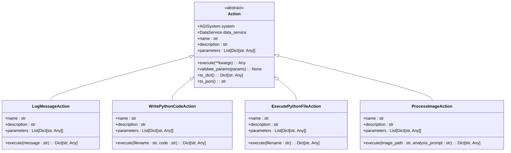

# Action Manager


## Table of Contents
1. [Introduction](#introduction)
2. [Project Structure](#project-structure)
3. [Core Components](#core-components)
4. [Architecture Overview](#architecture-overview)
5. [Detailed Component Analysis](#detailed-component-analysis)
6. [Action Execution Lifecycle](#action-execution-lifecycle)
7. [Action Registry and Management](#action-registry-and-management)
8. [Hook System and Behavior Extension](#hook-system-and-behavior-extension)
9. [Performance Considerations](#performance-considerations)
10. [Comparison of ActionManager and EnhancedActionManager](#comparison-of-actionmanager-and-enhancedactionmanager)
11. [Programmatic Action Invocation Examples](#programmatic-action-invocation-examples)
12. [Troubleshooting Guide](#troubleshooting-guide)
13. [Conclusion](#conclusion)

## Introduction
The Action Manager is a core component of the RAVANA system, responsible for executing actions determined by the decision engine. It serves as the bridge between high-level decisions made by the AGI system and the actual execution of tasks. The system features two implementations: the standard ActionManager and the EnhancedActionManager, which extends the base functionality with additional capabilities. This document provides a comprehensive analysis of both implementations, their execution lifecycle, integration with system components, and performance characteristics.

## Project Structure
The Action Manager components are located within the core directory of the RAVANA project. The architecture follows a modular design with clear separation of concerns between action definition, registration, and execution.


**Diagram sources**
- [action_manager.py](file://core/action_manager.py)
- [enhanced_action_manager.py](file://core/enhanced_action_manager.py)
- [registry.py](file://core/actions/registry.py)
- [action.py](file://core/actions/action.py)

**Section sources**
- [action_manager.py](file://core/action_manager.py)
- [enhanced_action_manager.py](file://core/enhanced_action_manager.py)

## Core Components
The Action Manager system consists of several core components that work together to enable dynamic action execution. The foundation is the Action abstract base class, which defines the interface that all actions must implement. The ActionRegistry maintains a collection of available actions and provides lookup functionality. The ActionManager orchestrates the execution process, while the EnhancedActionManager extends this functionality with additional features like caching and parallel execution.

**Section sources**
- [action.py](file://core/actions/action.py#L0-L62)
- [registry.py](file://core/actions/registry.py#L0-L74)
- [action_manager.py](file://core/action_manager.py#L0-L126)

## Architecture Overview
The Action Manager architecture follows a layered pattern with clear separation between the execution engine, action registry, and individual action implementations. The system is designed to be extensible, allowing new actions to be added without modifying the core execution logic.


**Diagram sources**
- [action_manager.py](file://core/action_manager.py#L0-L126)
- [registry.py](file://core/actions/registry.py#L0-L74)

## Detailed Component Analysis

### Action Base Class Analysis
The Action class serves as the foundation for all executable actions in the system. It defines a consistent interface that ensures all actions can be discovered, validated, and executed in a uniform manner.



**Diagram sources**
- [action.py](file://core/actions/action.py#L0-L62)
- [io.py](file://core/actions/io.py)
- [coding.py](file://core/actions/coding.py)
- [multi_modal.py](file://core/actions/multi_modal.py)

**Section sources**
- [action.py](file://core/actions/action.py#L0-L62)

### Action Registry Analysis
The ActionRegistry is responsible for managing the collection of available actions and providing lookup functionality. It supports both explicit registration and automatic discovery of actions.


**Diagram sources**
- [registry.py](file://core/actions/registry.py#L0-L74)
- [action_manager.py](file://core/action_manager.py#L0-L126)

**Section sources**
- [registry.py](file://core/actions/registry.py#L0-L74)

## Action Execution Lifecycle
The action execution lifecycle follows a well-defined sequence of steps that ensures consistent handling of all actions, from initial lookup to final result processing.


**Diagram sources**
- [action_manager.py](file://core/action_manager.py#L35-L126)

**Section sources**
- [action_manager.py](file://core/action_manager.py#L35-L126)

## Action Registry and Management
The ActionRegistry provides a centralized mechanism for managing available actions. It supports both explicit registration of specific action instances and automatic discovery of actions through package introspection.

The registry is initialized with several core actions:
- **ProposeAndTestInventionAction**: For experimental invention testing
- **LogMessageAction**: For logging messages to the system
- **WritePythonCodeAction**: For writing Python code to files
- **ExecutePythonFileAction**: For executing Python files

The `discover_actions()` method automatically scans the `core.actions` package to find and register any classes that inherit from the Action base class, enabling a plugin-like architecture where new actions can be added by simply creating new modules in the actions directory.


**Diagram sources**
- [registry.py](file://core/actions/registry.py#L0-L74)
- [DEVELOPER_GUIDE.md](file://DEVELOPER_GUIDE.md#L175-L216)

**Section sources**
- [registry.py](file://core/actions/registry.py#L0-L74)
- [DEVELOPER_GUIDE.md](file://DEVELOPER_GUIDE.md#L175-L216)

## Hook System and Behavior Extension
While the current implementation does not include a formal hook system, the architecture provides several extension points that serve a similar purpose. The EnhancedActionManager implements caching and timeout functionality that acts as pre-execution and post-execution hooks.

The EnhancedActionManager's `execute_action_enhanced` method provides the following extension capabilities:
- **Pre-execution check**: Action caching to avoid redundant execution
- **Execution wrapper**: Timeout enforcement using asyncio.wait_for
- **Post-execution processing**: Result caching for future use

These extension points allow for behavior modification without changing the core action implementations. For example, the caching mechanism prevents repeated execution of expensive operations when the same action is called with identical parameters.


**Diagram sources**
- [enhanced_action_manager.py](file://core/enhanced_action_manager.py#L34-L60)

**Section sources**
- [enhanced_action_manager.py](file://core/enhanced_action_manager.py#L34-L60)

## Performance Considerations
The Action Manager system incorporates several performance optimization strategies to ensure efficient execution and resource management.

### Execution Queuing and Concurrency
The EnhancedActionManager implements parallel execution capabilities through the `execute_parallel_actions` method, which uses an asyncio.Semaphore to limit concurrent execution to a configurable maximum (default: 3). This prevents resource exhaustion when executing multiple actions simultaneously.


**Diagram sources**
- [enhanced_action_manager.py](file://core/enhanced_action_manager.py#L60-L89)

### Timeout Handling
The EnhancedActionManager enforces a 5-minute timeout on all action executions using asyncio.wait_for. This prevents actions from hanging indefinitely and ensures system responsiveness. If an action exceeds the timeout, it is terminated and an appropriate error response is returned.

### Resource Isolation
Actions are designed to be stateless and isolated, with each action receiving the system and data_service dependencies through dependency injection. This design promotes resource isolation and prevents actions from interfering with each other's execution.

### Caching Strategy
The EnhancedActionManager implements a result caching mechanism to avoid redundant execution of expensive operations. The cache stores results based on action name and parameter hash, with certain dynamic actions (log_message, get_current_time, generate_random) explicitly excluded from caching.

**Section sources**
- [enhanced_action_manager.py](file://core/enhanced_action_manager.py#L34-L89)

## Comparison of ActionManager and EnhancedActionManager
The EnhancedActionManager extends the base ActionManager with several significant improvements that enhance reliability, performance, and functionality.

| Feature | ActionManager | EnhancedActionManager |
|--------|---------------|----------------------|
| **Inheritance** | Base class | Inherits from ActionManager |
| **Multi-modal Support** | No | Yes, with image, audio, and cross-modal analysis |
| **Caching** | No | Yes, with configurable cache clearing |
| **Timeout Handling** | No | Yes, 5-minute timeout enforcement |
| **Parallel Execution** | No | Yes, with concurrency limiting |
| **Action Statistics** | No | Yes, via get_action_statistics() |
| **Error Recovery** | Basic | Enhanced with timeout and caching |
| **Resource Management** | Minimal | Semaphore-based concurrency control |

The EnhancedActionManager represents a significant evolution of the action execution system, addressing key limitations of the base implementation while maintaining backward compatibility through inheritance.

**Section sources**
- [action_manager.py](file://core/action_manager.py)
- [enhanced_action_manager.py](file://core/enhanced_action_manager.py)

## Programmatic Action Invocation Examples
Actions can be invoked programmatically through both the standard and enhanced action managers. Below are examples demonstrating various invocation patterns.

### Basic Action Invocation
```python
# Standard ActionManager invocation
decision = {
    "action": "log_message",
    "params": {
        "message": "System initialized successfully"
    }
}
result = await action_manager.execute_action(decision)
```

### Enhanced Action with Caching
```python
# EnhancedActionManager with automatic caching
decision = {
    "action": "process_image",
    "params": {
        "image_path": "/path/to/image.jpg",
        "analysis_prompt": "Describe the contents of this image"
    }
}
# First execution - processes image
result = await enhanced_manager.execute_action_enhanced(decision)
# Second execution with same parameters - returns cached result
result = await enhanced_manager.execute_action_enhanced(decision)
```

### Parallel Action Execution
```python
# Execute multiple actions in parallel
decisions = [
    {
        "action": "process_image",
        "params": {"image_path": "image1.jpg"}
    },
    {
        "action": "process_audio", 
        "params": {"audio_path": "audio1.mp3"}
    },
    {
        "action": "write_python_code",
        "params": {"filename": "script.py", "code": "print('Hello')"}
    }
]
results = await enhanced_manager.execute_parallel_actions(decisions)
```

### Direct Method Invocation
```python
# Calling enhanced action methods directly
result = await enhanced_manager.process_image_action(
    image_path="/path/to/image.jpg",
    analysis_prompt="Analyze this image in detail"
)

result = await enhanced_manager.analyze_directory_action(
    directory_path="/path/to/media",
    recursive=True
)
```

**Section sources**
- [enhanced_action_manager.py](file://core/enhanced_action_manager.py)

## Troubleshooting Guide
This section addresses common issues encountered when working with the Action Manager system and provides guidance for diagnosis and resolution.

### Common Errors and Solutions

**Error: "Action 'unknown_action' not found"**
- **Cause**: The requested action is not registered in the ActionRegistry
- **Solution**: 
  1. Verify the action name is correct
  2. Check that the action module is properly imported
  3. Ensure the action class inherits from the Action base class
  4. Confirm the action is registered in the registry

**Error: "Missing required parameters"**
- **Cause**: Required parameters were not provided in the action invocation
- **Solution**:
  1. Review the action's parameters property to identify required fields
  2. Ensure all required parameters are included in the params dictionary
  3. Check parameter names for typos

**Error: "Action timed out"**
- **Cause**: The action execution exceeded the 5-minute timeout
- **Solution**:
  1. Optimize the action to complete faster
  2. Consider breaking large tasks into smaller actions
  3. For the EnhancedActionManager, you can temporarily increase the timeout during development

**Error: "No valid JSON block found in the LLM's response"**
- **Cause**: The LLM response format does not contain properly formatted JSON
- **Solution**:
  1. Verify the LLM is instructed to return JSON within ```json``` code blocks
  2. Check for syntax errors in the generated JSON
  3. Implement more robust JSON extraction if needed

### Debugging Tips
1. Enable detailed logging to trace action execution flow
2. Use the `log_available_actions()` method to verify registered actions
3. Check the action registry directly: `action_manager.action_registry.actions.keys()`
4. For enhanced manager, check cache status with `list(enhanced_manager.action_cache.keys())`

**Section sources**
- [action_manager.py](file://core/action_manager.py#L89-L126)
- [exceptions.py](file://core/actions/exceptions.py#L0-L14)
- [enhanced_action_manager.py](file://core/enhanced_action_manager.py#L34-L60)

## Conclusion
The Action Manager system provides a robust framework for executing actions within the RAVANA AGI system. The base ActionManager implements a reliable execution pipeline with proper error handling and logging, while the EnhancedActionManager significantly extends these capabilities with features like caching, timeout enforcement, and parallel execution.

Key strengths of the system include:
- Clear separation of concerns between action definition, registration, and execution
- Extensible architecture that supports automatic discovery of new actions
- Comprehensive error handling and logging
- Enhanced performance features in the extended implementation

The system could be further improved by implementing a formal hook system to allow more flexible extension of action behavior, and by adding more sophisticated resource management for long-running actions. Overall, the Action Manager represents a well-designed component that effectively bridges the gap between high-level decision making and concrete action execution in the AGI system.

**Referenced Files in This Document**   
- [action_manager.py](file://core/action_manager.py)
- [enhanced_action_manager.py](file://core/enhanced_action_manager.py)
- [registry.py](file://core/actions/registry.py)
- [action.py](file://core/actions/action.py)
- [exceptions.py](file://core/actions/exceptions.py)
- [DEVELOPER_GUIDE.md](file://DEVELOPER_GUIDE.md)