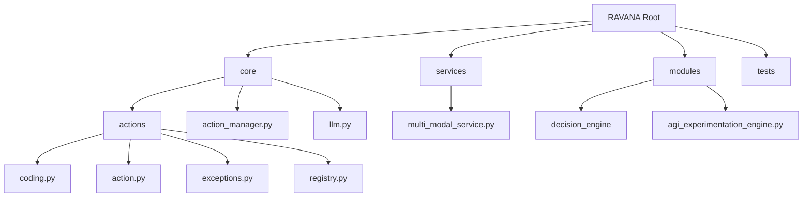
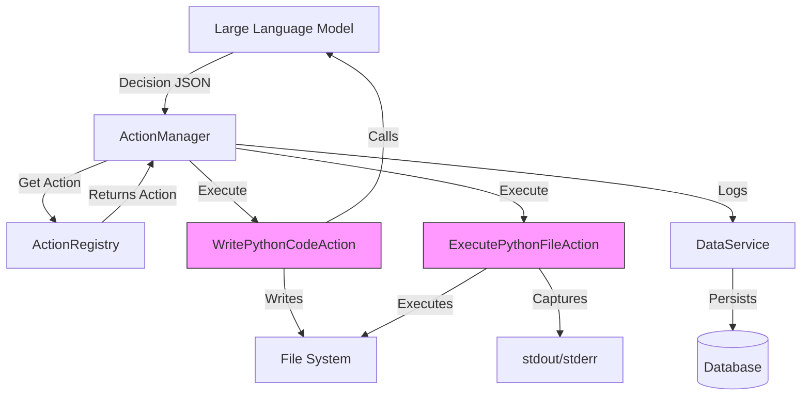
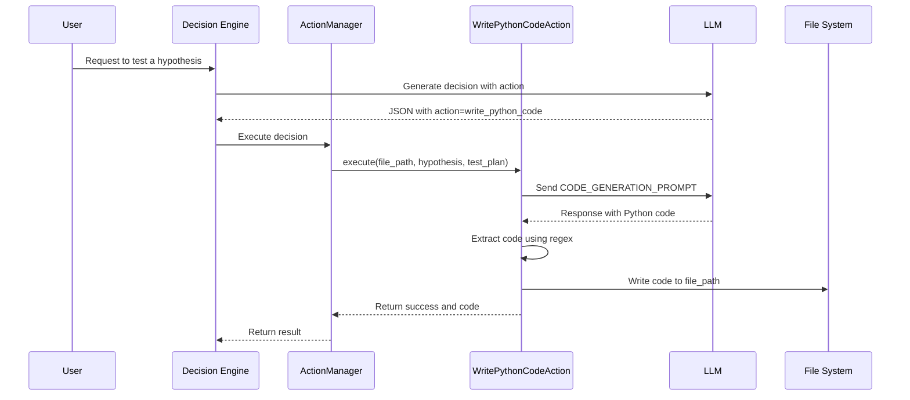
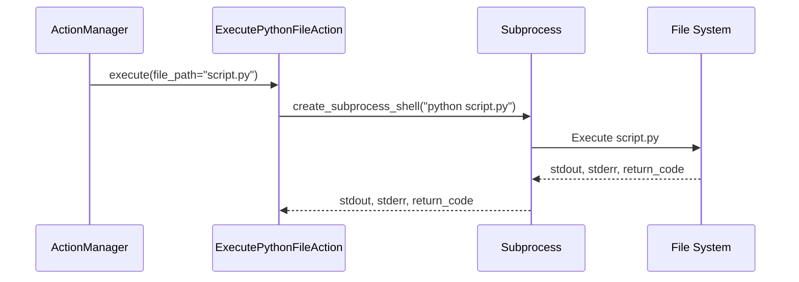

# Coding Actions

## Table of Contents
1. [Introduction](#introduction)
2. [Project Structure](#project-structure)
3. [Core Components](#core-components)
4. [Architecture Overview](#architecture-overview)
5. [Detailed Component Analysis](#detailed-component-analysis)
6. [Dependency Analysis](#dependency-analysis)
7. [Performance Considerations](#performance-considerations)
8. [Troubleshooting Guide](#troubleshooting-guide)
9. [Conclusion](#conclusion)

## Introduction
This document provides a comprehensive analysis of the coding actions within the RAVANA AGI system. It details how the system enables code generation, editing, and execution through specialized action classes. The focus is on the `WritePythonCodeAction` and `ExecutePythonFileAction` implementations, their integration with the LLM (Large Language Model), and the security mechanisms in place. The documentation also covers error handling, sandboxing, and the role of these actions in self-modification workflows and automated experimentation.

## Project Structure
The RAVANA project is organized into a modular structure, with coding actions residing in the `core/actions` directory. This structure promotes separation of concerns and facilitates the registration and management of various action types.

**Diagram sources**
- [project_structure](file://README.md)

**Section sources**
- [project_structure](file://README.md)

## Core Components
The core components for coding actions are the `WritePythonCodeAction` and `ExecutePythonFileAction` classes, both of which inherit from the base `Action` class. These components are responsible for generating Python code based on a hypothesis and test plan, writing it to a file, and then executing that file in a secure environment. The `ActionRegistry` is responsible for managing all available actions, including these coding actions, making them accessible to the `ActionManager` for execution.

**Section sources**
- [coding.py](file://core/actions/coding.py#L1-L114)
- [action.py](file://core/actions/action.py#L1-L62)
- [registry.py](file://core/actions/registry.py#L1-L74)

## Architecture Overview
The coding actions are integrated into a larger AGI system architecture. The `ActionManager` receives a decision (a JSON object specifying an action and its parameters) from the LLM-driven decision engine. It uses the `ActionRegistry` to locate the appropriate `Action` instance. For coding actions, this involves generating code via the LLM and executing Python scripts. The system is designed with modularity, allowing for the dynamic registration of new actions.

**Diagram sources**
- [action_manager.py](file://core/action_manager.py#L1-L126)
- [coding.py](file://core/actions/coding.py#L1-L114)
- [registry.py](file://core/actions/registry.py#L1-L74)

## Detailed Component Analysis

### WritePythonCodeAction Analysis
The `WritePythonCodeAction` is responsible for generating Python code based on a hypothesis and a test plan provided by the LLM. It uses a predefined prompt template to instruct the LLM to write a self-contained script. The generated code is extracted from a markdown code block in the LLM's response and written to a specified file path.

**Diagram sources**
- [coding.py](file://core/actions/coding.py#L1-L114)

**Section sources**
- [coding.py](file://core/actions/coding.py#L1-L114)

### ExecutePythonFileAction Analysis
The `ExecutePythonFileAction` executes a Python script located at a given file path. It uses `asyncio.create_subprocess_shell` to run the script in a separate process, capturing both standard output and standard error. The action returns a dictionary containing the execution status, output, error message, and return code, which allows the system to handle both successful executions and failures.

**Referenced Files in This Document**   
- [coding.py](file://core/actions/coding.py)
- [action.py](file://core/actions/action.py)
- [exceptions.py](file://core/actions/exceptions.py)
- [llm.py](file://core/llm.py)
- [action_manager.py](file://core/action_manager.py)
- [registry.py](file://core/actions/registry.py)
