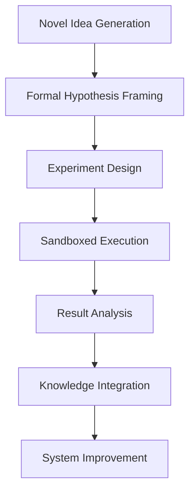
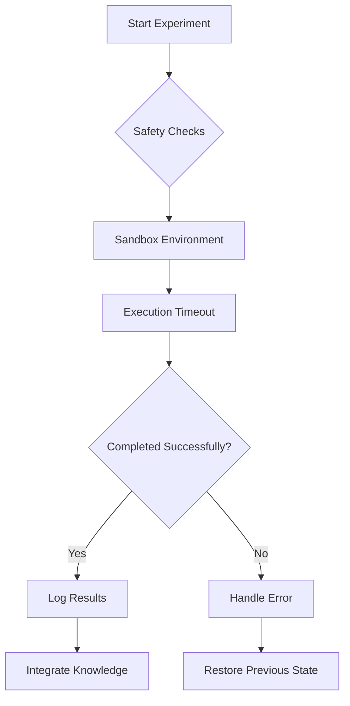
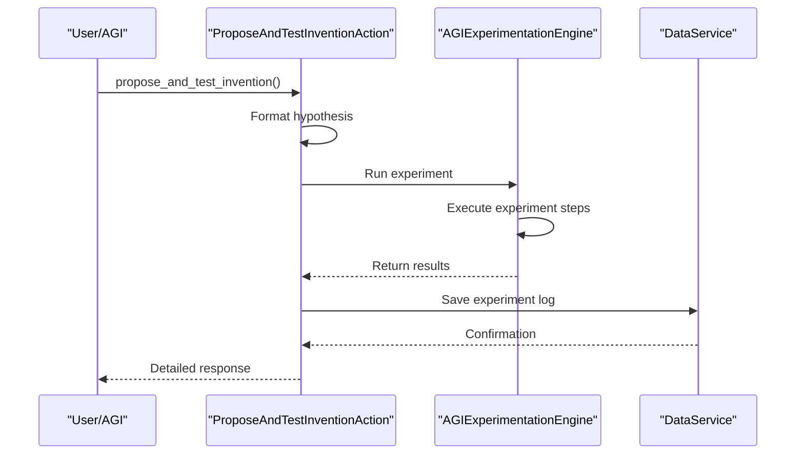
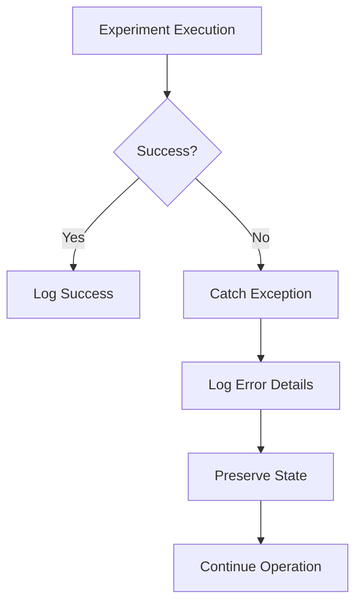
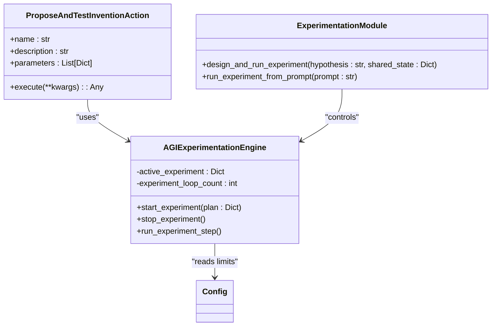

# Experimental Actions


## Table of Contents
1. [Introduction](#introduction)
2. [Purpose and Use Cases](#purpose-and-use-cases)
3. [Opt-In Activation Mechanism](#opt-in-activation-mechanism)
4. [Safety Warnings and Risk Mitigation](#safety-warnings-and-risk-mitigation)
5. [Execution Workflow](#execution-workflow)
6. [Example Usage](#example-usage)
7. [Rollback Strategies](#rollback-strategies)
8. [Impact Assessment and Monitoring](#impact-assessment-and-monitoring)
9. [Responsible Usage Guidelines](#responsible-usage-guidelines)
10. [Deprecation Policies](#deprecation-policies)
11. [Configuration Settings](#configuration-settings)

## Introduction
Experimental actions are specialized capabilities within the Ravana AGI system that enable high-risk, high-reward operations such as system-level modifications, novel API integrations, and autonomous scientific discovery. These actions are designed to support innovation and exploration while maintaining system stability through strict safety protocols and monitoring mechanisms.

**Section sources**
- [DEVELOPER_GUIDE.md](file://DEVELOPER_GUIDE.md#L1-L303)

## Purpose and Use Cases
Experimental actions serve as the foundation for innovation and discovery within the AGI system. They enable the agent to explore novel concepts, test hypotheses, and push the boundaries of its knowledge and capabilities.

### Key Use Cases
- **Prototype Testing**: Validating new ideas before full implementation
- **Debugging Deep System Issues**: Investigating complex problems through controlled experiments
- **Exploring New Capabilities**: Discovering innovative applications of existing technologies
- **Autonomous Scientific Research**: Conducting physics experiments and generating new knowledge

The `ProposeAndTestInventionAction` allows the AGI to formally submit novel ideas for testing through a structured experimentation pipeline. This enables creative thought processes to be systematically evaluated and integrated into the system's knowledge base.



**Diagram sources**
- [experimental.py](file://core/actions/experimental.py#L1-L129)
- [PHYSICS_EXPERIMENTS.md](file://PHYSICS_EXPERIMENTS.md#L1-L169)

**Section sources**
- [experimental.py](file://core/actions/experimental.py#L1-L129)
- [PHYSICS_EXPERIMENTS.md](file://PHYSICS_EXPERIMENTS.md#L1-L169)

## Opt-In Activation Mechanism
Experimental actions require explicit activation through specific command-line flags or API calls, ensuring they are not executed accidentally during normal operation.

### Activation Methods
- **Command Line Interface**: Using specific flags to enable experimental modes
- **Programmatic Access**: Direct calls to the experimentation engine
- **Configuration Flags**: Environment variables that enable experimental features

```bash
# Enable physics experimentation
python main.py --physics-experiment "Quantum Tunneling"

# Activate discovery mode
python main.py --discovery-mode

# Run comprehensive test suite
python main.py --test-experiments
```

The system also supports programmatic activation through the `agi_experimentation_engine` function, which can be imported and called directly from Python code.

```python
from core.llm import agi_experimentation_engine

result = agi_experimentation_engine(
    experiment_idea="Simulate quantum tunneling through a potential barrier",
    use_chain_of_thought=True,
    online_validation=True,
    verbose=True
)
```

**Section sources**
- [main.py](file://main.py#L1-L138)
- [PHYSICS_EXPERIMENTS.md](file://PHYSICS_EXPERIMENTS.md#L1-L169)
- [physics_cli.py](file://physics_cli.py#L1-L78)

## Safety Warnings and Risk Mitigation
The system implements multiple safety mechanisms to prevent unintended consequences from experimental actions.

### Safety Features
- **Sandboxed Execution**: All code runs in isolated environments
- **Timeout Protection**: Prevents infinite loops with execution limits
- **Unicode Handling**: Ensures proper encoding for mathematical symbols
- **Error Recovery**: Graceful handling of execution failures
- **Online Validation**: Cross-references results with real-world knowledge

The experimentation engine includes built-in safeguards such as maximum loop counts and timeout protection to prevent resource exhaustion. When generating code for experiments, the system is instructed to use `plt.savefig()` instead of `plt.show()` to avoid blocking execution.



**Diagram sources**
- [experimental.py](file://core/actions/experimental.py#L1-L129)
- [PHYSICS_EXPERIMENTS.md](file://PHYSICS_EXPERIMENTS.md#L1-L169)

**Section sources**
- [experimental.py](file://core/actions/experimental.py#L1-L129)
- [PHYSICS_EXPERIMENTS.md](file://PHYSICS_EXPERIMENTS.md#L1-L169)

## Execution Workflow
The experimental action execution follows a structured pipeline from hypothesis formulation to knowledge integration.

### Workflow Steps
1. **Hypothesis Formulation**: Frame the invention as a formal hypothesis
2. **Experiment Design**: Create a test plan for validation
3. **Sandboxed Execution**: Run the experiment in a secure environment
4. **Result Analysis**: Interpret findings and generate conclusions
5. **Knowledge Integration**: Store results in memory and knowledge base

The `ProposeAndTestInventionAction` executes this workflow by:
- Formatting the invention into a hypothesis
- Running it through the advanced experimentation engine
- Logging results to the database
- Returning detailed execution information



**Diagram sources**
- [experimental.py](file://core/actions/experimental.py#L1-L129)
- [agi_experimentation_engine.py](file://modules/agi_experimentation_engine.py#L1-L65)

**Section sources**
- [experimental.py](file://core/actions/experimental.py#L1-L129)
- [agi_experimentation_engine.py](file://modules/agi_experimentation_engine.py#L1-L65)

## Example Usage
The system provides multiple ways to utilize experimental actions for different scenarios.

### Physics Experiment Example
```python
from core.llm import agi_experimentation_engine

# Run quantum tunneling analysis
result = agi_experimentation_engine(
    experiment_idea="Calculate transmission coefficient for electron tunneling",
    use_chain_of_thought=True,
    online_validation=True,
    sandbox_timeout=300,
    verbose=True
)

print(f"Scientific validity: {result['scientific_validity']}")
print(f"Generated code: {result['generated_code']}")
```

### Command Line Usage
```bash
# List available experiments
python physics_cli.py list

# Run specific experiment
python physics_cli.py run "Quantum Tunneling"

# Run discovery mode
python physics_cli.py discovery
```

The system automatically saves all experiment results, including generated plots as PNG files, execution logs, and scientific interpretations.

**Section sources**
- [PHYSICS_EXPERIMENTS.md](file://PHYSICS_EXPERIMENTS.md#L1-L169)
- [physics_cli.py](file://physics_cli.py#L1-L78)

## Rollback Strategies
The system implements robust rollback mechanisms to recover from failed experiments.

### Automatic Recovery
- **State Restoration**: The system maintains previous states for critical components
- **Error Logging**: Comprehensive logging enables post-mortem analysis
- **Graceful Degradation**: Failed experiments do not compromise system stability

When an experiment fails, the system:
1. Logs the error and execution context
2. Returns to a stable state
3. Preserves the failed experiment data for analysis
4. Continues normal operation

The `ActionManager` handles exceptions during execution and ensures proper logging regardless of outcome.



**Section sources**
- [core/action_manager.py](file://core/action_manager.py#L89-L126)
- [experimental.py](file://core/actions/experimental.py#L1-L129)

## Impact Assessment and Monitoring
The system provides comprehensive monitoring and assessment capabilities for experimental actions.

### Monitoring Features
- **Detailed Logging**: All experiments are logged with timestamps and metadata
- **Performance Metrics**: Track execution time and resource usage
- **Success Rate Tracking**: Monitor experiment completion rates
- **Knowledge Integration**: Verify results are properly stored

The system automatically saves experiment results to:
- **Experiment logs**: Database records with outcomes
- **Generated plots**: PNG files in working directory
- **Episodic memory**: Stored in AGI's memory system
- **Knowledge base**: Integrated into compressed knowledge

Regular test suites validate the system's functionality:
```bash
python simple_physics_test.py suite
```

**Section sources**
- [PHYSICS_EXPERIMENTS.md](file://PHYSICS_EXPERIMENTS.md#L1-L169)
- [test_physics_experiments.py](file://tests/test_physics_experiments.py#L1-L281)

## Responsible Usage Guidelines
To ensure safe and effective use of experimental actions, follow these guidelines:

### Best Practices
- **Start Small**: Begin with low-risk experiments before attempting complex ones
- **Validate Results**: Cross-check findings with established knowledge
- **Monitor Resources**: Watch for excessive CPU or memory usage
- **Document Findings**: Maintain records of all experiments and outcomes
- **Respect Limits**: Adhere to configured timeouts and loop limits

### Prohibited Actions
- Modifying core system files without proper safeguards
- Creating infinite loops or resource-intensive operations
- Accessing unauthorized external systems
- Overwriting critical data without backup

The system's design encourages responsible exploration while providing safety nets for unexpected outcomes.

**Section sources**
- [DEVELOPER_GUIDE.md](file://DEVELOPER_GUIDE.md#L1-L303)
- [PHYSICS_EXPERIMENTS.md](file://PHYSICS_EXPERIMENTS.md#L1-L169)

## Deprecation Policies
The system follows a structured approach to deprecating experimental features.

### Deprecation Process
1. **Mark as Deprecated**: Add deprecation warnings to the code
2. **Documentation Update**: Notify users through documentation
3. **Grace Period**: Maintain functionality for a defined period
4. **Removal**: Eliminate the feature after sufficient notice

Experimental actions that prove unstable or unsafe may be disabled through configuration without complete removal, allowing for future re-evaluation.

The action registry system allows for dynamic registration and deprecation of actions, enabling flexible management of capabilities.

**Section sources**
- [core/actions/registry.py](file://core/actions/registry.py#L1-L59)

## Configuration Settings
Key configuration settings control the behavior of experimental actions.

### Critical Settings
- **MAX_EXPERIMENT_LOOPS**: Maximum number of steps in an experiment (default: 10)
- **INVENTION_INTERVAL**: Time between invention attempts (default: 7200 seconds)
- **SANDBOX_TIMEOUT**: Execution timeout for experiments (default: 300 seconds)
- **LOG_LEVEL**: Logging verbosity for monitoring experiments

These settings can be overridden using environment variables:
```bash
export MAX_EXPERIMENT_LOOPS=15
export INVENTION_INTERVAL=3600
```

The configuration system ensures experiments operate within safe boundaries while allowing customization for specific use cases.



**Diagram sources**
- [experimental.py](file://core/actions/experimental.py#L1-L129)
- [agi_experimentation_engine.py](file://modules/agi_experimentation_engine.py#L1-L65)
- [experimentation_module.py](file://modules/experimentation_module.py#L1-L42)
- [config.py](file://core/config.py#L1-L41)

**Section sources**
- [config.py](file://core/config.py#L1-L41)
- [agi_experimentation_engine.py](file://modules/agi_experimentation_engine.py#L1-L65)

**Referenced Files in This Document**   
- [experimental.py](file://core/actions/experimental.py#L1-L129)
- [agi_experimentation_engine.py](file://modules/agi_experimentation_engine.py#L1-L65)
- [experimentation_module.py](file://modules/experimentation_module.py#L1-L42)
- [config.py](file://core/config.py#L1-L41)
- [PHYSICS_EXPERIMENTS.md](file://PHYSICS_EXPERIMENTS.md#L1-L169)
- [DEVELOPER_GUIDE.md](file://DEVELOPER_GUIDE.md#L1-L303)
- [physics_cli.py](file://physics_cli.py#L1-L78)
- [main.py](file://main.py#L1-L138)