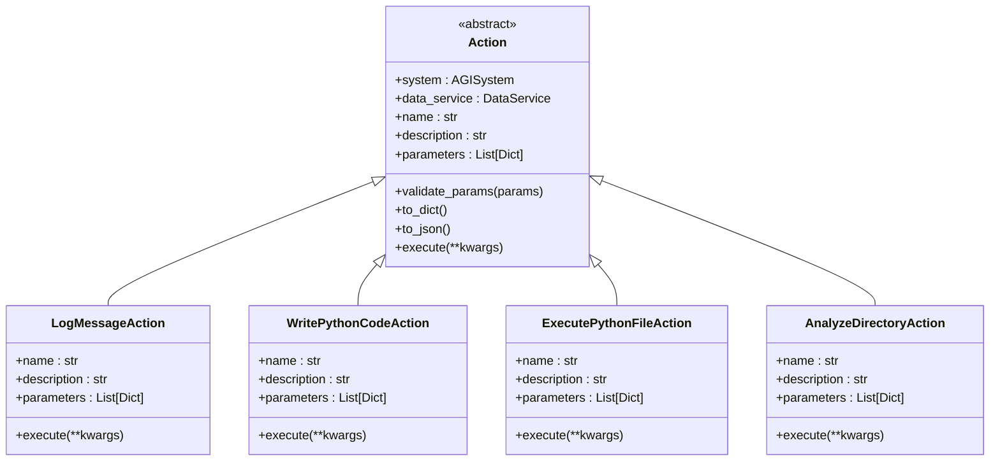
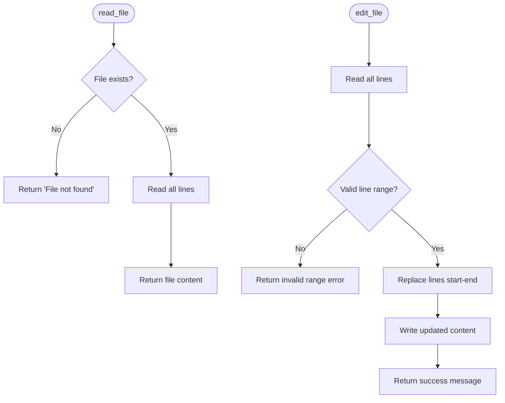
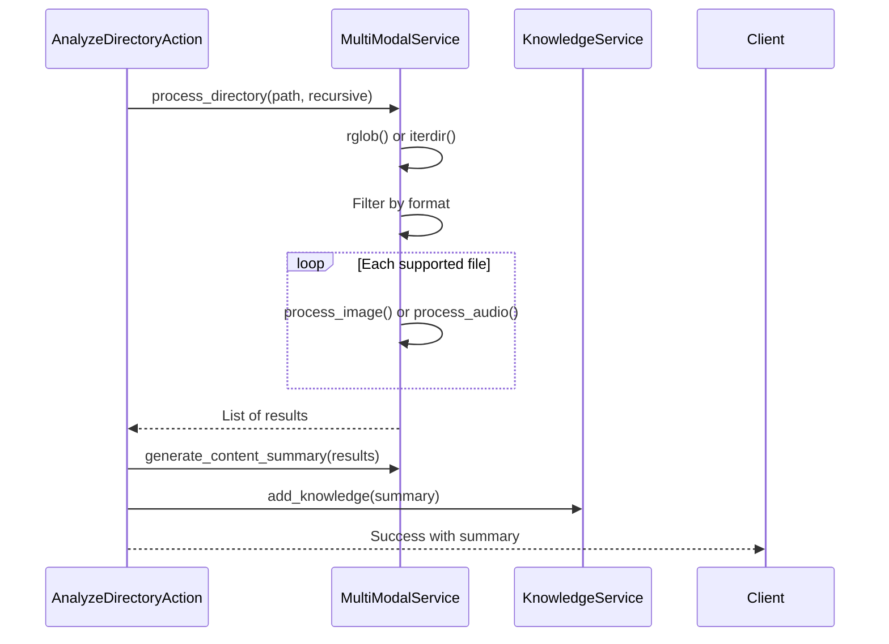
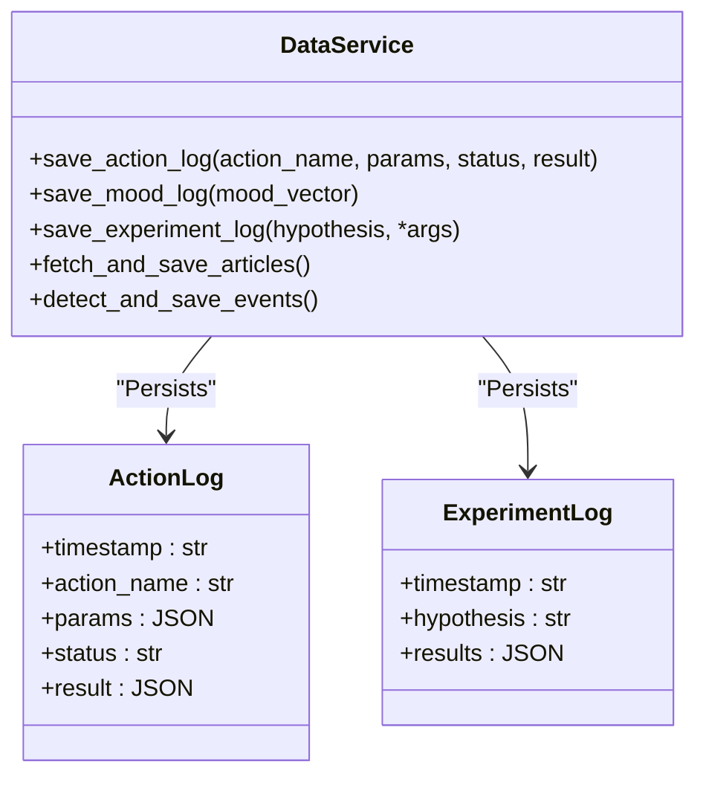

# I/O Actions


## Table of Contents
1. [Introduction](#introduction)
2. [Core I/O Actions Overview](#core-io-actions-overview)
3. [Logging and Message Recording](#logging-and-message-recording)
4. [File System Operations](#file-system-operations)
5. [Directory Management and Analysis](#directory-management-and-analysis)
6. [Code Generation and Execution](#code-generation-and-execution)
7. [Integration with Data Service](#integration-with-data-service)
8. [Security and Path Resolution](#security-and-path-resolution)
9. [Error Handling and Troubleshooting](#error-handling-and-troubleshooting)
10. [Performance and Caching](#performance-and-caching)

## Introduction
The I/O Actions system in the RAVANA framework enables the AGI agent to interact with the file system, manage data persistence, and perform logging operations. These actions are essential for recording internal thoughts, reading and writing files, executing generated code, and analyzing multi-modal content from directories. The architecture follows a modular design where each I/O capability is encapsulated as an action that can be dynamically executed by the action manager.

This document provides a comprehensive overview of all I/O-related functionalities, including their implementation, integration points, security considerations, and usage patterns. It covers both direct file operations and higher-level abstractions such as directory analysis and code execution workflows.

## Core I/O Actions Overview

The I/O actions are implemented as subclasses of the base `Action` class, which defines a standardized interface for all executable operations within the AGI system. Each action exposes metadata such as name, description, and required parameters, enabling dynamic discovery and execution.



**Diagram sources**
- [action.py](file://core/actions/action.py#L1-L62)
- [io.py](file://core/actions/io.py#L6-L39)
- [coding.py](file://core/actions/coding.py#L0-L114)
- [multi_modal.py](file://core/actions/multi_modal.py#L0-L78)

**Section sources**
- [action.py](file://core/actions/action.py#L1-L62)
- [io.py](file://core/actions/io.py#L6-L39)

## Logging and Message Recording

### LogMessageAction
The `LogMessageAction` allows the AGI to record internal thoughts, observations, or decisions to the console and logging system. This is crucial for traceability, debugging, and maintaining a persistent record of the agent's reasoning process.

#### Parameters
- **message**: (string, required) The message to log.
- **level**: (string, optional) The logging level (`info`, `warning`, `error`). Defaults to `info`.

#### Implementation
The action uses Python’s built-in `logging` module with a logger named after the module. Messages are prefixed with `[AGI Thought]:` to distinguish them from other logs.

```python
async def execute(self, **kwargs: Any) -> Dict[str, Any]:
    message = kwargs.get("message")
    level = kwargs.get("level", "info").lower()

    log_func = getattr(logger, level, logger.info)
    log_func(f"[AGI Thought]: {message}")

    return {"status": "success", "message": f"Message logged with level '{level}'."}
```

This action integrates seamlessly with Python’s logging hierarchy and can be configured externally to output to files, external services, or different log levels based on deployment needs.

**Section sources**
- [io.py](file://core/actions/io.py#L6-L39)

## File System Operations

### Read and Write File Tools
The system includes direct file I/O tools used primarily in the self-modification module. These are implemented as registered functions rather than formal actions.

#### read_file
- **filename**: Path to the file relative to the module root.
- Reads and returns the entire file content as a string.
- Returns an error message if the file does not exist.

#### edit_file
- **filename**: Target file path.
- **start**, **end**: Line range (1-indexed) to replace.
- **new_content**: Content to insert.
- Performs atomic file updates by reading all lines, modifying the specified range, and rewriting the file.

These tools use UTF-8 encoding and preserve line endings. They are critical for agent self-improvement tasks such as code patching and configuration updates.



**Diagram sources**
- [self_modification.py](file://modules/agent_self_reflection/self_modification.py#L0-L87)

**Section sources**
- [self_modification.py](file://modules/agent_self_reflection/self_modification.py#L0-L87)

## Directory Management and Analysis

### AnalyzeDirectoryAction
This action enables batch processing of media files within a directory. It supports recursive traversal and integrates with the multi-modal service for content analysis.

#### Parameters
- **directory_path**: (string, required) Path to the target directory.
- **recursive**: (boolean, optional) Whether to include subdirectories.

#### Workflow
1. Validates directory existence.
2. Enumerates all files (recursive or flat).
3. Filters for supported image and audio formats.
4. Processes each file using appropriate handlers.
5. Generates a summary report.
6. Stores insights in the knowledge base.



**Diagram sources**
- [multi_modal.py](file://core/actions/multi_modal.py#L35-L70)
- [enhanced_action_manager.py](file://core/enhanced_action_manager.py#L148-L183)
- [multi_modal_service.py](file://services/multi_modal_service.py#L259-L294)

**Section sources**
- [multi_modal.py](file://core/actions/multi_modal.py#L35-L70)
- [enhanced_action_manager.py](file://core/enhanced_action_manager.py#L148-L183)
- [multi_modal_service.py](file://services/multi_modal_service.py#L259-L294)

## Code Generation and Execution

### WritePythonCodeAction
Generates Python scripts based on a hypothesis and test plan using an LLM.

#### Parameters
- **file_path**: Where to save the generated code.
- **hypothesis**: The scientific or logical hypothesis to test.
- **test_plan**: How to test the hypothesis.

The LLM response is parsed for code blocks (```python) or treated as raw code. The script is written atomically to the specified path.

### ExecutePythonFileAction
Executes a Python script and captures its output.

#### Parameters
- **file_path**: Script to execute.

Uses `subprocess` to run `python <file_path>` and captures stdout, stderr, and return code. Timeouts and exceptions are handled gracefully.


**Diagram sources**
- [coding.py](file://core/actions/coding.py#L0-L114)

**Section sources**
- [coding.py](file://core/actions/coding.py#L0-L114)

## Integration with Data Service

The I/O system integrates with the `DataService` for structured data persistence. While not directly handling file I/O, it logs action outcomes, mood states, decisions, and experiments to a SQL database.

Key logging methods:
- `save_action_log()`: Records action execution details.
- `save_mood_log()`: Stores emotional state vectors.
- `save_experiment_log()`: Persists scientific experiment results.

These operations use JSON serialization and are wrapped in database transactions to ensure atomicity.



**Diagram sources**
- [data_service.py](file://services/data_service.py#L0-L155)

**Section sources**
- [data_service.py](file://services/data_service.py#L0-L155)

## Security and Path Resolution

### Path Validation
All file and directory operations begin with existence checks using `os.path.exists()` or `Path.exists()`. Invalid paths return descriptive error messages without stack traces.

### Directory Traversal Prevention
File paths are resolved relative to module roots (e.g., `MODULE_ROOT`) in self-modification tools, preventing escape to arbitrary locations. No user input is used directly in path construction without sanitization.

### File Permission Management
The system assumes the running process has necessary permissions. Errors from `open()`, `os.listdir()`, or subprocess execution are caught and logged without crashing the agent.

### Supported Formats
Strict filtering ensures only known safe formats are processed:
- Images: `.jpg`, `.jpeg`, `.png`, `.gif`, `.bmp`, `.webp`
- Audio: `.mp3`, `.wav`, `.m4a`, `.ogg`, `.flac`

Unknown extensions are ignored during directory scans.

**Section sources**
- [self_modification.py](file://modules/agent_self_reflection/self_modification.py#L0-L87)
- [multi_modal_service.py](file://services/multi_modal_service.py#L0-L349)

## Error Handling and Troubleshooting

### Common Issues and Solutions

| Issue | Cause | Resolution |
|------|------|------------|
| **File not found** | Incorrect path or missing file | Verify path exists; use absolute paths if needed |
| **Permission denied** | Insufficient OS permissions | Run with appropriate privileges or adjust file ownership |
| **Encoding errors** | Non-UTF-8 content | Ensure files are saved in UTF-8 encoding |
| **Disk space limit** | Full storage | Clean up temporary files or expand storage |
| **File lock/Busy file** | Concurrent access | Implement retry logic with exponential backoff |
| **Invalid code generation** | LLM hallucination | Validate code syntax before execution |
| **Subprocess timeout** | Long-running script | Increase timeout or optimize code |

### Logging Best Practices
- Always include context in log messages.
- Use appropriate log levels (`info`, `warning`, `error`).
- Avoid logging sensitive data.
- Monitor logs for repeated failures.

### Debugging Tips
1. Enable verbose logging to trace action execution.
2. Check file permissions and directory existence.
3. Validate generated code syntax manually.
4. Use `list_directory`-like enumeration to verify file availability.
5. Inspect database logs for persistence issues.

**Section sources**
- [io.py](file://core/actions/io.py#L6-L39)
- [coding.py](file://core/actions/coding.py#L0-L114)
- [multi_modal_service.py](file://services/multi_modal_service.py#L0-L349)

## Performance and Caching

### Action Caching
The `EnhancedActionManager` implements a result cache to avoid redundant executions. Cache keys are based on action name and parameter hash. Non-cacheable actions include `log_message` and time-sensitive operations.

Cache is limited in size and pruned when exceeding thresholds.

### Parallel Execution
Up to three actions can run in parallel using `asyncio.Semaphore`. This improves throughput for I/O-bound tasks like file processing and network calls.

### Temporary File Management
The multi-modal service uses a dedicated temp directory (`/tmp/agi_multimodal`) with automatic cleanup of files older than 24 hours.

```python
def cleanup_temp_files(self, max_age_hours: int = 24):
    current_time = time.time()
    for file_path in self.temp_dir.iterdir():
        if file_age > max_age_seconds:
            file_path.unlink()
```

This prevents unbounded disk usage during prolonged operation.

**Section sources**
- [enhanced_action_manager.py](file://core/enhanced_action_manager.py#L0-L268)
- [multi_modal_service.py](file://services/multi_modal_service.py#L322-L348)

**Referenced Files in This Document**   
- [io.py](file://core/actions/io.py#L6-L39)
- [action.py](file://core/actions/action.py#L1-L62)
- [coding.py](file://core/actions/coding.py#L0-L114)
- [multi_modal.py](file://core/actions/multi_modal.py#L0-L78)
- [enhanced_action_manager.py](file://core/enhanced_action_manager.py#L0-L268)
- [multi_modal_service.py](file://services/multi_modal_service.py#L0-L349)
- [self_modification.py](file://modules/agent_self_reflection/self_modification.py#L0-L87)