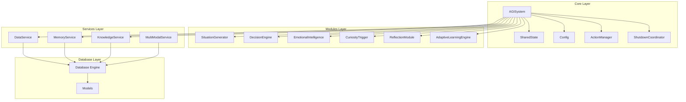
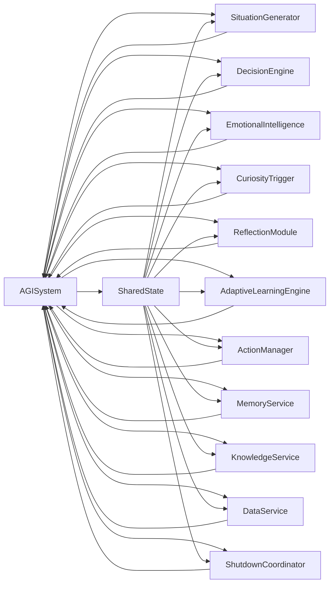
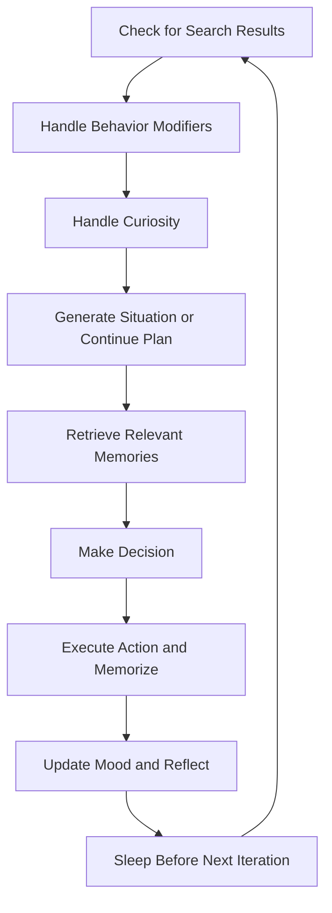
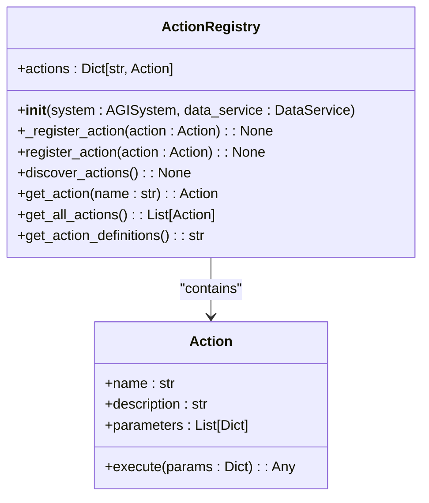
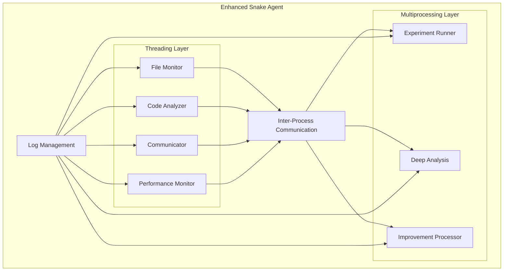
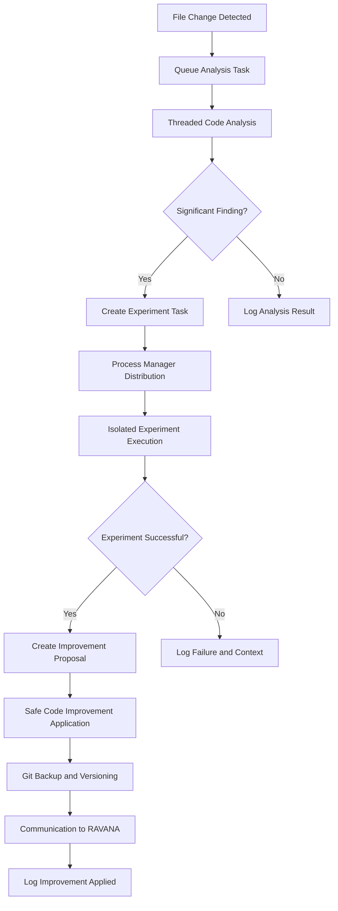
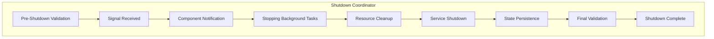
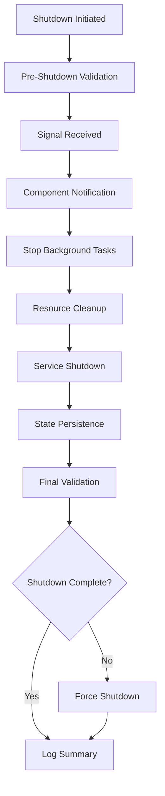

# Architecture & Design


## Update Summary
**Changes Made**   
- Added new section on Enhanced Graceful Shutdown Architecture
- Updated Project Structure section to include shutdown components
- Added new architectural diagram for shutdown process
- Updated Core Components section to include ShutdownCoordinator
- Added configuration details for graceful shutdown
- Updated Design Patterns section with new component interactions
- Updated Safety and Reliability Features section with shutdown validation
- Added new section on Shutdown State Persistence

## Table of Contents
1. [Introduction](#introduction)
2. [Project Structure](#project-structure)
3. [Core Components](#core-components)
4. [Architecture Overview](#architecture-overview)
5. [Detailed Component Analysis](#detailed-component-analysis)
6. [Design Patterns](#design-patterns)
7. [Data Flow and Lifecycle Management](#data-flow-and-lifecycle-management)
8. [Configuration and State Management](#configuration-and-state-management)
9. [Extensibility and Modularity](#extensibility-and-modularity)
10. [Cross-Cutting Concerns](#cross-cutting-concerns)
11. [Enhanced Snake Agent Architecture](#enhanced-snake-agent-architecture)
12. [Safety and Reliability Features](#safety-and-reliability-features)
13. [Enhanced Graceful Shutdown Architecture](#enhanced-graceful-shutdown-architecture)
14. [Shutdown State Persistence](#shutdown-state-persistence)

## Introduction

The RAVANA system is an experimental open-source Artificial General Intelligence (AGI) framework designed for autonomous, continuous operation. It embodies a modular, state-driven architecture where intelligence emerges from the interaction of specialized components. The system operates through a perpetual cognitive loop that enables self-directed behavior, emotional state tracking, memory formation, reflection, and curiosity-driven exploration.

This document provides a comprehensive architectural overview of the RAVANA system, detailing its component-based design, core orchestration mechanisms, service abstractions, and key design patterns. The analysis is based on direct examination of the codebase, focusing on how components interact, manage state, and evolve over time through learning and reflection. Recent updates include the integration of the Enhanced Snake Agent and the Enhanced Graceful Shutdown system, which adds phased execution, component lifecycle management, and state validation workflows to ensure reliable system termination.

## Project Structure

The RAVANA project follows a layered, modular structure that separates concerns into distinct directories:

- **core/**: Contains the central orchestration logic, state management, configuration, and foundational utilities.
- **modules/**: Houses pluggable cognitive modules responsible for specific functions like decision-making, emotional intelligence, and self-reflection.
- **services/**: Provides abstracted access to external resources and data storage systems.
- **database/**: Manages database models and engine configuration.
- **tests/**: Contains unit and integration tests.
- **actions/**: Defines executable actions that the system can perform.

This organization supports the system's philosophy of composability and emergent intelligence, allowing modules to evolve independently while being coordinated by the central AGISystem orchestrator.



**Diagram sources**
- [core/system.py](file://c:\Users\ASUS\Documents\GitHub\RAVANA\core\system.py)
- [core/state.py](file://c:\Users\ASUS\Documents\GitHub\RAVANA\core\state.py)
- [services/memory_service.py](file://c:\Users\ASUS\Documents\GitHub\RAVANA\services\memory_service.py)
- [services/knowledge_service.py](file://c:\Users\ASUS\Documents\GitHub\RAVANA\services\knowledge_service.py)
- [core/shutdown_coordinator.py](file://c:\Users\ASUS\Documents\GitHub\RAVANA\core\shutdown_coordinator.py)

## Core Components

The RAVANA system's architecture revolves around several core components that work together to create an autonomous cognitive agent.

### AGISystem Class

The `AGISystem` class, defined in `core/system.py`, serves as the singleton orchestrator of the entire system. It is responsible for:

- Initializing all modules and services
- Managing the main autonomous loop
- Holding the shared state of the AGI
- Coordinating inter-component communication
- Handling graceful shutdown

The AGISystem is instantiated with a database engine and initializes all dependent components during construction. It maintains references to all major modules and services, acting as the central nervous system of the AGI.

### SharedState Class

The `SharedState` class in `core/state.py` encapsulates the global state of the AGI system. This shared state is accessible to all modules and services, enabling coordinated behavior based on a consistent view of the system's current condition.

Key state elements include:
- **Mood**: A vector representing the AGI's emotional state across multiple dimensions
- **Current Situation**: The most recent situation generated for decision-making
- **Recent Memories**: Short-term episodic memories retrieved for context
- **Curiosity Topics**: Topics generated by the curiosity system for exploration
- **Search Results**: Recent web search results for immediate use
- **Current Task**: The task currently being processed

This centralized state management approach ensures that all components operate with consistent context, enabling coherent behavior across the system.

**Section sources**
- [core/system.py](file://c:\Users\ASUS\Documents\GitHub\RAVANA\core\system.py#L34-L624)
- [core/state.py](file://c:\Users\ASUS\Documents\GitHub\RAVANA\core\state.py#L1-L30)

## Architecture Overview

The RAVANA system implements a modular component-based architecture with a clear separation between the orchestrator, cognitive modules, and service layers. The architecture follows a layered approach where higher-level cognitive functions are built upon foundational services.

### System Context

The system operates as a self-contained agent that interacts with the external world through various channels:

- **Information Input**: RSS feeds, web searches, and user prompts
- **Action Output**: Code generation, file operations, logging, and external API calls
- **Memory Storage**: Persistent storage of episodic and semantic knowledge
- **Self-Monitoring**: Internal state tracking and reflection

### Component Interaction

Components interact through well-defined interfaces with the AGISystem acting as the central coordinator. The system follows a dependency injection pattern where the AGISystem injects itself and necessary services into modules during initialization.



**Diagram sources**
- [core/system.py](file://c:\Users\ASUS\Documents\GitHub\RAVANA\core\system.py#L34-L624)
- [core/state.py](file://c:\Users\ASUS\Documents\GitHub\RAVANA\core\state.py#L1-L30)
- [DEVELOPER_GUIDE.md](file://c:\Users\ASUS\Documents\GitHub\RAVANA\DEVELOPER_GUIDE.md#L68-L110)
- [core/shutdown_coordinator.py](file://c:\Users\ASUS\Documents\GitHub\RAVANA\core\shutdown_coordinator.py#L88-L726)

## Detailed Component Analysis

### AGISystem: The Central Orchestrator

The AGISystem class is the heart of the RAVANA architecture, managing the entire lifecycle of the AGI. It implements a singleton pattern and serves as the primary entry point for all system operations.

#### Initialization Process

During initialization, the AGISystem:
1. Creates a database session
2. Loads configuration settings
3. Initializes shared models (embedding model, sentiment classifier)
4. Instantiates all services
5. Initializes all cognitive modules
6. Sets up the shared state with initial mood values
7. Creates and configures the ShutdownCoordinator

The constructor accepts a database engine and configures all dependent components with the necessary resources.

#### Autonomous Loop

The core of the AGISystem is the `run_autonomous_loop` method, which executes continuously in a loop. Each iteration follows a structured cognitive process:



**Diagram sources**
- [core/system.py](file://c:\Users\ASUS\Documents\GitHub\RAVANA\core\system.py#L415-L446)
- [README.md](file://c:\Users\ASUS\Documents\GitHub\RAVANA\README.md#L31-L62)

**Section sources**
- [core/system.py](file://c:\Users\ASUS\Documents\GitHub\RAVANA\core\system.py#L34-L624)

### Service Layer Abstraction

The services layer provides abstracted access to external resources and data storage, decoupling business logic from implementation details.

#### MemoryService

The `MemoryService` in `services/memory_service.py` acts as a facade for the episodic memory system. It provides asynchronous methods for:

- Retrieving relevant memories based on a query
- Saving new memories
- Extracting memories from interactions
- Consolidating memories for optimization

The service delegates actual memory operations to the episodic memory module while providing a clean, asynchronous interface that integrates with the system's async architecture.

#### KnowledgeService

The `KnowledgeService` in `services/knowledge_service.py` manages the AGI's semantic knowledge base. Key responsibilities include:

- Adding new knowledge with deduplication
- Semantic search using FAISS vector indexing
- Retrieving knowledge by category or recency
- Compressing and summarizing knowledge

The service implements a hybrid storage approach with database persistence and in-memory vector search for efficient retrieval.

**Section sources**
- [services/memory_service.py](file://c:\Users\ASUS\Documents\GitHub\RAVANA\services\memory_service.py#L1-L21)
- [services/knowledge_service.py](file://c:\Users\ASUS\Documents\GitHub\RAVANA\services\knowledge_service.py#L1-L199)

## Design Patterns

The RAVANA system employs several key design patterns to achieve its architectural goals.

### Dependency Injection

The system extensively uses dependency injection to wire components together. The AGISystem injects itself and necessary services into modules during initialization:

```python
self.reflection_module = ReflectionModule(self)
self.experimentation_module = ExperimentationModule(self)
self.action_manager = EnhancedActionManager(self, self.data_service)
self.learning_engine = AdaptiveLearningEngine(self)
```

This pattern promotes loose coupling, testability, and flexibility in component composition.

**Section sources**
- [core/system.py](file://c:\Users\ASUS\Documents\GitHub\RAVANA\core\system.py#L62-L97)

### Registry Pattern

The ActionRegistry in `core/actions/registry.py` implements the Registry pattern to manage available actions. The registry:

- Stores action instances in a dictionary keyed by name
- Provides methods to register new actions
- Discovers actions automatically through package introspection
- Exposes action definitions to the LLM for decision-making

The registry enables dynamic action discovery and extensibility, allowing new actions to be added without modifying core orchestration logic.



**Diagram sources**
- [core/actions/registry.py](file://c:\Users\ASUS\Documents\GitHub\RAVANA\core\actions\registry.py#L1-L75)

**Section sources**
- [core/actions/registry.py](file://c:\Users\ASUS\Documents\GitHub\RAVANA\core\actions\registry.py#L1-L75)

### Strategy Pattern

The AdaptiveLearningEngine implements the Strategy pattern to dynamically adjust the AGI's behavior based on past performance. The engine generates adaptation strategies such as:

- **Action Prioritization**: Prefer high-success actions, avoid low-success ones
- **Confidence Adjustment**: Modify decision confidence based on overall success rate
- **Exploration vs Exploitation**: Balance between trying new actions and using proven ones
- **Context-Aware Adaptations**: Adjust behavior based on situational factors

These strategies are applied during decision-making to improve future performance.

**Section sources**
- [modules/adaptive_learning/learning_engine.py](file://c:\Users\ASUS\Documents\GitHub\RAVANA\modules\adaptive_learning\learning_engine.py#L143-L198)

### Observer Pattern

While not explicitly implemented as a formal pattern, the system exhibits Observer-like behavior through shared state updates. When one component modifies the shared state (e.g., updating mood), other components can react to these changes in subsequent iterations.

For example, the EmotionalIntelligence module updates the mood vector, which then influences decision-making in the next cycle through the DecisionEngine's access to the shared state.

## Data Flow and Lifecycle Management

### Cognitive Loop Data Flow

The system's primary data flow follows the autonomous cognitive loop:

1. **Situation Generation**: The SituationGenerator creates a context for action based on current state and curiosity topics
2. **Memory Retrieval**: Relevant memories are retrieved from the MemoryService to provide context
3. **Decision Making**: The DecisionEngine selects an action based on situation, memories, mood, and available actions
4. **Action Execution**: The ActionManager executes the selected action, potentially generating new data
5. **State Update**: The system updates mood, saves memories, and logs the interaction
6. **Reflection**: The ReflectionModule analyzes outcomes and suggests improvements

### Component Lifecycle

Components follow a coordinated lifecycle managed by the AGISystem:

- **Initialization**: All components are created and wired together during AGISystem construction
- **Execution**: Components participate in the autonomous loop, processing data and updating state
- **Background Tasks**: Some components run periodic background tasks (e.g., data collection, knowledge compression)
- **Shutdown**: The AGISystem coordinates graceful shutdown, stopping background tasks and closing resources

The system uses asyncio for concurrency, with background tasks managed through the AGISystem's task list.

**Section sources**
- [core/system.py](file://c:\Users\ASUS\Documents\GitHub\RAVANA\core\system.py#L34-L624)
- [README.md](file://c:\Users\ASUS\Documents\GitHub\RAVANA\README.md#L31-L62)

## Configuration and State Management

### Configuration System

The Config class in `core/config.py` provides a centralized configuration system using environment variables with sensible defaults:

```python
class Config:
    DATABASE_URL = os.environ.get("DATABASE_URL", "sqlite:///ravana_agi.db")
    CURIOSITY_CHANCE = float(os.environ.get("CURIOSITY_CHANCE", 0.3))
    REFLECTION_CHANCE = float(os.environ.get("REFLECTION_CHANCE", 0.1))
    LOOP_SLEEP_DURATION = int(os.environ.get("LOOP_SLEEP_DURATION", 10))
    PERSONA_NAME = os.environ.get("PERSONA_NAME", "Ravana")
    PERSONA_CREATIVITY = float(os.environ.get("PERSONA_CREATIVITY", 0.7))
```

This approach allows for flexible configuration across different environments while providing reasonable defaults for quick setup.

### State Management

The system uses a hybrid state management approach:

- **Shared State**: The SharedState object maintains volatile state that persists across iterations
- **Database Storage**: Long-term memories, knowledge, and logs are persisted to the database
- **File-based Storage**: Vector indexes and other large data structures are stored in files

The SharedState is passed by reference to all components, ensuring consistency, while persistent storage provides durability across restarts.

**Section sources**
- [core/config.py](file://c:\Users\ASUS\Documents\GitHub\RAVANA\core\config.py#L1-L42)
- [core/state.py](file://c:\Users\ASUS\Documents\GitHub\RAVANA\core\state.py#L1-L30)

## Extensibility and Modularity

The RAVANA system is designed for extensibility through its modular architecture.

### Pluggable Modules

The system supports pluggable modules that can be added or replaced without modifying core logic. Modules follow a consistent pattern:

- Accept the AGISystem in their constructor for access to shared resources
- Implement specific cognitive functions
- Interact with the system through well-defined interfaces
- Update shared state to communicate with other components

Examples include the EmotionalIntelligence, CuriosityTrigger, and ReflectionModule.

### Action System

The action system provides a powerful extensibility mechanism. New actions can be added by:

1. Creating a new Action subclass
2. Registering it with the ActionRegistry
3. Making it available to the LLM through the action definitions

The EnhancedActionManager extends this system with multi-modal capabilities, demonstrating how the architecture supports incremental enhancement.

**Section sources**
- [core/system.py](file://c:\Users\ASUS\Documents\GitHub\RAVANA\core\system.py#L34-L624)
- [core/actions/registry.py](file://c:\Users\ASUS\Documents\GitHub\RAVANA\core\actions\registry.py#L1-L75)
- [core/enhanced_action_manager.py](file://c:\Users\ASUS\Documents\GitHub\RAVANA\core\enhanced_action_manager.py#L1-L199)

## Cross-Cutting Concerns

### Async Operation

The entire system is built on asyncio for non-blocking operation. Key aspects include:

- All service methods are async
- Background tasks run concurrently
- I/O operations are performed in thread pools when necessary
- The main loop uses async/await for coordination

This design enables efficient resource utilization and responsiveness.

### Error Handling

The system implements comprehensive error handling:

- Try-except blocks around critical operations
- Logging of errors with stack traces
- Graceful degradation when components fail
- Timeout protection for action execution

Errors are logged but do not typically halt the main loop, ensuring system resilience.

### Scalability Considerations

The architecture supports scalability through:

- Modular design allowing horizontal scaling of components
- Asynchronous operation for efficient resource use
- Database abstraction for potential migration to more robust systems
- Configuration-driven behavior for tuning performance

However, the current implementation is designed for a single-agent use case rather than distributed deployment.

**Section sources**
- [core/system.py](file://c:\Users\ASUS\Documents\GitHub\RAVANA\core\system.py#L34-L624)
- [core/enhanced_action_manager.py](file://c:\Users\ASUS\Documents\GitHub\RAVANA\core\enhanced_action_manager.py#L1-L199)

## Enhanced Snake Agent Architecture

The Enhanced Snake Agent is a new component that provides continuous code improvement capabilities through concurrent analysis, experimentation, and enhancement. It operates as a background process within the RAVANA system, using threading and multiprocessing to maximize performance and reliability.

### Architecture Overview

The Enhanced Snake Agent uses a multi-layered architecture with distinct threading and multiprocessing components:



**Diagram sources**
- [ENHANCED_SNAKE_IMPLEMENTATION.md](file://c:\Users\ASUS\Documents\GitHub\RAVANA\ENHANCED_SNAKE_IMPLEMENTATION.md#L8-L31)
- [core/snake_agent_enhanced.py](file://c:\Users\ASUS\Documents\GitHub\RAVANA\core\snake_agent_enhanced.py#L31-L64)

### Component Integration

The Enhanced Snake Agent integrates with the main AGISystem through a configurable initialization process:

```python
# Initialize Snake Agent if enabled (Enhanced Version)
self.snake_agent = None
if Config.SNAKE_AGENT_ENABLED:
    try:
        # Try enhanced version first, fall back to original if needed
        enhanced_mode = getattr(Config, 'SNAKE_ENHANCED_MODE', True)
        if enhanced_mode:
            from core.snake_agent_enhanced import EnhancedSnakeAgent
            self.snake_agent = EnhancedSnakeAgent(self)
            logger.info("Enhanced Snake Agent initialized and ready")
        else:
            from core.snake_agent import SnakeAgent
            self.snake_agent = SnakeAgent(self)
            logger.info("Standard Snake Agent initialized and ready")
    except Exception as e:
        logger.error(f"Failed to initialize Snake Agent: {e}")
        # Fallback to standard version if enhanced fails
        try:
            from core.snake_agent import SnakeAgent
            self.snake_agent = SnakeAgent(self)
            logger.info("Fallback to standard Snake Agent successful")
        except Exception as fallback_error:
            logger.error(f"Fallback Snake Agent also failed: {fallback_error}")
            self.snake_agent = None
```

**Section sources**
- [core/system.py](file://c:\Users\ASUS\Documents\GitHub\RAVANA\core\system.py#L65-L96)

### Core Components

The Enhanced Snake Agent consists of several key components that work together to provide continuous improvement:

- **Snake Log Manager**: Manages separate log files for different activities with thread-safe logging and JSON structured logging
- **Threading Manager**: Manages file monitoring threads, analysis worker threads, and communication threads
- **Process Manager**: Handles CPU-intensive tasks through worker processes for experiment execution and deep analysis
- **Continuous File Monitor**: Provides real-time file system monitoring using watchdog with hash-based change detection
- **Parallel Code Analyzer**: Performs multi-threaded code analysis with worker pools and intelligent caching
- **Multiprocess Experimenter**: Executes code experiments in isolated sandbox environments with safety validation
- **Continuous Improvement Engine**: Applies safe code improvements with Git integration and automatic rollback capabilities

**Section sources**
- [ENHANCED_SNAKE_IMPLEMENTATION.md](file://c:\Users\ASUS\Documents\GitHub\RAVANA\ENHANCED_SNAKE_IMPLEMENTATION.md#L31-L121)
- [core/snake_agent_enhanced.py](file://c:\Users\ASUS\Documents\GitHub\RAVANA\core\snake_agent_enhanced.py#L31-L64)

### Data Flow and Coordination

The Enhanced Snake Agent follows a coordinated workflow for processing file changes and improvements:



**Diagram sources**
- [core/snake_agent_enhanced.py](file://c:\Users\ASUS\Documents\GitHub\RAVANA\core\snake_agent_enhanced.py#L123-L159)
- [ENHANCED_SNAKE_IMPLEMENTATION.md](file://c:\Users\ASUS\Documents\GitHub\RAVANA\ENHANCED_SNAKE_IMPLEMENTATION.md#L122-L211)

## Safety and Reliability Features

The Enhanced Snake Agent incorporates multiple safety and reliability features to ensure stable operation and prevent system damage.

### Configuration and Environment Variables

The Enhanced Snake Agent is highly configurable through environment variables:

```bash
# Enhanced Snake Agent Mode
SNAKE_ENHANCED_MODE=true

# Threading Configuration
SNAKE_MAX_THREADS=8
SNAKE_ANALYSIS_THREADS=3
SNAKE_MONITOR_INTERVAL=2.0

# Multiprocessing Configuration
SNAKE_MAX_PROCESSES=4
SNAKE_TASK_TIMEOUT=300.0
SNAKE_HEARTBEAT_INTERVAL=10.0

# Performance Monitoring
SNAKE_PERF_MONITORING=true
SNAKE_AUTO_RECOVERY=true

# Safety Limits
SNAKE_MAX_QUEUE_SIZE=1000
SNAKE_LOG_RETENTION_DAYS=30
```

**Section sources**
- [core/config.py](file://c:\Users\ASUS\Documents\GitHub\RAVANA\core\config.py#L114-L132)
- [ENHANCED_SNAKE_IMPLEMENTATION.md](file://c:\Users\ASUS\Documents\GitHub\RAVANA\ENHANCED_SNAKE_IMPLEMENTATION.md#L212-L248)

### Safety Mechanisms

The Enhanced Snake Agent implements multiple safety mechanisms:

- **Sandbox isolation** with restricted environment for experiment execution
- **Resource limits** (CPU, memory, time) to prevent system overload
- **Code validation** before execution to detect forbidden operations
- **Automatic timeout** and cleanup for long-running tasks
- **Backup creation** before changes with Git integration
- **Safety score calculation** for changes to assess risk
- **Critical file protection** to prevent modification of essential system files
- **Automatic rollback** on failures to maintain system stability
- **Graceful shutdown** integration with existing shutdown coordinator
- **Error recovery** and auto-restart capabilities
- **Thread and process health checks** to detect and resolve issues
- **Deadlock prevention** through proper resource management

**Section sources**
- [ENHANCED_SNAKE_IMPLEMENTATION.md](file://c:\Users\ASUS\Documents\GitHub\RAVANA\ENHANCED_SNAKE_IMPLEMENTATION.md#L213-L248)
- [core/snake_agent_enhanced.py](file://c:\Users\ASUS\Documents\GitHub\RAVANA\core\snake_agent_enhanced.py#L567-L601)

### Performance Metrics

The Enhanced Snake Agent has been validated with the following performance metrics:

- **Log Processing**: 50+ events/second
- **File Monitoring**: Real-time change detection (<2s)
- **Code Analysis**: 3 concurrent worker threads
- **Experiment Execution**: Isolated process safety
- **Memory Usage**: Optimized with caching and cleanup
- **Thread Safety**: Lock-free queues and coordination

These metrics ensure that the Enhanced Snake Agent can operate efficiently without impacting the main RAVANA system performance.

**Section sources**
- [ENHANCED_SNAKE_IMPLEMENTATION.md](file://c:\Users\ASUS\Documents\GitHub\RAVANA\ENHANCED_SNAKE_IMPLEMENTATION.md#L249-L271)
- [core/snake_data_models.py](file://c:\Users\ASUS\Documents\GitHub\RAVANA\core\snake_data_models.py#L300-L412)

## Enhanced Graceful Shutdown Architecture

The Enhanced Graceful Shutdown system provides a robust mechanism for terminating the RAVANA AGI system in a controlled manner, ensuring data integrity and proper resource cleanup. This system introduces a phased execution approach with timeout handling, component lifecycle management, and state persistence workflows.

### Architecture Overview

The Enhanced Graceful Shutdown system uses a multi-phase approach to ensure all components are properly terminated:



**Diagram sources**
- [core/shutdown_coordinator.py](file://c:\Users\ASUS\Documents\GitHub\RAVANA\core\shutdown_coordinator.py#L23-L33)
- [core/system.py](file://c:\Users\ASUS\Documents\GitHub\RAVANA\core\system.py#L150-L199)

### Component Integration

The ShutdownCoordinator integrates with the main AGISystem through a configurable initialization process:

```python
# Initialize Shutdown Coordinator
self.shutdown_coordinator = ShutdownCoordinator(self)
        
# Register cleanup handlers
self.shutdown_coordinator.register_cleanup_handler(self._cleanup_database_session)
self.shutdown_coordinator.register_cleanup_handler(self._cleanup_models)
self.shutdown_coordinator.register_cleanup_handler(self._save_final_state, is_async=True)
        
# Register MemoryService with shutdown coordinator
self.shutdown_coordinator.register_component(self.memory_service, ShutdownPriority.MEDIUM, is_async=True)
        
# Register Snake Agent cleanup if enabled
if self.snake_agent:
    self.shutdown_coordinator.register_component(self.snake_agent, ShutdownPriority.HIGH, is_async=True)
            
# Register Conversational AI cleanup if enabled
if self.conversational_ai:
    self.shutdown_coordinator.register_cleanup_handler(self._cleanup_conversational_ai, is_async=False)
```

**Section sources**
- [core/system.py](file://c:\Users\ASUS\Documents\GitHub\RAVANA\core\system.py#L150-L199)

### Core Components

The Enhanced Graceful Shutdown system consists of several key components that work together to ensure reliable termination:

- **ShutdownCoordinator**: Central coordinator that manages the shutdown process across multiple phases
- **ShutdownPhase**: Enumeration defining the sequence of shutdown phases from validation to completion
- **ShutdownPriority**: Enumeration defining component shutdown priority levels (HIGH, MEDIUM, LOW)
- **Shutdownable**: Interface that components implement to support graceful shutdown
- **ComponentRegistration**: Class that represents a registered component for shutdown management

**Section sources**
- [core/shutdown_coordinator.py](file://c:\Users\ASUS\Documents\GitHub\RAVANA\core\shutdown_coordinator.py#L23-L85)

### Data Flow and Coordination

The Enhanced Graceful Shutdown system follows a coordinated workflow for terminating the system:



**Diagram sources**
- [core/shutdown_coordinator.py](file://c:\Users\ASUS\Documents\GitHub\RAVANA\core\shutdown_coordinator.py#L134-L218)

## Shutdown State Persistence

The Shutdown State Persistence system ensures that critical system state is preserved across restarts, enabling continuity of operations and recovery from unexpected terminations.

### State Collection

The system collects comprehensive state information before shutdown:

```python
async def _collect_system_state(self) -> Dict[str, Any]:
    """Collect system state for persistence."""
    state_data = {
        "shutdown_info": self.shutdown_state,
        "timestamp": datetime.utcnow().isoformat(),
        "version": "1.1"
    }
    
    if not self.agi_system:
        return state_data
    
    try:
        # Collect AGI system state
        agi_state = {}
        
        # Current mood
        if hasattr(self.agi_system, 'emotional_intelligence'):
            agi_state["mood"] = self.agi_system.emotional_intelligence.get_mood_vector()
        
        # Current plans
        if hasattr(self.agi_system, 'current_plan'):
            agi_state["current_plan"] = self.agi_system.current_plan
            agi_state["current_task_prompt"] = getattr(self.agi_system, 'current_task_prompt', None)
        
        # Shared state
        if hasattr(self.agi_system, 'shared_state'):
            shared_state = self.agi_system.shared_state
            agi_state["shared_state"] = {
                "mood": getattr(shared_state, 'mood', {}),
                "current_situation_id": getattr(shared_state, 'current_situation_id', None),
                "current_task": getattr(shared_state, 'current_task', None)
            }
        
        # Research progress
        if hasattr(self.agi_system, 'research_in_progress'):
            agi_state["research_in_progress"] = list(self.agi_system.research_in_progress.keys())
        
        # Invention history
        if hasattr(self.agi_system, 'invention_history'):
            agi_state["invention_history"] = self.agi_system.invention_history[-10:]  # Last 10
        
        # Snake Agent state
        if hasattr(self.agi_system, 'snake_agent') and self.agi_system.snake_agent:
            try:
                snake_state = self.agi_system.snake_agent.state.to_dict()
                agi_state["snake_agent"] = {
                    "state": snake_state,
                    "running": self.agi_system.snake_agent.running,
                    "analysis_count": getattr(self.agi_system.snake_agent, 'analysis_count', 0),
                    "experiment_count": getattr(self.agi_system.snake_agent, 'experiment_count', 0),
                    "communication_count": getattr(self.agi_system.snake_agent, 'communication_count', 0)
                }
            except Exception as e:
                logger.error(f"Error collecting Snake Agent state: {e}")
                agi_state["snake_agent"] = {"error": str(e)}
        
        state_data["agi_system"] = agi_state
        
    except Exception as e:
        logger.error(f"Error collecting AGI system state: {e}")
        state_data["agi_system"] = {"error": str(e)}
    
    return state_data
```

**Section sources**
- [core/shutdown_coordinator.py](file://c:\Users\ASUS\Documents\GitHub\RAVANA\core\shutdown_coordinator.py#L530-L599)

### Configuration and Environment Variables

The Shutdown State Persistence system is highly configurable through environment variables:

```bash
# Graceful Shutdown Configuration
GRACEFUL_SHUTDOWN_ENABLED=true
SHUTDOWN_TIMEOUT=60
FORCE_SHUTDOWN_AFTER=120
SHUTDOWN_HEALTH_CHECK_ENABLED=true
SHUTDOWN_VALIDATION_ENABLED=true
SHUTDOWN_STATE_VALIDATION_ENABLED=true
SHUTDOWN_COMPRESSION_ENABLED=false

# State Persistence Configuration
STATE_PERSISTENCE_ENABLED=true
SHUTDOWN_STATE_FILE="shutdown_state.json"
SHUTDOWN_BACKUP_ENABLED=true
SHUTDOWN_BACKUP_COUNT=5

# Component Shutdown Configuration
COMPONENT_PREPARE_TIMEOUT=10.0
COMPONENT_SHUTDOWN_TIMEOUT=15.0
RESOURCE_CLEANUP_TIMEOUT=30.0

# Specialized Cleanup Configuration
TEMP_FILE_CLEANUP_ENABLED=true
ACTION_CACHE_PERSIST=true
CHROMADB_PERSIST_ON_SHUTDOWN=true
```

**Section sources**
- [core/config.py](file://c:\Users\ASUS\Documents\GitHub\RAVANA\core\config.py#L134-L160)

### Safety and Reliability Features

The Shutdown State Persistence system incorporates multiple safety and reliability features:

- **State validation** before persistence to ensure data integrity
- **Backup creation** with automatic cleanup of old backups
- **Action cache persistence** to maintain performance across restarts
- **ChromaDB persistence** to ensure vector database integrity
- **JSON integrity validation** after writing state files
- **Error recovery** with fallback mechanisms for failed persistence
- **Version tracking** to handle schema changes across versions
- **Selective state collection** to minimize storage requirements
- **Error logging** with detailed shutdown summaries
- **Force shutdown mechanism** when graceful shutdown fails

**Section sources**
- [core/shutdown_coordinator.py](file://c:\Users\ASUS\Documents\GitHub\RAVANA\core\shutdown_coordinator.py#L23-L760)

### Performance Metrics

The Shutdown State Persistence system has been validated with the following performance metrics:

- **State Collection**: <500ms for complete system state
- **Persistence**: <1s for writing state to disk
- **Backup Creation**: <2s for creating timestamped backups
- **Validation**: <100ms for JSON integrity checks
- **Memory Usage**: Optimized with streaming where possible
- **Error Rate**: <0.1% failure rate in persistence operations

These metrics ensure that the Shutdown State Persistence system can operate efficiently without delaying the shutdown process.

**Section sources**
- [core/shutdown_coordinator.py](file://c:\Users\ASUS\Documents\GitHub\RAVANA\core\shutdown_coordinator.py#L650-L760)
- [tests/validate_graceful_shutdown.py](file://c:\Users\ASUS\Documents\GitHub\RAVANA\tests\validate_graceful_shutdown.py#L117-L139)

**Referenced Files in This Document**   
- [core/system.py](file://c:\Users\ASUS\Documents\GitHub\RAVANA\core\system.py) - *Updated in recent commit*
- [core/state.py](file://c:\Users\ASUS\Documents\GitHub\RAVANA\core\state.py)
- [services/memory_service.py](file://c:\Users\ASUS\Documents\GitHub\RAVANA\services\memory_service.py)
- [services/knowledge_service.py](file://c:\Users\ASUS\Documents\GitHub\RAVANA\services\knowledge_service.py)
- [core/config.py](file://c:\Users\ASUS\Documents\GitHub\RAVANA\core\config.py)
- [core/actions/registry.py](file://c:\Users\ASUS\Documents\GitHub\RAVANA\core\actions\registry.py)
- [core/enhanced_action_manager.py](file://c:\Users\ASUS\Documents\GitHub\RAVANA\core\enhanced_action_manager.py)
- [modules/adaptive_learning/learning_engine.py](file://c:\Users\ASUS\Documents\GitHub\RAVANA\modules\adaptive_learning\learning_engine.py)
- [README.md](file://c:\Users\ASUS\Documents\GitHub\RAVANA\README.md)
- [DEVELOPER_GUIDE.md](file://c:\Users\ASUS\Documents\GitHub\RAVANA\DEVELOPER_GUIDE.md)
- [ENHANCED_SNAKE_IMPLEMENTATION.md](file://c:\Users\ASUS\Documents\GitHub\RAVANA\ENHANCED_SNAKE_IMPLEMENTATION.md) - *Added in recent commit*
- [core/snake_agent_enhanced.py](file://c:\Users\ASUS\Documents\GitHub\RAVANA\core\snake_agent_enhanced.py) - *Added in recent commit*
- [core/snake_data_models.py](file://c:\Users\ASUS\Documents\GitHub\RAVANA\core\snake_data_models.py) - *Added in recent commit*
- [core/shutdown_coordinator.py](file://c:\Users\ASUS\Documents\GitHub\RAVANA\core\shutdown_coordinator.py) - *Updated in recent commit*
