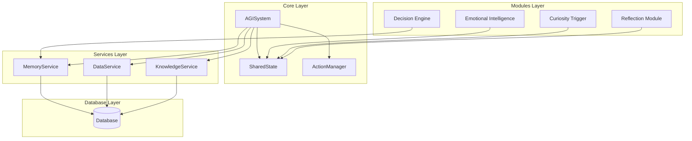
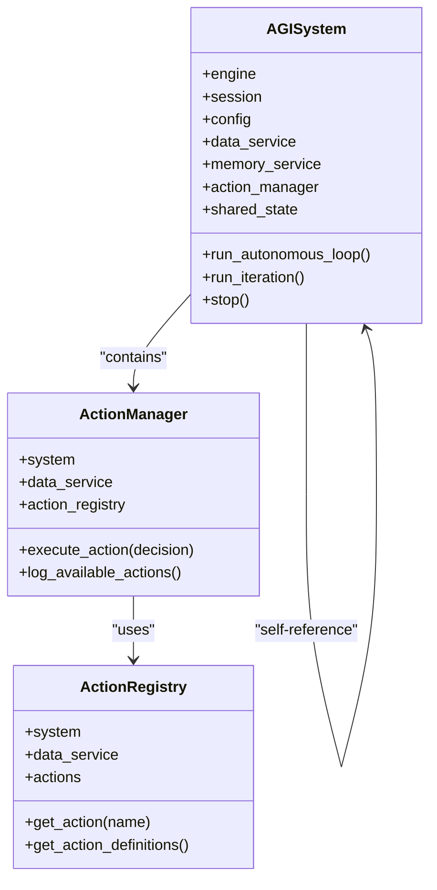
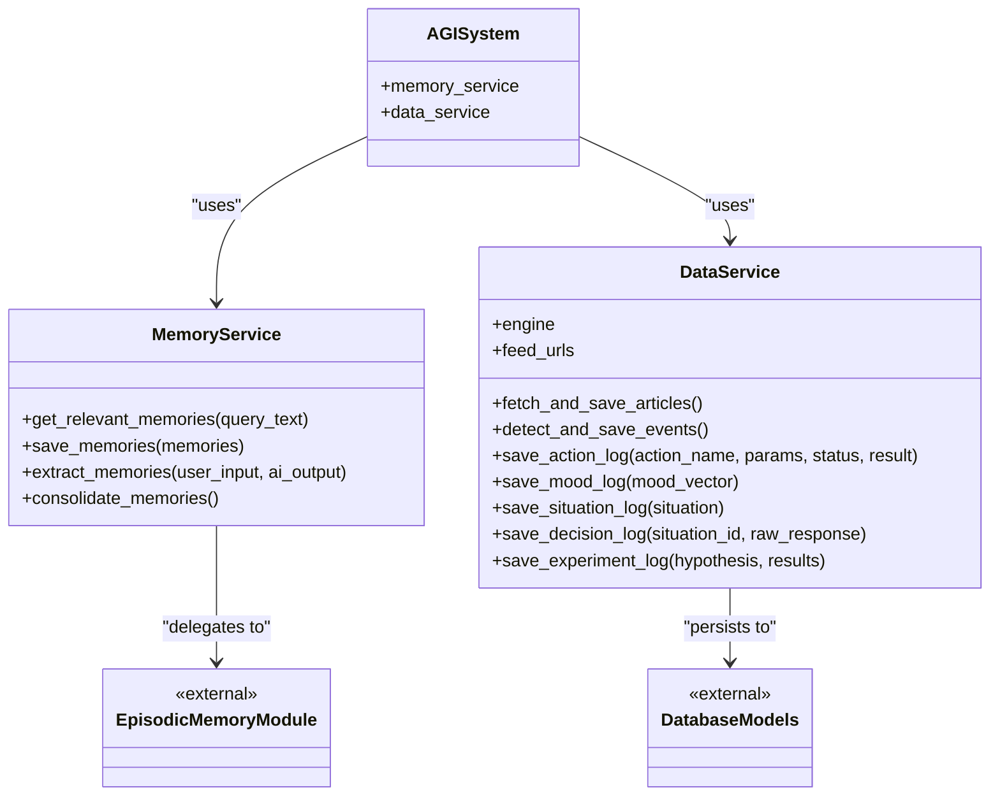
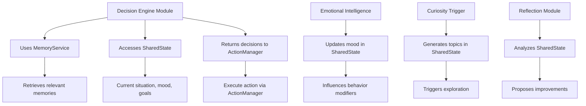
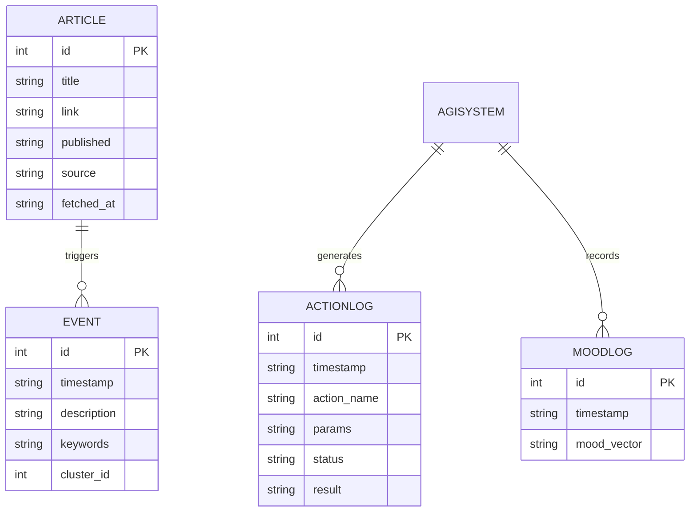
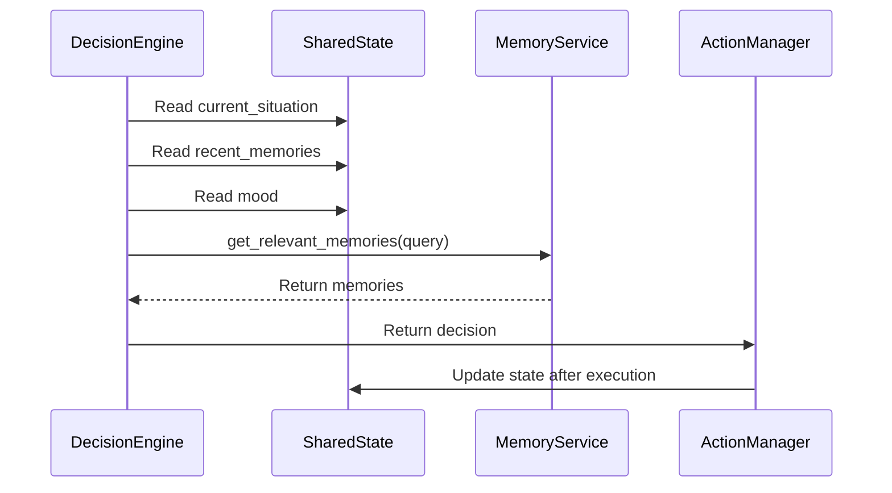
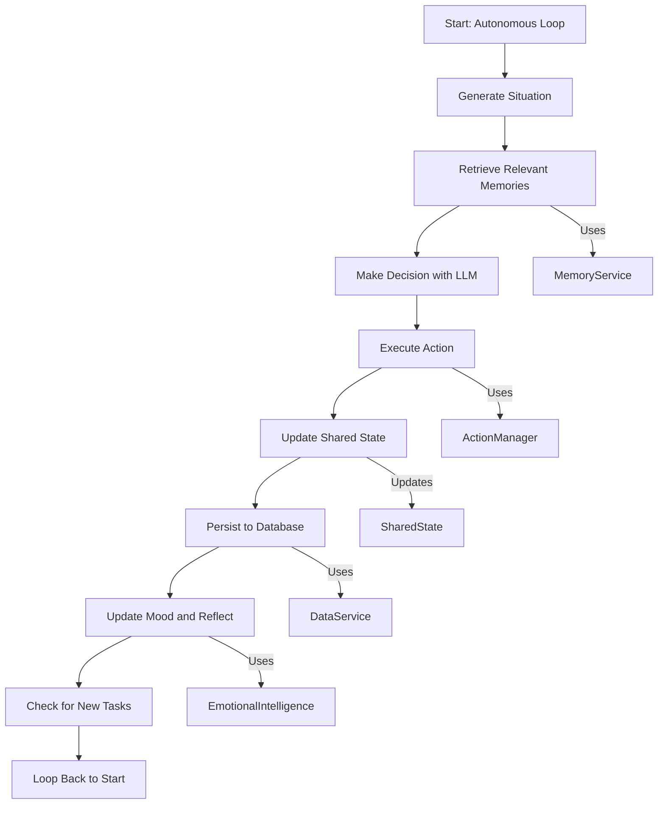

# Architectural Layering


## Table of Contents
1. [Introduction](#introduction)
2. [Layered Architecture Overview](#layered-architecture-overview)
3. [Core Layer: Orchestration and State](#core-layer-orchestration-and-state)
4. [Services Layer: Abstraction Interfaces](#services-layer-abstraction-interfaces)
5. [Modules Layer: Feature Implementations](#modules-layer-feature-implementations)
6. [Database Layer: Persistence](#database-layer-persistence)
7. [Configuration and Dependency Injection](#configuration-and-dependency-injection)
8. [Shared State Management](#shared-state-management)
9. [Data Flow and Cross-Layer Interactions](#data-flow-and-cross-layer-interactions)
10. [Benefits of Layered Architecture](#benefits-of-layered-architecture)

## Introduction
RAVANA implements a layered architecture designed to support an autonomous artificial general intelligence (AGI) system. This document details the responsibilities, boundaries, and interactions between the core architectural layers: core (orchestration and state), services (abstraction interfaces), modules (feature implementations), and database (persistence). It explains how configuration is loaded and propagated via Dependency Injection, how shared state is managed through the State class, and how data flows across layers. The architecture emphasizes component decoupling, testability, maintainability, and extensibility.

## Layered Architecture Overview
RAVANA's architecture is organized into four primary layers that define clear separation of concerns:

- **Core Layer**: Central orchestration and global state management
- **Services Layer**: Abstract interfaces for cross-cutting capabilities
- **Modules Layer**: Domain-specific feature implementations
- **Database Layer**: Data persistence and retrieval

This layered approach enables modular development, independent testing, and flexible system evolution.



**Diagram sources**
- [core/system.py](file://core/system.py#L34-L624)
- [core/state.py](file://core/state.py#L2-L29)
- [services/memory_service.py](file://services/memory_service.py#L8-L20)
- [services/data_service.py](file://services/data_service.py#L10-L155)

## Core Layer: Orchestration and State
The core layer serves as the central nervous system of RAVANA, responsible for system orchestration, state coordination, and action execution.

### System Orchestration
The `AGISystem` class (in `system.py`) is the primary orchestrator, managing the autonomous loop and coordinating interactions between all components. It initializes services, modules, and state, and drives the main execution loop through `run_autonomous_loop()`.

Key orchestration responsibilities include:
- Managing the main execution loop
- Coordinating background tasks (data collection, event detection)
- Handling system startup and graceful shutdown
- Sequencing the decision-making process

### Action Management
The `ActionManager` class handles the execution of actions determined by the decision engine. It uses a registry pattern to manage available actions and provides a uniform interface for action execution.



**Diagram sources**
- [core/system.py](file://core/system.py#L34-L624)
- [core/action_manager.py](file://core/action_manager.py#L15-L126)

**Section sources**
- [core/system.py](file://core/system.py#L34-L624)
- [core/action_manager.py](file://core/action_manager.py#L15-L126)

## Services Layer: Abstraction Interfaces
The services layer provides abstraction interfaces for cross-cutting capabilities, decoupling business logic from implementation details.

### Memory Service
The `MemoryService` class provides an asynchronous interface for memory operations, abstracting the underlying episodic memory implementation in the modules layer.

Key methods:
- `get_relevant_memories(query_text)`: Retrieve contextually relevant memories
- `save_memories(memories)`: Persist memories to storage
- `extract_memories(user_input, ai_output)`: Extract structured memories from interactions
- `consolidate_memories()`: Optimize memory storage and retrieval

The service acts as a facade, delegating to the actual memory implementation in `modules.episodic_memory.memory` while providing a clean, consistent API.

### Data Service
The `DataService` class manages data persistence operations, serving as the primary interface between the application and the database.

Responsibilities:
- Fetching and saving articles from RSS feeds
- Detecting and saving events
- Logging system activities (actions, mood, decisions, experiments)
- Providing database session management

The service uses synchronous operations wrapped in thread executors for async compatibility, ensuring non-blocking behavior in the main event loop.



**Diagram sources**
- [services/memory_service.py](file://services/memory_service.py#L8-L20)
- [services/data_service.py](file://services/data_service.py#L10-L155)
- [core/system.py](file://core/system.py#L34-L624)

**Section sources**
- [services/memory_service.py](file://services/memory_service.py#L8-L20)
- [services/data_service.py](file://services/data_service.py#L10-L155)

## Modules Layer: Feature Implementations
The modules layer contains domain-specific feature implementations that provide specialized capabilities to the AGI system.

### Decision Engine
The decision engine module implements goal-driven decision making, using LLMs to determine appropriate actions based on the current situation, goals, and hypotheses.

Key components:
- `decision_maker.py`: Core decision-making logic
- `planner.py`: Goal planning and management
- `search_result_manager.py`: Web search integration

The decision engine interacts with multiple layers:
- Uses `MemoryService` to retrieve relevant memories
- Accesses `SharedState` for current context
- Returns decisions to `ActionManager` for execution

### Other Key Modules
- **Emotional Intelligence**: Manages mood states and emotional responses
- **Curiosity Trigger**: Generates novel topics for exploration
- **Reflection Module**: Enables self-reflection and improvement
- **Knowledge Compression**: Summarizes and organizes knowledge
- **Event Detection**: Identifies significant events from data streams

Each module encapsulates specific functionality while adhering to the layered architecture principles.



**Diagram sources**
- [modules/decision_engine/decision_maker.py](file://modules/decision_engine/decision_maker.py#L0-L181)
- [core/state.py](file://core/state.py#L2-L29)
- [services/memory_service.py](file://services/memory_service.py#L8-L20)

**Section sources**
- [modules/decision_engine/decision_maker.py](file://modules/decision_engine/decision_maker.py#L0-L181)

## Database Layer: Persistence
The database layer handles data persistence using SQLModel for ORM-based database interactions.

### Data Models
The `models.py` file defines all persistent data structures:

- **Article**: RSS feed articles
- **Event**: Detected significant events
- **Summary**: Compressed knowledge summaries
- **ActionLog**: Executed actions and outcomes
- **MoodLog**: Mood state history
- **SituationLog**: Generated situations
- **DecisionLog**: Decision-making records
- **ExperimentLog**: Experiment hypotheses and results

These models use SQLModel (SQLAlchemy + Pydantic) for type safety and database integration.

### Persistence Strategy
The system follows a write-heavy pattern with periodic background tasks handling data collection and processing:

- Articles are fetched hourly
- Events are detected every 10 minutes
- Knowledge is compressed daily
- Memories are consolidated every 6 hours

This approach balances real-time responsiveness with system performance.



**Diagram sources**
- [database/models.py](file://database/models.py#L0-L56)
- [services/data_service.py](file://services/data_service.py#L10-L155)

**Section sources**
- [database/models.py](file://database/models.py#L0-L56)

## Configuration and Dependency Injection
RAVANA uses a configuration-driven approach with explicit dependency injection to manage system settings and component relationships.

### Configuration Loading
The `Config` class in `config.py` loads settings from environment variables with sensible defaults:

```python
class Config:
    DATABASE_URL = os.environ.get("DATABASE_URL", "sqlite:///ravana_agi.db")
    LOG_LEVEL = os.environ.get("LOG_LEVEL", "INFO")
    CURIOSITY_CHANCE = float(os.environ.get("CURIOSITY_CHANCE", 0.3))
    LOOP_SLEEP_DURATION = int(os.environ.get("LOOP_SLEEP_DURATION", 10))
    # ... other settings
```

This pattern allows for environment-specific configuration without code changes.

### Dependency Injection Pattern
Dependencies are injected through constructor parameters, establishing clear component relationships:

```python
class AGISystem:
    def __init__(self, engine):
        # Services
        self.data_service = DataService(engine, Config.FEED_URLS, embedding_model, sentiment_classifier)
        self.memory_service = MemoryService()
        
        # Modules
        self.situation_generator = SituationGenerator(embedding_model, sentiment_classifier)
        self.emotional_intelligence = EmotionalIntelligence()
        
        # Action manager
        self.action_manager = EnhancedActionManager(self, self.data_service)
        
        # Shared state
        self.shared_state = SharedState(initial_mood=self.emotional_intelligence.get_mood_vector())
```

This approach provides several benefits:
- Clear visibility of component dependencies
- Easy testing through dependency substitution
- Flexible configuration and composition
- Avoidance of global state and hidden dependencies

**Section sources**
- [core/config.py](file://core/config.py#L0-L41)
- [core/system.py](file://core/system.py#L34-L624)

## Shared State Management
The shared state pattern is central to RAVANA's architecture, enabling component decoupling while maintaining system coherence.

### State Class Design
The `SharedState` class in `state.py` encapsulates the AGI's current state:

```python
class SharedState:
    def __init__(self, initial_mood: Dict[str, float]):
        self.mood: Dict[str, float] = initial_mood
        self.current_situation: Dict[str, Any] = None
        self.current_situation_id: int = None
        self.recent_memories: List[Dict[str, Any]] = []
        self.long_term_goals: List[str] = []
        self.mood_history: List[Dict[str, float]] = []
        self.curiosity_topics: List[str] = []
        self.search_results: List[str] = []
        self.current_task: str = None
```

### State Management Benefits
The shared state pattern provides several architectural advantages:

- **Decoupling**: Components access state without direct dependencies on each other
- **Consistency**: Single source of truth for system state
- **Extensibility**: New state properties can be added without modifying all components
- **Testability**: State can be easily mocked or reset for testing

Components interact with state through well-defined properties rather than direct method calls, reducing coupling.



**Diagram sources**
- [core/state.py](file://core/state.py#L2-L29)
- [modules/decision_engine/decision_maker.py](file://modules/decision_engine/decision_maker.py#L0-L181)
- [core/system.py](file://core/system.py#L34-L624)

**Section sources**
- [core/state.py](file://core/state.py#L2-L29)

## Data Flow and Cross-Layer Interactions
Understanding the data flow across layers is essential for comprehending RAVANA's operation.

### Decision-Making Workflow
The primary workflow follows a cycle of situation assessment, decision making, and action execution:

1. Generate or receive a situation
2. Retrieve relevant memories from MemoryService
3. Make a decision using the decision engine
4. Execute the chosen action via ActionManager
5. Update shared state and persist outcomes
6. Reflect on results and update mood

### Cross-Layer Interaction Example
Consider a decision engine module using memory service to store outcomes:

```python
# In decision_maker.py
def goal_driven_decision_maker_loop(situation, shared_state=None):
    # ... decision logic ...
    
    # After making a decision
    interaction_summary = f"Situation: {situation}\nDecision: {decision}"
    
    # Use MemoryService to extract and save memories
    memories_to_save = await memory_service.extract_memories(interaction_summary, "")
    if memories_to_save.memories:
        await memory_service.save_memories(memories_to_save.memories)
```

This pattern demonstrates clean separation:
- Decision engine focuses on decision logic
- Memory service handles memory operations
- No direct knowledge of persistence details



**Diagram sources**
- [core/system.py](file://core/system.py#L34-L624)
- [modules/decision_engine/decision_maker.py](file://modules/decision_engine/decision_maker.py#L0-L181)
- [services/memory_service.py](file://services/memory_service.py#L8-L20)

**Section sources**
- [core/system.py](file://core/system.py#L34-L624)
- [modules/decision_engine/decision_maker.py](file://modules/decision_engine/decision_maker.py#L0-L181)

## Benefits of Layered Architecture
RAVANA's layered architecture provides significant advantages for an AGI system.

### Testability
The clear separation of concerns enables focused testing:
- Core orchestration can be tested independently
- Services can be mocked for unit testing
- Modules can be tested in isolation
- Database interactions can be stubbed

Dependency injection makes it easy to substitute real dependencies with test doubles.

### Maintainability
The architecture promotes maintainability through:
- Clear component boundaries
- Well-defined interfaces
- Reduced coupling between components
- Independent development of layers

Changes to one layer typically don't require modifications to others, reducing regression risk.

### Extensibility
New capabilities can be added with minimal disruption:
- New modules can be integrated into the existing framework
- Additional services can be introduced as needed
- Database schema can be extended incrementally
- Configuration can be adjusted without code changes

The action registry pattern allows new actions to be added dynamically.

### Performance and Reliability
The architecture supports performance optimization:
- Background tasks handle time-consuming operations
- State caching reduces redundant computations
- Asynchronous operations prevent blocking
- Modular design enables targeted optimization

The separation of real-time decision making from background processing ensures responsive system behavior.

**Referenced Files in This Document**   
- [core/config.py](file://core/config.py)
- [core/state.py](file://core/state.py)
- [core/system.py](file://core/system.py)
- [core/action_manager.py](file://core/action_manager.py)
- [services/memory_service.py](file://services/memory_service.py)
- [services/data_service.py](file://services/data_service.py)
- [database/models.py](file://database/models.py)
- [modules/decision_engine/decision_maker.py](file://modules/decision_engine/decision_maker.py)
