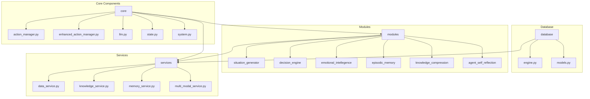
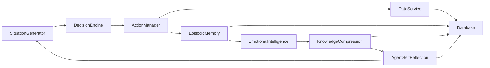
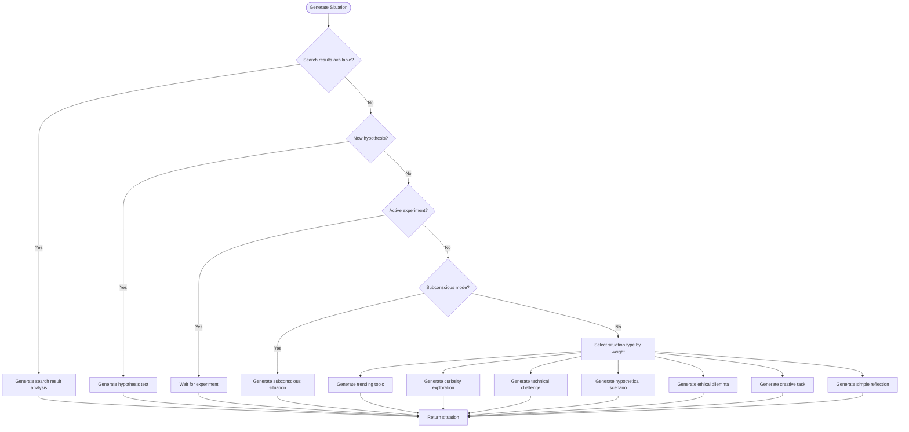
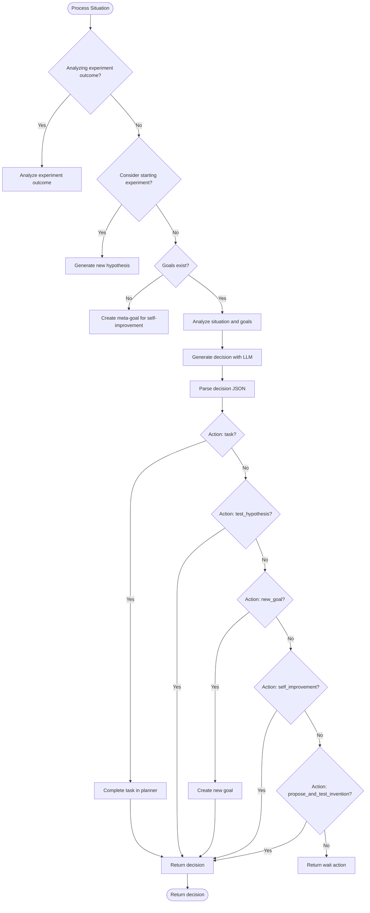
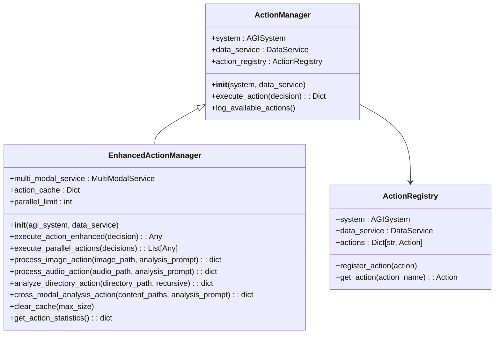
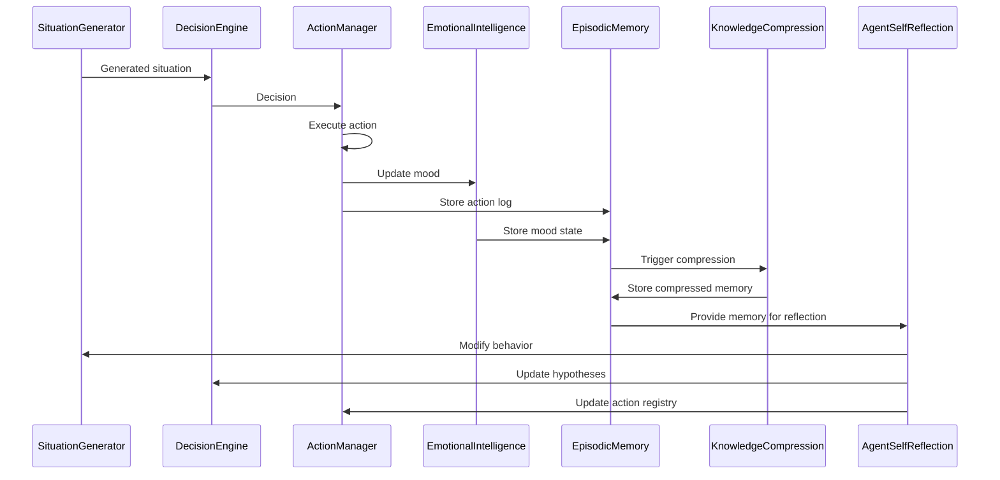
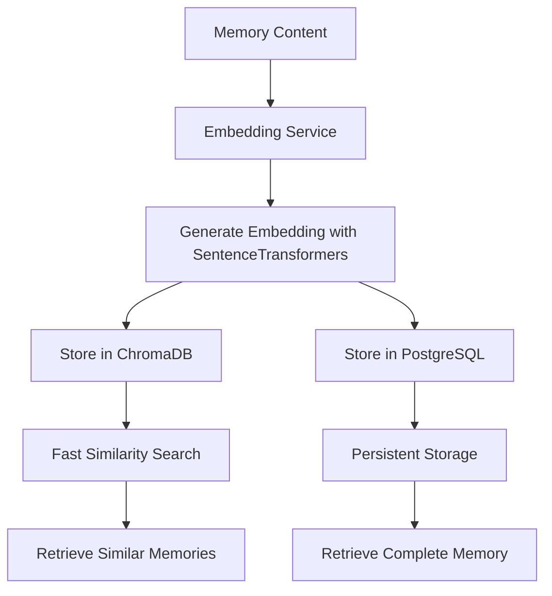
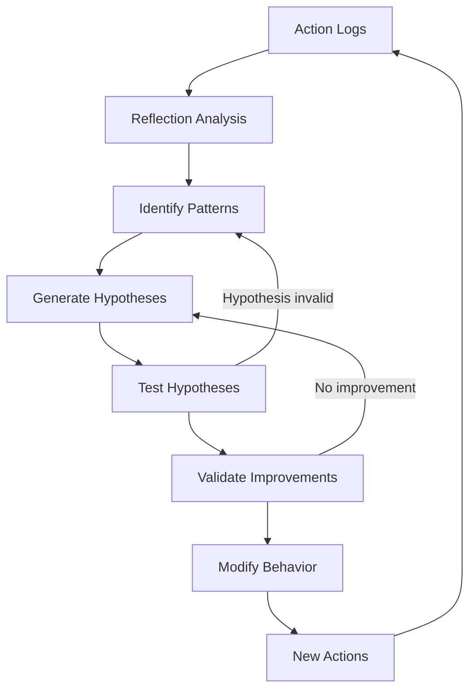
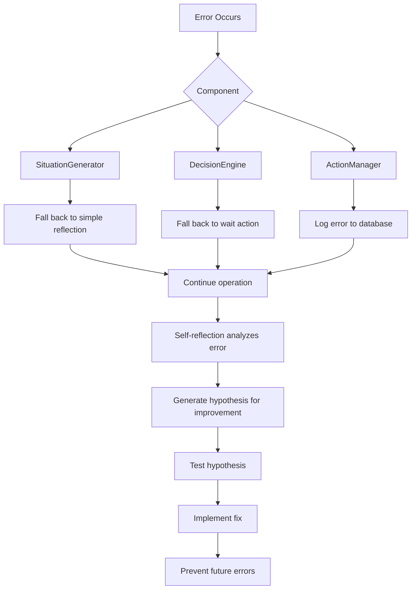
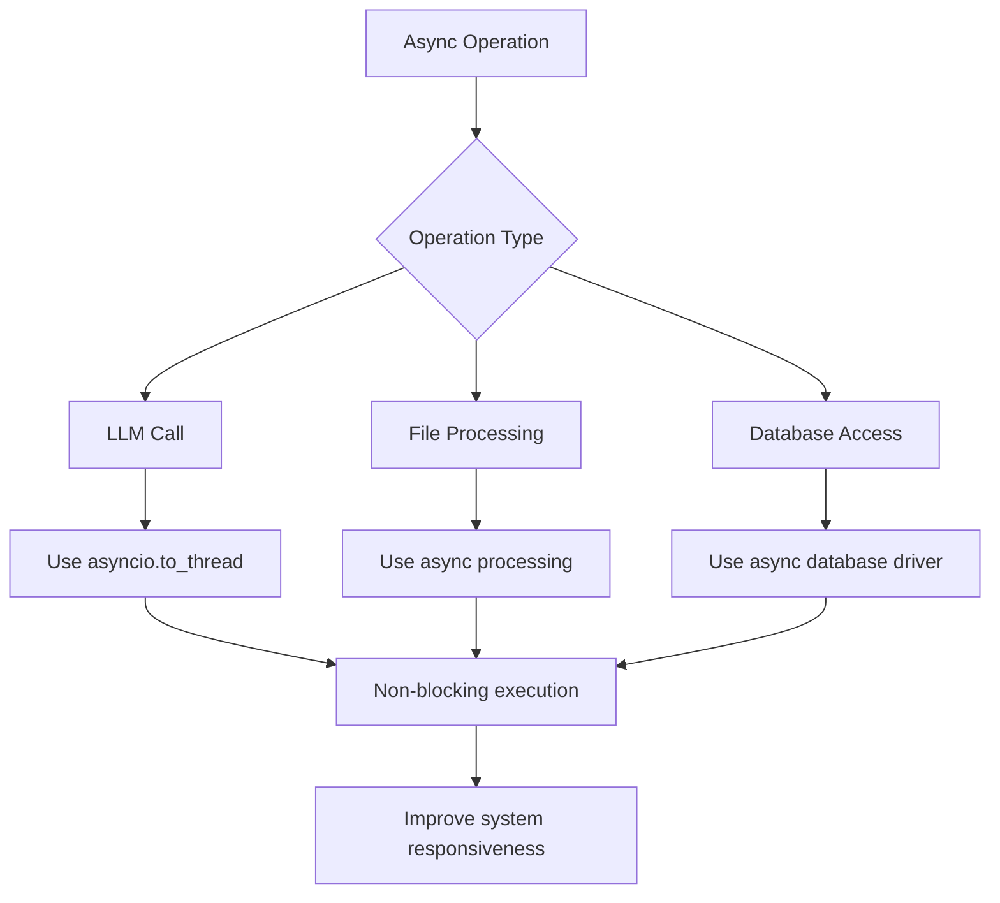

# Data Flow and Lifecycle

## Table of Contents
1. [Introduction](#introduction)
2. [Project Structure](#project-structure)
3. [Core Components](#core-components)
4. [Architecture Overview](#architecture-overview)
5. [Detailed Component Analysis](#detailed-component-analysis)
6. [Data Flow and Lifecycle](#data-flow-and-lifecycle)
7. [Vector Embeddings and Memory Storage](#vector-embeddings-and-memory-storage)
8. [Self-Reflection and Feedback Loop](#self-reflection-and-feedback-loop)
9. [Error Handling and Recovery](#error-handling-and-recovery)
10. [Performance and Timing Considerations](#performance-and-timing-considerations)
11. [Conclusion](#conclusion)

## Introduction
This document provides a comprehensive analysis of the end-to-end data flow within RAVANA's autonomous cycle. It traces the journey of a generated situation from its creation in the SituationGenerator through decision making, action execution, mood impact, memory storage, and eventual compression. The document details the data lifecycle from transient state variables to persistent database records, explains how vector embeddings are generated via SentenceTransformers and stored in ChromaDB, and illustrates the feedback loop where self-reflection analyzes action logs to modify behavior. The analysis includes timing considerations for async operations and data consistency across components, and provides flowcharts showing both normal operation and error recovery paths.

## Project Structure
The RAVANA project is organized into a modular structure with clear separation of concerns. The core components are organized into the following main directories:

- **core**: Contains the fundamental system components including action management, configuration, state management, and LLM integration.
- **database**: Contains database engine and model definitions for persistent storage.
- **modules**: Contains specialized functional modules for various aspects of the AGI system.
- **services**: Contains service layer components that provide higher-level functionality.
- **tests**: Contains unit and integration tests for the system.

The modular design allows for independent development and testing of different components while maintaining a cohesive system architecture.

**Diagram sources**
- [project_structure](file://#L0-L100)

## Core Components
The RAVANA system consists of several core components that work together to create an autonomous cycle of situation generation, decision making, action execution, and self-improvement. The key components include:

- **SituationGenerator**: Responsible for creating situations that the AGI system must address.
- **DecisionEngine**: Processes generated situations and makes decisions on how to respond.
- **ActionManager**: Executes the decisions made by the DecisionEngine.
- **EmotionalIntelligence**: Manages the AGI's mood and emotional state.
- **EpisodicMemory**: Stores and retrieves memories of past situations and actions.
- **KnowledgeCompression**: Compresses and summarizes knowledge for efficient storage.
- **AgentSelfReflection**: Analyzes past actions and outcomes to improve future behavior.

These components work together in a continuous cycle, with each component contributing to the overall intelligence and autonomy of the system.

**Section sources**
- [situation_generator.py](file://modules/situation_generator/situation_generator.py#L0-L872)
- [decision_maker.py](file://modules/decision_engine/decision_maker.py#L0-L181)
- [action_manager.py](file://core/action_manager.py#L0-L126)
- [emotional_intellegence.py](file://modules/emotional_intellegence/emotional_intellegence.py#L0-L100)
- [memory.py](file://modules/episodic_memory/memory.py#L0-L300)
- [compressed_memory.py](file://modules/knowledge_compression/compressed_memory.py#L0-L250)
- [self_modification.py](file://modules/agent_self_reflection/self_modification.py#L0-L200)

## Architecture Overview
The RAVANA system follows a modular architecture with clear separation of concerns and well-defined interfaces between components. The system is designed to be extensible, with new modules able to be added without modifying existing code.

The architecture is based on an event-driven model, where the SituationGenerator creates situations that trigger a chain of events through the system. The DecisionEngine processes these situations and makes decisions, which are then executed by the ActionManager. The results of these actions are stored in memory and used to update the AGI's emotional state and knowledge base.

The system uses a shared state pattern, where components can access and modify a shared state object. This allows for efficient communication between components without the need for complex message passing.

**Diagram sources**
- [situation_generator.py](file://modules/situation_generator/situation_generator.py#L0-L872)
- [decision_maker.py](file://modules/decision_engine/decision_maker.py#L0-L181)
- [action_manager.py](file://core/action_manager.py#L0-L126)
- [memory.py](file://modules/episodic_memory/memory.py#L0-L300)
- [compressed_memory.py](file://modules/knowledge_compression/compressed_memory.py#L0-L250)
- [self_modification.py](file://modules/agent_self_reflection/self_modification.py#L0-L200)

## Detailed Component Analysis

### Situation Generator Analysis
The SituationGenerator is responsible for creating situations that the AGI system must address. It uses a variety of methods to generate situations, including trending topics, curiosity exploration, technical challenges, ethical dilemmas, and creative tasks.

The generator uses a probabilistic selection process to choose the type of situation to generate, with different weights assigned to each type. It can also be influenced by behavior modifiers that force specific types of situations to be generated.

**Diagram sources**
- [situation_generator.py](file://modules/situation_generator/situation_generator.py#L0-L872)

**Section sources**
- [situation_generator.py](file://modules/situation_generator/situation_generator.py#L0-L872)

### Decision Engine Analysis
The DecisionEngine processes generated situations and makes decisions on how to respond. It uses a goal-driven decision-making loop that considers the AGI's long-term goals, current hypotheses, and the current situation.

The decision engine can take several types of actions, including executing tasks, testing hypotheses, proposing new inventions, creating new goals, and proposing self-improvement plans. It uses an LLM to generate decisions based on the current context.

**Diagram sources**
- [decision_maker.py](file://modules/decision_engine/decision_maker.py#L0-L181)
- [planner.py](file://modules/decision_engine/planner.py#L0-L220)

**Section sources**
- [decision_maker.py](file://modules/decision_engine/decision_maker.py#L0-L181)
- [planner.py](file://modules/decision_engine/planner.py#L0-L220)

### Action Manager Analysis
The ActionManager is responsible for executing the decisions made by the DecisionEngine. It uses an action registry to manage available actions and provides a consistent interface for executing them.

The EnhancedActionManager extends the basic ActionManager with additional capabilities, including multi-modal support, parallel execution, and action caching. It can process images, audio, and perform cross-modal analysis.

**Diagram sources**
- [action_manager.py](file://core/action_manager.py#L0-L126)
- [enhanced_action_manager.py](file://core/enhanced_action_manager.py#L0-L268)

**Section sources**
- [action_manager.py](file://core/action_manager.py#L0-L126)
- [enhanced_action_manager.py](file://core/enhanced_action_manager.py#L0-L268)

## Data Flow and Lifecycle
The data flow in RAVANA's autonomous cycle follows a well-defined path from situation generation to memory storage and compression. The lifecycle of a generated situation can be traced through the following stages:

1. **Situation Creation**: A situation is generated by the SituationGenerator based on various inputs and triggers.
2. **Decision Making**: The generated situation is processed by the DecisionEngine, which makes a decision on how to respond.
3. **Action Execution**: The decision is executed by the ActionManager, which performs the necessary actions.
4. **Mood Impact**: The outcome of the actions affects the AGI's mood and emotional state.
5. **Memory Storage**: The situation, decision, actions, and outcomes are stored in episodic memory.
6. **Knowledge Compression**: Over time, the stored memories are compressed and summarized to create more efficient knowledge representations.
7. **Self-Reflection**: The AGI analyzes its past actions and outcomes to improve future behavior.

This cycle is continuous, with each iteration building on the previous one to create a more intelligent and adaptive system.

**Diagram sources**
- [situation_generator.py](file://modules/situation_generator/situation_generator.py#L0-L872)
- [decision_maker.py](file://modules/decision_engine/decision_maker.py#L0-L181)
- [action_manager.py](file://core/action_manager.py#L0-L126)
- [emotional_intellegence.py](file://modules/emotional_intellegence/emotional_intellegence.py#L0-L100)
- [memory.py](file://modules/episodic_memory/memory.py#L0-L300)
- [compressed_memory.py](file://modules/knowledge_compression/compressed_memory.py#L0-L250)
- [self_modification.py](file://modules/agent_self_reflection/self_modification.py#L0-L200)

**Section sources**
- [situation_generator.py](file://modules/situation_generator/situation_generator.py#L0-L872)
- [decision_maker.py](file://modules/decision_engine/decision_maker.py#L0-L181)
- [action_manager.py](file://core/action_manager.py#L0-L126)
- [emotional_intellegence.py](file://modules/emotional_intellegence/emotional_intellegence.py#L0-L100)
- [memory.py](file://modules/episodic_memory/memory.py#L0-L300)
- [compressed_memory.py](file://modules/knowledge_compression/compressed_memory.py#L0-L250)
- [self_modification.py](file://modules/agent_self_reflection/self_modification.py#L0-L200)

## Vector Embeddings and Memory Storage
RAVANA uses vector embeddings to represent and store memories in a way that allows for efficient retrieval and analysis. The system uses SentenceTransformers to generate embeddings from text data, which are then stored in ChromaDB for fast similarity search.

The episodic memory system is implemented in the `episodic_memory` module, with the `client.py` file providing the main interface for storing and retrieving memories. The `embedding_service.py` file handles the generation of embeddings using SentenceTransformers, while the `postgresql_store.py` file manages the persistent storage of memories in a PostgreSQL database.

When a new memory is created, it goes through the following process:
1. The text content of the memory is passed to the embedding service.
2. The embedding service uses SentenceTransformers to generate a vector embedding of the text.
3. The embedding and associated metadata are stored in ChromaDB for fast similarity search.
4. The full memory content and metadata are stored in the PostgreSQL database for persistent storage.

This dual storage approach allows for both fast retrieval based on semantic similarity and reliable persistent storage of the complete memory content.

**Diagram sources**
- [client.py](file://modules/episodic_memory/client.py#L0-L200)
- [embedding_service.py](file://modules/episodic_memory/embedding_service.py#L0-L150)
- [postgresql_store.py](file://modules/episodic_memory/postgresql_store.py#L0-L200)

**Section sources**
- [client.py](file://modules/episodic_memory/client.py#L0-L200)
- [embedding_service.py](file://modules/episodic_memory/embedding_service.py#L0-L150)
- [postgresql_store.py](file://modules/episodic_memory/postgresql_store.py#L0-L200)

## Self-Reflection and Feedback Loop
The self-reflection component is a critical part of RAVANA's autonomous cycle, enabling the system to learn from its past experiences and improve its future behavior. The feedback loop works as follows:

1. The AgentSelfReflection module analyzes action logs and outcomes stored in the database.
2. It identifies patterns in successful and unsuccessful actions.
3. Based on this analysis, it generates hypotheses about how the system could improve.
4. These hypotheses are used to modify the system's behavior, such as adjusting the weights in the situation generator or updating the decision-making process.

The self-reflection process is implemented in the `agent_self_reflection` module, with the `main.py` file providing the entry point for the reflection process. The `reflection_db.py` file manages the storage of reflection data, while the `self_modification.py` file contains the logic for generating and testing hypotheses.

The feedback loop is closed when the system uses the insights from self-reflection to modify its own behavior, creating a continuous cycle of self-improvement.

**Diagram sources**
- [main.py](file://modules/agent_self_reflection/main.py#L0-L150)
- [reflection_db.py](file://modules/agent_self_reflection/reflection_db.py#L0-L100)
- [self_modification.py](file://modules/agent_self_reflection/self_modification.py#L0-L200)

**Section sources**
- [main.py](file://modules/agent_self_reflection/main.py#L0-L150)
- [reflection_db.py](file://modules/agent_self_reflection/reflection_db.py#L0-L100)
- [self_modification.py](file://modules/agent_self_reflection/self_modification.py#L0-L200)

## Error Handling and Recovery
RAVANA's autonomous cycle includes robust error handling and recovery mechanisms to ensure the system can continue to operate even in the face of failures. Each component has its own error handling strategy, and there are also system-wide mechanisms for recovering from errors.

In the SituationGenerator, if an error occurs while generating a situation of a particular type, the system falls back to generating a simple reflection situation. This ensures that the system always has a situation to work on, even if the preferred type of situation cannot be generated.

The DecisionEngine includes error handling for JSON parsing failures, with a fallback to a wait action if the LLM response cannot be parsed. This prevents the system from taking invalid actions based on malformed decisions.

The ActionManager includes comprehensive error handling for action execution, with all errors being logged to the database. This provides a complete record of all actions and their outcomes, which can be used for debugging and self-reflection.

The system also includes a graceful shutdown mechanism, implemented in the `shutdown_coordinator.py` file, which ensures that all components are properly shut down and all data is saved before the system terminates.

**Diagram sources**
- [situation_generator.py](file://modules/situation_generator/situation_generator.py#L0-L872)
- [decision_maker.py](file://modules/decision_engine/decision_maker.py#L0-L181)
- [action_manager.py](file://core/action_manager.py#L0-L126)
- [shutdown_coordinator.py](file://core/shutdown_coordinator.py#L0-L100)

**Section sources**
- [situation_generator.py](file://modules/situation_generator/situation_generator.py#L0-L872)
- [decision_maker.py](file://modules/decision_engine/decision_maker.py#L0-L181)
- [action_manager.py](file://core/action_manager.py#L0-L126)
- [shutdown_coordinator.py](file://core/shutdown_coordinator.py#L0-L100)

## Performance and Timing Considerations
The RAVANA system is designed with performance and timing considerations in mind, particularly for async operations and data consistency across components.

The system uses asyncio for all I/O operations, allowing for efficient handling of multiple concurrent tasks. This is particularly important for operations that involve external APIs or slow I/O, such as calling the LLM or processing large files.

The EnhancedActionManager includes a parallel execution capability, allowing multiple actions to be executed simultaneously with a configurable concurrency limit. This improves performance for tasks that can be parallelized, while preventing resource exhaustion.

Data consistency is maintained through careful management of shared state and the use of database transactions for critical operations. The system uses a combination of in-memory state for fast access and persistent storage for reliability.

Timing considerations include:
- 5-minute timeout for action execution in the EnhancedActionManager
- Asynchronous processing of I/O operations to prevent blocking
- Caching of frequently used actions to reduce execution time
- Batch processing of memory compression to reduce database load

These performance optimizations ensure that the system can operate efficiently even under heavy load.

**Diagram sources**
- [enhanced_action_manager.py](file://core/enhanced_action_manager.py#L0-L268)
- [action_manager.py](file://core/action_manager.py#L0-L126)
- [database/engine.py](file://database/engine.py#L0-L100)

**Section sources**
- [enhanced_action_manager.py](file://core/enhanced_action_manager.py#L0-L268)
- [action_manager.py](file://core/action_manager.py#L0-L126)
- [database/engine.py](file://database/engine.py#L0-L100)

## Conclusion
RAVANA's autonomous cycle is a sophisticated system that integrates multiple components to create a continuously learning and self-improving AGI. The end-to-end data flow, from situation generation to memory storage and compression, is carefully designed to ensure efficient operation and continuous improvement.

The system's use of vector embeddings and ChromaDB for memory storage enables fast and effective retrieval of relevant memories, while the self-reflection feedback loop allows the system to learn from its past experiences and improve its future behavior.

The robust error handling and recovery mechanisms ensure that the system can continue to operate even in the face of failures, and the performance optimizations allow for efficient operation under heavy load.

Overall, RAVANA represents a significant step forward in the development of autonomous AI systems, with a well-designed architecture that balances complexity with reliability and performance.

**Referenced Files in This Document**   
- [situation_generator.py](file://modules/situation_generator/situation_generator.py#L0-L872)
- [decision_maker.py](file://modules/decision_engine/decision_maker.py#L0-L181)
- [planner.py](file://modules/decision_engine/planner.py#L0-L220)
- [action_manager.py](file://core/action_manager.py#L0-L126)
- [enhanced_action_manager.py](file://core/enhanced_action_manager.py#L0-L268)
- [emotional_intellegence.py](file://modules/emotional_intellegence/emotional_intellegence.py#L0-L100)
- [mood_processor.py](file://modules/emotional_intellegence/mood_processor.py#L0-L150)
- [client.py](file://modules/episodic_memory/client.py#L0-L200)
- [memory.py](file://modules/episodic_memory/memory.py#L0-L300)
- [embedding_service.py](file://modules/episodic_memory/embedding_service.py#L0-L150)
- [postgresql_store.py](file://modules/episodic_memory/postgresql_store.py#L0-L200)
- [compressed_memory.py](file://modules/knowledge_compression/compressed_memory.py#L0-L250)
- [reflection_db.py](file://modules/agent_self_reflection/reflection_db.py#L0-L100)
- [self_modification.py](file://modules/agent_self_reflection/self_modification.py#L0-L200)
- [main.py](file://modules/agent_self_reflection/main.py#L0-L150)
- [core/state.py](file://core/state.py#L0-L100)