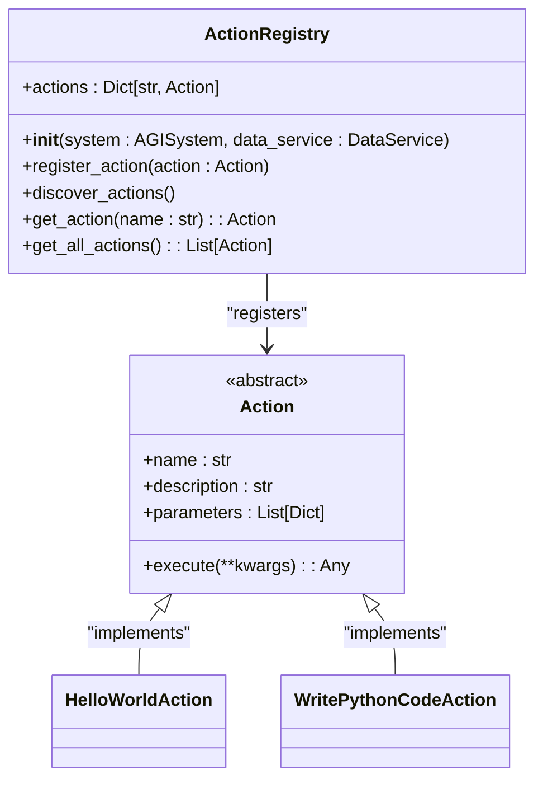
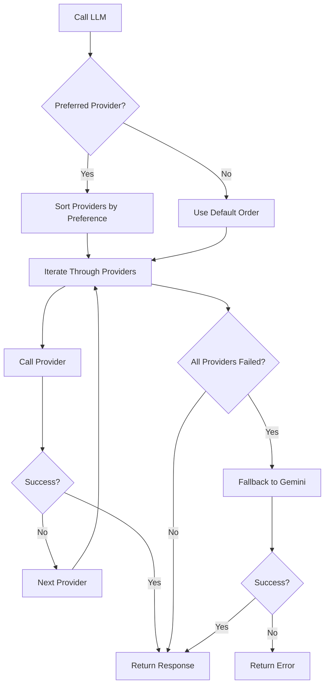
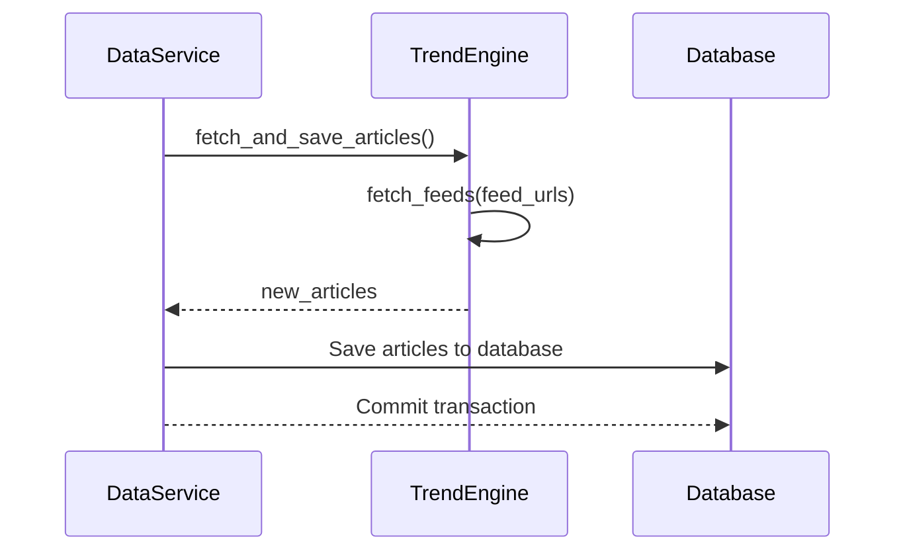
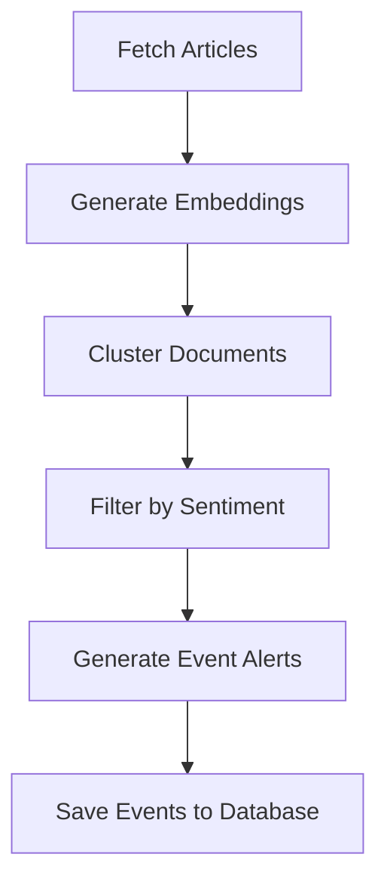

# Extensibility and Integration Points


## Table of Contents
1. [Introduction](#introduction)
2. [Plugin Architecture and Module Discovery](#plugin-architecture-and-module-discovery)
3. [Action Registry System](#action-registry-system)
4. [Multi-LLM Provider Interface](#multi-llm-provider-interface)
5. [External Data Integration](#external-data-integration)
6. [Adding New Actions and Custom Modules](#adding-new-actions-and-custom-modules)
7. [Security Considerations](#security-considerations)
8. [Version and Backward Compatibility](#version-and-backward-compatibility)
9. [Conclusion](#conclusion)

## Introduction
RAVANA is an advanced Artificial General Intelligence (AGI) system designed with extensibility at its core. This document details the mechanisms that allow RAVANA to be extended and integrated with external systems. The architecture supports dynamic plugin loading, a flexible action system, multi-provider LLM routing, and secure self-modification. These features enable developers to enhance the system's capabilities, integrate new data sources, and ensure robust operation in diverse environments.

## Plugin Architecture and Module Discovery
RAVANA's plugin architecture is centered around the `modules/` directory, where new cognitive functions can be added as independent modules. The system automatically discovers and integrates these modules at runtime. Each module is a self-contained Python package with its own dependencies and initialization logic. The discovery mechanism relies on the Python package structure and dynamic import capabilities. When the system starts, it scans the `modules/` directory and loads each subdirectory as a module. This design promotes loose coupling and allows for easy addition or removal of functionality without modifying the core system.

**Section sources**
- [DEVELOPER_GUIDE.md](file://DEVELOPER_GUIDE.md#L104-L130)

## Action Registry System
The Action Registry is the core mechanism for extending RAVANA's capabilities. It allows new actions to be added to the system, which can then be invoked by the decision engine to perform specific tasks.

### Action Registration and Discovery
The `ActionRegistry` class in `core/actions/registry.py` manages all available actions. It uses Python's `pkgutil.walk_packages` to automatically discover action classes within the `core.actions` package. When a new action class is found, it is instantiated and registered in the registry. This process occurs during system initialization, ensuring that all actions are available when the system starts.



**Diagram sources**
- [core/actions/registry.py](file://core/actions/registry.py#L0-L74)

**Section sources**
- [core/actions/registry.py](file://core/actions/registry.py#L0-L74)
- [DEVELOPER_GUIDE.md](file://DEVELOPER_GUIDE.md#L175-L216)

### Action Implementation
All actions must inherit from the `Action` abstract base class. This class defines the required interface, including the `name`, `description`, `parameters`, and `execute` method. The `parameters` property defines the input schema for the action, which is used by the LLM to generate valid function calls.

## Multi-LLM Provider Interface
RAVANA supports multiple LLM providers, allowing for configuration-driven routing and fallback strategies. This ensures high availability and resilience in case of provider outages.

### Configuration-Driven Routing
The LLM configuration is defined in `core/llm.py` using a list of provider dictionaries. Each provider specifies its name, API key, base URL, and supported models. The system can route requests to a preferred provider or use a random provider from the list.

```python
PROVIDERS = [
    {
        "name": "a4f",
        "api_key": os.getenv("A4F_API_KEY"),
        "base_url": "https://api.a4f.co/v1",
        "models": ["provider-3/gemini-2.0-flash", "provider-2/llama-4-scout"]
    },
    {
        "name": "zukijourney",
        "api_key": os.getenv("ZUKIJOURNEY_API_KEY"),
        "base_url": "https://api.zukijourney.com/v1",
        "models": ["gpt-4o:online", "gpt-4o"]
    }
]
```

### Fallback Strategies
The `call_llm` function implements a fallback strategy that tries each provider in sequence until one succeeds. If all primary providers fail, the system falls back to the Gemini API. This ensures that the system can continue to operate even if some providers are unavailable.



**Diagram sources**
- [core/llm.py](file://core/llm.py#L294-L331)

**Section sources**
- [core/llm.py](file://core/llm.py#L250-L449)

## External Data Integration
RAVANA can integrate external data sources such as RSS feeds and web content through the data service and event detection pipeline.

### Data Service
The `DataService` class in `services/data_service.py` is responsible for fetching and saving articles from RSS feeds. It uses the `fetch_feeds` function from the trend analysis module to retrieve new articles and stores them in the database.



**Diagram sources**
- [services/data_service.py](file://services/data_service.py#L0-L57)

### Event Detection Pipeline
The event detection pipeline processes the collected articles to identify significant events. The `process_data_for_events` function in `modules/event_detection/event_detector.py` uses embedding models and clustering algorithms to group related articles and generate event alerts.



**Diagram sources**
- [modules/event_detection/event_detector.py](file://modules/event_detection/event_detector.py#L0-L188)

**Section sources**
- [services/data_service.py](file://services/data_service.py#L0-L155)
- [modules/event_detection/event_detector.py](file://modules/event_detection/event_detector.py#L0-L188)

## Adding New Actions and Custom Modules
Developers can extend RAVANA by adding new actions or creating custom modules.

### Step-by-Step: Adding a New Action
1. **Create a Python file** in the `core/actions/` directory.
2. **Define the Action Class** that inherits from `Action`.
3. **Implement the required properties**: `name`, `description`, and `parameters`.
4. **Implement the `execute` method** with the action's logic.

Example:
```python
from core.actions.action import Action

class HelloWorldAction(Action):
    @property
    def name(self) -> str:
        return "hello_world"

    @property
    def description(self) -> str:
        return "A simple action that prints a greeting."

    @property
    def parameters(self) -> List[Dict[str, Any]]:
        return [
            {
                "name": "name",
                "type": "string",
                "description": "The name to include in the greeting.",
                "required": True,
            }
        ]

    async def execute(self, **kwargs: Any) -> Any:
        name = kwargs.get("name")
        return f"Hello, {name}!"
```

### Step-by-Step: Creating a Custom Module
1. **Create a new directory** in the `modules/` directory.
2. **Add an `__init__.py` file** to make it a Python package.
3. **Implement the module's functionality** in Python files.
4. **Define dependencies** in `requirements.txt` or `pyproject.toml`.

**Section sources**
- [DEVELOPER_GUIDE.md](file://DEVELOPER_GUIDE.md#L175-L216)

## Security Considerations
RAVANA includes several security measures for self-modification features and file system access.

### Self-Modification Security
The self-modification system in `modules/agent_self_reflection/self_modification.py` includes multiple safety checks:
- **Sandboxed Testing**: Changes are tested in a temporary directory before being applied.
- **Audit Logging**: All modifications are logged with a timestamp and details.
- **Rollback Capability**: Original files are backed up before modification, allowing for rollback in case of failure.
- **Code Validation**: Generated code patches are validated to prevent malicious or lazy responses.

```python
def test_patch(filename, start, end, new_code):
    # Create backup
    backup_path = original_path + ".bak"
    shutil.copy2(original_path, backup_path)
    
    try:
        # Apply patch temporarily
        # Run tests
        test_result = run_tests()
        return test_result
    finally:
        # Restore original file
        shutil.move(backup_path, original_path)
```

**Section sources**
- [modules/agent_self_reflection/self_modification.py](file://modules/agent_self_reflection/self_modification.py#L0-L500)

## Version and Backward Compatibility
RAVANA employs strategies to maintain version compatibility and backward compatibility for extensions.

### State Version Management
The `StateManager` class in `core/state_manager.py` includes version compatibility checks. It validates the state data version against a list of supported versions and rejects incompatible states.

```python
def _validate_state_data(self, state_data: Dict[str, Any]) -> bool:
    version = state_data.get("version")
    if version not in self.supported_versions:
        logger.error(f"Unsupported state version: {version}")
        return False
    return True
```

### Backup and Recovery
The system creates regular backups of state files and can recover from them if the primary state file is corrupted or incompatible. Old backups are cleaned up to prevent disk space issues.

**Section sources**
- [core/state_manager.py](file://core/state_manager.py#L81-L280)

## Conclusion
RAVANA's extensibility mechanisms provide a robust foundation for building and enhancing an AGI system. The plugin architecture, action registry, multi-LLM interface, and data integration pipeline enable developers to extend the system's capabilities in numerous ways. Security measures and compatibility strategies ensure that these extensions can be made safely and reliably. By following the documented patterns, developers can contribute to the evolution of RAVANA while maintaining system integrity and performance.

**Referenced Files in This Document**   
- [core/actions/registry.py](file://core/actions/registry.py)
- [core/llm.py](file://core/llm.py)
- [services/data_service.py](file://services/data_service.py)
- [modules/event_detection/event_detector.py](file://modules/event_detection/event_detector.py)
- [modules/agent_self_reflection/self_modification.py](file://modules/agent_self_reflection/self_modification.py)
- [DEVELOPER_GUIDE.md](file://DEVELOPER_GUIDE.md)
- [core/state_manager.py](file://core/state_manager.py)