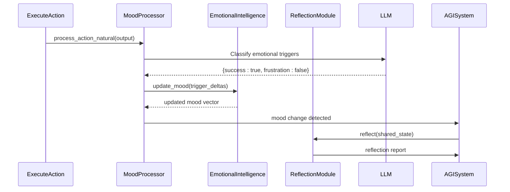

# Key Design Patterns


## Table of Contents
1. [Singleton Pattern in AGISystem](#singleton-pattern-in-agisystem)
2. [Registry Pattern in ActionRegistry](#registry-pattern-in-actionregistry)
3. [Observer Pattern in Mood Processing](#observer-pattern-in-mood-processing)
4. [Strategy Pattern in LLM Provider Selection](#strategy-pattern-in-llm-provider-selection)
5. [Dependency Injection in Module Initialization](#dependency-injection-in-module-initialization)

## Singleton Pattern in AGISystem

The AGISystem class serves as the central orchestrator of the RAVANA AGI framework, designed to ensure a single, globally accessible instance throughout the application lifecycle. While the current implementation does not enforce strict singleton constraints (such as using a metaclass or `__new__` override), it is architecturally intended to be instantiated only once per application run, typically at the entry point in `main.py`. This design guarantees that all modules and services interact with the same system state, shared memory, and configuration.

The AGISystem class initializes core components such as the `DataService`, `KnowledgeService`, `MemoryService`, and various cognitive modules like `EmotionalIntelligence`, `ReflectionModule`, and `AdaptiveLearningEngine`. By centralizing these services within a single instance, the system avoids redundancy, ensures consistency in state management, and enables seamless inter-module communication.

```python
class AGISystem:
    def __init__(self, engine):
        self.engine = engine
        self.session = Session(engine)
        self.config = Config()
        self.data_service = DataService(...)
        self.knowledge_service = KnowledgeService(engine)
        self.memory_service = MemoryService()
        # ... other module initializations
```

This pattern was chosen over alternatives like global variables or static classes because it allows for dependency injection, better testability, and encapsulation of system-wide state. The use of a single instance also simplifies lifecycle management, particularly during shutdown, where all background tasks and database sessions can be cleanly terminated through the `stop()` method.

**Section sources**
- [core/system.py](file://core/system.py#L34-L624)

## Registry Pattern in ActionRegistry

The ActionRegistry class implements the Registry pattern to dynamically manage and discover available actions within the RAVANA system. This pattern enables the system to maintain a centralized catalog of executable actions, allowing for flexible extension and runtime discovery without requiring hardcoded dependencies.

The registry is initialized with a set of core actions such as `ProposeAndTestInventionAction`, `LogMessageAction`, `WritePythonCodeAction`, and `ExecutePythonFileAction`. These are registered during initialization with references to the main AGISystem instance and the DataService, enabling actions to interact with the broader system state.

```python
class ActionRegistry:
    def __init__(self, system: 'AGISystem', data_service: 'DataService') -> None:
        self.actions: Dict[str, Action] = {}
        self._register_action(ProposeAndTestInventionAction(system, data_service))
        self._register_action(LogMessageAction(system, data_service))
        # ... other actions
```

A key feature of this implementation is the `discover_actions()` method, which uses Python’s `pkgutil.walk_packages` and `importlib` to scan the `core.actions` package and automatically register any class that inherits from the base `Action` class. This dynamic discovery mechanism supports extensibility, allowing new actions to be added simply by placing them in the appropriate module without modifying the registry code.

The registry also provides utility methods such as `get_action_definitions()`, which formats action metadata into a string suitable for inclusion in LLM prompts, enabling the decision engine to be aware of available capabilities.

**Section sources**
- [core/actions/registry.py](file://core/actions/registry.py#L14-L74)

## Observer Pattern in Mood Processing

The Observer pattern is implemented through the MoodProcessor class, which monitors changes in the system’s emotional state and triggers reflection processes in response to mood shifts. This pattern decouples the mood evaluation logic from the modules that react to it, promoting modularity and maintainability.

The MoodProcessor observes action outcomes and updates the EmotionalIntelligence module’s mood vector based on predefined triggers. When an action is executed, its result is passed to `process_action_natural()`, which uses an LLM to classify the output against a set of emotional triggers (e.g., "success", "failure", "curiosity"). The resulting trigger map is then processed by `process_action_result()`, which applies mood deltas either directly or via an LLM-generated nuanced update.

```python
def process_action_natural(self, action_output: str):
    prompt = f"""
    You are an AI analysis system. Your task is to classify an AI agent's action output based on predefined triggers.
    Analyze the action output below and respond with only a valid JSON object mapping each trigger to a boolean value.
    """
    llm_response = call_llm(prompt)
    triggers = json.loads(llm_response)
    self.process_action_result(triggers)
```

A significant consequence of mood changes is the potential initiation of self-reflection. In the AGISystem’s `_update_mood_and_reflect()` method, if the mood does not improve after an action and a random chance condition is met, the `ReflectionModule.reflect()` method is invoked. This creates a feedback loop where emotional state influences cognitive processing, aligning with models of affective computing.



**Diagram sources**
- [modules/emotional_intellegence/mood_processor.py](file://modules/emotional_intellegence/mood_processor.py#L8-L103)
- [core/system.py](file://core/system.py#L34-L624)

**Section sources**
- [modules/emotional_intellegence/mood_processor.py](file://modules/emotional_intellegence/mood_processor.py#L8-L103)

## Strategy Pattern in LLM Provider Selection

The Strategy pattern is employed in the LLM provider selection mechanism to allow dynamic switching between different language model APIs, with built-in fallback capabilities. This design enables the system to maintain reliability even when primary providers fail, while also supporting experimentation with multiple models.

Multiple LLM provider functions are defined (e.g., `call_zuki`, `call_electronhub`, `call_zanity`, `call_a4f`, `call_gemini`), each encapsulating the logic required to interact with a specific API. These functions represent interchangeable strategies for executing LLM calls.

The core of the strategy implementation lies in the `safe_call_llm()` function, which provides a unified interface with retry logic and exponential backoff. If the primary provider fails, the system can fall back to alternative providers, ensuring continuity of operation.

```python
def safe_call_llm(prompt: str, timeout: int = 30, retries: int = 3, backoff_factor: float = 0.5, **kwargs) -> str:
    for attempt in range(1, retries + 1):
        try:
            result = call_llm(prompt, **kwargs)
            if not result or result.strip() == "":
                raise RuntimeError("Empty response from LLM")
            return result
        except Exception as e:
            wait = backoff_factor * (2 ** (attempt - 1))
            time.sleep(wait)
    return f"[LLM Error: {last_exc}]"
```

Additionally, `async_safe_call_llm()` provides an asynchronous wrapper that runs the blocking LLM call in a thread pool, preventing the event loop from being blocked. This combination of strategy, retry, and async execution ensures robust and responsive LLM interactions.

Alternatives considered included a centralized router service or configuration-based routing, but the current function-based strategy approach was chosen for its simplicity, testability, and ease of extension.

**Section sources**
- [core/llm.py](file://core/llm.py#L0-L199)

## Dependency Injection in Module Initialization

Dependency Injection (DI) is systematically used throughout the RAVANA architecture to decouple components and enhance testability. The ActionManager class exemplifies this pattern by receiving its dependencies—`AGISystem` and `DataService`—through its constructor rather than instantiating them internally.

```python
class ActionManager:
    def __init__(self, system: 'AGISystem', data_service: 'DataService'):
        self.system = system
        self.data_service = data_service
        self.action_registry = ActionRegistry(system, data_service)
```

This approach allows for greater flexibility and control over object composition. For instance, during testing, mock instances of `AGISystem` or `DataService` can be injected to isolate the ActionManager’s behavior. It also enables the sharing of state and services across modules, as the same `system` and `data_service` instances are passed to multiple components.

The DI pattern is consistently applied across the codebase:
- `ActionRegistry` receives `system` and `data_service`
- `EnhancedActionManager` inherits from `ActionManager` and uses the same injected dependencies
- Cognitive modules like `ReflectionModule` and `ExperimentationModule` are initialized with a reference to the main `AGISystem`

This design promotes loose coupling, improves code maintainability, and supports the creation of a cohesive system where components collaborate through well-defined interfaces rather than direct instantiation.

**Section sources**
- [core/action_manager.py](file://core/action_manager.py#L14-L126)

**Referenced Files in This Document**   
- [core/system.py](file://core/system.py)
- [core/actions/registry.py](file://core/actions/registry.py)
- [modules/emotional_intellegence/mood_processor.py](file://modules/emotional_intellegence/mood_processor.py)
- [core/llm.py](file://core/llm.py)
- [core/action_manager.py](file://core/action_manager.py)