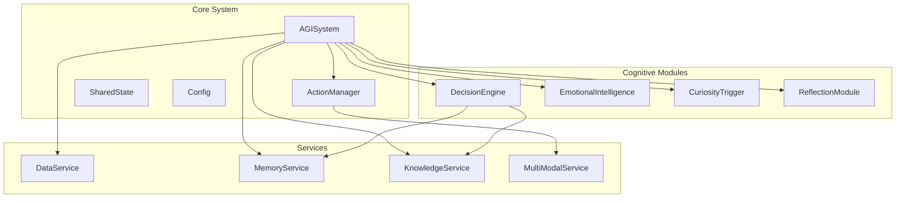
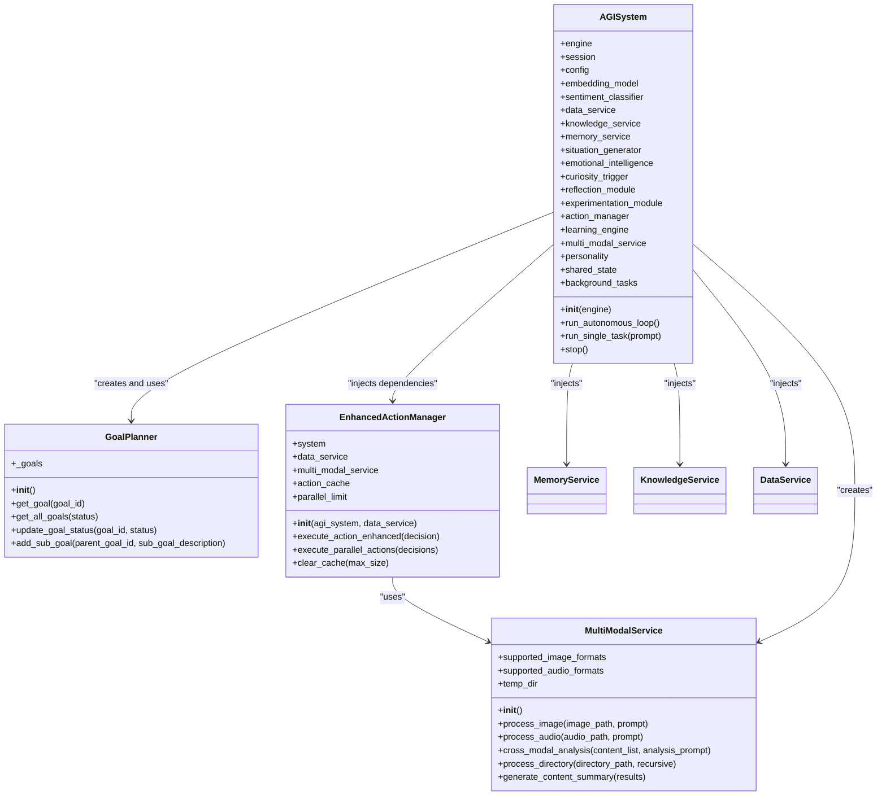
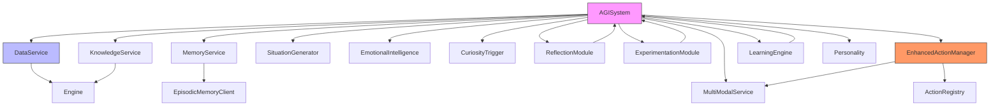

# Dependency Injection in Module Initialization


## Table of Contents
1. [Introduction](#introduction)
2. [Project Structure](#project-structure)
3. [Core Components](#core-components)
4. [Architecture Overview](#architecture-overview)
5. [Detailed Component Analysis](#detailed-component-analysis)
6. [Dependency Analysis](#dependency-analysis)
7. [Performance Considerations](#performance-considerations)
8. [Troubleshooting Guide](#troubleshooting-guide)
9. [Conclusion](#conclusion)

## Introduction
This document provides a comprehensive analysis of the Dependency Injection (DI) pattern as implemented in the Ravana AGI system. The focus is on how core components such as the DecisionEngine's Planner and various system modules receive their dependencies during initialization. The analysis covers constructor-based injection, service initialization patterns, and the benefits of decoupling components from their dependencies. Special attention is given to the asynchronous nature of the system and how DI supports modularity, testability, and runtime flexibility. The document includes code examples, architectural diagrams, and best practices derived from the actual implementation.

## Project Structure
The Ravana AGI project follows a modular architecture with clear separation of concerns. The core system orchestrates various cognitive modules and services, each responsible for specific functionalities. The structure is organized into distinct directories:

- **core/**: Contains foundational components like the AGISystem, configuration, state management, and action managers.
- **modules/**: Houses cognitive modules such as decision_engine, emotional_intelligence, and curiosity_trigger.
- **services/**: Provides data access and external resource interfaces like MemoryService and KnowledgeService.
- **tests/**: Contains unit and integration tests.
- **database/**: Manages database models and engine.

This organization supports dependency injection by clearly defining component boundaries and their interdependencies.



**Diagram sources**
- [core/system.py](file://core/system.py#L34-L624)
- [modules/decision_engine/planner.py](file://modules/decision_engine/planner.py#L38-L209)

**Section sources**
- [core/system.py](file://core/system.py#L0-L625)
- [modules/decision_engine/planner.py](file://modules/decision_engine/planner.py#L0-L221)

## Core Components
The core components of the Ravana AGI system demonstrate a sophisticated use of dependency injection to achieve loose coupling and high cohesion. The AGISystem class serves as the central orchestrator, initializing and injecting dependencies into various modules and services. This approach allows for flexible configuration and easy testing of individual components.

Key components include:
- **AGISystem**: The main orchestrator that initializes all modules and services
- **GoalPlanner**: A component within the decision engine that manages goal creation and tracking
- **EnhancedActionManager**: An action execution system with multi-modal capabilities
- **MultiModalService**: A service for processing image, audio, and cross-modal content

These components receive their dependencies through constructor injection, ensuring that they are not tightly coupled to specific implementations.

**Section sources**
- [core/system.py](file://core/system.py#L34-L624)
- [modules/decision_engine/planner.py](file://modules/decision_engine/planner.py#L38-L209)
- [core/enhanced_action_manager.py](file://core/enhanced_action_manager.py#L20-L267)
- [services/multi_modal_service.py](file://services/multi_modal_service.py#L15-L350)

## Architecture Overview
The Ravana AGI system follows a layered architecture with clear dependency flows from the central AGISystem to specialized modules and services. The architecture emphasizes separation of concerns and dependency inversion, where high-level modules define interfaces that low-level modules implement.

The system initialization process begins with the AGISystem constructor, which creates instances of services and modules while injecting required dependencies. This creates a dependency graph where the AGISystem acts as a composition root, wiring together all components.



**Diagram sources**
- [core/system.py](file://core/system.py#L34-L624)
- [modules/decision_engine/planner.py](file://modules/decision_engine/planner.py#L38-L209)
- [core/enhanced_action_manager.py](file://core/enhanced_action_manager.py#L20-L267)
- [services/multi_modal_service.py](file://services/multi_modal_service.py#L15-L350)

## Detailed Component Analysis

### GoalPlanner Analysis
The GoalPlanner component demonstrates a simple yet effective use of dependency management through shared state rather than direct dependency injection. It manages goals in memory and provides methods for goal manipulation.

The planner uses a global `_goals` dictionary that is shared across instances, which serves as an implicit dependency. This approach avoids the need for explicit injection of a storage service but limits flexibility for different storage backends.

```python
# modules/decision_engine/planner.py
_goals: Dict[str, Dict[str, Any]] = {}

class GoalPlanner:
    def __init__(self):
        """
        A simple in-memory goal planner that manages goals created by plan_from_context.
        """
        logger.info("[Planner] Initialized GoalPlanner.")
        self._goals = _goals  # Use the shared in-memory dictionary
```

The component provides methods for:
- Creating goals from context
- Retrieving goals by ID or status
- Updating goal status
- Adding sub-goals to parent goals

While this implementation is straightforward, it could benefit from explicit dependency injection of a storage service to support different persistence mechanisms.

**Section sources**
- [modules/decision_engine/planner.py](file://modules/decision_engine/planner.py#L38-L209)

### AGISystem Analysis
The AGISystem class is the primary example of dependency injection in the Ravana AGI system. It acts as a composition root, creating and wiring together all components with their required dependencies.

The constructor injects dependencies through direct instantiation and parameter passing:

```python
# core/system.py
class AGISystem:
    def __init__(self, engine):
        # Initialize services with their dependencies
        self.data_service = DataService(
            engine,
            Config.FEED_URLS,
            self.embedding_model,
            self.sentiment_classifier
        )
        self.knowledge_service = KnowledgeService(engine)
        self.memory_service = MemoryService()

        # Initialize modules with dependencies
        self.situation_generator = SituationGenerator(
            embedding_model=self.embedding_model,
            sentiment_classifier=self.sentiment_classifier
        )
        self.reflection_module = ReflectionModule(self)
        self.experimentation_module = ExperimentationModule(self)
        self.experimentation_engine = AGIExperimentationEngine(self)

        # Initialize enhanced action manager with dependencies
        self.action_manager = EnhancedActionManager(self, self.data_service)
        
        # Initialize adaptive learning engine
        self.learning_engine = AdaptiveLearningEngine(self)
```

Key dependency injection patterns observed:
- **Constructor Injection**: Services and modules receive their dependencies through constructor parameters
- **Hierarchical Injection**: The AGISystem injects itself into modules like ReflectionModule, creating a parent-child relationship
- **Service Initialization**: Core services are created with their required dependencies (engine, models, etc.)
- **Shared Instances**: Single instances of services are shared across multiple components

This approach enables:
- Centralized configuration management
- Consistent dependency provisioning
- Easy testing through dependency substitution
- Clear dependency hierarchy

**Section sources**
- [core/system.py](file://core/system.py#L34-L624)

### EnhancedActionManager Analysis
The EnhancedActionManager demonstrates a hybrid approach to dependency injection, combining constructor injection with internal service creation.

```python
# core/enhanced_action_manager.py
class EnhancedActionManager(ActionManager):
    def __init__(self, agi_system, data_service):
        super().__init__(agi_system, data_service)
        self.multi_modal_service = MultiModalService()  # Created internally
        self.action_cache = {}
        self.parallel_limit = 3
        self.register_enhanced_actions()
```

Notable patterns:
- **Mixed Injection Strategy**: Receives `agi_system` and `data_service` through constructor parameters while creating `MultiModalService` internally
- **Dependency Chaining**: Uses injected `system` reference to access other services like `knowledge_service`
- **Action Registration**: Registers action instances with their dependencies during initialization

The component uses the injected dependencies to:
- Execute actions with proper context
- Access the knowledge base for storing analysis results
- Leverage the multi-modal service for specialized processing
- Maintain action execution state

This implementation shows a practical balance between dependency injection and internal component management, though creating `MultiModalService` internally reduces flexibility for testing and configuration.

**Section sources**
- [core/enhanced_action_manager.py](file://core/enhanced_action_manager.py#L20-L267)

### MultiModalService Analysis
The MultiModalService represents a self-contained component with minimal external dependencies, demonstrating a service-oriented design.

```python
# services/multi_modal_service.py
class MultiModalService:
    def __init__(self):
        self.supported_image_formats = {'.jpg', '.jpeg', '.png', '.gif', '.bmp', '.webp'}
        self.supported_audio_formats = {'.mp3', '.wav', '.m4a', '.ogg', '.flac'}
        self.temp_dir = Path(tempfile.gettempdir()) / "agi_multimodal"
        self.temp_dir.mkdir(exist_ok=True)
```

Key characteristics:
- **No External Dependencies**: The service does not require injection of external components, making it highly reusable
- **Internal Configuration**: Manages its own configuration through instance variables
- **Asynchronous Interface**: All methods are async, supporting non-blocking operations
- **Error Handling**: Comprehensive error handling with detailed result objects

The service provides methods for:
- Image processing using external LLM APIs
- Audio analysis through specialized functions
- Cross-modal analysis combining different content types
- Directory processing for batch operations

This design allows the service to be easily injected into other components without introducing complex dependency chains.

**Section sources**
- [services/multi_modal_service.py](file://services/multi_modal_service.py#L15-L350)

## Dependency Analysis
The dependency structure of the Ravana AGI system reveals a well-organized hierarchy with the AGISystem at the center. The dependency graph shows clear patterns of dependency injection and component composition.



**Diagram sources**
- [core/system.py](file://core/system.py#L34-L624)
- [core/enhanced_action_manager.py](file://core/enhanced_action_manager.py#L20-L267)
- [services/multi_modal_service.py](file://services/multi_modal_service.py#L15-L350)

Key dependency patterns:
- **Centralized Composition**: AGISystem acts as the composition root, creating and wiring all components
- **Downward Dependency Flow**: Dependencies flow from the orchestrator to specialized components
- **Cyclic References**: Some modules (ReflectionModule, ExperimentationModule) depend on AGISystem, creating parent-child relationships
- **Service Sharing**: Core services are shared across multiple components to avoid duplication

Benefits of this dependency structure:
- **Testability**: Components can be tested in isolation by substituting dependencies
- **Modularity**: Clear component boundaries with well-defined interfaces
- **Flexibility**: Easy to swap implementations or add new components
- **Maintainability**: Changes to one component have minimal impact on others

Potential improvements:
- **Interface Abstraction**: Define interfaces for services to further decouple components
- **Configuration Injection**: Inject configuration objects rather than accessing static config
- **Dependency Container**: Consider using a DI container for more complex scenarios

## Performance Considerations
The dependency injection implementation in the Ravana AGI system has several performance implications that should be considered:

**Initialization Performance**
- The AGISystem constructor creates all components during initialization, which may impact startup time
- Service instances are created eagerly rather than lazily, consuming memory even if not immediately used
- The use of async operations in service methods helps prevent blocking during initialization

**Runtime Performance**
- The EnhancedActionManager maintains an action cache to avoid redundant executions
- The system uses asyncio for non-blocking operations, improving throughput
- Memory usage is managed through periodic consolidation tasks

**Scalability Considerations**
- The shared in-memory storage in GoalPlanner may become a bottleneck with large numbers of goals
- The current implementation does not support distributed deployment due to in-memory state
- Service instances are not pooled, which could impact performance under high load

Best practices for performance:
- Implement lazy initialization for rarely used components
- Use connection pooling for database services
- Consider implementing a distributed cache for shared state
- Monitor memory usage of long-lived service instances

## Troubleshooting Guide
When working with the dependency injection system in Ravana AGI, several common issues may arise:

**Circular Dependency Issues**
Problem: Modules like ReflectionModule depend on AGISystem, which creates a circular reference.
Solution: Use forward references or interface abstractions to break the cycle.

```python
# Use string annotations for forward references
from typing import TYPE_CHECKING
if TYPE_CHECKING:
    from core.system import AGISystem

class ReflectionModule:
    def __init__(self, system: 'AGISystem'):
        self.system = system
```

**Missing Dependencies**
Problem: A component fails because a required dependency was not injected.
Solution: Ensure all dependencies are provided in the constructor and verify the composition root.

**Service Initialization Errors**
Problem: Services fail to initialize due to missing configuration or external resources.
Solution: Implement proper error handling and fallback mechanisms.

```python
# Example of defensive service initialization
try:
    self.embedding_model = SentenceTransformer(Config.EMBEDDING_MODEL)
except Exception as e:
    logger.error(f"Failed to load embedding model: {e}")
    self.embedding_model = None
```

**Testing Challenges**
Problem: Components are difficult to test due to complex dependency chains.
Solution: Use mocking frameworks and dependency injection for testing.

```python
# Example of testing with mocked dependencies
def test_goal_planner():
    # Mock dependencies
    mock_memory_service = Mock()
    # Test component in isolation
    planner = GoalPlanner(memory_service=mock_memory_service)
```

**Performance Bottlenecks**
Problem: The system experiences slow startup or high memory usage.
Solution: Implement lazy loading and monitor resource usage.

## Conclusion
The Ravana AGI system demonstrates a robust implementation of dependency injection principles, particularly through the AGISystem class which serves as a composition root. The pattern enables loose coupling between components, improves testability, and supports modular architecture.

Key strengths of the current implementation:
- Clear dependency hierarchy with centralized composition
- Effective use of constructor injection for service provisioning
- Good separation of concerns between modules and services
- Support for asynchronous operations throughout the system

Areas for potential improvement:
- Introduce interface abstractions for services to further decouple components
- Implement lazy initialization for better startup performance
- Consider using a dependency injection framework for more complex scenarios
- Enhance configuration management through injected configuration objects

The dependency injection pattern in Ravana AGI successfully supports the system's goals of flexibility, maintainability, and extensibility. By continuing to refine these patterns, the system can evolve to handle increasingly complex cognitive tasks while maintaining architectural integrity.

**Referenced Files in This Document**   
- [modules/decision_engine/planner.py](file://modules/decision_engine/planner.py#L0-L221)
- [core/system.py](file://core/system.py#L0-L625)
- [core/enhanced_action_manager.py](file://core/enhanced_action_manager.py#L0-L269)
- [services/multi_modal_service.py](file://services/multi_modal_service.py#L0-L350)