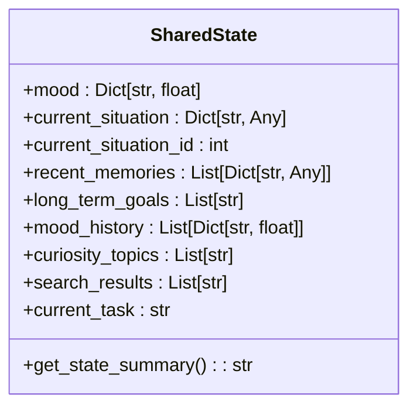
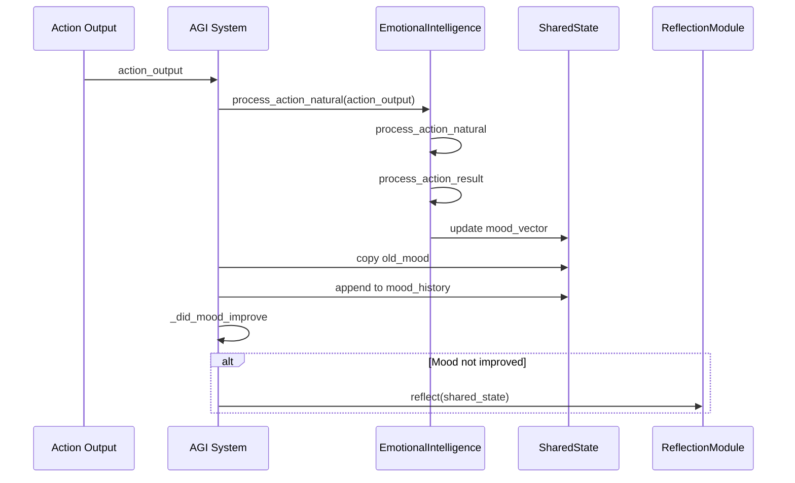
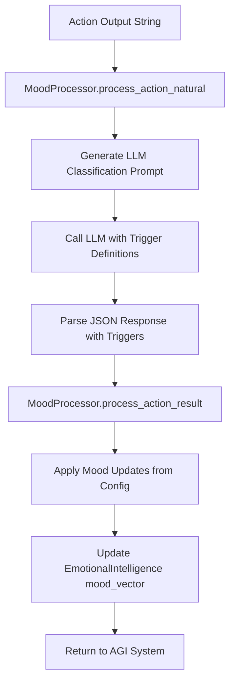
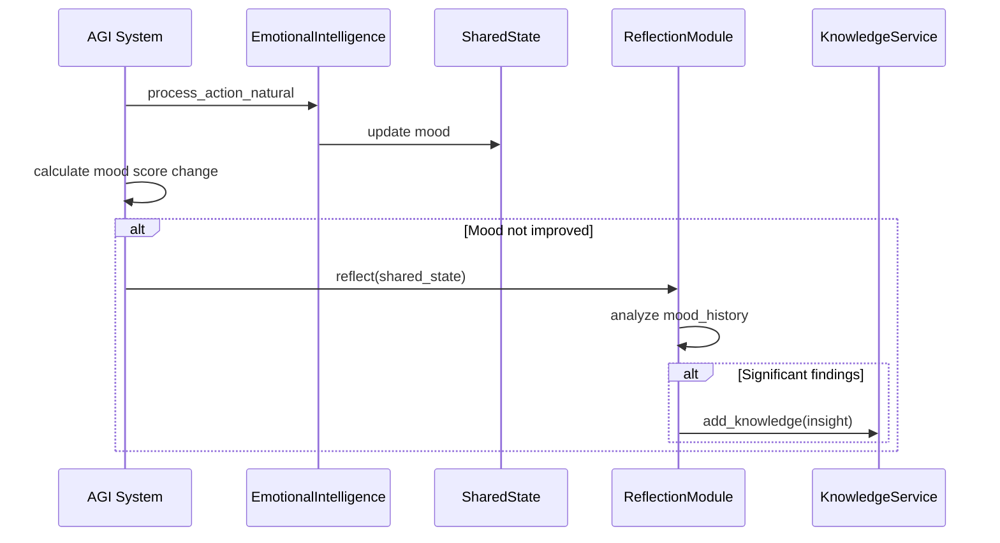
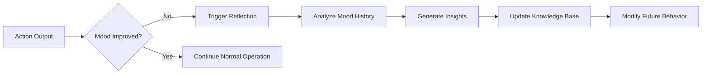

# Observer Pattern for State Monitoring


## Table of Contents
1. [Introduction](#introduction)
2. [State Management Architecture](#state-management-architecture)
3. [Observer Pattern Implementation](#observer-pattern-implementation)
4. [Mood State Change Detection](#mood-state-change-detection)
5. [Reflection Workflow Triggering](#reflection-workflow-triggering)
6. [Asynchronous Event Processing](#asynchronous-event-processing)
7. [Real-World Use Cases](#real-world-use-cases)
8. [Potential Issues and Mitigations](#potential-issues-and-mitigations)
9. [Best Practices](#best-practices)
10. [Conclusion](#conclusion)

## Introduction
The Observer pattern in the RAVANA system enables state monitoring across the AGI architecture, particularly for mood and system state changes that trigger downstream processes like self-reflection. Unlike traditional observer implementations with explicit observer registration, this system uses a procedural notification model where state changes are detected and processed through a chain of method calls. The pattern is implemented through the interaction of the SharedState, EmotionalIntelligence, and ReflectionModule components, creating a responsive system that adapts to internal state changes.

**Section sources**
- [core/state.py](file://core/state.py#L2-L29)
- [core/system.py](file://core/system.py#L370-L420)

## State Management Architecture
The state management system centers around the SharedState class, which encapsulates the core state of the AGI system. This class maintains various state components including mood, current situation, recent memories, long-term goals, and mood history.

```python
class SharedState:
    def __init__(self, initial_mood: Dict[str, float]):
        self.mood: Dict[str, float] = initial_mood
        self.current_situation: Dict[str, Any] = None
        self.current_situation_id: int = None
        self.recent_memories: List[Dict[str, Any]] = []
        self.long_term_goals: List[str] = []
        self.mood_history: List[Dict[str, float]] = []
        self.curiosity_topics: List[str] = []
        self.search_results: List[str] = []
        self.current_task: str = None
```

The SharedState class serves as the central repository for the AGI's internal state, with the mood attribute being particularly important for triggering downstream processes. The mood_history attribute maintains a record of previous mood states, enabling temporal analysis of emotional patterns.



**Diagram sources**
- [core/state.py](file://core/state.py#L2-L29)

**Section sources**
- [core/state.py](file://core/state.py#L2-L29)

## Observer Pattern Implementation
The Observer pattern is implemented through a procedural notification chain rather than a traditional observer registry. When state changes occur, particularly to the mood state, they trigger a cascade of method calls that serve the same purpose as observer notifications.

The implementation follows a publish-subscribe model where:
- The EmotionalIntelligence component acts as the publisher, detecting and processing mood changes
- The ReflectionModule acts as the subscriber, responding to significant state changes
- The AGI system core orchestrates the notification flow

The pattern is realized through the _update_mood_and_reflect method in the AGI system, which processes mood changes and conditionally triggers reflection:

```python
async def _update_mood_and_reflect(self, action_output: Any):
    old_mood = self.shared_state.mood.copy()
    self.emotional_intelligence.process_action_natural(str(action_output))
    self.shared_state.mood = self.emotional_intelligence.get_mood_vector()
    new_mood = self.shared_state.mood
    self.shared_state.mood_history.append(self.shared_state.mood)
    
    mood_changed_for_better = self._did_mood_improve(old_mood, new_mood)
    
    if not mood_changed_for_better and random.random() < Config.REFLECTION_CHANCE:
        self.reflection_module.reflect(self.shared_state)
```

This implementation demonstrates a lightweight observer pattern that avoids the complexity of maintaining an observer registry while still providing the core functionality of change notification.



**Diagram sources**
- [core/system.py](file://core/system.py#L370-L420)
- [modules/emotional_intellegence/emotional_intellegence.py](file://modules/emotional_intellegence/emotional_intellegence.py#L8-L66)

**Section sources**
- [core/system.py](file://core/system.py#L370-L420)

## Mood State Change Detection
Mood state changes are detected through a multi-layered processing pipeline that begins with natural language analysis of action outputs and ends with quantitative mood vector updates.

The detection process involves three key components:
1. **EmotionalIntelligence**: The main interface for mood processing
2. **MoodProcessor**: The core logic for analyzing action outputs and determining mood changes
3. **LLM Integration**: Natural language understanding for nuanced mood assessment

The MoodProcessor class analyzes action outputs by classifying them against predefined triggers:

```python
def process_action_natural(self, action_output: str):
    definitions = self.ei.config["triggers"]
    
    prompt = f"""
You are an AI analysis system. Your task is to classify an AI agent's action output based on predefined triggers.
Analyze the action output below and respond with only a valid JSON object mapping each trigger to a boolean value.
Be nuanced: an action can trigger multiple categories.
...
"""
    
    llm_response = call_llm(prompt)
    triggers = json.loads(llm_response)
    self.process_action_result(triggers)
```

This approach leverages the LLM's natural language understanding capabilities to detect subtle emotional cues in action outputs, providing a more sophisticated alternative to simple keyword matching.



**Diagram sources**
- [modules/emotional_intellegence/mood_processor.py](file://modules/emotional_intellegence/mood_processor.py#L8-L103)

**Section sources**
- [modules/emotional_intellegence/mood_processor.py](file://modules/emotional_intellegence/mood_processor.py#L8-L103)

## Reflection Workflow Triggering
The reflection workflow is triggered based on the analysis of mood state changes, specifically when the mood does not improve after an action. This creates a feedback loop that encourages self-improvement when performance is suboptimal.

The triggering logic is implemented in the _update_mood_and_reflect method:

```python
mood_changed_for_better = self._did_mood_improve(old_mood, new_mood)
        
if not mood_changed_for_better and random.random() < Config.REFLECTION_CHANCE:
    logger.info("Mood has not improved. Initiating reflection.")
    self.reflection_module.reflect(self.shared_state)
```

The _did_mood_improve method calculates a mood score by weighing positive and negative moods:

```python
def _did_mood_improve(self, old_mood: Dict[str, float], new_mood: Dict[str, float]) -> bool:
    old_score = sum(old_mood.get(m, 0) for m in Config.POSITIVE_MOODS) - sum(old_mood.get(m, 0) for m in Config.NEGATIVE_MOODS)
    new_score = sum(new_mood.get(m, 0) for m in Config.POSITIVE_MOODS) - sum(new_mood.get(m, 0) for m in Config.NEGATIVE_MOODS)
    return new_score > old_score
```

The ReflectionModule provides two reflection methods:
1. **reflect_on_experiment**: Analyzes experiment results and generates insights
2. **reflect**: General reflection based on mood history and system state

```python
def reflect(self, shared_state: SharedState):
    logger.info("Performing general reflection...")
    if len(shared_state.mood_history) > 10:
        logger.info("Sufficient mood history for reflection.")
        # In a real implementation, this would do a more detailed analysis.
```

This implementation ensures that reflection occurs only when sufficient historical data is available, preventing premature self-analysis.



**Diagram sources**
- [core/system.py](file://core/system.py#L370-L420)
- [modules/reflection_module.py](file://modules/reflection_module.py#L25-L45)

**Section sources**
- [core/system.py](file://core/system.py#L370-L420)
- [modules/reflection_module.py](file://modules/reflection_module.py#L25-L45)

## Asynchronous Event Processing
The observer pattern implementation is fully integrated with the asynchronous nature of the AGI loop, ensuring that state monitoring and notification do not block the main execution thread.

The entire AGI system operates within an asynchronous event loop:

```python
async def run_autonomous_loop(self):
    while not self._shutdown.is_set():
        try:
            if self.experimentation_engine.active_experiment:
                await self.experimentation_engine.run_experiment_step()
            else:
                await self.run_iteration()
            await asyncio.sleep(Config.LOOP_SLEEP_DURATION)
        except Exception as e:
            logger.critical(f"Critical error in autonomous loop: {e}", exc_info=True)
            await asyncio.sleep(Config.LOOP_SLEEP_DURATION * 5)
```

Each iteration of the loop includes state monitoring and potential reflection:

```python
async def run_iteration(self):
    # ... decision making and action execution
    action_output = await self._execute_and_memorize(situation_prompt, decision)
    # Update mood and reflect
    await self._update_mood_and_reflect(action_output)
```

Background tasks are also managed asynchronously:

```python
self.background_tasks.append(asyncio.create_task(self.data_collection_task()))
self.background_tasks.append(asyncio.create_task(self.event_detection_task()))
self.background_tasks.append(asyncio.create_task(self.knowledge_compression_task()))
self.background_tasks.append(asyncio.create_task(self.memory_consolidation_task()))
```

This asynchronous design ensures that state monitoring and observer notifications are non-blocking and integrated seamlessly with the main AGI loop.

```mermaid
sequenceDiagram
participant Loop as Autonomous Loop
participant Iteration as run_iteration
participant Mood as _update_mood_and_reflect
participant Reflection as ReflectionModule
participant Sleep as asyncio.sleep
loop Loop
Loop->>Iteration : await run_iteration()
Iteration->>Mood : await _update_mood_and_reflect()
alt Mood not improved
Mood->>Reflection : reflect(shared_state)
Reflection->>Reflection : process reflection
end
Mood->>Iteration : return
Iteration->>Sleep : await asyncio.sleep()
Sleep->>Loop : continue
end loop
```

**Diagram sources**
- [core/system.py](file://core/system.py#L370-L420)

**Section sources**
- [core/system.py](file://core/system.py#L370-L420)

## Real-World Use Cases
The observer pattern implementation supports several real-world use cases that demonstrate its value in the AGI system.

### Mood Shifts Triggering Reflection Workflows
When the AGI completes actions that do not improve its mood state, the system automatically initiates self-reflection. For example:

```python
# After processing action output
if not mood_changed_for_better and random.random() < Config.REFLECTION_CHANCE:
    self.reflection_module.reflect(self.shared_state)
```

This creates a self-improvement feedback loop where suboptimal performance triggers introspection and potential behavioral adjustments.

### Memory Logging Based on State Changes
Mood changes are automatically logged to persistent storage:

```python
# Log the mood
await asyncio.to_thread(self.data_service.save_mood_log, new_mood)
```

This enables long-term analysis of emotional patterns and their correlation with system performance.

### Persona-Based Behavior Modification
The emotional state influences behavior through persona-based modifiers:

```python
self.behavior_modifiers = self.emotional_intelligence.influence_behavior()
if self.behavior_modifiers:
    logger.info(f"Generated behavior modifiers for next loop: {self.behavior_modifiers}")
```

Different personas (e.g., Optimistic, Pessimistic) apply different multipliers to mood changes, creating distinct behavioral profiles.

### Experiment-Driven Reflection
Action outputs can contain directives to initiate experiments, which then trigger specialized reflection:

```python
if isinstance(action_output, dict) and 'action' in action_output:
    if action_output['action'] == 'initiate_experiment':
        self.experimentation_engine.start_experiment(action_output)
```

This creates a scientific method workflow where hypotheses are tested and reflected upon.



**Diagram sources**
- [core/system.py](file://core/system.py#L370-L420)
- [modules/reflection_module.py](file://modules/reflection_module.py#L25-L45)

**Section sources**
- [core/system.py](file://core/system.py#L370-L420)
- [modules/reflection_module.py](file://modules/reflection_module.py#L25-L45)

## Potential Issues and Mitigations
While the observer pattern implementation is effective, it has several potential issues that require mitigation strategies.

### Observer Memory Leaks
Since observers are not explicitly registered, memory leaks are less likely. However, the mood_history accumulation could grow indefinitely:

```python
self.shared_state.mood_history.append(self.shared_state.mood)
```

**Mitigation**: Implement a sliding window or periodic pruning of old mood history entries.

### Circular Dependencies
The EmotionalIntelligence and MoodProcessor classes have a circular reference:

```python
class EmotionalIntelligence:
    def __init__(...):
        self.mood_processor = MoodProcessor(self)  # Passes self to MoodProcessor
```

**Mitigation**: This is acceptable in this case as it's a parent-child relationship rather than a true circular dependency between peers.

### Race Conditions
Asynchronous processing could lead to race conditions when multiple components access shared state:

**Mitigation**: The current implementation processes state changes sequentially within the main loop, minimizing race condition risks. For future parallel processing, implement proper locking mechanisms.

### LLM Dependency Failures
The mood processing relies heavily on LLM calls for trigger classification:

```python
llm_response = call_llm(prompt)
```

**Mitigation**: Implement robust error handling and fallback mechanisms, as seen in the regex fallback for JSON parsing:

```python
json_match = re.search(r'\{.*\}', llm_response, re.DOTALL)
```

### Performance Bottlenecks
LLM calls for mood processing could block the main thread:

**Mitigation**: The implementation already uses proper async patterns, but could further optimize by batching LLM requests or implementing caching.

**Section sources**
- [modules/emotional_intellegence/emotional_intellegence.py](file://modules/emotional_intellegence/emotional_intellegence.py#L8-L66)
- [modules/emotional_intellegence/mood_processor.py](file://modules/emotional_intellegence/mood_processor.py#L8-L103)

## Best Practices
Based on the analysis of the observer pattern implementation, several best practices emerge for implementing new observers and ensuring efficient event propagation.

### Implementing New Observers
When adding new observer functionality:

1. **Follow the existing pattern**: Integrate with the _update_mood_and_reflect method rather than creating a separate observer registry
2. **Use configuration-driven triggers**: Define new triggers in the emotional intelligence configuration
3. **Leverage LLM for nuanced detection**: Use natural language processing for complex state change detection

### Ensuring Efficient Event Propagation
To maintain performance:

1. **Keep processing lightweight**: Perform minimal computation in the main notification path
2. **Use asynchronous operations**: Offload heavy processing to background tasks
3. **Implement rate limiting**: Prevent excessive reflection or logging
4. **Batch operations when possible**: Combine multiple state changes into single notifications

### Avoiding Common Pitfalls
1. **Don't block the main thread**: Ensure all observer handlers are non-blocking
2. **Handle errors gracefully**: Implement comprehensive error handling, especially for LLM dependencies
3. **Monitor resource usage**: Track memory consumption of state history collections
4. **Test edge cases**: Verify behavior with empty or malformed inputs

### Example: Adding a New Mood-Based Observer
```python
# In system.py, extend _update_mood_and_reflect
async def _update_mood_and_reflect(self, action_output: Any):
    # ... existing mood update code ...
    
    # New observer: Curiosity trigger based on mood
    if self.shared_state.mood.get('Curious', 0) > 0.8:
        await self._trigger_curiosity_protocol()
    
    # New observer: Memory consolidation when calm
    if (self.shared_state.mood.get('Calm', 0) > 0.7 and 
        self.shared_state.mood.get('Stressed', 0) < 0.2):
        await self._consolidate_memories()
```

**Section sources**
- [core/system.py](file://core/system.py#L370-L420)
- [modules/emotional_intellegence/mood_processor.py](file://modules/emotional_intellegence/mood_processor.py#L8-L103)

## Conclusion
The observer pattern implementation in the RAVANA system provides an effective mechanism for monitoring state changes, particularly mood and system state updates that trigger downstream processes like self-reflection. While it deviates from traditional observer pattern implementations by using a procedural notification model rather than an explicit observer registry, it achieves the same core functionality with less complexity.

The pattern is deeply integrated with the AGI's main loop, ensuring that state monitoring and notification occur asynchronously without blocking the main thread. Mood changes are detected through a sophisticated pipeline that leverages LLM-based natural language understanding, enabling nuanced emotional assessment.

Key strengths of the implementation include:
- Tight integration with the asynchronous AGI loop
- Sophisticated mood change detection using LLMs
- Configuration-driven trigger system
- Automatic reflection workflows for self-improvement

Potential improvements could include:
- Implementing a formal observer registry for better extensibility
- Adding more sophisticated memory management for state history
- Enhancing error handling for LLM dependencies
- Providing better tools for monitoring observer performance

Overall, the implementation demonstrates a practical approach to state monitoring in an AGI system, balancing complexity with functionality to create a responsive and adaptive architecture.

**Referenced Files in This Document**   
- [core/state.py](file://core/state.py#L2-L29)
- [core/system.py](file://core/system.py#L370-L420)
- [modules/emotional_intellegence/emotional_intellegence.py](file://modules/emotional_intellegence/emotional_intellegence.py#L8-L66)
- [modules/emotional_intellegence/mood_processor.py](file://modules/emotional_intellegence/mood_processor.py#L8-L103)
- [modules/reflection_module.py](file://modules/reflection_module.py#L25-L45)
- [modules/agent_self_reflection/main.py](file://modules/agent_self_reflection/main.py#L1-L51)