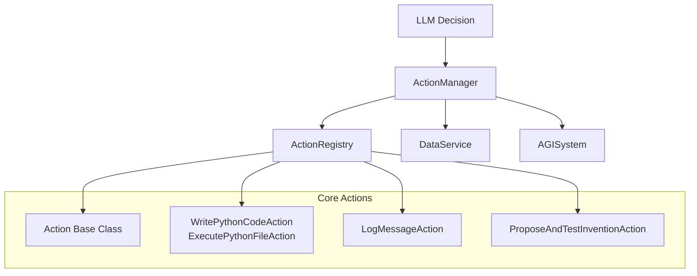
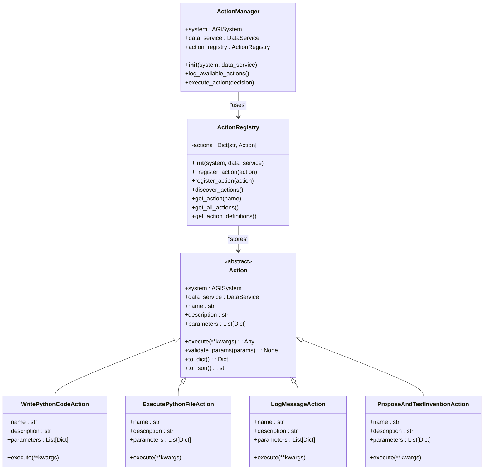
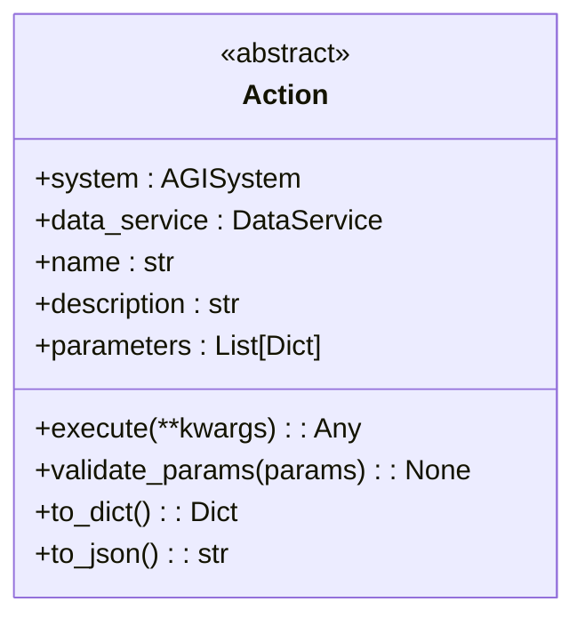
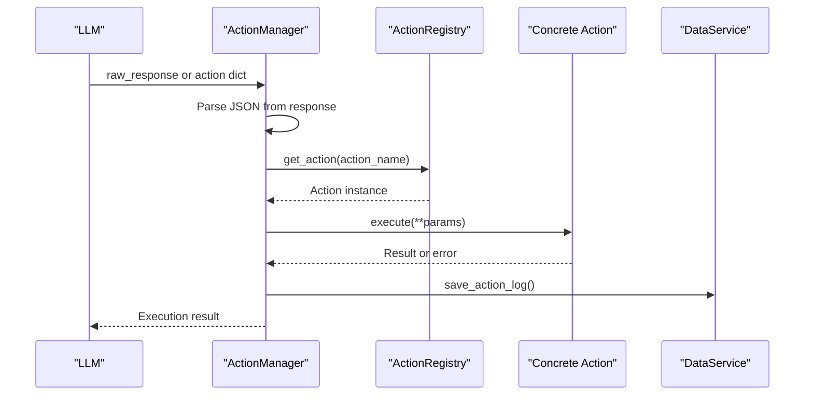
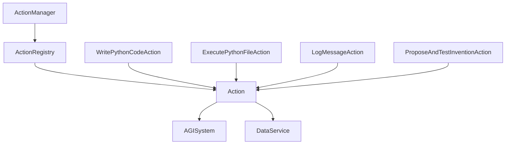

# Registry Pattern for Actions


## Table of Contents
1. [Introduction](#introduction)
2. [Project Structure](#project-structure)
3. [Core Components](#core-components)
4. [Architecture Overview](#architecture-overview)
5. [Detailed Component Analysis](#detailed-component-analysis)
6. [Dependency Analysis](#dependency-analysis)
7. [Performance Considerations](#performance-considerations)
8. [Troubleshooting Guide](#troubleshooting-guide)
9. [Conclusion](#conclusion)

## Introduction
This document provides a comprehensive analysis of the **Action Registry Pattern** implemented in the RAVANA system. The pattern enables dynamic discovery, registration, and execution of modular actions that extend the AGI's capabilities. The core of this system is the `ActionRegistry`, which manages a collection of `Action` subclasses, allowing for runtime registration, lookup, and invocation. This design supports extensibility, decoupling, and safe error handling, making it ideal for an adaptive AI system. The `ActionManager` orchestrates the execution of actions based on decisions from the LLM, using the registry as a central catalog.

## Project Structure
The action system is organized within the `core/actions` directory, which contains modular files for different types of actions. The base `Action` class defines the interface, while specific implementations (e.g., coding, I/O, experimental) are separated into dedicated files. The `registry.py` file manages the registration and discovery of these actions, and the `action_manager.py` file handles the execution workflow. This structure promotes modularity and ease of extension.



**Diagram sources**
- [core/actions/action.py](file://core/actions/action.py#L1-L62)
- [core/actions/registry.py](file://core/actions/registry.py#L1-L74)
- [core/action_manager.py](file://core/action_manager.py#L1-L126)

**Section sources**
- [core/actions/action.py](file://core/actions/action.py#L1-L62)
- [core/actions/registry.py](file://core/actions/registry.py#L1-L74)
- [core/action_manager.py](file://core/action_manager.py#L1-L126)

## Core Components
The system's core components include the `Action` base class, the `ActionRegistry` for managing action instances, and the `ActionManager` for executing actions. The `Action` class enforces a consistent interface via abstract properties and methods. The `ActionRegistry` provides a centralized store for all available actions, supporting both explicit registration and automatic discovery. The `ActionManager` acts as the orchestrator, parsing LLM decisions, validating parameters, and executing actions through the registry.

**Section sources**
- [core/actions/action.py](file://core/actions/action.py#L1-L62)
- [core/actions/registry.py](file://core/actions/registry.py#L1-L74)
- [core/action_manager.py](file://core/action_manager.py#L1-L126)

## Architecture Overview
The architecture follows a modular, layered design. At the base is the `Action` interface, which all concrete actions must implement. The `ActionRegistry` sits above this, acting as a factory and catalog for action instances. It is initialized with a set of predefined actions and can discover new ones dynamically. The `ActionManager` uses the registry to execute actions based on LLM-generated decisions. Error handling and logging are integrated at each level, ensuring robustness and traceability.



**Diagram sources**
- [core/actions/action.py](file://core/actions/action.py#L1-L62)
- [core/actions/registry.py](file://core/actions/registry.py#L1-L74)
- [core/action_manager.py](file://core/action_manager.py#L1-L126)

## Detailed Component Analysis

### Action Base Class
The `Action` class is an abstract base class that defines the contract for all actions. It requires subclasses to implement `name`, `description`, `parameters`, and `execute`. It also provides utility methods like `validate_params` to ensure input correctness and `to_dict`/`to_json` for serialization. This ensures consistency across all actions.



**Diagram sources**
- [core/actions/action.py](file://core/actions/action.py#L1-L62)

**Section sources**
- [core/actions/action.py](file://core/actions/action.py#L1-L62)

### ActionRegistry Implementation
The `ActionRegistry` is responsible for managing action instances. It initializes with a set of predefined actions (e.g., `WritePythonCodeAction`, `LogMessageAction`) and provides methods for manual and automatic registration. The `discover_actions` method uses Python's `pkgutil` and `importlib` to dynamically load all subclasses of `Action` from the `core/actions` package, enabling modular expansion without code changes.

```python
def discover_actions(self):
    actions_package = core.actions
    for _, name, is_pkg in pkgutil.walk_packages(actions_package.__path__, actions_package.__name__ + '.'):
        if not is_pkg:
            module = importlib.import_module(name)
            for _, obj in inspect.getmembers(module):
                if inspect.isclass(obj) and issubclass(obj, Action) and obj is not Action:
                    try:
                        instance = obj()
                        if instance.name in self.actions:
                            logger.warning(f"Action '{instance.name}' is already registered. Overwriting.")
                        self.actions[instance.name] = instance
                    except Exception as e:
                        logger.error(f"Failed to instantiate action {obj.__name__}: {e}", exc_info=True)
```

**Section sources**
- [core/actions/registry.py](file://core/actions/registry.py#L1-L74)

### ActionManager Workflow
The `ActionManager` orchestrates action execution. It receives a decision (either a raw LLM response or a structured dictionary), parses the JSON, validates the action name and parameters, retrieves the action from the registry, and executes it. It handles errors gracefully, logs outcomes, and ensures all actions are recorded in the database.



**Diagram sources**
- [core/action_manager.py](file://core/action_manager.py#L1-L126)

**Section sources**
- [core/action_manager.py](file://core/action_manager.py#L1-L126)

### Concrete Action Examples
#### WritePythonCodeAction
This action generates Python code based on a hypothesis and test plan, writes it to a file, and returns the code. It uses the LLM to generate the code and includes error handling for file operations.

#### ExecutePythonFileAction
This action executes a Python script and captures its output. It uses `asyncio.create_subprocess_shell` to run the script and returns the stdout, stderr, and return code.

#### LogMessageAction
A simple I/O action that logs a message at a specified level. It demonstrates the basic structure of an action with optional parameters.

#### ProposeAndTestInventionAction
A complex action that submits a novel idea to the experimentation engine. It formats the idea as a hypothesis, runs it through the `agi_experimentation_engine`, and logs the results.

**Section sources**
- [core/actions/coding.py](file://core/actions/coding.py#L1-L114)
- [core/actions/io.py](file://core/actions/io.py#L1-L39)
- [core/actions/experimental.py](file://core/actions/experimental.py#L1-L129)

## Dependency Analysis
The system has a clear dependency hierarchy. The `ActionManager` depends on `ActionRegistry`, which in turn depends on all concrete `Action` subclasses. The `Action` base class depends on `AGISystem` and `DataService` for context and persistence. There are no circular dependencies, and the use of `TYPE_CHECKING` imports prevents runtime circular references.



**Diagram sources**
- [core/action_manager.py](file://core/action_manager.py#L1-L126)
- [core/actions/registry.py](file://core/actions/registry.py#L1-L74)
- [core/actions/action.py](file://core/actions/action.py#L1-L62)

## Performance Considerations
The `ActionRegistry` uses a dictionary for O(1) action lookup by name, ensuring fast retrieval. The `discover_actions` method is called once at startup, minimizing runtime overhead. However, dynamic module loading and class instantiation could introduce latency if the number of actions grows significantly. Caching the discovered actions or using a pre-compiled list could improve startup performance. The use of `asyncio.to_thread` for database operations prevents blocking the event loop.

## Troubleshooting Guide
Common issues include:
- **Duplicate action names**: The registry overwrites existing actions with a warning. Ensure unique names.
- **Missing required parameters**: The `validate_params` method raises `InvalidActionParams`. Check the `parameters` list in the action definition.
- **LLM response parsing errors**: If the LLM response lacks valid JSON, execution fails. Ensure the prompt enforces JSON output.
- **Action instantiation failures**: Errors during `__init__` prevent registration. Check dependencies and constructor logic.

**Section sources**
- [core/actions/registry.py](file://core/actions/registry.py#L1-L74)
- [core/action_manager.py](file://core/action_manager.py#L1-L126)
- [core/actions/action.py](file://core/actions/action.py#L1-L62)

## Conclusion
The Action Registry pattern in RAVANA provides a robust, extensible framework for dynamic action management. By combining a clear interface, automatic discovery, and centralized execution, it enables the AGI to safely and efficiently expand its capabilities. The design emphasizes modularity, error resilience, and observability, making it well-suited for complex, adaptive systems.

**Referenced Files in This Document**   
- [core/actions/registry.py](file://core/actions/registry.py#L1-L74)
- [core/action_manager.py](file://core/action_manager.py#L1-L126)
- [core/actions/action.py](file://core/actions/action.py#L1-L62)
- [core/actions/coding.py](file://core/actions/coding.py#L1-L114)
- [core/actions/io.py](file://core/actions/io.py#L1-L39)
- [core/actions/experimental.py](file://core/actions/experimental.py#L1-L129)