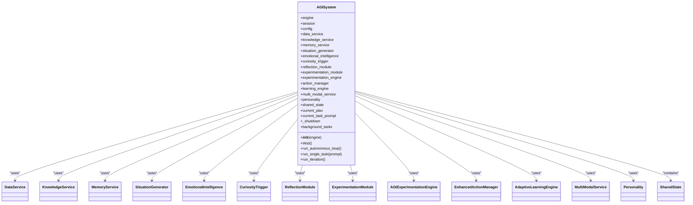
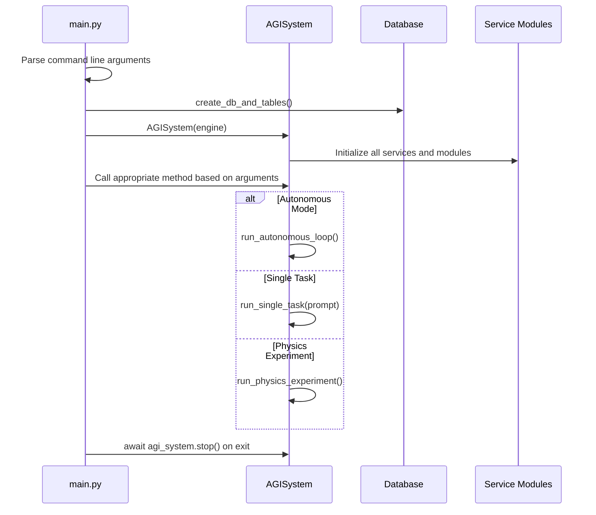
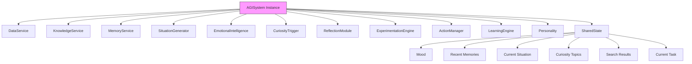
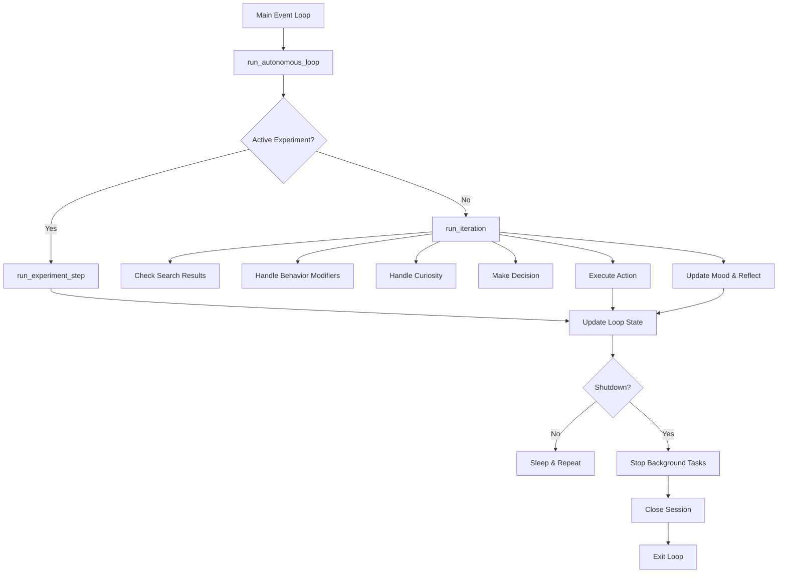

# Singleton Pattern Implementation


## Table of Contents
1. [Introduction](#introduction)
2. [Singleton Pattern Analysis](#singleton-pattern-analysis)
3. [Technical Implementation](#technical-implementation)
4. [Instantiation and Access Patterns](#instantiation-and-access-patterns)
5. [Integration with System Components](#integration-with-system-components)
6. [Thread Safety and Asynchronous Execution](#thread-safety-and-asynchronous-execution)
7. [Testing Considerations](#testing-considerations)
8. [Best Practices for Extension](#best-practices-for-extension)
9. [Conclusion](#conclusion)

## Introduction
The AGISystem class serves as the central orchestrator of the Ravana AGI framework, managing the autonomous loop, state, and integration between various modules and services. While the system requires a single instance to maintain consistent state across the application lifecycle, the implementation does not use a traditional singleton pattern. Instead, it relies on application-level instantiation control to ensure a single instance exists throughout the system's operation.

## Singleton Pattern Analysis

The AGISystem class does not implement a classical singleton pattern using `__new__` or module-level instance control. Instead, the singleton behavior is enforced through architectural design and application flow. The system ensures a single instance by:

1. Centralizing instantiation in the main application entry point
2. Not providing any mechanism for multiple instances to coexist
3. Maintaining global state within the instance that would conflict if duplicated

This approach provides the benefits of a singleton (single state management, centralized control) without the rigid constraints of a formal singleton implementation, allowing for greater flexibility in testing and development.

**Section sources**
- [core/system.py](file://core/system.py#L34-L624)
- [main.py](file://main.py#L120-L150)

## Technical Implementation

The AGISystem class is implemented as a standard Python class without explicit singleton enforcement mechanisms. The class initialization in `__init__` sets up all core components of the AGI system:

```python
class AGISystem:
    def __init__(self, engine):
        logger.info("Initializing Ravana AGI System...")
        
        self.engine = engine
        self.session = Session(engine)
        self.config = Config()
        
        # Initialize services
        self.data_service = DataService(
            engine,
            Config.FEED_URLS,
            self.embedding_model,
            self.sentiment_classifier
        )
        self.knowledge_service = KnowledgeService(engine)
        self.memory_service = MemoryService()

        # Initialize modules
        self.situation_generator = SituationGenerator(
            embedding_model=self.embedding_model,
            sentiment_classifier=self.sentiment_classifier
        )
        self.emotional_intelligence = EmotionalIntelligence()
        self.curiosity_trigger = CuriosityTrigger()
        self.reflection_module = ReflectionModule(self)
        self.experimentation_module = ExperimentationModule(self)
        self.experimentation_engine = AGIExperimentationEngine(self)

        # Initialize enhanced action manager
        self.action_manager = EnhancedActionManager(self, self.data_service)
        
        # Initialize adaptive learning engine
        self.learning_engine = AdaptiveLearningEngine(self)
        
        # Initialize multi-modal service
        self.multi_modal_service = MultiModalService()

        # Initialize personality
        self.personality = Personality(
            name=Config.PERSONA_NAME,
            origin=Config.PERSONA_ORIGIN,
            creativity=Config.PERSONA_CREATIVITY
        )

        # Shared state
        self.shared_state = SharedState(
            initial_mood=self.emotional_intelligence.get_mood_vector()
        )
```

The class initializes all dependent services and modules, creating a comprehensive ecosystem within a single instance. The shared state is particularly critical, as it maintains the AGI's mood, memories, and current situation, which would become inconsistent if multiple instances existed.



**Diagram sources**
- [core/system.py](file://core/system.py#L34-L624)

**Section sources**
- [core/system.py](file://core/system.py#L34-L624)

## Instantiation and Access Patterns

The AGISystem instance is created in the main application entry point (`main.py`) and passed through the application flow:

```python
# In main.py
def main():
    # Create database and tables
    create_db_and_tables()

    # Initialize the AGI system
    agi_system = AGISystem(engine)
    
    try:
        if args.physics_experiment:
            await run_physics_experiment(agi_system, args.physics_experiment)
        elif args.discovery_mode:
            await run_discovery_mode(agi_system)
        elif args.test_experiments:
            await run_experiment_tests(agi_system)
        elif args.prompt:
            await agi_system.run_single_task(args.prompt)
        else:
            await agi_system.run_autonomous_loop()
    finally:
        await agi_system.stop()
```

This pattern ensures that only one instance is created per application run. The instance is then used throughout the application's lifecycle, with all functionality accessed through this single reference.

In test scenarios, the pattern is preserved:

```python
# In test_system.py
@pytest.fixture
def agi_system(mock_engine):
    return AGISystem(mock_engine)
```

The testing framework creates a single instance per test fixture, maintaining isolation between tests while preserving the singleton-like behavior within each test context.



**Diagram sources**
- [main.py](file://main.py#L120-L150)
- [core/system.py](file://core/system.py#L34-L624)

**Section sources**
- [main.py](file://main.py#L120-L150)
- [tests/test_system.py](file://tests/test_system.py#L15-L20)

## Integration with System Components

The single AGISystem instance serves as the central integration point for all system components. It maintains references to all major modules and services, enabling coordinated operation:

### Service Integration
The AGISystem initializes and maintains references to key services:
- **DataService**: Handles data collection from RSS feeds and event detection
- **KnowledgeService**: Manages the knowledge base and compression
- **MemoryService**: Handles memory extraction, storage, and consolidation

### Module Integration
The system integrates with cognitive modules that provide specialized functionality:
- **SituationGenerator**: Creates situations for the AGI to respond to
- **EmotionalIntelligence**: Manages the AGI's mood and emotional state
- **CuriosityTrigger**: Generates curiosity topics and exploration
- **ReflectionModule**: Handles self-reflection processes
- **ExperimentationModule/Engine**: Manages experimentation workflows

### State Management
The shared state is a critical aspect of the singleton pattern implementation:

```python
class SharedState:
    def __init__(self, initial_mood: Dict[str, float]):
        self.mood: Dict[str, float] = initial_mood
        self.current_situation: Dict[str, Any] = None
        self.current_situation_id: int = None
        self.recent_memories: List[Dict[str, Any]] = []
        self.long_term_goals: List[str] = []
        self.mood_history: List[Dict[str, float]] = []
        self.curiosity_topics: List[str] = []
        self.search_results: List[str] = []
        self.current_task: str = None
```

This shared state is accessible to all components through the single AGISystem instance, ensuring consistency across the system.



**Diagram sources**
- [core/system.py](file://core/system.py#L34-L624)
- [core/state.py](file://core/state.py#L1-L29)

**Section sources**
- [core/system.py](file://core/system.py#L34-L624)

## Thread Safety and Asynchronous Execution

The AGISystem implementation is designed for asynchronous execution in a single-threaded event loop, which mitigates many thread safety concerns:

### Asynchronous Design
The system uses asyncio throughout, with all major methods defined as coroutines:

```python
async def run_autonomous_loop(self):
    """The main autonomous loop of the AGI."""
    logger.info("Starting autonomous loop...")
    
    # Start background tasks
    self.background_tasks.append(asyncio.create_task(self.data_collection_task()))
    self.background_tasks.append(asyncio.create_task(self.event_detection_task()))
    self.background_tasks.append(asyncio.create_task(self.knowledge_compression_task()))
    self.background_tasks.append(asyncio.create_task(self.memory_consolidation_task()))

    while not self._shutdown.is_set():
        try:
            if self.experimentation_engine.active_experiment:
                await self.experimentation_engine.run_experiment_step()
            else:
                await self.run_iteration()
            
            logger.info(f"End of loop iteration. Sleeping for {Config.LOOP_SLEEP_DURATION} seconds.")
            await asyncio.sleep(Config.LOOP_SLEEP_DURATION)
        except Exception as e:
            logger.critical(f"Critical error in autonomous loop: {e}", exc_info=True)
            await asyncio.sleep(Config.LOOP_SLEEP_DURATION * 5)
```

### State Management
The system uses asyncio primitives for state management:

```python
# For graceful shutdown
self._shutdown = asyncio.Event()
self.background_tasks = []
```

The `_shutdown` event provides thread-safe signaling for graceful termination.

### Shared State Access
While the system doesn't use explicit locks for state access, the single-threaded nature of the asyncio event loop ensures that state modifications occur sequentially. When interfacing with synchronous code (like database operations), the system uses `run_in_executor`:

```python
loop = asyncio.get_running_loop()
result = await loop.run_in_executor(
    None,
    lambda: self.session.exec(stmt).all()
)
```

This approach prevents blocking the event loop while maintaining data consistency.



**Diagram sources**
- [core/system.py](file://core/system.py#L34-L624)

**Section sources**
- [core/system.py](file://core/system.py#L34-L624)

## Testing Considerations

The singleton-like implementation presents specific challenges for testing, which are addressed through the test architecture:

### Test Isolation
Each test creates its own AGISystem instance, ensuring isolation:

```python
@pytest.fixture
def agi_system(mock_engine):
    return AGISystem(mock_engine)
```

This approach allows tests to modify the system state without affecting other tests.

### Mocking Strategy
The tests use extensive mocking to isolate components:

```python
# Mock the background tasks so they don't run forever
agi_system.data_collection_task = AsyncMock()
agi_system.event_detection_task = AsyncMock()
agi_system.knowledge_compression_task = AsyncMock()
agi_system.memory_consolidation_task = AsyncMock()
    
# Mock the main loop components to avoid external dependencies
agi_system.situation_generator.generate_situation = AsyncMock(return_value={"prompt": "test situation"})
agi_system.memory_service.get_relevant_memories = AsyncMock(return_value=MagicMock(relevant_memories=[]))
```

### Enhanced System Testing
The comprehensive test suite validates the integrated system:

```python
async def test_enhanced_system():
    # Create database
    create_db_and_tables()
    
    # Initialize enhanced AGI system
    agi_system = AGISystem(engine)
    
    # Test all components
    await test_knowledge_service(agi_system)
    await test_curiosity_system(agi_system)
    await test_decision_making(agi_system)
    await test_learning_engine(agi_system)
    await test_action_manager(agi_system)
    
    # Test integration
    await agi_system.run_single_task(test_task)
    
    # Cleanup
    await agi_system.stop()
```

This testing approach validates both individual components and their integration within the single system instance.

**Section sources**
- [tests/test_system.py](file://tests/test_system.py#L15-L20)
- [tests/test_enhanced_agi_system.py](file://tests/test_enhanced_agi_system.py#L25-L30)

## Best Practices for Extension

When extending the AGISystem with new functionality, several best practices should be followed to maintain system integrity:

### Module Integration
New modules should follow the existing pattern of initialization in `__init__`:

```python
# In AGISystem.__init__
self.new_module = NewModule(self, dependency1, dependency2)
```

The module should accept the AGISystem instance to access shared state and services.

### State Management
New state should be added to the SharedState class or as direct attributes of AGISystem:

```python
# Option 1: Add to SharedState
self.shared_state.new_feature_data = initial_value

# Option 2: Direct attribute
self.new_feature_tracker = {}
```

### Asynchronous Methods
All new methods that perform I/O or may block should be implemented as coroutines:

```python
async def new_functionality(self, param):
    # Perform async operations
    result = await some_async_operation(param)
    return result
```

### Error Handling
Comprehensive error handling should be implemented:

```python
async def new_functionality(self, param):
    try:
        # Critical operations
        result = await some_async_operation(param)
        return result
    except SpecificException as e:
        logger.warning(f"Specific issue in new functionality: {e}")
        return default_value
    except Exception as e:
        logger.error(f"Unexpected error in new functionality: {e}", exc_info=True)
        raise
```

### Configuration
New features should use configuration parameters:

```python
# In config.py
NEW_FEATURE_ENABLED = bool(os.environ.get("NEW_FEATURE_ENABLED", True))
NEW_FEATURE_TIMEOUT = int(os.environ.get("NEW_FEATURE_TIMEOUT", 30))

# In AGISystem
if self.config.NEW_FEATURE_ENABLED:
    await self._run_new_feature()
```

These practices ensure that extensions maintain the stability and integrity of the single AGISystem instance.

**Section sources**
- [core/system.py](file://core/system.py#L34-L624)
- [core/config.py](file://core/config.py#L1-L42)

## Conclusion
The AGISystem implementation achieves singleton-like behavior through architectural design rather than formal singleton pattern implementation. By centralizing instantiation in the main application entry point and ensuring a single instance manages all state and coordination, the system prevents the state conflicts that would arise from multiple instances.

This approach provides several advantages:
- **Testability**: Easy to create isolated instances for testing
- **Flexibility**: No rigid singleton constraints that complicate testing
- **Clarity**: Explicit instantiation makes the system architecture clear
- **Maintainability**: Standard class implementation is familiar to developers

The single instance pattern is essential for maintaining consistent state across the AGI system, particularly for shared state elements like mood, memories, and current tasks. The asynchronous design ensures thread safety within the single-threaded event loop, while proper error handling and shutdown procedures maintain system integrity throughout its lifecycle.

When extending the system, developers should follow the established patterns for module integration, state management, and asynchronous execution to preserve the integrity of the single AGISystem instance.

**Referenced Files in This Document**   
- [core/system.py](file://core/system.py#L34-L624)
- [main.py](file://main.py#L120-L150)
- [tests/test_system.py](file://tests/test_system.py#L15-L20)
- [tests/test_enhanced_agi_system.py](file://tests/test_enhanced_agi_system.py#L25-L30)
- [core/config.py](file://core/config.py#L1-L42)