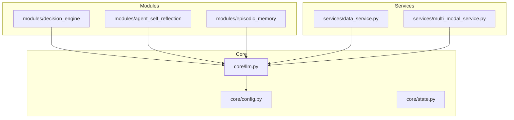
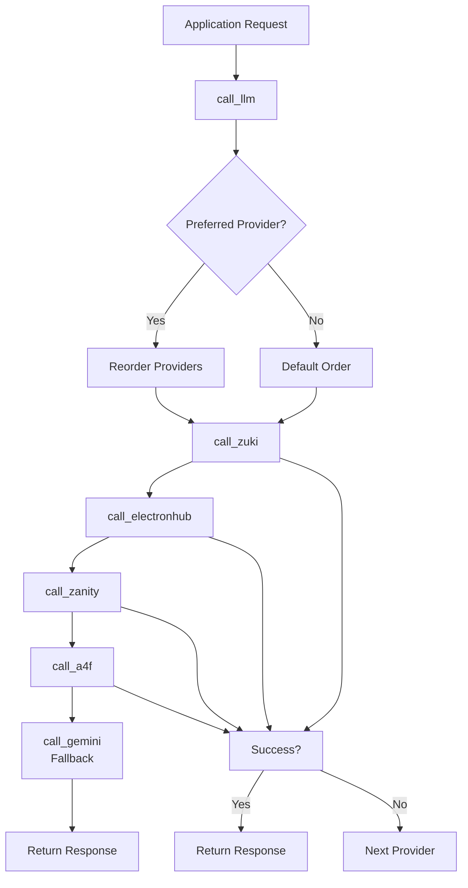
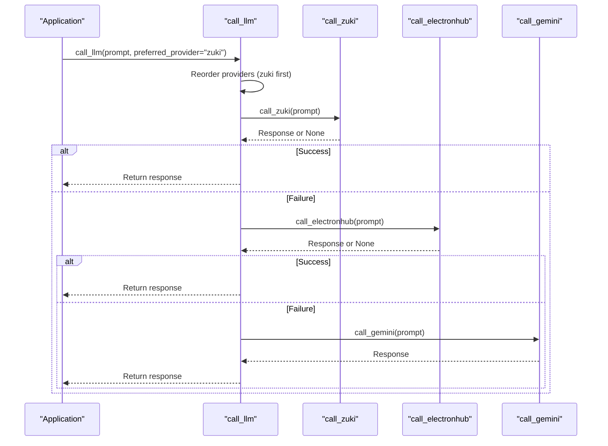
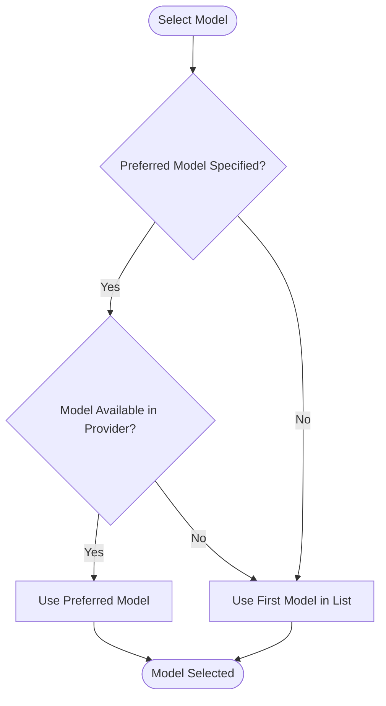

# Strategy Pattern for LLM Provider Selection


## Table of Contents
1. [Introduction](#introduction)
2. [Project Structure](#project-structure)
3. [Core Components](#core-components)
4. [Architecture Overview](#architecture-overview)
5. [Detailed Component Analysis](#detailed-component-analysis)
6. [Provider Configuration and Model Selection](#provider-configuration-and-model-selection)
7. [Fallback and Resilience Mechanisms](#fallback-and-resilience-mechanisms)
8. [Error Handling and Recovery](#error-handling-and-recovery)
9. [Extending the Strategy: Adding New Providers](#extending-the-strategy-adding-new-providers)
10. [Conclusion](#conclusion)

## Introduction
This document provides a comprehensive analysis of the Strategy pattern implementation for LLM provider selection in the RAVANA system. The architecture enables flexible switching between multiple LLM backends—Zuki, ElectronHub, Zanity, A4F, and Gemini—through a consistent interface while incorporating robust fallback mechanisms. The design abstracts provider-specific logic, allowing seamless integration and failover. This documentation details the implementation in `core/llm.py`, covering provider functions, configuration management, model selection, error handling, retry logic, and extensibility.

## Project Structure
The project follows a modular structure with clear separation of concerns. The LLM provider logic is centralized in the `core` directory, specifically within `core/llm.py`, which houses all provider-specific functions and the strategy orchestration logic. Configuration is managed via `core/config.py` and environment variables, while provider definitions are statically declared in `llm.py`. The system integrates with various modules such as `decision_engine`, `agent_self_reflection`, and `information_processing`, which consume the LLM services through the unified interface.



**Diagram sources**
- [core/llm.py](file://core/llm.py#L1)
- [core/config.py](file://core/config.py#L1)

**Section sources**
- [core/llm.py](file://core/llm.py#L1)
- [core/config.py](file://core/config.py#L1)

## Core Components
The core of the LLM provider strategy lies in `core/llm.py`, which implements a functional strategy pattern. Instead of using class-based inheritance, the system employs standalone functions for each provider (e.g., `call_zuki`, `call_electronhub`), which are treated as interchangeable strategies. The main orchestrator, `call_llm`, dynamically selects and invokes these functions based on availability and preference. This functional approach simplifies the interface and avoids unnecessary object instantiation.

The strategy abstraction is maintained through a uniform function signature: each provider function accepts a `prompt` and optional `model` parameter, returning a string response. This consistency allows the system to treat all providers identically, regardless of their underlying API differences. The `safe_call_llm` wrapper further standardizes behavior by adding retry, timeout, and error handling across all providers.

**Section sources**
- [core/llm.py](file://core/llm.py#L125)

## Architecture Overview
The LLM provider selection architecture follows a layered approach with clear separation between strategy implementation, orchestration, and resilience. At the base are the provider-specific functions, each encapsulating the API call logic for a particular LLM backend. Above this, the `call_llm` function implements the primary strategy selection logic, attempting providers in sequence with optional preference ordering. The top layer consists of resilience mechanisms, including retry logic (`safe_call_llm`) and async execution support.

The system uses a configuration-driven model where provider details (name, API key, base URL, available models) are defined in a global `PROVIDERS` list. This allows dynamic model selection based on availability and task requirements. For advanced use cases, specialized functions like `call_gemini_with_search` or `call_gemini_with_function_calling` extend the basic strategy to support enhanced capabilities.



**Diagram sources**
- [core/llm.py](file://core/llm.py#L294)

## Detailed Component Analysis

### Provider Functions and Strategy Implementation
The strategy pattern is implemented through a series of independent provider functions, each representing a concrete strategy. These functions abstract the API-specific details of their respective LLM backends while presenting a uniform interface to the rest of the system.

```python
def call_zuki(prompt, model=None):
    # Strategy for Zuki provider
    ...

def call_electronhub(prompt, model=None):
    # Strategy for ElectronHub provider
    ...

def call_zanity(prompt, model=None):
    # Strategy for Zanity provider
    ...

def call_a4f(prompt):
    # Strategy for A4F provider
    ...
```

Each function handles its own API key retrieval, endpoint configuration, and response parsing. The use of environment variables with fallback defaults (e.g., `os.getenv("ZUKIJOURNEY_API_KEY", "zu-...")`) ensures the system remains operational even when configuration is incomplete.

#### Strategy Selection Flow
The `call_llm` function implements the strategy selection logic, allowing for both ordered attempts and preferred provider prioritization.



**Diagram sources**
- [core/llm.py](file://core/llm.py#L294)

**Section sources**
- [core/llm.py](file://core/llm.py#L125)

### Reflection and Task-Based Strategy Selection
The system uses specific LLM strategies based on task complexity and functional requirements. In the `modules/agent_self_reflection` and `modules/decision_engine`, the `call_llm` function is used to process reflection prompts and make decisions. For complex reasoning tasks requiring external knowledge, the system can route to `call_gemini_with_search`, which leverages Google's search integration.

The decision engine uses a structured JSON response format, where the LLM returns an action plan. The `extract_decision` function processes these responses, handling parsing errors gracefully and providing fallback actions when JSON decoding fails.

```python
def extract_decision(raw_response: str) -> dict:
    """
    Returns a dict with keys: analysis, plan, action, params, raw_response
    """
    if not raw_response:
        return {"raw_response": "", "error": "Empty response"}
    
    block = _extract_json_block(raw_response)
    try:
        data = json.loads(block)
    except json.JSONDecodeError as je:
        logger.error("JSON decode error, returning raw_response only: %s", je)
        return {
            "raw_response": raw_response,
            "error": f"JSON decode error: {je}",
            "analysis": "Failed to parse decision",
            "plan": [],
            "action": "log_message",
            "params": {"message": f"Failed to parse decision: {raw_response[:200]}..."}
        }
```

This approach allows the system to adapt its strategy based on the expected output format and task complexity, using simpler providers for basic tasks and reserving Gemini's advanced features for complex, search-dependent queries.

**Section sources**
- [core/llm.py](file://core/llm.py#L81)
- [modules/decision_engine/decision_maker.py](file://modules/decision_engine/decision_maker.py#L110)

## Provider Configuration and Model Selection
LLM providers are configured through a global `PROVIDERS` list in `core/llm.py`, which defines each provider's name, API key, base URL, and available models. The configuration uses environment variables with hardcoded fallbacks for development purposes.

```python
PROVIDERS = [
    {
        "name": "a4f",
        "api_key": os.getenv("A4F_API_KEY", "ddc-a4f-..."),
        "base_url": "https://api.a4f.co/v1",
        "models": ["provider-3/gemini-2.0-flash", "provider-2/llama-4-scout"]
    },
    {
        "name": "zukijourney",
        "api_key": os.getenv("ZUKIJOURNEY_API_KEY", "zu-ab9fba..."),
        "base_url": "https://api.zukijourney.com/v1",
        "models": ["gpt-4o:online", "gpt-4o", "deepseek-chat"]
    },
    # ... other providers
]
```

Model selection occurs in two stages: first, the provider strategy is selected; then, a specific model is chosen from the provider's available models. The `send_chat_message` function demonstrates this process, preferring a specified model if available, otherwise falling back to the first model in the provider's list.



**Diagram sources**
- [core/llm.py](file://core/llm.py#L330)

**Section sources**
- [core/llm.py](file://core/llm.py#L330)

## Fallback and Resilience Mechanisms
The system implements a multi-layered resilience strategy to ensure reliable LLM access. The primary mechanism is the ordered provider fallback in `call_llm`, which attempts providers sequentially and uses Gemini as a final fallback.

```python
def call_llm(prompt, preferred_provider=None, model=None):
    """
    Try all providers in order, fallback to Gemini if all fail.
    """
    providers = [
        (call_zuki, 'zuki'),
        (call_electronhub, 'electronhub'),
        (call_zanity, 'zanity'),
        (call_a4f, 'a4f'),
    ]
    if preferred_provider:
        providers = sorted(providers, key=lambda x: x[1] != preferred_provider)
    for func, name in providers:
        result = func(prompt, model) if name != 'a4f' else func(prompt)
        if result:
            return result
    # Fallback to Gemini
    return call_gemini(prompt)
```

This approach ensures high availability by leveraging multiple provider backends. The optional `preferred_provider` parameter allows task-specific optimization, such as using Zuki for online reasoning or ElectronHub for high-accuracy tasks.

Additionally, the `send_chat_message` function implements a random provider selection strategy, distributing load across available providers and reducing the risk of rate limiting on any single service.

## Error Handling and Recovery
The system employs comprehensive error handling at multiple levels to maintain reliability under varying network conditions and provider failures.

### Retry and Timeout Management
The `safe_call_llm` function wraps all LLM calls with retry logic and timeout handling, implementing exponential backoff to avoid overwhelming failing services.

```python
def safe_call_llm(prompt: str, timeout: int = 30, retries: int = 3, backoff_factor: float = 0.5, **kwargs) -> str:
    """
    Wrap a single LLM call with retry/backoff and timeout.
    """
    last_exc = None
    for attempt in range(1, retries + 1):
        try:
            result = call_llm(prompt, **kwargs)
            if not result or result.strip() == "":
                raise RuntimeError("Empty response from LLM")
            return result
        except Exception as e:
            last_exc = e
            wait = backoff_factor * (2 ** (attempt - 1))
            logger.warning(f"LLM call failed (attempt {attempt}/{retries}): {e!r}, retrying in {wait:.1f}s")
            time.sleep(wait)
    
    logger.error(f"LLM call permanently failed after {retries} attempts: {last_exc!r}")
    return f"[LLM Error: {last_exc}]"
```

The default configuration (3 retries with 0.5s backoff factor) provides a balance between responsiveness and resilience. The async version, `async_safe_call_llm`, allows non-blocking execution in event-driven contexts.

### Provider-Specific Error Handling
Individual provider functions include targeted error handling. For example, the `send_chat_message` function includes a specific check for Zanity's 404 errors, providing actionable logging to aid debugging:

```python
except Exception as e:
    logging.error(f"Failed to send message via {provider['name']} using model {model_to_use}: {e}")
    if provider['name'] == 'zanity' and "404" in str(e).lower():
        logging.warning(f"Zanity API at {provider['base_url']} might be unavailable (404 error). Check URL.")
    return None
```

This granular error handling enables the system to respond appropriately to different failure modes, from network issues to API deprecation.

**Section sources**
- [core/llm.py](file://core/llm.py#L48)

## Extending the Strategy: Adding New Providers
Adding new LLM providers to the system follows a straightforward process that maintains the strategy pattern's integrity.

### Steps to Add a New Provider:
1. **Implement the Provider Function**: Create a new function (e.g., `call_newprovider`) with the same signature as existing providers.
2. **Add to Configuration**: Include the provider in the `PROVIDERS` list with its API key, base URL, and available models.
3. **Register in Strategy**: Add the function to the providers list in `call_llm`.
4. **Test Integration**: Use `test_all_providers()` to verify the new provider works correctly.

Example of adding a hypothetical "NovaAI" provider:

```python
def call_novaai(prompt, model=None):
    """Strategy for NovaAI provider."""
    api_key = os.getenv("NOVA_API_KEY")
    client = OpenAI(api_key=api_key, base_url="https://api.novaai.dev/v1")
    model_to_use = model or "nova-2.0-pro"
    try:
        completion = client.chat.completions.create(
            model=model_to_use,
            messages=[{"role": "user", "content": prompt}]
        )
        return completion.choices[0].message.content
    except Exception as e:
        logging.error(f"NovaAI call failed: {e}")
        return None

# In call_llm providers list:
providers = [
    (call_zuki, 'zuki'),
    # ... existing providers
    (call_novaai, 'novaai'),  # Add new provider
]
```

The modular design ensures that new providers can be integrated without modifying existing code, adhering to the Open/Closed Principle. Testing facilities like `test_all_providers()` provide immediate feedback on integration success.

**Section sources**
- [core/llm.py](file://core/llm.py#L294)

## Conclusion
The Strategy pattern implementation for LLM provider selection in RAVANA demonstrates a robust, flexible architecture for managing multiple AI backends. By using functional strategies with a consistent interface, the system achieves provider interchangeability while maintaining simplicity. The layered resilience approach—combining ordered fallback, retry logic, and timeout handling—ensures reliable operation across varying network conditions. Configuration-driven provider management and clear extension points make the system adaptable to new LLM services. This design effectively balances flexibility, reliability, and maintainability, providing a solid foundation for an AGI system that can leverage diverse AI capabilities.

**Referenced Files in This Document**   
- [core/llm.py](file://core/llm.py#L1)
- [core/config.py](file://core/config.py)
- [tests/test_system_simple.py](file://tests/test_system_simple.py#L36)