# System Architecture Overview

## Update Summary
**Changes Made**   
- Added comprehensive documentation for the enhanced Snake Agent architecture
- Updated the architecture overview to include threading, multiprocessing, and IPC components
- Added new section for Enhanced Snake Agent with detailed component analysis
- Updated dependency analysis to include new Snake Agent components
- Added performance considerations specific to the enhanced Snake Agent
- Updated troubleshooting guide with Snake Agent-specific issues

## Table of Contents
1. [Introduction](#introduction)
2. [Project Structure](#project-structure)
3. [Core Components](#core-components)
4. [Architecture Overview](#architecture-overview)
5. [Detailed Component Analysis](#detailed-component-analysis)
6. [Enhanced Snake Agent](#enhanced-snake-agent)
7. [Dependency Analysis](#dependency-analysis)
8. [Performance Considerations](#performance-considerations)
9. [Troubleshooting Guide](#troubleshooting-guide)
10. [Conclusion](#conclusion)

## Introduction
The RAVANA system is an advanced Artificial General Intelligence (AGI) framework designed for autonomous reasoning, learning, and multi-modal interaction. This document provides a comprehensive architectural overview of the system, detailing its modular design, component interactions, and operational flow. The system is built around a central orchestrator (AGISystem) that manages state, initializes modules, and coordinates execution through an event-driven autonomous loop. The architecture emphasizes separation of concerns, with distinct layers for core logic, modular functionality, services, and data persistence. This update specifically documents the enhanced Snake Agent architecture with threading, multiprocessing, and inter-process communication capabilities.

## Project Structure

```mermaid
graph TD
A[RAVANA Root] --> B[core]
A --> C[database]
A --> D[modules]
A --> E[services]
A --> F[tests]
A --> G[main.py]
B --> B1[actions]
B --> B2[action_manager.py]
B --> B3[config.py]
B --> B4[llm.py]
B --> B5[state.py]
B --> B6[system.py]
B --> B7[snake_agent_enhanced.py]
B --> B8[snake_data_models.py]
B --> B9[snake_log_manager.py]
B --> B10[snake_threading_manager.py]
B --> B11[snake_process_manager.py]
B --> B12[snake_file_monitor.py]
C --> C1[engine.py]
C --> C2[models.py]
D --> D1[adaptive_learning]
D --> D2[agent_self_reflection]
D --> D3[curiosity_trigger]
D --> D4[decision_engine]
D --> D5[emotional_intellegence]
D --> D6[episodic_memory]
D --> D7[event_detection]
D --> D8[information_processing]
D --> D9[knowledge_compression]
D --> D10[personality]
D --> D11[situation_generator]
E --> E1[data_service.py]
E --> E2[knowledge_service.py]
E --> E3[memory_service.py]
E --> E4[multi_modal_service.py]
```

**Diagram sources**
- [main.py](file://c:\Users\ASUS\Documents\GitHub\RAVANA\main.py)
- [core/system.py](file://c:\Users\ASUS\Documents\GitHub\RAVANA\core\system.py)

**Section sources**
- [main.py](file://c:\Users\ASUS\Documents\GitHub\RAVANA\main.py)
- [core/system.py](file://c:\Users\ASUS\Documents\GitHub\RAVANA\core\system.py)

## Core Components

The RAVANA system is built on a modular, component-based architecture with clear separation between core, modules, services, and database layers. The system follows a singleton pattern with the AGISystem class serving as the central orchestrator. This update introduces the Enhanced Snake Agent, which extends the core functionality with advanced threading, multiprocessing, and inter-process communication capabilities for improved performance and scalability.

**Section sources**
- [core/system.py](file://c:\Users\ASUS\Documents\GitHub\RAVANA\core\system.py)
- [core/enhanced_action_manager.py](file://c:\Users\ASUS\Documents\GitHub\RAVANA\core\enhanced_action_manager.py)
- [services/data_service.py](file://c:\Users\ASUS\Documents\GitHub\RAVANA\services\data_service.py)
- [core/snake_agent_enhanced.py](file://c:\Users\ASUS\Documents\GitHub\RAVANA\core\snake_agent_enhanced.py) - *Updated in recent commit*

## Architecture Overview

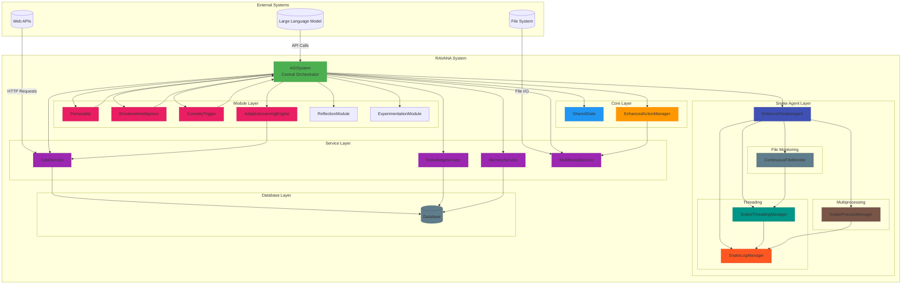
```mermaid
graph TB
subgraph "External Systems"
LLM[(Large Language Model)]
FileSystem[(File System)]
WebAPIs[(Web APIs)]
end
subgraph "RAVANA System"
AGI[AGISystem<br>Central Orchestrator]
subgraph "Core Layer"
State[SharedState]
ActionManager[EnhancedActionManager]
end
subgraph "Service Layer"
DataService[DataService]
KnowledgeService[KnowledgeService]
MemoryService[MemoryService]
MultiModalService[MultiModalService]
end
subgraph "Module Layer"
Personality[Personality]
EmotionalIntelligence[EmotionalIntelligence]
CuriosityTrigger[CuriosityTrigger]
AdaptiveLearning[AdaptiveLearningEngine]
Reflection[ReflectionModule]
Experimentation[ExperimentationModule]
end
subgraph "Snake Agent Layer"
SnakeAgent[EnhancedSnakeAgent]
subgraph "Threading"
ThreadingManager[SnakeThreadingManager]
LogManager[SnakeLogManager]
end
subgraph "Multiprocessing"
ProcessManager[SnakeProcessManager]
end
subgraph "File Monitoring"
FileMonitor[ContinuousFileMonitor]
end
end
subgraph "Database Layer"
DB[(Database)]
end
end
LLM --> |API Calls| AGI
FileSystem --> |File I/O| MultiModalService
WebAPIs --> |HTTP Requests| DataService
AGI --> State
AGI --> ActionManager
AGI --> DataService
AGI --> KnowledgeService
AGI --> MemoryService
AGI --> MultiModalService
AGI --> Personality
AGI --> EmotionalIntelligence
AGI --> CuriosityTrigger
AGI --> AdaptiveLearning
AGI --> Reflection
AGI --> Experimentation
AGI --> SnakeAgent
SnakeAgent --> ThreadingManager
SnakeAgent --> ProcessManager
SnakeAgent --> FileMonitor
SnakeAgent --> LogManager
ThreadingManager --> LogManager
ProcessManager --> LogManager
FileMonitor --> ThreadingManager
DataService --> DB
KnowledgeService --> DB
MemoryService --> DB
ActionManager --> MultiModalService
AdaptiveLearning --> DataService
Personality --> AGI
EmotionalIntelligence --> AGI
CuriosityTrigger --> AGI
style AGI fill:#4CAF50,stroke:#388E3C
style State fill:#2196F3,stroke:#1976D2
style ActionManager fill:#FF9800,stroke:#F57C00
style DataService fill:#9C27B0,stroke:#7B1FA2
style KnowledgeService fill:#9C27B0,stroke:#7B1FA2
style MemoryService fill:#9C27B0,stroke:#7B1FA2
style MultiModalService fill:#9C27B0,stroke:#7B1FA2
style Personality fill:#E91E63,stroke:#C2185B
style EmotionalIntelligence fill:#E91E63,stroke:#C2185B
style CuriosityTrigger fill:#E91E63,stroke:#C2185B
style AdaptiveLearning fill:#E91E63,stroke:#C2185B
style SnakeAgent fill:#3F51B5,stroke:#303F9F
style ThreadingManager fill:#009688,stroke:#00796B
style ProcessManager fill:#795548,stroke:#5D4037
style FileMonitor fill:#607D8B,stroke:#455A64
style LogManager fill:#FF5722,stroke:#D84315
style DB fill:#607D8B,stroke:#455A64
```

**Diagram sources**
- [core/system.py](file://c:\Users\ASUS\Documents\GitHub\RAVANA\core\system.py)
- [core/snake_agent_enhanced.py](file://c:\Users\ASUS\Documents\GitHub\RAVANA\core\snake_agent_enhanced.py)
- [core/snake_threading_manager.py](file://c:\Users\ASUS\Documents\GitHub\RAVANA\core\snake_threading_manager.py)
- [core/snake_process_manager.py](file://c:\Users\ASUS\Documents\GitHub\RAVANA\core\snake_process_manager.py)
- [core/snake_file_monitor.py](file://c:\Users\ASUS\Documents\GitHub\RAVANA\core\snake_file_monitor.py)
- [core/snake_log_manager.py](file://c:\Users\ASUS\Documents\GitHub\RAVANA\core\snake_log_manager.py)

## Detailed Component Analysis

### AGISystem Analysis
The AGISystem class serves as the central singleton orchestrator that manages state, initializes modules, and coordinates execution flow. It acts as the brain of the RAVANA system, integrating all components and services. With the recent enhancement, it now supports the Enhanced Snake Agent which provides advanced threading, multiprocessing, and inter-process communication capabilities.

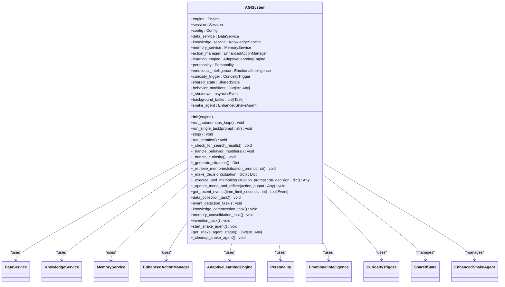
```mermaid
classDiagram
class AGISystem {
+engine : Engine
+session : Session
+config : Config
+data_service : DataService
+knowledge_service : KnowledgeService
+memory_service : MemoryService
+action_manager : EnhancedActionManager
+learning_engine : AdaptiveLearningEngine
+personality : Personality
+emotional_intelligence : EmotionalIntelligence
+curiosity_trigger : CuriosityTrigger
+shared_state : SharedState
+behavior_modifiers : Dict[str, Any]
+_shutdown : asyncio.Event
+background_tasks : List[Task]
+snake_agent : EnhancedSnakeAgent
+__init__(engine)
+run_autonomous_loop() void
+run_single_task(prompt : str) void
+stop() void
+run_iteration() void
+_check_for_search_results() void
+_handle_behavior_modifiers() void
+_handle_curiosity() void
+_generate_situation() Dict
+_retrieve_memories(situation_prompt : str) void
+_make_decision(situation : dict) Dict
+_execute_and_memorize(situation_prompt : str, decision : dict) Any
+_update_mood_and_reflect(action_output : Any) void
+get_recent_events(time_limit_seconds : int) List[Event]
+data_collection_task() void
+event_detection_task() void
+knowledge_compression_task() void
+memory_consolidation_task() void
+invention_task() void
+start_snake_agent() void
+get_snake_agent_status() Dict[str, Any]
+_cleanup_snake_agent() void
}
AGISystem --> DataService : "uses"
AGISystem --> KnowledgeService : "uses"
AGISystem --> MemoryService : "uses"
AGISystem --> EnhancedActionManager : "uses"
AGISystem --> AdaptiveLearningEngine : "uses"
AGISystem --> Personality : "uses"
AGISystem --> EmotionalIntelligence : "uses"
AGISystem --> CuriosityTrigger : "uses"
AGISystem --> SharedState : "manages"
AGISystem --> EnhancedSnakeAgent : "manages"
```

**Diagram sources**
- [core/system.py](file://c:\Users\ASUS\Documents\GitHub\RAVANA\core\system.py#L41-L796)

**Section sources**
- [core/system.py](file://c:\Users\ASUS\Documents\GitHub\RAVANA\core\system.py#L41-L796)

### Action Management Analysis
The action management system handles the execution of various tasks and operations within the RAVANA framework. The EnhancedActionManager extends the base ActionManager with multi-modal capabilities and enhanced error handling.

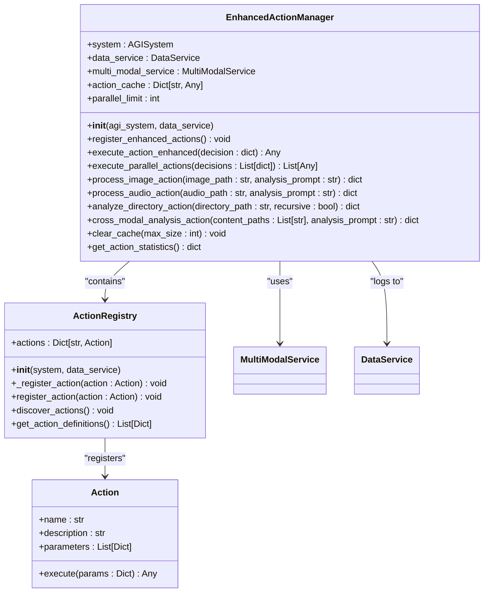
```mermaid
classDiagram
class EnhancedActionManager {
+system : AGISystem
+data_service : DataService
+multi_modal_service : MultiModalService
+action_cache : Dict[str, Any]
+parallel_limit : int
+__init__(agi_system, data_service)
+register_enhanced_actions() void
+execute_action_enhanced(decision : dict) Any
+execute_parallel_actions(decisions : List[dict]) List[Any]
+process_image_action(image_path : str, analysis_prompt : str) dict
+process_audio_action(audio_path : str, analysis_prompt : str) dict
+analyze_directory_action(directory_path : str, recursive : bool) dict
+cross_modal_analysis_action(content_paths : List[str], analysis_prompt : str) dict
+clear_cache(max_size : int) void
+get_action_statistics() dict
}
class ActionRegistry {
+actions : Dict[str, Action]
+__init__(system, data_service)
+_register_action(action : Action) void
+register_action(action : Action) void
+discover_actions() void
+get_action_definitions() List[Dict]
}
class Action {
+name : str
+description : str
+parameters : List[Dict]
+execute(params : Dict) Any
}
EnhancedActionManager --> ActionRegistry : "contains"
ActionRegistry --> Action : "registers"
EnhancedActionManager --> MultiModalService : "uses"
EnhancedActionManager --> DataService : "logs to"
```

**Diagram sources**
- [core/enhanced_action_manager.py](file://c:\Users\ASUS\Documents\GitHub\RAVANA\core\enhanced_action_manager.py#L20-L267)
- [core/actions/registry.py](file://c:\Users\ASUS\Documents\GitHub\RAVANA\core\actions\registry.py#L0-L34)

**Section sources**
- [core/enhanced_action_manager.py](file://c:\Users\ASUS\Documents\GitHub\RAVANA\core\enhanced_action_manager.py#L20-L267)

### Service Layer Analysis
The service layer provides essential functionality for data management, knowledge processing, memory handling, and multi-modal content processing. These services are designed to be reusable across different modules and components.

#### Data Service
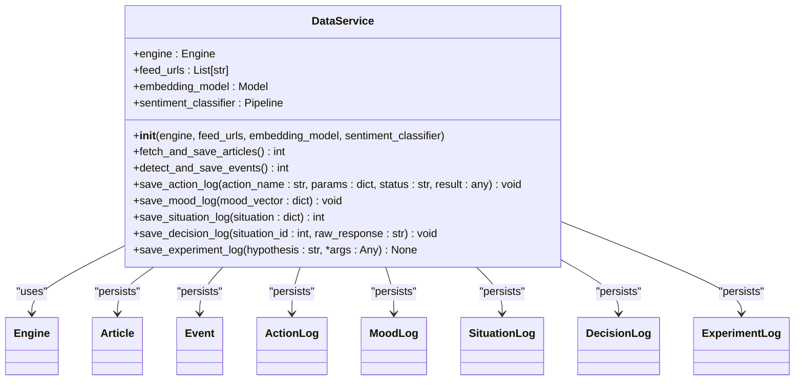
```mermaid
classDiagram
class DataService {
+engine : Engine
+feed_urls : List[str]
+embedding_model : Model
+sentiment_classifier : Pipeline
+__init__(engine, feed_urls, embedding_model, sentiment_classifier)
+fetch_and_save_articles() int
+detect_and_save_events() int
+save_action_log(action_name : str, params : dict, status : str, result : any) void
+save_mood_log(mood_vector : dict) void
+save_situation_log(situation : dict) int
+save_decision_log(situation_id : int, raw_response : str) void
+save_experiment_log(hypothesis : str, *args : Any) None
}
DataService --> Engine : "uses"
DataService --> Article : "persists"
DataService --> Event : "persists"
DataService --> ActionLog : "persists"
DataService --> MoodLog : "persists"
DataService --> SituationLog : "persists"
DataService --> DecisionLog : "persists"
DataService --> ExperimentLog : "persists"
```

**Diagram sources**
- [services/data_service.py](file://c:\Users\ASUS\Documents\GitHub\RAVANA\services\data_service.py#L9-L155)

**Section sources**
- [services/data_service.py](file://c:\Users\ASUS\Documents\GitHub\RAVANA\services\data_service.py#L9-L155)

#### Knowledge Service
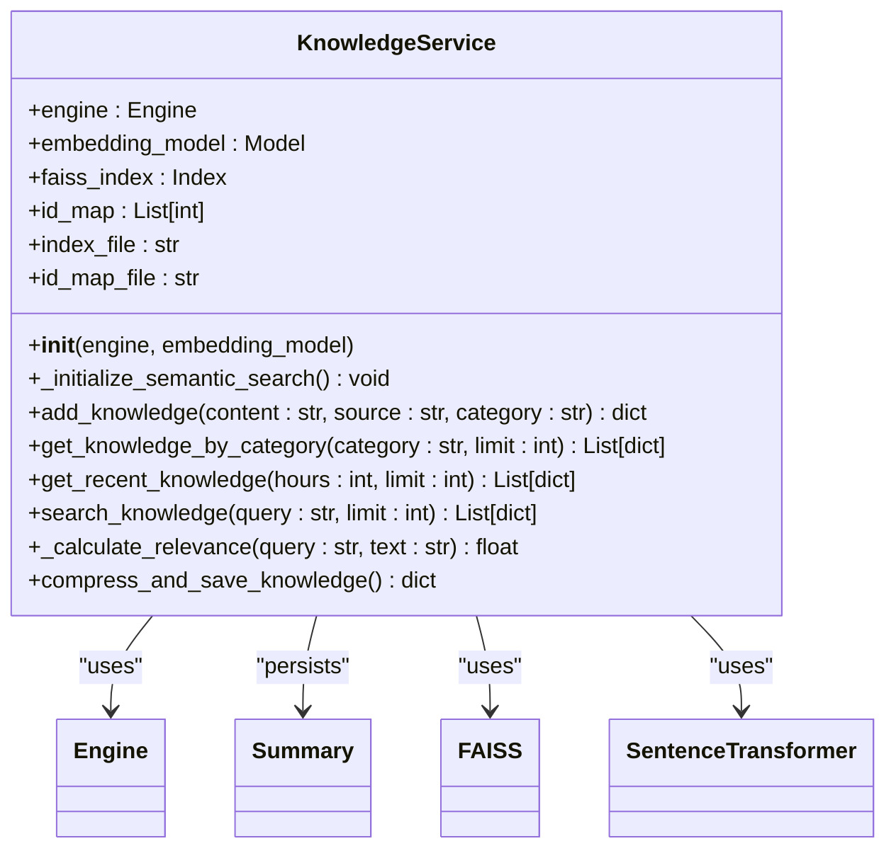
```mermaid
classDiagram
class KnowledgeService {
+engine : Engine
+embedding_model : Model
+faiss_index : Index
+id_map : List[int]
+index_file : str
+id_map_file : str
+__init__(engine, embedding_model)
+_initialize_semantic_search() void
+add_knowledge(content : str, source : str, category : str) dict
+get_knowledge_by_category(category : str, limit : int) List[dict]
+get_recent_knowledge(hours : int, limit : int) List[dict]
+search_knowledge(query : str, limit : int) List[dict]
+_calculate_relevance(query : str, text : str) float
+compress_and_save_knowledge() dict
}
KnowledgeService --> Engine : "uses"
KnowledgeService --> Summary : "persists"
KnowledgeService --> FAISS : "uses"
KnowledgeService --> SentenceTransformer : "uses"
```

**Diagram sources**
- [services/knowledge_service.py](file://c:\Users\ASUS\Documents\GitHub\RAVANA\services\knowledge_service.py#L14-L255)

**Section sources**
- [services/knowledge_service.py](file://c:\Users\ASUS\Documents\GitHub\RAVANA\services\knowledge_service.py#L14-L255)

#### Memory Service
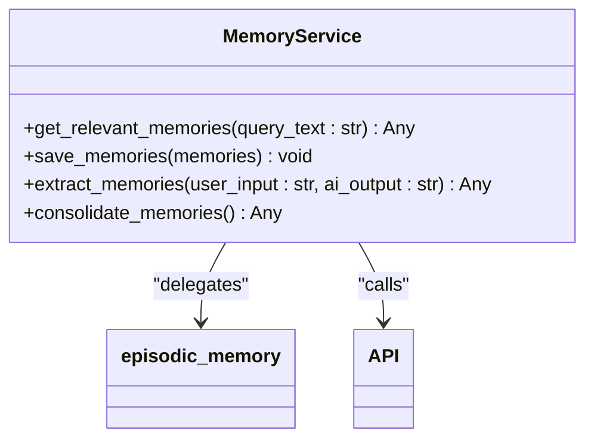
```mermaid
classDiagram
class MemoryService {
+get_relevant_memories(query_text : str) Any
+save_memories(memories) void
+extract_memories(user_input : str, ai_output : str) Any
+consolidate_memories() Any
}
MemoryService --> episodic_memory : "delegates"
MemoryService --> API : "calls"
```

**Diagram sources**
- [services/memory_service.py](file://c:\Users\ASUS\Documents\GitHub\RAVANA\services\memory_service.py#L8-L20)

**Section sources**
- [services/memory_service.py](file://c:\Users\ASUS\Documents\GitHub\RAVANA\services\memory_service.py#L8-L20)

#### Multi-Modal Service
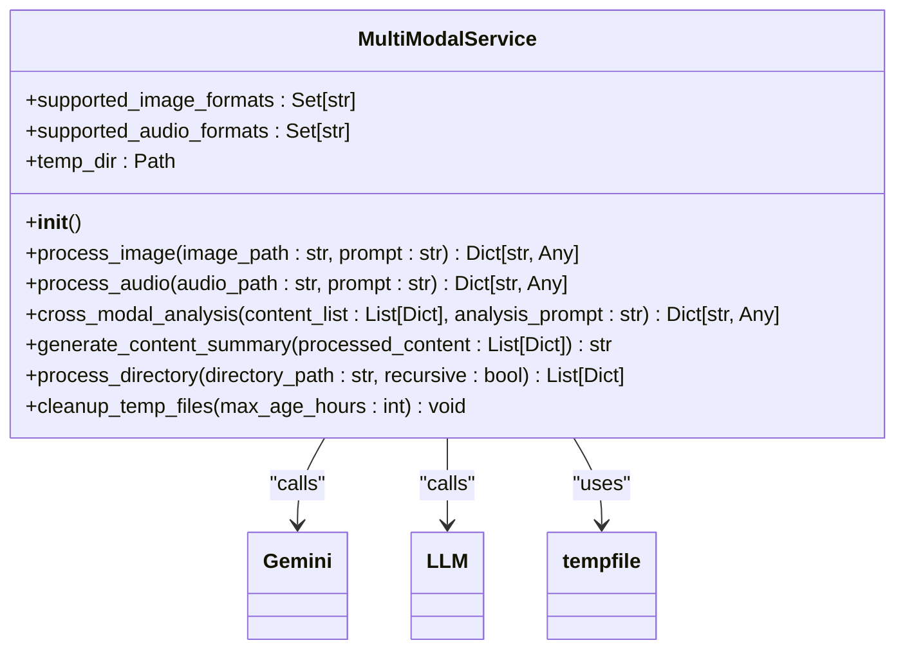
```mermaid
classDiagram
class MultiModalService {
+supported_image_formats : Set[str]
+supported_audio_formats : Set[str]
+temp_dir : Path
+__init__()
+process_image(image_path : str, prompt : str) Dict[str, Any]
+process_audio(audio_path : str, prompt : str) Dict[str, Any]
+cross_modal_analysis(content_list : List[Dict], analysis_prompt : str) Dict[str, Any]
+generate_content_summary(processed_content : List[Dict]) str
+process_directory(directory_path : str, recursive : bool) List[Dict]
+cleanup_temp_files(max_age_hours : int) void
}
MultiModalService --> Gemini : "calls"
MultiModalService --> LLM : "calls"
MultiModalService --> tempfile : "uses"
```

**Diagram sources**
- [services/multi_modal_service.py](file://c:\Users\ASUS\Documents\GitHub\RAVANA\services\multi_modal_service.py#L15-L348)

**Section sources**
- [services/multi_modal_service.py](file://c:\Users\ASUS\Documents\GitHub\RAVANA\services\multi_modal_service.py#L15-L348)

### Module Layer Analysis
The module layer contains specialized components that provide advanced cognitive and behavioral capabilities to the AGI system.

#### Personality Module
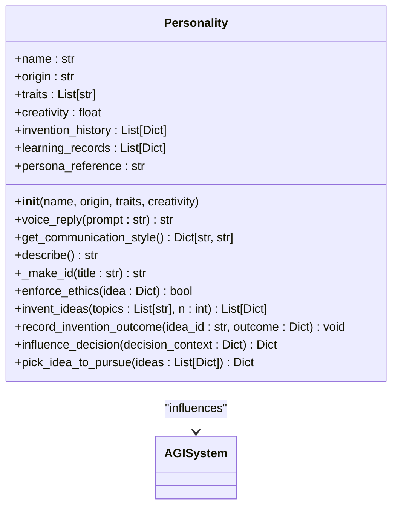
```mermaid
classDiagram
class Personality {
+name : str
+origin : str
+traits : List[str]
+creativity : float
+invention_history : List[Dict]
+learning_records : List[Dict]
+persona_reference : str
+__init__(name, origin, traits, creativity)
+voice_reply(prompt : str) str
+get_communication_style() Dict[str, str]
+describe() str
+_make_id(title : str) str
+enforce_ethics(idea : Dict) bool
+invent_ideas(topics : List[str], n : int) List[Dict]
+record_invention_outcome(idea_id : str, outcome : Dict) void
+influence_decision(decision_context : Dict) Dict
+pick_idea_to_pursue(ideas : List[Dict]) Dict
}
Personality --> AGISystem : "influences"
```

**Diagram sources**
- [modules/personality/personality.py](file://c:\Users\ASUS\Documents\GitHub\RAVANA\modules\personality\personality.py#L6-L204)

**Section sources**
- [modules/personality/personality.py](file://c:\Users\ASUS\Documents\GitHub\RAVANA\modules\personality\personality.py#L6-L204)

#### Emotional Intelligence Module
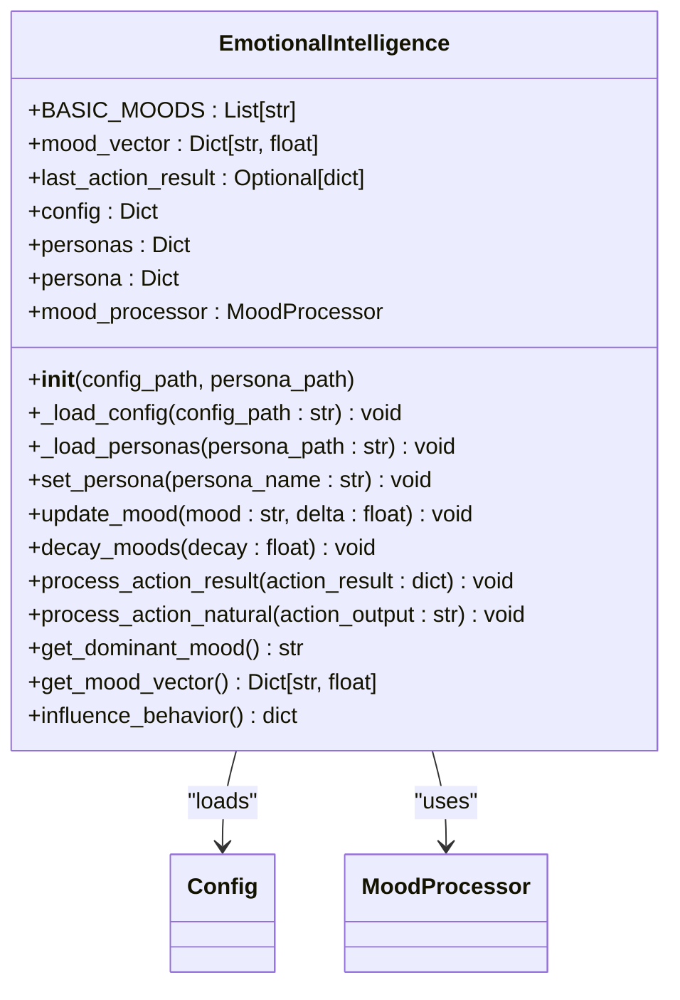
```mermaid
classDiagram
class EmotionalIntelligence {
+BASIC_MOODS : List[str]
+mood_vector : Dict[str, float]
+last_action_result : Optional[dict]
+config : Dict
+personas : Dict
+persona : Dict
+mood_processor : MoodProcessor
+__init__(config_path, persona_path)
+_load_config(config_path : str) void
+_load_personas(persona_path : str) void
+set_persona(persona_name : str) void
+update_mood(mood : str, delta : float) void
+decay_moods(decay : float) void
+process_action_result(action_result : dict) void
+process_action_natural(action_output : str) void
+get_dominant_mood() str
+get_mood_vector() Dict[str, float]
+influence_behavior() dict
}
EmotionalIntelligence --> Config : "loads"
EmotionalIntelligence --> MoodProcessor : "uses"
```

**Diagram sources**
- [modules/emotional_intellegence/emotional_intellegence.py](file://c:\Users\ASUS\Documents\GitHub\RAVANA\modules\emotional_intellegence\emotional_intellegence.py#L8-L66)

**Section sources**
- [modules/emotional_intellegence/emotional_intellegence.py](file://c:\Users\ASUS\Documents\GitHub\RAVANA\modules\emotional_intellegence\emotional_intellegence.py#L8-L66)

#### Curiosity Trigger Module
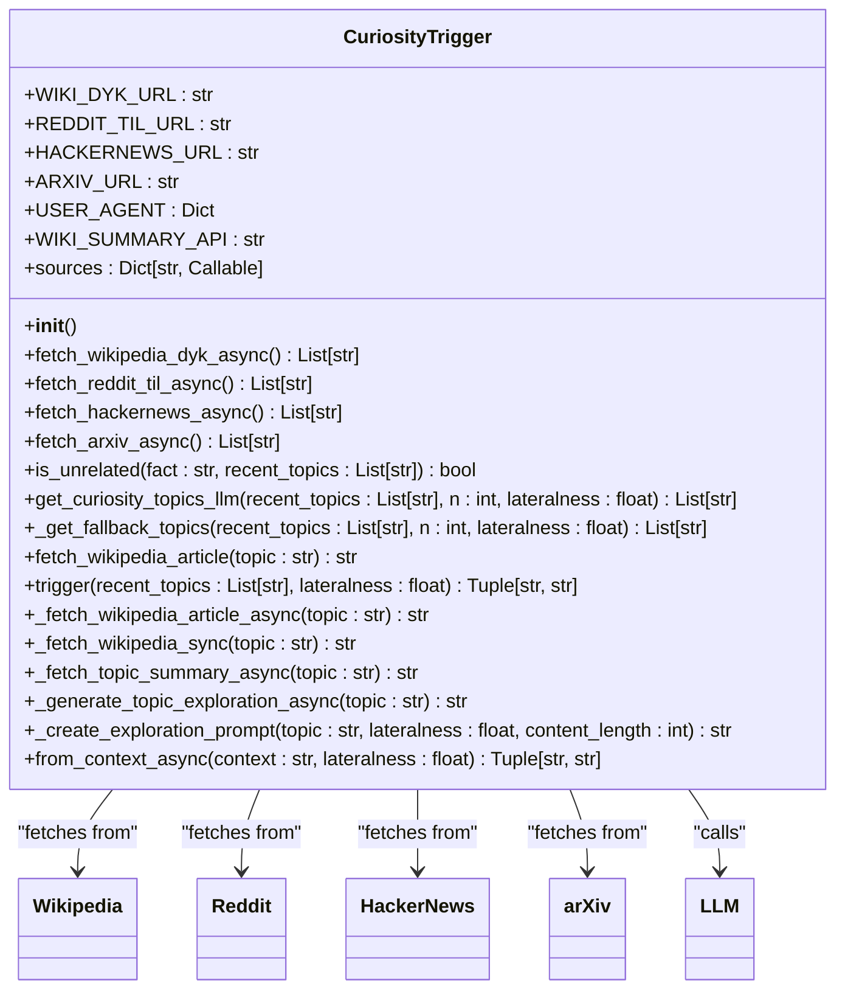
```mermaid
classDiagram
class CuriosityTrigger {
+WIKI_DYK_URL : str
+REDDIT_TIL_URL : str
+HACKERNEWS_URL : str
+ARXIV_URL : str
+USER_AGENT : Dict
+WIKI_SUMMARY_API : str
+sources : Dict[str, Callable]
+__init__()
+fetch_wikipedia_dyk_async() List[str]
+fetch_reddit_til_async() List[str]
+fetch_hackernews_async() List[str]
+fetch_arxiv_async() List[str]
+is_unrelated(fact : str, recent_topics : List[str]) bool
+get_curiosity_topics_llm(recent_topics : List[str], n : int, lateralness : float) List[str]
+_get_fallback_topics(recent_topics : List[str], n : int, lateralness : float) List[str]
+fetch_wikipedia_article(topic : str) str
+trigger(recent_topics : List[str], lateralness : float) Tuple[str, str]
+_fetch_wikipedia_article_async(topic : str) str
+_fetch_wikipedia_sync(topic : str) str
+_fetch_topic_summary_async(topic : str) str
+_generate_topic_exploration_async(topic : str) str
+_create_exploration_prompt(topic : str, lateralness : float, content_length : int) str
+from_context_async(context : str, lateralness : float) Tuple[str, str]
}
CuriosityTrigger --> Wikipedia : "fetches from"
CuriosityTrigger --> Reddit : "fetches from"
CuriosityTrigger --> HackerNews : "fetches from"
CuriosityTrigger --> arXiv : "fetches from"
CuriosityTrigger --> LLM : "calls"
```

**Diagram sources**
- [modules/curiosity_trigger/curiosity_trigger.py](file://c:\Users\ASUS\Documents\GitHub\RAVANA\modules\curiosity_trigger\curiosity_trigger.py#L71-L531)

**Section sources**
- [modules/curiosity_trigger/curiosity_trigger.py](file://c:\Users\ASUS\Documents\GitHub\RAVANA\modules\curiosity_trigger\curiosity_trigger.py#L71-L531)

#### Adaptive Learning Engine
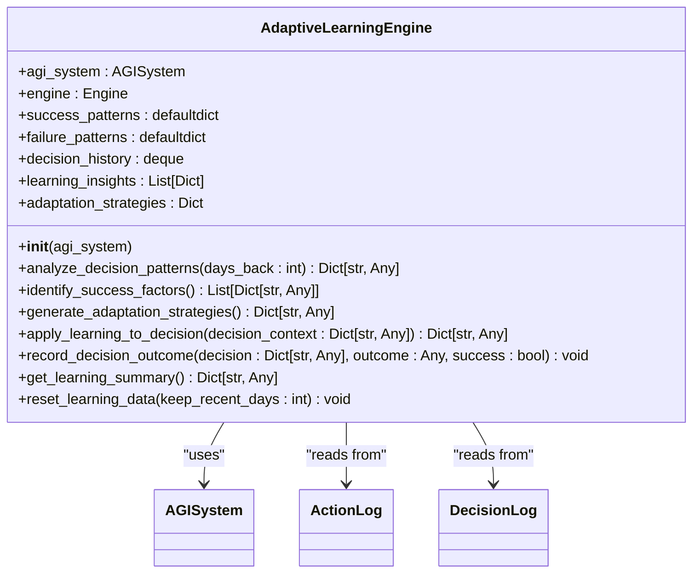
```mermaid
classDiagram
class AdaptiveLearningEngine {
+agi_system : AGISystem
+engine : Engine
+success_patterns : defaultdict
+failure_patterns : defaultdict
+decision_history : deque
+learning_insights : List[Dict]
+adaptation_strategies : Dict
+__init__(agi_system)
+analyze_decision_patterns(days_back : int) Dict[str, Any]
+identify_success_factors() List[Dict[str, Any]]
+generate_adaptation_strategies() Dict[str, Any]
+apply_learning_to_decision(decision_context : Dict[str, Any]) Dict[str, Any]
+record_decision_outcome(decision : Dict[str, Any], outcome : Any, success : bool) void
+get_learning_summary() Dict[str, Any]
+reset_learning_data(keep_recent_days : int) void
}
AdaptiveLearningEngine --> AGISystem : "uses"
AdaptiveLearningEngine --> ActionLog : "reads from"
AdaptiveLearningEngine --> DecisionLog : "reads from"
```

**Diagram sources**
- [modules/adaptive_learning/learning_engine.py](file://c:\Users\ASUS\Documents\GitHub\RAVANA\modules\adaptive_learning\learning_engine.py#L16-L354)

**Section sources**
- [modules/adaptive_learning/learning_engine.py](file://c:\Users\ASUS\Documents\GitHub\RAVANA\modules\adaptive_learning\learning_engine.py#L16-L354)

### Autonomous Loop Analysis
The autonomous loop is the core execution flow of the RAVANA system, continuously processing situations, making decisions, and executing actions.

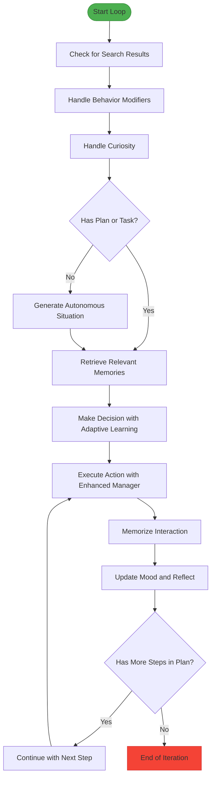
```mermaid
flowchart TD
Start([Start Loop]) --> CheckResults["Check for Search Results"]
CheckResults --> HandleModifiers["Handle Behavior Modifiers"]
HandleModifiers --> HandleCuriosity["Handle Curiosity"]
HandleCuriosity --> Decision{"Has Plan or Task?"}
Decision --> |Yes| RetrieveMemories["Retrieve Relevant Memories"]
Decision --> |No| GenerateSituation["Generate Autonomous Situation"]
GenerateSituation --> RetrieveMemories
RetrieveMemories --> MakeDecision["Make Decision with Adaptive Learning"]
MakeDecision --> ExecuteAction["Execute Action with Enhanced Manager"]
ExecuteAction --> Memorize["Memorize Interaction"]
Memorize --> UpdateMood["Update Mood and Reflect"]
UpdateMood --> CheckPlan{"Has More Steps in Plan?"}
CheckPlan --> |Yes| ContinuePlan["Continue with Next Step"]
CheckPlan --> |No| EndLoop["End of Iteration"]
ContinuePlan --> ExecuteAction
style Start fill:#4CAF50,stroke:#388E3C
style EndLoop fill:#F44336,stroke:#D32F2F
```

**Diagram sources**
- [core/system.py](file://c:\Users\ASUS\Documents\GitHub\RAVANA\core\system.py#L41-L796)

**Section sources**
- [core/system.py](file://c:\Users\ASUS\Documents\GitHub\RAVANA\core\system.py#L41-L796)

## Enhanced Snake Agent
The Enhanced Snake Agent represents a significant architectural enhancement to the RAVANA system, introducing advanced concurrency capabilities through threading, multiprocessing, and inter-process communication. This component operates as a background autonomous agent that continuously monitors the codebase, analyzes changes, and initiates experiments and improvements.

### Enhanced Snake Agent Architecture
The Enhanced Snake Agent follows a multi-layered architecture with specialized components for different aspects of concurrent processing:

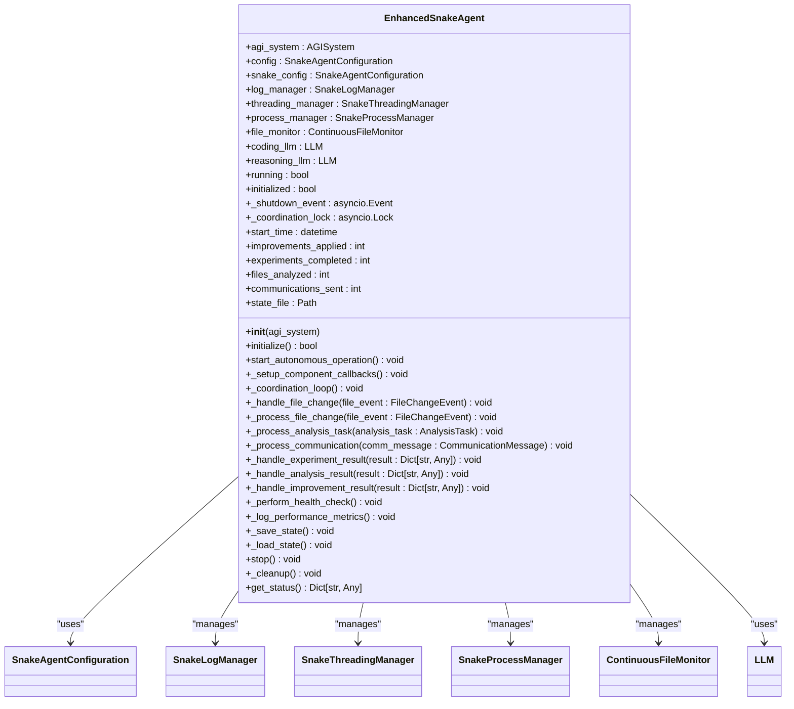
```mermaid
classDiagram
class EnhancedSnakeAgent {
+agi_system : AGISystem
+config : SnakeAgentConfiguration
+snake_config : SnakeAgentConfiguration
+log_manager : SnakeLogManager
+threading_manager : SnakeThreadingManager
+process_manager : SnakeProcessManager
+file_monitor : ContinuousFileMonitor
+coding_llm : LLM
+reasoning_llm : LLM
+running : bool
+initialized : bool
+_shutdown_event : asyncio.Event
+_coordination_lock : asyncio.Lock
+start_time : datetime
+improvements_applied : int
+experiments_completed : int
+files_analyzed : int
+communications_sent : int
+state_file : Path
+__init__(agi_system)
+initialize() bool
+start_autonomous_operation() void
+_setup_component_callbacks() void
+_coordination_loop() void
+_handle_file_change(file_event : FileChangeEvent) void
+_process_file_change(file_event : FileChangeEvent) void
+_process_analysis_task(analysis_task : AnalysisTask) void
+_process_communication(comm_message : CommunicationMessage) void
+_handle_experiment_result(result : Dict[str, Any]) void
+_handle_analysis_result(result : Dict[str, Any]) void
+_handle_improvement_result(result : Dict[str, Any]) void
+_perform_health_check() void
+_log_performance_metrics() void
+_save_state() void
+_load_state() void
+stop() void
+_cleanup() void
+get_status() Dict[str, Any]
}
EnhancedSnakeAgent --> SnakeAgentConfiguration : "uses"
EnhancedSnakeAgent --> SnakeLogManager : "manages"
EnhancedSnakeAgent --> SnakeThreadingManager : "manages"
EnhancedSnakeAgent --> SnakeProcessManager : "manages"
EnhancedSnakeAgent --> ContinuousFileMonitor : "manages"
EnhancedSnakeAgent --> LLM : "uses"
```

**Diagram sources**
- [core/snake_agent_enhanced.py](file://c:\Users\ASUS\Documents\GitHub\RAVANA\core\snake_agent_enhanced.py#L31-L620)

**Section sources**
- [core/snake_agent_enhanced.py](file://c:\Users\ASUS\Documents\GitHub\RAVANA\core\snake_agent_enhanced.py#L31-L620)

### Configuration System
The Enhanced Snake Agent uses a comprehensive configuration system that allows for fine-tuning of its behavior and resource usage:

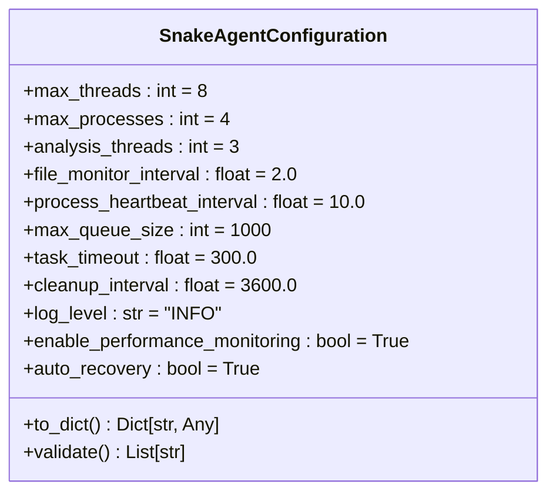
```mermaid
classDiagram
class SnakeAgentConfiguration {
+max_threads : int = 8
+max_processes : int = 4
+analysis_threads : int = 3
+file_monitor_interval : float = 2.0
+process_heartbeat_interval : float = 10.0
+max_queue_size : int = 1000
+task_timeout : float = 300.0
+cleanup_interval : float = 3600.0
+log_level : str = "INFO"
+enable_performance_monitoring : bool = True
+auto_recovery : bool = True
+to_dict() Dict[str, Any]
+validate() List[str]
}
```

**Diagram sources**
- [core/snake_data_models.py](file://c:\Users\ASUS\Documents\GitHub\RAVANA\core\snake_data_models.py#L375-L412)

**Section sources**
- [core/snake_data_models.py](file://c:\Users\ASUS\Documents\GitHub\RAVANA\core\snake_data_models.py#L375-L412)

### Threading Manager
The SnakeThreadingManager handles concurrent operations using Python's threading module, managing multiple worker threads for different types of tasks:

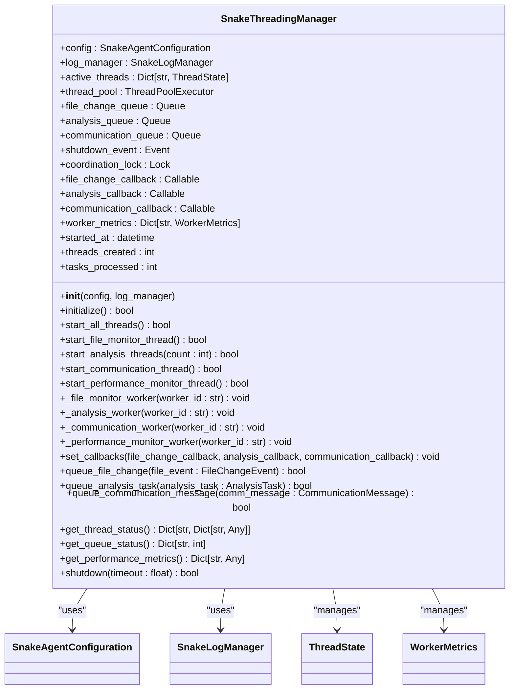
```mermaid
classDiagram
class SnakeThreadingManager {
+config : SnakeAgentConfiguration
+log_manager : SnakeLogManager
+active_threads : Dict[str, ThreadState]
+thread_pool : ThreadPoolExecutor
+file_change_queue : Queue
+analysis_queue : Queue
+communication_queue : Queue
+shutdown_event : Event
+coordination_lock : Lock
+file_change_callback : Callable
+analysis_callback : Callable
+communication_callback : Callable
+worker_metrics : Dict[str, WorkerMetrics]
+started_at : datetime
+threads_created : int
+tasks_processed : int
+__init__(config, log_manager)
+initialize() bool
+start_all_threads() bool
+start_file_monitor_thread() bool
+start_analysis_threads(count : int) bool
+start_communication_thread() bool
+start_performance_monitor_thread() bool
+_file_monitor_worker(worker_id : str) void
+_analysis_worker(worker_id : str) void
+_communication_worker(worker_id : str) void
+_performance_monitor_worker(worker_id : str) void
+set_callbacks(file_change_callback, analysis_callback, communication_callback) void
+queue_file_change(file_event : FileChangeEvent) bool
+queue_analysis_task(analysis_task : AnalysisTask) bool
+queue_communication_message(comm_message : CommunicationMessage) bool
+get_thread_status() Dict[str, Dict[str, Any]]
+get_queue_status() Dict[str, int]
+get_performance_metrics() Dict[str, Any]
+shutdown(timeout : float) bool
}
SnakeThreadingManager --> SnakeAgentConfiguration : "uses"
SnakeThreadingManager --> SnakeLogManager : "uses"
SnakeThreadingManager --> ThreadState : "manages"
SnakeThreadingManager --> WorkerMetrics : "manages"
```

**Diagram sources**
- [core/snake_threading_manager.py](file://c:\Users\ASUS\Documents\GitHub\RAVANA\core\snake_threading_manager.py#L25-L733)

**Section sources**
- [core/snake_threading_manager.py](file://c:\Users\ASUS\Documents\GitHub\RAVANA\core\snake_threading_manager.py#L25-L733)

### Process Manager
The SnakeProcessManager handles CPU-intensive tasks using multiprocessing, allowing for true parallel execution across multiple CPU cores:

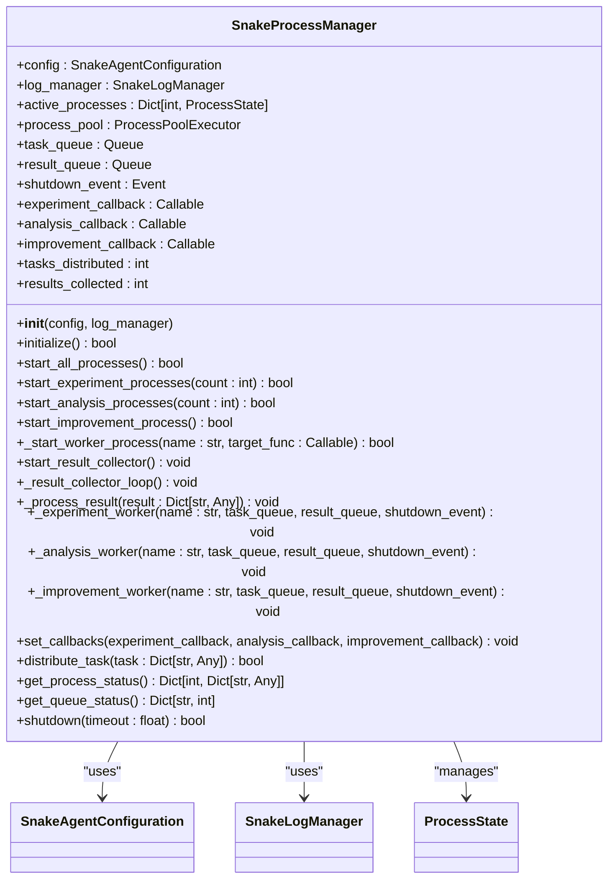
```mermaid
classDiagram
class SnakeProcessManager {
+config : SnakeAgentConfiguration
+log_manager : SnakeLogManager
+active_processes : Dict[int, ProcessState]
+process_pool : ProcessPoolExecutor
+task_queue : Queue
+result_queue : Queue
+shutdown_event : Event
+experiment_callback : Callable
+analysis_callback : Callable
+improvement_callback : Callable
+tasks_distributed : int
+results_collected : int
+__init__(config, log_manager)
+initialize() bool
+start_all_processes() bool
+start_experiment_processes(count : int) bool
+start_analysis_processes(count : int) bool
+start_improvement_process() bool
+_start_worker_process(name : str, target_func : Callable) bool
+start_result_collector() void
+_result_collector_loop() void
+_process_result(result : Dict[str, Any]) void
+_experiment_worker(name : str, task_queue, result_queue, shutdown_event) void
+_analysis_worker(name : str, task_queue, result_queue, shutdown_event) void
+_improvement_worker(name : str, task_queue, result_queue, shutdown_event) void
+set_callbacks(experiment_callback, analysis_callback, improvement_callback) void
+distribute_task(task : Dict[str, Any]) bool
+get_process_status() Dict[int, Dict[str, Any]]
+get_queue_status() Dict[str, int]
+shutdown(timeout : float) bool
}
SnakeProcessManager --> SnakeAgentConfiguration : "uses"
SnakeProcessManager --> SnakeLogManager : "uses"
SnakeProcessManager --> ProcessState : "manages"
```

**Diagram sources**
- [core/snake_process_manager.py](file://c:\Users\ASUS\Documents\GitHub\RAVANA\core\snake_process_manager.py#L23-L307)

**Section sources**
- [core/snake_process_manager.py](file://c:\Users\ASUS\Documents\GitHub\RAVANA\core\snake_process_manager.py#L23-L307)

### File Monitoring System
The ContinuousFileMonitor provides real-time monitoring of the file system, detecting changes to code and configuration files:

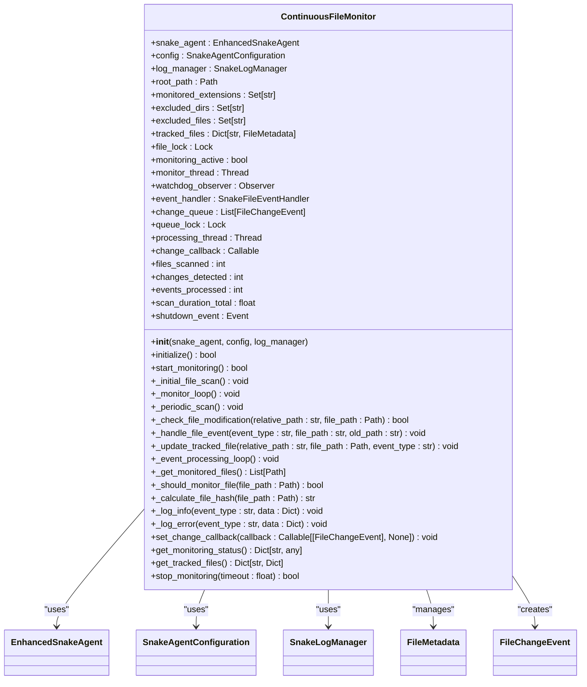
```mermaid
classDiagram
class ContinuousFileMonitor {
+snake_agent : EnhancedSnakeAgent
+config : SnakeAgentConfiguration
+log_manager : SnakeLogManager
+root_path : Path
+monitored_extensions : Set[str]
+excluded_dirs : Set[str]
+excluded_files : Set[str]
+tracked_files : Dict[str, FileMetadata]
+file_lock : Lock
+monitoring_active : bool
+monitor_thread : Thread
+watchdog_observer : Observer
+event_handler : SnakeFileEventHandler
+change_queue : List[FileChangeEvent]
+queue_lock : Lock
+processing_thread : Thread
+change_callback : Callable
+files_scanned : int
+changes_detected : int
+events_processed : int
+scan_duration_total : float
+shutdown_event : Event
+__init__(snake_agent, config, log_manager)
+initialize() bool
+start_monitoring() bool
+_initial_file_scan() void
+_monitor_loop() void
+_periodic_scan() void
+_check_file_modification(relative_path : str, file_path : Path) bool
+_handle_file_event(event_type : str, file_path : str, old_path : str) void
+_update_tracked_file(relative_path : str, file_path : Path, event_type : str) void
+_event_processing_loop() void
+_get_monitored_files() List[Path]
+_should_monitor_file(file_path : Path) bool
+_calculate_file_hash(file_path : Path) str
+_log_info(event_type : str, data : Dict) void
+_log_error(event_type : str, data : Dict) void
+set_change_callback(callback : Callable[[FileChangeEvent], None]) void
+get_monitoring_status() Dict[str, any]
+get_tracked_files() Dict[str, Dict]
+stop_monitoring(timeout : float) bool
}
ContinuousFileMonitor --> EnhancedSnakeAgent : "uses"
ContinuousFileMonitor --> SnakeAgentConfiguration : "uses"
ContinuousFileMonitor --> SnakeLogManager : "uses"
ContinuousFileMonitor --> FileMetadata : "manages"
ContinuousFileMonitor --> FileChangeEvent : "creates"
```

**Diagram sources**
- [core/snake_file_monitor.py](file://c:\Users\ASUS\Documents\GitHub\RAVANA\core\snake_file_monitor.py#L58-L574)

**Section sources**
- [core/snake_file_monitor.py](file://c:\Users\ASUS\Documents\GitHub\RAVANA\core\snake_file_monitor.py#L58-L574)

### Logging System
The SnakeLogManager provides structured logging with separate log files for different types of activities:

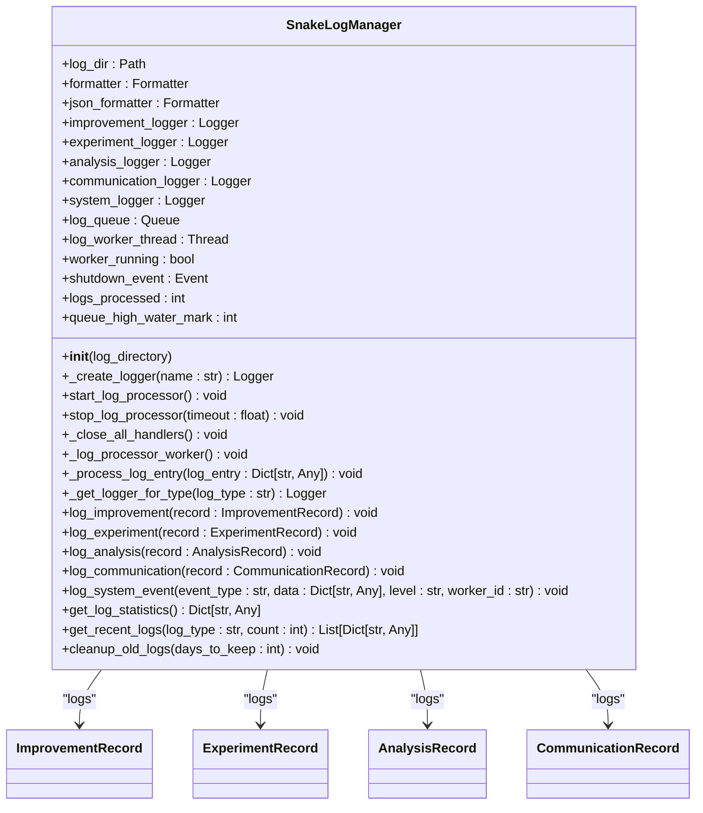
```mermaid
classDiagram
class SnakeLogManager {
+log_dir : Path
+formatter : Formatter
+json_formatter : Formatter
+improvement_logger : Logger
+experiment_logger : Logger
+analysis_logger : Logger
+communication_logger : Logger
+system_logger : Logger
+log_queue : Queue
+log_worker_thread : Thread
+worker_running : bool
+shutdown_event : Event
+logs_processed : int
+queue_high_water_mark : int
+__init__(log_directory)
+_create_logger(name : str) Logger
+start_log_processor() void
+stop_log_processor(timeout : float) void
+_close_all_handlers() void
+_log_processor_worker() void
+_process_log_entry(log_entry : Dict[str, Any]) void
+_get_logger_for_type(log_type : str) Logger
+log_improvement(record : ImprovementRecord) void
+log_experiment(record : ExperimentRecord) void
+log_analysis(record : AnalysisRecord) void
+log_communication(record : CommunicationRecord) void
+log_system_event(event_type : str, data : Dict[str, Any], level : str, worker_id : str) void
+get_log_statistics() Dict[str, Any]
+get_recent_logs(log_type : str, count : int) List[Dict[str, Any]]
+cleanup_old_logs(days_to_keep : int) void
}
SnakeLogManager --> ImprovementRecord : "logs"
SnakeLogManager --> ExperimentRecord : "logs"
SnakeLogManager --> AnalysisRecord : "logs"
SnakeLogManager --> CommunicationRecord : "logs"
```

**Diagram sources**
- [core/snake_log_manager.py](file://c:\Users\ASUS\Documents\GitHub\RAVANA\core\snake_log_manager.py#L105-L371)

**Section sources**
- [core/snake_log_manager.py](file://c:\Users\ASUS\Documents\GitHub\RAVANA\core\snake_log_manager.py#L105-L371)

### Data Models
The Enhanced Snake Agent uses a set of data models to represent various entities and events:

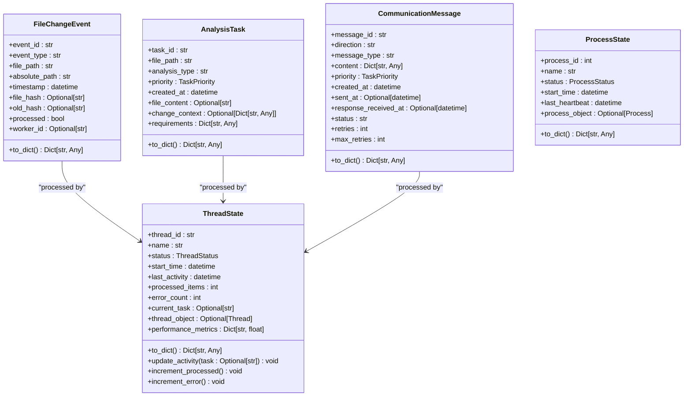
```mermaid
classDiagram
class FileChangeEvent {
+event_id : str
+event_type : str
+file_path : str
+absolute_path : str
+timestamp : datetime
+file_hash : Optional[str]
+old_hash : Optional[str]
+processed : bool
+worker_id : Optional[str]
+to_dict() Dict[str, Any]
}
class AnalysisTask {
+task_id : str
+file_path : str
+analysis_type : str
+priority : TaskPriority
+created_at : datetime
+file_content : Optional[str]
+change_context : Optional[Dict[str, Any]]
+requirements : Dict[str, Any]
+to_dict() Dict[str, Any]
}
class CommunicationMessage {
+message_id : str
+direction : str
+message_type : str
+content : Dict[str, Any]
+priority : TaskPriority
+created_at : datetime
+sent_at : Optional[datetime]
+response_received_at : Optional[datetime]
+status : str
+retries : int
+max_retries : int
+to_dict() Dict[str, Any]
}
class ThreadState {
+thread_id : str
+name : str
+status : ThreadStatus
+start_time : datetime
+last_activity : datetime
+processed_items : int
+error_count : int
+current_task : Optional[str]
+thread_object : Optional[Thread]
+performance_metrics : Dict[str, float]
+to_dict() Dict[str, Any]
+update_activity(task : Optional[str]) void
+increment_processed() void
+increment_error() void
}
class ProcessState {
+process_id : int
+name : str
+status : ProcessStatus
+start_time : datetime
+last_heartbeat : datetime
+process_object : Optional[Process]
+to_dict() Dict[str, Any]
}
FileChangeEvent --> ThreadState : "processed by"
AnalysisTask --> ThreadState : "processed by"
CommunicationMessage --> ThreadState : "processed by"
```

**Diagram sources**
- [core/snake_data_models.py](file://c:\Users\ASUS\Documents\GitHub\RAVANA\core\snake_data_models.py#L186-L295)
- [core/snake_data_models.py](file://c:\Users\ASUS\Documents\GitHub\RAVANA\core\snake_data_models.py#L55-L92)

**Section sources**
- [core/snake_data_models.py](file://c:\Users\ASUS\Documents\GitHub\RAVANA\core\snake_data_models.py#L186-L295)
- [core/snake_data_models.py](file://c:\Users\ASUS\Documents\GitHub\RAVANA\core\snake_data_models.py#L55-L92)

## Dependency Analysis

```mermaid
graph TD
AGI[AGISystem] --> ActionManager
AGI --> DataService
AGI --> KnowledgeService
AGI --> MemoryService
AGI --> MultiModalService
AGI --> Personality
AGI --> EmotionalIntelligence
AGI --> CuriosityTrigger
AGI --> AdaptiveLearning
AGI --> SnakeAgent
SnakeAgent --> ThreadingManager
SnakeAgent --> ProcessManager
SnakeAgent --> FileMonitor
SnakeAgent --> LogManager
ThreadingManager --> LogManager
ProcessManager --> LogManager
FileMonitor --> ThreadingManager
ActionManager --> MultiModalService
ActionManager --> DataService
DataService --> DB
KnowledgeService --> DB
MemoryService --> DB
AdaptiveLearning --> DataService
Personality --> AGI
EmotionalIntelligence --> AGI
CuriosityTrigger --> Wikipedia
CuriosityTrigger --> Reddit
CuriosityTrigger --> HackerNews
CuriosityTrigger --> arXiv
CuriosityTrigger --> LLM
DB[(Database)]
LLM[(LLM API)]
Wikipedia[(Wikipedia API)]
Reddit[(Reddit API)]
HackerNews[(Hacker News API)]
arXiv[(arXiv API)]
style AGI fill:#4CAF50,stroke:#388E3C
style ActionManager fill:#FF9800,stroke:#F57C00
style DataService fill:#9C27B0,stroke:#7B1FA2
style KnowledgeService fill:#9C27B0,stroke:#7B1FA2
style MemoryService fill:#9C27B0,stroke:#7B1FA2
style MultiModalService fill:#9C27B0,stroke:#7B1FA2
style Personality fill:#E91E63,stroke:#C2185B
style EmotionalIntelligence fill:#E91E63,stroke:#C2185B
style CuriosityTrigger fill:#E91E63,stroke:#C2185B
style AdaptiveLearning fill:#E91E63,stroke:#C2185B
style SnakeAgent fill:#3F51B5,stroke:#303F9F
style ThreadingManager fill:#009688,stroke:#00796B
style ProcessManager fill:#795548,stroke:#5D4037
style FileMonitor fill:#607D8B,stroke:#455A64
style LogManager fill:#FF5722,stroke:#D84315
style DB fill:#607D8B,stroke:#455A64
style LLM fill:#FFEB3B,stroke:#FBC02D
style Wikipedia fill:#FFEB3B,stroke:#FBC02D
style Reddit fill:#FFEB3B,stroke:#FBC02D
style HackerNews fill:#FFEB3B,stroke:#FBC02D
style arXiv fill:#FFEB3B,stroke:#FBC02D
```

**Diagram sources**
- [core/system.py](file://c:\Users\ASUS\Documents\GitHub\RAVANA\core\system.py)
- [core/snake_agent_enhanced.py](file://c:\Users\ASUS\Documents\GitHub\RAVANA\core\snake_agent_enhanced.py)
- [core/snake_threading_manager.py](file://c:\Users\ASUS\Documents\GitHub\RAVANA\core\snake_threading_manager.py)
- [core/snake_process_manager.py](file://c:\Users\ASUS\Documents\GitHub\RAVANA\core\snake_process_manager.py)
- [core/snake_file_monitor.py](file://c:\Users\ASUS\Documents\GitHub\RAVANA\core\snake_file_monitor.py)
- [core/snake_log_manager.py](file://c:\Users\ASUS\Documents\GitHub\RAVANA\core\snake_log_manager.py)

**Section sources**
- [core/system.py](file://c:\Users\ASUS\Documents\GitHub\RAVANA\core\system.py)
- [core/snake_agent_enhanced.py](file://c:\Users\ASUS\Documents\GitHub\RAVANA\core\snake_agent_enhanced.py)
- [core/snake_threading_manager.py](file://c:\Users\ASUS\Documents\GitHub\RAVANA\core\snake_threading_manager.py)
- [core/snake_process_manager.py](file://c:\Users\ASUS\Documents\GitHub\RAVANA\core\snake_process_manager.py)
- [core/snake_file_monitor.py](file://c:\Users\ASUS\Documents\GitHub\RAVANA\core\snake_file_monitor.py)
- [core/snake_log_manager.py](file://c:\Users\ASUS\Documents\GitHub\RAVANA\core\snake_log_manager.py)

## Performance Considerations
The RAVANA system employs several performance optimization strategies to handle its continuous operation model and async execution:

1. **Async Execution**: The system uses asyncio for non-blocking operations, allowing concurrent execution of I/O-bound tasks like API calls, file operations, and database queries.

2. **Caching**: The EnhancedActionManager implements a cache to avoid redundant execution of identical actions, significantly improving performance for repeated operations.

3. **Background Tasks**: Long-running processes like data collection, event detection, knowledge compression, and memory consolidation run as background tasks, preventing them from blocking the main autonomous loop.

4. **Resource Management**: The system includes mechanisms to limit parallel actions (parallel_limit = 3) and clear caches when they grow too large, preventing memory bloat.

5. **Efficient Data Access**: The KnowledgeService uses FAISS for semantic search, enabling fast vector similarity searches in large knowledge bases.

6. **Batch Processing**: Services like DataService batch database operations to minimize the number of database transactions.

7. **Timeouts**: Action execution includes timeouts (5 minutes) to prevent individual operations from hanging indefinitely.

8. **Connection Pooling**: Database connections are managed through SQLAlchemy's session system, providing connection pooling and efficient resource reuse.

9. **Enhanced Snake Agent Performance**: The Enhanced Snake Agent introduces additional performance optimizations:
   - **Thread Pooling**: Uses ThreadPoolExecutor to manage a pool of worker threads for I/O-bound tasks
   - **Process Pooling**: Uses ProcessPoolExecutor to manage a pool of worker processes for CPU-bound tasks
   - **Queue Management**: Implements bounded queues to prevent memory overflow
   - **Performance Monitoring**: Includes a dedicated performance monitoring thread that collects system metrics
   - **Health Checks**: Performs periodic health checks on all components
   - **State Persistence**: Saves agent state to disk for recovery after restarts
   - **Configurable Limits**: Allows configuration of thread/process counts, queue sizes, and timeout values

**Section sources**
- [core/enhanced_action_manager.py](file://c:\Users\ASUS\Documents\GitHub\RAVANA\core\enhanced_action_manager.py)
- [core/system.py](file://c:\Users\ASUS\Documents\GitHub\RAVANA\core\system.py)
- [services/knowledge_service.py](file://c:\Users\ASUS\Documents\GitHub\RAVANA\services\knowledge_service.py)
- [core/snake_agent_enhanced.py](file://c:\Users\ASUS\Documents\GitHub\RAVANA\core\snake_agent_enhanced.py)
- [core/snake_threading_manager.py](file://c:\Users\ASUS\Documents\GitHub\RAVANA\core\snake_threading_manager.py)
- [core/snake_process_manager.py](file://c:\Users\ASUS\Documents\GitHub\RAVANA\core\snake_process_manager.py)

## Troubleshooting Guide
When troubleshooting issues with the RAVANA system, consider the following common problems and solutions:

1. **System Not Starting**: Check if all required dependencies are installed and the database is accessible. Verify that the configuration files are correctly formatted.

2. **Slow Performance**: Monitor memory usage and check if the action cache has grown too large. Consider adjusting the parallel_limit in EnhancedActionManager or optimizing database queries.

3. **Failed API Calls**: Verify network connectivity and API keys. Check the logs for specific error messages from LLM providers or external APIs.

4. **Database Errors**: Ensure the database schema is up to date and the connection string is correct. Check for any database-specific errors in the logs.

5. **Memory Leaks**: Monitor the growth of the action cache and decision history. The system should automatically clear caches when they exceed size limits.

6. **Failed Action Execution**: Check the specific action's implementation and its dependencies. Review the error logs for detailed information about the failure.

7. **Poor Decision Quality**: Examine the learning engine's adaptation strategies and the quality of the knowledge base. Consider retraining or updating the underlying models.

8. **Curiosity Module Not Triggering**: Verify the CURIOSITY_CHANCE configuration value and check if recent topics are being properly extracted from memories.

9. **Enhanced Snake Agent Issues**:
   - **Initialization Failure**: Check if SNAKE_AGENT_ENABLED is set to true in configuration and verify that all required dependencies are installed
   - **Thread/Process Startup Failure**: Review the configuration values for max_threads and max_processes, and check system resource limits
   - **File Monitoring Issues**: Verify that the file monitor has read permissions for the monitored directories and check the excluded_dirs configuration
   - **Performance Monitoring Errors**: Ensure that psutil is installed and that the performance monitoring thread has sufficient privileges to access system metrics
   - **Inter-Process Communication Failures**: Check that the multiprocessing queues are properly configured and that the system has sufficient shared memory resources
   - **State Persistence Problems**: Verify that the enhanced_snake_state.json file is writable and that the file system has sufficient space

**Section sources**
- [core/system.py](file://c:\Users\ASUS\Documents\GitHub\RAVANA\core\system.py)
- [core/enhanced_action_manager.py](file://c:\Users\ASUS\Documents\GitHub\RAVANA\core\enhanced_action_manager.py)
- [services/data_service.py](file://c:\Users\ASUS\Documents\GitHub\RAVANA\services\data_service.py)
- [services/knowledge_service.py](file://c:\Users\ASUS\Documents\GitHub\RAVANA\services\knowledge_service.py)
- [core/snake_agent_enhanced.py](file://c:\Users\ASUS\Documents\GitHub\RAVANA\core\snake_agent_enhanced.py)
- [core/snake_threading_manager.py](file://c:\Users\ASUS\Documents\GitHub\RAVANA\core\snake_threading_manager.py)
- [core/snake_process_manager.py](file://c:\Users\ASUS\Documents\GitHub\RAVANA\core\snake_process_manager.py)

## Conclusion
The RAVANA system presents a sophisticated architecture for artificial general intelligence, featuring a well-organized modular design with clear separation between core components, services, and specialized modules. The AGISystem class serves as the central orchestrator, managing state and coordinating the execution flow through an event-driven autonomous loop. The system's design emphasizes scalability, with async execution via asyncio enabling efficient handling of concurrent operations. Key architectural strengths include the separation of concerns between different layers, the use of services for reusable functionality, and the integration of cognitive modules that provide advanced capabilities like adaptive learning, emotional intelligence, and curiosity-driven exploration. The system's continuous operation model allows for ongoing learning and improvement, making it well-suited for complex, long-term AI applications.

This update specifically documents the Enhanced Snake Agent architecture, which significantly extends the system's capabilities through advanced concurrency features. The Enhanced Snake Agent introduces a multi-layered approach to concurrent processing, combining threading for I/O-bound tasks, multiprocessing for CPU-intensive operations, and sophisticated inter-process communication mechanisms. This architecture enables the agent to continuously monitor the codebase, analyze changes, and initiate experiments and improvements in the background, all while maintaining separation from the main AGI system. The comprehensive logging, monitoring, and state persistence features ensure reliability and facilitate debugging and performance optimization. This enhancement represents a significant step forward in the system's ability to autonomously improve and adapt over time.

**Referenced Files in This Document**   
- [main.py](file://c:\Users\ASUS\Documents\GitHub\RAVANA\main.py)
- [core/system.py](file://c:\Users\ASUS\Documents\GitHub\RAVANA\core\system.py) - *Updated in recent commit*
- [core/snake_agent_enhanced.py](file://c:\Users\ASUS\Documents\GitHub\RAVANA\core\snake_agent_enhanced.py) - *Added in recent commit*
- [core/enhanced_action_manager.py](file://c:\Users\ASUS\Documents\GitHub\RAVANA\core\enhanced_action_manager.py)
- [services/data_service.py](file://c:\Users\ASUS\Documents\GitHub\RAVANA\services\data_service.py)
- [services/knowledge_service.py](file://c:\Users\ASUS\Documents\GitHub\RAVANA\services\knowledge_service.py)
- [services/memory_service.py](file://c:\Users\ASUS\Documents\GitHub\RAVANA\services\memory_service.py)
- [services/multi_modal_service.py](file://c:\Users\ASUS\Documents\GitHub\RAVANA\services\multi_modal_service.py)
- [modules/personality/personality.py](file://c:\Users\ASUS\Documents\GitHub\RAVANA\modules\personality\personality.py)
- [modules/emotional_intellegence/emotional_intellegence.py](file://c:\Users\ASUS\Documents\GitHub\RAVANA\modules\emotional_intellegence\emotional_intellegence.py)
- [modules/curiosity_trigger/curiosity_trigger.py](file://c:\Users\ASUS\Documents\GitHub\RAVANA\modules\curiosity_trigger\curiosity_trigger.py)
- [modules/adaptive_learning/learning_engine.py](file://c:\Users\ASUS\Documents\GitHub\RAVANA\modules\adaptive_learning\learning_engine.py)
- [core/actions/registry.py](file://c:\Users\ASUS\Documents\GitHub\RAVANA\core\actions\registry.py)
- [database/engine.py](file://c:\Users\ASUS\Documents\GitHub\RAVANA\database\engine.py)
- [database/models.py](file://c:\Users\ASUS\Documents\GitHub\RAVANA\database\models.py)
- [core/snake_data_models.py](file://c:\Users\ASUS\Documents\GitHub\RAVANA\core\snake_data_models.py) - *Added in recent commit*
- [core/snake_log_manager.py](file://c:\Users\ASUS\Documents\GitHub\RAVANA\core\snake_log_manager.py) - *Added in recent commit*
- [core/snake_threading_manager.py](file://c:\Users\ASUS\Documents\GitHub\RAVANA\core\snake_threading_manager.py) - *Added in recent commit*
- [core/snake_process_manager.py](file://c:\Users\ASUS\Documents\GitHub\RAVANA\core\snake_process_manager.py) - *Added in recent commit*
- [core/snake_file_monitor.py](file://c:\Users\ASUS\Documents\GitHub\RAVANA\core\snake_file_monitor.py) - *Added in recent commit*
