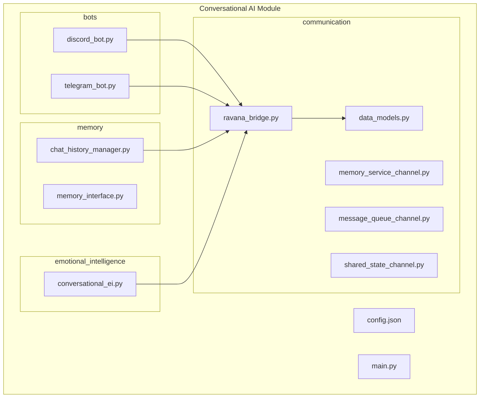
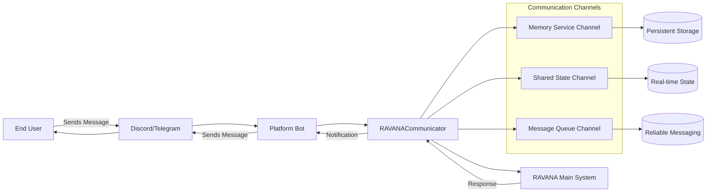
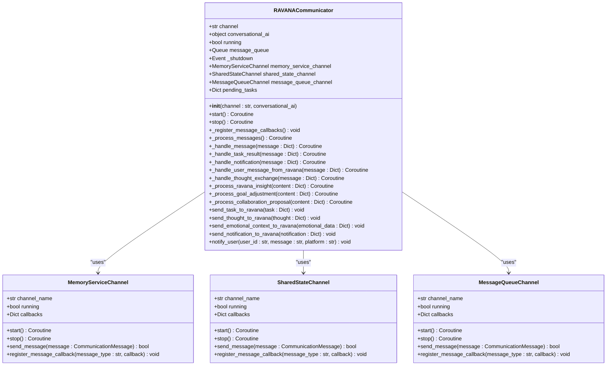
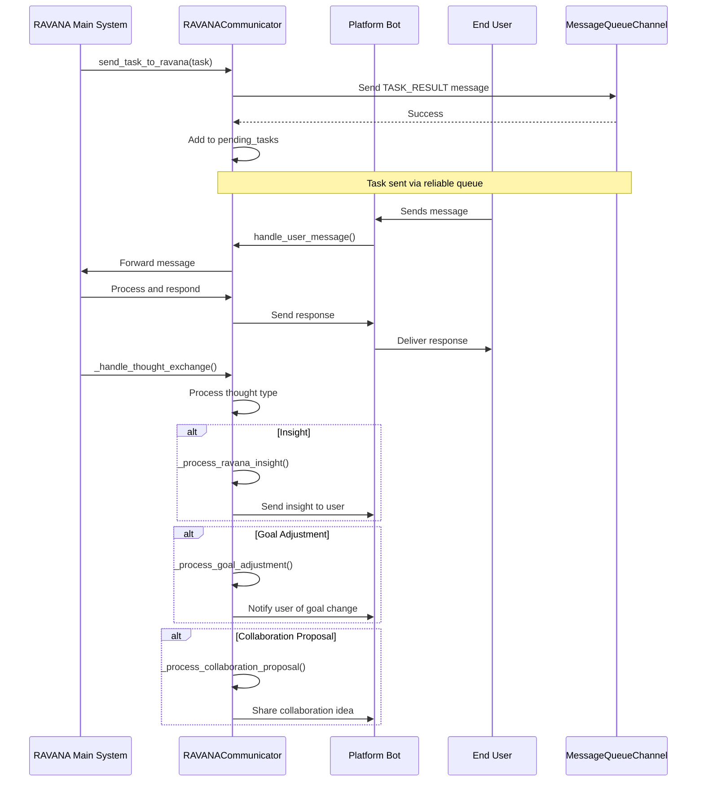
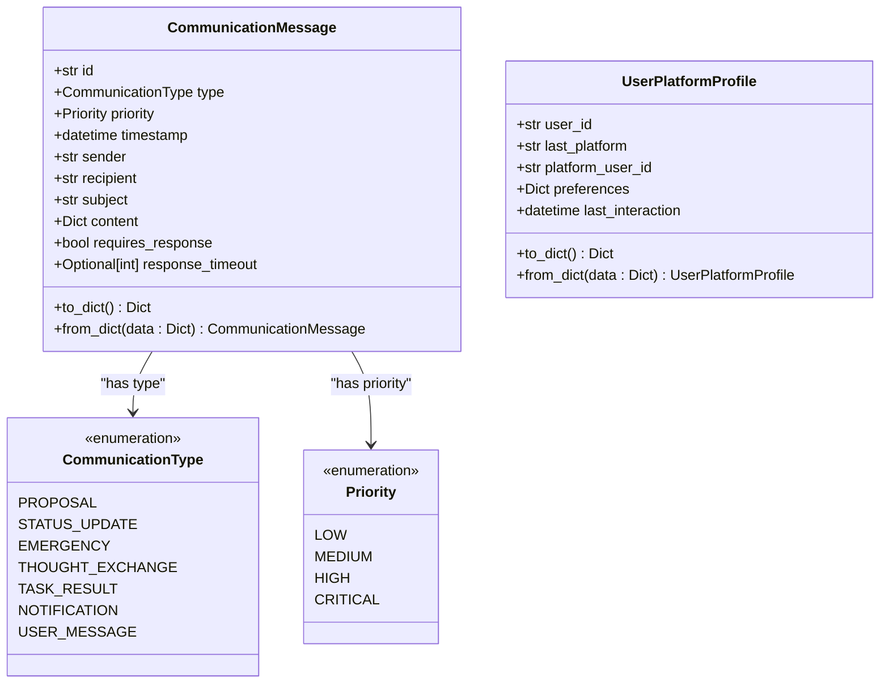

# Conversational AI Communication Framework


## Table of Contents
1. [Introduction](#introduction)
2. [Project Structure](#project-structure)
3. [Core Components](#core-components)
4. [Architecture Overview](#architecture-overview)
5. [Detailed Component Analysis](#detailed-component-analysis)
6. [Communication Message Structure](#communication-message-structure)
7. [Integration Patterns](#integration-patterns)
8. [Troubleshooting Guide](#troubleshooting-guide)
9. [Conclusion](#conclusion)

## Introduction
The Conversational AI Communication Framework is a modular system designed to enable seamless interaction between AI agents and external platforms such as Discord and Telegram. It serves as a communication bridge between the main RAVANA system and user-facing interfaces, facilitating task delegation, emotional intelligence exchange, and real-time notifications. The framework supports multiple communication channels, prioritized messaging, and cross-platform user management, making it suitable for complex AI coordination scenarios.

## Project Structure
The Conversational AI module is organized into distinct subdirectories based on functional responsibilities. This modular design enables clear separation of concerns and facilitates independent development and testing of components.



**Diagram sources**
- [modules/conversational_ai/communication/ravana_bridge.py](file://modules/conversational_ai/communication/ravana_bridge.py)
- [modules/conversational_ai/bots/discord_bot.py](file://modules/conversational_ai/bots/discord_bot.py)
- [modules/conversational_ai/bots/telegram_bot.py](file://modules/conversational_ai/bots/telegram_bot.py)

**Section sources**
- [modules/conversational_ai/config.json](file://modules/conversational_ai/config.json)
- [modules/conversational_ai/main.py](file://modules/conversational_ai/main.py)

## Core Components
The framework consists of several core components that work together to enable robust conversational AI capabilities:

- **RAVANACommunicator**: Central communication bridge handling message routing between the AI system and external services
- **Communication Channels**: Specialized channels for different types of data flow (memory service, shared state, message queue)
- **Platform Bots**: Interface adapters for Discord and Telegram platforms
- **Emotional Intelligence Module**: Handles mood processing and persona management
- **Memory System**: Manages chat history and user context persistence

These components are configured through a centralized JSON configuration file that defines platform settings, communication parameters, and emotional intelligence behavior.

**Section sources**
- [modules/conversational_ai/config.json](file://modules/conversational_ai/config.json)
- [modules/conversational_ai/communication/ravana_bridge.py](file://modules/conversational_ai/communication/ravana_bridge.py)

## Architecture Overview
The Conversational AI Communication Framework follows a layered architecture with clear separation between communication, processing, and presentation layers. The system acts as an intermediary between the main RAVANA AI system and user-facing messaging platforms.



**Diagram sources**
- [modules/conversational_ai/communication/ravana_bridge.py](file://modules/conversational_ai/communication/ravana_bridge.py)
- [modules/conversational_ai/communication/data_models.py](file://modules/conversational_ai/communication/data_models.py)

## Detailed Component Analysis

### RAVANACommunicator Analysis
The RAVANACommunicator class serves as the central communication hub, managing all interactions between the conversational AI and the main RAVANA system. It implements a multi-channel communication strategy to ensure reliable message delivery.



**Diagram sources**
- [modules/conversational_ai/communication/ravana_bridge.py](file://modules/conversational_ai/communication/ravana_bridge.py#L15-L564)

**Section sources**
- [modules/conversational_ai/communication/ravana_bridge.py](file://modules/conversational_ai/communication/ravana_bridge.py#L15-L564)

### Communication Flow Analysis
The framework implements a sophisticated message processing pipeline that handles various types of communications with appropriate routing and processing logic.



**Diagram sources**
- [modules/conversational_ai/communication/ravana_bridge.py](file://modules/conversational_ai/communication/ravana_bridge.py#L15-L564)

## Communication Message Structure
The framework uses a standardized message structure to ensure consistent communication across all components. The CommunicationMessage class defines the format for all inter-system messages.



**Diagram sources**
- [modules/conversational_ai/communication/data_models.py](file://modules/conversational_ai/communication/data_models.py#L27-L76)

**Section sources**
- [modules/conversational_ai/communication/data_models.py](file://modules/conversational_ai/communication/data_models.py#L1-L76)

## Integration Patterns
The framework supports several integration patterns for connecting with the main RAVANA system and external platforms:

### Task Delegation Pattern
When the conversational AI needs to delegate a task to the main system:

```python
task = {
    "task_id": "task_123",
    "task_description": "Analyze user sentiment",
    "parameters": {
        "user_id": "user_456",
        "conversation_history": [...]
    }
}
communicator.send_task_to_ravana(task)
```

### Thought Exchange Pattern
For sharing insights and cognitive processes between systems:

```python
thought = {
    "thought_type": "insight",
    "payload": {
        "description": "Noticed user prefers concise responses",
        "evidence": "User frequently interrupts long messages"
    },
    "metadata": {
        "user_id": "user_456",
        "timestamp": "2024-01-15T10:30:00"
    }
}
communicator.send_thought_to_ravana(thought)
```

### Emotional Context Synchronization
To maintain emotional continuity across system boundaries:

```python
emotional_data = {
    "user_id": "user_456",
    "current_mood": "frustrated",
    "mood_intensity": 0.7,
    "detected_cues": ["short_responses", "exclamation_points"],
    "recommended_response_style": "empathetic"
}
communicator.send_emotional_context_to_ravana(emotional_data)
```

**Section sources**
- [modules/conversational_ai/communication/ravana_bridge.py](file://modules/conversational_ai/communication/ravana_bridge.py)
- [modules/conversational_ai/communication/data_models.py](file://modules/conversational_ai/communication/data_models.py)

## Troubleshooting Guide
Common issues and their solutions when working with the Conversational AI Communication Framework:

### Connection Issues
**Symptom**: RAVANACommunicator fails to start or maintain connection
**Solution**: 
- Verify the IPC channel name matches in both systems
- Check that required services are running
- Ensure proper permissions for communication channels

### Message Delivery Failures
**Symptom**: Messages are not being delivered or processed
**Solution**:
- Check the message queue for backlog
- Verify message callbacks are properly registered
- Confirm message format adheres to CommunicationMessage structure
- Review logs for serialization errors

### Platform Integration Problems
**Symptom**: Discord or Telegram bots not responding
**Solution**:
- Validate API tokens in config.json
- Check platform-specific configuration settings
- Ensure bot has necessary permissions in the server/channel
- Verify network connectivity to platform APIs

### Performance Issues
**Symptom**: High latency in message processing
**Solution**:
- Monitor message queue size and processing rate
- Consider increasing message_timeout in configuration
- Review the number of pending tasks
- Optimize message content size

**Section sources**
- [modules/conversational_ai/config.json](file://modules/conversational_ai/config.json)
- [modules/conversational_ai/communication/ravana_bridge.py](file://modules/conversational_ai/communication/ravana_bridge.py)
- [modules/conversational_ai/bots/discord_bot.py](file://modules/conversational_ai/bots/discord_bot.py)
- [modules/conversational_ai/bots/telegram_bot.py](file://modules/conversational_ai/bots/telegram_bot.py)

## Conclusion
The Conversational AI Communication Framework provides a robust foundation for building intelligent, multi-platform conversational agents. Its modular architecture, standardized message formats, and comprehensive error handling make it suitable for complex AI coordination scenarios. The framework effectively bridges the gap between the cognitive capabilities of the main RAVANA system and user-facing communication platforms, enabling seamless interaction through multiple channels. By following the documented integration patterns and troubleshooting guidelines, developers can successfully implement and maintain sophisticated conversational AI applications.

**Referenced Files in This Document**   
- [modules/conversational_ai/config.json](file://modules/conversational_ai/config.json)
- [modules/conversational_ai/communication/ravana_bridge.py](file://modules/conversational_ai/communication/ravana_bridge.py)
- [modules/conversational_ai/communication/data_models.py](file://modules/conversational_ai/communication/data_models.py)
- [modules/conversational_ai/main.py](file://modules/conversational_ai/main.py)
- [modules/conversational_ai/bots/discord_bot.py](file://modules/conversational_ai/bots/discord_bot.py)
- [modules/conversational_ai/bots/telegram_bot.py](file://modules/conversational_ai/bots/telegram_bot.py)