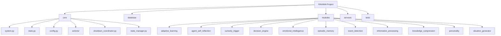
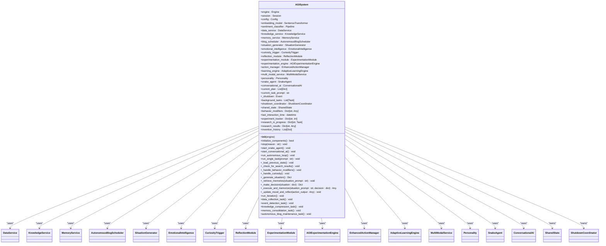
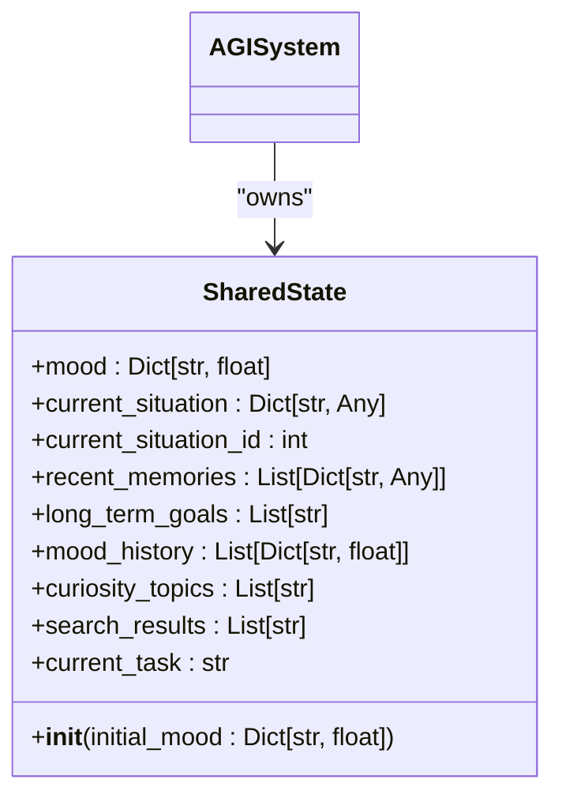
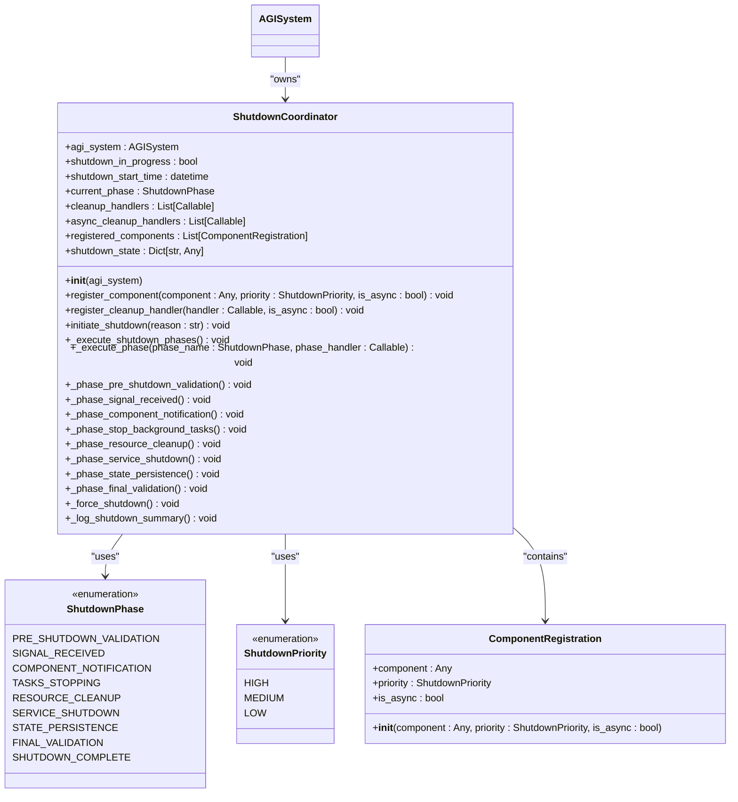
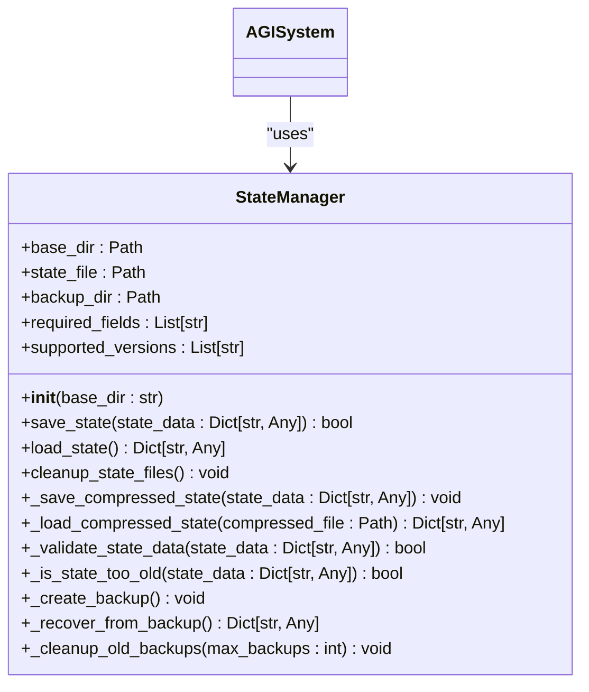
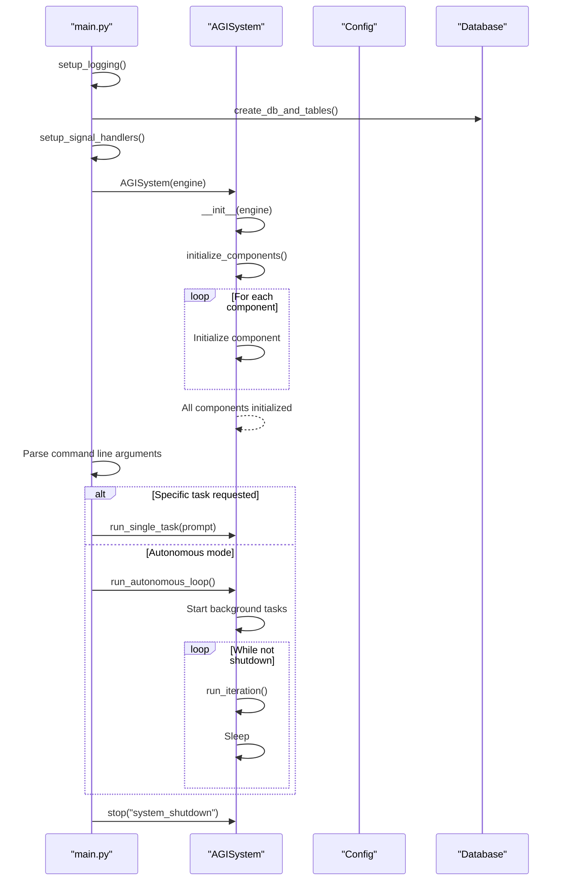
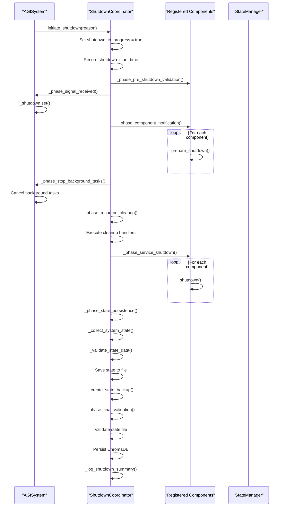
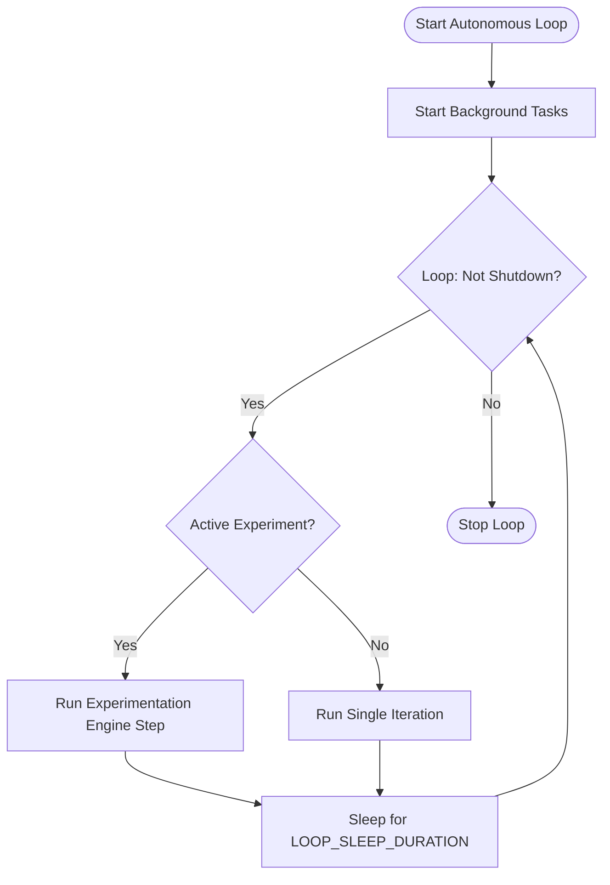
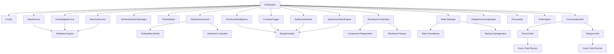

# Core System

## Update Summary
**Changes Made**   
- Updated documentation to reflect enhanced graceful shutdown capabilities
- Added new sections for ShutdownCoordinator and StateManager classes
- Enhanced configuration details with new shutdown-related parameters
- Updated architecture overview to include shutdown coordination
- Added detailed shutdown sequence analysis with new phases
- Updated dependency analysis to include new shutdown components
- Updated Conversational AI startup process to reflect direct asyncio task usage with improved error handling and logging
- Enhanced bot connectivity management details in startup sequence and troubleshooting sections

## Table of Contents
1. [Introduction](#introduction)
2. [Project Structure](#project-structure)
3. [Core Components](#core-components)
4. [Architecture Overview](#architecture-overview)
5. [Detailed Component Analysis](#detailed-component-analysis)
6. [Dependency Analysis](#dependency-analysis)
7. [Performance Considerations](#performance-considerations)
8. [Troubleshooting Guide](#troubleshooting-guide)
9. [Conclusion](#conclusion)

## Introduction
This document provides a comprehensive analysis of the core system components of the RAVANA AGI system. It focuses on the AGISystem class, its initialization process, and its role in orchestrating the autonomous loop. The shared state management via the State class is detailed, including mood, goals, and situational awareness. The startup sequence, main execution loop, and shutdown procedures are explained. Configuration loading and application are covered, along with examples of system initialization and interaction with modules. Debugging hooks and monitoring points are included, as well as common issues such as state corruption, initialization failures, and concurrency problems in async contexts. Performance implications of continuous operation and memory usage patterns are also addressed.

## Project Structure
The RAVANA project is structured into several core directories: `core`, `database`, `modules`, `services`, and `tests`. The `core` directory contains the fundamental system components such as the AGISystem, configuration, state management, and action system. The `database` directory handles data persistence. The `modules` directory contains specialized AI functionalities like adaptive learning, emotional intelligence, and event detection. The `services` directory provides high-level services for data, knowledge, memory, and multi-modal operations. The `tests` directory contains unit and integration tests.

**Diagram sources**
- [main.py](file://c:\Users\ASUS\Documents\GitHub\RAVANA\main.py#L1-L317)
- [core/system.py](file://c:\Users\ASUS\Documents\GitHub\RAVANA\core\system.py#L57-L1176)

**Section sources**
- [main.py](file://c:\Users\ASUS\Documents\GitHub\RAVANA\main.py#L1-L317)
- [core/system.py](file://c:\Users\ASUS\Documents\GitHub\RAVANA\core\system.py#L57-L1176)

## Core Components
The core components of the RAVANA AGI system are centered around the AGISystem class, which orchestrates the autonomous loop. The system uses a shared state model to maintain situational awareness, mood, and goals. Configuration is managed through a centralized Config class. The system is designed to be modular, with components like the Snake Agent and Conversational AI that can be enabled or disabled. The architecture supports continuous operation with background tasks for data collection, event detection, knowledge compression, and memory consolidation. The enhanced shutdown system now includes a comprehensive ShutdownCoordinator and StateManager for reliable state persistence and recovery. The Conversational AI module has been updated with improved bot connectivity management through direct asyncio task usage and enhanced error handling.

**Section sources**
- [core/system.py](file://c:\Users\ASUS\Documents\GitHub\RAVANA\core\system.py#L57-L1176)
- [core/state.py](file://c:\Users\ASUS\Documents\GitHub\RAVANA\core\state.py#L6-L15)
- [core/config.py](file://c:\Users\ASUS\Documents\GitHub\RAVANA\core\config.py)
- [core/shutdown_coordinator.py](file://c:\Users\ASUS\Documents\GitHub\RAVANA\core\shutdown_coordinator.py#L22-L761)
- [core/state_manager.py](file://c:\Users\ASUS\Documents\GitHub\RAVANA\core\state_manager.py#L22-L349)
- [modules/conversational_ai/main.py](file://c:\Users\ASUS\Documents\GitHub\RAVANA\modules\conversational_ai\main.py#L1-L483)
- [modules/conversational_ai/bots/discord_bot.py](file://c:\Users\ASUS\Documents\GitHub\RAVANA\modules\conversational_ai\bots\discord_bot.py#L1-L226)
- [modules/conversational_ai/bots/telegram_bot.py](file://c:\Users\ASUS\Documents\GitHub\RAVANA\modules\conversational_ai\bots\telegram_bot.py#L1-L228)

## Architecture Overview
The RAVANA AGI system follows a modular, event-driven architecture with a central AGISystem orchestrating various components. The system initializes with a comprehensive setup of services, modules, and state management. The main execution loop runs autonomously, processing situations, making decisions, executing actions, and updating state. Background tasks handle periodic operations like data collection, event detection, knowledge compression, and memory consolidation. The system supports graceful shutdown with a coordinated cleanup process through the enhanced ShutdownCoordinator, which manages an 8-phase shutdown process with timeout handling, component notification, resource cleanup, and state persistence. The Conversational AI module has been refactored to use direct asyncio tasks for bot startup, improving connectivity management and error handling.

```mermaid
graph TD
A[AGISystem] --> B[Data Service]
A --> C[Knowledge Service]
A --> D[Memory Service]
A --> E[Action Manager]
A --> F[Shared State]
A --> G[Shutdown Coordinator]
A --> H[Situation Generator]
A --> I[Emotional Intelligence]
A --> J[Curiosity Trigger]
A --> K[Reflection Module]
A --> L[Experimentation Engine]
A --> M[Adaptive Learning Engine]
A --> N[Personality]
A --> O[Snake Agent]
A --> P[Conversational AI]
F --> Q[Mood]
F --> R[Recent Memories]
F --> S[Current Situation]
F --> T[Curiosity Topics]
F --> U[Search Results]
A --> V[Background Tasks]
V --> W[Data Collection]
V --> X[Event Detection]
V --> Y[Knowledge Compression]
V --> Z[Memory Consolidation]
A --> AA[State Manager]
AA --> AB[State Persistence]
AA --> AC[State Recovery]
AA --> AD[Backup Management]
G --> AE[Shutdown Phases]
AE --> AF[Pre-shutdown Validation]
AE --> AG[Signal Received]
AE --> AH[Component Notification]
AE --> AI[Tasks Stopping]
AE --> AJ[Resource Cleanup]
AE --> AK[Service Shutdown]
AE --> AL[State Persistence]
AE --> AM[Final Validation]
P --> PA[Discord Bot]
P --> PB[Telegram Bot]
PA --> PC[Async Task Runner]
PB --> PD[Async Task Runner]
```

**Diagram sources**
- [core/system.py](file://c:\Users\ASUS\Documents\GitHub\RAVANA\core\system.py#L57-L1176)
- [core/state.py](file://c:\Users\ASUS\Documents\GitHub\RAVANA\core\state.py#L6-L15)
- [core/shutdown_coordinator.py](file://c:\Users\ASUS\Documents\GitHub\RAVANA\core\shutdown_coordinator.py#L22-L761)
- [core/state_manager.py](file://c:\Users\ASUS\Documents\GitHub\RAVANA\core\state_manager.py#L22-L349)
- [modules/conversational_ai/main.py](file://c:\Users\ASUS\Documents\GitHub\RAVANA\modules\conversational_ai\main.py#L1-L483)
- [modules/conversational_ai/bots/discord_bot.py](file://c:\Users\ASUS\Documents\GitHub\RAVANA\modules\conversational_ai\bots\discord_bot.py#L1-L226)
- [modules/conversational_ai/bots/telegram_bot.py](file://c:\Users\ASUS\Documents\GitHub\RAVANA\modules\conversational_ai\bots\telegram_bot.py#L1-L228)

## Detailed Component Analysis

### AGISystem Class Analysis
The AGISystem class is the central orchestrator of the RAVANA AGI system. It manages the initialization of all components, the main autonomous loop, and graceful shutdown.

#### Class Diagram

**Diagram sources**
- [core/system.py](file://c:\Users\ASUS\Documents\GitHub\RAVANA\core\system.py#L57-L1176)

**Section sources**
- [core/system.py](file://c:\Users\ASUS\Documents\GitHub\RAVANA\core\system.py#L57-L1176)

### State Management Analysis
The shared state in the RAVANA AGI system is managed through the SharedState class, which maintains critical information about the system's current situation, mood, memories, and goals.

#### Class Diagram

**Diagram sources**
- [core/state.py](file://c:\Users\ASUS\Documents\GitHub\RAVANA\core\state.py#L6-L15)

**Section sources**
- [core/state.py](file://c:\Users\ASUS\Documents\GitHub\RAVANA\core\state.py#L6-L15)

### Shutdown Coordinator Analysis
The enhanced shutdown system is managed through the ShutdownCoordinator class, which implements an 8-phase graceful shutdown process with timeout handling, component coordination, and state persistence.

#### Class Diagram

**Diagram sources**
- [core/shutdown_coordinator.py](file://c:\Users\ASUS\Documents\GitHub\RAVANA\core\shutdown_coordinator.py#L22-L761)

**Section sources**
- [core/shutdown_coordinator.py](file://c:\Users\ASUS\Documents\GitHub\RAVANA\core\shutdown_coordinator.py#L22-L761)

### State Manager Analysis
The StateManager class provides enhanced state management capabilities with persistence, recovery, validation, and backup features for reliable system state management across restarts.

#### Class Diagram

**Diagram sources**
- [core/state_manager.py](file://c:\Users\ASUS\Documents\GitHub\RAVANA\core\state_manager.py#L22-L349)

**Section sources**
- [core/state_manager.py](file://c:\Users\ASUS\Documents\GitHub\RAVANA\core\state_manager.py#L22-L349)

### Startup Sequence Analysis
The startup sequence of the RAVANA AGI system is initiated through the main.py file, which sets up logging, creates the database, initializes the AGISystem, and starts the autonomous loop or handles specific tasks. The Conversational AI module has been updated to use direct asyncio tasks for bot startup, improving connectivity management and error handling.

#### Sequence Diagram

**Diagram sources**
- [main.py](file://c:\Users\ASUS\Documents\GitHub\RAVANA\main.py#L1-L317)
- [core/system.py](file://c:\Users\ASUS\Documents\GitHub\RAVANA\core\system.py#L57-L1176)

**Section sources**
- [main.py](file://c:\Users\ASUS\Documents\GitHub\RAVANA\main.py#L1-L317)
- [core/system.py](file://c:\Users\ASUS\Documents\GitHub\RAVANA\core\system.py#L57-L1176)

### Shutdown Sequence Analysis
The enhanced shutdown sequence of the RAVANA AGI system is managed by the ShutdownCoordinator, which executes an 8-phase process for graceful shutdown with timeout handling and state persistence.

#### Sequence Diagram

**Diagram sources**
- [core/shutdown_coordinator.py](file://c:\Users\ASUS\Documents\GitHub\RAVANA\core\shutdown_coordinator.py#L22-L761)
- [core/state_manager.py](file://c:\Users\ASUS\Documents\GitHub\RAVANA\core\state_manager.py#L22-L349)

**Section sources**
- [core/shutdown_coordinator.py](file://c:\Users\ASUS\Documents\GitHub\RAVANA\core\shutdown_coordinator.py#L22-L761)
- [core/state_manager.py](file://c:\Users\ASUS\Documents\GitHub\RAVANA\core\state_manager.py#L22-L349)

### Main Execution Loop Analysis
The main execution loop of the RAVANA AGI system is implemented in the run_autonomous_loop method of the AGISystem class. It continuously processes iterations of the AGI's thought process, handling both planned tasks and autonomous situation generation.

#### Flowchart

**Diagram sources**
- [core/system.py](file://c:\Users\ASUS\Documents\GitHub\RAVANA\core\system.py#L57-L1176)

**Section sources**
- [core/system.py](file://c:\Users\ASUS\Documents\GitHub\RAVANA\core\system.py#L57-L1176)

## Dependency Analysis
The RAVANA AGI system has a well-defined dependency structure with the AGISystem class at the center, depending on various services, modules, and utilities. The system uses a layered architecture with clear separation of concerns. The enhanced shutdown system introduces new dependencies through the ShutdownCoordinator and StateManager classes, which coordinate the shutdown process and manage state persistence. The Conversational AI module has updated dependencies for improved bot connectivity management.

**Diagram sources**
- [core/system.py](file://c:\Users\ASUS\Documents\GitHub\RAVANA\core\system.py#L57-L1176)
- [core/config.py](file://c:\Users\ASUS\Documents\GitHub\RAVANA\core\config.py)
- [core/shutdown_coordinator.py](file://c:\Users\ASUS\Documents\GitHub\RAVANA\core\shutdown_coordinator.py#L22-L761)
- [core/state_manager.py](file://c:\Users\ASUS\Documents\GitHub\RAVANA\core\state_manager.py#L22-L349)
- [modules/conversational_ai/main.py](file://c:\Users\ASUS\Documents\GitHub\RAVANA\modules\conversational_ai\main.py#L1-L483)
- [modules/conversational_ai/bots/discord_bot.py](file://c:\Users\ASUS\Documents\GitHub\RAVANA\modules\conversational_ai\bots\discord_bot.py#L1-L226)
- [modules/conversational_ai/bots/telegram_bot.py](file://c:\Users\ASUS\Documents\GitHub\RAVANA\modules\conversational_ai\bots\telegram_bot.py#L1-L228)

**Section sources**
- [core/system.py](file://c:\Users\ASUS\Documents\GitHub\RAVANA\core\system.py#L57-L1176)
- [core/config.py](file://c:\Users\ASUS\Documents\GitHub\RAVANA\core\config.py)
- [core/shutdown_coordinator.py](file://c:\Users\ASUS\Documents\GitHub\RAVANA\core\shutdown_coordinator.py#L22-L761)
- [core/state_manager.py](file://c:\Users\ASUS\Documents\GitHub\RAVANA\core\state_manager.py#L22-L349)
- [modules/conversational_ai/main.py](file://c:\Users\ASUS\Documents\GitHub\RAVANA\modules\conversational_ai\main.py#L1-L483)
- [modules/conversational_ai/bots/discord_bot.py](file://c:\Users\ASUS\Documents\GitHub\RAVANA\modules\conversational_ai\bots\discord_bot.py#L1-L226)
- [modules/conversational_ai/bots/telegram_bot.py](file://c:\Users\ASUS\Documents\GitHub\RAVANA\modules\conversational_ai\bots\telegram_bot.py#L1-L228)

## Performance Considerations
The RAVANA AGI system is designed for continuous operation, which presents several performance considerations. The system uses asyncio for asynchronous operations, allowing it to handle multiple tasks concurrently without blocking. Background tasks are used for periodic operations like data collection and knowledge compression, preventing them from interfering with the main execution loop. The system implements caching in the action manager and limits the size of certain data structures like search results to prevent memory bloat. However, continuous operation could lead to memory accumulation over time, particularly in the mood history and memory systems. The system should be monitored for memory usage, and periodic restarts may be necessary to prevent performance degradation. The use of thread pools for synchronous database operations helps prevent blocking the event loop. The system's performance will be heavily dependent on the underlying LLM services and their response times. The enhanced shutdown system adds minimal overhead during normal operation but ensures reliable state persistence and recovery. The updated Conversational AI module with direct asyncio task usage for bot startup improves connectivity management and reduces potential bottlenecks.

## Troubleshooting Guide
This section addresses common issues that may occur with the RAVANA AGI system.

### Initialization Failures
Initialization failures can occur when critical components fail to initialize. The system logs initialization attempts and failures, making it easier to diagnose issues.

**Section sources**
- [core/system.py](file://c:\Users\ASUS\Documents\GitHub\RAVANA\core\system.py#L57-L1176)

### State Corruption
State corruption can occur if the state persistence mechanism fails or if there are race conditions in async contexts. The system uses asyncio events and locks to prevent race conditions, but issues can still arise. The enhanced StateManager includes validation and backup features to mitigate state corruption risks.

**Section sources**
- [core/system.py](file://c:\Users\ASUS\Documents\GitHub\RAVANA\core\system.py#L57-L1176)
- [core/state.py](file://c:\Users\ASUS\Documents\GitHub\RAVANA\core\state.py#L6-L15)
- [core/state_manager.py](file://c:\Users\ASUS\Documents\GitHub\RAVANA\core\state_manager.py#L22-L349)

### Concurrency Problems
Concurrency problems can occur in async contexts, particularly with shared state modifications. The system uses the shutdown event to coordinate graceful shutdown, but improper handling of async tasks can lead to issues. The ShutdownCoordinator manages component shutdown in a coordinated manner to prevent concurrency issues.

**Section sources**
- [core/system.py](file://c:\Users\ASUS\Documents\GitHub\RAVANA\core\system.py#L57-L1176)
- [core/shutdown_coordinator.py](file://c:\Users\ASUS\Documents\GitHub\RAVANA\core\shutdown_coordinator.py#L22-L761)

### Memory Usage Patterns
The system's continuous operation can lead to increasing memory usage over time. The system implements some limits (e.g., on search results), but other data structures like mood history and memories can grow without bound. The enhanced shutdown system includes temporary file cleanup to help manage memory usage.

**Section sources**
- [core/system.py](file://c:\Users\ASUS\Documents\GitHub\RAVANA\core\system.py#L57-L1176)
- [core/state.py](file://c:\Users\ASUS\Documents\GitHub\RAVANA\core\state.py#L6-L15)

### Bot Connectivity Issues
Bot connectivity issues can occur during Conversational AI startup due to network problems, invalid tokens, or configuration errors. The updated system uses direct asyncio tasks for bot startup with enhanced error handling and logging. The system checks bot connection status after startup and logs appropriate warnings if bots are not connected. The refactored startup process creates separate tasks for Discord and Telegram bots, allowing independent error handling and recovery.

**Section sources**
- [core/system.py](file://c:\Users\ASUS\Documents\GitHub\RAVANA\core\system.py#L57-L1176)
- [modules/conversational_ai/main.py](file://c:\Users\ASUS\Documents\GitHub\RAVANA\modules\conversational_ai\main.py#L1-L483)
- [modules/conversational_ai/bots/discord_bot.py](file://c:\Users\ASUS\Documents\GitHub\RAVANA\modules\conversational_ai\bots\discord_bot.py#L1-L226)
- [modules/conversational_ai/bots/telegram_bot.py](file://c:\Users\ASUS\Documents\GitHub\RAVANA\modules\conversational_ai\bots\telegram_bot.py#L1-L228)

## Conclusion
The RAVANA AGI system is a sophisticated autonomous system with a modular architecture centered around the AGISystem class. The system effectively manages shared state, handles initialization and shutdown gracefully, and supports continuous operation through an autonomous loop. The architecture allows for extensibility through modules and services. The enhanced shutdown system with the ShutdownCoordinator and StateManager provides reliable state persistence, recovery, and coordinated component shutdown. The Conversational AI module has been improved with better bot connectivity management through direct asyncio task usage and enhanced error handling. While the system is well-designed, attention should be paid to memory usage patterns during continuous operation, and monitoring should be implemented to detect performance degradation over time.

**Referenced Files in This Document**   
- [main.py](file://c:\Users\ASUS\Documents\GitHub\RAVANA\main.py) - *Updated in recent commit*
- [core/system.py](file://c:\Users\ASUS\Documents\GitHub\RAVANA\core\system.py) - *Updated in recent commit*
- [core/state.py](file://c:\Users\ASUS\Documents\GitHub\RAVANA\core\state.py)
- [core/config.py](file://c:\Users\ASUS\Documents\GitHub\RAVANA\core\config.py) - *Updated with enhanced shutdown configuration*
- [core/shutdown_coordinator.py](file://c:\Users\ASUS\Documents\GitHub\RAVANA\core\shutdown_coordinator.py) - *Added in recent commit*
- [core/state_manager.py](file://c:\Users\ASUS\Documents\GitHub\RAVANA\core\state_manager.py) - *Added in recent commit*
- [modules/conversational_ai/main.py](file://c:\Users\ASUS\Documents\GitHub\RAVANA\modules\conversational_ai\main.py) - *Updated in recent commit*
- [modules/conversational_ai/bots/discord_bot.py](file://c:\Users\ASUS\Documents\GitHub\RAVANA\modules\conversational_ai\bots\discord_bot.py) - *Updated in recent commit*
- [modules/conversational_ai/bots/telegram_bot.py](file://c:\Users\ASUS\Documents\GitHub\RAVANA\modules\conversational_ai\bots\telegram_bot.py) - *Updated in recent commit*
