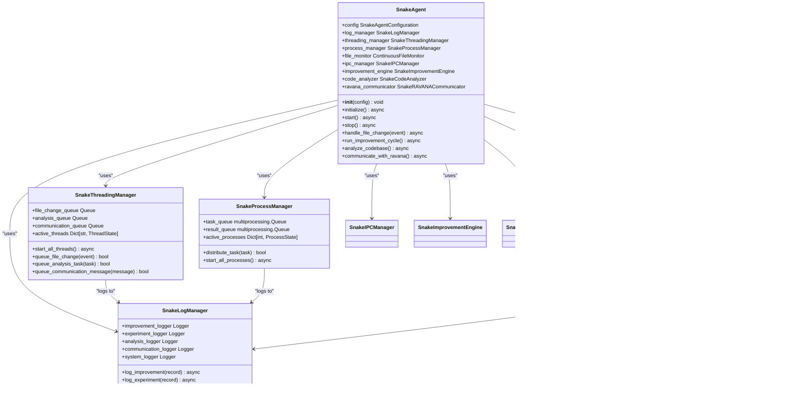

# AGISystem Orchestration

## Update Summary
**Changes Made**   
- Updated Conversational AI integration section with enhanced bot connectivity management and error handling
- Added detailed analysis of Conversational AI status monitoring and connection verification
- Enhanced performance considerations with new bot connection management strategies
- Updated troubleshooting guide with improved bot connectivity diagnostics
- Added new section for Conversational AI bot implementation details
- Updated class diagrams and sequence diagrams to reflect async task management changes
- Enhanced source tracking with new file references for bot implementation files

## Table of Contents
1. [Introduction](#introduction)
2. [Project Structure](#project-structure)
3. [Core Components](#core-components)
4. [Architecture Overview](#architecture-overview)
5. [Detailed Component Analysis](#detailed-component-analysis)
6. [Snake Agent Integration](#snake-agent-integration)
7. [Conversational AI Integration](#conversational-ai-integration)
8. [Dependency Analysis](#dependency-analysis)
9. [Performance Considerations](#performance-considerations)
10. [Troubleshooting Guide](#troubleshooting-guide)
11. [Conclusion](#conclusion)

## Introduction
The AGISystem class serves as the central orchestrator of the RAVANA framework, integrating multiple cognitive, emotional, and behavioral modules into a cohesive autonomous agent. This document provides a comprehensive analysis of the AGISystem's architecture, lifecycle management, state coordination, and interaction patterns. The system operates through an autonomous execution loop that combines mood-driven behavior modulation, adaptive learning, curiosity-driven exploration, and multi-step planning. It coordinates services for data, knowledge, memory, and multi-modal processing while maintaining shared state across all components. The design emphasizes modularity, resilience, and continuous self-improvement through reflection and experimentation. Recent updates have enhanced the system with integrated Snake Agent functionality for improved code analysis and self-improvement capabilities, as well as Conversational AI integration with enhanced bot connectivity management and error handling for more reliable cross-platform communication.

## Project Structure
The RAVANA project follows a modular architecture with clear separation of concerns. Core system functionality resides in the `core/` directory, while specialized cognitive capabilities are implemented as independent modules in the `modules/` directory. Services provide reusable business logic, and external integrations are managed through dedicated components. The structure supports both autonomous operation and task-specific execution modes. Recent updates have introduced a comprehensive Snake Agent subsystem with dedicated components for file monitoring, threading, process management, and logging, as well as a Conversational AI module with enhanced bot connectivity management, improved error handling, and connection status tracking.

**Diagram sources**
- [core/system.py](file://c:\Users\ASUS\Documents\GitHub\RAVANA/core/system.py#L34-L935)
- [core/state.py](file://c:\Users\ASUS\Documents\GitHub\RAVANA/core/state.py#L2-L29)
- [core/snake_agent.py](file://c:\Users\ASUS\Documents\GitHub\RAVANA/core/snake_agent.py#L1-L100)
- [modules/conversational_ai/main.py](file://c:\Users\ASUS\Documents\GitHub\RAVANA/modules/conversational_ai/main.py#L30-L326)

**Section sources**
- [core/system.py](file://c:\Users\ASUS\Documents\GitHub\RAVANA/core/system.py#L34-L935)
- [project_structure](file://#L1-L50)

## Core Components
The AGISystem integrates several key components that enable its autonomous behavior. The **SharedState** class maintains the system's current mood, situation, memories, and tasks, serving as the central data repository. The **EmotionalIntelligence** module processes action outcomes to update mood vectors and influence behavior. The **Personality** component provides creative ideation and ethical filtering. The **AdaptiveLearningEngine** analyzes decision patterns to generate performance improvement strategies. The **ActionManager** coordinates the execution of actions through a registry-based system. These components work together through the AGISystem orchestrator, which manages their initialization, coordination, and lifecycle. The recently added Snake Agent subsystem enhances these capabilities with specialized components for code analysis, self-improvement, and system monitoring. The Conversational AI module enables cross-platform communication through a dedicated communication bridge and platform-specific bots with enhanced connectivity management and error handling.

**Section sources**
- [core/system.py](file://c:\Users\ASUS\Documents\GitHub\RAVANA/core/system.py#L34-L935)
- [core/state.py](file://c:\Users\ASUS\Documents\GitHub\RAVANA/core/state.py#L2-L29)
- [modules/emotional_intellegence/emotional_intellegence.py](file://c:\Users\ASUS\Documents\GitHub\RAVANA/modules/emotional_intellegence/emotional_intellegence.py#L8-L66)
- [modules/personality/personality.py](file://c:\Users\ASUS\Documents\GitHub\RAVANA/modules/personality/personality.py#L6-L204)
- [modules/adaptive_learning/learning_engine.py](file://c:\Users\ASUS\Documents\GitHub\RAVANA/modules/adaptive_learning/learning_engine.py#L16-L354)

## Architecture Overview
The AGISystem follows a modular, event-driven architecture with a central control loop. It initializes all components during startup, then enters either an autonomous loop or task-specific execution mode. The system maintains shared state that is updated throughout each iteration. Background tasks handle data collection, event detection, knowledge compression, and memory consolidation. The main execution flow involves situation generation, memory retrieval, decision making, action execution, mood updating, and reflection. The enhanced architecture now includes the Snake Agent subsystem, which operates in parallel to monitor code changes, perform analysis, and drive self-improvement experiments, as well as the Conversational AI module that runs in a separate thread to handle user interactions across multiple platforms with improved connectivity management and error handling.

**Diagram sources**
- [core/system.py](file://c:\Users\ASUS\Documents\GitHub\RAVANA/core/system.py#L34-L935)
- [core/state.py](file://c:\Users\ASUS\Documents\GitHub\RAVANA/core/state.py#L2-L29)
- [modules/emotional_intellegence/emotional_intellegence.py](file://c:\Users\ASUS\Documents\GitHub\RAVANA/modules/emotional_intellegence/emotional_intellegence.py#L8-L66)
- [modules/conversational_ai/main.py](file://c:\Users\ASUS\Documents\GitHub\RAVANA/modules/conversational_ai/main.py#L30-L326)

## Detailed Component Analysis

### AGISystem Class Analysis
The AGISystem class serves as the central orchestrator, initializing and coordinating all modules, services, and state management components. It manages the system's lifecycle through startup, execution, and shutdown phases. The class has been enhanced to integrate the Snake Agent subsystem, which provides advanced code analysis and self-improvement capabilities, and the Conversational AI module, which enables cross-platform communication through a dedicated communication bridge with improved bot connectivity management and error handling.

#### Class Structure

**Diagram sources**
- [core/system.py](file://c:\Users\ASUS\Documents\GitHub\RAVANA/core/system.py#L34-L935)
- [core/state.py](file://c:\Users\ASUS\Documents\GitHub\RAVANA/core/state.py#L2-L29)
- [modules/conversational_ai/main.py](file://c:\Users\ASUS\Documents\GitHub\RAVANA/modules/conversational_ai/main.py#L30-L326)
- [modules/conversational_ai/communication/ravana_bridge.py](file://c:\Users\ASUS\Documents\GitHub\RAVANA/modules/conversational_ai/communication/ravana_bridge.py#L1-L411)

**Section sources**
- [core/system.py](file://c:\Users\ASUS\Documents\GitHub\RAVANA/core/system.py#L34-L935)

### Autonomous Execution Loop
The AGISystem operates through a sophisticated autonomous execution loop that integrates multiple cognitive processes. Each iteration follows a structured sequence of operations that enables autonomous decision-making and behavior. The loop now includes integration with the Snake Agent subsystem, which runs in parallel to monitor code changes and initiate self-improvement experiments, and the Conversational AI module, which runs in a separate thread to handle user interactions with enhanced connectivity management.

#### Execution Flow

**Diagram sources**
- [core/system.py](file://c:\Users\ASUS\Documents\GitHub\RAVANA/core/system.py#L34-L935)

**Section sources**
- [core/system.py](file://c:\Users\ASUS\Documents\GitHub\RAVANA/core/system.py#L34-L935)

### State Management System
The AGISystem uses a centralized state management approach through the SharedState class, which maintains all critical system variables and enables coordination between components.

#### State Structure

**Diagram sources**
- [core/state.py](file://c:\Users\ASUS\Documents\GitHub\RAVANA/core/state.py#L2-L29)
- [core/system.py](file://c:\Users\ASUS\Documents\GitHub\RAVANA/core/system.py#L34-L935)

**Section sources**
- [core/state.py](file://c:\Users\ASUS\Documents\GitHub\RAVANA/core/state.py#L2-L29)

### Emotional Intelligence Integration
The AGISystem integrates emotional processing through the EmotionalIntelligence module, which modulates behavior based on mood states and action outcomes.

#### Mood Processing Flow

**Diagram sources**
- [modules/emotional_intellegence/emotional_intellegence.py](file://c:\Users\ASUS\Documents\GitHub\RAVANA/modules/emotional_intellegence/emotional_intellegence.py#L8-L66)
- [modules/emotional_intellegence/mood_processor.py](file://c:\Users\ASUS\Documents\GitHub\RAVANA/modules/emotional_intellegence/mood_processor.py#L8-L103)

**Section sources**
- [modules/emotional_intellegence/emotional_intellegence.py](file://c:\Users\ASUS\Documents\GitHub\RAVANA/modules/emotional_intellegence/emotional_intellegence.py#L8-L66)
- [modules/emotional_intellegence/mood_processor.py](file://c:\Users\ASUS\Documents\GitHub\RAVANA/modules/emotional_intellegence/mood_processor.py#L8-L103)

### Adaptive Learning Mechanism
The AGISystem incorporates adaptive learning through the AdaptiveLearningEngine, which analyzes decision patterns and generates strategies for performance improvement.

#### Learning Workflow

**Diagram sources**
- [modules/adaptive_learning/learning_engine.py](file://c:\Users\ASUS\Documents\GitHub\RAVANA/modules/adaptive_learning/learning_engine.py#L16-L354)

**Section sources**
- [modules/adaptive_learning/learning_engine.py](file://c:\Users\ASUS\Documents\GitHub\RAVANA/modules/adaptive_learning/learning_engine.py#L16-L354)

## Snake Agent Integration
The AGISystem has been enhanced with the Snake Agent subsystem, which provides advanced code analysis, self-improvement, and system monitoring capabilities. This integration enables the system to continuously analyze its own codebase, detect changes, and initiate improvement experiments.

### Snake Agent Architecture
The Snake Agent subsystem consists of several coordinated components that work together to monitor, analyze, and improve the system:

**Diagram sources**
- [core/snake_agent.py](file://c:\Users\ASUS\Documents\GitHub\RAVANA/core/snake_agent.py#L1-L100)
- [core/snake_threading_manager.py](file://c:\Users\ASUS\Documents\GitHub\RAVANA/core/snake_threading_manager.py#L1-L733)
- [core/snake_process_manager.py](file://c:\Users\ASUS\Documents\GitHub\RAVANA/core/snake_process_manager.py#L1-L307)
- [core/snake_file_monitor.py](file://c:\Users\ASUS\Documents\GitHub\RAVANA/core/snake_file_monitor.py#L1-L574)
- [core/snake_log_manager.py](file://c:\Users\ASUS\Documents\GitHub\RAVANA/core/snake_log_manager.py#L1-L371)

**Section sources**
- [core/snake_agent.py](file://c:\Users\ASUS\Documents\GitHub\RAVANA/core/snake_agent.py#L1-L100)
- [core/snake_threading_manager.py](file://c:\Users\ASUS\Documents\GitHub\RAVANA/core/snake_threading_manager.py#L1-L733)
- [core/snake_process_manager.py](file://c:\Users\ASUS\Documents\GitHub\RAVANA/core/snake_process_manager.py#L1-L307)

### Snake Agent Initialization and Lifecycle
The Snake Agent follows a structured initialization and lifecycle management process that integrates with the main AGISystem. The agent is initialized during system startup and participates in the graceful shutdown sequence.

#### Initialization Flow

**Diagram sources**
- [core/snake_agent.py](file://c:\Users\ASUS\Documents\GitHub\RAVANA/core/snake_agent.py#L1-L100)
- [core/snake_threading_manager.py](file://c:\Users\ASUS\Documents\GitHub\RAVANA/core/snake_threading_manager.py#L25-L733)
- [core/snake_process_manager.py](file://c:\Users\ASUS\Documents\GitHub\RAVANA/core/snake_process_manager.py#L23-L307)
- [core/snake_file_monitor.py](file://c:\Users\ASUS\Documents\GitHub\RAVANA/core/snake_file_monitor.py#L58-L574)

**Section sources**
- [core/snake_agent.py](file://c:\Users\ASUS\Documents\GitHub\RAVANA/core/snake_agent.py#L1-L100)

### Snake Agent Component Integration
The Snake Agent components are tightly integrated with the main AGISystem through well-defined interfaces and callback mechanisms. This integration enables seamless coordination between the autonomous agent and its self-improvement subsystem.

#### Integration Points

**Diagram sources**
- [core/snake_agent.py](file://c:\Users\ASUS\Documents\GitHub\RAVANA/core/snake_agent.py#L1-L100)
- [core/snake_ipc_manager.py](file://c:\Users\ASUS\Documents\GitHub\RAVANA/core/snake_ipc_manager.py#L1-L200)
- [core/snake_improvement_engine.py](file://c:\Users\ASUS\Documents\GitHub\RAVANA/core/snake_improvement_engine.py#L1-L150)

**Section sources**
- [core/snake_agent.py](file://c:\Users\ASUS\Documents\GitHub\RAVANA/core/snake_agent.py#L1-L100)
- [core/snake_ipc_manager.py](file://c:\Users\ASUS\Documents\GitHub\RAVANA/core/snake_ipc_manager.py#L1-L200)

## Conversational AI Integration
The AGISystem has been enhanced with the Conversational AI module, which provides cross-platform communication capabilities through a dedicated communication bridge and platform-specific bots. This integration enables the system to interact with users on multiple platforms while maintaining emotional context and synchronizing with the main system. Recent updates have improved bot connectivity management with enhanced error handling, connection status tracking, and proper cleanup on shutdown.

### Conversational AI Architecture
The Conversational AI module consists of several coordinated components that work together to handle user interactions:

**Diagram sources**
- [modules/conversational_ai/main.py](file://c:\Users\ASUS\Documents\GitHub\RAVANA/modules/conversational_ai/main.py#L30-L326)
- [modules/conversational_ai/communication/ravana_bridge.py](file://c:\Users\ASUS\Documents\GitHub\RAVANA/modules/conversational_ai/communication/ravana_bridge.py#L1-L411)
- [modules/conversational_ai/memory/chat_history_manager.py](file://c:\Users\ASUS\Documents\GitHub\RAVANA/modules/conversational_ai/memory/chat_history_manager.py#L1-L200)
- [modules/conversational_ai/bots/discord_bot.py](file://c:\Users\ASUS\Documents\GitHub\RAVANA/modules/conversational_ai/bots/discord_bot.py#L1-L150)
- [modules/conversational_ai/bots/telegram_bot.py](file://c:\Users\ASUS\Documents\GitHub\RAVANA/modules/conversational_ai/bots/telegram_bot.py#L1-L150)

**Section sources**
- [modules/conversational_ai/main.py](file://c:\Users\ASUS\Documents\GitHub\RAVANA/modules/conversational_ai/main.py#L30-L326)
- [modules/conversational_ai/communication/ravana_bridge.py](file://c:\Users\ASUS\Documents\GitHub\RAVANA/modules/conversational_ai/communication/ravana_bridge.py#L1-L411)

### Conversational AI Initialization and Lifecycle
The Conversational AI module follows a structured initialization and lifecycle management process that integrates with the main AGISystem. The module is initialized during system startup and runs in a separate thread to handle user interactions while the main system continues its autonomous operations. The initialization process now includes enhanced error handling and connection status verification.

#### Initialization Flow

**Diagram sources**
- [core/system.py](file://c:\Users\ASUS\Documents\GitHub\RAVANA/core/system.py#L34-L935)
- [modules/conversational_ai/main.py](file://c:\Users\ASUS\Documents\GitHub\RAVANA/modules/conversational_ai/main.py#L30-L326)
- [modules/conversational_ai/communication/ravana_bridge.py](file://c:\Users\ASUS\Documents\GitHub\RAVANA/modules/conversational_ai/communication/ravana_bridge.py#L1-L411)

**Section sources**
- [core/system.py](file://c:\Users\ASUS\Documents\GitHub\RAVANA/core/system.py#L34-L935)
- [modules/conversational_ai/main.py](file://c:\Users\ASUS\Documents\GitHub\RAVANA/modules/conversational_ai/main.py#L30-L326)

### Conversational AI Component Integration
The Conversational AI components are tightly integrated with the main AGISystem through well-defined interfaces and callback mechanisms. This integration enables seamless coordination between user interactions and the main system's cognitive processes. The integration now includes enhanced status monitoring and connection verification.

#### Integration Points

**Diagram sources**
- [core/system.py](file://c:\Users\ASUS\Documents\GitHub\RAVANA/core/system.py#L34-L935)
- [modules/conversational_ai/main.py](file://c:\Users\ASUS\Documents\GitHub\RAVANA/modules/conversational_ai/main.py#L30-L326)
- [modules/conversational_ai/communication/ravana_bridge.py](file://c:\Users\ASUS\Documents\GitHub\RAVANA/modules/conversational_ai/communication/ravana_bridge.py#L1-L411)

**Section sources**
- [core/system.py](file://c:\Users\ASUS\Documents\GitHub\RAVANA/core/system.py#L34-L935)
- [modules/conversational_ai/main.py](file://c:\Users\ASUS\Documents\GitHub\RAVANA/modules/conversational_ai/main.py#L30-L326)

### Conversational AI Bot Implementation
The Conversational AI module implements platform-specific bots for Discord and Telegram with enhanced connectivity management and error handling. Each bot maintains connection status and handles graceful shutdown.

#### Bot Implementation Details

**Diagram sources**
- [modules/conversational_ai/bots/discord_bot.py](file://c:\Users\ASUS\Documents\GitHub\RAVANA/modules/conversational_ai/bots/discord_bot.py#L1-L225)
- [modules/conversational_ai/bots/telegram_bot.py](file://c:\Users\ASUS\Documents\GitHub\RAVANA/modules/conversational_ai/bots/telegram_bot.py#L1-L227)
- [modules/conversational_ai/main.py](file://c:\Users\ASUS\Documents\GitHub\RAVANA/modules/conversational_ai/main.py#L216-L245)

**Section sources**
- [modules/conversational_ai/bots/discord_bot.py](file://c:\Users\ASUS\Documents\GitHub\RAVANA/modules/conversational_ai/bots/discord_bot.py#L1-L225)
- [modules/conversational_ai/bots/telegram_bot.py](file://c:\Users\ASUS\Documents\GitHub\RAVANA/modules/conversational_ai/bots/telegram_bot.py#L1-L227)
- [modules/conversational_ai/main.py](file://c:\Users\ASUS\Documents\GitHub\RAVANA/modules/conversational_ai/main.py#L216-L245)

## Dependency Analysis
The AGISystem has a complex dependency graph that connects cognitive modules, services, and external systems. The core system depends on all modules and services, while modules maintain loose coupling through the shared state and event-based communication. The recent addition of the Snake Agent subsystem has introduced new dependencies for code analysis, process management, and system monitoring, while the Conversational AI module has added dependencies for cross-platform communication and user profile management with enhanced connectivity features.

**Diagram sources**
- [core/system.py](file://c:\Users\ASUS\Documents\GitHub\RAVANA/core/system.py#L34-L935)
- [modules/emotional_intellegence/emotional_intellegence.py](file://c:\Users\ASUS\Documents\GitHub\RAVANA/modules/emotional_intellegence/emotional_intellegence.py#L8-L66)
- [modules/adaptive_learning/learning_engine.py](file://c:\Users\ASUS\Documents\GitHub\RAVANA/modules/adaptive_learning/learning_engine.py#L16-L354)
- [core/snake_agent.py](file://c:\Users\ASUS\Documents\GitHub\RAVANA/core/snake_agent.py#L1-L100)
- [modules/conversational_ai/main.py](file://c:\Users\ASUS\Documents\GitHub\RAVANA/modules/conversational_ai/main.py#L30-L326)

**Section sources**
- [core/system.py](file://c:\Users\ASUS\Documents\GitHub\RAVANA/core/system.py#L34-L935)

## Performance Considerations
The AGISystem is designed for long-running operation with several performance optimization strategies. The system uses asynchronous execution to prevent blocking operations, with background tasks handling time-consuming processes like data collection and knowledge compression. Memory management is addressed through bounded collections (e.g., limiting search results to 10 items, decision history to 1000 entries) and periodic cleanup operations. The action manager implements caching with periodic clearing to balance performance and memory usage. The system also includes safeguards against infinite loops through maximum iteration limits in task mode. For high availability, the autonomous loop includes error handling with exponential backoff after critical errors. The database interactions are optimized through batch operations and connection pooling. The LLM interactions are managed through thread pooling to prevent overwhelming external APIs. The Snake Agent subsystem introduces additional performance considerations for multi-threaded and multi-process operations, while the Conversational AI module requires careful thread management to handle concurrent user interactions with enhanced connectivity monitoring.

### Snake Agent Performance Optimization
The Snake Agent subsystem employs several strategies to optimize performance while maintaining system stability:

**Diagram sources**
- [core/snake_threading_manager.py](file://c:\Users\ASUS\Documents\GitHub\RAVANA/core/snake_threading_manager.py#L25-L733)
- [core/snake_process_manager.py](file://c:\Users\ASUS\Documents\GitHub\RAVANA/core/snake_process_manager.py#L23-L307)
- [core/snake_file_monitor.py](file://c:\Users\ASUS\Documents\GitHub\RAVANA/core/snake_file_monitor.py#L58-L574)
- [core/snake_log_manager.py](file://c:\Users\ASUS\Documents\GitHub\RAVANA/core/snake_log_manager.py#L105-L371)

**Section sources**
- [core/snake_threading_manager.py](file://c:\Users\ASUS\Documents\GitHub\RAVANA/core/snake_threading_manager.py#L25-L733)
- [core/snake_process_manager.py](file://c:\Users\ASUS\Documents\GitHub\RAVANA/core/snake_process_manager.py#L23-L307)

### Conversational AI Performance Optimization
The Conversational AI module employs several strategies to optimize performance while maintaining responsiveness to user interactions:

**Diagram sources**
- [core/system.py](file://c:\Users\ASUS\Documents\GitHub\RAVANA/core/system.py#L34-L935)
- [modules/conversational_ai/main.py](file://c:\Users\ASUS\Documents\GitHub\RAVANA/modules/conversational_ai/main.py#L30-L326)
- [modules/conversational_ai/communication/ravana_bridge.py](file://c:\Users\ASUS\Documents\GitHub\RAVANA/modules/conversational_ai/communication/ravana_bridge.py#L1-L411)

**Section sources**
- [core/system.py](file://c:\Users\ASUS\Documents\GitHub\RAVANA/core/system.py#L34-L935)
- [modules/conversational_ai/main.py](file://c:\Users\ASUS\Documents\GitHub\RAVANA/modules/conversational_ai/main.py#L30-L326)

## Troubleshooting Guide
Common issues in the AGISystem typically fall into several categories with specific resolution strategies:

### Module Initialization Failures
**Symptoms**: System fails to start with configuration or dependency errors.
**Causes**: Missing configuration files, invalid JSON in config/persona files, or missing Python packages.
**Solutions**: 
- Verify all configuration files exist and contain valid JSON
- Check that required packages are installed via pip
- Ensure file paths in configuration are correct
- Validate that database connection parameters are accurate

### Race Conditions in Async Execution
**Symptoms**: Intermittent failures, data corruption, or inconsistent state.
**Causes**: Concurrent access to shared resources without proper synchronization.
**Solutions**:
- Use asyncio.Event for shutdown coordination
- Implement thread-safe database access with proper session management
- Avoid shared mutable state where possible
- Use asyncio locks for critical sections
- Ensure proper cleanup of background tasks during shutdown

### Unhandled Exception Recovery
**Symptoms**: System crashes or enters unstable state after unexpected errors.
**Mitigations**:
- Comprehensive try-catch blocks in all async loops
- Graceful degradation when components fail
- Error logging with full stack traces
- Automatic recovery with increased sleep intervals after critical errors
- Background task supervision with automatic restart

### Performance Degradation
**Symptoms**: Increasing memory usage, slowing response times, or task backlog.
**Solutions**:
- Monitor and adjust the LOOP_SLEEP_DURATION parameter
- Review database indexing for frequently queried tables
- Optimize LLM prompt sizes to reduce processing time
- Adjust the frequency of background tasks based on system load
- Implement more aggressive memory cleanup if needed

### Snake Agent-Specific Issues
**Symptoms**: Snake Agent components fail to start or process tasks.
**Causes**: Configuration issues, file permission problems, or resource limitations.
**Solutions**:
- Verify Snake Agent configuration parameters
- Check file system permissions for monitored directories
- Monitor system resources (CPU, memory) during operation
- Review Snake Agent logs in the snake_logs directory
- Ensure proper callback registration between components

### Conversational AI-Specific Issues
**Symptoms**: Conversational AI module fails to start or handle user interactions.
**Causes**: Configuration issues, platform token problems, or thread management errors.
**Solutions**:
- Verify Conversational AI configuration parameters
- Check platform tokens (Discord, Telegram) are valid
- Monitor thread status and ensure proper cleanup
- Review communication bridge logs for message processing issues
- Ensure proper initialization order between main system and Conversational AI
- Use the verification tool to test bot connectivity before starting the main system

**Section sources**
- [core/system.py](file://c:\Users\ASUS\Documents\GitHub\RAVANA/core/system.py#L34-L935)
- [modules/emotional_intellegence/emotional_intellegence.py](file://c:\Users\ASUS\Documents\GitHub\RAVANA/modules/emotional_intellegence/emotional_intellegence.py#L8-L66)
- [core/snake_agent.py](file://c:\Users\ASUS\Documents\GitHub\RAVANA/core/snake_agent.py#L1-L100)
- [modules/conversational_ai/main.py](file://c:\Users\ASUS\Documents\GitHub\RAVANA/modules/conversational_ai/main.py#L30-L326)

## Conclusion
The AGISystem represents a sophisticated orchestration framework that integrates multiple cognitive, emotional, and behavioral modules into a cohesive autonomous agent. Its architecture emphasizes modularity, resilience, and continuous self-improvement through adaptive learning and reflection. The system successfully coordinates complex interactions between emotional processing, personality traits, memory management, and decision making. The implementation demonstrates effective patterns for asynchronous execution, state management, and error recovery in long-running AI systems. The recent enhancement with the Snake Agent subsystem adds powerful capabilities for code analysis, self-improvement, and system monitoring, enabling the agent to continuously evolve and optimize its own functionality. The integration of the Conversational AI module enables cross-platform communication through a dedicated communication bridge and platform-specific bots, allowing the system to interact with users while maintaining emotional context and synchronizing with the main system. Recent improvements to the Conversational AI module have enhanced bot connectivity management with better error handling, connection status tracking, and proper cleanup on shutdown. Future enhancements could include more sophisticated mood modeling, improved plan execution tracking, and enhanced integration between the learning engine and decision making processes. The current design provides a robust foundation for autonomous operation while maintaining flexibility for task-specific execution.

**Referenced Files in This Document**   
- [core/system.py](file://c:\Users\ASUS\Documents\GitHub\RAVANA/core/system.py) - *Updated in recent commit with enhanced Snake Agent integration*
- [core/state.py](file://c:\Users\ASUS\Documents\GitHub\RAVANA/core/state.py)
- [modules/emotional_intellegence/emotional_intellegence.py](file://c:\Users\ASUS\Documents\GitHub\RAVANA/modules/emotional_intellegence/emotional_intellegence.py)
- [modules/emotional_intellegence/mood_processor.py](file://c:\Users\ASUS\Documents\GitHub\RAVANA/modules/emotional_intellegence/mood_processor.py)
- [modules/personality/personality.py](file://c:\Users\ASUS\Documents\GitHub\RAVANA/modules/personality/personality.py)
- [modules/adaptive_learning/learning_engine.py](file://c:\Users\ASUS\Documents\GitHub\RAVANA/modules/adaptive_learning/learning_engine.py)
- [core/action_manager.py](file://c:\Users\ASUS\Documents\GitHub\RAVANA/core/action_manager.py)
- [modules/decision_engine/decision_maker.py](file://c:\Users\ASUS\Documents\GitHub\RAVANA/modules/decision_engine/decision_maker.py)
- [core/snake_agent.py](file://c:\Users\ASUS\Documents\GitHub\RAVANA/core/snake_agent.py) - *Added in recent commit*
- [core/snake_threading_manager.py](file://c:\Users\ASUS\Documents\GitHub\RAVANA/core/snake_threading_manager.py) - *Added in recent commit*
- [core/snake_process_manager.py](file://c:\Users\ASUS\Documents\GitHub\RAVANA/core/snake_process_manager.py) - *Added in recent commit*
- [core/snake_file_monitor.py](file://c:\Users\ASUS\Documents\GitHub\RAVANA/core/snake_file_monitor.py) - *Added in recent commit*
- [core/snake_log_manager.py](file://c:\Users\ASUS\Documents\GitHub\RAVANA/core/snake_log_manager.py) - *Added in recent commit*
- [modules/conversational_ai/main.py](file://c:\Users\ASUS\Documents\GitHub\RAVANA/modules/conversational_ai/main.py) - *Updated in recent commit with improved bot connectivity management*
- [modules/conversational_ai/bots/discord_bot.py](file://c:\Users\ASUS\Documents\GitHub\RAVANA/modules/conversational_ai/bots/discord_bot.py) - *Updated in recent commit with enhanced error handling*
- [modules/conversational_ai/bots/telegram_bot.py](file://c:\Users\ASUS\Documents\GitHub\RAVANA/modules/conversational_ai/bots/telegram_bot.py) - *Updated in recent commit with enhanced error handling*
- [core/config.py](file://c:\Users\ASUS\Documents\GitHub\RAVANA/core/config.py) - *Configuration settings for system components*
