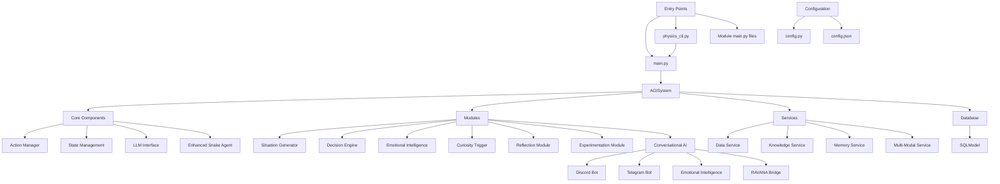
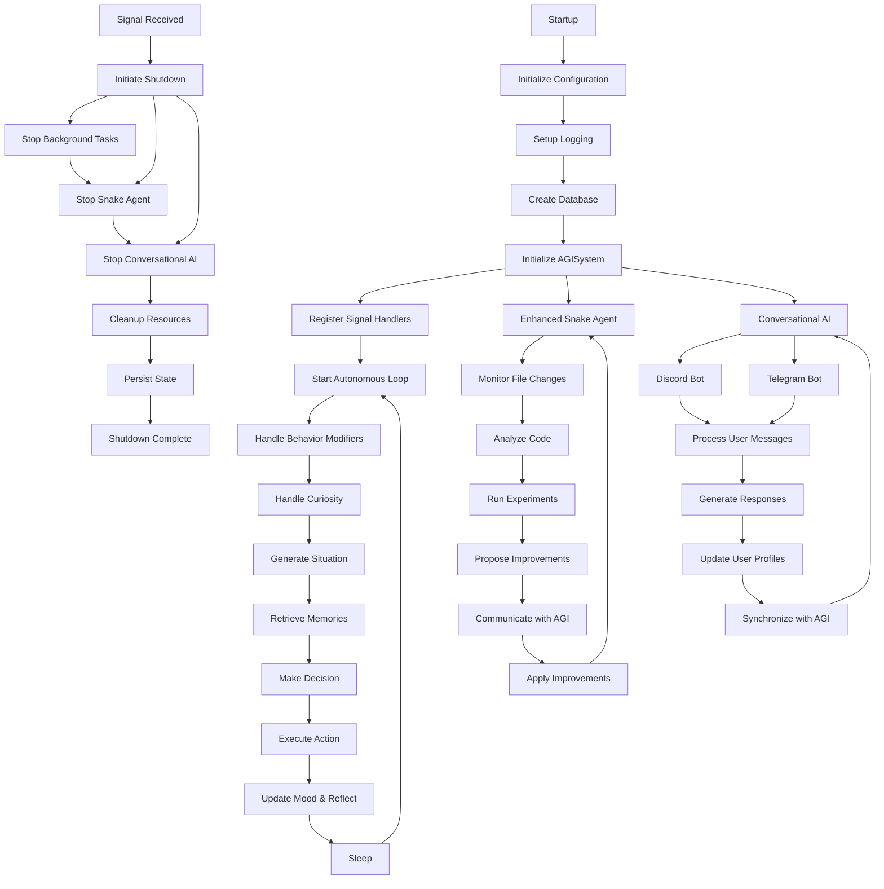
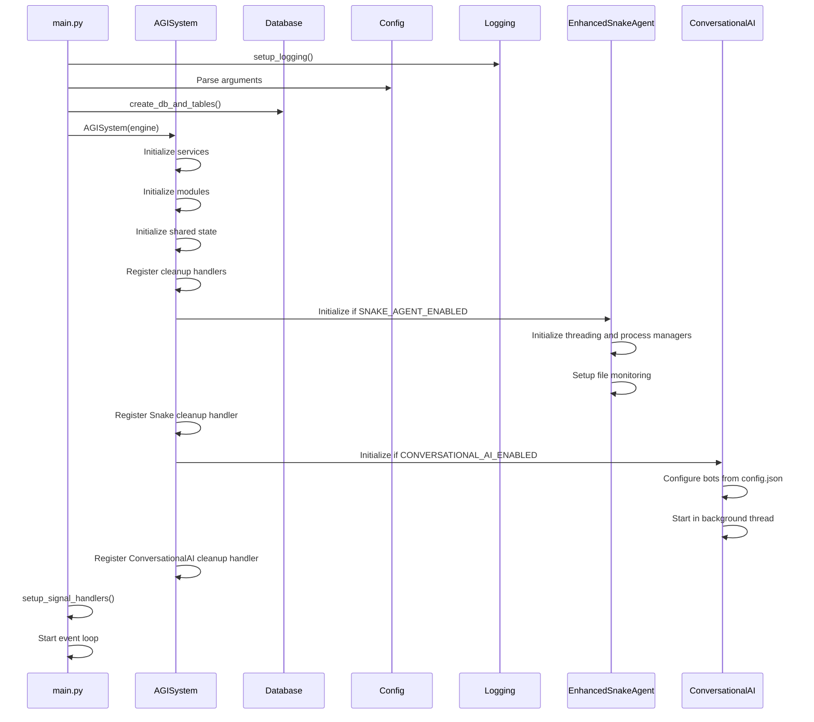
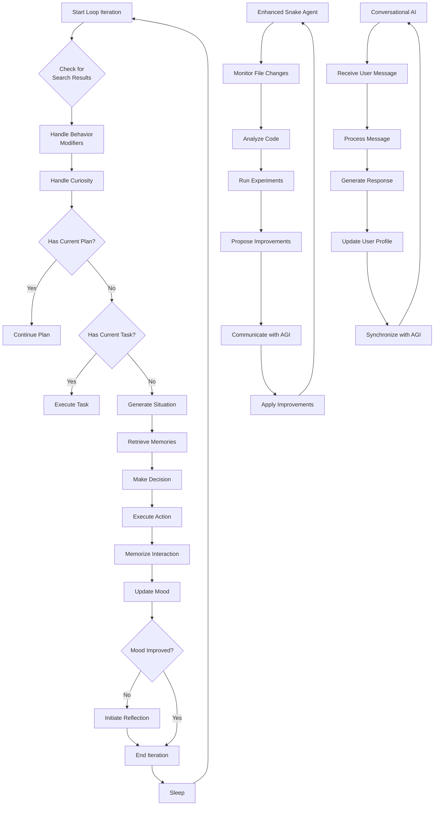
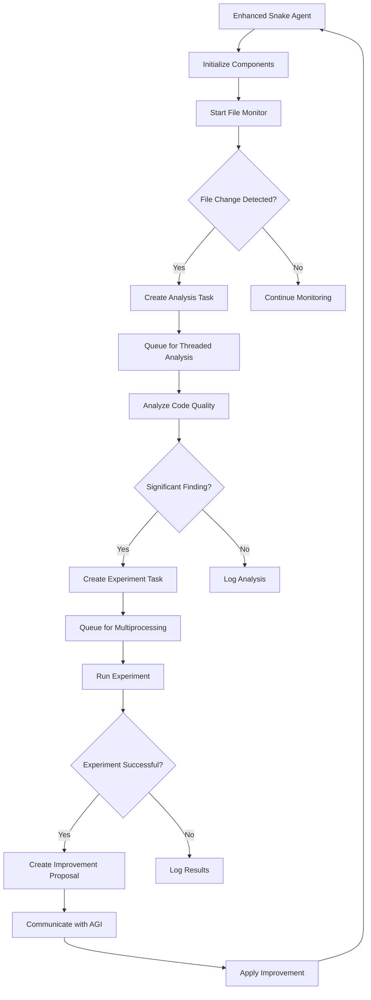
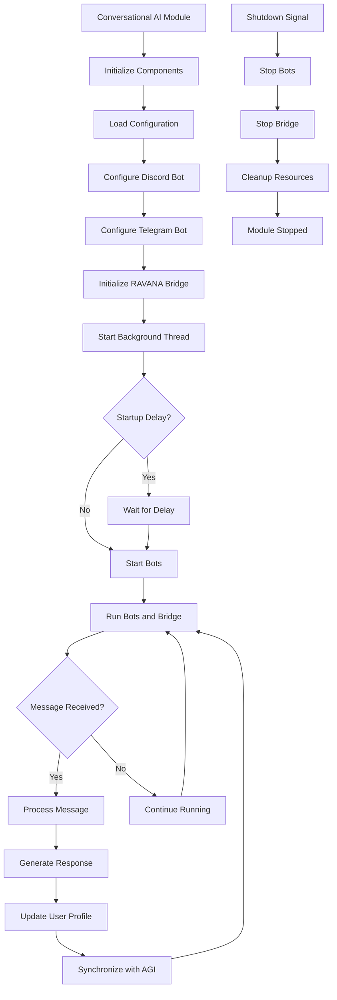
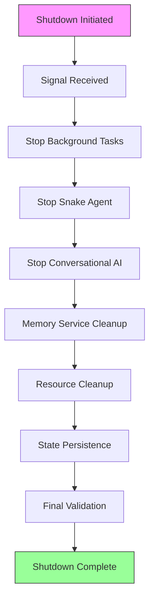
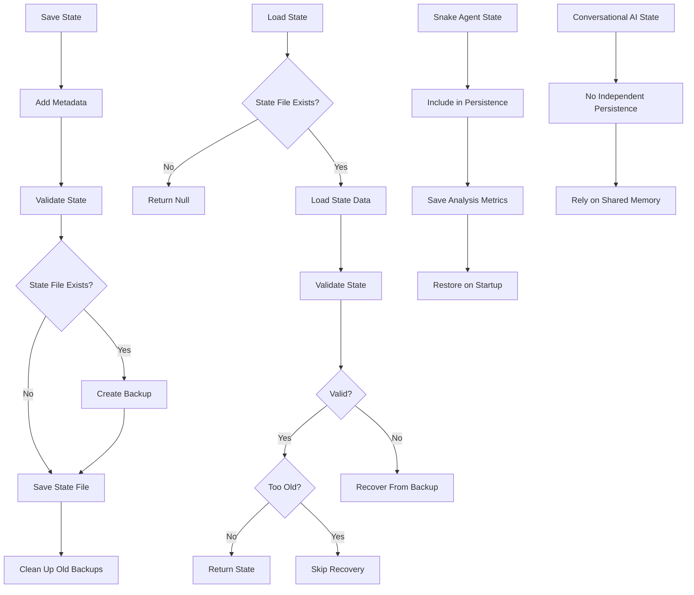
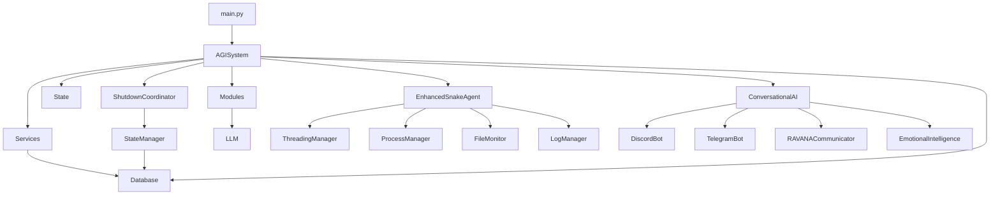

# Execution Lifecycle

## Update Summary
**Changes Made**   
- Updated documentation to reflect integration of the enhanced Snake Agent into the autonomous execution loop
- Added new section on Snake Agent initialization, operation, and shutdown coordination
- Enhanced state persistence section to include Snake Agent state recovery
- Updated architecture overview and autonomous loop diagrams to reflect Snake Agent integration
- Added configuration details for Snake Agent in performance considerations
- Updated troubleshooting guide with Snake Agent-specific issues
- Added documentation for Conversational AI module integration with threaded background execution
- Updated system initialization section to include Conversational AI startup process
- Added new configuration parameters for Conversational AI module
- Updated architecture diagrams to include Conversational AI component
- Incorporated recent changes to shutdown coordination, including enhanced phase management and improved bot connectivity handling

## Table of Contents
1. [Introduction](#introduction)
2. [Project Structure](#project-structure)
3. [Core Components](#core-components)
4. [Architecture Overview](#architecture-overview)
5. [Detailed Component Analysis](#detailed-component-analysis)
6. [Dependency Analysis](#dependency-analysis)
7. [Performance Considerations](#performance-considerations)
8. [Troubleshooting Guide](#troubleshooting-guide)
9. [Conclusion](#conclusion)

## Introduction
This document provides a comprehensive analysis of the execution lifecycle of the RAVANA AGI system, covering startup, main loop operation, and graceful shutdown procedures. The system is designed as a modular, autonomous agent with self-reflection, decision-making, and experimentation capabilities. The lifecycle is managed through a central `AGISystem` class that orchestrates initialization, continuous operation via an autonomous loop, and controlled termination with state persistence. Multiple entry points support different operational modes, including continuous autonomous operation, single-task execution, physics experimentation, and CLI-driven workflows. This update specifically addresses the integration of the enhanced Snake Agent into the system's execution lifecycle and the addition of threaded background execution for the Conversational AI module.

## Project Structure
The RAVANA project follows a modular architecture with clear separation of concerns. The core system logic resides in the `core/` directory, while specialized cognitive functions are implemented as independent modules in the `modules/` directory. Services for data, memory, knowledge, and multi-modal processing are located in the `services/` directory. The system supports multiple entry points: `main.py` for general operation, `physics_cli.py` for physics experimentation, and various module-specific `main.py` files for isolated execution. The enhanced Snake Agent is implemented in `core/snake_agent_enhanced.py` and integrated into the main system through configuration. The Conversational AI module is located in `modules/conversational_ai/` and provides independent conversational capabilities through Discord and Telegram.

**Diagram sources**
- [main.py](file://c:/Users/ASUS/Documents/GitHub/RAVANA/main.py)
- [core/system.py](file://c:/Users/ASUS/Documents/GitHub/RAVANA/core/system.py)
- [core/config.py](file://c:/Users/ASUS/Documents/GitHub/RAVANA/core/config.py)
- [core/snake_agent_enhanced.py](file://c:/Users/ASUS/Documents/GitHub/RAVANA/core/snake_agent_enhanced.py)
- [modules/conversational_ai/main.py](file://c:/Users/ASUS/Documents/GitHub/RAVANA/modules/conversational_ai/main.py)

## Core Components
The execution lifecycle is governed by several core components that work together to initialize, operate, and terminate the AGI system. The `AGISystem` class serves as the central orchestrator, managing the autonomous loop, state, and inter-module communication. The `ShutdownCoordinator` ensures graceful termination with resource cleanup and state persistence. The `StateManager` provides enhanced state recovery capabilities, while the `SharedState` class encapsulates the AGI's cognitive state including mood, memories, and current tasks. The enhanced Snake Agent has been integrated as a core component that operates concurrently with the main AGI system to analyze, experiment, and improve the system. The Conversational AI module has been integrated to run in a background thread, providing independent conversational capabilities while sharing the same memory infrastructure.

**Section sources**
- [core/system.py](file://c:/Users/ASUS/Documents/GitHub/RAVANA/core/system.py#L35-L708)
- [core/shutdown_coordinator.py](file://c:/Users/ASUS/Documents/GitHub/RAVANA/core/shutdown_coordinator.py#L33-L486)
- [core/state_manager.py](file://c:/Users/ASUS/Documents/GitHub/RAVANA/core/state_manager.py#L0-L281)
- [core/state.py](file://c:/Users/ASUS/Documents/GitHub/RAVANA/core/state.py#L0-L30)
- [core/snake_agent_enhanced.py](file://c:/Users/ASUS/Documents/GitHub/RAVANA/core/snake_agent_enhanced.py#L0-L621)
- [modules/conversational_ai/main.py](file://c:/Users/ASUS/Documents/GitHub/RAVANA/modules/conversational_ai/main.py#L0-L332)

## Architecture Overview
The RAVANA AGI system follows a modular, event-driven architecture centered around the `AGISystem` class. The system initializes by loading configuration, setting up services and modules, and establishing database connections. Once initialized, it enters an autonomous loop that continuously cycles through cognitive processes. The loop can operate in continuous mode or be directed toward specific tasks. A sophisticated shutdown coordination system manages termination, ensuring proper cleanup of resources and persistence of state. The enhanced Snake Agent operates as a parallel autonomous system that monitors the codebase, performs analysis, and proposes improvements through concurrent threading and multiprocessing. The Conversational AI module runs in a background thread, providing independent conversational capabilities through Discord and Telegram while sharing the same memory infrastructure and communicating with the main AGI system.

**Diagram sources**
- [main.py](file://c:/Users/ASUS/Documents/GitHub/RAVANA/main.py#L223-L252)
- [core/system.py](file://c:/Users/ASUS/Documents/GitHub/RAVANA/core/system.py#L35-L708)
- [core/shutdown_coordinator.py](file://c:/Users/ASUS/Documents/GitHub/RAVANA/core/shutdown_coordinator.py#L33-L486)
- [core/snake_agent_enhanced.py](file://c:/Users/ASUS/Documents/GitHub/RAVANA/core/snake_agent_enhanced.py#L0-L621)
- [modules/conversational_ai/main.py](file://c:/Users/ASUS/Documents/GitHub/RAVANA/modules/conversational_ai/main.py#L0-L332)

## Detailed Component Analysis

### System Initialization and Startup
The system startup process begins with the execution of `main.py`, which sets up logging, parses command-line arguments, and initializes the database. The `AGISystem` is then instantiated with the database engine, triggering the initialization of all core services, modules, and the shared state. Signal handlers are registered to enable graceful shutdown on interruption. The enhanced Snake Agent is conditionally initialized based on configuration settings and integrated into the system's background tasks. The Conversational AI module is also conditionally initialized and started in a background thread with a configurable delay, allowing the main system to initialize first.

**Diagram sources**
- [main.py](file://c:/Users/ASUS/Documents/GitHub/RAVANA/main.py#L223-L252)
- [core/system.py](file://c:/Users/ASUS/Documents/GitHub/RAVANA/core/system.py#L35-L150)
- [core/snake_agent_enhanced.py](file://c:/Users/ASUS/Documents/GitHub/RAVANA/core/snake_agent_enhanced.py#L0-L199)
- [modules/conversational_ai/main.py](file://c:/Users/ASUS/Documents/GitHub/RAVANA/modules/conversational_ai/main.py#L0-L199)

**Section sources**
- [main.py](file://c:/Users/ASUS/Documents/GitHub/RAVANA/main.py#L0-L199)
- [core/system.py](file://c:/Users/ASUS/Documents/GitHub/RAVANA/core/system.py#L35-L150)
- [core/snake_agent_enhanced.py](file://c:/Users/ASUS/Documents/GitHub/RAVANA/core/snake_agent_enhanced.py#L0-L199)
- [modules/conversational_ai/main.py](file://c:/Users/ASUS/Documents/GitHub/RAVANA/modules/conversational_ai/main.py#L0-L199)

### Autonomous Loop Operation
The autonomous loop is the core processing cycle of the AGI system, implemented in the `run_autonomous_loop` method of the `AGISystem` class. The loop executes a series of cognitive phases in each iteration, creating a continuous cycle of perception, decision-making, action, and reflection. The loop continues until a shutdown signal is received. The enhanced Snake Agent operates as a parallel autonomous system that runs concurrently with the main loop, performing continuous code analysis and improvement. The Conversational AI module runs independently in a background thread, handling user interactions through Discord and Telegram while synchronizing emotional context and insights with the main AGI system.

#### Autonomous Loop Phases

**Diagram sources**
- [core/system.py](file://c:/Users/ASUS/Documents/GitHub/RAVANA/core/system.py#L500-L550)
- [DEVELOPER_GUIDE.md](file://c:/Users/ASUS/Documents/GitHub/RAVANA/DEVELOPER_GUIDE.md#L128-L146)
- [core/snake_agent_enhanced.py](file://c:/Users/ASUS/Documents/GitHub/RAVANA/core/snake_agent_enhanced.py#L0-L621)
- [modules/conversational_ai/main.py](file://c:/Users/ASUS/Documents/GitHub/RAVANA/modules/conversational_ai/main.py#L0-L332)

**Section sources**
- [core/system.py](file://c:/Users/ASUS/Documents/GitHub/RAVANA/core/system.py#L500-L550)
- [DEVELOPER_GUIDE.md](file://c:/Users/ASUS/Documents/GitHub/RAVANA/DEVELOPER_GUIDE.md#L128-L146)
- [core/snake_agent_enhanced.py](file://c:/Users/ASUS/Documents/GitHub/RAVANA/core/snake_agent_enhanced.py#L0-L621)
- [modules/conversational_ai/main.py](file://c:/Users/ASUS/Documents/GitHub/RAVANA/modules/conversational_ai/main.py#L0-L332)

### Enhanced Snake Agent Integration
The enhanced Snake Agent is a specialized component that operates concurrently with the main AGI system to continuously analyze, experiment, and improve the codebase. It uses a combination of threading and multiprocessing to perform parallel analysis and experimentation. The agent monitors file changes, analyzes code quality, runs experiments, and proposes improvements through a structured communication protocol with the main AGI system.

**Diagram sources**
- [core/snake_agent_enhanced.py](file://c:/Users/ASUS/Documents/GitHub/RAVANA/core/snake_agent_enhanced.py#L0-L621)
- [core/system.py](file://c:/Users/ASUS/Documents/GitHub/RAVANA/core/system.py#L150-L200)

**Section sources**
- [core/snake_agent_enhanced.py](file://c:/Users/ASUS/Documents/GitHub/RAVANA/core/snake_agent_enhanced.py#L0-L621)
- [core/system.py](file://c:/Users/ASUS/Documents/GitHub/RAVANA/core/system.py#L150-L200)

### Conversational AI Module Integration
The Conversational AI module provides independent conversational capabilities through Discord and Telegram while sharing the same memory infrastructure as the main AGI system. The module runs in a background thread with a configurable startup delay, allowing the main system to initialize first. It uses a shared memory interface to maintain consistent personality and knowledge across platforms. The module can communicate with the main AGI system through a RAVANA communication bridge, enabling task delegation, proactive messaging, and status updates.

**Diagram sources**
- [modules/conversational_ai/main.py](file://c:/Users/ASUS/Documents/GitHub/RAVANA/modules/conversational_ai/main.py#L0-L332)
- [core/system.py](file://c:/Users/ASUS/Documents/GitHub/RAVANA/core/system.py#L310-L332)

**Section sources**
- [modules/conversational_ai/main.py](file://c:/Users/ASUS/Documents/GitHub/RAVANA/modules/conversational_ai/main.py#L0-L332)
- [core/system.py](file://c:/Users/ASUS/Documents/GitHub/RAVANA/core/system.py#L310-L332)

### Shutdown Coordination and Resource Cleanup
The graceful shutdown process is managed by the `ShutdownCoordinator` class, which executes a series of phases to ensure proper cleanup of resources and persistence of state. The coordinator handles shutdown signals, stops background tasks, performs resource cleanup, and persists the system state before termination. The enhanced Snake Agent is integrated into this process with a dedicated cleanup handler that ensures proper shutdown of its threading and multiprocessing components. The Conversational AI module is also integrated into the shutdown process, with a dedicated cleanup handler that ensures proper shutdown of its background thread and bot interfaces.

**Diagram sources**
- [core/shutdown_coordinator.py](file://c:/Users/ASUS/Documents/GitHub/RAVANA/core/shutdown_coordinator.py#L33-L486)
- [core/snake_agent_enhanced.py](file://c:/Users/ASUS/Documents/GitHub/RAVANA/core/snake_agent_enhanced.py#L500-L621)
- [modules/conversational_ai/main.py](file://c:/Users/ASUS/Documents/GitHub/RAVANA/modules/conversational_ai/main.py#L200-L332)

**Section sources**
- [core/shutdown_coordinator.py](file://c:/Users/ASUS/Documents/GitHub/RAVANA/core/shutdown_coordinator.py#L33-L486)
- [core/snake_agent_enhanced.py](file://c:/Users/ASUS/Documents/GitHub/RAVANA/core/snake_agent_enhanced.py#L500-L621)
- [modules/conversational_ai/main.py](file://c:/Users/ASUS/Documents/GitHub/RAVANA/modules/conversational_ai/main.py#L200-L332)

### State Persistence and Recovery
The system implements robust state persistence and recovery mechanisms through the `StateManager` and `ShutdownCoordinator` classes. State is saved during shutdown and can be recovered on startup, allowing the AGI to resume its cognitive state across sessions. The system creates backups and validates state data to ensure integrity. The enhanced Snake Agent state is now included in the persistence process, allowing it to maintain its analysis metrics and operational state across restarts. The Conversational AI module does not persist its state independently, as it relies on the shared memory infrastructure for user profiles and conversation history.

**Diagram sources**
- [core/state_manager.py](file://c:/Users/ASUS/Documents/GitHub/RAVANA/core/state_manager.py#L0-L281)
- [core/shutdown_coordinator.py](file://c:/Users/ASUS/Documents/GitHub/RAVANA/core/shutdown_coordinator.py#L400-L501)
- [modules/conversational_ai/memory/memory_interface.py](file://c:/Users/ASUS/Documents/GitHub/RAVANA/modules/conversational_ai/memory/memory_interface.py)

**Section sources**
- [core/state_manager.py](file://c:/Users/ASUS/Documents/GitHub/RAVANA/core/state_manager.py#L0-L281)
- [core/system.py](file://c:/Users/ASUS/Documents/GitHub/RAVANA/core/system.py#L227-L251)
- [core/shutdown_coordinator.py](file://c:/Users/ASUS/Documents/GitHub/RAVANA/core/shutdown_coordinator.py#L400-L501)
- [modules/conversational_ai/memory/memory_interface.py](file://c:/Users/ASUS/Documents/GitHub/RAVANA/modules/conversational_ai/memory/memory_interface.py)

## Dependency Analysis
The execution lifecycle components are interconnected through a well-defined dependency structure. The `main.py` entry point depends on the `AGISystem` class, which in turn depends on various services, modules, and the shutdown coordinator. The shutdown coordinator depends on the state manager for state persistence, creating a hierarchical dependency chain that ensures proper initialization and cleanup order. The enhanced Snake Agent is now integrated into this dependency structure, with the AGISystem depending on it when enabled, and the shutdown coordinator depending on the Snake Agent for proper cleanup. The Conversational AI module is also integrated into this dependency structure, with the AGISystem depending on it when enabled, and the shutdown coordinator depending on the Conversational AI module for proper cleanup.

**Diagram sources**
- [main.py](file://c:/Users/ASUS/Documents/GitHub/RAVANA/main.py)
- [core/system.py](file://c:/Users/ASUS/Documents/GitHub/RAVANA/core/system.py)
- [core/shutdown_coordinator.py](file://c:/Users/ASUS/Documents/GitHub/RAVANA/core/shutdown_coordinator.py)
- [core/state_manager.py](file://c:/Users/ASUS/Documents/GitHub/RAVANA/core/state_manager.py)
- [core/snake_agent_enhanced.py](file://c:/Users/ASUS/Documents/GitHub/RAVANA/core/snake_agent_enhanced.py)
- [modules/conversational_ai/main.py](file://c:/Users/ASUS/Documents/GitHub/RAVANA/modules/conversational_ai/main.py)

**Section sources**
- [main.py](file://c:/Users/ASUS/Documents/GitHub/RAVANA/main.py)
- [core/system.py](file://c:/Users/ASUS/Documents/GitHub/RAVANA/core/system.py)
- [core/snake_agent_enhanced.py](file://c:/Users/ASUS/Documents/GitHub/RAVANA/core/snake_agent_enhanced.py)
- [modules/conversational_ai/main.py](file://c:/Users/ASUS/Documents/GitHub/RAVANA/modules/conversational_ai/main.py)

## Performance Considerations
The system's performance is influenced by several configuration parameters that control the execution lifecycle. The `LOOP_SLEEP_DURATION` setting determines the frequency of loop iterations, with a default of 10 seconds. Background tasks run on configurable intervals, preventing resource contention. The shutdown process has configurable timeouts (`SHUTDOWN_TIMEOUT` and `FORCE_SHUTDOWN_AFTER`) that balance graceful termination with timely exit. State persistence operations are optimized with backup management and file cleanup to prevent disk space issues. The enhanced Snake Agent introduces additional configuration parameters that affect performance, including threading and multiprocessing limits. The Conversational AI module introduces additional configuration parameters that affect performance, including startup delay and bot configuration.

**Enhanced Snake Agent Configuration Parameters:**
- `SNAKE_AGENT_ENABLED`: Enables or disables the Snake Agent
- `SNAKE_ENHANCED_MODE`: Enables enhanced mode with threading and multiprocessing
- `SNAKE_MAX_THREADS`: Maximum number of threads for analysis tasks
- `SNAKE_MAX_PROCESSES`: Maximum number of processes for experimentation
- `SNAKE_MONITOR_INTERVAL`: Interval for file monitoring in seconds
- `SNAKE_PERF_MONITORING`: Enables performance monitoring and metrics logging
- `SNAKE_AUTO_RECOVERY`: Enables automatic recovery from failures
- `SNAKE_LOG_RETENTION_DAYS`: Number of days to retain logs

**Conversational AI Configuration Parameters:**
- `CONVERSATIONAL_AI_ENABLED`: Enables or disables the Conversational AI module
- `CONVERSATIONAL_AI_START_DELAY`: Delay in seconds before starting the Conversational AI module
- `DISCORD_TOKEN`: Authentication token for Discord bot
- `TELEGRAM_TOKEN`: Authentication token for Telegram bot
- `PLATFORMS`: Configuration for enabling/disabling specific platforms
- `COMMAND_PREFIX`: Command prefix for each platform

**Section sources**
- [core/config.py](file://c:/Users/ASUS/Documents/GitHub/RAVANA/core/config.py#L0-L60)
- [core/snake_agent_enhanced.py](file://c:/Users/ASUS/Documents/GitHub/RAVANA/core/snake_agent_enhanced.py#L0-L621)
- [modules/conversational_ai/config.json](file://c:/Users/ASUS/Documents/GitHub/RAVANA/modules/conversational_ai/config.json)
- [core/config.py](file://c:/Users/ASUS/Documents/GitHub/RAVANA/core/config.py#L171-L172)

## Troubleshooting Guide
This section addresses common issues related to the execution lifecycle and provides solutions.

### Improper Shutdown Leading to Data Loss
**Issue**: The system terminates without properly saving state, leading to loss of recent cognitive state.
**Solution**: Ensure `STATE_PERSISTENCE_ENABLED` is set to `True` in the configuration. Verify that the shutdown coordinator completes all phases by checking logs for "Shutdown complete" messages. If using environment variables, ensure `STATE_PERSISTENCE_ENABLED=true`. Check that the Snake Agent state is being persisted by looking for "Snake Agent state collected for persistence" in the logs.

### Infinite Loops in Decision Making
**Issue**: The AGI system enters an infinite loop during task execution, consuming excessive resources.
**Solution**: The system has a built-in safeguard with `MAX_ITERATIONS` (default 10) that limits single-task execution. For autonomous operation, ensure the mood system is functioning properly, as mood improvement triggers can help break cycles. Monitor the `current_plan` and `current_task_prompt` state variables to identify stuck workflows. Check Snake Agent logs for any runaway analysis or experimentation tasks.

### Failure to Release Database Connections
**Issue**: Database connections remain open after shutdown, potentially causing connection pool exhaustion.
**Solution**: The system registers a cleanup handler (`_cleanup_database_session`) with the shutdown coordinator that explicitly closes the database session. Ensure this handler is called by verifying the log message "Database session closed" during shutdown. If connections persist, check for any unhandled exceptions in the cleanup process. The Snake Agent also has its own database connections that are closed during shutdown.

### State Recovery Failures
**Issue**: The system fails to recover previous state on startup.
**Solution**: The state manager validates state files and checks their age (older than 24 hours are discarded). Ensure the state file (`shutdown_state.json` by default) exists and is not corrupted. Check logs for validation errors. The system attempts recovery from backups if the primary state file fails validation. For Snake Agent state recovery, ensure the `enhanced_snake_state.json` file exists and is not corrupted.

### Snake Agent Initialization Failures
**Issue**: The enhanced Snake Agent fails to initialize, preventing code analysis and improvement.
**Solution**: Check that `SNAKE_AGENT_ENABLED` is set to `True` in the configuration. Verify that the required dependencies are installed. Check the logs for errors during initialization. The system will attempt to fall back to the standard Snake Agent if the enhanced version fails to initialize. Ensure that the Ollama server is running and accessible at the configured URL.

### Conversational AI Module Initialization Failures
**Issue**: The Conversational AI module fails to initialize, preventing user interactions through Discord and Telegram.
**Solution**: Check that `CONVERSATIONAL_AI_ENABLED` is set to `True` in the configuration. Verify that the required dependencies are installed. Check the logs for errors during initialization. Ensure that the Discord and Telegram tokens are correctly configured in `modules/conversational_ai/config.json`. Verify that the RAVANA communication bridge is functioning properly. Check that the shared memory infrastructure is accessible.

**Section sources**
- [core/shutdown_coordinator.py](file://c:/Users/ASUS/Documents/GitHub/RAVANA/core/shutdown_coordinator.py)
- [core/state_manager.py](file://c:/Users/ASUS/Documents/GitHub/RAVANA/core/state_manager.py)
- [core/system.py](file://c:/Users/ASUS/Documents/GitHub/RAVANA/core/system.py)
- [core/snake_agent_enhanced.py](file://c:/Users/ASUS/Documents/GitHub/RAVANA/core/snake_agent_enhanced.py)
- [modules/conversational_ai/main.py](file://c:/Users/ASUS/Documents/GitHub/RAVANA/modules/conversational_ai/main.py)

## Conclusion
The RAVANA AGI system implements a robust execution lifecycle with well-defined startup, operation, and shutdown phases. The modular architecture allows for flexible operation modes while maintaining system integrity. The autonomous loop provides continuous cognitive processing, while the shutdown coordinator ensures graceful termination with proper resource cleanup and state persistence. Multiple entry points support different use cases, from continuous autonomous operation to targeted experimentation. The system's design prioritizes reliability and data integrity, with comprehensive error handling and recovery mechanisms throughout the execution lifecycle. The integration of the enhanced Snake Agent adds a powerful layer of continuous self-improvement through concurrent analysis, experimentation, and improvement, making the system more adaptive and resilient over time. The addition of the Conversational AI module with threaded background execution enhances the system's capabilities by providing independent conversational interfaces through Discord and Telegram while maintaining integration with the main AGI system through shared memory and a communication bridge.

**Referenced Files in This Document**   
- [main.py](file://c:/Users/ASUS/Documents/GitHub/RAVANA/main.py) - *Updated in recent commit*
- [core/system.py](file://c:/Users/ASUS/Documents/GitHub/RAVANA/core/system.py) - *Updated with Snake Agent integration and Conversational AI threading*
- [core/shutdown_coordinator.py](file://c:/Users/ASUS/Documents/GitHub/RAVANA/core/shutdown_coordinator.py) - *Updated for Snake Agent state persistence*
- [core/state_manager.py](file://c:/Users/ASUS/Documents/GitHub/RAVANA/core/state_manager.py)
- [core/config.py](file://c:/Users/ASUS/Documents/GitHub/RAVANA/core/config.py)
- [core/state.py](file://c:/Users/ASUS/Documents/GitHub/RAVANA/core/state.py)
- [physics_cli.py](file://c:/Users/ASUS/Documents/GitHub/RAVANA/physics_cli.py)
- [core/snake_agent_enhanced.py](file://c:/Users/ASUS/Documents/GitHub/RAVANA/core/snake_agent_enhanced.py) - *Added in recent commit*
- [modules/conversational_ai/main.py](file://c:/Users/ASUS/Documents/GitHub/RAVANA/modules/conversational_ai/main.py) - *Integrated with threaded execution*
- [modules/conversational_ai/config.json](file://c:/Users/ASUS/Documents/GitHub/RAVANA/modules/conversational_ai/config.json) - *Configuration for Conversational AI module*
