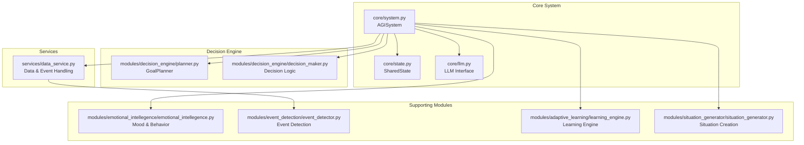
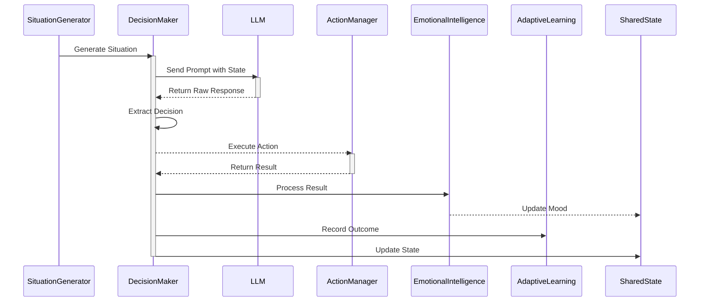
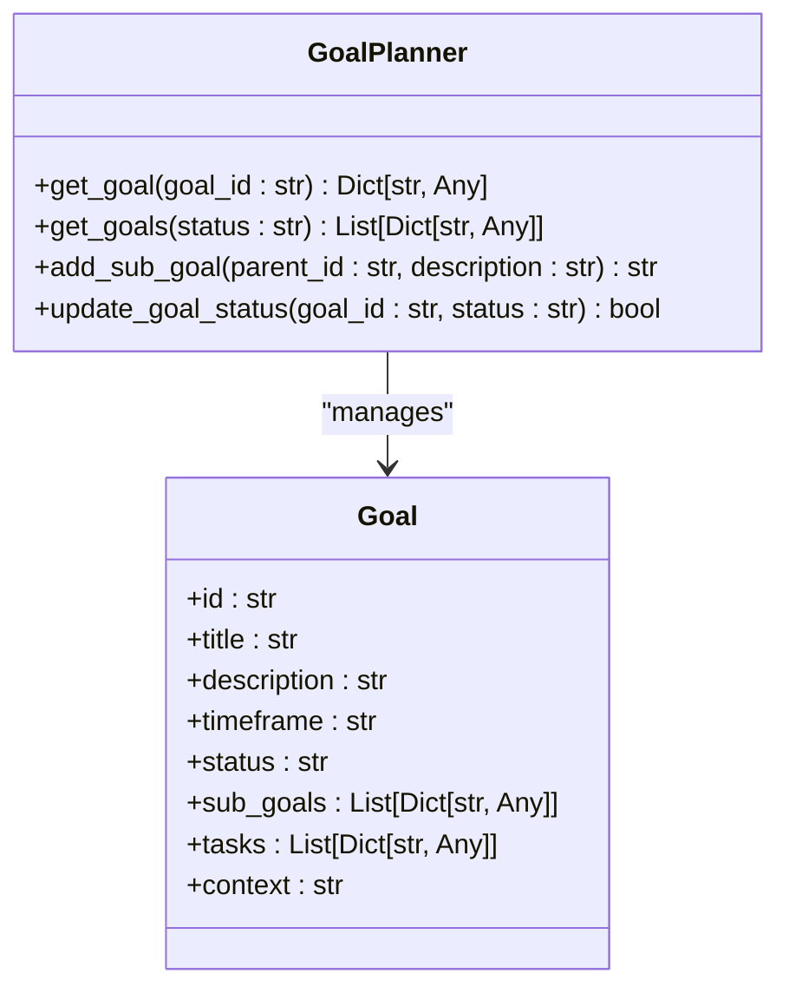
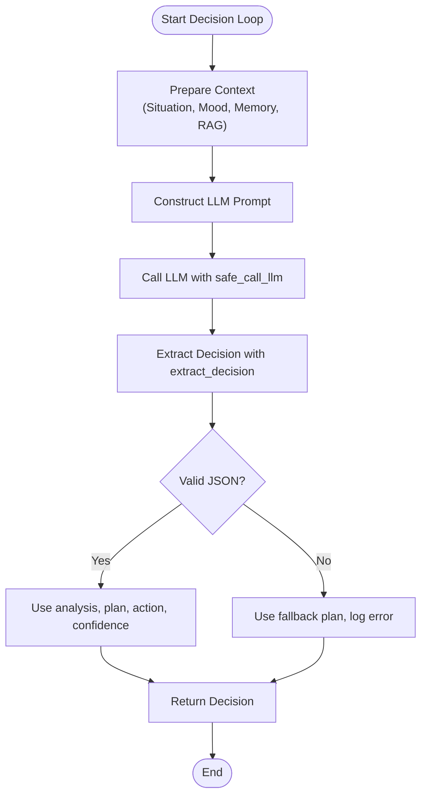
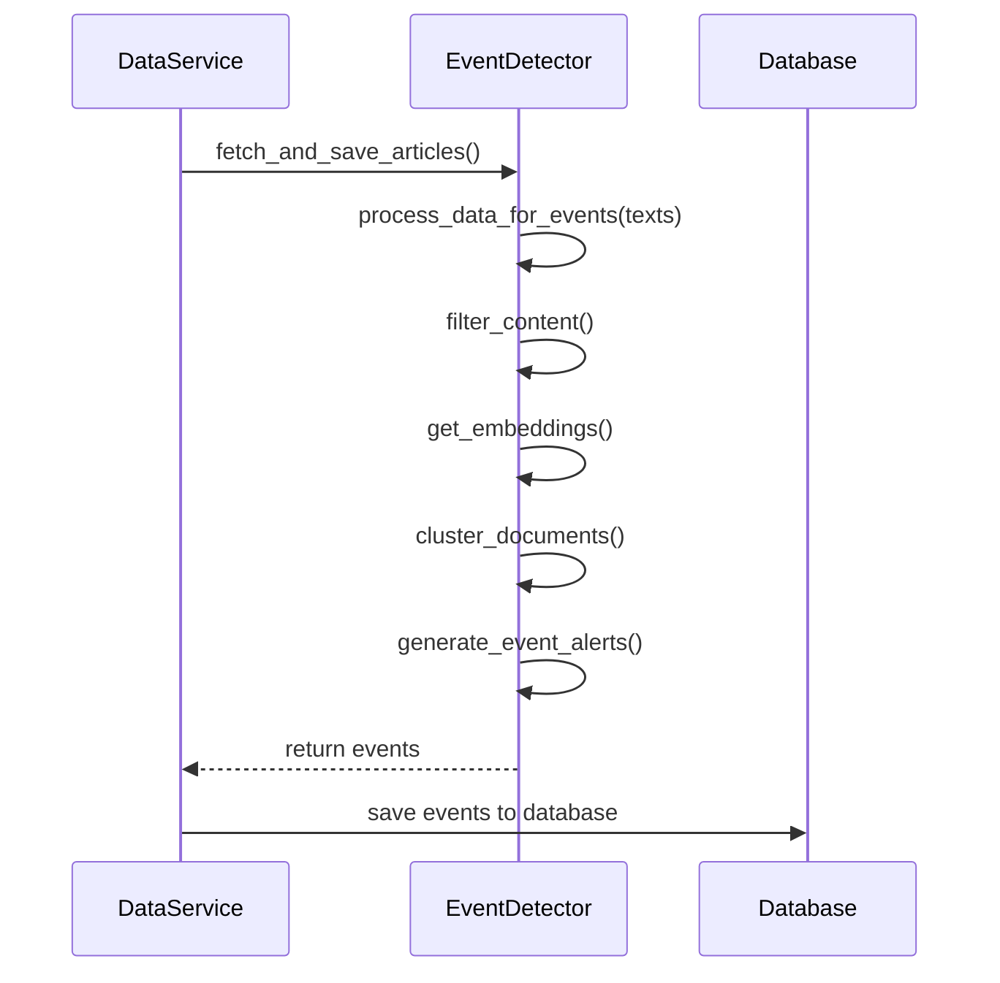
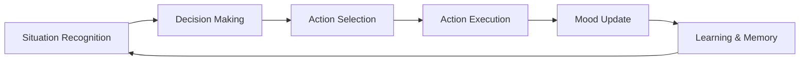
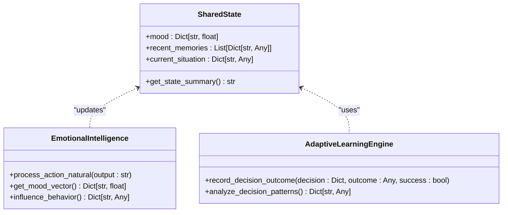
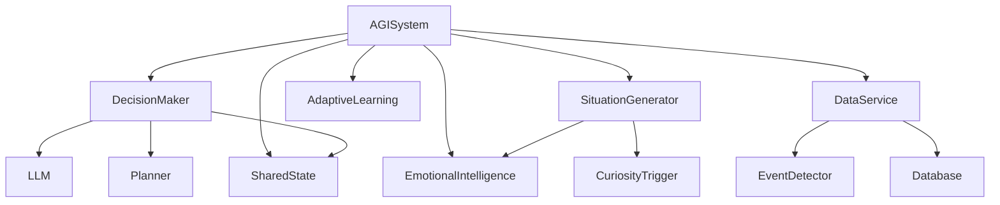

# Decision-Making System

## Table of Contents
1. [Introduction](#introduction)
2. [Project Structure](#project-structure)
3. [Core Components](#core-components)
4. [Architecture Overview](#architecture-overview)
5. [Detailed Component Analysis](#detailed-component-analysis)
6. [Dependency Analysis](#dependency-analysis)
7. [Performance Considerations](#performance-considerations)
8. [Troubleshooting Guide](#troubleshooting-guide)
9. [Conclusion](#conclusion)

## Introduction
This document provides a comprehensive overview of the decision-making system within the RAVANA AGI framework. The system is designed to enable autonomous, goal-driven behavior through a sophisticated integration of planning, hypothesis testing, LLM-based reasoning, and external data sources. It operates on a continuous loop from situation recognition to action execution, incorporating emotional state, memory, and learning to adapt over time. The architecture emphasizes structured planning, confidence-aware decisions, and robust fallback mechanisms to handle uncertainty and avoid stuck states.

## Project Structure
The decision-making system is distributed across several modules and core components within the RAVANA repository. The primary logic resides in the `modules/decision_engine` directory, which contains the `decision_maker.py` and `planner.py` files for core decision and planning logic. The `core/llm.py` file provides the interface to multiple LLM providers, which is central to the decision-making process. State management is handled by `core/state.py`, while external data integration is facilitated by modules like `event_detection` and services like `data_service.py`. The overall structure is modular, allowing for independent development and testing of components like emotional intelligence, curiosity, and memory.

**Diagram sources**
- [core/state.py](file://core/state.py)
- [core/llm.py](file://core/llm.py)
- [modules/decision_engine/planner.py](file://modules/decision_engine/planner.py)
- [modules/decision_engine/decision_maker.py](file://modules/decision_engine/decision_maker.py)
- [modules/emotional_intellegence/emotional_intellegence.py](file://modules/emotional_intellegence/emotional_intellegence.py)
- [modules/event_detection/event_detector.py](file://modules/event_detection/event_detector.py)
- [services/data_service.py](file://services/data_service.py)
- [modules/adaptive_learning/learning_engine.py](file://modules/adaptive_learning/learning_engine.py)
- [modules/situation_generator/situation_generator.py](file://modules/situation_generator/situation_generator.py)
- [core/system.py](file://core/system.py)

**Section sources**
- [core/state.py](file://core/state.py)
- [core/llm.py](file://core/llm.py)
- [modules/decision_engine/planner.py](file://modules/decision_engine/planner.py)
- [modules/decision_engine/decision_maker.py](file://modules/decision_engine/decision_maker.py)
- [modules/emotional_intellegence/emotional_intellegence.py](file://modules/emotional_intellegence/emotional_intellegence.py)
- [modules/event_detection/event_detector.py](file://modules/event_detection/event_detector.py)
- [services/data_service.py](file://services/data_service.py)
- [modules/adaptive_learning/learning_engine.py](file://modules/adaptive_learning/learning_engine.py)
- [modules/situation_generator/situation_generator.py](file://modules/situation_generator/situation_generator.py)
- [core/system.py](file://core/system.py)

## Core Components
The core components of the decision-making system are the `GoalPlanner`, the `DecisionMaker`, and the `SharedState`. The `GoalPlanner` manages a hierarchy of long-term goals, breaking them down into sub-goals and tasks. The `DecisionMaker` uses LLM input to analyze situations, evaluate options, and generate actions based on the current state, goals, and hypotheses. The `SharedState` acts as a central repository for the system's mood, current situation, recent memories, and other contextual data, ensuring all components have a consistent view of the agent's internal and external world. These components work in concert, with the `DecisionMaker` relying on the `GoalPlanner` for strategic direction and the `SharedState` for contextual awareness.

**Section sources**
- [modules/decision_engine/planner.py](file://modules/decision_engine/planner.py#L0-L39)
- [modules/decision_engine/decision_maker.py](file://modules/decision_engine/decision_maker.py#L0-L33)
- [core/state.py](file://core/state.py#L0-L29)

## Architecture Overview
The decision-making architecture is a goal-driven loop that integrates multiple cognitive functions. The process begins with the `SituationGenerator` creating a new situation, which could be based on external events, internal curiosity, or subconscious processing. This situation is then fed into the `DecisionMaker`, which uses an LLM to generate a decision. The LLM prompt includes the current situation, the agent's mood, relevant memories, available actions, and its long-term goals. The `DecisionMaker` evaluates the LLM's response, extracts a structured decision, and returns an action for execution. After the action is executed, the system updates its mood, records the outcome for learning, and retrieves new memories, closing the loop. This architecture allows for flexible, context-aware decision-making that can adapt to changing circumstances.

**Diagram sources**
- [modules/situation_generator/situation_generator.py](file://modules/situation_generator/situation_generator.py#L467-L492)
- [modules/decision_engine/decision_maker.py](file://modules/decision_engine/decision_maker.py#L0-L33)
- [core/llm.py](file://core/llm.py#L468-L502)
- [core/system.py](file://core/system.py#L365-L395)
- [modules/adaptive_learning/learning_engine.py](file://modules/adaptive_learning/learning_engine.py#L244-L274)

## Detailed Component Analysis

### Goal-Driven Architecture and Planning Mechanisms
The system employs a hierarchical goal-driven architecture. The `GoalPlanner` class manages a collection of goals stored in an in-memory dictionary. Goals are created using the `plan_from_context` function, which takes a natural language description and converts it into a structured goal object with a unique ID, title, description, and status. The planner supports breaking down high-level goals into sub-goals, creating a tree-like structure. For example, a goal like "Learn reinforcement learning basics" can be decomposed into sub-goals such as "Understand Q-learning" and "Implement a DQN agent." The `get_goals` method allows the decision-maker to retrieve all active goals, which are then used to guide the decision-making process. This hierarchical approach enables the system to manage complex, long-term objectives by focusing on one actionable task at a time.

**Diagram sources**
- [modules/decision_engine/planner.py](file://modules/decision_engine/planner.py#L36-L67)

**Section sources**
- [modules/decision_engine/planner.py](file://modules/decision_engine/planner.py#L0-L39)

### Hypothesis Testing and Experimentation
The system can generate and test hypotheses as part of its self-improvement cycle. The `goal_driven_decision_maker_loop` function checks for opportunities to start an experiment, with a 10% probability if no experiment is active. It calls `generate_hypothesis` from the `agent_self_reflection` module to create a new hypothesis based on the current state. If a hypothesis is generated, the decision-maker returns a decision with the action `initiate_experiment`, which triggers the creation of a test situation. The system can also analyze the outcome of a completed experiment by calling `analyze_experiment_outcome`. The `agi_experimentation_engine` function in `llm.py` provides a unified framework for experimentation, which can involve generating and executing Python code, performing online validation with search, and providing a final verdict on the hypothesis. This closed-loop process allows the agent to learn from its own actions and refine its understanding of the world.

**Section sources**
- [modules/decision_engine/decision_maker.py](file://modules/decision_engine/decision_maker.py#L0-L33)
- [core/llm.py](file://core/llm.py#L529-L566)

### Decision Evaluation with LLM Input
The `decision_maker_loop` function in `llm.py` is responsible for evaluating options using LLM input. It constructs a comprehensive prompt that includes the current situation, emotional state, relevant memories, external knowledge (RAG), and available actions. The prompt instructs the LLM to perform a deep analysis, create a strategic plan, assess its confidence, provide a reasoning chain, and specify the first action. The LLM is expected to respond with a JSON object containing keys like `analysis`, `plan`, `action`, `params`, `confidence`, and `reasoning`. The `extract_decision` function parses this response, handling cases where the JSON is malformed by returning a default structure with an error message. The confidence score (a float between 0.0 and 1.0) is used by the system to gauge the reliability of the decision. This structured approach ensures that the LLM's output is predictable and can be reliably integrated into the agent's action loop.

**Diagram sources**
- [core/llm.py](file://core/llm.py#L468-L502)

**Section sources**
- [core/llm.py](file://core/llm.py#L468-L502)

### Integration with External Data
The system integrates external data through search results and event detection. The `call_gemini_with_search` function in `llm.py` enables the LLM to perform Google searches, with results being added to a `search_result_manager`. This allows the agent to access up-to-date information for its decisions. The `event_detection` module processes a stream of text (e.g., news articles) to detect significant events. It uses an embedding model to cluster similar documents and a sentiment classifier to filter out irrelevant or negative content. The `data_service.py` module periodically fetches articles from configured feeds and runs them through the event detector, saving detected events to the database. These events can then influence the `SituationGenerator`, creating situations that respond to real-world developments. This integration ensures the agent's decisions are informed by current events and external knowledge.

**Diagram sources**
- [services/data_service.py](file://services/data_service.py#L27-L57)
- [modules/event_detection/event_detector.py](file://modules/event_detection/event_detector.py#L94-L125)

**Section sources**
- [services/data_service.py](file://services/data_service.py#L0-L27)
- [modules/event_detection/event_detector.py](file://modules/event_detection/event_detector.py#L0-L40)

### Workflow from Situation Recognition to Action Selection
The complete workflow begins with situation recognition. The `AGISystem`'s main loop calls `_generate_situation`, which uses the `SituationGenerator` to create a new situation based on the current state, curiosity topics, and behavior modifiers. This situation is then passed to the `decision_maker_loop`, which constructs a prompt and sends it to an LLM. The LLM's response is parsed into a decision object. The `ActionManager` then executes the specified action, such as writing a file or logging a message. After execution, the system updates the agent's mood based on the action's outcome, records the decision and its result for future learning, and retrieves relevant memories for the next cycle. The `current_plan` is also managed; if the decision contains a multi-step plan, the remaining steps are stored for future execution. This end-to-end workflow enables the agent to operate autonomously, continuously making decisions and taking actions.

**Section sources**
- [core/system.py](file://core/system.py#L238-L266)
- [core/system.py](file://core/system.py#L365-L395)
- [core/llm.py](file://core/llm.py#L468-L502)

### Handling Uncertainty and Confidence Scores
The system handles uncertainty through explicit confidence scores and fallback strategies. The LLM is instructed to include a `confidence` field in its response, a float between 0.0 and 1.0. This score is used by the system to prioritize high-confidence decisions and to trigger fallback mechanisms when confidence is low. The `extract_decision` function includes a default confidence of 0.5 if the field is missing. The decision structure also includes a `fallback_plan` field, which specifies what to do if the primary action fails. The `safe_call_llm` function implements retry logic with exponential backoff, attempting up to three times before failing. The `is_lazy_llm_response` function can detect generic or unhelpful responses, allowing the system to retry with a different prompt or provider. This multi-layered approach ensures robust operation even when the LLM is uncertain or produces a poor response.

**Section sources**
- [core/llm.py](file://core/llm.py#L468-L502)
- [core/llm.py](file://core/llm.py#L799-L884)

### Integration with Emotional State and Memory Systems
The decision-making process is deeply integrated with the agent's emotional state and memory systems. The `SharedState` object contains the current `mood` vector and a list of `recent_memories`. These are included in the LLM prompt, allowing the agent's decisions to be influenced by its current emotional state and past experiences. After an action is executed, the `EmotionalIntelligence` module processes the outcome to update the mood vector. For example, a successful action might increase `happy` and `confident`, while an error might increase `frustrated`. The updated mood is then stored in the `SharedState`. The `AdaptiveLearningEngine` records each decision and its outcome, building a history that can be analyzed to improve future decisions. This integration creates a cohesive cognitive architecture where emotion, memory, and learning all contribute to more intelligent and adaptive behavior.

**Diagram sources**
- [core/state.py](file://core/state.py#L0-L29)
- [modules/emotional_intellegence/emotional_intellegence.py](file://modules/emotional_intellegence/emotional_intellegence.py#L0-L30)
- [modules/adaptive_learning/learning_engine.py](file://modules/adaptive_learning/learning_engine.py#L0-L36)

**Section sources**
- [core/state.py](file://core/state.py#L0-L29)
- [core/system.py](file://core/system.py#L365-L395)
- [modules/emotional_intellegence/emotional_intellegence.py](file://modules/emotional_intellegence/emotional_intellegence.py#L53-L87)
- [modules/adaptive_learning/learning_engine.py](file://modules/adaptive_learning/learning_engine.py#L244-L274)

## Dependency Analysis
The decision-making system has a clear dependency hierarchy. The top-level `AGISystem` class depends on all other components, orchestrating their interactions. The `DecisionMaker` depends on `llm.py` for LLM calls, `planner.py` for goal management, and `state.py` for contextual data. The `SituationGenerator` depends on the `emotional_intellegence` and `curiosity_trigger` modules to create contextually relevant situations. The `data_service.py` module depends on `event_detector.py` for event processing and the database models for persistence. There are no circular dependencies, and the use of well-defined interfaces (e.g., the LLM prompt format) allows for loose coupling between components. This modular design makes the system easy to extend and maintain.

**Diagram sources**
- [core/system.py](file://core/system.py#L28-L63)
- [modules/decision_engine/decision_maker.py](file://modules/decision_engine/decision_maker.py#L0-L33)

**Section sources**
- [core/system.py](file://core/system.py#L28-L63)
- [modules/decision_engine/decision_maker.py](file://modules/decision_engine/decision_maker.py#L0-L33)

## Performance Considerations
The system's performance is primarily constrained by LLM call latency and the complexity of the decision-making loop. The `safe_call_llm` function includes a 30-second timeout and retry logic, which can add significant delay if the LLM is slow or unresponsive. To mitigate this, the system uses a fast local LLM as a fallback and caches repeated actions in the `EnhancedActionManager`. The `SituationGenerator` and `EventDetector` are computationally intensive due to the use of embedding models and clustering algorithms, but these are run asynchronously and not on every decision loop. The in-memory storage of goals and state ensures fast access, but could become a bottleneck if the number of goals grows very large. Overall, the system is designed for quality of decision over speed, prioritizing thorough analysis and robustness.

## Troubleshooting Guide
Common issues in the decision-making system include decision loops, stuck states, and suboptimal planning. A decision loop can occur if the agent repeatedly generates the same situation and takes the same action without progress. This can be mitigated by ensuring the `AdaptiveLearningEngine` is properly recording outcomes and adjusting behavior. A stuck state might happen if the LLM consistently returns low-confidence decisions or errors. Checking the LLM provider configuration and fallback mechanisms in `llm.py` is essential. Suboptimal planning can result from poor goal decomposition or inadequate memory retrieval. Reviewing the `GoalPlanner` logic and the `memory_service` configuration can help. For debugging, enable verbose logging and inspect the `decision_history` and `mood_history` in the `SharedState`. If the agent is not generating new hypotheses, verify that the `agent_self_reflection` module is loaded and functioning.

**Section sources**
- [core/llm.py](file://core/llm.py#L799-L884)
- [modules/adaptive_learning/learning_engine.py](file://modules/adaptive_learning/learning_engine.py#L244-L274)
- [modules/decision_engine/decision_maker.py](file://modules/decision_engine/decision_maker.py#L137-L165)

## Conclusion
The RAVANA decision-making system is a sophisticated, goal-driven architecture that leverages LLMs for high-level reasoning while maintaining robust control through structured planning and state management. Its integration of emotion, memory, and learning creates a cohesive cognitive model capable of autonomous, adaptive behavior. The system's modular design and clear interfaces make it extensible and maintainable. By handling uncertainty through confidence scores and fallback strategies, and by continuously learning from its experiences, the agent is well-equipped to operate effectively in complex and dynamic environments. Future improvements could include more sophisticated goal prioritization and deeper integration of the learning engine into the decision loop.

**Referenced Files in This Document**   
- [core/llm.py](file://core/llm.py)
- [core/state.py](file://core/state.py)
- [modules/decision_engine/decision_maker.py](file://modules/decision_engine/decision_maker.py)
- [modules/decision_engine/planner.py](file://modules/decision_engine/planner.py)
- [modules/adaptive_learning/learning_engine.py](file://modules/adaptive_learning/learning_engine.py)
- [modules/event_detection/event_detector.py](file://modules/event_detection/event_detector.py)
- [services/data_service.py](file://services/data_service.py)
- [core/system.py](file://core/system.py)
- [modules/emotional_intellegence/emotional_intellegence.py](file://modules/emotional_intellegence/emotional_intellegence.py)
- [modules/situation_generator/situation_generator.py](file://modules/situation_generator/situation_generator.py)