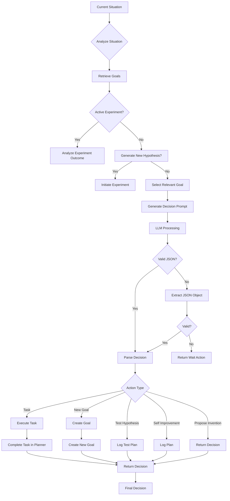
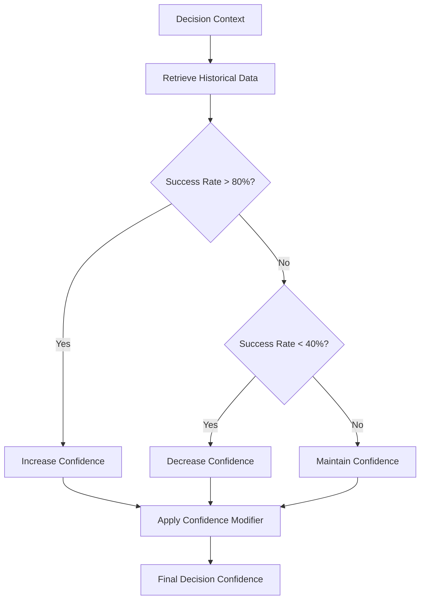
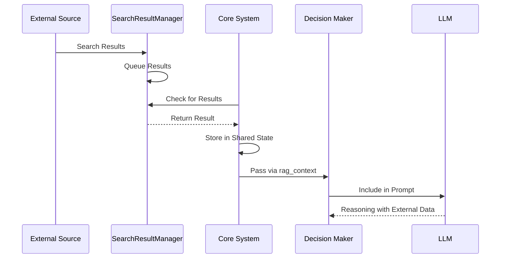
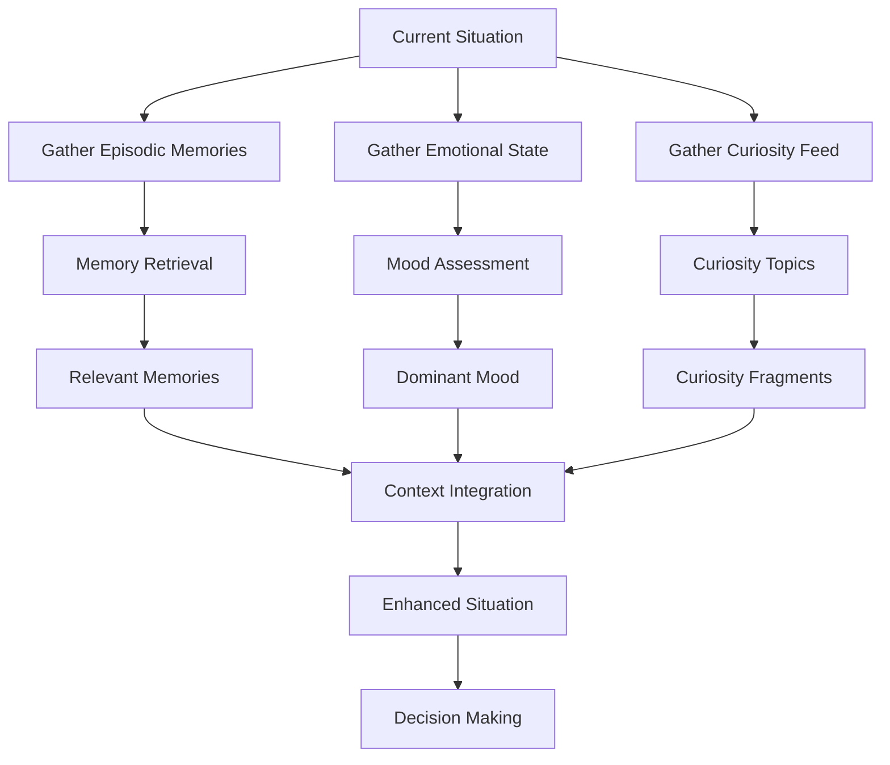
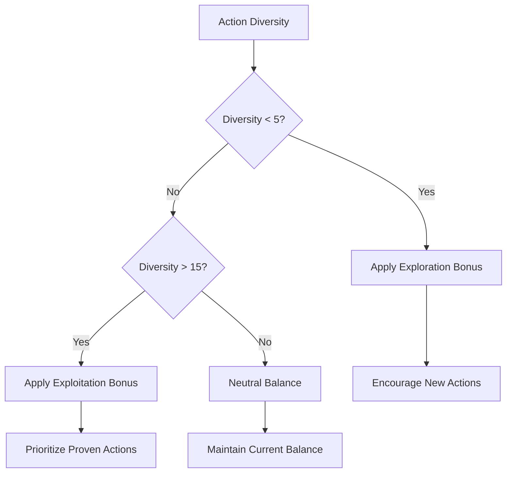

# Decision Making Engine


## Table of Contents
1. [Introduction](#introduction)
2. [Decision Pipeline Overview](#decision-pipeline-overview)
3. [Candidate Action Evaluation](#candidate-action-evaluation)
4. [Integration with External Data Sources](#integration-with-external-data-sources)
5. [Context Injection: Emotional Intelligence and Episodic Memory](#context-injection-emotional-intelligence-and-episodic-memory)
6. [Configuration Parameters](#configuration-parameters)
7. [Troubleshooting Guide](#troubleshooting-guide)

## Introduction
The Decision Making Engine is the core cognitive component of the Ravana AGI system, responsible for evaluating candidate actions, generating plans, and making final selections based on a complex interplay of goals, context, and learned experiences. This document provides a comprehensive analysis of the decision-making process, covering the evaluation pipeline, integration with external systems, and mechanisms for handling uncertainty and failure.

## Decision Pipeline Overview

The decision-making process follows a structured pipeline from situation assessment to final action selection. The primary entry point is the `goal_driven_decision_maker_loop` function in `decision_maker.py`, which orchestrates the entire decision process.



**Diagram sources**
- [decision_maker.py](file://modules/decision_engine/decision_maker.py#L20-L181)

**Section sources**
- [decision_maker.py](file://modules/decision_engine/decision_maker.py#L20-L181)

The pipeline begins with an assessment of the current situation, followed by goal retrieval from the `GoalPlanner`. The system first checks if it is analyzing an experiment outcome, in which case it delegates to the `analyze_experiment_outcome` function. If no experiment is active, there is a 10% chance to generate a new hypothesis for self-improvement. If no goals exist, the system creates a meta-goal for self-improvement. The core decision logic is then executed via an LLM call, with the response parsed and validated before taking the appropriate action.

## Candidate Action Evaluation

### LLM-Generated Reasoning and Confidence Scoring
The decision engine uses LLM-generated reasoning to evaluate candidate actions through a structured prompt that includes the current situation, long-term goals, and current hypotheses. The LLM is instructed to consider five possible action types:
- Execute a task
- Test a hypothesis
- Propose an invention
- Propose a new goal
- Propose self-improvement

The system implements confidence scoring through multiple mechanisms. The LLM response includes a confidence field, which is then adjusted by the adaptive learning system based on historical performance. In `core/system.py`, the confidence is modified by a confidence modifier derived from the agent's success rate:

```python
# Apply learning adaptations to decision
if learning_adaptations:
    # Adjust confidence based on learning
    confidence_modifier = learning_adaptations.get('confidence_modifier', 1.0)
    original_confidence = decision.get('confidence', 0.5)
    decision['confidence'] = min(1.0, max(0.0, original_confidence * confidence_modifier))
```

### Risk Assessment and Conflict Resolution
Risk assessment is performed through the analysis of historical decision patterns in the `adaptive_learning` module. The `analyze_decision_patterns` function calculates success rates for different actions and identifies underperforming actions that may represent higher risk:

```python
analysis = {
    'overall_success_rate': overall_success_rate,
    'action_success_rates': action_rates,
    'top_performing_actions': sorted(action_rates.items(), key=lambda x: x[1]['success_rate'], reverse=True)[:5],
    'underperforming_actions': sorted(action_rates.items(), key=lambda x: x[1]['success_rate'])[:5]
}
```

Conflict resolution occurs through the goal prioritization system. When multiple goals are relevant, the LLM is prompted to select the most appropriate action based on the current situation. The system also implements a fallback mechanism for ambiguous decisions by returning a "wait" action when the LLM response cannot be properly parsed.

### Decision Matrices and Thresholds
The system uses implicit decision matrices through the LLM prompt structure, which presents multiple evaluation criteria. Confidence thresholds are implemented in the adaptive learning system, where an overall success rate above 80% increases confidence (modifier of 1.1), while a rate below 40% decreases confidence (modifier of 0.8).



**Diagram sources**
- [adaptive_learning/learning_engine.py](file://modules/adaptive_learning/learning_engine.py#L170-L198)
- [core/system.py](file://core/system.py#L292-L320)

**Section sources**
- [adaptive_learning/learning_engine.py](file://modules/adaptive_learning/learning_engine.py#L63-L119)
- [core/system.py](file://core/system.py#L292-L320)

## Integration with External Data Sources

### Search Result Manager
The decision engine integrates with external data sources through the `SearchResultManager`, which acts as a queue for search results retrieved from external sources. The manager is implemented as a simple queue-based system:

```python
class SearchResultManager:
    def __init__(self):
        self.result_queue = queue.Queue()

    def add_result(self, result):
        self.result_queue.put(result)

    def get_result(self):
        try:
            return self.result_queue.get_nowait()
        except queue.Empty:
            return None

search_result_manager = SearchResultManager()
```

### Real-Time Information Retrieval
The integration occurs in the main system loop, where search results are periodically checked and incorporated into the decision context. In `core/system.py`, the `_check_for_search_results` method processes incoming search results:

```python
async def _check_for_search_results(self):
    """Enhanced search result processing with better error handling."""
    try:
        search_result = search_result_manager.get_result()
        if search_result:
            logger.info(f"Retrieved search result: {search_result[:100]}...")
            
            # Add to shared state for immediate use
            if not hasattr(self.shared_state, 'search_results'):
                self.shared_state.search_results = []
            self.shared_state.search_results.append(search_result)
            
            # Limit search results to prevent memory bloat
            if len(self.shared_state.search_results) > 10:
                self.shared_state.search_results = self.shared_state.search_results[-10:]
```

The search results are then passed to the decision maker through the `rag_context` parameter, allowing the LLM to incorporate real-time information into its reasoning process.



**Diagram sources**
- [search_result_manager.py](file://modules/decision_engine/search_result_manager.py#L1-L15)
- [core/system.py](file://core/system.py#L96-L121)

**Section sources**
- [search_result_manager.py](file://modules/decision_engine/search_result_manager.py#L1-L15)
- [core/system.py](file://core/system.py#L96-L121)

## Context Injection: Emotional Intelligence and Episodic Memory

### Emotional Intelligence Integration
The emotional intelligence system influences decisions through mood vectors and persona-based multipliers. The `EmotionalIntelligence` class maintains a mood vector that tracks the intensity of various emotional states:

```python
def __init__(self, config_path='modules/emotional_intellegence/config.json', persona_path='modules/emotional_intellegence/persona.json'):
    self.BASIC_MOODS = Config.POSITIVE_MOODS + Config.NEGATIVE_MOODS
    self.mood_vector: Dict[str, float] = {mood: 0.0 for mood in self.BASIC_MOODS}
    self.last_action_result: Optional[dict] = None
    self._load_config(config_path)
    self._load_personas(persona_path)
    self.set_persona(self.personas.get("default_persona", "Optimistic"))
    self.mood_processor = MoodProcessor(self)
```

Mood updates are processed based on action outcomes, with persona-specific multipliers affecting the rate of change. The dominant mood is then used to influence behavior through configuration-defined influences.

### Episodic Memory Retrieval
Episodic memory is integrated through the memory service, which extracts and retrieves relevant memories based on semantic similarity. The `get_relevant_memories_api` endpoint queries the ChromaDB collection for memories relevant to the current query:

```python
@app.post("/get_relevant_memories/", response_model=RelevantMemoriesResponse, tags=["Memories"])
async def get_relevant_memories_api(request: QueryRequest):
    """Queries ChromaDB for memories relevant to the query text."""
    try:
        if not request.query_text:
            return RelevantMemoriesResponse(relevant_memories=[])

        results = chroma_collection.query(
            query_texts=[request.query_text],
            n_results=request.top_n
        )
```

### Context Injection Process
The context injection process combines emotional state and episodic memory to create a rich context for decision-making. In the situation generator, these components are combined with other factors:

```python
# Gather inputs with reasonable fallbacks
fragments = episodic_memory or list(self.memories[-50:]) or []
emotional = emotional_state or {"dominant_emotion": self.mood, "valence": 0.0}
curiosity = curiosity_feed or []
```

The combined context is then used to generate situations that reflect the agent's emotional state and past experiences, creating a more coherent and contextually appropriate decision-making process.



**Diagram sources**
- [emotional_intellegence.py](file://modules/emotional_intellegence/emotional_intellegence.py#L1-L94)
- [memory.py](file://modules/episodic_memory/memory.py#L1-L647)
- [situation_generator.py](file://modules/situation_generator/situation_generator.py#L489-L518)

**Section sources**
- [emotional_intellegence.py](file://modules/emotional_intellegence/emotional_intellegence.py#L1-L94)
- [memory.py](file://modules/episodic_memory/memory.py#L1-L647)

## Configuration Parameters

### Decision Timeout and Execution Limits
The system implements execution timeouts through the enhanced action manager, which uses `asyncio.wait_for` to limit action execution time:

```python
# Execute action with timeout
result = await asyncio.wait_for(
    self.execute_action(decision),
    timeout=300  # 5 minute timeout
)
```

This prevents individual actions from blocking the system indefinitely and ensures timely progress through the decision pipeline.

### Consensus Requirements
While the current implementation does not have explicit consensus requirements, the system achieves a form of consensus through the combination of multiple information sources. The final decision represents a synthesis of:
- LLM-generated reasoning
- Historical performance data
- Current emotional state
- Relevant episodic memories
- External search results

### Exploration vs Exploitation Balance
The exploration vs exploitation balance is dynamically adjusted by the adaptive learning system based on action diversity. When action diversity is low (fewer than 5 distinct actions), the system encourages exploration:

```python
# Strategy 3: Exploration vs exploitation
action_diversity = len(analysis.get('action_success_rates', {}))
if action_diversity < 5:
    strategies['exploration_strategy'] = {
        'exploration_bonus': 0.2,
        'description': 'Low action diversity, encourage exploration of new actions'
    }
elif action_diversity > 15:
    strategies['exploitation_strategy'] = {
        'exploitation_bonus': 0.1,
        'description': 'High action diversity, focus on exploiting known good actions'
    }
```

The exploration bonus is then applied during decision making, influencing the selection of less frequently used actions.



**Diagram sources**
- [adaptive_learning/learning_engine.py](file://modules/adaptive_learning/learning_engine.py#L170-L198)
- [adaptive_learning/learning_engine.py](file://modules/adaptive_learning/learning_engine.py#L224-L245)

**Section sources**
- [adaptive_learning/learning_engine.py](file://modules/adaptive_learning/learning_engine.py#L170-L198)

## Troubleshooting Guide

### Decision Paralysis
Decision paralysis can occur when the system receives ambiguous inputs or when emotional tension is high. The situation generator includes a heuristic to detect decision paralysis:

```python
# Feature heuristics
negative_words = ['angry', 'anxious', 'sad', 'worry', 'fear', 'panic', 'stalled', 'fail', 'error']
uncertainty_words = ['maybe', 'perhaps', 'unsure', 'uncertain', 'possible', 'could']
goal_words = ['goal', 'plan', 'want', 'intend', 'need', 'should', 'must']

neg_count = sum(1 for f in fragments for w in negative_words if w in f.lower())
uncertainty_count = sum(1 for f in fragments for w in uncertainty_words if w in f.lower())
goals = sum(1 for f in fragments for w in goal_words if w in f.lower())

# small classifier: weighted sum
score = ( -0.9 * val ) + (0.4 * neg_count) + (0.25 * uncertainty_count) + (0.35 * goals)
# normalize roughly into 0..1
severity = max(0.0, min(1.0, score / 3.0))
```

When severity exceeds 0.6, the system recommends pausing and re-evaluating priorities. To resolve decision paralysis:
1. Clear the current plan: `self.current_plan = []`
2. Reset the mood vector: `ei.mood_vector = {mood: 0.0 for mood in ei.BASIC_MOODS}`
3. Retrieve recent memories to re-establish context
4. Generate a simple, low-risk task to break the paralysis

### Biased Outcomes
Biased outcomes can result from skewed training data or persistent mood states. The system mitigates bias through:
- Regular mood decay: `ei.decay_moods(decay=0.05)`
- Diverse action encouragement: exploration bonus for low action diversity
- Persona rotation: ability to switch between different emotional personas

To address biased outcomes:
1. Check the current persona: `ei.get_persona()`
2. Reset mood vectors to neutral
3. Review recent action history for patterns
4. Consider switching to a different persona
5. Force exploration of underutilized actions

### Incorrect Data Retrieval
Incorrect data retrieval can occur due to search result queue issues or memory retrieval failures. The system handles this through:
- Queue empty exceptions: `except queue.Empty: return None`
- Fallback mechanisms: using recent memories when search results are unavailable
- Result validation: checking for valid JSON responses

To troubleshoot data retrieval issues:
1. Verify the search result manager queue: `search_result_manager.result_queue.qsize()`
2. Check memory service connectivity
3. Validate the search query format
4. Ensure the ChromaDB collection is properly initialized
5. Monitor the memory service health endpoint

**Section sources**
- [situation_generator.py](file://modules/situation_generator/situation_generator.py#L627-L649)
- [adaptive_learning/learning_engine.py](file://modules/adaptive_learning/learning_engine.py#L63-L119)
- [search_result_manager.py](file://modules/decision_engine/search_result_manager.py#L1-L15)
- [memory.py](file://modules/episodic_memory/memory.py#L1-L647)

**Referenced Files in This Document**   
- [decision_maker.py](file://modules/decision_engine/decision_maker.py)
- [planner.py](file://modules/decision_engine/planner.py)
- [search_result_manager.py](file://modules/decision_engine/search_result_manager.py)
- [emotional_intellegence.py](file://modules/emotional_intellegence/emotional_intellegence.py)
- [memory.py](file://modules/episodic_memory/memory.py)
- [self_modification.py](file://modules/agent_self_reflection/self_modification.py)
- [core/system.py](file://core/system.py)
- [core/llm.py](file://core/llm.py)
- [core/enhanced_action_manager.py](file://core/enhanced_action_manager.py)
- [modules/adaptive_learning/learning_engine.py](file://modules/adaptive_learning/learning_engine.py)