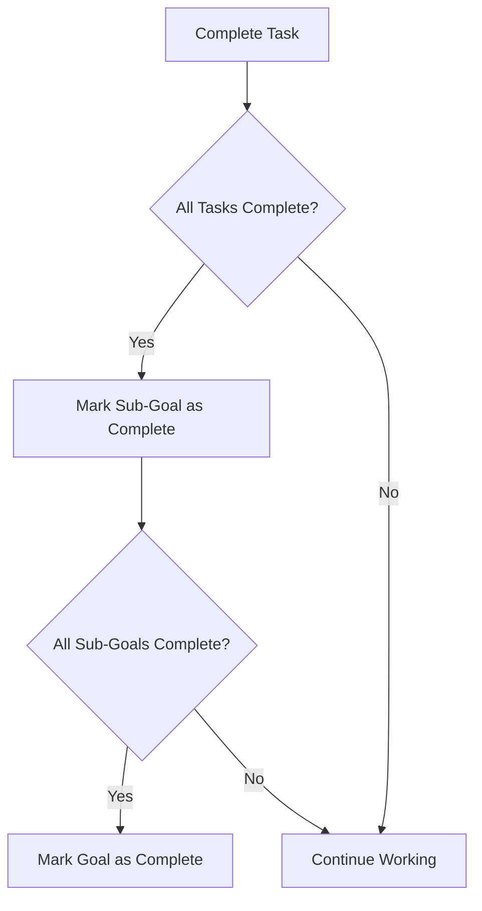
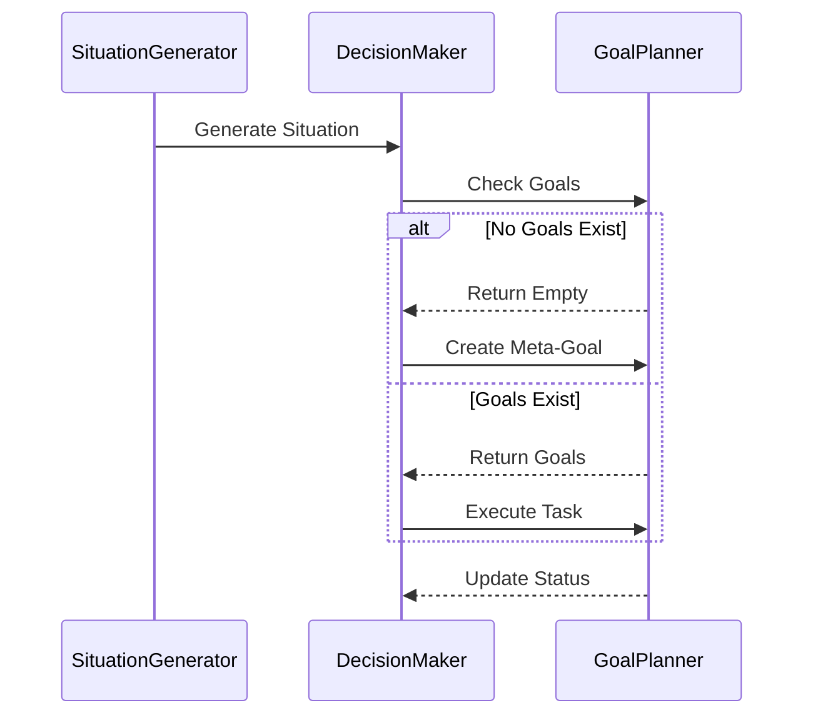
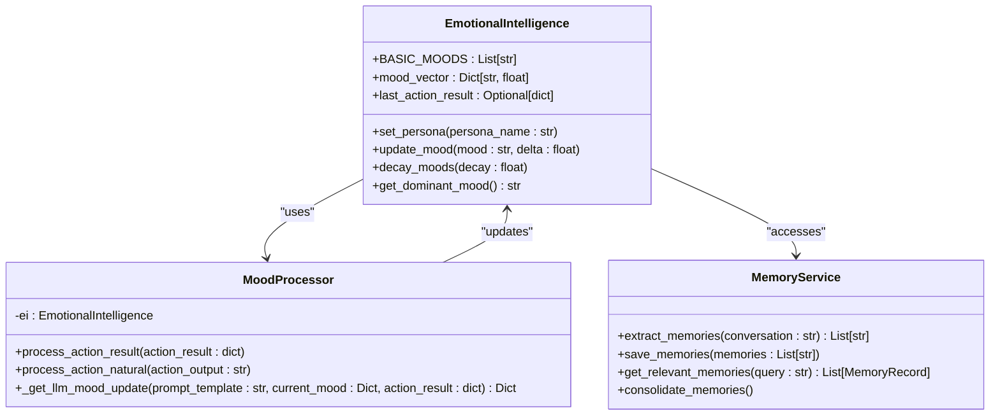

# Goal Planning


## Table of Contents
1. [Introduction](#introduction)
2. [Goal Generation and Initialization](#goal-generation-and-initialization)
3. [Goal Hierarchy and Decomposition](#goal-hierarchy-and-decomposition)
4. [Integration with Autonomous Loop and Situation Generator](#integration-with-autonomous-loop-and-situation-generator)
5. [LLM-Driven Task Expansion](#llm-driven-task-expansion)
6. [Goal Prioritization and Selection](#goal-prioritization-and-selection)
7. [Configuration and Thresholds](#configuration-and-thresholds)
8. [Emotional and Memory Context Influence](#emotional-and-memory-context-influence)
9. [Common Issues and Mitigation Strategies](#common-issues-and-mitigation-strategies)
10. [Custom Goal Creation and Planner Extension](#custom-goal-creation-and-planner-extension)

## Introduction
The GoalPlanner component is a core module within the RAVANA AGI system responsible for managing the lifecycle of goals, from creation to completion. It operates as an in-memory planner that structures high-level objectives into actionable tasks, enabling autonomous decision-making and self-directed learning. The planner integrates with various cognitive modules, including emotional intelligence, episodic memory, and situation generation, to create a context-aware and adaptive planning system. This document provides a comprehensive overview of the GoalPlanner's architecture, functionality, and integration points, detailing how goals are generated, prioritized, decomposed, and executed within the autonomous loop.

## Goal Generation and Initialization

The GoalPlanner supports two primary methods for goal creation: direct context-based initialization and programmatic goal addition. The `plan_from_context` function serves as the primary entry point for generating new goals from natural language descriptions. It creates a structured goal object with metadata such as priority, timeframe, and status, storing it in a shared in-memory dictionary for global access.

```python
def plan_from_context(context: str, timeframe: str = "short-term", priority: int = 5) -> str:
    goal_id = str(uuid.uuid4())
    goal = {
        "id": goal_id,
        "title": context,
        "description": f"A goal to address the context: {context}",
        "timeframe": timeframe,
        "priority": priority,
        "status": "pending",
        "sub_goals": [],
        "context": context,
        "created_at": time.time(),
        "updated_at": time.time()
    }
    _goals[goal_id] = goal
    return goal_id
```

This function is designed for speed and reliability, avoiding LLM calls during initial goal creation. The `GoalPlanner` class provides an interface to manage these goals, offering methods to retrieve, update, and filter goals based on their status. When initialized, the planner references the shared `_goals` dictionary, ensuring consistency across all instances.

**Section sources**
- [modules/decision_engine/planner.py](file://modules/decision_engine/planner.py#L30-L50)

## Goal Hierarchy and Decomposition

The GoalPlanner implements a hierarchical structure for organizing goals, sub-goals, and tasks. Each goal can contain multiple sub-goals, which in turn can contain executable tasks. This decomposition enables complex objectives to be broken down into manageable components.

The planner provides methods to navigate and modify this hierarchy:
- `add_sub_goal(parent_goal_id, sub_goal_description)`: Adds a new sub-goal to a parent goal
- `add_task(goal_id, subgoal_id, description)`: Creates a new task under a specified sub-goal
- `complete_task(goal_id, subgoal_id, task_id)`: Marks a task as completed and checks for sub-goal and goal completion

Completion of tasks triggers automatic status updates through a chain of validation methods. When all tasks within a sub-goal are completed, the `_check_subgoal_completion` method updates the sub-goal status and invokes `_check_goal_completion` to evaluate whether the parent goal has been fulfilled.



**Diagram sources**
- [modules/decision_engine/planner.py](file://modules/decision_engine/planner.py#L150-L180)

**Section sources**
- [modules/decision_engine/planner.py](file://modules/decision_engine/planner.py#L100-L200)

## Integration with Autonomous Loop and Situation Generator

The GoalPlanner is tightly integrated with the autonomous decision-making loop through the `situation_generator` module. The `SituationGenerator` class produces various types of situations that initiate planning cycles, including trending topics, curiosity explorations, technical challenges, and hypothetical scenarios.

The `generate_situation` method serves as the central coordinator, evaluating the system's state and selecting an appropriate situation type based on probabilistic weights. When search results are available in the shared state, the generator prioritizes creating a "search_result_analysis" situation, which triggers the planning process.

```python
async def generate_situation(self, shared_state: Any, curiosity_topics: Optional[List[str]] = None, behavior_modifiers: Optional[Dict[str, Any]] = None) -> Dict[str, Any]:
    if hasattr(shared_state, 'search_results') and shared_state.search_results:
        return await self.generate_search_result_situation(shared_state.search_results)
```

The decision-making loop, implemented in `decision_maker.py`, uses the GoalPlanner to manage goals and execute tasks. When no goals exist, it creates a meta-goal for self-improvement, ensuring continuous autonomous operation.



**Diagram sources**
- [modules/situation_generator/situation_generator.py](file://modules/situation_generator/situation_generator.py#L700-L750)
- [modules/decision_engine/decision_maker.py](file://modules/decision_engine/decision_maker.py#L50-L80)

**Section sources**
- [modules/situation_generator/situation_generator.py](file://modules/situation_generator/situation_generator.py#L600-L800)
- [modules/decision_engine/decision_maker.py](file://modules/decision_engine/decision_maker.py#L20-L100)

## LLM-Driven Task Expansion

While the initial goal creation avoids LLM calls for performance reasons, the system leverages LLMs extensively for expanding high-level objectives into actionable steps. The `decision_maker_loop` function uses an LLM to analyze the current situation, goals, and hypotheses, then generates a JSON-formatted decision that specifies the next action.

The LLM prompt includes structured guidance for handling ambitious goals by breaking them down into research tasks rather than attempting direct solutions. For example, a goal like "Achieve Time Travel" would be decomposed into "Research general relativity and its implications for spacetime manipulation."

The decision output can take several forms:
- Task execution with specific goal, sub-goal, and task identifiers
- Hypothesis testing with test method and expected outcome
- New goal proposals with context descriptions
- Self-improvement plans targeting specific modules

This LLM-driven expansion enables the system to generate creative and contextually appropriate action plans while maintaining alignment with long-term objectives.

**Section sources**
- [modules/decision_engine/decision_maker.py](file://modules/decision_engine/decision_maker.py#L80-L150)

## Goal Prioritization and Selection

The current implementation uses a simple priority system where goals are assigned an integer priority value (default: 5). However, goal selection is primarily driven by the LLM-based decision-making process rather than a deterministic priority queue.

The `get_all_goals` method allows filtering goals by status (e.g., "pending", "in_progress"), enabling the system to focus on active goals. The decision loop analyzes all available goals and selects the most relevant one based on the current situation, effectively implementing a context-aware prioritization system.

Future enhancements could incorporate more sophisticated prioritization algorithms that consider factors such as:
- Time sensitivity and deadlines
- Resource requirements
- Dependencies between goals
- Alignment with core objectives
- Emotional and cognitive state

The probabilistic selection in the situation generator (e.g., 30% weight for curiosity exploration, 20% for trending topics) also influences goal prioritization by determining which types of situations are most likely to be generated.

**Section sources**
- [modules/decision_engine/planner.py](file://modules/decision_engine/planner.py#L70-L90)
- [modules/situation_generator/situation_generator.py](file://modules/situation_generator/situation_generator.py#L720-L730)

## Configuration and Thresholds

The GoalPlanner itself has minimal configuration requirements, relying on in-memory storage with no external configuration files. However, its behavior is influenced by configuration parameters from integrated modules:

- **Recursion limits**: Implicitly controlled through the hierarchical structure (goals → sub-goals → tasks)
- **Priority weighting**: Default priority value of 5, configurable per goal
- **Timeframe options**: "short-term", "month", or custom values
- **Status values**: "pending", "in_progress", "completed"

The system does not currently implement explicit thresholds for goal completion or performance evaluation. Instead, completion is determined by the binary state of all constituent tasks. Future versions could incorporate configurable thresholds for partial completion or quality metrics.

**Section sources**
- [modules/decision_engine/planner.py](file://modules/decision_engine/planner.py#L30-L40)

## Emotional and Memory Context Influence

The GoalPlanner is influenced by emotional and memory context through its integration with the `EmotionalIntelligence` and `episodic_memory` modules. While the planner itself does not directly process emotional data, the decision-making loop considers the dominant mood and emotional state when selecting goals and tasks.

The `EmotionalIntelligence` class maintains a mood vector with positive and negative moods, updated based on action outcomes and natural language processing of action outputs. Different personas (e.g., "Optimistic", "Pessimistic") apply multipliers to mood updates, influencing the agent's behavior.

```python
class EmotionalIntelligence:
    def __init__(self, config_path='modules/emotional_intellegence/config.json', persona_path='modules/emotional_intellegence/persona.json'):
        self.BASIC_MOODS = Config.POSITIVE_MOODS + Config.NEGATIVE_MOODS
        self.mood_vector: Dict[str, float] = {mood: 0.0 for mood in self.BASIC_MOODS}
        self.mood_processor = MoodProcessor(self)
```

The `MoodProcessor` uses LLMs to analyze action results and natural language outputs, classifying them according to predefined triggers and updating mood states accordingly. These emotional states can influence goal selection by making certain types of tasks (e.g., creative vs. analytical) more or less appealing.

Episodic memory provides context for goal creation through the `memory.py` service, which extracts and stores key information from conversations. The memory system uses sentence embeddings and ChromaDB for efficient retrieval of relevant memories based on similarity to the current query.



**Diagram sources**
- [modules/emotional_intellegence/emotional_intellegence.py](file://modules/emotional_intellegence/emotional_intellegence.py#L10-L30)
- [modules/emotional_intellegence/mood_processor.py](file://modules/emotional_intellegence/mood_processor.py#L10-L20)
- [modules/episodic_memory/memory.py](file://modules/episodic_memory/memory.py#L50-L100)

**Section sources**
- [modules/emotional_intellegence/emotional_intellegence.py](file://modules/emotional_intellegence/emotional_intellegence.py#L1-L50)
- [modules/emotional_intellegence/mood_processor.py](file://modules/emotional_intellegence/mood_processor.py#L1-L50)
- [modules/episodic_memory/memory.py](file://modules/episodic_memory/memory.py#L1-L200)

## Common Issues and Mitigation Strategies

The GoalPlanner system faces several potential issues that require careful mitigation:

**Infinite Recursion**: The hierarchical goal structure could theoretically lead to infinite recursion if not properly managed. The current implementation mitigates this through:
- Fixed hierarchy levels (goal → sub-goal → task)
- Explicit completion conditions
- Lack of recursive goal creation in the core planner

**Goal Drift**: Over time, goals may become misaligned with original objectives. This is addressed through:
- Regular situation generation that re-evaluates priorities
- Hypothesis testing that validates assumptions
- Memory consolidation that maintains context

**Resource Exhaustion**: In-memory storage of goals could lead to memory leaks. The system currently lacks persistence mechanisms, but this is mitigated by:
- Using UUIDs for unique identification
- Providing filtering methods to manage goal sets
- Integrating with external memory systems

**Mitigation Strategy Example**: When a new hypothesis is detected, the system generates a specific situation to test it, preventing uncontrolled experimentation:

```python
if behavior_modifiers and behavior_modifiers.get("new_hypothesis"):
    return await self.generate_hypothesis_test_situation(behavior_modifiers["new_hypothesis"])
```

**Section sources**
- [modules/situation_generator/situation_generator.py](file://modules/situation_generator/situation_generator.py#L710-L720)

## Custom Goal Creation and Planner Extension

The GoalPlanner can be extended to support custom goal types and behaviors. The `plan_from_context` function provides a simple interface for creating new goals from natural language input, while the `GoalPlanner` class offers methods for programmatic manipulation of the goal hierarchy.

To create a custom goal:
```python
# Create a new goal from context
new_goal_id = plan_from_context("Improve code quality through automated testing", timeframe="month", priority=7)

# Add sub-goals
planner = GoalPlanner()
sub_goal_id = planner.add_sub_goal(new_goal_id, "Implement unit tests for core modules")

# Add tasks
task_id = planner.add_task(new_goal_id, sub_goal_id, "Write unit tests for planner.py module")
```

For more advanced extensions, developers can subclass `GoalPlanner` to add new functionality:
- Custom persistence mechanisms (e.g., database storage)
- Advanced prioritization algorithms
- Dependency tracking between goals
- Progress estimation and time management

The modular design allows integration with external systems through the shared state pattern, where modules can communicate via a common state object that triggers specific behaviors in the situation generator and decision maker.

**Section sources**
- [modules/decision_engine/planner.py](file://modules/decision_engine/planner.py#L30-L200)

**Referenced Files in This Document**   
- [modules/decision_engine/planner.py](file://modules/decision_engine/planner.py)
- [modules/situation_generator/situation_generator.py](file://modules/situation_generator/situation_generator.py)
- [modules/emotional_intellegence/emotional_intellegence.py](file://modules/emotional_intellegence/emotional_intellegence.py)
- [modules/emotional_intellegence/mood_processor.py](file://modules/emotional_intellegence/mood_processor.py)
- [modules/episodic_memory/memory.py](file://modules/episodic_memory/memory.py)
- [modules/decision_engine/decision_maker.py](file://modules/decision_engine/decision_maker.py)