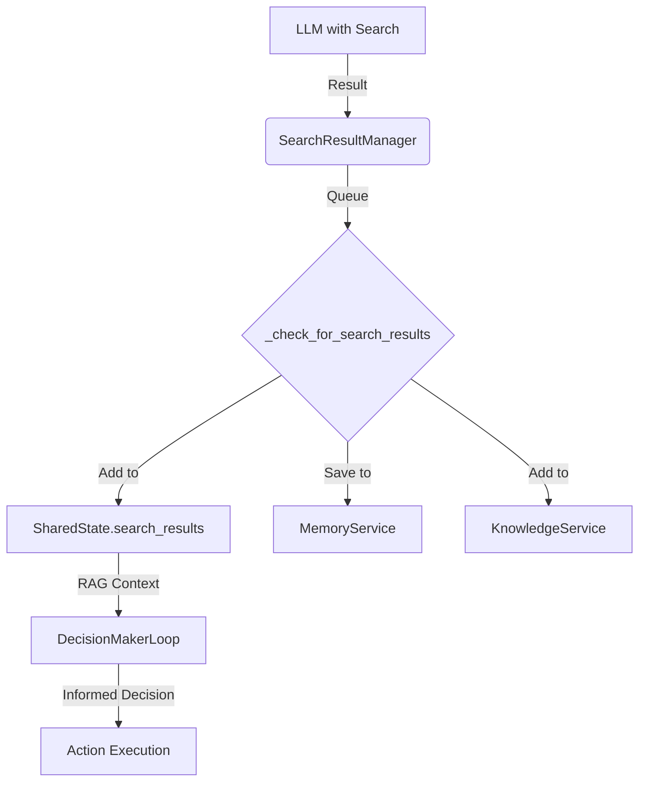
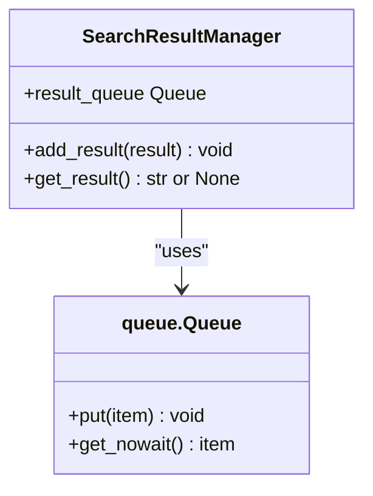
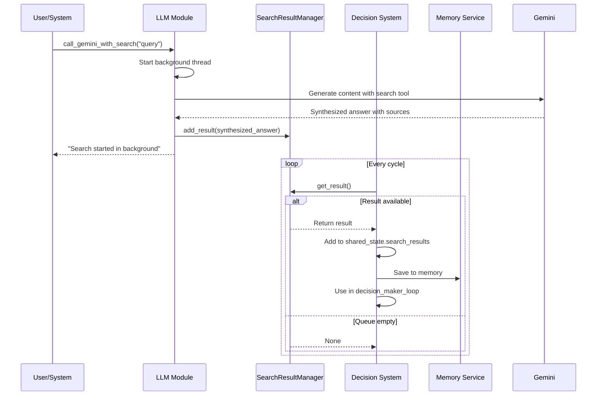
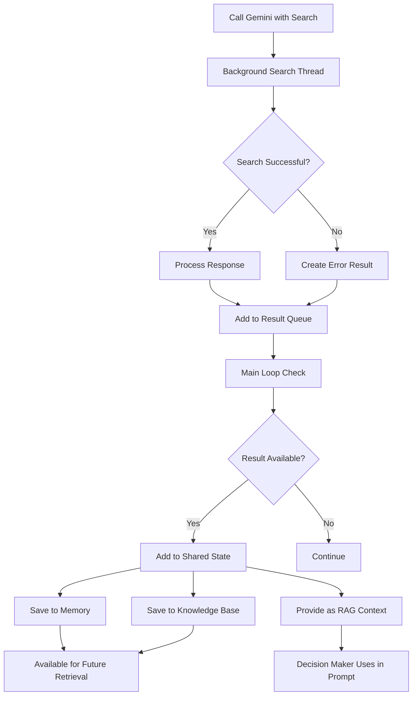
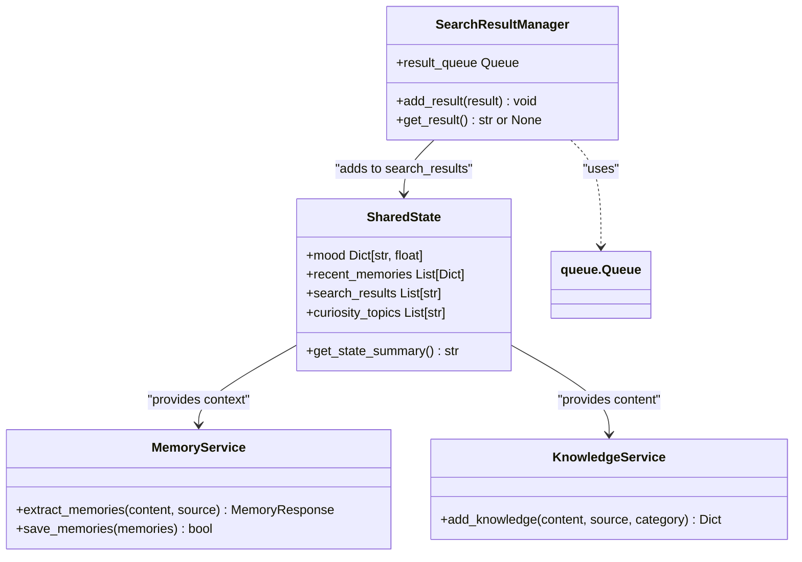

# Search Result Integration


## Table of Contents
1. [Introduction](#introduction)
2. [Core Architecture](#core-architecture)
3. [Search Result Manager Implementation](#search-result-manager-implementation)
4. [Integration with Decision-Making Workflow](#integration-with-decision-making-workflow)
5. [Data Flow and Processing Pipeline](#data-flow-and-processing-pipeline)
6. [Caching and State Management](#caching-and-state-management)
7. [Error Handling and Resilience](#error-handling-and-resilience)
8. [Configuration and Extensibility](#configuration-and-extensibility)
9. [Troubleshooting Guide](#troubleshooting-guide)

## Introduction
The SearchResultManager component is a critical subsystem within the RAVANA AGI framework responsible for handling external information retrieval and integration into the decision-making process. It enables real-time augmentation of cognitive processes by managing search results from external sources, primarily through LLM-powered web searches. This document details its architecture, workflow, integration points, and operational characteristics, providing a comprehensive understanding of how external knowledge is retrieved, processed, and utilized to enhance autonomous decision-making.

## Core Architecture
The search result integration system follows a producer-consumer pattern with asynchronous processing and shared state coordination. External information is retrieved via LLM providers with search capabilities, placed into a thread-safe queue by the SearchResultManager, and consumed by the core system loop for integration into the AGI's cognitive context. The architecture emphasizes loose coupling, resilience to API failures, and seamless integration with memory and knowledge systems.



**Diagram sources**
- [search_result_manager.py](file://modules/decision_engine/search_result_manager.py#L1-L15)
- [llm.py](file://core/llm.py#L230-L241)
- [system.py](file://core/system.py#L96-L121)

**Section sources**
- [search_result_manager.py](file://modules/decision_engine/search_result_manager.py#L1-L15)
- [llm.py](file://core/llm.py#L230-L241)
- [system.py](file://core/system.py#L96-L121)

## Search Result Manager Implementation
The SearchResultManager is implemented as a simple yet effective thread-safe queue manager that decouples search execution from result consumption. It uses Python's built-in `queue.Queue` for thread safety, allowing search operations to run in background threads while the main event loop safely retrieves results.

### Class Interface and Methods
The SearchResultManager class provides a minimal but robust interface for managing search results:

```python
class SearchResultManager:
    def __init__(self):
        self.result_queue = queue.Queue()

    def add_result(self, result):
        self.result_queue.put(result)

    def get_result(self):
        try:
            return self.result_queue.get_nowait()
        except queue.Empty:
            return None
```

**Key Methods:**
- **add_result(result)**: Thread-safe method to enqueue a search result. Called by background search threads.
- **get_result()**: Non-blocking method to retrieve a result. Returns `None` if the queue is empty, preventing the main loop from hanging.

The module also instantiates a global singleton instance:
```python
search_result_manager = SearchResultManager()
```
This singleton pattern ensures all components interact with the same result queue.



**Diagram sources**
- [search_result_manager.py](file://modules/decision_engine/search_result_manager.py#L1-L15)

**Section sources**
- [search_result_manager.py](file://modules/decision_engine/search_result_manager.py#L1-L15)

## Integration with Decision-Making Workflow
The search result system is tightly integrated with the decision-making workflow through Retrieval-Augmented Generation (RAG) patterns. Search results are incorporated into the decision context, allowing the LLM-based decision maker to leverage up-to-date external information when formulating responses and actions.

### Query Generation and Execution
Search queries are generated implicitly through the LLM's natural language processing capabilities. When the `call_gemini_with_search` function is invoked with a prompt, the Gemini API automatically determines if a web search is needed:

```python
def call_gemini_with_search(prompt):
    def search_thread():
        try:
            # Gemini API automatically performs search based on prompt
            response = client.models.generate_content(
                model=model_id,
                contents=prompt,
                config=GenerateContentConfig(tools=[google_search_tool])
            )
            result = process_response(response)
            search_result_manager.add_result(result)
        except Exception as e:
            search_result_manager.add_result(f"[Gemini with search failed: {e}]")
    
    thread = threading.Thread(target=search_thread)
    thread.start()
    return "Search started in the background. Check for results later."
```

This asynchronous design allows the system to continue processing while waiting for search results.

### Result Parsing and Relevance Scoring
The system does not perform explicit relevance scoring through traditional information retrieval methods. Instead, relevance is implicitly handled by:
1. The LLM's ability to extract relevant information during search
2. The grounding metadata provided by Gemini API
3. Subsequent processing in the decision loop

Search results include grounding metadata that indicates the sources used:
```
[Grounding Metadata:]
Source 1: https://example.com/article1 - Title of Article
Source 2: https://example.com/article2 - Another Relevant Page
```

### LLM Summarization and Synthesis
The primary "summarization" occurs within the LLM itself during the search process. The Gemini API returns a synthesized answer based on multiple sources, rather than raw search results. This synthesized result is then:
1. Added to the shared state for immediate use
2. Extracted into structured memories
3. Stored in the knowledge base for future reference



**Diagram sources**
- [llm.py](file://core/llm.py#L230-L241)
- [system.py](file://core/system.py#L96-L121)

**Section sources**
- [llm.py](file://core/llm.py#L230-L241)
- [system.py](file://core/system.py#L96-L121)

## Data Flow and Processing Pipeline
The search result processing pipeline follows a well-defined sequence from query initiation to cognitive integration, ensuring that external information is properly contextualized and made available for decision-making.

### Workflow Sequence
1. **Query Initiation**: A component calls `call_gemini_with_search()` with a natural language prompt
2. **Asynchronous Search**: The search executes in a background thread using Gemini's search tool
3. **Result Queuing**: The search result is added to the SearchResultManager's queue
4. **Result Retrieval**: The main loop periodically checks for new results via `_check_for_search_results()`
5. **State Integration**: Results are added to `shared_state.search_results`
6. **Memory Storage**: Results are processed into structured memories
7. **Knowledge Base Storage**: Results are added to the long-term knowledge base
8. **Decision Context**: Results are provided as RAG context to the decision maker

### Real-Time Data Augmentation
The DecisionMaker receives search results through the RAG (Retrieval-Augmented Generation) context parameter:

```python
decision_context = {
    'situation': situation,
    'mood': self.shared_state.mood,
    'memory': self.shared_state.recent_memories,
    'rag_context': getattr(self.shared_state, 'search_results', [])
}
```

The `decision_maker_loop` function formats this context and incorporates it into the LLM prompt:

```python
# Format RAG context safely
rag_text = ""
if rag_context:
    if isinstance(rag_context, list):
        rag_text = "\n".join([str(item) for item in rag_context[:5]])
    else:
        rag_text = str(rag_context)
```

This allows the decision maker to consider recent search results when making decisions, effectively augmenting its knowledge with current external information.



**Diagram sources**
- [llm.py](file://core/llm.py#L230-L241)
- [system.py](file://core/system.py#L96-L121)
- [decision_maker.py](file://modules/decision_engine/decision_maker.py#L1-L181)

**Section sources**
- [llm.py](file://core/llm.py#L230-L241)
- [system.py](file://core/system.py#L96-L121)
- [decision_maker.py](file://modules/decision_engine/decision_maker.py#L1-L181)

## Caching and State Management
The system employs a multi-layered approach to caching and state management, ensuring efficient use of search results while preventing resource exhaustion.

### Caching Strategies
The primary caching mechanism is the in-memory storage of search results in the shared state:

```python
# Add to shared state for immediate use
if not hasattr(self.shared_state, 'search_results'):
    self.shared_state.search_results = []
self.shared_state.search_results.append(search_result)

# Limit search results to prevent memory bloat
if len(self.shared_state.search_results) > 10:
    self.shared_state.search_results = self.shared_state.search_results[-10:]
```

This implements a sliding window cache that retains only the 10 most recent search results, preventing unbounded memory growth.

### Shared State Integration
The SharedState class explicitly includes a search_results attribute:

```python
class SharedState:
    def __init__(self, initial_mood: Dict[str, float]):
        # ... other state
        self.search_results: List[str] = []
        # ... other state
```

This design ensures that search results are treated as first-class citizens in the AGI's cognitive state, available for inspection and manipulation by various components.

### Long-Term Storage
Beyond immediate caching, search results are persisted through two mechanisms:

1. **Memory Service Integration**:
```python
memory_summary = f"Search result retrieved: {search_result[:300]}..."
memories_to_save = await self.memory_service.extract_memories(memory_summary, "")
await self.memory_service.save_memories(memories_to_save.memories)
```

2. **Knowledge Service Integration**:
```python
knowledge_result = await asyncio.to_thread(
    self.knowledge_service.add_knowledge,
    content=search_result,
    source="web_search",
    category="search_result"
)
```

This dual-storage approach ensures that important information from search results is retained long-term while immediate results are available for current decision cycles.



**Diagram sources**
- [state.py](file://core/state.py#L1-L29)
- [system.py](file://core/system.py#L96-L121)
- [search_result_manager.py](file://modules/decision_engine/search_result_manager.py#L1-L15)

**Section sources**
- [state.py](file://core/state.py#L1-L29)
- [system.py](file://core/system.py#L96-L121)

## Error Handling and Resilience
The search integration system includes comprehensive error handling to maintain system stability despite the inherent unreliability of external APIs and network services.

### Rate Limiting Strategy
The system does not implement explicit rate limiting at the SearchResultManager level. Instead, it relies on:
- The asynchronous nature of search operations
- The background thread execution model
- Natural throttling through the main loop cycle time

This approach prevents search operations from overwhelming external APIs while allowing the system to continue functioning when searches are delayed.

### Error Handling Mechanisms
The system employs a robust error handling strategy at multiple levels:

1. **Search Execution Level**:
```python
except Exception as e:
    search_result_manager.add_result(f"[Gemini with search failed: {e}]")
```
Even when searches fail, an error message is added to the result queue, ensuring consumers are informed of the failure.

2. **Result Processing Level**:
```python
async def _check_for_search_results(self):
    try:
        search_result = search_result_manager.get_result()
        # ... processing
    except Exception as e:
        logger.error(f"Error in search result processing: {e}", exc_info=True)
```
The main loop wraps result processing in try-catch blocks to prevent search-related errors from crashing the system.

3. **Memory and Knowledge Integration**:
```python
try:
    # Save to memory
except Exception as e:
    logger.warning(f"Failed to save search result to memory: {e}")

try:
    # Save to knowledge base
except Exception as e:
    logger.warning(f"Failed to add search result to knowledge base: {e}")
```
Secondary storage operations are wrapped in try-catch blocks with warnings, ensuring that failures in one system don't affect others.

### Common Issues and Mitigation
**API Failures**: Mitigated by adding error messages to the result queue and continuing system operation.

**Irrelevant Results**: Addressed through the LLM's natural filtering capabilities and the grounding metadata that shows sources.

**Excessive Latency**: Handled through the asynchronous design, which prevents the main loop from blocking on search operations.

**Memory Bloat**: Prevented by limiting the search_results list to 10 items and processing results into structured memories.

**Section sources**
- [llm.py](file://core/llm.py#L241-L241)
- [system.py](file://core/system.py#L96-L121)

## Configuration and Extensibility
The current implementation has limited explicit configuration options for search functionality, relying instead on environment variables and provider-specific settings.

### Configuration Options
While not explicitly defined in configuration files, the system respects several environment variables that affect search behavior:
- `GEMINI_API_KEY`: Authentication for the Gemini API
- Provider-specific API keys (A4F_API_KEY, ZUKIJOURNEY_API_KEY, etc.)

### Search Provider Integration
The system is designed to work primarily with Gemini's search capabilities, but the architecture allows for potential integration with other search providers through the LLM abstraction layer. The `call_llm` function provides a fallback mechanism:

```python
def call_llm(prompt, preferred_provider=None, model=None):
    providers = [
        (call_zuki, 'zuki'),
        (call_electronhub, 'electronhub'),
        (call_zanity, 'zanity'),
        (call_a4f, 'a4f'),
    ]
    # Try providers in order
    # Fallback to Gemini
    return call_gemini(prompt)
```

This design ensures that search functionality remains available even if preferred providers fail.

### Result Limits and Freshness
The system implements implicit limits on search results:
- **Quantity Limit**: Maximum of 10 recent search results stored in shared state
- **Freshness**: Results are consumed in FIFO order, with older results eventually being removed from the cache

There is no explicit freshness threshold based on time, as the system assumes that new searches will be performed when current information is insufficient.

**Section sources**
- [llm.py](file://core/llm.py#L1-L447)
- [system.py](file://core/system.py#L96-L121)

## Troubleshooting Guide
This section addresses common issues encountered with the search result integration system and provides diagnostic steps and solutions.

### Common Issues

**Issue: Search results not appearing in decision context**
- **Diagnosis**: Check if `call_gemini_with_search` is being called and if results are being added to the queue
- **Solution**: Verify that `_check_for_search_results` is being called in the main loop and that the shared state has the search_results attribute

**Issue: System hanging during search operations**
- **Diagnosis**: The system should not hang due to the asynchronous design
- **Solution**: If hanging occurs, check for exceptions in the search thread that might prevent proper thread completion

**Issue: Memory bloat from search results**
- **Diagnosis**: Monitor the size of `shared_state.search_results`
- **Solution**: The system automatically limits results to 10 items, but ensure that the memory and knowledge services are properly processing and deduplicating content

**Issue: Repeated API failures**
- **Diagnosis**: Check logs for consistent error messages from the Gemini API
- **Solution**: Verify API key validity and network connectivity; consider implementing exponential backoff in future versions

### Diagnostic Commands
```python
# Check current search results
print(agi_system.shared_state.search_results)

# Check if search result manager has pending results
result = search_result_manager.get_result()
if result:
    print(f"Pending result: {result[:100]}...")
else:
    print("No pending search results")

# View recent memory entries related to searches
recent_memories = [m for m in agi_system.shared_state.recent_memories 
                   if "Search result retrieved" in str(m)]
print(f"Found {len(recent_memories)} search-related memories")
```

**Section sources**
- [system.py](file://core/system.py#L96-L121)
- [llm.py](file://core/llm.py#L230-L241)
- [state.py](file://core/state.py#L1-L29)

**Referenced Files in This Document**   
- [search_result_manager.py](file://modules/decision_engine/search_result_manager.py#L1-L15)
- [llm.py](file://core/llm.py#L20-L241)
- [system.py](file://core/system.py#L29-L105)
- [state.py](file://core/state.py#L1-L29)
- [decision_maker.py](file://modules/decision_engine/decision_maker.py#L1-L181)