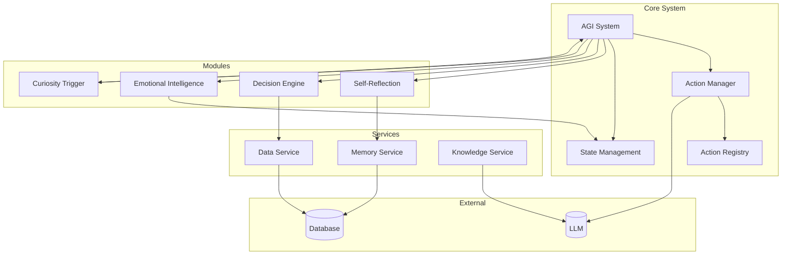
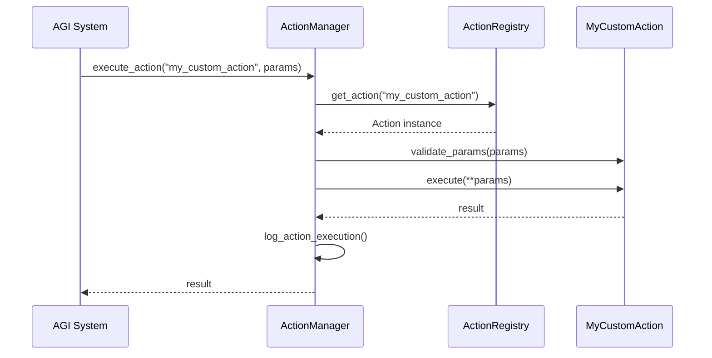

# Development Guide


## Table of Contents
1. [Introduction](#introduction)
2. [Project Structure](#project-structure)
3. [Setup and Environment Configuration](#setup-and-environment-configuration)
4. [Adding New Actions Using the Registry Pattern](#adding-new-actions-using-the-registry-pattern)
5. [Creating New Modules](#creating-new-modules)
6. [Testing Procedures and Best Practices](#testing-procedures-and-best-practices)
7. [Debugging and Logging](#debugging-and-logging)
8. [Contribution Guidelines](#contribution-guidelines)
9. [Common Pitfalls and Integration Challenges](#common-pitfalls-and-integration-challenges)
10. [Recommended Tools and IDE Setup](#recommended-tools-and-ide-setup)

## Introduction
This Development Guide provides comprehensive instructions for developers contributing to the RAVANA AGI project. It covers setup, module creation, action registration, testing, debugging, and contribution workflows. The guide is designed to help developers understand the system's architecture and best practices for extending its functionality.

## Project Structure
The RAVANA project follows a modular architecture with clearly defined components. The main directories include:

- **core**: Contains the central system logic, action management, and state handling
- **modules**: Houses specialized functional modules like self-reflection, decision engine, and emotional intelligence
- **services**: Provides data, memory, knowledge, and multi-modal services
- **database**: Manages database engine and models
- **tests**: Includes unit, integration, and validation tests
- **prompts**: Stores prompt templates for various system functions



**Diagram sources**
- [README.md](file://README.md)
- [core/action_manager.py](file://core/action_manager.py)

**Section sources**
- [README.md](file://README.md)

## Setup and Environment Configuration
### Prerequisites
- Python 3.13 or higher
- uv (Python package manager)

### Installation
```bash
git clone https://github.com/OpenSource-Syndicate/RAVANA.git
cd RAVANA
uv venv
# Activate virtual environment:
# Windows: .venv\Scripts\activate
# macOS/Linux: source .venv/bin/activate
uv pip install -e .
```

### Dependency Management
The project uses `pyproject.toml` for dependency management. Core dependencies include:
- **AI/ML**: torch, transformers, langchain, sentence-transformers
- **Database**: asyncpg, psycopg2-binary, pgvector, chromadb
- **Web/API**: fastapi, aiohttp, uvicorn
- **Utilities**: numpy, pandas, watchdog, python-json-logger

Optional dependencies are available for conversational AI:
```toml
[project.optional-dependencies]
conversational-ai = [
    "discord.py>=2.0.0",
    "python-telegram-bot>=20.0",
]
```

### Running the System
```bash
uv run main.py
```

**Section sources**
- [README.md](file://README.md)
- [pyproject.toml](file://pyproject.toml)

## Adding New Actions Using the Registry Pattern
The action registry pattern enables dynamic registration and management of executable behaviors within the AGI system.

### Action Registry Implementation
The `ActionRegistry` class manages all available actions:

```python
class ActionRegistry:
    def __init__(self, system: 'AGISystem', data_service: 'DataService') -> None:
        self.actions: Dict[str, Action] = {}
        # Pre-register core actions
        self._register_action(ProposeAndTestInventionAction(system, data_service))
        self._register_action(LogMessageAction(system, data_service))
        # ... other actions
```

### Creating a New Action
1. Create a new Python file in `core/actions/` (e.g., `my_action.py`)
2. Implement the action by extending the `Action` base class:

```python
from core.actions.action import Action
from typing import Any, Dict, List

class MyCustomAction(Action):
    def __init__(self, system: 'AGISystem', data_service: 'DataService'):
        super().__init__(system, data_service)

    @property
    def name(self) -> str:
        return "my_custom_action"

    @property
    def description(self) -> str:
        return "Performs a custom operation defined by the developer."

    @property
    def parameters(self) -> List[Dict[str, Any]]:
        return [
            {
                "name": "parameter_name",
                "type": "string",
                "description": "Description of the parameter",
                "required": True,
            }
        ]

    async def execute(self, **kwargs: Any) -> Any:
        # Validate parameters
        self.validate_params(kwargs)
        
        # Implement action logic here
        parameter_value = kwargs.get("parameter_name")
        
        # Return result
        return {"status": "success", "message": f"Executed with {parameter_value}"}
```

### Registering the Action
Add the action to the registry in `core/actions/registry.py`:

```python
from core.actions.my_action import MyCustomAction

# In ActionRegistry.__init__():
self._register_action(MyCustomAction(system, data_service))
```

### Action Execution Flow


**Diagram sources**
- [core/actions/registry.py](file://core/actions/registry.py)
- [core/action_manager.py](file://core/action_manager.py)

**Section sources**
- [core/actions/registry.py](file://core/actions/registry.py)
- [core/actions/action.py](file://core/actions/action.py)

## Creating New Modules
The system supports modular extensions that can be developed independently.

### Module Structure
A typical module follows this structure:
```
modules/my_module/
├── main.py
├── pyproject.toml
├── requirements.txt
├── my_module.py
└── test_my_module.py
```

### Module Implementation
Using the agent_self_reflection module as a template:

1. **Create main.py**: Entry point with command-line interface
```python
def main():
    import argparse
    parser = argparse.ArgumentParser(description="Module Description")
    subparsers = parser.add_subparsers(dest="command", help="Command to run")
    
    # Add subcommands
    reflect_parser = subparsers.add_parser('reflect', help='Generate a reflection')
    reflect_parser.add_argument('--task', type=str, required=True)
    reflect_parser.add_argument('--outcome', type=str, required=True)
    
    args = parser.parse_args()
    
    if args.command == 'reflect':
        result = reflect_on_task(args.task, args.outcome)
        print(json.dumps(result, indent=2))
```

2. **Define dependencies** in pyproject.toml:
```toml
[project]
name = "my-module"
version = "0.1.0"
requires-python = ">=3.13"
dependencies = [
    "google-genai>=1.23.0",
    "openai>=1.93.0",
    "requests>=2.32.4",
]
```

3. **List specific package versions** in requirements.txt (generated from dependency resolution)

### Module Integration
Modules can integrate with core services:
- Import core components: `from core.llm import call_llm`
- Access shared state: `from core.state import SharedState`
- Use data services: `from services.data_service import DataService`

**Section sources**
- [modules/agent_self_reflection/main.py](file://modules/agent_self_reflection/main.py)
- [modules/agent_self_reflection/pyproject.toml](file://modules/agent_self_reflection/pyproject.toml)
- [modules/agent_self_reflection/requirements.txt](file://modules/agent_self_reflection/requirements.txt)

## Testing Procedures and Best Practices
The project includes a comprehensive testing framework using pytest.

### Test Structure
Tests are organized in the `tests/` directory with naming convention `test_<component>.py`.

### Writing Unit Tests
Example test structure from test_system.py:

```python
import pytest
import asyncio
from unittest.mock import AsyncMock, MagicMock

from core.system import AGISystem

@pytest.fixture
def agi_system(mock_engine):
    return AGISystem(mock_engine)

@pytest.mark.asyncio
async def test_agi_system_initialization(agi_system):
    assert agi_system is not None
    assert isinstance(agi_system.shared_state, SharedState)

@pytest.mark.asyncio
async def test_execute_action_unknown_action(agi_system):
    decision = {"action": "unknown_action", "params": {}}
    output = await agi_system.execute_action(decision)
    assert output == "No action taken."
```

### Test Types
- **Unit tests**: Test individual components in isolation
- **Integration tests**: Verify interactions between components
- **Validation scripts**: Check structural completeness (e.g., validate_memory_integration_manager.py)
- **End-to-end tests**: Test complete workflows

### Testing Best Practices
1. Use `pytest.mark.asyncio` for asynchronous tests
2. Mock external dependencies using `unittest.mock`
3. Test edge cases and error handling
4. Include test coverage for critical paths
5. Use descriptive test names that explain the scenario

### Running Tests
```bash
# Run all tests
pytest

# Run specific test file
pytest tests/test_system.py

# Run with verbose output
pytest -v
```

**Section sources**
- [tests/test_system.py](file://tests/test_system.py)

## Debugging and Logging
### Logging Configuration
The system uses Python's logging module with structured logging via python-json-logger.

### Debugging Techniques
1. **Enable verbose logging**: Check log files in the system's logging directory
2. **Use breakpoints**: Add `import pdb; pdb.set_trace()` in code
3. **Analyze action logs**: Review saved action logs in the database
4. **Monitor state changes**: Track shared state modifications

### Performance Profiling
1. Use Python's cProfile for performance analysis
2. Monitor memory usage with psutil
3. Track action execution times in logs
4. Use the built-in performance monitoring in VLTM components

## Contribution Guidelines
### Code Style
- Follow PEP 8 guidelines
- Use type hints for all functions and variables
- Write comprehensive docstrings
- Keep functions focused and small

### Pull Request Workflow
1. Fork the repository
2. Create a feature branch
3. Implement changes with tests
4. Ensure all tests pass
5. Submit pull request with detailed description

### Code Review Expectations
- Clear documentation of changes
- Appropriate test coverage
- No breaking changes without justification
- Performance considerations addressed

## Common Pitfalls and Integration Challenges
### Common Issues
- **Circular imports**: Avoid importing from modules that depend on core
- **Async/sync mixing**: Ensure proper async handling in coroutines
- **Dependency conflicts**: Use uv to manage dependencies
- **Memory leaks**: Properly manage object lifecycles

### Integration Challenges
- **State synchronization**: Ensure shared state is properly coordinated
- **Action naming conflicts**: Use unique action names
- **Database schema changes**: Handle migrations carefully
- **LLM response parsing**: Validate and sanitize LLM outputs

## Recommended Tools and IDE Setup
### Development Tools
- **IDE**: VS Code or PyCharm
- **Python Manager**: uv
- **Testing**: pytest, pytest-asyncio
- **Formatting**: black, isort
- **Linting**: flake8, mypy

### IDE Configuration
1. Set up virtual environment interpreter
2. Install Python extension (VS Code) or configure project SDK (PyCharm)
3. Enable linting and type checking
4. Configure test discovery for pytest
5. Set up debugging configuration for main.py

### Productivity Tips
- Use code snippets for common patterns
- Configure auto-format on save
- Set up test runners in IDE
- Use version control integration
- Enable Git pre-commit hooks for linting

**Referenced Files in This Document**   
- [README.md](file://README.md)
- [pyproject.toml](file://pyproject.toml)
- [core/actions/registry.py](file://core/actions/registry.py)
- [core/actions/action.py](file://core/actions/action.py)
- [core/action_manager.py](file://core/action_manager.py)
- [modules/agent_self_reflection/main.py](file://modules/agent_self_reflection/main.py)
- [modules/agent_self_reflection/pyproject.toml](file://modules/agent_self_reflection/pyproject.toml)
- [modules/agent_self_reflection/requirements.txt](file://modules/agent_self_reflection/requirements.txt)
- [tests/test_system.py](file://tests/test_system.py)