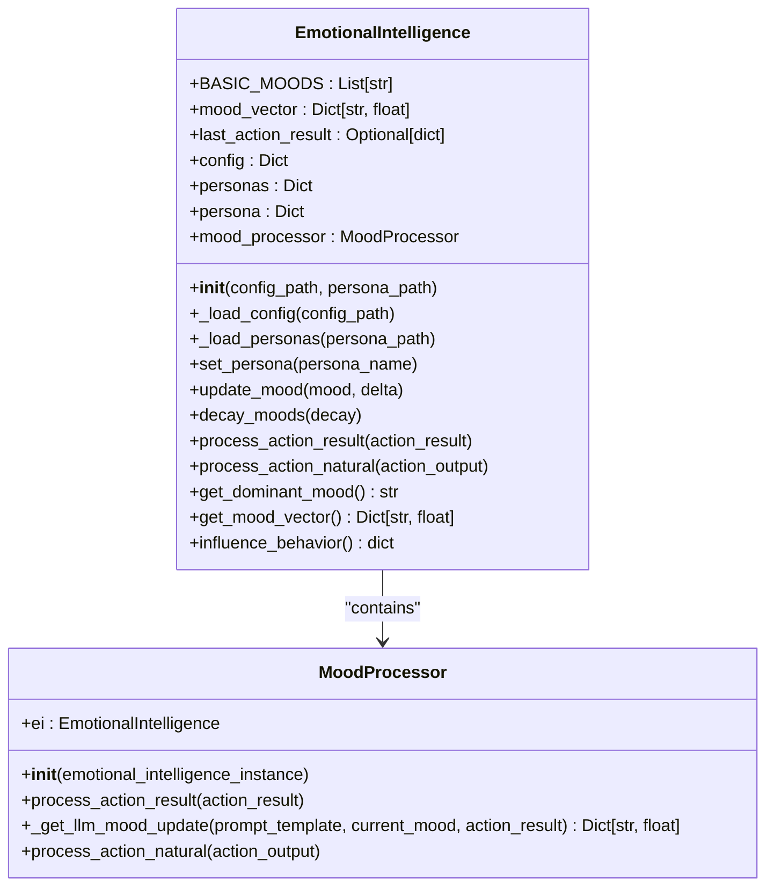
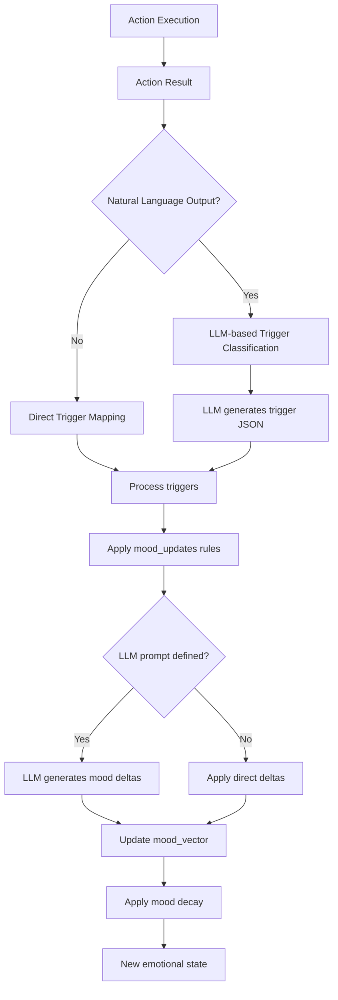
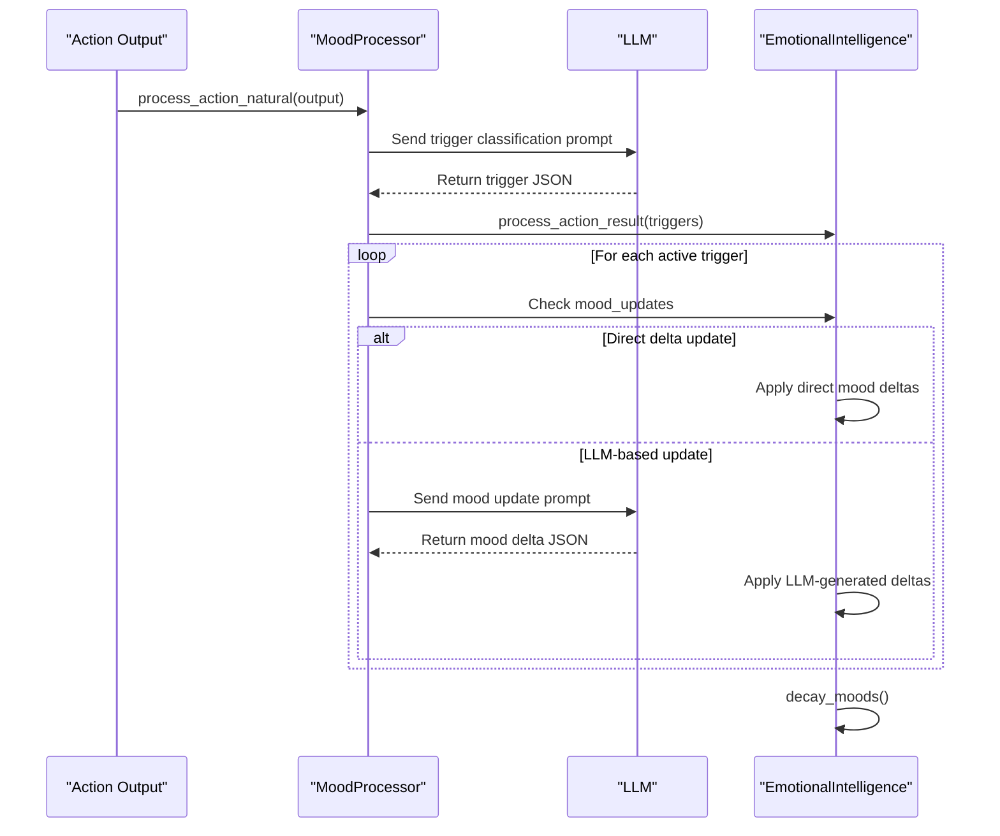
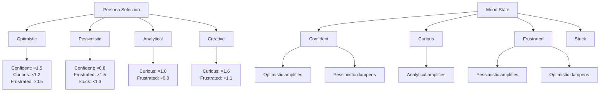
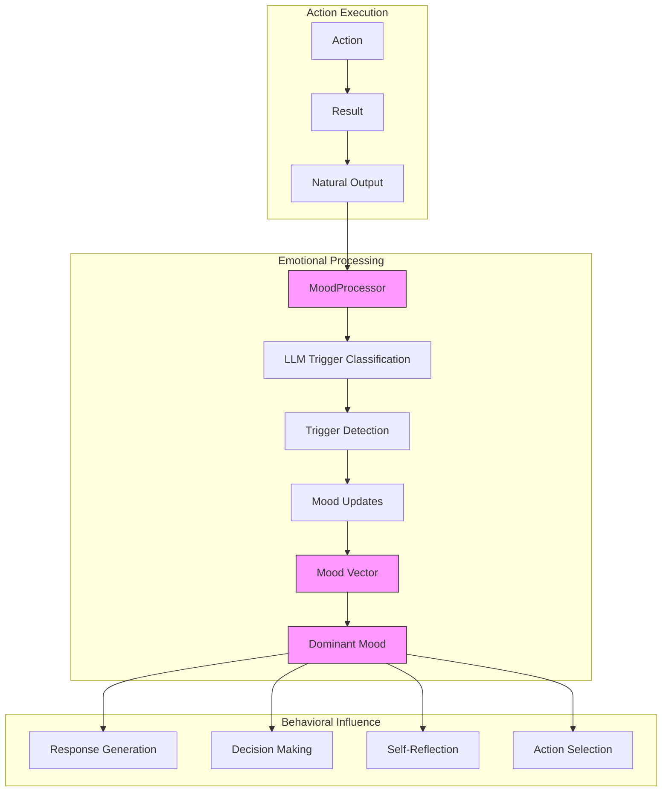

# Emotional Response Generation


## Table of Contents
1. [Introduction](#introduction)
2. [Core Architecture](#core-architecture)
3. [Emotional State Management](#emotional-state-management)
4. [Response Generation Process](#response-generation-process)
5. [Personality and Mood Influence](#personality-and-mood-influence)
6. [Integration with Action Execution](#integration-with-action-execution)
7. [Common Issues and Best Practices](#common-issues-and-best-practices)

## Introduction
The Emotional Response Generation system in the RAVANA framework enables context-aware emotional expression by modeling mood dynamics, personality traits, and situational context. This document details how the EmotionalIntelligence class generates expressive responses through a combination of rule-based triggers, LLM-driven analysis, and dynamic state tracking. The system supports multiple emotional personas and integrates with action execution and self-reflection modules to create coherent, emotionally grounded behavior.

**Section sources**
- [emotional_intellegence.py](file://modules/emotional_intellegence/emotional_intellegence.py#L1-L94)

## Core Architecture



**Diagram sources**
- [emotional_intellegence.py](file://modules/emotional_intellegence/emotional_intellegence.py#L1-L94)
- [mood_processor.py](file://modules/emotional_intellegence/mood_processor.py#L1-L103)

**Section sources**
- [emotional_intellegence.py](file://modules/emotional_intellegence/emotional_intellegence.py#L1-L94)
- [mood_processor.py](file://modules/emotional_intellegence/mood_processor.py#L1-L103)

## Emotional State Management

The EmotionalIntelligence class maintains a continuous mood vector that represents the agent's emotional state across multiple dimensions. The system uses predefined positive and negative mood states defined in the core configuration.

### Mood Vector Initialization
The mood vector is initialized using constants from the Config class:

```python
self.BASIC_MOODS = Config.POSITIVE_MOODS + Config.NEGATIVE_MOODS
self.mood_vector: Dict[str, float] = {mood: 0.0 for mood in self.BASIC_MOODS}
```

Where:
- **POSITIVE_MOODS**: ['Confident', 'Curious', 'Reflective', 'Excited', 'Content']
- **NEGATIVE_MOODS**: ['Frustrated', 'Stuck', 'Low Energy', 'Bored']

### Mood Dynamics
The system implements two key mechanisms for mood state evolution:

1. **Mood Updates**: Triggered by action outcomes, either directly or through LLM analysis
2. **Mood Decay**: Gradual reduction of all mood intensities to prevent emotional saturation



**Diagram sources**
- [emotional_intellegence.py](file://modules/emotional_intellegence/emotional_intellegence.py#L1-L94)
- [mood_processor.py](file://modules/emotional_intellegence/mood_processor.py#L1-L103)

**Section sources**
- [emotional_intellegence.py](file://modules/emotional_intellegence/emotional_intellegence.py#L1-L94)
- [mood_processor.py](file://modules/emotional_intellegence/mood_processor.py#L1-L103)
- [config.py](file://core/config.py#L1-L42)

## Response Generation Process

The response generation system uses a two-stage process to convert action outcomes into emotionally expressive behavior.

### Natural Language Processing Pipeline
When processing natural language action outputs, the system uses an LLM to classify emotional triggers:

```python
def process_action_natural(self, action_output: str):
    definitions = self.ei.config["triggers"]
    
    prompt = f"""
You are an AI analysis system. Your task is to classify an AI agent's action output based on predefined triggers.
Analyze the action output below and respond with only a valid JSON object mapping each trigger to a boolean value.
Be nuanced: an action can trigger multiple categories. For example, discovering a new fact while making progress on a task should trigger both.

**Context:**
- Dominant Mood: {self.ei.get_dominant_mood()}
- Persona: {self.ei.persona.get('name', 'default')}

**Trigger Definitions:**
{json.dumps(definitions, indent=2)}

**Action Output:**
"{action_output}"

**Your JSON Response (only the JSON object):**
"""
```

### Dynamic Mood Updates
The system supports both direct and LLM-mediated mood updates:



**Diagram sources**
- [mood_processor.py](file://modules/emotional_intellegence/mood_processor.py#L1-L103)
- [emotional_intellegence.py](file://modules/emotional_intellegence/emotional_intellegence.py#L1-L94)

**Section sources**
- [mood_processor.py](file://modules/emotional_intellegence/mood_processor.py#L1-L103)
- [emotional_intellegence.py](file://modules/emotional_intellegence/emotional_intellegence.py#L1-L94)
- [llm.py](file://core/llm.py#L1-L119)

## Personality and Mood Influence

The system implements a flexible personality model that modulates emotional responses based on defined personas.

### Personality System
The persona.json file defines multiple emotional profiles with mood multipliers:

```json
{
    "personas": {
        "Optimistic": {
            "mood_multipliers": {
                "Confident": 1.5,
                "Curious": 1.2,
                "Frustrated": 0.5,
                "Stuck": 0.7,
                "Low Energy": 0.8
            },
            "description": "Sees the glass as half full. Bounces back from setbacks quickly."
        },
        "Pessimistic": {
            "mood_multipliers": {
                "Confident": 0.8,
                "Curious": 0.9,
                "Frustrated": 1.5,
                "Stuck": 1.3,
                "Low Energy": 1.2
            },
            "description": "Tends to expect negative outcomes and is more affected by failures."
        }
    },
    "default_persona": "Optimistic"
}
```

### Mood-Response Mapping
The system maps dominant moods to behavioral influences through the influence_behavior method:

```python
def influence_behavior(self) -> dict:
    mood = self.get_dominant_mood()
    return self.config.get("behavior_influences", {}).get(mood, {})
```

This allows different moods to trigger distinct response patterns and behavioral tendencies.



**Diagram sources**
- [persona.json](file://modules/emotional_intellegence/persona.json#L1-L45)
- [emotional_intellegence.py](file://modules/emotional_intellegence/emotional_intellegence.py#L1-L94)

**Section sources**
- [persona.json](file://modules/emotional_intellegence/persona.json#L1-L45)
- [emotional_intellegence.py](file://modules/emotional_intellegence/emotional_intellegence.py#L1-L94)

## Integration with Action Execution

The emotional response system is tightly integrated with action execution and self-reflection components.

### Action Result Processing
The system processes both structured action results and natural language outputs:

```python
def process_action_result(self, action_result: dict):
    self.mood_processor.process_action_result(action_result)

def process_action_natural(self, action_output: str):
    self.mood_processor.process_action_natural(action_output)
```

### Self-Reflection Integration
While not explicitly shown in the code, the emotional state influences self-reflection through:
- Dominant mood context in reflection prompts
- Emotional valence affecting self-assessment
- Personality traits shaping introspective tendencies

### Expressive Behavior
The mood vector and dominant mood inform expressive behavior by:
1. Modulating language style and tone
2. Influencing response content and focus
3. Shaping decision-making tendencies
4. Guiding exploration vs. exploitation balance



**Diagram sources**
- [emotional_intellegence.py](file://modules/emotional_intellegence/emotional_intellegence.py#L1-L94)
- [mood_processor.py](file://modules/emotional_intellegence/mood_processor.py#L1-L103)

**Section sources**
- [emotional_intellegence.py](file://modules/emotional_intellegence/emotional_intellegence.py#L1-L94)
- [mood_processor.py](file://modules/emotional_intellegence/mood_processor.py#L1-L103)

## Common Issues and Best Practices

### Common Issues

1. **Generic Responses**: When LLM classification fails to parse JSON, the system may miss emotional triggers
   - **Solution**: Implement robust JSON extraction with regex fallback

2. **Emotional Dissonance**: Rapid mood state changes can create inconsistent emotional expression
   - **Solution**: Use mood decay and smoothing to create gradual transitions

3. **Context Mismatch**: The LLM may misclassify triggers due to insufficient context
   - **Solution**: Include dominant mood and persona in trigger classification prompts

### Best Practices

#### Template Design
- **Be Specific**: Define clear trigger definitions with concrete examples
- **Allow Nuance**: Permit multiple triggers to activate simultaneously
- **Include Context**: Reference current mood and persona in classification prompts

#### Response Intensity Calibration
- **Use Multipliers**: Implement persona-based mood multipliers for consistent emotional profiles
- **Apply Decay**: Use mood decay to prevent emotional saturation
- **Cap Values**: Ensure mood values remain within reasonable bounds

#### Integration Guidelines
- **Consistent Context**: Pass emotional state to all relevant modules
- **Feedback Loops**: Allow self-reflection to modify emotional parameters
- **Cross-Validation**: Use multiple signals (action results, natural language) for robust mood assessment

**Section sources**
- [emotional_intellegence.py](file://modules/emotional_intellegence/emotional_intellegence.py#L1-L94)
- [mood_processor.py](file://modules/emotional_intellegence/mood_processor.py#L1-L103)
- [persona.json](file://modules/emotional_intellegence/persona.json#L1-L45)

**Referenced Files in This Document**   
- [emotional_intellegence.py](file://modules/emotional_intellegence/emotional_intellegence.py#L1-L94)
- [mood_processor.py](file://modules/emotional_intellegence/mood_processor.py#L1-L103)
- [persona.json](file://modules/emotional_intellegence/persona.json#L1-L45)
- [config.py](file://core/config.py#L1-L42)
- [llm.py](file://core/llm.py#L1-L119)