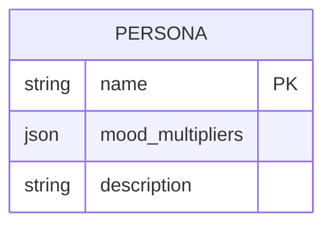
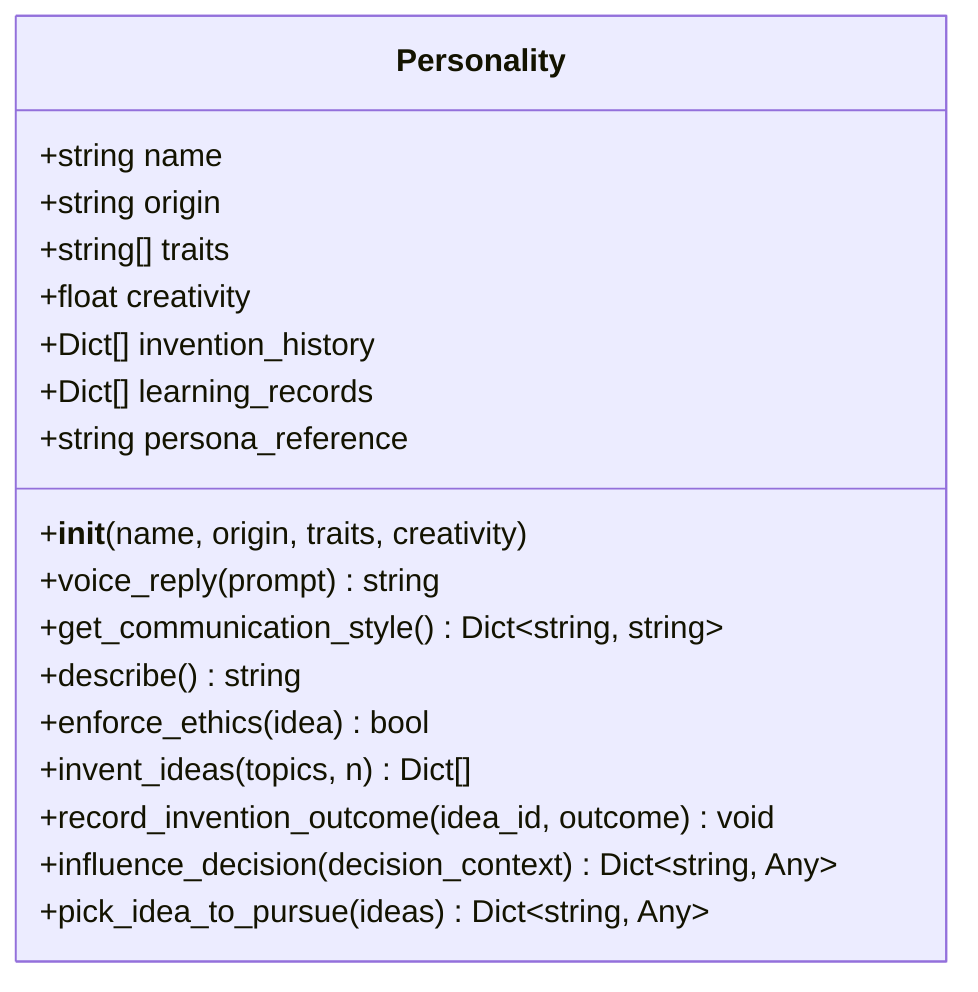
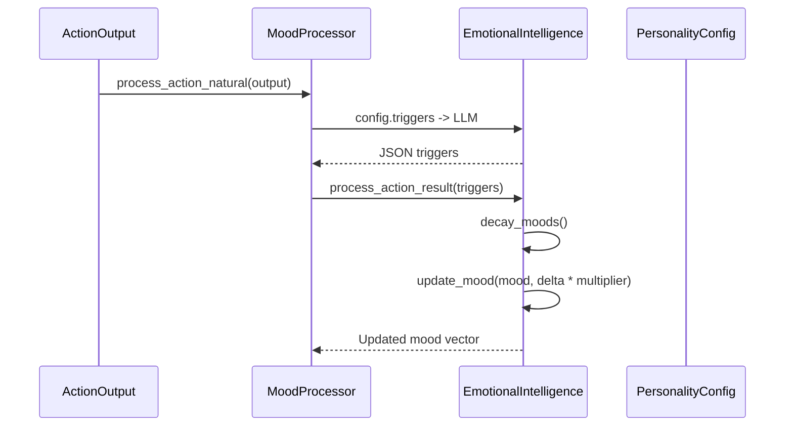
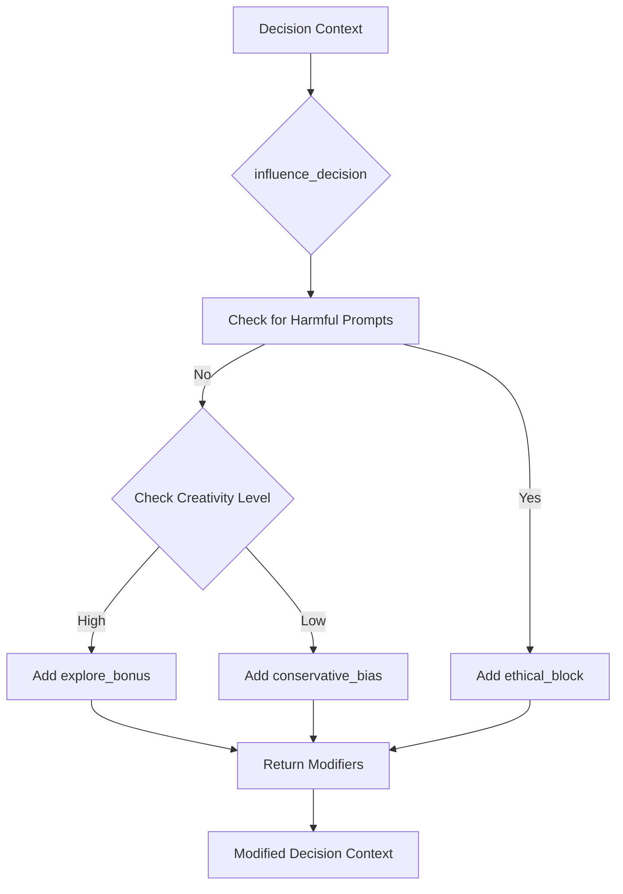
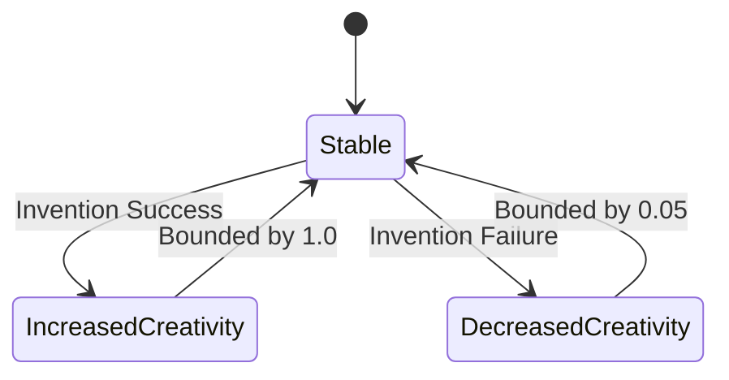

# Persona and Personality Management


## Table of Contents
1. [Introduction](#introduction)
2. [Persona Configuration and Core Traits](#persona-configuration-and-core-traits)
3. [Personality Class Implementation](#personality-class-implementation)
4. [Dynamic Mood and Emotional Intelligence Integration](#dynamic-mood-and-emotional-intelligence-integration)
5. [Personality Influence on Decision-Making](#personality-influence-on-decision-making)
6. [Personality Evolution and Learning](#personality-evolution-and-learning)
7. [Integration with Memory and Self-Reflection](#integration-with-memory-and-self-reflection)
8. [Common Issues and Design Guidelines](#common-issues-and-design-guidelines)
9. [Conclusion](#conclusion)

## Introduction
This document provides a comprehensive analysis of the persona and personality management system within the RAVANA AGI framework. It details how static personality traits are defined, how dynamic mood states influence behavior, and how the system evolves through experience. The architecture integrates personality with emotional intelligence, decision-making, memory, and learning systems to create a cohesive and adaptive agent. The analysis is based on direct examination of the source code and configuration files, ensuring accuracy and technical depth.

## Persona Configuration and Core Traits

The core personality traits, values, and behavioral tendencies are defined in the `persona.json` configuration file. This file establishes a set of named personas, each with a unique set of mood multipliers that define how the agent's emotional responses are amplified or dampened.



**Diagram sources**
- [persona.json](file://modules/emotional_intellegence/persona.json)

The `persona.json` file defines four primary personas: "Optimistic", "Pessimistic", "Analytical", and "Creative". Each persona contains a `mood_multipliers` object that maps specific moods to numerical multipliers. For example, the "Optimistic" persona has a multiplier of 1.5 for "Confident" and 0.5 for "Frustrated", meaning positive moods are amplified while negative ones are suppressed.

```json
{
    "personas": {
        "Optimistic": {
            "mood_multipliers": {
                "Confident": 1.5,
                "Curious": 1.2,
                "Frustrated": 0.5,
                "Stuck": 0.7,
                "Low Energy": 0.8
            },
            "description": "Sees the glass as half full. Bounces back from setbacks quickly."
        },
        "Pessimistic": {
            "mood_multipliers": {
                "Confident": 0.8,
                "Curious": 0.9,
                "Frustrated": 1.5,
                "Stuck": 1.3,
                "Low Energy": 1.2
            },
            "description": "Tends to expect negative outcomes and is more affected by failures."
        }
    },
    "default_persona": "Optimistic"
}
```

The `default_persona` field specifies which persona is loaded by default. This configuration allows for easy switching between different personality profiles, enabling the agent to adapt its emotional response pattern to different contexts or user preferences.

**Section sources**
- [persona.json](file://modules/emotional_intellegence/persona.json)

## Personality Class Implementation

The `Personality` class, implemented in `personality.py`, is responsible for managing the agent's named persona, generating creative ideas, tracking invention history, and influencing decision contexts. It serves as a lightweight personality layer that encapsulates the agent's core identity and behavioral tendencies.



**Diagram sources**
- [personality.py](file://modules/personality/personality.py#L0-L206)

The class is initialized with a name, origin, a list of traits, and a creativity score. The default traits are ["Fearless Dreamer", "Grassroots Solver", "Ethical but Ruthless in Logic", "Cosmic Curiosity", "Philosopher-Inventor"], which define the agent's core identity. The `creativity` attribute, a float between 0.0 and 1.0, is a key dynamic parameter that influences idea generation and risk-taking.

The `invent_ideas` method generates creative invention ideas based on a list of topics. It uses a random seed derived from the topics, creativity level, and current time to ensure reproducibility. Ideas are given mythic and poetic titles (e.g., "Anchor of Aeons: Novel Sensors Prototype") and practical engineering approaches. An ethical gate (`enforce_ethics`) filters out ideas containing harmful keywords like "weapon" or "kill".

```python
def invent_ideas(self, topics: List[str], n: int = 3) -> List[Dict[str, Any]]:
    # ... (code to generate ideas)
    # Ethical gate
    if not self.enforce_ethics(idea):
        continue
    # ... (code to rank ideas)
    return ideas
```

The `voice_reply` method provides a lightweight, rule-based system for generating persona-styled responses. It uses simple keyword matching to select from a set of pre-defined, metaphor-rich replies that reflect the agent's philosophical and inventive nature.

**Section sources**
- [personality.py](file://modules/personality/personality.py#L0-L206)

## Dynamic Mood and Emotional Intelligence Integration

The agent's dynamic mood states are managed by the `EmotionalIntelligence` class, which integrates with the static personality configuration to shape real-time behavior. This system processes natural language outputs from actions to update a multi-dimensional mood vector.



**Diagram sources**
- [emotional_intellegence.py](file://modules/emotional_intellegence/emotional_intellegence.py#L0-L94)
- [mood_processor.py](file://modules/emotional_intellegence/mood_processor.py#L0-L103)

The `EmotionalIntelligence` class initializes with a mood vector for a set of basic moods (e.g., "Confident", "Frustrated"). When an action output is processed via `process_action_natural`, the `MoodProcessor` uses an LLM to classify the output against a set of predefined triggers (e.g., "discovery", "success", "error"). The resulting trigger dictionary is then used to update the mood vector.

The key integration point with personality is in the `update_mood` method. Before applying a mood delta, it retrieves a multiplier from the currently active persona's `mood_multipliers` configuration. This multiplier scales the emotional response, effectively making the agent's mood shifts more or less pronounced based on its personality.

```python
def update_mood(self, mood: str, delta: float):
    if mood in self.mood_vector:
        multiplier = self.persona.get("mood_multipliers", {}).get(mood, 1.0)
        self.mood_vector[mood] = max(0.0, self.mood_vector[mood] + delta * multiplier)
```

This creates a feedback loop where the static personality (the multiplier) shapes the dynamic mood state, which in turn influences behavior through the `influence_behavior` method.

**Section sources**
- [emotional_intellegence.py](file://modules/emotional_intellegence/emotional_intellegence.py#L0-L94)
- [mood_processor.py](file://modules/emotional_intellegence/mood_processor.py#L0-L103)

## Personality Influence on Decision-Making

The `Personality` class directly influences the agent's decision-making process through the `influence_decision` method. This method analyzes the decision context and returns a set of modifiers that are applied before the final decision is made.



**Diagram sources**
- [personality.py](file://modules/personality/personality.py#L165-L193)
- [system.py](file://core/system.py#L265-L293)

In the `AGISystem._make_decision` method, the personality's influence is applied as one of the first steps in the decision pipeline, before adaptive learning adaptations.

```python
decision_context = { ... }
# Let personality influence decision context
persona_mods = self.personality.influence_decision(decision_context)
if persona_mods:
    decision_context['persona_mods'] = persona_mods
```

The `influence_decision` method implements two primary strategies:
1.  **Ethical Filtering**: If the situation prompt contains keywords like "attack", "harm", or "destroy", it sets an `ethical_block` modifier, effectively preventing harmful actions.
2.  **Creativity-Based Bias**: If the `creativity` score is high (> 0.75), it adds an `explore_bonus` modifier to encourage bold, exploratory options. If the score is low (< 0.3), it adds a `conservative_bias` to favor safe, robust choices.

These modifiers are then used by the decision engine (e.g., `decision_maker_loop`) to weight different action options, ensuring the agent's behavior is consistent with its personality profile.

**Section sources**
- [personality.py](file://modules/personality/personality.py#L165-L193)
- [system.py](file://core/system.py#L265-L293)

## Personality Evolution and Learning

The agent's personality is not static; it evolves based on the outcomes of its actions, particularly the success or failure of its "inventions." This evolution is managed by the `record_invention_outcome` method in the `Personality` class.



**Diagram sources**
- [personality.py](file://modules/personality/personality.py#L135-L167)

The `record_invention_outcome` method is called from a background `invention_task` that runs periodically. When an invention is pursued, a simulated outcome (success or failure) is generated based on the idea's confidence score.

```python
# In system.py
outcome = {"success": random.random() < chosen.get('confidence', 0.5)}
self.personality.record_invention_outcome(chosen.get('id'), outcome)
```

The `record_invention_outcome` method then updates the `creativity` attribute:
*   If the outcome is a success, `creativity` is increased by 0.02 (capped at 1.0).
*   If the outcome is a failure, `creativity` is decreased by 0.01 (capped at 0.05).

```python
def record_invention_outcome(self, idea_id: str, outcome: Dict[str, Any]):
    success = outcome.get("success", False)
    if success:
        self.creativity = min(1.0, self.creativity + 0.02)
    else:
        self.creativity = max(0.05, self.creativity - 0.01)
```

This simple reinforcement learning mechanism allows the agent to become more or less creative based on its track record. A history of successful inventions makes the agent bolder, while a history of failures makes it more cautious. This dynamic `creativity` score then feeds back into the `invent_ideas` and `influence_decision` methods, creating a closed loop of personality evolution.

**Section sources**
- [personality.py](file://modules/personality/personality.py#L135-L167)
- [system.py](file://core/system.py#L344-L367)

## Integration with Memory and Self-Reflection

The personality system is deeply integrated with the agent's memory and learning systems, ensuring that its behavior is both consistent and adaptive.

The `invention_history` and `learning_records` lists within the `Personality` class serve as a specialized memory for tracking creative endeavors and their outcomes. This history is bounded to the last 200 entries to prevent unbounded growth.

The broader `MemoryService` is used to store interactions, which include the agent's decisions and actions. The `_memorize_interaction` method in `system.py` extracts and saves memories from each interaction, ensuring that the agent's personality-driven actions are recorded for long-term recollection.

```python
async def _memorize_interaction(self, situation_prompt: str, decision: dict, action_output: Any):
    interaction_summary = f"Situation: {situation_prompt}\nDecision: {decision}\nAction Output: {action_output}"
    memories_to_save = await self.memory_service.extract_memories(interaction_summary, "")
    await self.memory_service.save_memories(memories_to_save.memories)
```

Self-reflection is handled by the `ReflectionModule`, which is triggered when the agent's mood does not improve after an action. While the current implementation is minimal, it is designed to analyze the `mood_history` and potentially generate insights that could influence the agent's long-term strategies.

```python
def reflect(self, shared_state: SharedState):
    logger.info("Performing general reflection...")
    if len(shared_state.mood_history) > 10:
        logger.info("Sufficient mood history for reflection.")
        # In a real implementation, this would do a more detailed analysis.
```

The `AdaptiveLearningEngine` also plays a role in personality refinement by analyzing decision outcomes and generating adaptation strategies. These strategies (e.g., increasing confidence after a string of successes) are applied to future decisions, working in parallel with the personality's direct influence.

```python
# In learning_engine.py
async def record_decision_outcome(self, decision: Dict[str, Any], outcome: Any, success: bool):
    # ... (record the outcome)
    # Update success/failure patterns
    if success:
        self.success_patterns[action_name].append(decision_record)
    else:
        self.failure_patterns[action_name].append(decision_record)
```

This creates a multi-layered learning system where the personality evolves through direct reinforcement (creativity adjustment), while the overall decision-making strategy evolves through pattern analysis.

**Section sources**
- [system.py](file://core/system.py#L344-L367)
- [system.py](file://core/system.py#L217-L239)
- [reflection_module.py](file://modules/reflection_module.py#L33-L45)
- [learning_engine.py](file://modules/adaptive_learning/learning_engine.py#L244-L274)

## Common Issues and Design Guidelines

### Common Issues
*   **Persona Drift**: The `creativity` attribute can drift over time based on random outcomes. While bounded, prolonged success or failure streaks can make the agent overly bold or overly cautious. The current system lacks a mechanism to reset or stabilize creativity based on broader context.
*   **Conflicting Traits**: The system does not explicitly handle conflicts between traits. For example, "Fearless Dreamer" might encourage risk-taking, while "Ethical but Ruthless in Logic" might enforce caution. The resolution of such conflicts is implicit in the decision-making process and not directly managed by the `Personality` class.
*   **Overfitting to Personality Patterns**: The rule-based `voice_reply` and `influence_decision` methods could lead to predictable or formulaic behavior. The reliance on keyword matching makes the system brittle to novel phrasings.

### Design Guidelines
*   **Balanced Personas**: Design personas with complementary mood multipliers. For example, an "Analytical" persona should have high multipliers for "Curious" and "Confident" but low multipliers for "Frustrated" to promote sustained investigation.
*   **Controlled Evolution**: Implement evolution strategies that are sensitive to context. For instance, creativity could increase faster for high-novelty ideas that succeed, and decrease less for low-confidence ideas that fail, to encourage exploration.
*   **Trait Weighting**: Consider implementing a trait weighting system where the influence of each trait on decisions can be dynamically adjusted, allowing for more nuanced personality expression than the current binary modifiers.
*   **Integration Depth**: Ensure that personality traits are not just superficial labels but are deeply integrated into core functions like memory retrieval (e.g., prioritizing memories aligned with current traits) and communication style generation.

## Conclusion
The RAVANA AGI system implements a sophisticated persona and personality management framework that combines static configuration with dynamic evolution. The `persona.json` file defines core personality profiles through mood multipliers, while the `Personality` class manages a dynamic identity with traits, creativity, and a history of inventions. The system integrates tightly with emotional intelligence to shape mood-based behavior and with decision-making to enforce ethical and strategic biases. Personality evolves through a simple reinforcement mechanism based on the success of creative endeavors, and the entire system is supported by memory and learning modules for long-term consistency and adaptation. This architecture provides a robust foundation for creating agents with distinct, evolving, and believable personalities. Future enhancements could focus on more sophisticated trait interaction models and context-aware evolution strategies to prevent drift and overfitting.

**Referenced Files in This Document**   
- [personality.py](file://modules/personality/personality.py)
- [persona.json](file://modules/emotional_intellegence/persona.json)
- [emotional_intellegence.py](file://modules/emotional_intellegence/emotional_intellegence.py)
- [mood_processor.py](file://modules/emotional_intellegence/mood_processor.py)
- [system.py](file://core/system.py)
- [learning_engine.py](file://modules/adaptive_learning/learning_engine.py)