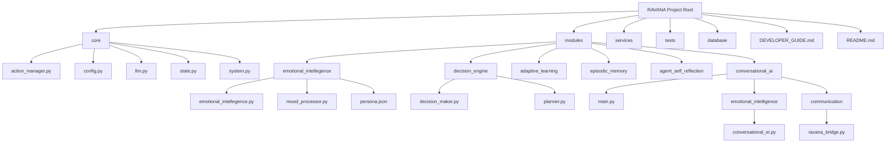
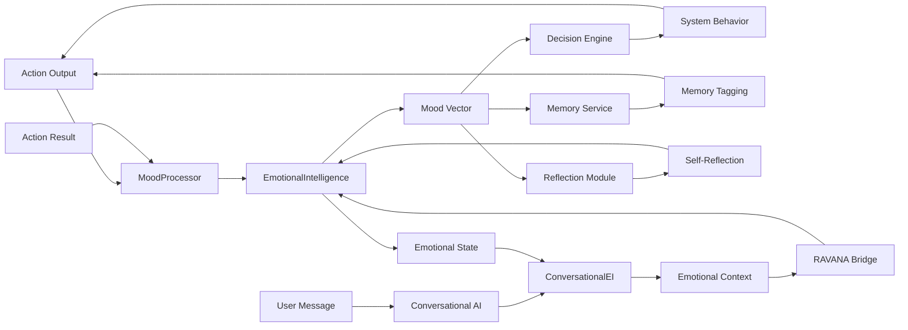
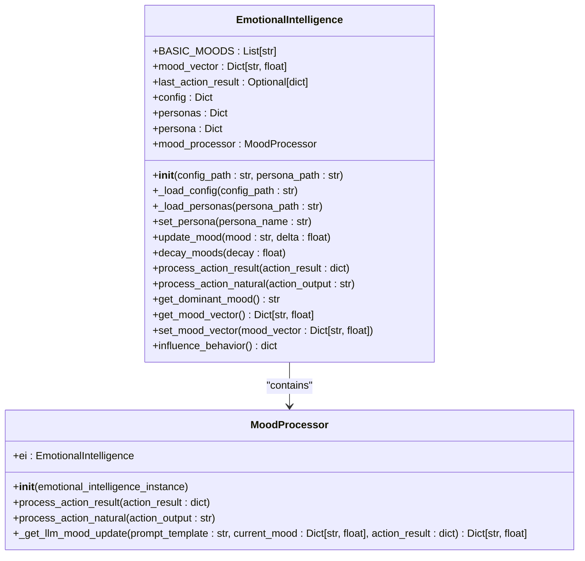
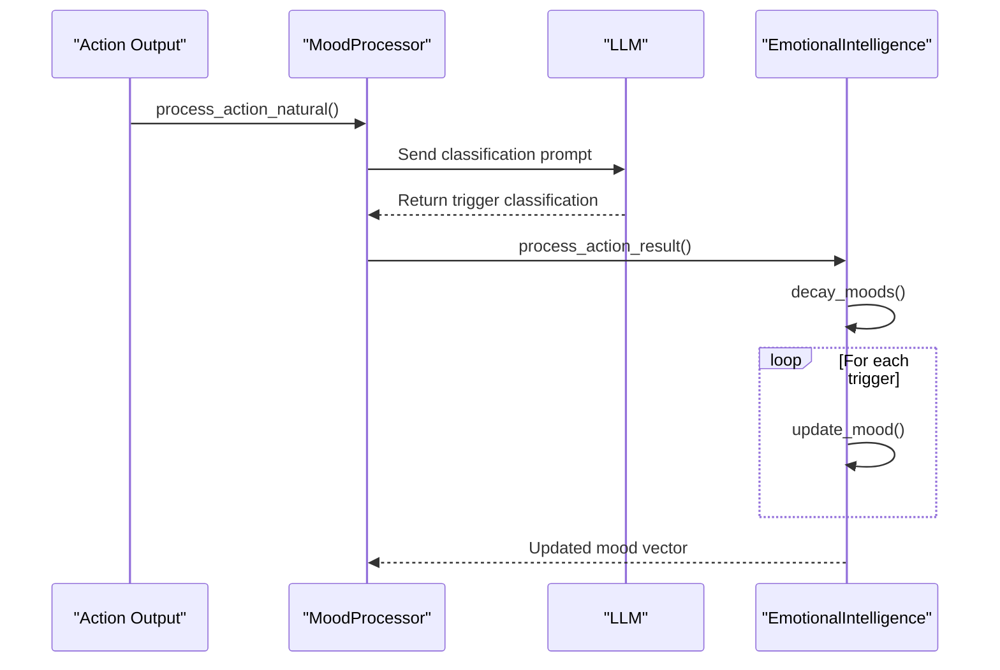
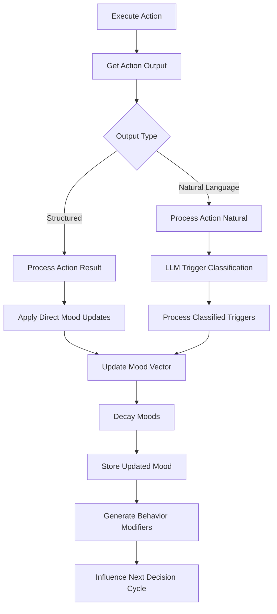
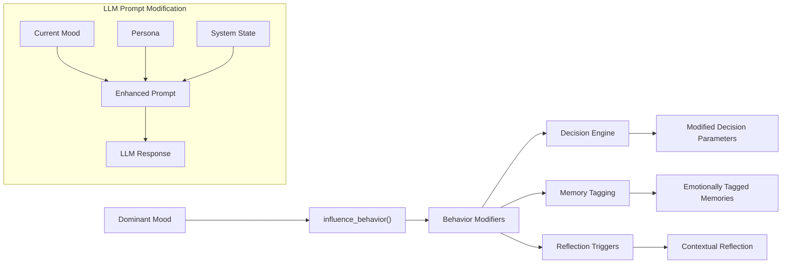
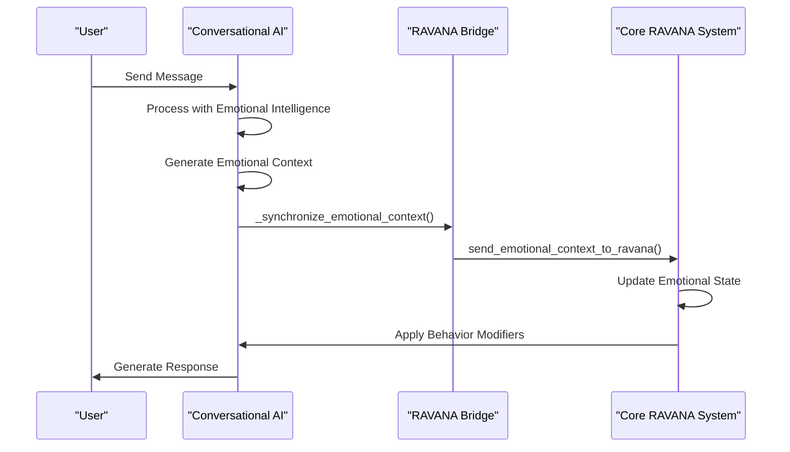
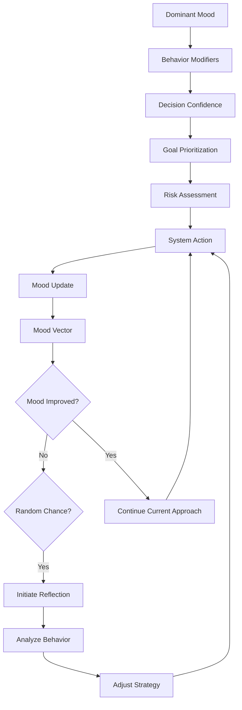

# System Integration and Behavioral Influence

## Update Summary
**Changes Made**   
- Added documentation for emotional context synchronization between Conversational AI and RAVANA core system
- Updated section sources to include new files from conversational AI module
- Enhanced behavioral influence mechanisms with new emotional intelligence features
- Added new section on emotional context synchronization
- Updated diagram sources to reflect new communication architecture

## Table of Contents
1. [Introduction](#introduction)
2. [Project Structure](#project-structure)
3. [Core Components](#core-components)
4. [Architecture Overview](#architecture-overview)
5. [Detailed Component Analysis](#detailed-component-analysis)
6. [Emotional State Flow and System Integration](#emotional-state-flow-and-system-integration)
7. [Behavioral Influence Mechanisms](#behavioral-influence-mechanisms)
8. [Emotional Context Synchronization](#emotional-context-synchronization)
9. [Feedback Loops and Self-Reflection Triggers](#feedback-loops-and-self-reflection-triggers)
10. [Common Integration Issues and Best Practices](#common-integration-issues-and-best-practices)
11. [Conclusion](#conclusion)

## Introduction
This document provides a comprehensive analysis of how emotional intelligence is integrated into the RAVANA system and influences broader system behavior. It details the mechanisms by which mood and personality affect decision-making, risk assessment, goal prioritization, memory tagging, and self-reflection triggers. The document also explains how emotional context modifies LLM prompts and response filtering, including examples of mood-dependent behavior changes such as increased caution during low mood or exploratory bias during high curiosity states. Additionally, it addresses common integration issues and provides best practices for maintaining coherent emotional influence across system components.

## Project Structure
The RAVANA project is organized into several key directories that reflect its modular architecture. The core functionality resides in the `core` directory, which contains essential system components such as state management, configuration, and action execution. The `modules` directory houses specialized components including emotional intelligence, decision engine, adaptive learning, and memory systems. External services are abstracted in the `services` directory, while test cases are maintained in the `tests` directory. Configuration files and documentation are located at the root level, providing setup instructions and architectural overviews.

**Diagram sources**
- [emotional_intellegence.py](file://c:/Users/ASUS/Documents/GitHub/RAVANA/modules/emotional_intellegence/emotional_intellegence.py)
- [decision_maker.py](file://c:/Users/ASUS/Documents/GitHub/RAVANA/modules/decision_engine/decision_maker.py)
- [system.py](file://c:/Users/ASUS/Documents/GitHub/RAVANA/core/system.py)
- [main.py](file://c:/Users/ASUS/Documents/GitHub/RAVANA/modules/conversational_ai/main.py)
- [ravana_bridge.py](file://c:/Users/ASUS/Documents/GitHub/RAVANA/modules/conversational_ai/communication/ravana_bridge.py)

**Section sources**
- [emotional_intellegence.py](file://c:/Users/ASUS/Documents/GitHub/RAVANA/modules/emotional_intellegence/emotional_intellegence.py)
- [decision_maker.py](file://c:/Users/ASUS/Documents/GitHub/RAVANA/modules/decision_engine/decision_maker.py)
- [system.py](file://c:/Users/ASUS/Documents/GitHub/RAVANA/core/system.py)
- [main.py](file://c:/Users/ASUS/Documents/GitHub/RAVANA/modules/conversational_ai/main.py)

## Core Components
The emotional intelligence system in RAVANA consists of two primary components: the `EmotionalIntelligence` class and the `MoodProcessor` class. The `EmotionalIntelligence` class manages the overall emotional state through a mood vector that tracks intensity levels across various emotional dimensions. It provides methods for updating moods, retrieving the dominant mood, and generating behavior modifiers based on current emotional context. The `MoodProcessor` class handles the interpretation of system events and action outcomes to determine appropriate mood updates. Together, these components form a cohesive system that translates system interactions into emotional responses.

Additionally, the Conversational AI module implements its own emotional intelligence system through the `ConversationalEmotionalIntelligence` class, which processes user messages and generates emotionally-aware responses. This system synchronizes emotional context with the core RAVANA system through the `RAVANACommunicator` class, ensuring consistent emotional state across modules.

**Section sources**
- [emotional_intellegence.py](file://c:/Users/ASUS/Documents/GitHub/RAVANA/modules/emotional_intellegence/emotional_intellegence.py#L1-L105)
- [mood_processor.py](file://c:/Users/ASUS/Documents/GitHub/RAVANA/modules/emotional_intellegence/mood_processor.py#L1-L104)
- [conversational_ei.py](file://c:/Users/ASUS/Documents/GitHub/RAVANA/modules/conversational_ai/emotional_intelligence/conversational_ei.py#L1-L401)
- [ravana_bridge.py](file://c:/Users/ASUS/Documents/GitHub/RAVANA/modules/conversational_ai/communication/ravana_bridge.py#L1-L551)

## Architecture Overview
The emotional intelligence system integrates with the broader RAVANA architecture through a well-defined flow of data and control. Emotional states influence decision-making, memory tagging, and self-reflection triggers, creating a feedback loop that shapes system behavior over time. The core system orchestrates this integration by passing emotional context to various components and applying behavior modifiers generated by the emotional intelligence module.

The Conversational AI module extends this architecture by implementing bidirectional emotional context synchronization with the core system. When users interact with the AI through platforms like Discord or Telegram, the emotional context from these interactions is processed and synchronized with the core RAVANA system, allowing emotional states to influence broader system behavior.

**Diagram sources**
- [emotional_intellegence.py](file://c:/Users/ASUS/Documents/GitHub/RAVANA/modules/emotional_intellegence/emotional_intellegence.py)
- [mood_processor.py](file://c:/Users/ASUS/Documents/GitHub/RAVANA/modules/emotional_intellegence/mood_processor.py)
- [system.py](file://c:/Users/ASUS/Documents/GitHub/RAVANA/core/system.py)
- [conversational_ei.py](file://c:/Users/ASUS/Documents/GitHub/RAVANA/modules/conversational_ai/emotional_intelligence/conversational_ei.py)
- [ravana_bridge.py](file://c:/Users/ASUS/Documents/GitHub/RAVANA/modules/conversational_ai/communication/ravana_bridge.py)

## Detailed Component Analysis

### EmotionalIntelligence Class Analysis
The `EmotionalIntelligence` class serves as the central manager for emotional states within the RAVANA system. It maintains a mood vector that represents the intensity of various emotional dimensions, including both positive moods (Confident, Curious, Reflective, Excited, Content) and negative moods (Frustrated, Stuck, Low Energy, Bored). The class provides a comprehensive API for interacting with emotional states, including methods for updating moods, retrieving the dominant mood, and generating behavior modifiers.

**Diagram sources**
- [emotional_intellegence.py](file://c:/Users/ASUS/Documents/GitHub/RAVANA/modules/emotional_intellegence/emotional_intellegence.py#L1-L105)
- [mood_processor.py](file://c:/Users/ASUS/Documents/GitHub/RAVANA/modules/emotional_intellegence/mood_processor.py#L1-L104)

**Section sources**
- [emotional_intellegence.py](file://c:/Users/ASUS/Documents/GitHub/RAVANA/modules/emotional_intellegence/emotional_intellegence.py#L1-L105)

### MoodProcessor Class Analysis
The `MoodProcessor` class is responsible for interpreting system events and translating them into emotional responses. It processes both structured action results and natural language action outputs to determine appropriate mood updates. For structured action results, it applies predefined mood updates based on triggers defined in the configuration. For natural language outputs, it uses an LLM to analyze the text and classify it according to predefined triggers, providing a more nuanced understanding of emotional impact.

**Diagram sources**
- [mood_processor.py](file://c:/Users/ASUS/Documents/GitHub/RAVANA/modules/emotional_intellegence/mood_processor.py#L1-L104)
- [emotional_intellegence.py](file://c:/Users/ASUS/Documents/GitHub/RAVANA/modules/emotional_intellegence/emotional_intellegence.py#L1-L105)

**Section sources**
- [mood_processor.py](file://c:/Users/ASUS/Documents/GitHub/RAVANA/modules/emotional_intellegence/mood_processor.py#L1-L104)

## Emotional State Flow and System Integration
The flow of emotional state data through the RAVANA system follows a well-defined sequence that begins with action execution and ends with behavior modification. When an action is executed, its output is processed by the emotional intelligence system to update the current mood vector. This updated emotional state then influences subsequent system behavior through various integration points.

The integration begins in the core system loop, where the `_update_mood_and_reflect` method processes the action output using the `EmotionalIntelligence` component. This method first captures the current mood state, then processes the action output to update moods, and finally retrieves the updated mood vector to store in the shared system state. The emotional intelligence system uses both direct mood updates from action results and LLM-based analysis of natural language outputs to ensure comprehensive emotional tracking.

**Diagram sources**
- [system.py](file://c:/Users/ASUS/Documents/GitHub/RAVANA/core/system.py#L470-L490)
- [emotional_intellegence.py](file://c:/Users/ASUS/Documents/GitHub/RAVANA/modules/emotional_intellegence/emotional_intellegence.py)
- [mood_processor.py](file://c:/Users/ASUS/Documents/GitHub/RAVANA/modules/emotional_intellegence/mood_processor.py)

**Section sources**
- [system.py](file://c:/Users/ASUS/Documents/GitHub/RAVANA/core/system.py#L470-L490)
- [emotional_intellegence.py](file://c:/Users/ASUS/Documents/GitHub/RAVANA/modules/emotional_intellegence/emotional_intellegence.py)
- [mood_processor.py](file://c:/Users/ASUS/Documents/GitHub/RAVANA/modules/emotional_intellegence/mood_processor.py)

## Behavioral Influence Mechanisms
Emotional context modifies system behavior through several key mechanisms, with the primary interface being the `influence_behavior` method of the `EmotionalIntelligence` class. This method returns a dictionary of behavior modifiers based on the current dominant mood, which are then applied to influence subsequent system operations. The behavior modifiers are defined in the emotional intelligence configuration and vary depending on the active emotional state.

For example, when the dominant mood is "Curious", the system may receive behavior modifiers that increase exploration tendencies and reduce risk aversion. Conversely, when the dominant mood is "Frustrated", the system may receive modifiers that increase caution and reduce confidence in decision-making. These modifiers are applied at the beginning of each iteration in the core system loop, ensuring that emotional context influences all subsequent operations.

The emotional intelligence system also influences LLM prompts by incorporating the current emotional state and persona into prompt construction. This ensures that the LLM's responses are contextually appropriate to the system's current emotional disposition. For instance, when processing natural language action outputs, the mood processor includes the dominant mood and persona in the classification prompt, allowing for more nuanced emotional analysis.

**Diagram sources**
- [emotional_intellegence.py](file://c:/Users/ASUS/Documents/GitHub/RAVANA/modules/emotional_intellegence/emotional_intellegence.py#L74-L76)
- [system.py](file://c:/Users/ASUS/Documents/GitHub/RAVANA/core/system.py#L476-L478)
- [mood_processor.py](file://c:/Users/ASUS/Documents/GitHub/RAVANA/modules/emotional_intellegence/mood_processor.py#L80-L100)

**Section sources**
- [emotional_intellegence.py](file://c:/Users/ASUS/Documents/GitHub/RAVANA/modules/emotional_intellegence/emotional_intellegence.py#L74-L76)
- [system.py](file://c:/Users/ASUS/Documents/GitHub/RAVANA/core/system.py#L476-L478)

## Emotional Context Synchronization
The Conversational AI module implements a bidirectional emotional context synchronization mechanism with the core RAVANA system. This integration ensures that emotional states derived from user interactions are shared with the broader system, allowing for more coherent and contextually appropriate behavior across modules.

When a user sends a message to the Conversational AI through platforms like Discord or Telegram, the system processes the message using the `ConversationalEmotionalIntelligence` class. This class analyzes the message content and generates an emotional context that includes the dominant mood, mood vector, detected interests, and recent events. This emotional context is then synchronized with the core RAVANA system through the `RAVANACommunicator` class.

The synchronization process occurs through the `_synchronize_emotional_context` method in the `ConversationalAI` class, which packages the emotional context data and sends it to the core system via the `send_emotional_context_to_ravana` method of the `RAVANACommunicator`. This method uses the shared state channel for real-time communication, ensuring low-latency updates to the system's emotional state.

**Diagram sources**
- [main.py](file://c:/Users/ASUS/Documents/GitHub/RAVANA/modules/conversational_ai/main.py#L268-L334)
- [ravana_bridge.py](file://c:/Users/ASUS/Documents/GitHub/RAVANA/modules/conversational_ai/communication/ravana_bridge.py#L407-L441)
- [conversational_ei.py](file://c:/Users/ASUS/Documents/GitHub/RAVANA/modules/conversational_ai/emotional_intelligence/conversational_ei.py#L341-L360)

**Section sources**
- [main.py](file://c:/Users/ASUS/Documents/GitHub/RAVANA/modules/conversational_ai/main.py#L268-L334)
- [ravana_bridge.py](file://c:/Users/ASUS/Documents/GitHub/RAVANA/modules/conversational_ai/communication/ravana_bridge.py#L407-L441)
- [conversational_ei.py](file://c:/Users/ASUS/Documents/GitHub/RAVANA/modules/conversational_ai/emotional_intelligence/conversational_ei.py#L341-L360)

## Feedback Loops and Self-Reflection Triggers
The emotional intelligence system in RAVANA incorporates several feedback loops that create dynamic interactions between emotional state and system outcomes. The primary feedback loop operates through the mood update mechanism, where system actions influence emotional state, which in turn influences future actions. This creates a self-reinforcing or self-correcting cycle depending on the nature of the interactions.

A key feedback mechanism is the self-reflection trigger, which activates when the system's mood does not improve over time. The `_did_mood_improve` method compares the current mood vector with the previous state to determine if emotional well-being has increased. If the mood has not improved and a random chance threshold is met (configured by `REFLECTION_CHANCE`), the system initiates a reflection process through the reflection module. This allows the system to analyze its recent behavior and potentially adjust its approach to improve emotional outcomes.

Another important feedback loop involves the interaction between emotional state and decision confidence. The system's confidence in its decisions is influenced by its current emotional state, with positive moods generally increasing confidence and negative moods decreasing it. This confidence level then affects the system's willingness to pursue ambitious goals or take risks, creating a feedback loop between emotional state and goal prioritization.

**Diagram sources**
- [system.py](file://c:/Users/ASUS/Documents/GitHub/RAVANA/core/system.py#L470-L490)
- [system.py](file://c:/Users/ASUS/Documents/GitHub/RAVANA/core/system.py#L650-L670)
- [emotional_intellegence.py](file://c:/Users/ASUS/Documents/GitHub/RAVANA/modules/emotional_intellegence/emotional_intellegence.py)

**Section sources**
- [system.py](file://c:/Users/ASUS/Documents/GitHub/RAVANA/core/system.py#L470-L490)
- [system.py](file://c:/Users/ASUS/Documents/GitHub/RAVANA/core/system.py#L650-L670)

## Common Integration Issues and Best Practices

### Common Integration Issues
Several common issues can arise when integrating emotional intelligence into complex system behavior:

1. **Delayed Emotional Updates**: When mood updates are not applied promptly, the system may make decisions based on outdated emotional context. This can lead to inconsistent behavior patterns.

2. **Inconsistent Cross-Module Behavior**: Different modules may interpret emotional states differently, leading to conflicting behavior modifiers and unpredictable system responses.

3. **Performance Overhead**: The use of LLMs for emotional analysis can introduce significant latency, particularly when processing natural language outputs for mood classification.

4. **Mood Vector Drift**: Without proper decay mechanisms, mood values can accumulate and dominate system behavior disproportionately over time.

5. **Configuration Inconsistencies**: Mismatches between defined moods in configuration files and those used in code can lead to silent failures in mood updates.

6. **Synchronization Delays**: In distributed systems, delays in emotional context synchronization between modules can lead to inconsistent behavior across components.

### Best Practices for Coherent Emotional Influence
To maintain coherent emotional influence across system components, the following best practices should be observed:

1. **Centralized Mood Management**: All mood updates should flow through the `EmotionalIntelligence` component to ensure consistency and proper application of decay mechanisms.

2. **Synchronous State Updates**: Emotional state updates should be completed before the next decision cycle begins to ensure that all components operate with the same emotional context.

3. **Comprehensive Testing**: Implement thorough testing of emotional state transitions, particularly for edge cases such as rapid mood changes or conflicting emotional triggers.

4. **Configurable Decay Rates**: Allow decay rates to be configured based on system requirements, balancing emotional persistence with responsiveness to new events.

5. **Clear Behavior Modifier Semantics**: Define clear and consistent semantics for behavior modifiers to ensure predictable system responses across different emotional states.

6. **Monitoring and Logging**: Implement comprehensive logging of mood changes and behavior modifier applications to facilitate debugging and system analysis.

7. **Graceful Degradation**: Ensure that the system can continue to operate effectively even if emotional intelligence components fail or are temporarily unavailable.

8. **Real-time Synchronization**: Use high-priority communication channels for emotional context synchronization to minimize delays between modules.

**Section sources**
- [system.py](file://c:/Users/ASUS/Documents/GitHub/RAVANA/core/system.py)
- [emotional_intellegence.py](file://c:/Users/ASUS/Documents/GitHub/RAVANA/modules/emotional_intellegence/emotional_intellegence.py)
- [config.py](file://c:/Users/ASUS/Documents/GitHub/RAVANA/core/config.py)
- [ravana_bridge.py](file://c:/Users/ASUS/Documents/GitHub/RAVANA/modules/conversational_ai/communication/ravana_bridge.py)

## Conclusion
The emotional intelligence system in RAVANA provides a sophisticated framework for integrating emotional context into system behavior. By tracking mood vectors, processing both structured and natural language inputs, and generating behavior modifiers, the system creates a dynamic and adaptive behavior model that responds to its experiences. The integration with decision-making, memory, and reflection components creates rich feedback loops that enable the system to learn from its emotional experiences and adjust its behavior accordingly.

The implementation demonstrates several key design principles, including separation of concerns between mood processing and mood management, flexible configuration of emotional responses, and seamless integration with the broader system architecture. By following best practices for emotional state management and addressing common integration challenges, the system maintains coherent emotional influence across all components, resulting in more natural and adaptive behavior patterns.

Future enhancements could include more sophisticated mood models, improved LLM prompt engineering for emotional analysis, and expanded feedback mechanisms that allow the system to proactively manage its emotional state for optimal performance. The recent addition of bidirectional emotional context synchronization between the Conversational AI module and the core RAVANA system represents a significant advancement in creating a unified emotional state across distributed components.

**Referenced Files in This Document**   
- [emotional_intellegence.py](file://c:/Users/ASUS/Documents/GitHub/RAVANA/modules/emotional_intellegence/emotional_intellegence.py) - *Core emotional intelligence implementation*
- [mood_processor.py](file://c:/Users/ASUS/Documents/GitHub/RAVANA/modules/emotional_intellegence/mood_processor.py) - *Mood processing logic*
- [persona.json](file://c:/Users/ASUS/Documents/GitHub/RAVANA/modules/emotional_intellegence/persona.json) - *Personality configuration*
- [system.py](file://c:/Users/ASUS/Documents/GitHub/RAVANA/core/system.py) - *Core system integration*
- [config.py](file://c:/Users/ASUS/Documents/GitHub/RAVANA/core/config.py) - *Configuration management*
- [decision_maker.py](file://c:/Users/ASUS/Documents/GitHub/RAVANA/modules/decision_engine/decision_maker.py) - *Decision engine integration*
- [conversational_ei.py](file://c:/Users/ASUS/Documents/GitHub/RAVANA/modules/conversational_ai/emotional_intelligence/conversational_ei.py) - *Conversational AI emotional intelligence*
- [ravana_bridge.py](file://c:/Users/ASUS/Documents/GitHub/RAVANA/modules/conversational_ai/communication/ravana_bridge.py) - *RAVANA communication bridge*
- [main.py](file://c:/Users/ASUS/Documents/GitHub/RAVANA/modules/conversational_ai/main.py) - *Conversational AI main module*
