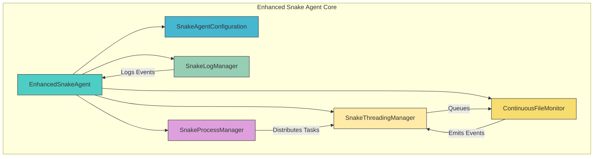
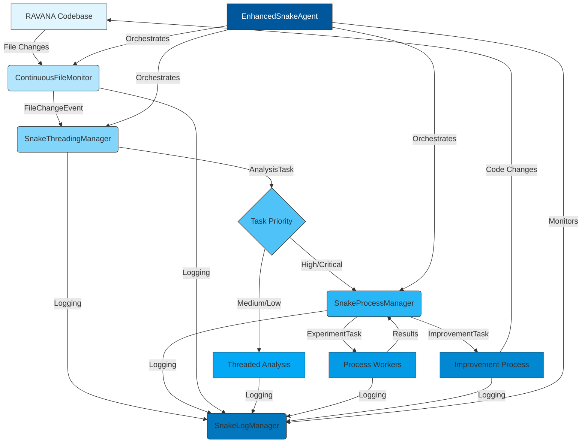
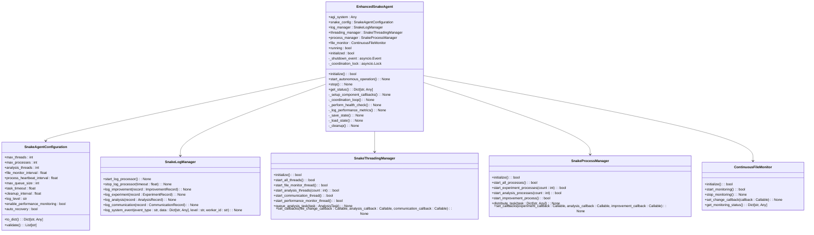
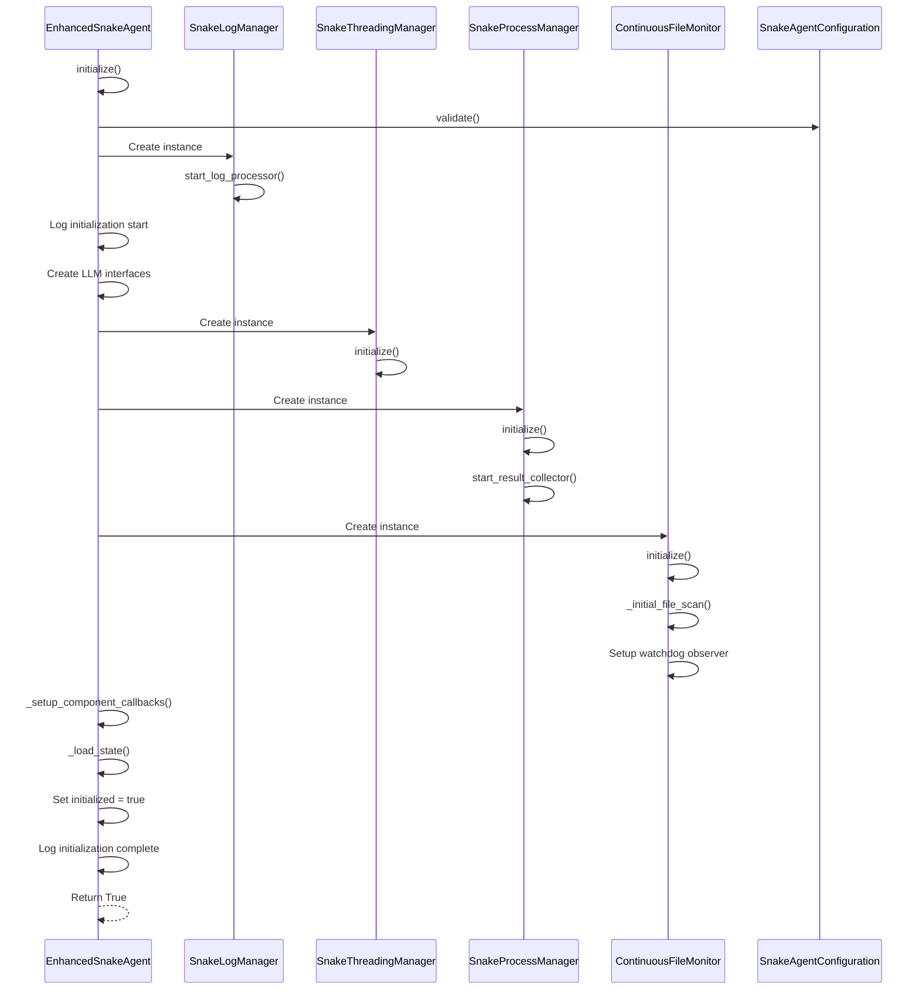
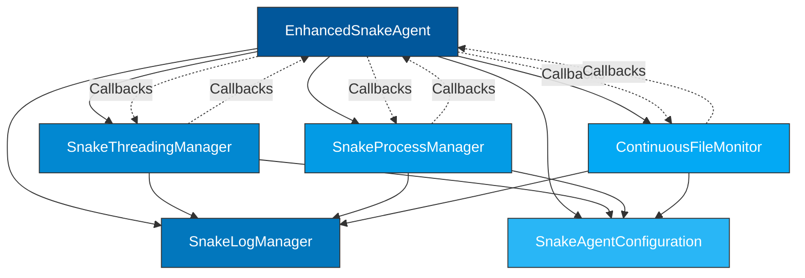

# Enhanced Snake Agent


## Update Summary
**Changes Made**   
- Updated documentation to reflect enhanced bot connectivity management and status reporting
- Added new section on Bot Connectivity Management and Status Reporting
- Enhanced troubleshooting guide with bot-specific issues
- Updated section sources to reflect recent code changes
- Added references to conversational AI module files

## Table of Contents
1. [Introduction](#introduction)
2. [Project Structure](#project-structure)
3. [Core Components](#core-components)
4. [Architecture Overview](#architecture-overview)
5. [Detailed Component Analysis](#detailed-component-analysis)
6. [Dependency Analysis](#dependency-analysis)
7. [Performance Considerations](#performance-considerations)
8. [Bot Connectivity Management and Status Reporting](#bot-connectivity-management-and-status-reporting)
9. [Troubleshooting Guide](#troubleshooting-guide)
10. [Conclusion](#conclusion)

## Introduction
The Enhanced Snake Agent is an autonomous AI system designed to continuously monitor, analyze, and improve code within the RAVANA repository. It leverages a hybrid concurrency model combining threading and multiprocessing to perform real-time file monitoring, code analysis, experimentation, and self-improvement tasks. The agent operates as a background daemon, detecting file changes, initiating analysis workflows, conducting safe code experiments, and proposing or applying improvements based on LLM-driven reasoning. Its modular architecture ensures fault tolerance, performance monitoring, and graceful shutdown capabilities.

## Project Structure
The Enhanced Snake Agent is organized within the `core` directory of the RAVANA repository, with tightly integrated components for logging, threading, process management, and file monitoring. The system follows a modular design where each component has a single responsibility and communicates through well-defined interfaces and queues.



**Diagram sources**
- [core/snake_agent_enhanced.py](file://c:\Users\ASUS\Documents\GitHub\RAVANA\core\snake_agent_enhanced.py)
- [core/snake_data_models.py](file://c:\Users\ASUS\Documents\GitHub\RAVANA\core\snake_data_models.py#L375-L412)
- [core/snake_log_manager.py](file://c:\Users\ASUS\Documents\GitHub\RAVANA\core\snake_log_manager.py#L105-L371)
- [core/snake_threading_manager.py](file://c:\Users\ASUS\Documents\GitHub\RAVANA\core\snake_threading_manager.py#L0-L199)
- [core/snake_process_manager.py](file://c:\Users\ASUS\Documents\GitHub\RAVANA\core\snake_process_manager.py#L0-L199)
- [core/snake_file_monitor.py](file://c:\Users\ASUS\Documents\GitHub\RAVANA\core\snake_file_monitor.py#L0-L199)

**Section sources**
- [core/snake_agent_enhanced.py](file://c:\Users\ASUS\Documents\GitHub\RAVANA\core\snake_agent_enhanced.py)

## Core Components
The Enhanced Snake Agent consists of several core components that work together to enable autonomous code improvement:

- **EnhancedSnakeAgent**: The main orchestrator that initializes and coordinates all subsystems.
- **SnakeAgentConfiguration**: Central configuration object defining threading, process, and performance parameters.
- **SnakeLogManager**: Thread-safe logging system with structured JSON output and separate log files for different activities.
- **SnakeThreadingManager**: Manages concurrent threads for I/O-bound tasks like file monitoring and communication.
- **SnakeProcessManager**: Handles CPU-intensive operations such as code analysis and experiments using multiprocessing.
- **ContinuousFileMonitor**: Real-time file system watcher that detects changes in the codebase and triggers analysis workflows.

These components are initialized in sequence, with proper error handling and logging throughout the startup process.

**Section sources**
- [core/snake_agent_enhanced.py](file://c:\Users\ASUS\Documents\GitHub\RAVANA\core\snake_agent_enhanced.py)
- [core/snake_data_models.py](file://c:\Users\ASUS\Documents\GitHub\RAVANA\core\snake_data_models.py#L375-L412)
- [core/snake_log_manager.py](file://c:\Users\ASUS\Documents\GitHub\RAVANA\core\snake_log_manager.py#L105-L371)
- [core/snake_threading_manager.py](file://c:\Users\ASUS\Documents\GitHub\RAVANA\core\snake_threading_manager.py#L0-L199)
- [core/snake_process_manager.py](file://c:\Users\ASUS\Documents\GitHub\RAVANA\core\snake_process_manager.py#L0-L199)
- [core/snake_file_monitor.py](file://c:\Users\ASUS\Documents\GitHub\RAVANA\core\snake_file_monitor.py#L0-L199)

## Architecture Overview
The Enhanced Snake Agent follows a layered architecture with clear separation between coordination, processing, and monitoring layers. The system uses a producer-consumer pattern across both threads and processes to ensure efficient resource utilization.



**Diagram sources**
- [core/snake_agent_enhanced.py](file://c:\Users\ASUS\Documents\GitHub\RAVANA\core\snake_agent_enhanced.py)
- [core/snake_file_monitor.py](file://c:\Users\ASUS\Documents\GitHub\RAVANA\core\snake_file_monitor.py#L0-L199)
- [core/snake_threading_manager.py](file://c:\Users\ASUS\Documents\GitHub\RAVANA\core\snake_threading_manager.py#L0-L199)
- [core/snake_process_manager.py](file://c:\Users\ASUS\Documents\GitHub\RAVANA\core\snake_process_manager.py#L0-L199)
- [core/snake_log_manager.py](file://c:\Users\ASUS\Documents\GitHub\RAVANA\core\snake_log_manager.py#L105-L371)

## Detailed Component Analysis

### EnhancedSnakeAgent Analysis
The EnhancedSnakeAgent class serves as the central orchestrator for the entire system. It manages the lifecycle of all components and coordinates their interactions through a main coordination loop.

#### Class Diagram


**Diagram sources**
- [core/snake_agent_enhanced.py](file://c:\Users\ASUS\Documents\GitHub\RAVANA\core\snake_agent_enhanced.py)
- [core/snake_data_models.py](file://c:\Users\ASUS\Documents\GitHub\RAVANA\core\snake_data_models.py#L375-L412)
- [core/snake_log_manager.py](file://c:\Users\ASUS\Documents\GitHub\RAVANA\core\snake_log_manager.py#L105-L371)
- [core/snake_threading_manager.py](file://c:\Users\ASUS\Documents\GitHub\RAVANA\core\snake_threading_manager.py#L0-L199)
- [core/snake_process_manager.py](file://c:\Users\ASUS\Documents\GitHub\RAVANA\core\snake_process_manager.py#L0-L199)
- [core/snake_file_monitor.py](file://c:\Users\ASUS\Documents\GitHub\RAVANA\core\snake_file_monitor.py#L0-L199)

**Section sources**
- [core/snake_agent_enhanced.py](file://c:\Users\ASUS\Documents\GitHub\RAVANA\core\snake_agent_enhanced.py)

### Initialization and Startup Flow
The Enhanced Snake Agent follows a strict initialization sequence to ensure all components are properly set up before starting autonomous operations.

#### Sequence Diagram


**Diagram sources**
- [core/snake_agent_enhanced.py](file://c:\Users\ASUS\Documents\GitHub\RAVANA\core\snake_agent_enhanced.py)
- [core/snake_log_manager.py](file://c:\Users\ASUS\Documents\GitHub\RAVANA\core\snake_log_manager.py#L105-L371)
- [core/snake_threading_manager.py](file://c:\Users\ASUS\Documents\GitHub\RAVANA\core\snake_threading_manager.py#L0-L199)
- [core/snake_process_manager.py](file://c:\Users\ASUS\Documents\GitHub\RAVANA\core\snake_process_manager.py#L0-L199)
- [core/snake_file_monitor.py](file://c:\Users\ASUS\Documents\GitHub\RAVANA\core\snake_file_monitor.py#L0-L199)

**Section sources**
- [core/snake_agent_enhanced.py](file://c:\Users\ASUS\Documents\GitHub\RAVANA\core\snake_agent_enhanced.py)

### Autonomous Operation Workflow
Once initialized, the Enhanced Snake Agent enters a continuous coordination loop that manages health checks, performance logging, and state persistence.

#### Flowchart
```mermaid
flowchart TD
Start([Start Autonomous Operation]) --> InitCheck{"Initialized?"}
InitCheck --> |No| Initialize[initialize()]
InitCheck --> |Yes| SetRunning[Set running = true]
SetRunning --> StartComponents[Start all components]
StartComponents --> CoordinationLoop[Enter coordination_loop()]
CoordinationLoop --> CheckHealth{"5-min interval?"}
CheckHealth --> |Yes| PerformHealth[perform_health_check()]
CheckHealth --> |No| CheckMetrics{"10-min interval?"}
CheckMetrics --> |Yes| LogMetrics[log_performance_metrics()]
CheckMetrics --> |No| SaveState[save_state()]
PerformHealth --> Wait
LogMetrics --> Wait
SaveState --> Wait
Wait[Wait 10 seconds] --> CoordinationLoop
CoordinationLoop --> |Shutdown requested| Cleanup[Run _cleanup()]
Cleanup --> StopComponents[Stop all components]
StopComponents --> SaveFinalState[_save_state()]
SaveFinalState --> StopLogger[Stop log_manager]
StopLogger --> End([Operation stopped])
style Start fill:#4ECDC4,stroke:#333
style End fill:#4ECDC4,stroke:#333
style InitCheck fill:#FFD700,stroke:#333
style Initialize fill:#FF6B6B,stroke:#333
style SetRunning fill:#4ECDC4,stroke:#333
style StartComponents fill:#4ECDC4,stroke:#333
style CoordinationLoop fill:#45B7D1,stroke:#333
style PerformHealth fill:#96CEB4,stroke:#333
style LogMetrics fill:#96CEB4,stroke:#333
style SaveState fill:#96CEB4,stroke:#333
style Wait fill:#DDA0DD,stroke:#333
style Cleanup fill:#4ECDC4,stroke:#333
style StopComponents fill:#4ECDC4,stroke:#333
style SaveFinalState fill:#4ECDC4,stroke:#333
style StopLogger fill:#4ECDC4,stroke:#333
```

**Diagram sources**
- [core/snake_agent_enhanced.py](file://c:\Users\ASUS\Documents\GitHub\RAVANA\core\snake_agent_enhanced.py)

**Section sources**
- [core/snake_agent_enhanced.py](file://c:\Users\ASUS\Documents\GitHub\RAVANA\core\snake_agent_enhanced.py)

## Dependency Analysis
The Enhanced Snake Agent has a well-defined dependency hierarchy where higher-level components depend on lower-level services. The system avoids circular dependencies through careful interface design and callback patterns.



**Diagram sources**
- [core/snake_agent_enhanced.py](file://c:\Users\ASUS\Documents\GitHub\RAVANA\core\snake_agent_enhanced.py)
- [core/snake_log_manager.py](file://c:\Users\ASUS\Documents\GitHub\RAVANA\core\snake_log_manager.py#L105-L371)
- [core/snake_threading_manager.py](file://c:\Users\ASUS\Documents\GitHub\RAVANA\core\snake_threading_manager.py#L0-L199)
- [core/snake_process_manager.py](file://c:\Users\ASUS\Documents\GitHub\RAVANA\core\snake_process_manager.py#L0-L199)
- [core/snake_file_monitor.py](file://c:\Users\ASUS\Documents\GitHub\RAVANA\core\snake_file_monitor.py#L0-L199)
- [core/snake_data_models.py](file://c:\Users\ASUS\Documents\GitHub\RAVANA\core\snake_data_models.py#L375-L412)

**Section sources**
- [core/snake_agent_enhanced.py](file://c:\Users\ASUS\Documents\GitHub\RAVANA\core\snake_agent_enhanced.py)

## Performance Considerations
The Enhanced Snake Agent is designed with performance and resource efficiency in mind:

- **Thread Management**: Configurable thread pool limits prevent resource exhaustion
- **Queue Sizing**: Bounded queues with configurable maximum size prevent memory leaks
- **File Monitoring**: Uses watchdog library with selective file extension monitoring to reduce I/O overhead
- **Logging**: Asynchronous, thread-safe logging with separate structured JSON files for efficient log processing
- **State Persistence**: Regular state saving enables recovery from crashes without losing progress metrics
- **Health Monitoring**: Periodic health checks and performance metrics logging help identify bottlenecks

The agent balances responsiveness with resource conservation by using appropriate concurrency models: threading for I/O-bound tasks and multiprocessing for CPU-intensive operations.

## Bot Connectivity Management and Status Reporting
The Enhanced Snake Agent integrates with the Conversational AI module to provide enhanced bot connectivity management and status reporting. This integration enables detailed monitoring of bot connection states and improved error handling.

### Bot Status Reporting
The system now provides comprehensive status reporting for bot connectivity through the `get_conversational_ai_status` method in the core system module. This method returns detailed information about the connection status of both Discord and Telegram bots.

```python
def get_conversational_ai_status(self) -> Dict[str, Any]:
    """Get Conversational AI status information."""
    if not self.conversational_ai:
        return {"enabled": False, "status": "not_initialized"}
    
    # Check if the conversational AI has been started
    started = getattr(self, '_conversational_ai_started', False)
    
    # Check if bots are connected
    discord_connected = False
    telegram_connected = False
    
    if self.conversational_ai.discord_bot:
        discord_connected = getattr(self.conversational_ai.discord_bot, 'connected', False)
        
    if self.conversational_ai.telegram_bot:
        telegram_connected = getattr(self.conversational_ai.telegram_bot, 'connected', False)
    
    # Determine overall status
    bot_connected = discord_connected or telegram_connected
    status = "active" if (started and bot_connected) else "inactive"
    
    return {
        "enabled": Config.CONVERSATIONAL_AI_ENABLED,
        "status": status,
        "discord_connected": discord_connected,
        "telegram_connected": telegram_connected
    }
```

### Bot Connectivity Implementation
The bot connectivity is implemented through dedicated classes for each platform:

- **DiscordBot**: Manages connection to Discord using the discord.py library
- **TelegramBot**: Manages connection to Telegram using the python-telegram-bot library

Both implementations include:
- Connection state tracking via the `connected` property
- Graceful shutdown handling with asyncio events
- Error handling and retry mechanisms
- Message sending with proper error handling

**Section sources**
- [core/system.py](file://c:\Users\ASUS\Documents\GitHub\RAVANA\core\system.py#L593-L624) - *Updated status reporting*
- [modules/conversational_ai/main.py](file://c:\Users\ASUS\Documents\GitHub\RAVANA\modules\conversational_ai\main.py) - *Bot connectivity management*
- [modules/conversational_ai/bots/discord_bot.py](file://c:\Users\ASUS\Documents\GitHub\RAVANA\modules\conversational_ai\bots\discord_bot.py) - *Discord bot implementation*
- [modules/conversational_ai/bots/telegram_bot.py](file://c:\Users\ASUS\Documents\GitHub\RAVANA\modules\conversational_ai\bots\telegram_bot.py) - *Telegram bot implementation*

## Troubleshooting Guide
Common issues and their solutions when working with the Enhanced Snake Agent:

**Section sources**
- [core/snake_agent_enhanced.py](file://c:\Users\ASUS\Documents\GitHub\RAVANA\core\snake_agent_enhanced.py)
- [core/snake_log_manager.py](file://c:\Users\ASUS\Documents\GitHub\RAVANA\core\snake_log_manager.py#L105-L371)
- [core/snake_threading_manager.py](file://c:\Users\ASUS\Documents\GitHub\RAVANA\core\snake_threading_manager.py#L0-L199)

### Initialization Failures
If the agent fails to initialize:
1. Check `snake_logs/system.log` for error messages
2. Verify that the `snake_logs` directory is writable
3. Ensure required environment variables are set (SNAKE_MAX_THREADS, etc.)
4. Validate configuration parameters using `SnakeAgentConfiguration.validate()`

### File Monitoring Not Working
If file changes are not being detected:
1. Verify that file extensions are in the monitored list (`.py`, `.json`, etc.)
2. Check that directories are not excluded (`.git`, `.venv`, etc.)
3. Ensure the watchdog library is properly installed
4. Review `snake_logs/system.log` for file monitor initialization errors

### High Resource Usage
If CPU or memory usage is excessive:
1. Reduce `max_threads` and `max_processes` in configuration
2. Increase `file_monitor_interval` to reduce polling frequency
3. Check for runaway processes in the process manager
4. Review log files for repeated error loops

### Stuck Tasks
If tasks are not being processed:
1. Check queue sizes using `get_queue_status()` methods
2. Verify that worker threads and processes are active
3. Look for exceptions in log files that might be preventing task completion
4. Ensure the coordination loop is running and not blocked

### Bot Connectivity Issues
If bot connectivity is failing:
1. Check `conversational_ai.log` for connection errors
2. Verify bot tokens are correctly configured in `modules/conversational_ai/config.json`
3. Ensure the bot is enabled in the configuration file
4. Check network connectivity to Discord/Telegram servers
5. Review the bot status using the `get_conversational_ai_status` method

## Conclusion
The Enhanced Snake Agent represents a sophisticated autonomous system for continuous code improvement. Its modular architecture, combining threading and multiprocessing, allows it to efficiently handle both I/O-bound and CPU-intensive tasks. The agent's comprehensive logging, error handling, and state persistence make it robust and reliable for long-running operations. By following the principles of separation of concerns and clear component interfaces, the system remains maintainable and extensible. The implementation demonstrates best practices in concurrent programming, resource management, and system monitoring, making it a powerful tool for automated code enhancement within the RAVANA ecosystem.

**Referenced Files in This Document**   
- [core/snake_agent_enhanced.py](file://c:\Users\ASUS\Documents\GitHub\RAVANA\core\snake_agent_enhanced.py) - *Updated in recent commit d6c6f5d*
- [core/system.py](file://c:\Users\ASUS\Documents\GitHub\RAVANA\core\system.py#L593-L624) - *Updated status reporting*
- [modules/conversational_ai/main.py](file://c:\Users\ASUS\Documents\GitHub\RAVANA\modules\conversational_ai\main.py) - *Bot connectivity management*
- [modules/conversational_ai/bots/discord_bot.py](file://c:\Users\ASUS\Documents\GitHub\RAVANA\modules\conversational_ai\bots\discord_bot.py) - *Discord bot implementation*
- [modules/conversational_ai/bots/telegram_bot.py](file://c:\Users\ASUS\Documents\GitHub\RAVANA\modules\conversational_ai\bots\telegram_bot.py) - *Telegram bot implementation*
- [core/snake_data_models.py](file://c:\Users\ASUS\Documents\GitHub\RAVANA\core\snake_data_models.py#L375-L412)
- [core/snake_log_manager.py](file://c:\Users\ASUS\Documents\GitHub\RAVANA\core\snake_log_manager.py#L105-L371)
- [core/snake_threading_manager.py](file://c:\Users\ASUS\Documents\GitHub\RAVANA\core\snake_threading_manager.py#L0-L199)
- [core/snake_process_manager.py](file://c:\Users\ASUS\Documents\GitHub\RAVANA\core\snake_process_manager.py#L0-L199)
- [core/snake_file_monitor.py](file://c:\Users\ASUS\Documents\GitHub\RAVANA\core\snake_file_monitor.py#L0-L199)
