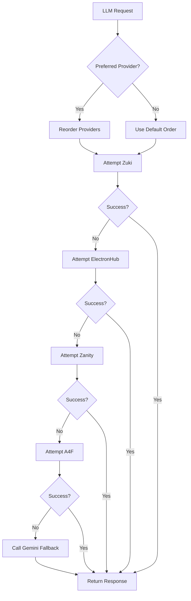
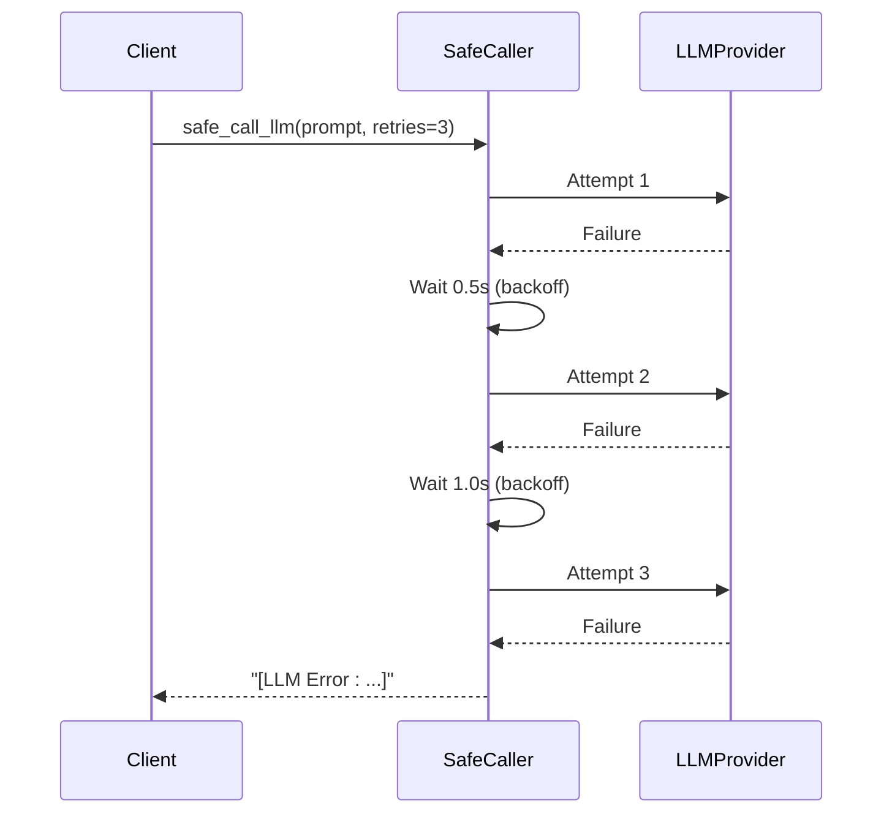
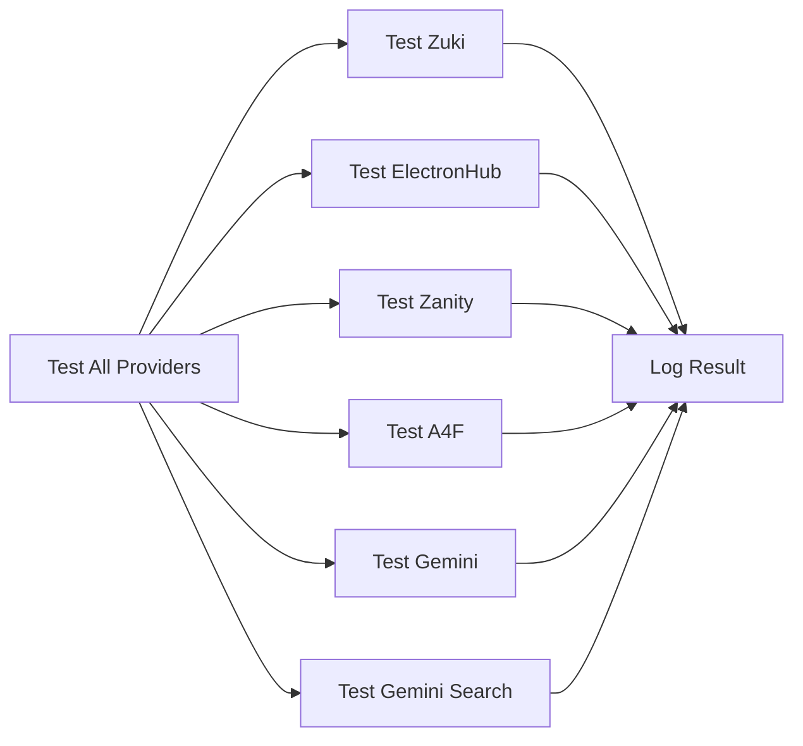

# Fallback and Resilience Handling


## Table of Contents
1. [Introduction](#introduction)
2. [LLM Fallback Mechanism](#llm-fallback-mechanism)
3. [Retry Logic and Backoff Strategies](#retry-logic-and-backoff-strategies)
4. [Exception Handling and Error Classification](#exception-handling-and-error-classification)
5. [Provider Health Checking and Monitoring](#provider-health-checking-and-monitoring)
6. [Configuration Options for Customization](#configuration-options-for-customization)
7. [Code Examples of Failure Handling](#code-examples-of-failure-handling)
8. [Designing Fault-Tolerant Workflows](#designing-fault-tolerant-workflows)
9. [Conclusion](#conclusion)

## Introduction
This document provides a comprehensive overview of the fallback and resilience mechanisms implemented in the RAVANA system for handling LLM (Large Language Model) service disruptions. The system is designed to maintain operational continuity during timeouts, rate limits, and service outages by intelligently switching between multiple LLM providers. It employs robust retry logic, exponential backoff strategies, and health-checking routines to ensure high availability and reliability. This documentation details the architecture, implementation, and configuration of these resilience features, enabling developers to understand, customize, and extend the system's fault tolerance capabilities.

## LLM Fallback Mechanism
The core of the system's resilience lies in its multi-provider fallback strategy, implemented in the `call_llm` function within `core/llm.py`. When an LLM request is made, the system attempts to fulfill it through a prioritized sequence of providers before resorting to a final fallback.

The primary providers are:
- **Zuki**
- **ElectronHub**
- **Zanity**
- **A4F**

If all primary providers fail, the system automatically falls back to **Gemini**, which uses a dedicated API key (`GEMINI_API_KEY`) for reliability. This fallback is unconditional and ensures that a response is always generated, even if degraded.

A `preferred_provider` parameter can be passed to `call_llm`, which reorders the provider list to prioritize the specified provider. This allows for dynamic routing based on performance, cost, or feature requirements.



**Diagram sources**
- [core/llm.py](file://core/llm.py#L294-L331)

**Section sources**
- [core/llm.py](file://core/llm.py#L294-L331)

## Retry Logic and Backoff Strategies
The system implements a sophisticated retry mechanism through the `safe_call_llm` function, which wraps all LLM calls with configurable retry logic and exponential backoff.

Key parameters:
- **retries**: Number of retry attempts (default: 3)
- **timeout**: Timeout for each LLM call (default: 30 seconds)
- **backoff_factor**: Base delay multiplier (default: 0.5 seconds)

The backoff strategy uses exponential delay: `wait = backoff_factor * (2 ^ (attempt - 1))`. For example:
- Attempt 1: 0.5 * 2^0 = 0.5 seconds
- Attempt 2: 0.5 * 2^1 = 1.0 seconds  
- Attempt 3: 0.5 * 2^2 = 2.0 seconds

The function also validates responses, raising an error for empty responses. After exhausting all retries, it returns a formatted error message containing the last exception.

An asynchronous version, `async_safe_call_llm`, is provided for non-blocking operations, utilizing a thread pool executor to run the synchronous `safe_call_llm`.



**Diagram sources**
- [core/llm.py](file://core/llm.py#L48-L84)

**Section sources**
- [core/llm.py](file://core/llm.py#L48-L84)

## Exception Handling and Error Classification
The system employs a layered approach to exception handling, with specific mechanisms for different types of LLM failures.

### Base Exception Hierarchy
The core exception classes are defined in `core/actions/exceptions.py`:
```python
class ActionError(Exception):
    """Base exception for action-related errors."""
    pass

class InvalidActionError(ActionError):
    """Raised when an action is not found in the registry."""
    pass

class InvalidActionParams(ActionError):
    """Raised when the parameters for an action are invalid."""
    pass

class ActionException(Exception):
    """Custom exception for action execution errors."""
    pass
```

While no dedicated LLM-specific exception classes exist, the system uses the base `Exception` class and string-based error messages to classify failures.

### JSON Parsing and Response Validation
The `extract_decision` function handles JSON parsing errors that occur when an LLM returns malformed JSON:
- Catches `json.JSONDecodeError`
- Logs the parsing error
- Returns a structured fallback response with default values
- Sets action to `log_message` with an error description

### Lazy Response Detection
The `is_lazy_llm_response` function detects low-quality or non-actionable responses by checking for common phrases like "I cannot", "I apologize", or "[insert code here]". This allows the system to identify when an LLM is avoiding a task and potentially trigger a retry with a different provider or prompt.

**Section sources**
- [core/actions/exceptions.py](file://core/actions/exceptions.py#L0-L14)
- [core/llm.py](file://core/llm.py#L770-L818)

## Provider Health Checking and Monitoring
The system includes both automated and manual mechanisms for monitoring LLM provider health.

### Automated Health Checks
The `send_chat_message` function implements implicit health checking:
- Uses `random.choice(PROVIDERS)` to distribute load
- Attempts to send a message via the selected provider
- Logs success or failure with detailed error messages
- Specifically checks for 404 errors from Zanity, logging a targeted warning

### Manual Testing Function
The `test_all_providers` function serves as a comprehensive health check utility:
- Tests each provider with a simple prompt ("What is the capital of France?")
- Tests the Gemini fallback
- Tests advanced Gemini features (search)
- Outputs results directly to the console

This function can be run manually to verify the operational status of all LLM integrations.



**Diagram sources**
- [core/llm.py](file://core/llm.py#L294-L331)

**Section sources**
- [core/llm.py](file://core/llm.py#L294-L331)

## Configuration Options for Customization
The system provides several configuration options to customize the fallback and resilience behavior.

### Provider Configuration
The `PROVIDERS` list in `core/llm.py` defines the available LLM providers with their API keys, base URLs, and supported models. This can be modified to add, remove, or reconfigure providers.

### Environment Variables
API keys are loaded using `os.getenv()` with fallbacks to hardcoded values:
```python
"api_key": os.getenv("A4F_API_KEY", "ddc-a4f-..."),
"api_key": os.getenv("ZUKIJOURNEY_API_KEY", "zu-ab9fba..."),
"api_key": os.getenv("ELECTRONHUB_API_KEY", "ek-nzrvzze..."),
"api_key": os.getenv("ZANITY_API_KEY", "vc-b1EbB_B...")
```

### Decision Maker Configuration
The `config.json` file contains settings for the main decision maker:
```json
"main_llm_decision_maker": {
    "enabled": true,
    "preferred_model": "gpt-4o",
    "chain_of_thought": true,
    "rag_enabled": true
}
```
- `preferred_model`: Specifies the default model to use
- `chain_of_thought`: Enables step-by-step reasoning
- `rag_enabled`: Controls retrieval-augmented generation

### Retry and Timeout Customization
The `safe_call_llm` function accepts parameters that can be overridden:
- `timeout`: Adjust the per-call timeout
- `retries`: Change the number of retry attempts
- `backoff_factor`: Modify the base delay for exponential backoff

These can be passed directly when calling `safe_call_llm` or through functions that use it (like `decision_maker_loop`).

**Section sources**
- [core/llm.py](file://core/llm.py#L48-L84)
- [core/config.json](file://core/config.json#L55-L98)

## Code Examples of Failure Handling
This section provides concrete examples of how failed LLM requests are caught and redirected.

### Example 1: Decision Making with Fallback
```python
def decision_maker_loop(situation, memory=None, mood=None, model=None):
    try:
        # safe_call_llm handles retries and provider fallback
        raw_response = safe_call_llm(prompt, model=model, retries=3)
        decision_data = extract_decision(raw_response)
        return decision_data
    except Exception as e:
        # Final fallback response structure
        return {
            "raw_response": f"[Error: {e}]",
            "analysis": f"Failed to make decision due to error: {e}",
            "plan": [{"action": "log_message", "params": {"message": f"Decision making failed: {e}"}}],
            "action": "log_message",
            "params": {"message": f"Decision making failed: {e}"},
            "confidence": 0.0,
            "error": str(e)
        }
```

### Example 2: Experimentation Engine Resilience
```python
def agi_experimentation_engine(experiment_idea, llm_model=None):
    # Step 1: Refine idea with LLM
    refined_idea = call_llm(refine_prompt, model=llm_model)
    # If this fails, call_llm will try all providers and fallback to Gemini
    
    # Step 2: Determine simulation type
    simulation_type = call_llm(sim_type_prompt, model=llm_model)
    # Another resilient call
    
    # Step 7: Online validation with Gemini fallback
    try:
        online_validation_result = call_gemini_with_search_sync(web_prompt)
    except Exception as e:
        online_validation_result = f"[Online validation failed: {e}]"
    # Explicit try-except with fallback message
```

### Example 3: Direct Provider Call with Error Handling
```python
def call_zuki(prompt, model=None):
    try:
        # Direct API call
        r = requests.post(url, headers=headers, json=data, timeout=20)
        r.raise_for_status()
        return r.json()['choices'][0]['message']['content']
    except Exception as e:
        # Return None on any error, which triggers fallback
        return None
```

**Section sources**
- [core/llm.py](file://core/llm.py#L417-L581)
- [core/llm.py](file://core/llm.py#L583-L767)

## Designing Fault-Tolerant Workflows
To design workflows that maintain operation during partial outages, follow these best practices:

### 1. Use the Safe Call Wrapper
Always use `safe_call_llm` instead of direct provider calls to benefit from built-in retries and fallbacks.

### 2. Implement Response Quality Checks
Use `is_lazy_llm_response` to detect low-quality responses and trigger retries or alternative actions:
```python
response = safe_call_llm(prompt)
if is_lazy_llm_response(response):
    # Try with a different prompt or provider
    response = safe_call_llm(enriched_prompt)
```

### 3. Design for Degraded Operation
Structure workflows to continue with reduced functionality when primary providers are down:
- Use Gemini as a reliable fallback for critical operations
- Cache responses when possible to reduce dependency on live LLM calls
- Implement graceful degradation (e.g., simpler responses when advanced models are unavailable)

### 4. Monitor and Log
Leverage the system's logging to monitor LLM availability:
- Watch for warning messages about failed attempts
- Track how often the Gemini fallback is used
- Use `test_all_providers()` periodically to verify provider health

### 5. Configure Based on Use Case
- For high-reliability tasks: Increase `retries` and use a `preferred_provider`
- For cost-sensitive tasks: Order providers by cost in the `PROVIDERS` list
- For feature-specific tasks: Use `preferred_provider` to target providers with specific capabilities (e.g., vision, function calling)

## Conclusion
The RAVANA system implements a comprehensive and robust set of fallback and resilience mechanisms for LLM operations. By combining multiple providers, exponential backoff retries, automatic fallback to Gemini, and sophisticated error handling, the system maintains high availability even during service disruptions. The configuration options allow for customization of retry behavior, provider preferences, and operational parameters. Developers can build fault-tolerant workflows by leveraging the `safe_call_llm` wrapper, implementing response quality checks, and designing for degraded operation. The monitoring capabilities, including the `test_all_providers` function, enable proactive maintenance of LLM integrations. This resilience architecture ensures that the AI system remains responsive and functional, providing a reliable foundation for autonomous operation.

**Referenced Files in This Document**   
- [core/llm.py](file://core/llm.py#L48-L84)
- [core/llm.py](file://core/llm.py#L294-L331)
- [core/llm.py](file://core/llm.py#L417-L581)
- [core/llm.py](file://core/llm.py#L583-L767)
- [core/llm.py](file://core/llm.py#L770-L818)
- [core/config.json](file://core/config.json#L55-L98)
- [core/actions/exceptions.py](file://core/actions/exceptions.py#L0-L14)