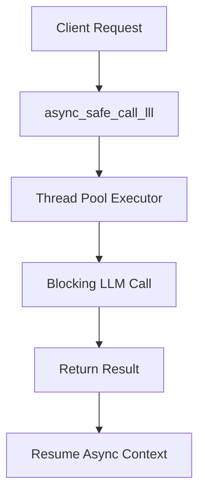

# Performance and Security Considerations


## Table of Contents
1. [Performance Optimization](#performance-optimization)  
2. [Cost Management](#cost-management)  
3. [Response Parsing and Validation](#response-parsing-and-validation)  
4. [Security Risks and Mitigations](#security-risks-and-mitigations)  
5. [Secure Prompt Design Patterns](#secure-prompt-design-patterns)

## Performance Optimization

The RAVANA system implements multiple strategies to minimize latency and improve responsiveness in LLM interactions. These include caching, retry mechanisms, asynchronous execution, and provider redundancy.

### Caching and Request Deduplication
While explicit caching is not implemented in the core LLM module, the `EnhancedActionManager` includes a cache mechanism to store results of expensive operations. This prevents redundant computation and reduces response time for repeated actions.

### Parallel and Asynchronous Execution
The system supports asynchronous LLM calls via `async_safe_call_llm`, which uses a thread pool executor to run blocking LLM requests without halting the main event loop. This enables concurrent processing of multiple tasks.



**Diagram sources**  
- [llm.py](file://core/llm.py#L75-L84)

### Efficient Prompt Design
Prompts are structured to enforce strict JSON output formats, reducing parsing overhead and ensuring predictable responses. For example, the decision-making prompt requires a specific JSON schema with fields like `analysis`, `plan`, `action`, and `params`.

**Section sources**  
- [llm.py](file://core/llm.py#L400-L600)

## Cost Management

The system employs several techniques to manage costs associated with LLM usage, including provider selection, model tiering, and request batching.

### Multi-Provider Strategy
The system integrates with multiple LLM providers (Zuki, ElectronHub, Zanity, A4F) and falls back to Gemini when primary providers fail. This allows for cost-effective routing based on availability and pricing.

```python
providers = [
    (call_zuki, 'zuki'),
    (call_electronhub, 'electronhub'),
    (call_zanity, 'zanity'),
    (call_a4f, 'a4f'),
]
```

Provider selection can be influenced by a `preferred_provider` parameter, enabling cost-aware routing.

### Model Tier Selection
Different models are available across providers, including free tiers (e.g., `gpt-4o:free`, `claude-3.5-sonnet:free`) and premium models. The configuration allows specifying preferred models, enabling cost-performance trade-offs.

```json
"zanity": {
  "models": [
    "deepseek-r1",
    "gpt-4o:free",
    "claude-3.5-sonnet:free"
  ]
}
```

### Request Batching and Retry Optimization
Although explicit batching is not implemented, the system minimizes redundant calls through structured workflows and validation logic. The retry mechanism uses exponential backoff to avoid overwhelming providers during transient failures.

```python
wait = backoff_factor * (2 ** (attempt - 1))
```

This reduces unnecessary retries and associated costs.

**Section sources**  
- [llm.py](file://core/llm.py#L48-L84)  
- [config.json](file://core/config.json#L0-L99)

## Response Parsing and Validation

Robust parsing and validation strategies are implemented to handle malformed or incomplete LLM responses.

### JSON Block Extraction
The system uses `_extract_json_block` to locate and extract JSON content from LLM responses, supporting both ```json``` fenced blocks and inline JSON objects.

```python
patterns = [
    r"```json\s*(.*?)\s*```",
    r"```\s*(.*?)\s*```",
    r"\{.*\}",
]
```

This ensures reliable extraction even when formatting is inconsistent.

### Structured Response Validation
The `extract_decision` function validates required keys (`analysis`, `plan`, `action`, `params`) and provides fallback defaults when keys are missing.

```python
required_keys = ["analysis", "plan", "action", "params"]
for key in required_keys:
    if key not in data:
        logger.warning("Key %r missing from decision JSON", key)
```

### Recovery from Malformed Responses
When JSON parsing fails, the system returns a structured fallback response with error details and logs the raw output for debugging.

```python
return {
    "raw_response": raw_response,
    "error": f"JSON decode error: {je}",
    "analysis": "Failed to parse decision",
    "action": "log_message",
    "params": {"message": f"Failed to parse decision: {raw_response[:200]}..."}
}
```

### Lazy Response Detection
The `is_lazy_llm_response` function detects generic or non-actionable responses (e.g., "I am unable to", "you can use") and flags them for reprocessing.

```python
lazy_phrases = [
    "as an ai language model",
    "i'm unable to",
    "i cannot",
    "i apologize",
    # ... more phrases
]
```

**Section sources**  
- [llm.py](file://core/llm.py#L81-L119)  
- [action_manager.py](file://core/action_manager.py#L62-L91)

## Security Risks and Mitigations

The system addresses several critical security risks in LLM interactions.

### Prompt Injection
Although input sanitization is not explicitly implemented, the system uses role-based prompt templates that constrain the LLM's behavior and reduce injection surface.

### Data Leakage Prevention
Sensitive internal state is not directly exposed in prompts. Instead, structured summaries are passed (e.g., task summary, outcome), minimizing exposure of system internals.

### Unauthorized Access Mitigation
API keys are stored in configuration files and environment variables, with fallback keys provided for development. Production deployments should override these via environment variables.

```python
"api_key": os.getenv("ZUKIJOURNEY_API_KEY", "zu-ab9fba2aeef85c7ecb217b00ce7ca1fe")
```

### Sandboxed Code Execution
Generated Python code is executed in a temporary file with subprocess isolation, limiting access to the host system.

```python
with tempfile.NamedTemporaryFile('w', suffix='.py', delete=False) as tmp:
    tmp.write(code)
    tmp_path = tmp.name
# Execute in subprocess
proc = subprocess.run([sys.executable, tmp_path], timeout=timeout)
```

The file is deleted after execution, preventing persistence of generated code.

**Section sources**  
- [llm.py](file://core/llm.py#L599-L883)  
- [config.py](file://core/config.py#L0-L60)

## Secure Prompt Design Patterns

The system employs secure and effective prompt design patterns across modules.

### Role-Based Templates
Prompts define clear roles and constraints, guiding the LLM toward desired behavior.

```python
REFLECTION_PROMPT = (
    "You are an AI agent journaling after a major task. "
    "Given the following summary and outcome, answer these questions in a structured way:\n"
    "1. What worked?\n2. What failed?\n3. What surprised you?\n4. What do you still need to learn?\n"
    "Task Summary: {task_summary}\nOutcome: {outcome}\n"
    "Respond in a clear, numbered format."
)
```

### Input Redaction
Sensitive data is abstracted using placeholders (`{task_summary}`, `{outcome}`), ensuring that raw data is not directly injected into prompts.

### Structured Output Enforcement
Prompts require specific output formats (numbered lists, JSON), reducing ambiguity and improving parseability.

```python
COMPRESSION_PROMPT = (
    "You are an AI tasked with summarizing accumulated knowledge and logs. "
    "Given the following logs, produce a concise summary report of new facts learned, key outcomes, and next goals.\n"
    "Logs: {logs}\n"
    "Respond in a clear, structured format."
)
```

These patterns ensure consistent, secure, and reliable LLM interactions.

**Section sources**  
- [reflection_prompts.py](file://modules/agent_self_reflection/reflection_prompts.py#L0-L6)  
- [compression_prompts.py](file://modules/knowledge_compression/compression_prompts.py#L0-L5)

**Referenced Files in This Document**   
- [llm.py](file://core/llm.py#L0-L884)
- [action_manager.py](file://core/action_manager.py#L0-L127)
- [config.json](file://core/config.json#L0-L99)
- [config.py](file://core/config.py#L0-L60)
- [reflection_prompts.py](file://modules/agent_self_reflection/reflection_prompts.py#L0-L6)
- [compression_prompts.py](file://modules/knowledge_compression/compression_prompts.py#L0-L5)