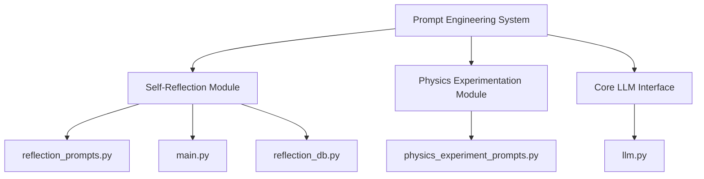
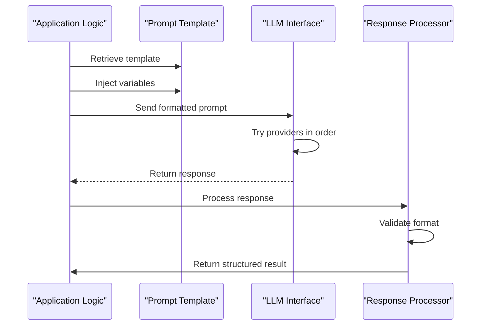
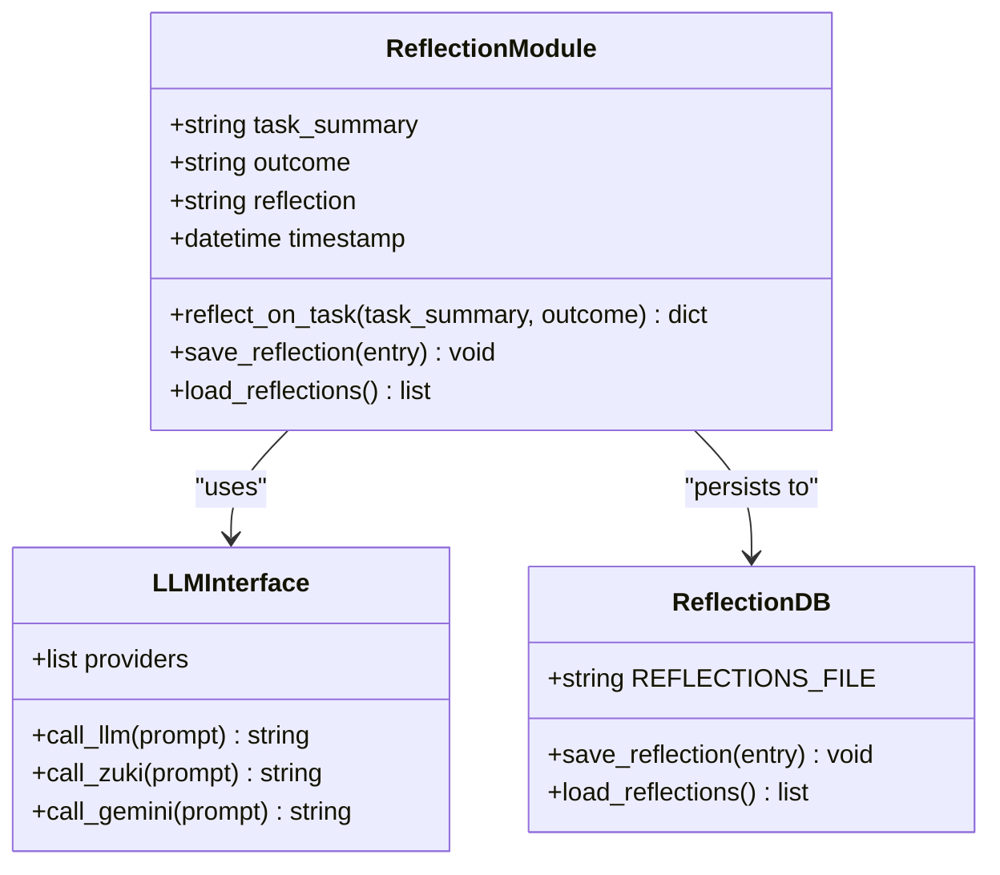
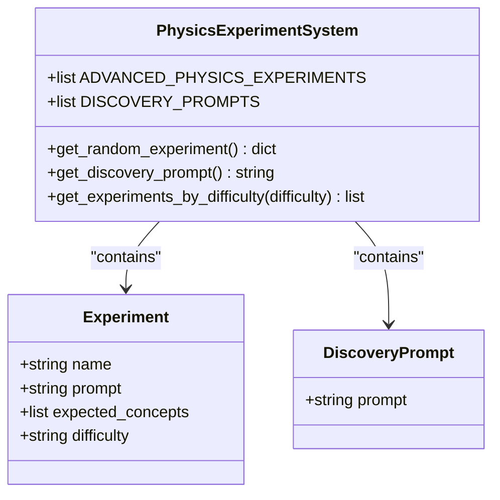
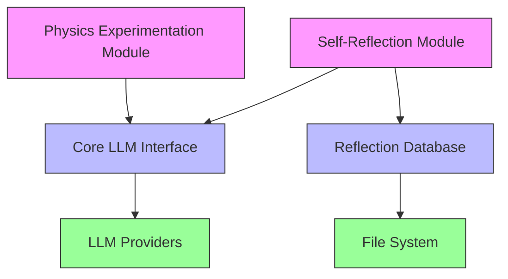

# Prompt Engineering Strategies


## Table of Contents
1. [Introduction](#introduction)
2. [Project Structure](#project-structure)
3. [Core Components](#core-components)
4. [Architecture Overview](#architecture-overview)
5. [Detailed Component Analysis](#detailed-component-analysis)
6. [Dependency Analysis](#dependency-analysis)
7. [Performance Considerations](#performance-considerations)
8. [Troubleshooting Guide](#troubleshooting-guide)
9. [Conclusion](#conclusion)

## Introduction
This document provides a comprehensive analysis of prompt engineering strategies within the RAVANA repository, focusing on self-reflection, decision-making, and physics experimentation workflows. The analysis covers prompt templates, variable injection, context formatting, integration with LLM interfaces, and optimization techniques for clarity, specificity, and deterministic outputs. Real code examples are used to illustrate design patterns and system integration.

## Project Structure
The RAVANA project is organized into modular components that support advanced AI agent behaviors including self-reflection, experimentation, and adaptive learning. The key directories relevant to prompt engineering are:

- `modules/agent_self_reflection`: Contains self-reflection logic and prompt templates
- `physics_experiment_prompts.py`: Central repository for physics experiment prompts
- `core/llm.py`: Core LLM interface and provider management
- `modules/agent_self_reflection/reflection_db.py`: Persistence layer for reflection data

The structure follows a modular design pattern where each cognitive capability is encapsulated in its own module, allowing for independent development and testing.



**Diagram sources**
- [modules/agent_self_reflection/reflection_prompts.py](file://modules/agent_self_reflection/reflection_prompts.py#L1-L7)
- [physics_experiment_prompts.py](file://physics_experiment_prompts.py#L6-L106)
- [core/llm.py](file://core/llm.py#L296-L313)

**Section sources**
- [modules/agent_self_reflection/reflection_prompts.py](file://modules/agent_self_reflection/reflection_prompts.py#L1-L7)
- [physics_experiment_prompts.py](file://physics_experiment_prompts.py#L6-L106)

## Core Components
The prompt engineering system in RAVANA consists of two primary components: self-reflection prompts and physics experimentation prompts. These components demonstrate different approaches to prompt design based on their use cases.

Self-reflection prompts follow a structured template approach with clear section requirements, while physics experimentation prompts use a catalog-based system with metadata for difficulty and expected concepts. Both systems leverage variable injection and are integrated with the LLM interface through consistent calling patterns.

**Section sources**
- [modules/agent_self_reflection/reflection_prompts.py](file://modules/agent_self_reflection/reflection_prompts.py#L1-L7)
- [physics_experiment_prompts.py](file://physics_experiment_prompts.py#L6-L106)

## Architecture Overview
The prompt engineering architecture follows a service-oriented pattern where prompt templates are defined as data structures and consumed by specialized modules. The core components interact as follows:

1. Prompt templates are defined as constants or data structures
2. Application logic retrieves and formats prompts with context variables
3. Formatted prompts are sent to the LLM interface
4. Responses are processed and stored in appropriate persistence layers



**Diagram sources**
- [modules/agent_self_reflection/main.py](file://modules/agent_self_reflection/main.py#L9-L20)
- [core/llm.py](file://core/llm.py#L296-L313)

## Detailed Component Analysis

### Self-Reflection Prompt System
The self-reflection system uses a template-based approach to guide AI agents through structured introspection. The system is designed to produce consistent, analyzable outputs that can be used for self-improvement.

#### Prompt Template Design
The reflection prompt template enforces a specific structure that requires the AI to analyze its performance across four dimensions:

```python
REFLECTION_PROMPT = (
    "You are an AI agent journaling after a major task. "
    "Given the following summary and outcome, answer these questions in a structured way:\n"
    "1. What worked?\n2. What failed?\n3. What surprised you?\n4. What do you still need to learn?\n"
    "Task Summary: {task_summary}\nOutcome: {outcome}\n"
    "Respond in a clear, numbered format."
)
```

This template design ensures comprehensive self-assessment by requiring the AI to consider both successes and failures, unexpected outcomes, and knowledge gaps.

#### Variable Injection and Context Formatting
The system uses Python's string formatting to inject task-specific context into the prompt template:

```python
def reflect_on_task(task_summary, outcome):
    """Generate a self-reflection using the LLM."""
    prompt = REFLECTION_PROMPT.format(task_summary=task_summary, outcome=outcome)
    reflection = call_llm(prompt)
    entry = {
        "timestamp": datetime.now(timezone.utc).isoformat(),
        "task_summary": task_summary,
        "outcome": outcome,
        "reflection": reflection
    }
    save_reflection(entry)
    return entry
```

This approach separates template definition from context injection, making the system more maintainable and testable.

#### Integration with LLM Interface
The reflection system integrates with the core LLM interface, which implements a provider fallback mechanism:

```python
def call_llm(prompt, preferred_provider=None, model=None):
    """
    Try all providers in order, fallback to Gemini if all fail.
    """
    providers = [
        (call_zuki, 'zuki'),
        (call_electronhub, 'electronhub'),
        (call_zanity, 'zanity'),
        (call_a4f, 'a4f'),
    ]
    if preferred_provider:
        providers = sorted(providers, key=lambda x: x[1] != preferred_provider)
    for func, name in providers:
        result = func(prompt, model) if name != 'a4f' else func(prompt)
        if result:
            return result
    # Fallback to Gemini
    return call_gemini(prompt)
```

This ensures reliable prompt processing even if individual providers are unavailable.

#### Persistence and Retrieval
Reflection entries are persisted to a JSON file and can be retrieved for analysis:

```python
REFLECTIONS_FILE = os.path.join(os.path.dirname(__file__), 'reflections.json')

def save_reflection(entry):
    """Append a reflection entry to the JSON file."""
    data = load_reflections()
    data.append(entry)
    with open(REFLECTIONS_FILE, 'w', encoding='utf-8') as f:
        json.dump(data, f, indent=2)

def load_reflections():
    """Load all reflection entries from the JSON file."""
    if not os.path.exists(REFLECTIONS_FILE):
        return []
    with open(REFLECTIONS_FILE, 'r', encoding='utf-8') as f:
        return json.load(f)
```

This persistence mechanism enables long-term analysis of the AI's self-reflection patterns.



**Diagram sources**
- [modules/agent_self_reflection/reflection_prompts.py](file://modules/agent_self_reflection/reflection_prompts.py#L1-L7)
- [modules/agent_self_reflection/main.py](file://modules/agent_self_reflection/main.py#L9-L20)
- [core/llm.py](file://core/llm.py#L296-L313)
- [modules/agent_self_reflection/reflection_db.py](file://modules/agent_self_reflection/reflection_db.py#L3-L17)

**Section sources**
- [modules/agent_self_reflection/reflection_prompts.py](file://modules/agent_self_reflection/reflection_prompts.py#L1-L7)
- [modules/agent_self_reflection/main.py](file://modules/agent_self_reflection/main.py#L9-L20)
- [core/llm.py](file://core/llm.py#L296-L313)
- [modules/agent_self_reflection/reflection_db.py](file://modules/agent_self_reflection/reflection_db.py#L3-L17)

### Physics Experimentation Prompt System
The physics experimentation system uses a catalog-based approach with rich metadata to support advanced scientific inquiry and discovery.

#### Experiment Catalog Structure
The system defines experiments as a list of dictionaries with structured metadata:

```python
ADVANCED_PHYSICS_EXPERIMENTS = [
    {
        "name": "Quantum Tunneling Barrier Analysis",
        "prompt": "Design an experiment to simulate quantum tunneling through a potential barrier...",
        "expected_concepts": ["wave function", "Schrödinger equation", "transmission coefficient", "quantum mechanics"],
        "difficulty": "advanced"
    },
    {
        "name": "Double-Slit Interference with Variable Parameters",
        "prompt": "Create a simulation of the double-slit experiment where you can vary the slit separation...",
        "expected_concepts": ["wave-particle duality", "interference", "diffraction", "quantum superposition"],
        "difficulty": "intermediate"
    }
]
```

This structure enables filtering, sorting, and programmatic access to experiments based on their properties.

#### Discovery Prompts
In addition to structured experiments, the system includes open-ended discovery prompts:

```python
DISCOVERY_PROMPTS = [
    "What if we could manipulate the speed of light in a medium to create temporal paradoxes?",
    "Could there be a fifth fundamental force that only manifests at quantum scales?",
    "What would happen if we could create stable micro black holes in the laboratory?"
]
```

These prompts encourage creative, speculative thinking beyond established scientific frameworks.

#### Accessor Functions
The system provides utility functions to access prompts in different ways:

```python
def get_random_experiment():
    """Get a random physics experiment prompt."""
    import random
    return random.choice(ADVANCED_PHYSICS_EXPERIMENTS)

def get_discovery_prompt():
    """Get a random discovery-oriented prompt."""
    import random
    return random.choice(DISCOVERY_PROMPTS)

def get_experiments_by_difficulty(difficulty):
    """Get experiments filtered by difficulty level."""
    return [exp for exp in ADVANCED_PHYSICS_EXPERIMENTS if exp["difficulty"] == difficulty]
```

These functions abstract the underlying data structure and provide a clean interface for consumers.



**Diagram sources**
- [physics_experiment_prompts.py](file://physics_experiment_prompts.py#L6-L106)

**Section sources**
- [physics_experiment_prompts.py](file://physics_experiment_prompts.py#L6-L106)

## Dependency Analysis
The prompt engineering components have well-defined dependencies that follow a layered architecture pattern. The core dependencies are:



**Diagram sources**
- [modules/agent_self_reflection/main.py](file://modules/agent_self_reflection/main.py#L9-L20)
- [core/llm.py](file://core/llm.py#L296-L313)
- [modules/agent_self_reflection/reflection_db.py](file://modules/agent_self_reflection/reflection_db.py#L3-L17)

**Section sources**
- [modules/agent_self_reflection/main.py](file://modules/agent_self_reflection/main.py#L9-L20)
- [core/llm.py](file://core/llm.py#L296-L313)
- [modules/agent_self_reflection/reflection_db.py](file://modules/agent_self_reflection/reflection_db.py#L3-L17)

## Performance Considerations
The prompt engineering system is designed for reliability and maintainability rather than high-performance throughput. Key performance characteristics include:

- **Latency**: The LLM interface implements a provider fallback mechanism that may increase latency if primary providers fail
- **Scalability**: The JSON-based persistence system is suitable for moderate volumes of reflection data but may require enhancement for high-frequency use
- **Memory Usage**: Prompt templates are loaded into memory at import time, with minimal additional memory overhead during operation
- **Error Handling**: The system includes comprehensive fallback mechanisms and error recovery strategies

The architecture prioritizes correctness and reliability over raw performance, which is appropriate for the cognitive processing use case.

## Troubleshooting Guide
Common issues and their solutions in the prompt engineering system:

1. **LLM Provider Failures**: The system automatically falls back to alternative providers, with Gemini as the final fallback
2. **Invalid Reflection Format**: The system does not currently validate the structure of reflection responses, which could lead to parsing issues in downstream processing
3. **File Persistence Errors**: The reflection database system includes basic error handling for file operations but does not handle concurrent access
4. **Prompt Injection Risks**: The system uses simple string formatting for variable injection, which could potentially be exploited if untrusted input is used

The most critical risk is the lack of response validation in the reflection system, which could lead to data corruption if the LLM returns malformed output.

**Section sources**
- [modules/agent_self_reflection/main.py](file://modules/agent_self_reflection/main.py#L9-L20)
- [core/llm.py](file://core/llm.py#L296-L313)
- [modules/agent_self_reflection/reflection_db.py](file://modules/agent_self_reflection/reflection_db.py#L3-L17)

## Conclusion
The prompt engineering strategies in the RAVANA repository demonstrate a sophisticated approach to guiding AI behavior through carefully designed prompts. The self-reflection system uses structured templates to ensure comprehensive introspection, while the physics experimentation system employs a catalog-based approach with rich metadata for scientific inquiry.

Key strengths include:
- Clear separation of prompt templates from application logic
- Robust LLM interface with provider fallback
- Persistent storage of reflection data
- Well-structured experiment catalog with metadata

Areas for improvement:
- Implement response validation to ensure data integrity
- Add support for concurrent access to reflection database
- Enhance security by validating and sanitizing input variables
- Consider using more sophisticated templating engines for complex prompt construction

The overall design effectively supports the repository's goals of creating an AI system capable of self-reflection, experimentation, and continuous improvement.

**Referenced Files in This Document**   
- [modules/agent_self_reflection/reflection_prompts.py](file://modules/agent_self_reflection/reflection_prompts.py#L1-L7)
- [physics_experiment_prompts.py](file://physics_experiment_prompts.py#L6-L106)
- [modules/agent_self_reflection/main.py](file://modules/agent_self_reflection/main.py#L9-L20)
- [core/llm.py](file://core/llm.py#L296-L313)
- [modules/agent_self_reflection/reflection_db.py](file://modules/agent_self_reflection/reflection_db.py#L3-L17)
- [modules/agent_self_reflection/self_modification.py](file://modules/agent_self_reflection/self_modification.py#L495-L526)