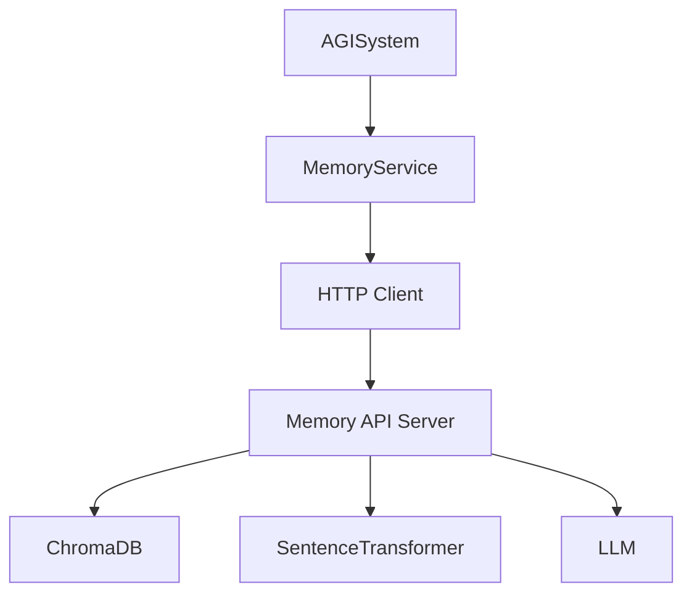
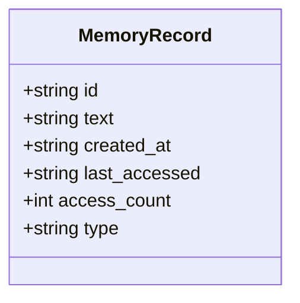
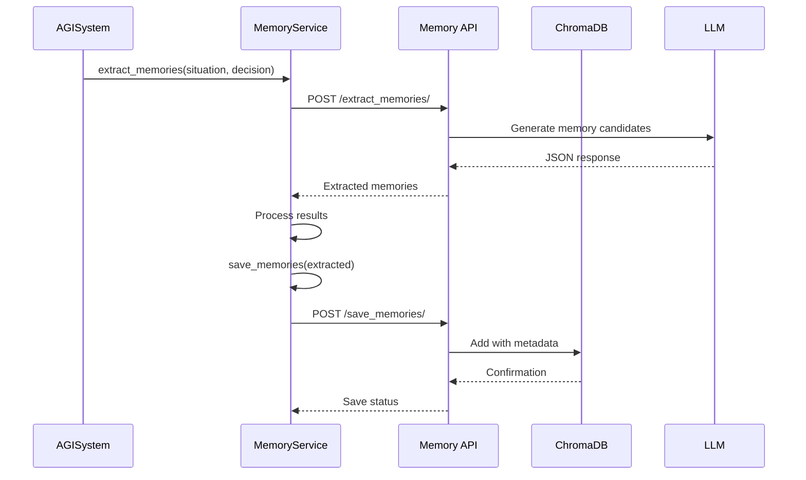

# Episodic Memory


## Table of Contents
1. [Introduction](#introduction)
2. [Core Components](#core-components)
3. [Memory Lifecycle](#memory-lifecycle)
4. [Data Model and Storage](#data-model-and-storage)
5. [Client-Server Interaction](#client-server-interaction)
6. [Integration with AGISystem](#integration-with-agisystem)
7. [Performance and Optimization](#performance-and-optimization)
8. [Troubleshooting Guide](#troubleshooting-guide)

## Introduction
The episodic memory system in the RAVANA framework enables the AGI to retain, organize, and recall contextually relevant experiences from interactions. This system combines semantic embedding via SentenceTransformers with persistent storage in ChromaDB, a lightweight vector database. Memories are extracted from conversations, stored with metadata, and retrieved based on semantic similarity. The system supports consolidation to reduce redundancy and improve retrieval efficiency. This document details the architecture, implementation, and integration of the episodic memory module within the broader AGI system.

## Core Components

The episodic memory system is composed of three primary components: the memory server (`memory.py`), the client interface (`client.py`), and the service wrapper (`memory_service.py`). These components work together to enable memory creation, storage, retrieval, and maintenance.



**Diagram sources**
- [memory.py](file://modules/episodic_memory/memory.py)
- [client.py](file://modules/episodic_memory/client.py)
- [memory_service.py](file://services/memory_service.py)

**Section sources**
- [memory.py](file://modules/episodic_memory/memory.py#L0-L400)
- [client.py](file://modules/episodic_memory/client.py#L0-L150)
- [memory_service.py](file://services/memory_service.py#L0-L20)

## Memory Lifecycle

### Memory Creation
Memories are created through semantic analysis of user-AI interactions. The `extract_memories` function sends a conversation summary to an LLM, which identifies key facts, preferences, goals, and beliefs. These are returned as concise, self-contained statements suitable for long-term retention.

```python
def extract_memories(user_input: str, ai_output: str) -> Optional[Dict[str, Any]]:
    payload = {"user_input": user_input, "ai_output": ai_output}
    return make_request("post", "extract_memories/", json_data=payload)
```

Example:
```python
user1 = "I'm planning a vacation to Hawaii next month."
ai1 = "That sounds wonderful!"
extracted = extract_memories(user1, ai1)
# Returns: {"memories": ["User is planning a trip to Hawaii."]}
```

### Memory Storage
Once extracted, memories are stored in ChromaDB using the `save_memories` function. Each memory is assigned a UUID, timestamp, access metadata, and type (e.g., 'long-term'). ChromaDB automatically generates embeddings using the `all-MiniLM-L6-v2` SentenceTransformer model.

```python
def save_memories(memories_list: List[str], memory_type: str = 'long-term'):
    data = {"memories": memories_list, "type": memory_type}
    return make_request("POST", "/save_memories/", json_data=data)
```

### Memory Retrieval
Memories are retrieved via semantic similarity. The `get_relevant_memories` function encodes a query into a vector and searches ChromaDB for entries above a specified similarity threshold. Retrieved memories have their access count and last accessed timestamp updated.

```python
def get_relevant_memories(query_text: str, top_n: int = 5, similarity_threshold: float = 0.7):
    payload = {"query_text": query_text, "top_n": top_n, "similarity_threshold": similarity_threshold}
    return make_request("post", "get_relevant_memories/", json_data=payload)
```

Example:
```python
query = "What are the vacation plans?"
results = get_relevant_memories(query, top_n=2, similarity_threshold=0.6)
# Returns memories with similarity scores
```

**Section sources**
- [memory.py](file://modules/episodic_memory/memory.py#L217-L284)
- [client.py](file://modules/episodic_memory/client.py#L31-L56)

## Data Model and Storage

### MemoryEntry Structure
The system stores memories with rich metadata. While not explicitly defined as a class, the effective `MemoryEntry` model includes:

- **id**: Unique UUID for the memory
- **text**: The memory content (string)
- **created_at**: ISO timestamp of creation
- **last_accessed**: ISO timestamp of last retrieval
- **access_count**: Number of times retrieved
- **type**: Memory category (e.g., 'long-term', 'episodic')
- **embedding**: 384-dimensional vector from SentenceTransformer



**Diagram sources**
- [memory.py](file://modules/episodic_memory/memory.py#L107-L113)

### Vector Database Configuration
ChromaDB is configured for persistent storage with automatic embedding generation:

```python
CHROMA_PERSIST_DIR = "chroma_db"
CHROMA_COLLECTION = 'memories'
chroma_client = chromadb.Client(Settings(persist_directory=CHROMA_PERSIST_DIR, is_persistent=True))
sentence_transformer_ef = embedding_functions.SentenceTransformerEmbeddingFunction(model_name="all-MiniLM-L6-v2")
chroma_collection = chroma_client.get_or_create_collection(
    name=CHROMA_COLLECTION,
    embedding_function=sentence_transformer_ef
)
```

The system uses cosine similarity for retrieval, converting ChromaDB's L2 distance to similarity via `similarity = 1 - distance`.

**Section sources**
- [memory.py](file://modules/episodic_memory/memory.py#L137-L169)

## Client-Server Interaction

The `MemoryService` class provides an asynchronous interface between the AGI core and the memory server:

```python
class MemoryService:
    async def get_relevant_memories(self, query_text: str):
        return await get_relevant_memories_api({"query_text": query_text})

    async def save_memories(self, memories):
        await asyncio.to_thread(save_memories, memories)

    async def extract_memories(self, user_input: str, ai_output: str):
        return await extract_memories_api({"user_input": user_input, "ai_output": ai_output})

    async def consolidate_memories(self):
        from modules.episodic_memory.memory import ConsolidateRequest
        return await consolidate_memories_api(ConsolidateRequest())
```

This service uses `asyncio.to_thread` to prevent blocking the main event loop during I/O operations.



**Diagram sources**
- [memory_service.py](file://services/memory_service.py#L0-L20)
- [memory.py](file://modules/episodic_memory/memory.py#L170-L216)

**Section sources**
- [memory_service.py](file://services/memory_service.py#L0-L20)
- [memory.py](file://modules/episodic_memory/memory.py#L170-L216)

## Integration with AGISystem

### State Loop Integration
The episodic memory system is tightly integrated into the AGISystem's main loop. After each decision-action cycle, the interaction is summarized and processed for memory extraction:

```python
async def _memorize_interaction(self, situation_prompt: str, decision: dict, action_output: Any):
    interaction_summary = f"Situation: {situation_prompt}\nDecision: {decision}\nAction Output: {action_output}"
    try:
        memories_to_save = await self.memory_service.extract_memories(interaction_summary, "")
        if memories_to_save and memories_to_save.memories:
            await self.memory_service.save_memories(memories_to_save.memories)
            logger.info(f"Saved {len(memories_to_save.memories)} new memories.")
    except Exception as e:
        logger.error(f"Failed during memorization: {e}", exc_info=True)
```

### Trigger Mechanisms
Memory formation is triggered by:
- Decision-making outcomes
- Emotional state shifts
- Search result processing
- Curiosity events

The mood system influences memory relevance through emotional valence, which is passed to the situation generator:

```python
# In situation_generator
pool.append(f"emotion:{emotional.get('dominant_emotion')}|valence:{emotional.get('valence',0):.2f}")
```

### Memory Consolidation
A background task periodically consolidates memories to reduce redundancy:

```python
async def memory_consolidation_task(self):
    while not self._shutdown.is_set():
        consolidation_result = await self.memory_service.consolidate_memories()
        await asyncio.sleep(21600)  # Every 6 hours
```

The consolidation process uses an LLM to merge, deduplicate, and generalize memories, then updates the database accordingly.

**Section sources**
- [system.py](file://core/system.py#L150-L193)
- [system.py](file://core/system.py#L603-L624)
- [memory.py](file://modules/episodic_memory/memory.py#L309-L337)

## Performance and Optimization

### Embedding and Indexing
- **Model**: `all-MiniLM-L6-v2` (384-dimensional embeddings)
- **Index Type**: ChromaDB's default HNSW index for approximate nearest neighbor search
- **Persistence**: Local disk storage in `chroma_db/` directory

### Garbage Collection
The system implements automatic memory maintenance through:
- Periodic consolidation (every 6 hours)
- LLM-guided deduplication and merging
- Deletion of redundant entries after consolidation

### Latency Considerations
- Embedding generation is handled by ChromaDB's built-in function
- Network calls are made asynchronously
- Heavy LLM operations are offloaded to threads

## Troubleshooting Guide

### Retrieval Inaccuracies
**Symptoms**: Low relevance in retrieved memories  
**Solutions**:
- Adjust `similarity_threshold` (default 0.7)
- Verify embedding model consistency
- Check LLM extraction quality

### Embedding Drift
**Symptoms**: Degraded similarity search performance  
**Solutions**:
- Ensure consistent embedding model across services
- Rebuild ChromaDB collection if model changes
- Monitor for version mismatches

### Latency Issues
**Symptoms**: Slow memory operations  
**Solutions**:
- Verify ChromaDB persistence settings
- Check network connectivity between services
- Monitor LLM response times
- Optimize query complexity

### Common Errors
- **Connection refused**: Ensure memory server is running on port 8000
- **Empty results**: Verify non-empty input and appropriate thresholds
- **JSON parsing errors**: Check LLM response formatting and prompt design

**Section sources**
- [client.py](file://modules/episodic_memory/client.py#L31-L56)
- [memory.py](file://modules/episodic_memory/memory.py#L284-L310)
- [memory.py](file://modules/episodic_memory/memory.py#L334-L361)

**Referenced Files in This Document**   
- [memory.py](file://modules/episodic_memory/memory.py)
- [client.py](file://modules/episodic_memory/client.py)
- [memory_service.py](file://services/memory_service.py)
- [system.py](file://core/system.py)