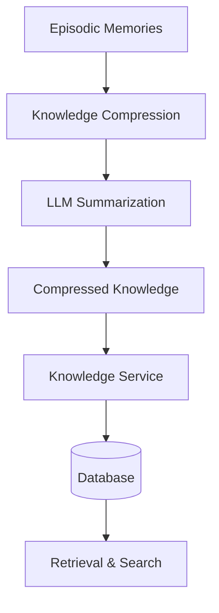
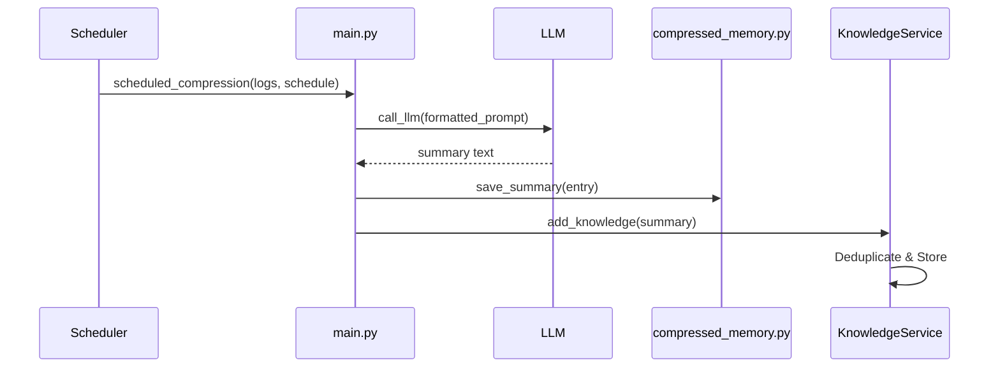
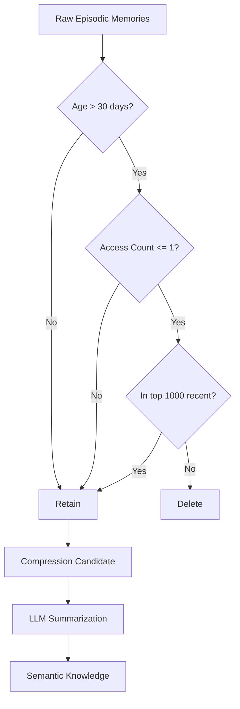
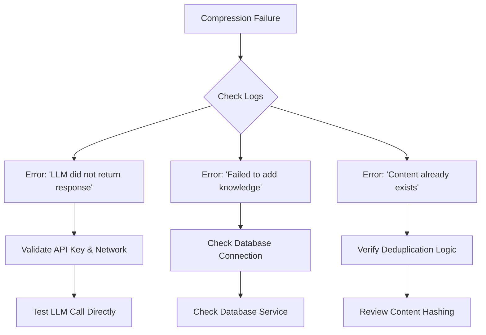

# Semantic Memory & Knowledge Compression


## Table of Contents
1. [Introduction](#introduction)
2. [Core Components Overview](#core-components-overview)
3. [Compression Workflow](#compression-workflow)
4. [CompressedMemory Model and Storage](#compressedmemory-model-and-storage)
5. [Public Interfaces](#public-interfaces)
6. [Real-World Examples](#real-world-examples)
7. [Data Retention and Hierarchical Organization](#data-retention-and-hierarchical-organization)
8. [Performance Trade-offs](#performance-trade-offs)
9. [Debugging Strategies](#debugging-strategies)
10. [Conclusion](#conclusion)

## Introduction
The Semantic Memory & Knowledge Compression system is a critical component of the RAVANA architecture, responsible for transforming raw episodic memories into structured, high-level semantic knowledge. This process enables long-term retention of insights while managing storage efficiency and query performance. The system leverages Large Language Models (LLMs) to summarize logs, reflections, and interactions, storing the resulting knowledge in a searchable database. This document details the implementation, integration, and operational characteristics of this pipeline.

## Core Components Overview

The knowledge compression pipeline consists of several interconnected modules:

- **compression_prompts.py**: Defines the prompt template used to guide the LLM during summarization.
- **compressed_memory.py**: Implements file-based persistence for compressed summaries.
- **main.py (knowledge_compression)**: Orchestrates the compression workflow and integrates with the LLM.
- **KnowledgeService**: Manages database storage, deduplication, and retrieval of compressed knowledge.
- **Summary Model**: Database schema for storing semantic knowledge.
- **Episodic Memory System**: Source of raw memories that feed into the compression process.



**Diagram sources**
- [compressed_memory.py](file://modules/knowledge_compression/compressed_memory.py)
- [knowledge_service.py](file://services/knowledge_service.py)
- [models.py](file://database/models.py)

**Section sources**
- [compressed_memory.py](file://modules/knowledge_compression/compressed_memory.py)
- [compression_prompts.py](file://modules/knowledge_compression/compression_prompts.py)
- [main.py](file://modules/knowledge_compression/main.py)

## Compression Workflow

The compression workflow follows a structured sequence to convert raw episodic data into actionable semantic knowledge:

1. **Trigger Conditions**: Compression can be initiated on a schedule (e.g., weekly or monthly) via `scheduled_compression()` or programmatically through `compress_knowledge()`.
2. **Batch Selection**: The system collects recent logs, reflections, or episodic entries for processing. In the current implementation, inputs are provided via file path or direct data structure.
3. **Prompt Construction**: The `COMPRESSION_PROMPT` template is populated with the collected logs, instructing the LLM to produce a structured summary of new facts, outcomes, and goals.
4. **LLM Summarization**: The formatted prompt is sent to the LLM via `call_llm()` from the core module, which returns a natural language summary.
5. **Storage**: The summary, along with timestamp metadata, is saved to both a JSON file (`compressed_memory.json`) and the database via the KnowledgeService.
6. **Validation**: While explicit coherence validation is not implemented, the system relies on the LLM's inherent ability to produce coherent output.



**Diagram sources**
- [main.py](file://modules/knowledge_compression/main.py)
- [compressed_memory.py](file://modules/knowledge_compression/compressed_memory.py)
- [knowledge_service.py](file://services/knowledge_service.py)

**Section sources**
- [main.py](file://modules/knowledge_compression/main.py)
- [compression_prompts.py](file://modules/knowledge_compression/compression_prompts.py)

## CompressedMemory Model and Storage

The CompressedMemory system uses a hybrid storage approach, writing summaries to a local JSON file while also integrating with the SQLModel-based database through the KnowledgeService.

### Data Model
The `Summary` model in `database/models.py` defines the structure for stored knowledge:

```python
class Summary(SQLModel, table=True):
    id: int | None = Field(default=None, primary_key=True)
    timestamp: str
    summary_text: str
    source: str | None = Field(default="unknown")
    category: str | None = Field(default="misc")
    content_hash: str | None = Field(default=None)
```

### Storage Mechanism
- **File Storage**: The `save_summary()` function in `compressed_memory.py` appends entries to `compressed_memory.json`, enabling simple, persistent storage without database dependencies.
- **Database Storage**: The `KnowledgeService.add_knowledge()` method stores summaries in the database, using SHA-256 hashing for deduplication.
- **Semantic Search**: The KnowledgeService initializes a FAISS index for vector-based semantic search, using Sentence-BERT embeddings (`all-MiniLM-L6-v2`).

### Integration with Knowledge Service
The `KnowledgeService` class imports `compress_knowledge` from the compression module, creating a tight integration between summarization and knowledge management. When new knowledge is added, it is automatically:
- Deduplicated via content hashing
- Stored in the database
- Indexed in FAISS for semantic search
- Persisted to disk

```mermaid
classDiagram
class CompressedMemory {
+COMPRESSED_FILE : str
+save_summary(entry)
+load_summaries()
}
class KnowledgeService {
-engine
-embedding_model
-faiss_index
-id_map
+add_knowledge(content, source, category)
+get_knowledge_by_category(category, limit)
+get_recent_knowledge(hours, limit)
+search_knowledge(query, limit)
+compress_and_save_knowledge()
}
class Summary {
+id : int
+timestamp : str
+summary_text : str
+source : str
+category : str
+content_hash : str
}
CompressedMemory --> "writes to" Summary : via KnowledgeService
KnowledgeService --> Summary : manages
Summary ..> "database" : stored in
```

**Diagram sources**
- [compressed_memory.py](file://modules/knowledge_compression/compressed_memory.py)
- [knowledge_service.py](file://services/knowledge_service.py)
- [models.py](file://database/models.py)

**Section sources**
- [compressed_memory.py](file://modules/knowledge_compression/compressed_memory.py)
- [knowledge_service.py](file://services/knowledge_service.py)
- [models.py](file://database/models.py)

## Public Interfaces

### compress_knowledge(logs)
**Description**: Primary function for compressing raw logs into semantic summaries.  
**Parameters**:
- `logs`: Dictionary containing logs to summarize (e.g., {"text": "content", "source": "source_name"})  
**Returns**: Dictionary with `timestamp` and `summary` fields.  
**Error Handling**: Raises exceptions from `call_llm()` if LLM processing fails.  
**Source**: [main.py](file://modules/knowledge_compression/main.py#L7-L20)

### scheduled_compression(logs, schedule)
**Description**: Wrapper for time-based compression execution.  
**Parameters**:
- `logs`: Log entries to compress
- `schedule`: String indicating frequency ("weekly", "monthly")  
**Returns**: Summary entry created by compression.  
**Note**: Currently a direct wrapper; actual scheduling would be handled externally (e.g., cron).  
**Source**: [main.py](file://modules/knowledge_compression/main.py#L22-L35)

### KnowledgeService.add_knowledge(content, source, category)
**Description**: Adds new knowledge to the system with deduplication and semantic indexing.  
**Parameters**:
- `content`: Raw text to be summarized
- `source`: Origin of the knowledge (e.g., "experiment", "reflection")
- `category`: Classification for organizational purposes  
**Returns**: Dictionary with metadata and `duplicate` flag.  
**Error Handling**: Validates input, handles database and FAISS exceptions with logging.  
**Source**: [knowledge_service.py](file://services/knowledge_service.py#L50-L140)

### KnowledgeService.get_knowledge_by_category(category, limit)
**Description**: Retrieves knowledge entries by category.  
**Parameters**:
- `category`: Category to filter by
- `limit`: Maximum number of results  
**Returns**: List of dictionaries containing knowledge metadata.  
**Source**: [knowledge_service.py](file://services/knowledge_service.py#L142-L155)

### KnowledgeService.search_knowledge(query, limit)
**Description**: Performs text-based search across knowledge summaries.  
**Parameters**:
- `query`: Search term
- `limit`: Maximum results  
**Returns**: List of matching entries with relevance scores.  
**Source**: [knowledge_service.py](file://services/knowledge_service.py#L205-L215)

**Section sources**
- [main.py](file://modules/knowledge_compression/main.py)
- [knowledge_service.py](file://services/knowledge_service.py)

## Real-World Examples

### Compression of Experimental Logs
When processing experimental data, the system can summarize detailed logs into actionable insights:

**Input Logs**:
```json
{
  "text": "Experiment 001: Tested hypothesis that increased temperature improves reaction rate. Temperature raised from 25°C to 37°C. Reaction completion time decreased from 120s to 67s. Hypothesis confirmed. Next step: test at 50°C.",
  "source": "physics_experiment",
  "category": "science"
}
```

**Compression Prompt**:
```
You are an AI tasked with summarizing accumulated knowledge and logs. 
Given the following logs, produce a concise summary report of new facts learned, key outcomes, and next goals.
Logs: {"text": "Experiment 001: ...", "source": "physics_experiment", "category": "science"}
Respond in a clear, structured format.
```

**LLM Output (Summary)**:
```
New Fact: Increasing temperature from 25°C to 37°C significantly improves chemical reaction rate, reducing completion time by 44%.
Outcome: Hypothesis confirmed - temperature positively affects reaction kinetics.
Next Goal: Test reaction rate at 50°C to determine upper efficiency limits.
```

This summary is then stored in the database with category "science" and source "physics_experiment", making it retrievable via `get_knowledge_by_category("science")`.

### Emotional Pattern Summarization
The system can also process emotional logs to identify patterns:

**Input**:
```json
{
  "text": "User expressed frustration during debugging session. Mood analysis detected high stress levels. Suggested break, which improved subsequent interaction quality. Pattern: User performance degrades under sustained pressure.",
  "source": "emotional_intelligence",
  "category": "user_behavior"
}
```

**Summary Output**:
```
Insight: User's problem-solving effectiveness decreases under prolonged stress.
Observation: Intervention with break suggestion successfully restored optimal performance.
Recommendation: Monitor for frustration cues and proactively suggest breaks during extended technical tasks.
```

**Section sources**
- [main.py](file://modules/knowledge_compression/main.py)
- [knowledge_service.py](file://services/knowledge_service.py)

## Data Retention and Hierarchical Organization

### Data Retention Policies
The system implements a multi-layered approach to data retention:

1. **Episodic Memory Cleanup**: The `cleanup_old_memories()` function in `postgresql_store.py` removes rarely accessed memories older than a threshold (default 30 days), while preserving a minimum number (default 1000) and recently accessed items.
2. **Deduplication**: The KnowledgeService uses SHA-256 hashing to prevent storage of duplicate content.
3. **Compression as Retention**: By design, the compression process itself serves as a retention mechanism, preserving semantic meaning while discarding raw episodic details.

### Hierarchical Knowledge Organization
Knowledge is organized through:
- **Categorization**: Entries are tagged with categories (e.g., "science", "user_behavior") for structured retrieval.
- **Source Tracking**: Origins are preserved to enable provenance analysis.
- **Temporal Indexing**: Timestamps allow chronological organization and time-based queries.
- **Vector Space Hierarchy**: FAISS embeddings create a semantic hierarchy based on content similarity.

### Prevention of Information Loss
The system mitigates information loss through:
- **Redundancy**: Storing both compressed summaries and original episodic memories (until cleanup).
- **Consolidation**: The episodic memory system's `consolidate_memories()` function merges related memories before compression, preserving context.
- **Validation**: While not explicit, the structured prompt format encourages comprehensive summarization.



**Diagram sources**
- [postgresql_store.py](file://modules/episodic_memory/postgresql_store.py#L550-L590)
- [memory.py](file://modules/episodic_memory/memory.py)

**Section sources**
- [postgresql_store.py](file://modules/episodic_memory/postgresql_store.py)
- [memory.py](file://modules/episodic_memory/memory.py)

## Performance Trade-offs

The knowledge compression system involves several key performance trade-offs:

| Factor | High Frequency | Low Frequency |
|--------|----------------|---------------|
| **Query Efficiency** | Improved (fresh summaries) | Reduced (outdated knowledge) |
| **LLM Cost** | High (frequent API calls) | Low (infrequent processing) |
| **Storage Usage** | Lower (aggressive cleanup) | Higher (accumulated raw data) |
| **Information Freshness** | High | Low |
| **Processing Overhead** | Continuous | Batched, periodic |

**Optimization Strategies**:
- **Batching**: Processing multiple logs in a single LLM call reduces API costs.
- **Selective Compression**: Only compressing high-value memories (e.g., high confidence, high access count).
- **Caching**: The FAISS index enables fast semantic search without repeated LLM queries.
- **Asynchronous Processing**: Compression can run in the background without blocking primary operations.

The current implementation favors cost efficiency over real-time freshness, with compression triggered on a weekly or manual basis rather than continuously.

**Section sources**
- [main.py](file://modules/knowledge_compression/main.py)
- [knowledge_service.py](file://services/knowledge_service.py)

## Debugging Strategies

### Semantic Drift
**Issue**: Summaries gradually diverge from original meaning over multiple compression cycles.  
**Detection**: Compare LLM summaries against original logs using embedding similarity.  
**Mitigation**: Limit compression recursion; always base summaries on raw episodic data rather than previous summaries.

### Redundant Summaries
**Issue**: Multiple similar summaries created for related events.  
**Detection**: Monitor `add_knowledge()` duplicate detection logs.  
**Mitigation**: Improve prompt specificity; enhance deduplication with semantic similarity checks beyond exact hashing.

### Failed Compression Jobs
**Issue**: LLM calls fail due to network issues or content constraints.  
**Detection**: Check application logs for `Failed to add knowledge` or `LLM did not return a response` errors.  
**Mitigation**: Implement retry logic with exponential backoff; validate input length before processing; provide fallback summarization methods.

### Debugging Tools
- **Logging**: Comprehensive logging in `knowledge_service.py` and `memory.py` tracks all operations.
- **Health Checks**: The `/health` endpoint in the memory service verifies system status.
- **Statistics**: `get_memory_statistics()` provides insights into memory system state.
- **Manual Testing**: The `main.py` script in the knowledge_compression module supports command-line testing with `--logs` parameter.



**Diagram sources**
- [knowledge_service.py](file://services/knowledge_service.py)
- [memory.py](file://modules/episodic_memory/memory.py)

**Section sources**
- [knowledge_service.py](file://services/knowledge_service.py)
- [memory.py](file://modules/episodic_memory/memory.py)

## Conclusion
The Semantic Memory & Knowledge Compression system in RAVANA provides a robust framework for transforming raw episodic experiences into structured, actionable knowledge. By leveraging LLM-driven summarization, database-backed storage, and semantic search capabilities, the system enables long-term learning and efficient information retrieval. The integration between the knowledge_compression module and the KnowledgeService ensures that compressed knowledge is properly indexed, deduplicated, and made available for downstream applications. While the current implementation provides a solid foundation, opportunities exist for enhancing compression scheduling, improving semantic drift detection, and optimizing performance trade-offs between freshness, cost, and efficiency.

**Referenced Files in This Document**   
- [compressed_memory.py](file://modules/knowledge_compression/compressed_memory.py)
- [compression_prompts.py](file://modules/knowledge_compression/compression_prompts.py)
- [main.py](file://modules/knowledge_compression/main.py)
- [knowledge_service.py](file://services/knowledge_service.py)
- [models.py](file://database/models.py)
- [memory.py](file://modules/episodic_memory/memory.py)
- [postgresql_store.py](file://modules/episodic_memory/postgresql_store.py)