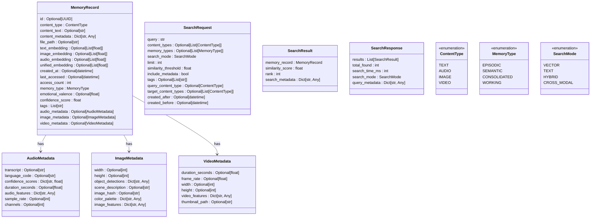

# Multi-Modal Memory


## Table of Contents
1. [Introduction](#introduction)
2. [Project Structure](#project-structure)
3. [Core Components](#core-components)
4. [Architecture Overview](#architecture-overview)
5. [Detailed Component Analysis](#detailed-component-analysis)
6. [Dependency Analysis](#dependency-analysis)
7. [Performance Considerations](#performance-considerations)
8. [Troubleshooting Guide](#troubleshooting-guide)
9. [Conclusion](#conclusion)

## Introduction
The Multi-Modal Memory system is an advanced episodic memory module within the RAVANA project, designed to store, retrieve, and process information across multiple modalities including text, audio, image, and video. This system enhances the AGI's long-term memory capabilities by enabling semantic understanding and cross-modal retrieval. It integrates Whisper for audio transcription, PostgreSQL with pgvector for high-performance vector storage, and supports hybrid search modes combining vector similarity and full-text search. The system maintains backward compatibility with legacy ChromaDB-based storage while offering a scalable, robust foundation for multi-modal data persistence and retrieval.

## Project Structure
The multi-modal memory system is organized into a modular structure within the `modules/episodic_memory` directory. The core components include API endpoints, data models, database operations, embedding generation, and specialized processors for different media types. The system is designed for extensibility and integration with the broader RAVANA framework.


**Diagram sources**
- [memory.py](file://modules/episodic_memory/memory.py)
- [multi_modal_service.py](file://modules/episodic_memory/multi_modal_service.py)
- [postgresql_store.py](file://modules/episodic_memory/postgresql_store.py)
- [embedding_service.py](file://modules/episodic_memory/embedding_service.py)
- [whisper_processor.py](file://modules/episodic_memory/whisper_processor.py)
- [search_engine.py](file://modules/episodic_memory/search_engine.py)
- [models.py](file://modules/episodic_memory/models.py)
- [setup_database.py](file://modules/episodic_memory/setup_database.py)

**Section sources**
- [memory.py](file://modules/episodic_memory/memory.py)
- [README_MULTIMODAL.md](file://modules/episodic_memory/README_MULTIMODAL.md)

## Core Components
The Multi-Modal Memory system comprises several core components that work together to enable robust, scalable memory operations. The system is built on FastAPI for its RESTful interface, leveraging PostgreSQL with the pgvector extension for efficient vector similarity search. At its heart is the `MultiModalMemoryService` class, which orchestrates interactions between the database, embedding generation, audio processing, and search functionalities. The data model is defined using Pydantic, ensuring type safety and validation for all memory records and API requests. Audio processing is powered by Whisper, enabling transcription and feature extraction from spoken content. The system supports both legacy ChromaDB operations and the new PostgreSQL-based storage, ensuring backward compatibility during migration. Key components include the `PostgreSQLStore` for database operations, `EmbeddingService` for generating text, image, and audio embeddings, and `AdvancedSearchEngine` for executing hybrid and cross-modal searches.

**Section sources**
- [memory.py](file://modules/episodic_memory/memory.py#L1-L722)
- [models.py](file://modules/episodic_memory/models.py#L1-L251)
- [multi_modal_service.py](file://modules/episodic_memory/multi_modal_service.py#L1-L657)
- [postgresql_store.py](file://modules/episodic_memory/postgresql_store.py#L1-L591)
- [embedding_service.py](file://modules/episodic_memory/embedding_service.py#L1-L499)

## Architecture Overview
The Multi-Modal Memory system follows a layered architecture with clear separation of concerns. The API layer, implemented with FastAPI, exposes endpoints for memory operations and search. The service layer, centered around `MultiModalMemoryService`, coordinates all business logic and integrates various components. The data layer uses PostgreSQL with pgvector for persistent storage of memory records and their embeddings. The processing layer handles the generation of embeddings for different modalities and the extraction of features from audio and image content.


**Diagram sources**
- [memory.py](file://modules/episodic_memory/memory.py#L1-L722)
- [multi_modal_service.py](file://modules/episodic_memory/multi_modal_service.py#L1-L657)
- [postgresql_store.py](file://modules/episodic_memory/postgresql_store.py#L1-L591)
- [embedding_service.py](file://modules/episodic_memory/embedding_service.py#L1-L499)
- [whisper_processor.py](file://modules/episodic_memory/whisper_processor.py#L1-L400)

## Detailed Component Analysis

### MultiModalMemoryService Analysis
The `MultiModalMemoryService` is the central orchestrator of the multi-modal memory system. It integrates the PostgreSQL store, embedding service, Whisper audio processor, and search engine to provide a unified interface for memory operations. The service is initialized with a database URL and model configurations, and it manages the lifecycle of its components through `initialize()` and `close()` methods.


**Diagram sources**
- [multi_modal_service.py](file://modules/episodic_memory/multi_modal_service.py#L1-L657)
- [postgresql_store.py](file://modules/episodic_memory/postgresql_store.py#L1-L591)
- [embedding_service.py](file://modules/episodic_memory/embedding_service.py#L1-L499)
- [whisper_processor.py](file://modules/episodic_memory/whisper_processor.py#L1-L400)
- [search_engine.py](file://modules/episodic_memory/search_engine.py#L1-L350)

**Section sources**
- [multi_modal_service.py](file://modules/episodic_memory/multi_modal_service.py#L1-L657)

### Memory Record and Data Models
The data model for the multi-modal memory system is defined in `models.py` using Pydantic. The `MemoryRecord` class is the core data structure, capable of storing information from various modalities. It includes fields for text, audio, image, and video content, along with their respective metadata and embeddings. The model supports validation through Pydantic validators, ensuring data integrity.



**Diagram sources**
- [models.py](file://modules/episodic_memory/models.py#L1-L251)

**Section sources**
- [models.py](file://modules/episodic_memory/models.py#L1-L251)

### API Endpoints and Request Flow
The API endpoints are implemented in `memory.py` using FastAPI. The system supports both legacy endpoints for backward compatibility and new endpoints for multi-modal operations. The request flow for processing an audio file involves uploading the file, transcribing it with Whisper, generating embeddings, and storing the memory record in PostgreSQL.


**Diagram sources**
- [memory.py](file://modules/episodic_memory/memory.py#L1-L722)
- [multi_modal_service.py](file://modules/episodic_memory/multi_modal_service.py#L1-L657)
- [whisper_processor.py](file://modules/episodic_memory/whisper_processor.py#L1-L400)
- [embedding_service.py](file://modules/episodic_memory/embedding_service.py#L1-L499)
- [postgresql_store.py](file://modules/episodic_memory/postgresql_store.py#L1-L591)

**Section sources**
- [memory.py](file://modules/episodic_memory/memory.py#L1-L722)

### Database Schema and Migration
The database schema is defined in `schema.sql` and managed through `setup_database.py`. The system uses PostgreSQL with the pgvector extension to store memory records and their embeddings. The migration process allows for seamless transition from the legacy ChromaDB storage to the new PostgreSQL-based system, including data migration and schema creation.

```mermaid
erDiagram
memory_records ||--o{ audio_memories : "1:1"
memory_records ||--o{ image_memories : "1:1"
memory_records ||--o{ video_memories : "1:1"
memory_records {
uuid id PK
string content_type
text content_text
jsonb content_metadata
string file_path
vector text_embedding
vector image_embedding
vector audio_embedding
vector unified_embedding
timestamp created_at
timestamp last_accessed
int access_count
string memory_type
float emotional_valence
float confidence_score
string[] tags
}
audio_memories {
uuid memory_id PK FK
text transcript
string language_code
jsonb confidence_scores
float duration_seconds
jsonb audio_features
int sample_rate
int channels
}
image_memories {
uuid memory_id PK FK
int width
int height
jsonb object_detections
text scene_description
string image_hash
jsonb color_palette
jsonb image_features
}
video_memories {
uuid memory_id PK FK
float duration_seconds
float frame_rate
int width
int height
jsonb video_features
string thumbnail_path
}
```

**Diagram sources**
- [schema.sql](file://modules/episodic_memory/schema.sql)
- [setup_database.py](file://modules/episodic_memory/setup_database.py#L1-L434)
- [postgresql_store.py](file://modules/episodic_memory/postgresql_store.py#L1-L591)

**Section sources**
- [setup_database.py](file://modules/episodic_memory/setup_database.py#L1-L434)

## Dependency Analysis
The Multi-Modal Memory system has a well-defined dependency structure. The core dependencies include FastAPI for the web framework, asyncpg for PostgreSQL connectivity, sentence-transformers for text embeddings, and faster-whisper for audio processing. The system also depends on pgvector for vector similarity search in PostgreSQL. The component dependencies are managed through Python's import system, with clear interfaces between modules.


**Diagram sources**
- [memory.py](file://modules/episodic_memory/memory.py#L1-L722)
- [multi_modal_service.py](file://modules/episodic_memory/multi_modal_service.py#L1-L657)
- [postgresql_store.py](file://modules/episodic_memory/postgresql_store.py#L1-L591)
- [embedding_service.py](file://modules/episodic_memory/embedding_service.py#L1-L499)
- [whisper_processor.py](file://modules/episodic_memory/whisper_processor.py#L1-L400)
- [search_engine.py](file://modules/episodic_memory/search_engine.py#L1-L350)

**Section sources**
- [memory.py](file://modules/episodic_memory/memory.py#L1-L722)
- [requirements.txt](file://modules/episodic_memory/requirements.txt)

## Performance Considerations
The Multi-Modal Memory system incorporates several performance optimizations. The `EmbeddingService` includes an in-memory cache to avoid recomputation of text embeddings, significantly improving response times for repeated queries. The PostgreSQL database uses IVFFlat indexes for efficient vector similarity search. Connection pooling is implemented to handle concurrent requests efficiently. Audio processing is optimized by resampling to 16kHz and limiting maximum file duration. The system also supports batch processing of files with configurable parallelism to maximize throughput.

**Section sources**
- [embedding_service.py](file://modules/episodic_memory/embedding_service.py#L1-L499)
- [postgresql_store.py](file://modules/episodic_memory/postgresql_store.py#L1-L591)
- [multi_modal_service.py](file://modules/episodic_memory/multi_modal_service.py#L1-L657)
- [README_MULTIMODAL.md](file://modules/episodic_memory/README_MULTIMODAL.md#L1-L316)

## Troubleshooting Guide
Common issues with the Multi-Modal Memory system include database connectivity problems, missing pgvector extension, and audio processing failures. Ensure that PostgreSQL is running and the pgvector extension is installed. Verify the `POSTGRES_URL` environment variable is correctly set. For audio processing issues, check that the Whisper model is properly downloaded and that the audio file format is supported. Enable debug logging by setting `LOG_LEVEL=DEBUG` to get more detailed error messages. If migration from ChromaDB fails, ensure the ChromaDB directory exists and is accessible. Monitor the system's health using the `/health` endpoint, which reports database connectivity and service status.

**Section sources**
- [README_MULTIMODAL.md](file://modules/episodic_memory/README_MULTIMODAL.md#L1-L316)
- [memory.py](file://modules/episodic_memory/memory.py#L1-L722)
- [setup_database.py](file://modules/episodic_memory/setup_database.py#L1-L434)

## Conclusion
The Multi-Modal Memory system represents a significant advancement in the RAVANA project's memory capabilities. By supporting multiple data modalities and leveraging state-of-the-art technologies like Whisper and pgvector, it enables rich, context-aware memory storage and retrieval. The system's modular architecture ensures maintainability and extensibility, while its backward compatibility facilitates smooth integration with existing components. The comprehensive API and client library make it easy to incorporate multi-modal memory operations into various applications. With its robust performance optimizations and detailed troubleshooting guidance, the system is well-positioned to serve as a foundational component for advanced AGI applications.

**Referenced Files in This Document**   
- [memory.py](file://modules/episodic_memory/memory.py)
- [models.py](file://modules/episodic_memory/models.py)
- [README_MULTIMODAL.md](file://modules/episodic_memory/README_MULTIMODAL.md)
- [setup_database.py](file://modules/episodic_memory/setup_database.py)
- [multi_modal_service.py](file://modules/episodic_memory/multi_modal_service.py)
- [postgresql_store.py](file://modules/episodic_memory/postgresql_store.py)
- [embedding_service.py](file://modules/episodic_memory/embedding_service.py)
- [search_engine.py](file://modules/episodic_memory/search_engine.py)
- [whisper_processor.py](file://modules/episodic_memory/whisper_processor.py)
