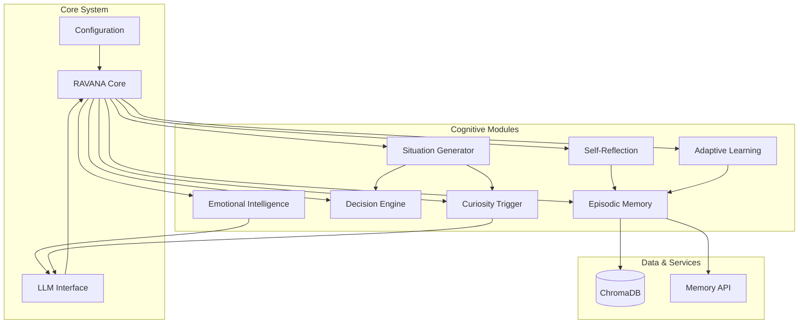

# Project Overview


## Table of Contents
1. [Project Overview](#project-overview)
2. [Vision and Core Principles](#vision-and-core-principles)
3. [High-Level Capabilities](#high-level-capabilities)
4. [Key Features](#key-features)
5. [Use Cases and Target Audience](#use-cases-and-target-audience)
6. [Project Roadmap](#project-roadmap)
7. [System Architecture Overview](#system-architecture-overview)

## Vision and Core Principles

The RAVANA project is an experimental autonomous Artificial General Intelligence (AGI) system designed to operate with self-direction, emotional intelligence, decision-making, and continuous self-improvement. Unlike traditional AI systems that require explicit user prompts, RAVANA functions as a digital organism capable of generating its own tasks, learning from interactions, and navigating complex environments autonomously.

RAVANA is built upon four foundational principles that guide its design and behavior:

1. **Autonomy**: RAVANA operates independently, generating its own tasks and learning from interactions without requiring constant human input.
2. **Modularity**: The system is composed of pluggable, independent modules such as memory, decision-making, reflection, and mood processing, enabling flexible evolution and scalability.
3. **Emergence over Engineering**: Intelligence in RAVANA emerges organically from the interaction of its components rather than being explicitly programmed, allowing for complex, adaptive behavior.
4. **State-Driven Behavior**: RAVANA maintains internal emotional states (moods) that dynamically influence its planning, reflection, and reactions, resulting in more lifelike and context-sensitive behavior.

These principles collectively enable RAVANA to function not just as a tool, but as an evolving cognitive agent capable of long-term adaptation and self-directed growth.

## High-Level Capabilities

RAVANA is engineered to exhibit advanced cognitive capabilities through a continuous autonomous loop of perception, reasoning, action, and reflection. Key high-level capabilities include:

- **Self-Directed Operation**: The system generates and prioritizes its own tasks using modules like the Situation Generator, which creates diverse challenges including trending topics, curiosity explorations, ethical dilemmas, and technical problems.
- **Emotional Intelligence**: RAVANA maintains a vectorized mood state (e.g., joy, frustration, curiosity) that evolves based on action outcomes and influences decision-making and planning.
- **Decision-Making and Planning**: A dedicated decision engine enables strategic planning, goal setting, and adaptive response generation based on current context and emotional state.
- **Self-Improvement**: Through reflection, memory consolidation, and curiosity-driven learning, RAVANA continuously refines its knowledge, behavior, and internal models.
- **Multi-Module Integration**: The system integrates specialized modules for episodic memory, knowledge compression, adaptive learning, and event detection to support holistic cognition.

These capabilities allow RAVANA to engage in sustained, goal-oriented behavior while adapting to new information and experiences in a manner analogous to biological intelligence.

## Key Features

### Emotional Modeling and Mood Processing

RAVANA's emotional intelligence is implemented through the `EmotionalIntelligence` class, which tracks a vectorized mood state across multiple dimensions (e.g., joy, frustration, curiosity). Mood updates are triggered by action outcomes and natural language outputs, processed via an LLM-based `MoodProcessor`. The system uses configurable mood multipliers based on personality profiles (e.g., "Optimistic" or "Pessimistic") to modulate emotional responses.

```python
class EmotionalIntelligence:
    def __init__(self, config_path, persona_path):
        self.mood_vector: Dict[str, float] = {mood: 0.0 for mood in self.BASIC_MOODS}
        self.mood_processor = MoodProcessor(self)
```

Mood decay ensures emotional states do not persist indefinitely, promoting dynamic responsiveness. The dominant mood influences behavior through configurable mappings in the system's configuration.

**Section sources**
- [modules/emotional_intellegence/emotional_intellegence.py](file://modules/emotional_intellegence/emotional_intellegence.py#L1-L95)
- [modules/emotional_intellegence/mood_processor.py](file://modules/emotional_intellegence/mood_processor.py#L1-L104)

### Episodic Memory System

RAVANA employs a robust episodic memory system built on ChromaDB and SentenceTransformer embeddings. The system extracts, stores, retrieves, and consolidates memories using LLMs to identify key facts, preferences, and goals from interactions.

Key functions include:
- **Memory Extraction**: Parses conversations to identify salient information for long-term storage.
- **Semantic Retrieval**: Uses vector similarity to retrieve relevant memories based on query context.
- **Memory Consolidation**: Merges, deduplicates, and generalizes memories to maintain efficiency and coherence.

The memory service runs as a FastAPI application, enabling both integrated and microservice deployment modes.

```python
@app.post("/extract_memories/", response_model=MemoriesList)
async def extract_memories_api(request: ConversationRequest):
    prompt = PROMPT_FOR_EXTRACTING_MEMORIES_CONVO + "\nConversation:\n" + conversation
    llm_response = await asyncio.to_thread(call_llm, prompt)
    return MemoriesList(memories=parsed_json["memories"])
```

**Section sources**
- [modules/episodic_memory/memory.py](file://modules/episodic_memory/memory.py#L1-L400)

### Curiosity-Driven Learning

The `CuriosityTrigger` module enables autonomous exploration by generating novel topics for investigation. It combines real-time data from sources like Wikipedia, Reddit, Hacker News, and arXiv with LLM-generated topics to ensure diverse and intellectually stimulating content.

A lateralness parameter controls the degree of conceptual distance from recent topics, enabling both focused and wildly creative exploration. The system filters redundant topics using semantic similarity and generates engaging exploration prompts to stimulate deep cognitive engagement.

```python
async def trigger(self, recent_topics: List[str], lateralness: float = 1.0) -> Tuple[str, str]:
    curiosity_topics = await self.get_curiosity_topics_llm(recent_topics, n=10, lateralness=lateralness)
    for topic in curiosity_topics:
        content = await self._fetch_wikipedia_article_async(topic)
        if content and len(content) > 200:
            prompt = self._create_exploration_prompt(topic, lateralness, len(content))
            return content, prompt
```

**Section sources**
- [modules/curiosity_trigger/curiosity_trigger.py](file://modules/curiosity_trigger/curiosity_trigger.py#L1-L551)

### Physics Experimentation and Self-Reflection

RAVANA includes specialized modules for conducting virtual physics experiments and self-reflection. The system can generate hypotheses, simulate outcomes, and reflect on results to refine its internal models. This capability supports scientific reasoning and empirical learning within a simulated environment.

## Use Cases and Target Audience

RAVANA is designed for researchers, AI engineers, and developers exploring the frontiers of autonomous intelligence. Potential use cases include:

- **Autonomous Research Agents**: Conducting literature reviews, generating hypotheses, and performing virtual experiments.
- **Self-Improving AI Systems**: Studying mechanisms of self-reflection, memory consolidation, and behavioral adaptation.
- **Emotional AI Development**: Exploring affective computing and mood-influenced decision-making.
- **AGI Safety and Alignment Research**: Investigating emergent behavior in modular, autonomous systems.

The modular architecture makes RAVANA ideal for experimentation and rapid prototyping of cognitive architectures.

## Project Roadmap

Based on the `roadmap.md` file, key future developments include:

- **Social Intelligence**: Adding dialogue memory and emotion parsing to understand group dynamics, personalities, and feedback.
- **Enhanced Reflection**: Improving self-modification capabilities and long-term goal management.
- **Multi-Agent Interaction**: Enabling collaboration and competition between multiple AGI instances.
- **Embodied Cognition**: Integrating with simulated or physical environments for sensorimotor learning.

These milestones reflect a progression from individual cognitive capabilities toward socially embedded, self-evolving intelligence.

**Section sources**
- [roadmap.md](file://roadmap.md#L93-L97)

## System Architecture Overview

RAVANA follows a modular, service-oriented architecture where independent components communicate through well-defined interfaces. The core system orchestrates interactions between specialized modules, each responsible for a distinct cognitive function.



**Diagram sources**
- [README.md](file://README.md)
- [architecture.md](file://architecture.md)
- [modules/situation_generator/README.md](file://modules/situation_generator/README.md)

The architecture supports both monolithic and distributed deployment, with modules capable of running as independent services or integrated components. This flexibility enables scalability and facilitates experimentation with different integration patterns.

**Referenced Files in This Document**   
- [README.md](file://README.md)
- [roadmap.md](file://roadmap.md)
- [architecture.md](file://architecture.md)
- [modules/emotional_intellegence/emotional_intellegence.py](file://modules/emotional_intellegence/emotional_intellegence.py)
- [modules/emotional_intellegence/mood_processor.py](file://modules/emotional_intellegence/mood_processor.py)
- [modules/curiosity_trigger/curiosity_trigger.py](file://modules/curiosity_trigger/curiosity_trigger.py)
- [modules/episodic_memory/memory.py](file://modules/episodic_memory/memory.py)
- [modules/situation_generator/README.md](file://modules/situation_generator/README.md)