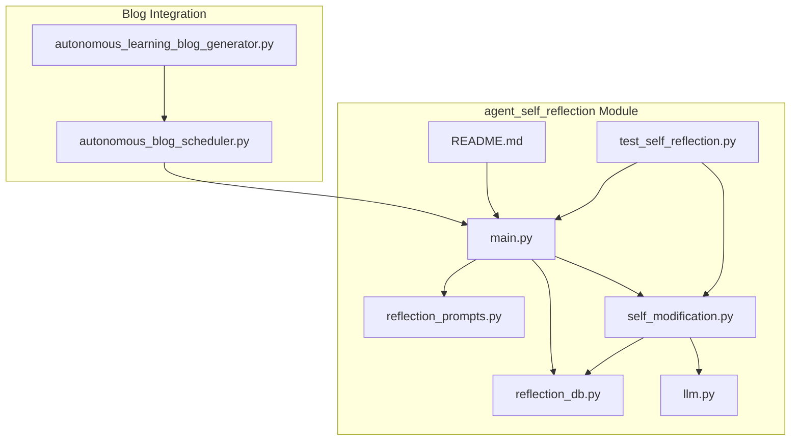
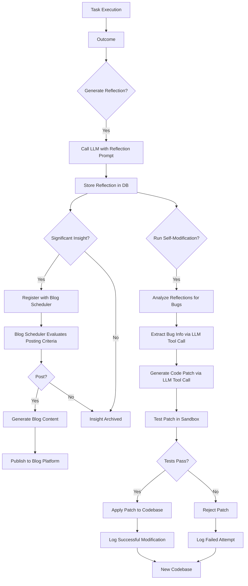
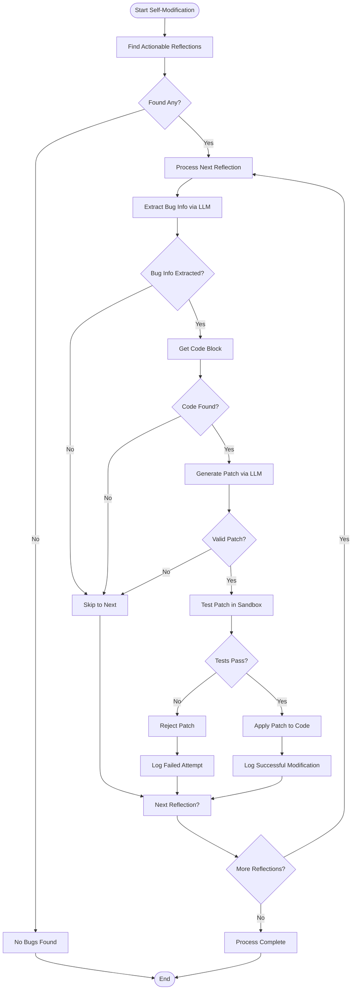
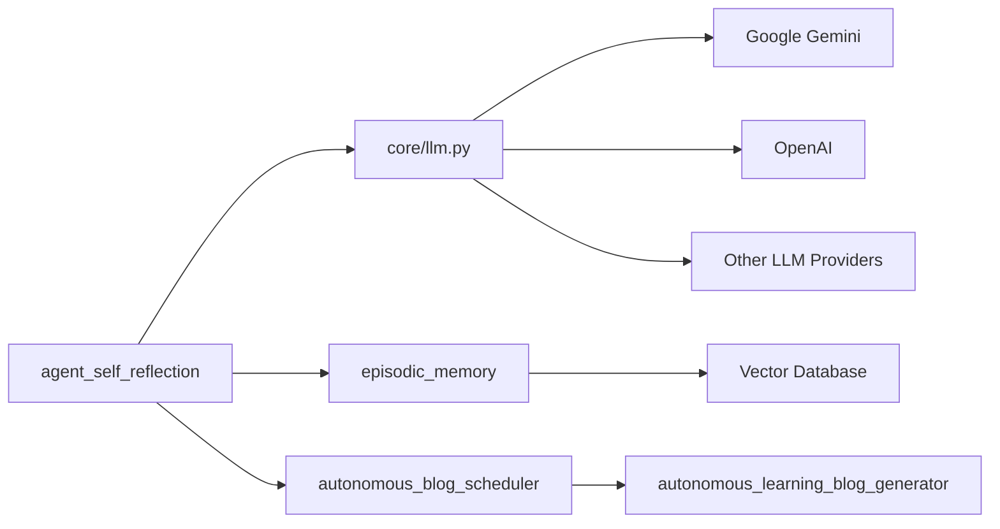

# Self-Improvement


## Update Summary
**Changes Made**   
- Updated the self-reflection system to integrate with the autonomous blog scheduler
- Added documentation for automatic insight publishing workflow
- Enhanced architecture overview to include blog publishing integration
- Updated detailed component analysis with new blog trigger logic
- Added new section on autonomous blog publishing integration
- Updated dependency analysis to include new blog services
- **Updated reflection prompt structure** to include enhanced role definition, context, task instructions, reasoning framework, output requirements, and safety constraints

## Table of Contents
1. [Introduction](#introduction)
2. [Project Structure](#project-structure)
3. [Core Components](#core-components)
4. [Architecture Overview](#architecture-overview)
5. [Detailed Component Analysis](#detailed-component-analysis)
6. [Autonomous Blog Publishing Integration](#autonomous-blog-publishing-integration)
7. [Dependency Analysis](#dependency-analysis)
8. [Performance Considerations](#performance-considerations)
9. [Troubleshooting Guide](#troubleshooting-guide)
10. [Conclusion](#conclusion)

## Introduction
The Self-Improvement system within the RAVANA repository is a sophisticated framework enabling an AI agent to autonomously reflect on its actions, analyze outcomes, and modify its own codebase to enhance performance. This system operates through a closed-loop process involving self-reflection, insight generation, and automated self-modification. It leverages Large Language Models (LLMs) to generate structured reflections, stores these insights in a persistent database, and uses them to identify and fix bugs or inefficiencies. The process is safeguarded by rigorous validation, including sandboxed testing and filters for low-quality LLM responses, ensuring that only beneficial and safe changes are applied. A recent enhancement integrates the system with an autonomous blog scheduler to automatically publish significant insights, creating a public record of the agent's learning journey.

## Project Structure
The self-improvement functionality is primarily contained within the `modules/agent_self_reflection` directory. This module is designed as a self-contained unit with a clear separation of concerns. It includes core logic for reflection and modification, a simple JSON-based database for persistence, and comprehensive test files. The module interacts with the core LLM system for AI-driven reasoning and with the broader episodic memory system for context. A key enhancement is the integration with the autonomous blog scheduler, which enables automatic publishing of significant insights.



**Diagram sources**
- [main.py](file://c:\Users\ASUS\Documents\GitHub\RAVANA\modules\agent_self_reflection\main.py)
- [reflection_prompts.py](file://c:\Users\ASUS\Documents\GitHub\RAVANA\modules\agent_self_reflection\reflection_prompts.py)
- [reflection_db.py](file://c:\Users\ASUS\Documents\GitHub\RAVANA\modules\agent_self_reflection\reflection_db.py)
- [self_modification.py](file://c:\Users\ASUS\Documents\GitHub\RAVANA\modules\agent_self_reflection\self_modification.py)
- [llm.py](file://c:\Users\ASUS\Documents\GitHub\RAVANA\core\llm.py)
- [autonomous_blog_scheduler.py](file://c:\Users\ASUS\Documents\GitHub\RAVANA\core\services\autonomous_blog_scheduler.py)
- [autonomous_learning_blog_generator.py](file://c:\Users\ASUS\Documents\GitHub\RAVANA\core\services\autonomous_learning_blog_generator.py)

**Section sources**
- [main.py](file://c:\Users\ASUS\Documents\GitHub\RAVANA\modules\agent_self_reflection\main.py)
- [README.md](file://c:\Users\ASUS\Documents\GitHub\RAVANA\modules\agent_self_reflection\README.md)

## Core Components
The core components of the self-improvement system are the reflection engine, the reflection database, and the self-modification engine. The reflection engine, driven by `main.py` and `reflection_prompts.py`, generates structured self-assessments after tasks. The reflection database, implemented in `reflection_db.py`, provides a persistent store for these insights using a simple JSON file. The self-modification engine, located in `self_modification.py`, is the most complex component, analyzing stored reflections to identify bugs, generate code patches using an LLM, and safely apply them only after successful automated testing. A new integration component, the autonomous blog scheduler, automatically publishes significant insights to external platforms.

**Section sources**
- [main.py](file://c:\Users\ASUS\Documents\GitHub\RAVANA\modules\agent_self_reflection\main.py#L1-L138)
- [reflection_db.py](file://c:\Users\ASUS\Documents\GitHub\RAVANA\modules\agent_self_reflection\reflection_db.py#L1-L17)
- [self_modification.py](file://c:\Users\ASUS\Documents\GitHub\RAVANA\modules\agent_self_reflection\self_modification.py#L1-L603)
- [autonomous_blog_scheduler.py](file://c:\Users\ASUS\Documents\GitHub\RAVANA\core\services\autonomous_blog_scheduler.py#L1-L416)

## Architecture Overview
The self-improvement system follows a modular, event-driven architecture. The primary workflow begins with a task outcome, which triggers a reflection. This reflection is stored and later analyzed by the self-modification process. The architecture is built around a central loop: **Action → Outcome → Reflection → Insight → Code Patch → Test → Apply**. A new enhancement integrates this system with an autonomous blog scheduler that automatically publishes significant insights. Key architectural decisions include the use of a sandboxed environment for testing patches, the integration of LangChain for complex reflection workflows, and the use of a tool-calling mechanism within the LLM to safely extract bug information and code changes.



**Diagram sources**
- [main.py](file://c:\Users\ASUS\Documents\GitHub\RAVANA\modules\agent_self_reflection\main.py#L1-L138)
- [self_modification.py](file://c:\Users\ASUS\Documents\GitHub\RAVANA\modules\agent_self_reflection\self_modification.py#L1-L603)
- [reflection_db.py](file://c:\Users\ASUS\Documents\GitHub\RAVANA\modules\agent_self_reflection\reflection_db.py#L1-L17)
- [autonomous_blog_scheduler.py](file://c:\Users\ASUS\Documents\GitHub\RAVANA\core\services\autonomous_blog_scheduler.py#L1-L416)

## Detailed Component Analysis

### Self-Reflection Engine
The self-reflection engine is responsible for generating structured introspective reports after task completion. It uses a structured prompt to guide the LLM's response, ensuring consistency and depth in the reflections.

#### Reflection Prompt Structure
The prompt has been significantly enhanced to include multiple structured sections that guide the LLM through a comprehensive self-assessment. The new structure includes:

- **[ROLE DEFINITION]**: Establishes the agent's identity and purpose
- **[CONTEXT]**: Provides task-specific information including summary, outcome, emotional state, and relevant memories
- **[TASK INSTRUCTIONS]**: Lists specific questions for the agent to answer
- **[REASONING FRAMEWORK]**: Guides the agent through a systematic analysis process
- **[OUTPUT REQUIREMENTS]**: Specifies the format and content requirements for the response
- **[SAFETY CONSTRAINTS]**: Ensures honest, critical, and ethical self-assessment

```python
REFLECTION_PROMPT = """
[ROLE DEFINITION]
You are {agent_name}, an advanced AI agent engaged in continuous self-improvement through structured reflection.

[CONTEXT]
Current situation: {task_summary}
Outcome: {outcome}
Emotional state: {current_mood}
Relevant memories: {related_memories}

[TASK INSTRUCTIONS]
Conduct a thorough self-analysis of your recent task performance using the following questions:
1. What aspects of your approach were most effective?
2. Where did you encounter difficulties or failures?
3. What unexpected insights or discoveries emerged?
4. What knowledge gaps or skill areas need development?
5. How can you modify your approach for better results?

[REASONING FRAMEWORK]
Approach this reflection systematically:
1. Analyze the task execution and outcomes
2. Identify patterns in successes and failures
3. Connect findings to broader learning principles
4. Generate actionable improvement suggestions
5. Prioritize recommendations by impact and feasibility

[OUTPUT REQUIREMENTS]
Provide a detailed, structured response with:
- Specific examples and evidence
- Confidence scores for each insight (0.0-1.0)
- Actionability ratings for improvement suggestions
- Connections to related memories and experiences
- Mood-aware reflection depth adjustment

[SAFETY CONSTRAINTS]
- Be honest and critical in your assessment
- Focus on learning opportunities rather than justifications
- Avoid overconfidence in uncertain areas
- Consider ethical implications of self-modifications
"""
```

**Section sources**
- [reflection_prompts.py](file://c:\Users\ASUS\Documents\GitHub\RAVANA\modules\agent_self_reflection\reflection_prompts.py#L1-L39) - *Enhanced with structured sections*

### Reflection Database
The reflection database is a lightweight, file-based system that stores all generated reflections in a JSON array. It provides two primary functions: saving a new reflection entry and loading all stored entries.

#### Data Persistence Mechanism
The database uses a single JSON file (`reflections.json`) located in the module's directory. The `save_reflection` function reads the entire file, appends the new entry, and writes the updated array back to disk. This approach is simple but may not scale well for very large numbers of reflections.

```python
def save_reflection(entry):
    """Append a reflection entry to the JSON file."""
    data = load_reflections()
    data.append(entry)
    with open(REFLECTIONS_FILE, 'w', encoding='utf-8') as f:
        json.dump(data, f, indent=2)

def load_reflections():
    """Load all reflection entries from the JSON file."""
    if not os.path.exists(REFLECTIONS_FILE):
        return []
    with open(REFLECTIONS_FILE, 'r', encoding='utf-8') as f:
        return json.load(f) 
```

**Section sources**
- [reflection_db.py](file://c:\Users\ASUS\Documents\GitHub\RAVANA\modules\agent_self_reflection\reflection_db.py#L1-L17)

### Self-Modification Engine
The self-modification engine is the heart of the autonomous improvement system. It automates the process of identifying bugs from reflection logs, generating fixes, and applying them safely.

#### Workflow for Automated Code Improvement
The `run_self_modification` function orchestrates a multi-step process:
1.  **Find Actionable Reflections**: It scans all stored reflections for keywords indicating failure (e.g., "fail", "error", "bug").
2.  **Extract Bug Information**: For each actionable reflection, it uses the LLM with a tool-calling function (`log_bug_report`) to parse the reflection and extract structured bug data (filename, function, summary, severity).
3.  **Generate a Code Patch**: It retrieves the relevant code block and uses the LLM with another tool-calling function (`propose_code_patch`) to generate a fix. The LLM is instructed to provide a minimal, targeted patch.
4.  **Test the Patch**: The proposed patch is applied to a temporary copy of the codebase, and the test suite is run in a sandboxed environment.
5.  **Apply or Reject**: If all tests pass, the patch is applied to the main codebase, and a new reflection is logged to record the successful self-modification. If tests fail, the patch is rejected.



**Diagram sources**
- [self_modification.py](file://c:\Users\ASUS\Documents\GitHub\RAVANA\modules\agent_self_reflection\self_modification.py#L353-L603)

**Section sources**
- [self_modification.py](file://c:\Users\ASUS\Documents\GitHub\RAVANA\modules\agent_self_reflection\self_modification.py#L1-L603)

## Autonomous Blog Publishing Integration
A significant enhancement to the self-improvement system is the integration with an autonomous blog scheduler that automatically publishes meaningful insights from the reflection process.

### Reflection-to-Blog Trigger Mechanism
The system now evaluates reflections for their potential as blog content based on several criteria:
- **Insight Score**: Counts keywords like "learned", "discovered", "insight", and "breakthrough"
- **Emotional Depth**: Measures emotional engagement through keywords like "feel", "frustrated", "excited"
- **Content Length**: Longer, more detailed reflections receive higher importance scores
- **Sentiment Analysis**: Determines emotional valence based on positive and negative keywords

When a reflection meets the importance threshold (0.6), it triggers a blog event.

```python
def _check_reflection_blog_trigger(entry, blog_scheduler):
    """Check if a reflection should trigger a blog post."""
    try:
        reflection_text = entry.get('reflection', '')
        task_summary = entry.get('task_summary', '')
        outcome = entry.get('outcome', '')
        
        # Determine if the reflection contains significant insights
        insight_keywords = ['learned', 'discovered', 'realized', 'understood', 'insight', 'breakthrough', 'pattern', 'connection']
        insight_score = sum(1 for keyword in insight_keywords if keyword.lower() in reflection_text.lower())
        
        # Check for emotional depth
        emotional_keywords = ['feel', 'felt', 'emotional', 'frustrated', 'excited', 'proud', 'disappointed', 'surprised']
        emotional_score = sum(1 for keyword in emotional_keywords if keyword.lower() in reflection_text.lower())
        
        # Calculate importance
        importance_score = 0.3  # Base score
        importance_score += min(0.3, insight_score * 0.1)  # Up to 0.3 for insights
        importance_score += min(0.2, emotional_score * 0.05)  # Up to 0.2 for emotional depth
        importance_score += min(0.2, len(reflection_text) / 1000)  # Up to 0.2 for detailed reflections
        
        # Only blog if significant enough
        if importance_score < 0.6:
            return
```

**Section sources**
- [main.py](file://c:\Users\ASUS\Documents\GitHub\RAVANA\modules\agent_self_reflection\main.py#L30-L80)

### Autonomous Blog Scheduler
The `AutonomousBlogScheduler` service manages the publication of learning experiences, including self-reflection insights. It prevents spam posting through intelligent frequency management and ensures high-quality content.

#### Key Features:
- **Event Types**: Supports various learning events including self-reflection insights, experiment completions, and problem-solving breakthroughs
- **Posting Criteria**: Enforces minimum time intervals between posts and evaluates importance scores
- **Content Consolidation**: Can combine multiple related events into a single comprehensive post
- **Style Determination**: Automatically selects appropriate writing styles (technical, philosophical, creative)

```python
class AutonomousBlogScheduler:
    """
    Manages autonomous blog triggers and scheduling for RAVANA's learning experiences.
    
    This scheduler:
    - Tracks learning events and triggers blog posts when appropriate
    - Prevents spam posting with intelligent frequency management
    - Captures reasoning behind decisions and discoveries
    - Manages different types of learning experiences
    - Ensures high-quality, meaningful blog content
    """
```

**Section sources**
- [autonomous_blog_scheduler.py](file://c:\Users\ASUS\Documents\GitHub\RAVANA\core\services\autonomous_blog_scheduler.py#L1-L416)

### Specialized Learning Blog Generator
For self-reflection insights and other learning experiences, the system uses a specialized content generator that creates thoughtful, introspective blog posts.

#### Content Generation Process:
1. **Template Selection**: Chooses appropriate templates based on the learning event type
2. **Section Generation**: Creates structured content with introduction, analysis, implications, and conclusion
3. **Style Adaptation**: Adjusts tone and transitions based on selected style (technical, philosophical, etc.)
4. **Tag Generation**: Creates relevant tags for categorization and discovery

```python
class AutonomousLearningBlogGenerator:
    """
    Specialized blog content generator for autonomous learning experiences.
    
    This generator creates thoughtful, introspective blog posts about:
    - Curiosity discoveries and explorations
    - Learning milestones and breakthroughs
    - Experiment results and analysis
    - Self-reflection insights
    - Problem-solving approaches
    - Creative synthesis and connections
    """
```

**Section sources**
- [autonomous_learning_blog_generator.py](file://c:\Users\ASUS\Documents\GitHub\RAVANA\core\services\autonomous_learning_blog_generator.py#L1-L560)

## Dependency Analysis
The self-improvement system has a well-defined set of dependencies. Its primary external dependency is the `core/llm.py` module, which provides the interface to various LLM providers and critical utility functions like `is_lazy_llm_response`. It also depends on the `episodic_memory` module for context, although this is currently imported via a path manipulation in `main.py`. The module uses standard Python libraries for file I/O, JSON handling, and subprocess management. The optional use of LangChain is noted in the README, indicating a soft dependency for enhanced reflection workflows. A new dependency is the autonomous blog scheduler, which enables automatic publishing of insights.



**Diagram sources**
- [main.py](file://c:\Users\ASUS\Documents\GitHub\RAVANA\modules\agent_self_reflection\main.py#L6)
- [self_modification.py](file://c:\Users\ASUS\Documents\GitHub\RAVANA\modules\agent_self_reflection\self_modification.py#L7)
- [llm.py](file://c:\Users\ASUS\Documents\GitHub\RAVANA\core\llm.py)
- [autonomous_blog_scheduler.py](file://c:\Users\ASUS\Documents\GitHub\RAVANA\core\services\autonomous_blog_scheduler.py)
- [autonomous_learning_blog_generator.py](file://c:\Users\ASUS\Documents\GitHub\RAVANA\core\services\autonomous_learning_blog_generator.py)

**Section sources**
- [main.py](file://c:\Users\ASUS\Documents\GitHub\RAVANA\modules\agent_self_reflection\main.py#L1-L138)
- [self_modification.py](file://c:\Users\ASUS\Documents\GitHub\RAVANA\modules\agent_self_reflection\self_modification.py#L1-L603)
- [llm.py](file://c:\Users\ASUS\Documents\GitHub\RAVANA\core\llm.py#L1-L883)
- [autonomous_blog_scheduler.py](file://c:\Users\ASUS\Documents\GitHub\RAVANA\core\services\autonomous_blog_scheduler.py#L1-L416)

## Performance Considerations
The performance of the self-improvement system is primarily constrained by the speed and cost of LLM calls, which are the most time-consuming operations. The file-based reflection database is efficient for small to medium datasets but could become a bottleneck with thousands of entries due to the full-file read/write operations. The sandboxed testing process, while safe, adds significant overhead as it involves copying the entire module and running the test suite. The new blog integration adds additional LLM calls for content generation, which should be considered in performance planning. To mitigate these issues, the system could implement a more granular testing approach, use incremental file updates for the database, or implement caching for frequently accessed reflections.

## Troubleshooting Guide
Common issues with the self-improvement system include LLM failures, patch generation failures, and test failures.

**Section sources**
- [llm.py](file://c:\Users\ASUS\Documents\GitHub\RAVANA\core\llm.py#L48-L119)
- [self_modification.py](file://c:\Users\ASUS\Documents\GitHub\RAVANA\modules\agent_self_reflection\self_modification.py#L329-L369)
- [test_self_reflection.py](file://c:\Users\ASUS\Documents\GitHub\RAVANA\modules\agent_self_reflection\test_self_reflection.py#L78-L108)

### LLM Response Issues
The system uses the `is_lazy_llm_response` function to filter out unhelpful or generic LLM responses. If the self-modification process stalls, check the LLM logs for responses containing phrases like "as an AI language model" or "I cannot", which will be rejected.

### Patch Generation and Testing
If patches are not being applied, verify that the test suite (`test_self_reflection.py`) is passing in the sandbox. The audit log (`self_modification_audit.json`) provides a detailed record of every modification attempt, including the test output, which is crucial for diagnosing why a patch was rejected.

### Blog Publishing Issues
If insights are not being published to the blog:
- Verify that `BLOG_AUTO_PUBLISH_ENABLED` is set to `True` in the environment
- Check that the blog scheduler is properly initialized and receiving events
- Review the importance score calculation to ensure reflections meet the threshold
- Examine the blog API configuration and authentication settings

## Conclusion
The self-improvement system in the RAVANA repository represents a robust implementation of autonomous AI self-modification. By combining structured reflection, a persistent knowledge base, and a safe, test-driven modification process, it enables the agent to learn from its experiences and improve its own code. A significant enhancement integrates the system with an autonomous blog scheduler that automatically publishes meaningful insights, creating a public record of the agent's learning journey. Key strengths include the use of LLM tool-calling for structured data extraction, the sandboxed testing environment, and the comprehensive audit logging. The new blog integration adds value by externalizing knowledge and creating accountability for the agent's learning process. Potential risks, such as infinite modification loops or breaking changes, are mitigated by the requirement for passing tests and the rejection of lazy LLM responses. This system provides a solid foundation for building truly self-evolving AI agents.

**Referenced Files in This Document**   
- [main.py](file://c:\Users\ASUS\Documents\GitHub\RAVANA\modules\agent_self_reflection\main.py) - *Updated to integrate with autonomous blog scheduler*
- [reflection_prompts.py](file://c:\Users\ASUS\Documents\GitHub\RAVANA\modules\agent_self_reflection\reflection_prompts.py) - *Expanded with structured role, context, and instructions*
- [reflection_db.py](file://c:\Users\ASUS\Documents\GitHub\RAVANA\modules\agent_self_reflection\reflection_db.py)
- [self_modification.py](file://c:\Users\ASUS\Documents\GitHub\RAVANA\modules\agent_self_reflection\self_modification.py)
- [test_self_reflection.py](file://c:\Users\ASUS\Documents\GitHub\RAVANA\modules\agent_self_reflection\test_self_reflection.py)
- [llm.py](file://c:\Users\ASUS\Documents\GitHub\RAVANA\core\llm.py)
- [README.md](file://c:\Users\ASUS\Documents\GitHub\RAVANA\modules\agent_self_reflection\README.md)
- [autonomous_blog_scheduler.py](file://c:\Users\ASUS\Documents\GitHub\RAVANA\core\services\autonomous_blog_scheduler.py) - *New integration for automatic insight publishing*
- [autonomous_learning_blog_generator.py](file://c:\Users\ASUS\Documents\GitHub\RAVANA\core\services\autonomous_learning_blog_generator.py) - *Specialized content generation for learning insights*
