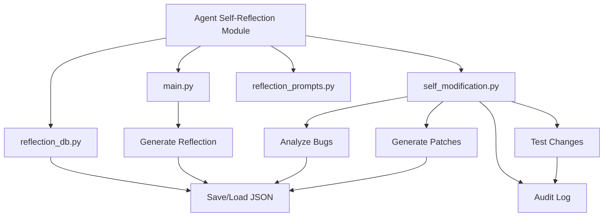
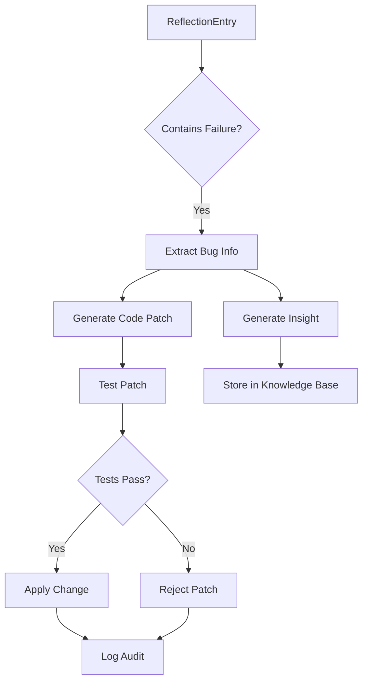
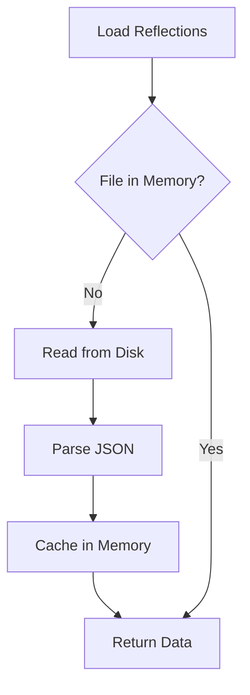

# Reflection Data Management


## Table of Contents
1. [Introduction](#introduction)
2. [Project Structure](#project-structure)
3. [Core Components](#core-components)
4. [Data Model and Schema](#data-model-and-schema)
5. [Entity Relationships](#entity-relationships)
6. [Data Access Patterns](#data-access-patterns)
7. [Sample Queries](#sample-queries)
8. [Performance Considerations](#performance-considerations)
9. [Data Lifecycle and Privacy](#data-lifecycle-and-privacy)
10. [Migration and Schema Updates](#migration-and-schema-updates)

## Introduction
This document provides comprehensive documentation for the reflection data management system within the RAVANA repository. The system enables self-reflection, insight generation, and self-modification capabilities for an AI agent. It stores reflection outcomes in a persistent JSON file and supports automated analysis of failures to propose and test code changes. While no formal SQL database schema exists for reflection entities, the system leverages a file-based storage mechanism and integrates with a broader knowledge service for insight persistence.

## Project Structure
The reflection system is primarily contained within the `modules/agent_self_reflection` directory. It interacts with core components such as the LLM interface, knowledge service, and decision engine. The data is stored locally in JSON format, and the system supports command-line execution for reflection and self-modification workflows.



**Diagram sources**
- [main.py](file://modules/agent_self_reflection/main.py#L0-L51)
- [reflection_db.py](file://modules/agent_self_reflection/reflection_db.py#L0-L17)
- [self_modification.py](file://modules/agent_self_reflection/self_modification.py#L0-L603)

**Section sources**
- [main.py](file://modules/agent_self_reflection/main.py#L0-L51)
- [reflection_db.py](file://modules/agent_self_reflection/reflection_db.py#L0-L17)

## Core Components

The core functionality of the reflection system is distributed across several files:

- **main.py**: Entry point for generating reflections and initiating self-modification.
- **reflection_db.py**: Handles persistence of reflection entries to `reflections.json`.
- **self_modification.py**: Implements logic for detecting actionable reflections, extracting bug reports, generating code patches, and testing changes.
- **reflection_prompts.py**: Defines the prompt template used to structure reflection content.

Reflection entries are created via `reflect_on_task()` in `main.py`, which formats a prompt using `REFLECTION_PROMPT`, sends it to the LLM, and saves the structured response using `save_reflection()`.

**Section sources**
- [main.py](file://modules/agent_self_reflection/main.py#L0-L51)
- [reflection_db.py](file://modules/agent_self_reflection/reflection_db.py#L0-L17)
- [reflection_prompts.py](file://modules/agent_self_reflection/reflection_prompts.py#L0-L6)

## Data Model and Schema

### ReflectionEntry
Reflection data is stored as a list of JSON objects in `reflections.json`. Each entry follows this structure:

```json
{
  "timestamp": "2025-07-01T00:00:00Z",
  "task_summary": "Test bug in dummy_function",
  "outcome": "Function failed on edge case.",
  "reflection": "1. What failed?\n- The function 'dummy_function' in 'llm.py' does not handle empty input correctly.\n2. ..."
}
```

**Field Definitions:**
- **timestamp**: ISO 8601 formatted UTC timestamp of the reflection.
- **task_summary**: Brief description of the task performed.
- **outcome**: Description of the result or output of the task.
- **reflection**: LLM-generated structured response containing numbered sections (1. What worked?, 2. What failed?, etc.).

No formal database schema (e.g., SQLModel) exists for `ReflectionEntry`. The data is managed via simple file I/O operations in `reflection_db.py`.

### InsightRecord
Insights derived from reflections are not stored as a separate entity within the reflection module. Instead, they are passed to the `KnowledgeService` via `add_knowledge()` for integration into the broader knowledge base.

Example insight generation:
```python
self.agi_system.knowledge_service.add_knowledge(
    content=insight,
    source="reflection",
    category="insight"
)
```

**Field Definitions:**
- **content**: Textual insight generated from reflection analysis.
- **source**: Origin of the knowledge (e.g., "reflection").
- **category**: Classification (e.g., "insight").

**Section sources**
- [self_modification.py](file://modules/agent_self_reflection/self_modification.py#L407-L439)
- [knowledge_service.py](file://services/knowledge_service.py#L0-L50)

## Entity Relationships

There is no formal relational schema for reflection entities. However, logical relationships exist through data flow and processing:

- **ReflectionEntry → InsightRecord**: A reflection entry may lead to an insight, which is then stored in the knowledge base via `KnowledgeService`.
- **ReflectionEntry → CodeChangeProposal**: Actionable reflections (those indicating failure) are analyzed to extract bug information, which leads to a proposed code patch.
- **CodeChangeProposal → AuditLog**: Each patch attempt is recorded in `self_modification_audit.json`, including test results and application status.

These relationships are processed sequentially by `run_self_modification()` in `self_modification.py`.



**Diagram sources**
- [self_modification.py](file://modules/agent_self_reflection/self_modification.py#L329-L369)
- [knowledge_service.py](file://services/knowledge_service.py#L0-L50)

## Data Access Patterns

### Reflection Loop
The reflection loop follows this pattern:
1. After task completion, `reflect_on_task()` is called with `task_summary` and `outcome`.
2. An LLM prompt is generated using `REFLECTION_PROMPT`.
3. The LLM response is saved as a new `ReflectionEntry` via `save_reflection()`.

### Analytics Tools
Analytics are performed by loading all reflections via `load_reflections()` and filtering or analyzing them in memory. For example, `find_actionable_reflections()` scans the `reflection` field for keywords like "fail", "error", or "bug".

### Knowledge Integration
Insights from reflections are pushed to the `KnowledgeService`, which manages a separate database (not detailed here) for long-term knowledge storage.

**Section sources**
- [main.py](file://modules/agent_self_reflection/main.py#L0-L30)
- [self_modification.py](file://modules/agent_self_reflection/self_modification.py#L0-L603)

## Sample Queries

Since data is stored in JSON, queries are implemented in Python:

### Retrieve All Reflections
```python
from reflection_db import load_reflections
entries = load_reflections()
```

### Retrieve Historical Reflections (Last 7 Days)
```python
from datetime import datetime, timedelta
import json

def get_recent_reflections(days=7):
    cutoff = datetime.now().astimezone() - timedelta(days=days)
    entries = load_reflections()
    return [e for e in entries if datetime.fromisoformat(e['timestamp']) > cutoff]
```

### Find Trending Insights (Frequent Failure Patterns)
```python
from collections import Counter
import re

def get_common_failures():
    entries = load_reflections()
    failures = []
    for entry in entries:
        reflection = entry.get('reflection', '')
        # Extract "What failed?" section
        match = re.search(r"2\.\s*What failed\?\s*(.*?)(?=\n\d\.)", reflection, re.DOTALL)
        if match:
            failures.append(match.group(1).strip())
    return Counter(failures).most_common(5)
```

**Section sources**
- [reflection_db.py](file://modules/agent_self_reflection/reflection_db.py#L0-L17)
- [self_modification.py](file://modules/agent_self_reflection/self_modification.py#L0-L603)

## Performance Considerations

### Query Optimization
- **Full Load**: All reflections are loaded into memory; performance degrades as the file grows.
- **Indexing**: No indexing is implemented. Time-series queries rely on linear scans.
- **Optimization Suggestion**: Migrate to a lightweight database (e.g., SQLite) with indexed timestamps.

### Caching Strategies
- No explicit caching is implemented. The JSON file is read on every access.
- **Recommendation**: Cache parsed reflections in memory during a session to avoid repeated I/O.

### Retention Policies
- No automatic retention or archival is implemented.
- **Recommendation**: Implement log rotation or archival to `reflections_archive.json` for entries older than 90 days.



**Diagram sources**
- [reflection_db.py](file://modules/agent_self_reflection/reflection_db.py#L0-L17)

## Data Lifecycle and Privacy

### Data Lifecycle
- **Creation**: Generated after task completion.
- **Modification**: Not directly modified; new entries are appended.
- **Archival**: Not implemented.
- **Deletion**: Manual only.

### Archival Procedures
No automated archival exists. A future enhancement could include:
```python
def archive_old_reflections(days=90):
    # Move entries older than `days` to archive file
    pass
```

### Privacy Controls
- No encryption or access controls are implemented.
- Reflections may contain self-assessment content.
- **Recommendation**: Add optional encryption for sensitive reflections and access logging.

**Section sources**
- [reflection_db.py](file://modules/agent_self_reflection/reflection_db.py#L0-L17)
- [self_modification.py](file://modules/agent_self_reflection/self_modification.py#L0-L603)

## Migration and Schema Updates

### Current State
- Storage: `reflections.json` (flat JSON array)
- No versioning or migration system.

### Example Migration: Add Version Field
To add schema versioning:

1. **Update Entry Structure**:
```json
{
  "version": 1,
  "timestamp": "...",
  "task_summary": "...",
  "outcome": "...",
  "reflection": "..."
}
```

2. **Migration Script**:
```python
def migrate_to_v1():
    entries = load_reflections()
    for entry in entries:
        if 'version' not in entry:
            entry['version'] = 1
    with open(REFLECTIONS_FILE, 'w') as f:
        json.dump(entries, f, indent=2)
```

3. **Update Writers**:
Modify `reflect_on_task()` to include `"version": 1`.

**Section sources**
- [reflection_db.py](file://modules/agent_self_reflection/reflection_db.py#L0-L17)
- [main.py](file://modules/agent_self_reflection/main.py#L0-L30)

**Referenced Files in This Document**   
- [reflection_db.py](file://modules/agent_self_reflection/reflection_db.py)
- [main.py](file://modules/agent_self_reflection/main.py)
- [self_modification.py](file://modules/agent_self_reflection/self_modification.py)
- [test_self_reflection.py](file://modules/agent_self_reflection/test_self_reflection.py)
- [reflection_prompts.py](file://modules/agent_self_reflection/reflection_prompts.py)
- [models.py](file://database/models.py)
- [knowledge_service.py](file://services/knowledge_service.py)