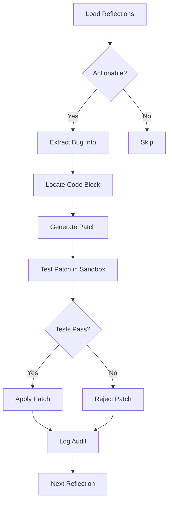
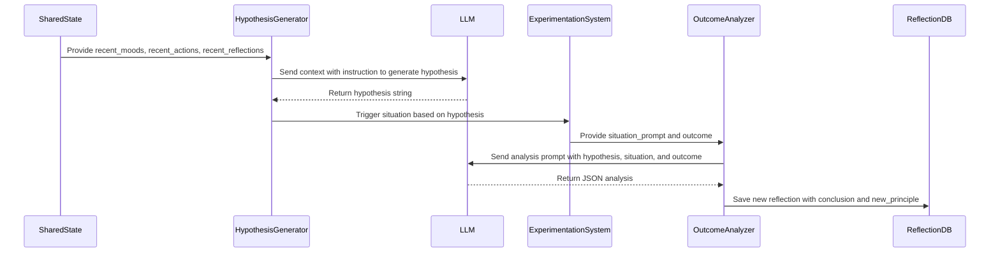

# Reflection Prompts Engineering


## Table of Contents
1. [Introduction](#introduction)
2. [Core Prompt Template Design](#core-prompt-template-design)
3. [Self-Modification System Architecture](#self-modification-system-architecture)
4. [Dynamic Hypothesis Generation and Experimentation](#dynamic-hypothesis-generation-and-experimentation)
5. [Data Persistence and Reflection Storage](#data-persistence-and-reflection-storage)
6. [LLM Interaction and Response Validation](#llm-interaction-and-response-validation)
7. [Code Safety and Patch Validation](#code-safety-and-patch-validation)
8. [Conclusion](#conclusion)

## Introduction
This document provides a comprehensive analysis of the reflection prompts engineering system within the RAVANA AGI framework. The system enables the AI agent to perform structured self-assessment, extract actionable insights from its performance, and autonomously modify its own codebase to improve functionality. The core of this system lies in well-designed prompt templates, dynamic variable injection, and a robust feedback loop that connects reflection outcomes to concrete actions such as bug fixing and hypothesis testing. The architecture integrates tightly with the LLM interface, decision engine, and persistence layer to create a closed-loop learning mechanism. This documentation details the design principles, implementation patterns, and safety mechanisms that make this self-reflective capability both powerful and secure.

## Core Prompt Template Design

The foundation of the reflection system is the `REFLECTION_PROMPT` template defined in `reflection_prompts.py`. This template is designed to elicit structured, introspective responses from the LLM by framing the AI as an agent journaling after completing a major task. The prompt uses a clear, numbered question format to guide the LLM toward producing actionable insights.

```python
REFLECTION_PROMPT = (
    "You are an AI agent journaling after a major task. "
    "Given the following summary and outcome, answer these questions in a structured way:\n"
    "1. What worked?\n2. What failed?\n3. What surprised you?\n4. What do you still need to learn?\n"
    "Task Summary: {task_summary}\nOutcome: {outcome}\n"
    "Respond in a clear, numbered format."
)
```

This design follows key principles of effective prompt engineering:
- **Context Injection**: The `{task_summary}` and `{outcome}` variables are dynamically populated with recent task data, ensuring the reflection is grounded in actual experience.
- **Mood Framing**: The prompt sets a reflective, journaling mood to encourage honest self-assessment.
- **Structured Output Directive**: The requirement for a "clear, numbered format" ensures the output is easily parsable for downstream processing.
- **Actionable Insight Focus**: The four questions are specifically chosen to extract information about successes, failures, unexpected events, and knowledge gaps—each of which can drive different types of improvement actions.

The template is used as the basis for generating reflection prompts that are fed to the LLM through the `call_llm` function, with the resulting text stored in the reflection database for further analysis.

**Section sources**
- [reflection_prompts.py](file://modules/agent_self_reflection/reflection_prompts.py#L0-L6)

## Self-Modification System Architecture

The self-modification system transforms reflection outputs into concrete code changes through a multi-stage workflow. This system is implemented in `self_modification.py` and operates as a background process that scans for actionable reflections and attempts to automatically fix identified issues.



**Diagram sources**
- [self_modification.py](file://modules/agent_self_reflection/self_modification.py#L329-L439)

The architecture includes several key components:
- **Actionable Reflection Detection**: The `find_actionable_reflections()` function scans reflection texts for keywords like "fail", "error", "bug", etc., to identify entries that may require code changes.
- **Bug Information Extraction**: The `extract_bug_info()` function uses tool calling to parse reflections and extract structured bug reports containing filename, function name, summary, and severity.
- **Code Context Retrieval**: The `extract_code_block()` function locates the relevant code section in the source file, including surrounding context lines to preserve context.
- **Patch Generation**: The `generate_patch()` function uses the LLM with a specific tool call to propose a code fix, ensuring the output is in a structured format.
- **Sandboxed Testing**: The `test_patch()` function applies the patch in a temporary directory and runs the test suite before applying it to the real codebase.
- **Audit Logging**: All modification attempts are recorded in `self_modification_audit.json` for traceability and debugging.

This architecture ensures that self-modification is safe, auditable, and only proceeds when automated tests confirm the fix does not break existing functionality.

**Section sources**
- [self_modification.py](file://modules/agent_self_reflection/self_modification.py#L329-L439)

## Dynamic Hypothesis Generation and Experimentation

Beyond reactive bug fixing, the system supports proactive learning through a hypothesis-driven experimentation loop. This is implemented via two key functions in `self_modification.py`: `generate_hypothesis()` and `analyze_experiment_outcome()`.

The `generate_hypothesis()` function analyzes the agent's recent state—including mood history, action history, and past reflections—to formulate a testable hypothesis about its own performance. For example, it might generate: "I hypothesize that my planning accuracy decreases when I am in a 'sad' or 'anxious' mood, leading to less effective outcomes."



**Diagram sources**
- [self_modification.py](file://modules/agent_self_reflection/self_modification.py#L445-L576)

The `analyze_experiment_outcome()` function then evaluates whether experimental results support or refute the hypothesis. It uses a structured prompt to get a JSON response containing:
- **conclusion**: ("supported", "refuted", or "inconclusive")
- **reasoning**: Logical explanation for the conclusion
- **new_principle**: A concise takeaway that becomes a new belief for the agent

If an ambitious hypothesis fails, the system can convert it into a long-term goal using the `plan_from_context()` function from the decision engine, ensuring that valuable insights are preserved even when immediate validation fails.

**Section sources**
- [self_modification.py](file://modules/agent_self_reflection/self_modification.py#L445-L576)
- [planner.py](file://modules/decision_engine/planner.py#L12-L36)

## Data Persistence and Reflection Storage

Reflections are persisted using a simple but effective JSON-based storage system implemented in `reflection_db.py`. This module provides two primary functions: `save_reflection()` and `load_reflections()`.

```python
REFLECTIONS_FILE = os.path.join(os.path.dirname(__file__), 'reflections.json')

def save_reflection(entry):
    """Append a reflection entry to the JSON file."""
    data = load_reflections()
    data.append(entry)
    with open(REFLECTIONS_FILE, 'w', encoding='utf-8') as f:
        json.dump(data, f, indent=2)

def load_reflections():
    """Load all reflection entries from the JSON file."""
    if not os.path.exists(REFLECTIONS_FILE):
        return []
    with open(REFLECTIONS_FILE, 'r', encoding='utf-8') as f:
        return json.load(f)
```

Each reflection entry is a dictionary containing:
- **timestamp**: ISO format timestamp of when the reflection was created
- **task_summary**: Brief description of the task that was reflected upon
- **outcome**: Summary of the task's result
- **reflection**: The structured, numbered response generated by the LLM

The system uses append-only semantics to preserve historical data, and the file is stored in UTF-8 encoding to support international characters. This persistence layer serves as the memory for the agent's self-improvement cycle, allowing both the self-modification system and hypothesis generator to access historical performance data.

**Section sources**
- [reflection_db.py](file://modules/agent_self_reflection/reflection_db.py#L0-L17)

## LLM Interaction and Response Validation

All interactions with language models are mediated through the `call_llm()` function in `core/llm.py`. This function implements a robust provider fallback system that tries multiple LLM providers in sequence before falling back to Gemini.

```python
def call_llm(prompt, preferred_provider=None, model=None):
    """
    Try all providers in order, fallback to Gemini if all fail.
    """
    providers = [
        (call_zuki, 'zuki'),
        (call_electronhub, 'electronhub'),
        (call_zanity, 'zanity'),
        (call_a4f, 'a4f'),
    ]
    if preferred_provider:
        providers = sorted(providers, key=lambda x: x[1] != preferred_provider)
    for func, name in providers:
        result = func(prompt, model) if name != 'a4f' else func(prompt)
        if result:
            return result
    # Fallback to Gemini
    return call_gemini(prompt)
```

To ensure response quality and safety, the system employs the `is_lazy_llm_response()` validation function. This function detects and rejects generic, unhelpful, or placeholder responses by checking for common lazy phrases such as "as an ai language model", "i'm unable to", "[insert code here]", and others. It also rejects responses that are too short or consist only of code block markers.

```python
def is_lazy_llm_response(text):
    """
    Detects if the LLM response is lazy, generic, or incomplete.
    Returns True if the response is not actionable.
    """
    lazy_phrases = [
        "as an ai language model",
        "i'm unable to",
        "i cannot",
        "i apologize",
        # ... additional phrases
    ]
    if not text:
        return True
    text_lower = str(text).strip().lower()
    if not text_lower or len(text_lower) < 10:
        return True
    for phrase in lazy_phrases:
        if phrase in text_lower:
            return True
    return False
```

This validation is applied throughout the reflection system to ensure that only high-quality, substantive responses are used for self-modification or hypothesis generation.

**Section sources**
- [llm.py](file://core/llm.py#L296-L313)
- [llm.py](file://core/llm.py#L770-L818)

## Code Safety and Patch Validation

When generating code patches, the system employs multiple safety checks to prevent harmful or trivial changes. In addition to the general `is_lazy_llm_response()` check, it uses a specialized `is_valid_code_patch()` function to validate that proposed code changes are meaningful.

```python
def is_valid_code_patch(original_code, new_code):
    """
    Checks if the new_code is non-trivial and not just a copy of the original_code.
    Returns True if the patch is likely meaningful.
    """
    if not new_code or str(new_code).strip() == "":
        return False
    # If the new code is identical to the original, it's not a real patch
    if original_code is not None and str(original_code).strip() == str(new_code).strip():
        return False
    # If the new code is just a comment or a single line, it's likely not useful
    lines = [l for l in str(new_code).strip().splitlines() if l.strip() and not l.strip().startswith("#")]
    if len(lines) < 2:
        return False
    return True
```

This function ensures that:
1. The new code is not empty
2. The new code differs from the original (preventing no-op "patches")
3. The new code contains at least two non-comment lines of actual code

These checks work in conjunction with the sandboxed testing system to create a multi-layered safety approach: first filtering out lazy or invalid responses at the LLM level, then validating that code patches are non-trivial, and finally testing the patch in an isolated environment before applying it to the production codebase. This layered validation ensures that self-modification remains a safe and reliable mechanism for autonomous improvement.

**Section sources**
- [llm.py](file://core/llm.py#L821-L835)

## Conclusion
The reflection prompts engineering system in RAVANA represents a sophisticated implementation of AI self-improvement through structured introspection. By combining well-designed prompt templates, dynamic state injection, and a robust feedback loop, the system enables the agent to learn from its experiences and autonomously enhance its capabilities. The architecture prioritizes safety through multiple validation layers, sandboxed testing, and comprehensive audit logging. Key innovations include the hypothesis-driven experimentation loop, which allows for proactive learning, and the integration with the decision engine for long-term goal management. This system demonstrates how prompt engineering, when combined with careful system design, can create powerful mechanisms for autonomous AI development and adaptation.

**Referenced Files in This Document**   
- [reflection_prompts.py](file://modules/agent_self_reflection/reflection_prompts.py#L0-L6)
- [self_modification.py](file://modules/agent_self_reflection/self_modification.py#L445-L576)
- [reflection_db.py](file://modules/agent_self_reflection/reflection_db.py#L0-L17)
- [planner.py](file://modules/decision_engine/planner.py#L12-L36)
- [llm.py](file://core/llm.py#L296-L313)
- [llm.py](file://core/llm.py#L770-L818)
- [llm.py](file://core/llm.py#L821-L835)